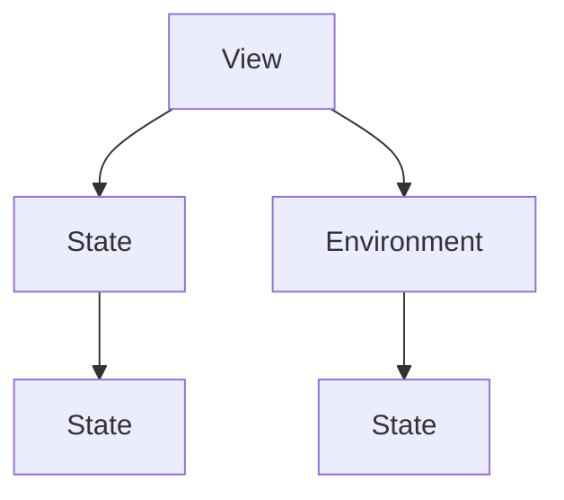

                 

 **关键词**：SwiftUI、声明式UI、苹果、框架、UI设计、用户界面

**摘要**：SwiftUI 是苹果公司推出的一款全新的声明式 UI 框架，它旨在简化 iOS、macOS、watchOS 和 tvOS 的 UI 开发过程。本文将详细探讨 SwiftUI 的背景、核心概念、算法原理、数学模型、项目实践以及未来应用前景，帮助开发者更好地理解和应用这一强大的 UI 开发工具。

## 1. 背景介绍

随着智能手机和移动设备的普及，用户界面（UI）设计变得越来越重要。传统的 UI 开发方法往往涉及到复杂的视图层次结构，这使得开发者需要花费大量的时间和精力来管理视图的渲染和状态更新。为了解决这一问题，苹果公司推出了 SwiftUI，一个全新的声明式 UI 框架。

SwiftUI 最早在 2019 年的 WWDC（苹果全球开发者大会）上亮相，它结合了 Swift 编程语言的高效性和声明式 UI 开发的便捷性，为开发者提供了一个全新的 UI 开发体验。SwiftUI 支持多种平台，包括 iOS、macOS、watchOS 和 tvOS，使得开发者能够使用相同的代码库来创建跨平台的应用程序。

## 2. 核心概念与联系

SwiftUI 的核心概念包括 View、State 和 Environment。这些概念相互作用，构成了 SwiftUI 的声明式编程模型。

### 2.1 View

View 是 SwiftUI 的基本构建块，它代表了应用程序中的一个可视元素。View 可以是文本、图片、按钮等，也可以是更复杂的结构。SwiftUI 通过定义 View 类型来创建 UI，这使得开发者可以以声明式的方式描述 UI 的外观和行为。

### 2.2 State

State 用于表示 View 的状态，如文本内容、颜色、大小等。SwiftUI 提供了多种 State 属性，如 `.text`、`.background`、`.font` 等，开发者可以通过这些属性来动态更新 View 的状态。

### 2.3 Environment

Environment 用于提供应用程序的环境信息，如设备尺寸、方向、语言等。SwiftUI 通过 Environment 接口将环境信息传递给 View，使得开发者可以根据不同的环境来定制 View 的外观和行为。

下面是一个简单的 Mermaid 流程图，展示了 View、State 和 Environment 之间的相互作用：



## 3. 核心算法原理 & 具体操作步骤

### 3.1 算法原理概述

SwiftUI 的核心算法原理是基于声明式编程模型。在声明式编程中，开发者通过描述 UI 的外观和行为来构建应用程序，而不是通过编写大量的控制逻辑来管理视图的状态和渲染。

SwiftUI 使用一种称为“渲染树”的数据结构来表示 UI。渲染树是由 View 类型组成的树状结构，每个 View 类型都代表应用程序中的一个可视元素。SwiftUI 的渲染引擎会根据渲染树来渲染 UI，并且它会自动处理视图的状态更新和渲染优化。

### 3.2 算法步骤详解

1. **定义 View 类型**：首先，开发者需要定义应用程序中的 View 类型，这通常涉及到使用 Swift 中的类或结构体来定义 View。
2. **创建渲染树**：在定义 View 类型后，SwiftUI 会根据 View 类型创建渲染树。渲染树由 View 类型及其子 View 类型组成。
3. **渲染 UI**：SwiftUI 的渲染引擎会根据渲染树来渲染 UI。在渲染过程中，渲染引擎会根据 View 的属性来计算 UI 的外观，并且会自动处理视图的状态更新。
4. **处理用户交互**：当用户与 UI 进行交互时，SwiftUI 会根据用户的操作来更新 UI 的状态，并且重新渲染 UI。

### 3.3 算法优缺点

**优点**：

- 简化了 UI 开发过程，减少了开发者需要编写的代码量。
- 自动处理视图的状态更新和渲染优化，提高了 UI 的性能。
- 支持跨平台开发，使得开发者可以使用相同的代码库来创建 iOS、macOS、watchOS 和 tvOS 的应用程序。

**缺点**：

- 在一些复杂场景下，声明式编程可能会降低代码的可读性和可维护性。
- 由于 SwiftUI 是较新的框架，部分功能和文档可能还不够完善。

### 3.4 算法应用领域

SwiftUI 适用于各种 UI 开发场景，包括但不限于：

- iOS 应用程序：SwiftUI 可以用来创建各种 iOS 应用程序，从简单的表单应用程序到复杂的多页面应用程序。
- macOS 应用程序：SwiftUI 可以用来创建 macOS 应用程序，包括桌面应用程序和菜单栏应用程序。
- watchOS 应用程序：SwiftUI 可以用来创建 watchOS 应用程序，使得开发者能够更轻松地创建智能手表应用程序。
- tvOS 应用程序：SwiftUI 可以用来创建 tvOS 应用程序，使得开发者能够更轻松地创建苹果电视应用程序。

## 4. 数学模型和公式 & 详细讲解 & 举例说明

SwiftUI 中的数学模型主要用于计算 View 的属性，如位置、大小、颜色等。以下是一个简单的例子，说明如何使用 SwiftUI 的数学模型来创建一个简单的圆形 View：

### 4.1 数学模型构建

在 SwiftUI 中，可以使用 `Shape` 协议来创建自定义的形状。`Shape` 协议要求实现一个 `path(in:boundding:resolution:)` 方法，该方法返回一个路径，用于绘制形状。

```swift
struct CircleShape: Shape {
    func path(in rect: CGRect) -> Path {
        return Path(ellipseIn: rect)
    }
}
```

### 4.2 公式推导过程

在上述代码中，`Path(ellipseIn: rect)` 使用了一个椭圆方程来绘制圆形。椭圆方程的一般形式为：

\[ \frac{x^2}{a^2} + \frac{y^2}{b^2} = 1 \]

其中，\(a\) 和 \(b\) 分别是椭圆的半长轴和半短轴。

### 4.3 案例分析与讲解

假设我们想要创建一个半径为 50 的圆形 View，我们可以按照以下步骤进行：

1. 定义一个 `CircleShape` 结构体，实现 `Shape` 协议。
2. 在 `CircleShape` 结构体中，实现 `path(in:boundding:resolution:)` 方法，使用椭圆方程来绘制圆形。
3. 在 SwiftUI 的视图中，使用 `Shape` 和 `CircleShape` 来绘制圆形。

```swift
struct ContentView: View {
    var body: some View {
        CircleShape()
            .fill(Color.blue)
            .frame(width: 100, height: 100)
    }
}
```

在这个例子中，我们创建了一个蓝色的圆形 View，半径为 50，大小为 100x100。

## 5. 项目实践：代码实例和详细解释说明

在本节中，我们将通过一个简单的示例来展示如何使用 SwiftUI 创建一个简单的用户界面，并解释其代码实现。

### 5.1 开发环境搭建

在开始之前，请确保您已经安装了 Xcode 12 或更高版本。如果您还没有 Xcode，可以从 Apple 官方网站下载并安装。

### 5.2 源代码详细实现

以下是一个简单的 SwiftUI 应用程序，它包含一个文本标签和一个按钮：

```swift
import SwiftUI

struct ContentView: View {
    @State private var text = "Hello, SwiftUI!"

    var body: some View {
        VStack {
            Text(text)
                .font(.largeTitle)
                .padding()

            Button("点击我") {
                text = "你好，SwiftUI！"
            }
            .padding()
            .background(Color.blue)
            .foregroundColor(.white)
            .cornerRadius(10)
        }
    }
}
```

### 5.3 代码解读与分析

1. **导入 SwiftUI 模块**：首先，我们导入 SwiftUI 模块，这允许我们使用 SwiftUI 的所有功能和组件。
2. **定义 ContentView 结构体**：`ContentView` 结构体继承自 `View` 协议，这意味着它代表了一个视图。
3. **使用 @State 属性**：`@State` 属性用于存储和更新文本标签的内容。这里，我们将其初始化为 "Hello, SwiftUI!"。
4. **VStack 布局**：`VStack` 布局用于垂直堆叠视图。在本例中，我们使用它来堆叠文本标签和按钮。
5. **Text 视图**：`Text` 视图用于显示文本。我们使用 `.font(.largeTitle)` 来设置字体大小，并使用 `.padding()` 来增加文本周围的空白。
6. **Button 视图**：`Button` 视图用于创建一个按钮。我们使用 `.padding()` 来设置按钮的填充，使用 `.background(Color.blue)` 来设置按钮的背景颜色，并使用 `.foregroundColor(.white)` 来设置按钮的文本颜色。`.cornerRadius(10)` 用于设置按钮的圆角。
7. **点击事件处理**：当用户点击按钮时，SwiftUI 会调用 `Button` 视图内部的闭包，更新 `text` 的状态，这将导致文本标签的内容更新。

### 5.4 运行结果展示

运行此应用程序后，您将看到一个带有文本标签和按钮的简单界面。点击按钮时，文本标签的内容将更新为 "你好，SwiftUI！"。


## 6. 实际应用场景

SwiftUI 的声明式 UI 开发模型非常适合以下应用场景：

- **移动应用程序**：SwiftUI 是创建 iOS、watchOS 和 tvOS 移动应用程序的绝佳选择。它简化了 UI 的设计和实现过程，使得开发者可以更快地创建高质量的应用程序。
- **桌面应用程序**：SwiftUI 也适用于创建 macOS 应用程序。它提供了丰富的 UI 组件和布局功能，使得开发者可以轻松地创建现代化的桌面应用程序。
- **Web 应用程序**：虽然 SwiftUI 最初是为 Apple 生态系统设计的，但通过第三方库（如 SwiftUI for Web），开发者也可以在 Web 上使用 SwiftUI，从而创建跨平台的应用程序。
- **数据可视化**：SwiftUI 提供了强大的数据可视化组件，如图表和图形。这使得开发者可以轻松地创建数据密集型应用程序。

## 7. 工具和资源推荐

为了更好地学习和使用 SwiftUI，以下是一些推荐的学习资源和开发工具：

### 7.1 学习资源推荐

- **SwiftUI 官方文档**：SwiftUI 的官方文档提供了详尽的教程和指南，是学习 SwiftUI 的最佳资源。
- **SwiftUI 社区**：SwiftUI 社区是一个充满热情的开发者群体，他们分享技巧、问题和解决方案，是学习 SwiftUI 的宝贵资源。
- **《SwiftUI 从入门到精通》**：这是一本由 Swift 社区知名作者编写的书籍，涵盖了 SwiftUI 的各个方面。

### 7.2 开发工具推荐

- **Xcode**：Xcode 是苹果官方提供的集成开发环境，用于开发 iOS、macOS、watchOS 和 tvOS 应用程序。
- **SwiftUI for Web**：这是一个第三方库，允许开发者使用 SwiftUI 在 Web 上创建应用程序。

### 7.3 相关论文推荐

- **SwiftUI: Building a New SwiftUI App for iOS with Apple's Declarative UI Framework**：这篇文章介绍了 SwiftUI 的基本概念和如何创建一个简单的应用程序。
- **SwiftUI Best Practices**：这篇文章讨论了 SwiftUI 的一些最佳实践，包括如何优化性能和用户体验。

## 8. 总结：未来发展趋势与挑战

SwiftUI 作为苹果推出的新一代 UI 开发框架，具有巨大的潜力。未来，SwiftUI 可能会继续优化其性能和功能，以支持更复杂的应用程序。同时，SwiftUI 在 Web 开发领域的应用也将成为一个重要的趋势。

然而，SwiftUI 也面临着一些挑战。首先，SwiftUI 仍处于发展阶段，部分功能和文档可能还不够完善。其次，声明式 UI 开发模型在某些复杂场景下可能不如命令式开发灵活。

总的来说，SwiftUI 是一个极具前景的 UI 开发框架，它将极大地简化 iOS、macOS、watchOS 和 tvOS 的 UI 开发过程。开发者应该积极学习和使用 SwiftUI，以便在未来的 UI 开发中占据优势。

## 9. 附录：常见问题与解答

### 9.1 什么是 SwiftUI？

SwiftUI 是苹果公司推出的一款全新的声明式 UI 框架，用于简化 iOS、macOS、watchOS 和 tvOS 的 UI 开发。

### 9.2 SwiftUI 与传统的 UI 开发方法有什么区别？

传统的 UI 开发方法通常涉及命令式编程，需要开发者编写大量的代码来管理视图的状态和渲染。而 SwiftUI 采用声明式编程模型，开发者只需描述 UI 的外观和行为，SwiftUI 会自动处理视图的状态更新和渲染优化。

### 9.3 SwiftUI 是否支持跨平台开发？

是的，SwiftUI 支持跨平台开发。开发者可以使用相同的代码库来创建 iOS、macOS、watchOS 和 tvOS 的应用程序。

### 9.4 我可以使用 SwiftUI 开发 Web 应用程序吗？

虽然 SwiftUI 最初是为 Apple 生态系统设计的，但通过第三方库（如 SwiftUI for Web），开发者也可以在 Web 上使用 SwiftUI。

### 9.5 学习 SwiftUI 需要什么基础？

学习 SwiftUI 需要具备基本的 Swift 编程知识和 UI 设计原则。对于有经验的开发者来说，学习 SwiftUI 会更加轻松。

---

**作者：禅与计算机程序设计艺术 / Zen and the Art of Computer Programming**

