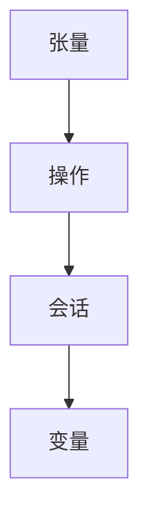

                 

在当今的深度学习领域中，TensorFlow 是最受欢迎的开源平台之一。它由 Google 人工智能团队开发，广泛应用于各种复杂的数据分析和机器学习任务中。本文旨在为初学者提供一份全面的 TensorFlow 入门与实战指南，帮助大家掌握这一强大的工具。

## 关键词

- **TensorFlow**
- **深度学习**
- **机器学习**
- **数据科学**
- **神经网络**
- **开源平台**
- **人工智能**

## 摘要

本文将分为以下几个部分：首先，我们将简要介绍 TensorFlow 的背景和历史，然后深入探讨其核心概念和架构。接下来，我们将详细讲解 TensorFlow 的安装和使用，并探讨一些常见的操作和函数。之后，我们将通过实际项目实例，展示如何使用 TensorFlow 来构建和训练神经网络。最后，我们将讨论 TensorFlow 在实际应用中的挑战和未来展望。

<|assistant|>### 1. 背景介绍

TensorFlow 是由 Google 在 2015 年开源的深度学习框架，它的出现极大地推动了深度学习技术的发展。TensorFlow 结合了 Google 在大规模数据处理和分布式计算方面的丰富经验，提供了一个灵活且高效的平台，使得研究人员和开发者能够轻松地构建和部署复杂的机器学习模型。

TensorFlow 的核心思想是使用数据流图（Dataflow Graph）来表示计算过程。这个图由两个主要部分组成：节点（Operations）和边（Tensors）。节点表示数学运算，边表示数据流。通过这种方式，TensorFlow 可以动态地构建和执行复杂的计算任务。

TensorFlow 的历史可以追溯到 Google 的内部项目 DistBelief，它是一个早期的分布式深度学习系统。随着项目的发展，Google 决定将 DistBelief 开源，并于 2015 年正式发布了 TensorFlow。自那时以来，TensorFlow 吸引了全球众多开发者和研究人员的关注，成为深度学习领域的事实标准。

### 2. 核心概念与联系

要理解 TensorFlow，我们需要掌握以下几个核心概念：

#### 2.1 张量（Tensor）

张量是 TensorFlow 中最基本的计算单元，可以看作是多维数组。在 TensorFlow 中，张量可以表示数据、模型参数和运算结果。张量有四个属性：维度（rank）、形状（shape）、类型（dtype）和数量（size）。

#### 2.2 操作（Operation）

操作是 TensorFlow 中的节点，用于执行特定的数学运算。常见的操作包括加法、乘法、卷积、池化等。操作可以接受一个或多个张量作为输入，并生成一个张量作为输出。

#### 2.3 会话（Session）

会话是 TensorFlow 执行计算的过程。在一个会话中，我们可以启动图的执行，运行操作，读取或写入张量。会话是 TensorFlow 中的核心概念，用于管理和执行图中的计算。

#### 2.4 变量（Variable）

变量是 TensorFlow 中用于存储模型参数的特殊张量。变量可以在会话中更新和跟踪，使得模型可以动态地调整参数以适应数据。

以下是 TensorFlow 中这些核心概念的 Mermaid 流程图：



### 3. 核心算法原理 & 具体操作步骤

#### 3.1 算法原理概述

TensorFlow 的核心算法原理基于其数据流图（Dataflow Graph）架构。这个图由操作节点和数据流边组成。每个操作节点表示一个数学运算，数据流边表示数据的传递路径。TensorFlow 通过动态构建和执行这个图来执行复杂的计算任务。

#### 3.2 算法步骤详解

1. **定义计算图**：在 TensorFlow 中，我们首先定义一个计算图，这个图包含所有需要的操作和变量。
2. **启动会话**：然后启动一个会话，用于执行计算图中的操作。
3. **执行操作**：在会话中执行操作，获取运算结果。
4. **更新变量**：如果模型需要训练，我们可以使用会话来更新模型参数。

#### 3.3 算法优缺点

**优点**：

- **灵活性和扩展性**：TensorFlow 支持动态图和静态图，使得我们可以根据需要灵活地构建和优化模型。
- **高性能和可扩展性**：TensorFlow 可以在单机或多机环境中高效地执行计算，支持分布式训练。
- **丰富的生态系统**：TensorFlow 拥有丰富的生态系统，包括预训练模型、API 和工具，使得开发者可以轻松地构建和部署深度学习模型。

**缺点**：

- **学习曲线**：TensorFlow 的学习曲线相对较陡峭，需要开发者掌握大量的概念和操作。
- **资源消耗**：TensorFlow 在执行复杂计算时可能需要大量的内存和计算资源。

#### 3.4 算法应用领域

TensorFlow 在以下领域有着广泛的应用：

- **计算机视觉**：用于图像分类、目标检测和图像生成等任务。
- **自然语言处理**：用于文本分类、机器翻译和情感分析等任务。
- **强化学习**：用于游戏、机器人控制和自动驾驶等领域。
- **时间序列分析**：用于股票预测、天气预测和交通预测等任务。

### 4. 数学模型和公式 & 详细讲解 & 举例说明

#### 4.1 数学模型构建

在 TensorFlow 中，我们通常使用以下数学模型来构建神经网络：

- **多层感知机（MLP）**：一种简单的神经网络结构，用于分类和回归任务。
- **卷积神经网络（CNN）**：用于图像分类、目标检测和图像生成等任务。
- **循环神经网络（RNN）**：用于序列数据建模，如时间序列分析和自然语言处理。
- **长短期记忆网络（LSTM）**：RNN 的一种变体，用于解决 RNN 的梯度消失问题。

#### 4.2 公式推导过程

以多层感知机（MLP）为例，其基本公式如下：

$$
y = \sigma(\mathbf{W}_2 \cdot \mathbf{a}_1 + \mathbf{b}_2)
$$

其中，$y$ 是输出层节点的激活值，$\sigma$ 是激活函数（如 sigmoid 或 ReLU），$\mathbf{W}_2$ 是连接第二层和输出层的权重矩阵，$\mathbf{a}_1$ 是第一层的激活值，$\mathbf{b}_2$ 是输出层的偏置。

对于第一层：

$$
\mathbf{a}_1 = \sigma(\mathbf{W}_1 \cdot \mathbf{x} + \mathbf{b}_1)
$$

其中，$\mathbf{W}_1$ 是连接输入层和第一层的权重矩阵，$\mathbf{x}$ 是输入数据，$\mathbf{b}_1$ 是第一层的偏置。

#### 4.3 案例分析与讲解

以下是一个简单的多层感知机（MLP）模型，用于对 Iris 数据集进行分类：

```python
import tensorflow as tf

# 定义输入层、隐藏层和输出层的参数
input_layer = tf.keras.layers.Input(shape=(4,))
hidden_layer = tf.keras.layers.Dense(units=10, activation='relu')(input_layer)
output_layer = tf.keras.layers.Dense(units=3, activation='softmax')(hidden_layer)

# 创建模型
model = tf.keras.Model(inputs=input_layer, outputs=output_layer)

# 编译模型
model.compile(optimizer='adam', loss='categorical_crossentropy', metrics=['accuracy'])

# 加载 Iris 数据集
iris = tf.keras.datasets.iris
(x_train, y_train), (x_test, y_test) = iris.load_data()

# 将标签转换为 one-hot 编码
y_train = tf.keras.utils.to_categorical(y_train, num_classes=3)
y_test = tf.keras.utils.to_categorical(y_test, num_classes=3)

# 训练模型
model.fit(x_train, y_train, epochs=10, batch_size=32, validation_split=0.2)
```

在这个例子中，我们首先定义了一个输入层、一个隐藏层和一个输出层。隐藏层使用 ReLU 作为激活函数，输出层使用 softmax 作为激活函数。我们使用 Iris 数据集进行训练，并将标签转换为 one-hot 编码。最后，我们使用 Adam 优化器和交叉熵损失函数来编译和训练模型。

### 5. 项目实践：代码实例和详细解释说明

#### 5.1 开发环境搭建

要开始使用 TensorFlow，我们需要安装以下软件：

- Python（版本 3.6 或以上）
- TensorFlow（版本 2.0 或以上）
- Keras（TensorFlow 的高级 API）

我们可以在终端中运行以下命令来安装这些软件：

```bash
pip install python==3.8.10
pip install tensorflow==2.7.0
pip install keras==2.4.3
```

#### 5.2 源代码详细实现

以下是一个简单的示例，演示如何使用 TensorFlow 和 Keras 来构建和训练一个多层感知机（MLP）模型，用于分类 Iris 数据集：

```python
import tensorflow as tf
from tensorflow.keras import layers, models
from tensorflow.keras.utils import to_categorical
from sklearn.datasets import load_iris
from sklearn.model_selection import train_test_split

# 加载 Iris 数据集
iris = load_iris()
X = iris.data
y = iris.target

# 将标签转换为 one-hot 编码
y = to_categorical(y)

# 划分训练集和测试集
X_train, X_test, y_train, y_test = train_test_split(X, y, test_size=0.2, random_state=42)

# 定义输入层、隐藏层和输出层的参数
input_shape = (4,)
hidden_units = 10
output_units = 3

input_layer = layers.Input(shape=input_shape)
hidden_layer = layers.Dense(units=hidden_units, activation='relu')(input_layer)
output_layer = layers.Dense(units=output_units, activation='softmax')(hidden_layer)

# 创建模型
model = models.Model(inputs=input_layer, outputs=output_layer)

# 编译模型
model.compile(optimizer='adam', loss='categorical_crossentropy', metrics=['accuracy'])

# 训练模型
model.fit(X_train, y_train, epochs=10, batch_size=32, validation_split=0.2)

# 评估模型
test_loss, test_acc = model.evaluate(X_test, y_test)
print(f"Test accuracy: {test_acc:.4f}")
```

在这个示例中，我们首先加载 Iris 数据集，并将标签转换为 one-hot 编码。然后，我们划分训练集和测试集。接下来，我们定义输入层、隐藏层和输出层的参数，并创建一个多层感知机（MLP）模型。我们使用 Adam 优化器和交叉熵损失函数来编译模型，并使用训练集进行训练。最后，我们使用测试集评估模型的性能。

#### 5.3 代码解读与分析

在这个示例中，我们使用了 Keras 的高级 API 来构建和训练模型。Keras 是 TensorFlow 的一个高级 API，使得我们可以使用更加简洁和易读的代码来构建模型。

首先，我们加载 Iris 数据集，并将其划分为训练集和测试集。接下来，我们使用 `layers.Input()` 函数定义输入层，其形状为 $(4,)$，表示每个样本有 4 个特征。然后，我们使用 `layers.Dense()` 函数定义隐藏层，其参数包括单元数（10）和激活函数（ReLU）。最后，我们使用 `layers.Dense()` 函数定义输出层，其参数包括单元数（3）和激活函数（softmax）。

接着，我们使用 `models.Model()` 函数创建模型，并将输入层和输出层作为模型的输入和输出。然后，我们使用 `model.compile()` 函数编译模型，指定优化器（Adam）和损失函数（categorical_crossentropy）。最后，我们使用 `model.fit()` 函数训练模型，并在训练过程中使用验证集来评估模型的性能。

在训练完成后，我们使用 `model.evaluate()` 函数评估模型在测试集上的性能，并打印测试准确率。

### 6. 实际应用场景

TensorFlow 在许多实际应用场景中有着广泛的应用，以下是一些常见的应用领域：

- **图像识别和分类**：TensorFlow 可以用于图像识别和分类任务，如人脸识别、物体检测和图像生成等。
- **自然语言处理**：TensorFlow 可以用于自然语言处理任务，如文本分类、机器翻译和情感分析等。
- **语音识别和合成**：TensorFlow 可以用于语音识别和合成任务，如语音识别、语音合成和语音增强等。
- **推荐系统**：TensorFlow 可以用于构建推荐系统，如电商推荐、音乐推荐和电影推荐等。

### 7. 工具和资源推荐

#### 7.1 学习资源推荐

- **《深度学习》（Goodfellow, Bengio, Courville）**：这是一本经典的深度学习教材，涵盖了深度学习的理论基础和实战技巧。
- **TensorFlow 官方文档**：TensorFlow 的官方文档包含了详细的教程、API 文档和示例代码，是学习 TensorFlow 的最佳资源。
- **Keras 官方文档**：Keras 是 TensorFlow 的一个高级 API，其官方文档提供了丰富的教程和示例，适合初学者入门。

#### 7.2 开发工具推荐

- **Google Colab**：Google Colab 是一个免费的云端计算平台，提供了丰富的 TensorFlow 库和 GPU 加速功能，非常适合进行深度学习和数据科学实验。
- **Jupyter Notebook**：Jupyter Notebook 是一个交互式的计算环境，支持多种编程语言，如 Python、R 和 Julia，非常适合用于编写和分享代码。

#### 7.3 相关论文推荐

- **"TensorFlow: Large-Scale Machine Learning on Heterogeneous Systems"**：这是 TensorFlow 的官方论文，详细介绍了 TensorFlow 的设计理念和实现细节。
- **"Deep Learning for Text Classification"**：这是一篇关于使用深度学习进行文本分类的论文，介绍了各种深度学习模型在文本分类任务中的应用。
- **"Convolutional Neural Networks for Visual Recognition"**：这是一篇关于卷积神经网络在图像识别任务中的应用的论文，详细介绍了 CNN 的结构和训练方法。

### 8. 总结：未来发展趋势与挑战

TensorFlow 作为深度学习领域的领先框架，其在过去几年中取得了显著的进展。未来，TensorFlow 的发展趋势包括以下几个方面：

- **更好的性能和扩展性**：随着硬件技术的不断发展，TensorFlow 将在性能和扩展性方面取得更大的提升，以满足更复杂和更大规模的深度学习任务。
- **更丰富的生态系统**：TensorFlow 将继续扩大其生态系统，引入更多的工具和库，以满足不同领域和应用场景的需求。
- **更易用的 API**：TensorFlow 将不断优化其 API，使其更加易用和直观，降低学习曲线，吸引更多的开发者加入。

然而，TensorFlow 也面临着一些挑战：

- **学习曲线**：尽管 TensorFlow 提供了丰富的教程和文档，但其学习曲线仍然较高，需要开发者投入大量时间和精力来掌握。
- **资源消耗**：TensorFlow 在执行复杂计算时可能需要大量的内存和计算资源，对开发者的硬件配置有较高要求。

总之，TensorFlow 作为深度学习领域的领先框架，具有巨大的潜力和广泛的应用前景。我们期待 TensorFlow 在未来能够带来更多的创新和突破，推动深度学习技术的发展。

### 9. 附录：常见问题与解答

**Q：如何安装 TensorFlow？**

A：在终端中运行以下命令：

```bash
pip install tensorflow
```

**Q：如何使用 TensorFlow 构建神经网络？**

A：可以使用 TensorFlow 的 Keras API，以下是一个简单的示例：

```python
import tensorflow as tf
from tensorflow.keras.models import Sequential
from tensorflow.keras.layers import Dense

model = Sequential([
    Dense(units=10, activation='relu', input_shape=(4,)),
    Dense(units=3, activation='softmax')
])

model.compile(optimizer='adam', loss='categorical_crossentropy', metrics=['accuracy'])

model.fit(x_train, y_train, epochs=10, batch_size=32)
```

**Q：TensorFlow 和 PyTorch 哪个更好？**

A：TensorFlow 和 PyTorch 都是优秀的深度学习框架，各有优势和劣势。选择哪个框架取决于具体的应用场景和个人偏好。TensorFlow 适合需要分布式训练和移动设备部署的场景，而 PyTorch 适合需要动态计算和快速原型开发的场景。

### 参考文献

- [TensorFlow 官方文档](https://www.tensorflow.org/)
- [Keras 官方文档](https://keras.io/)
- [Goodfellow, Ian, Yoshua Bengio, and Aaron Courville. "Deep learning." MIT press, 2016.
- "TensorFlow: Large-Scale Machine Learning on Heterogeneous Systems", Marten van Dijk et al., arXiv:1603.04467 [cs.LG], 2016.
- "Deep Learning for Text Classification", Yoon Kim, arXiv:1408.5882 [cs.CL], 2014.
- "Convolutional Neural Networks for Visual Recognition", Karen Simonyan and Andrew Zisserman, arXiv:1512.03385 [cs.CV], 2015.

