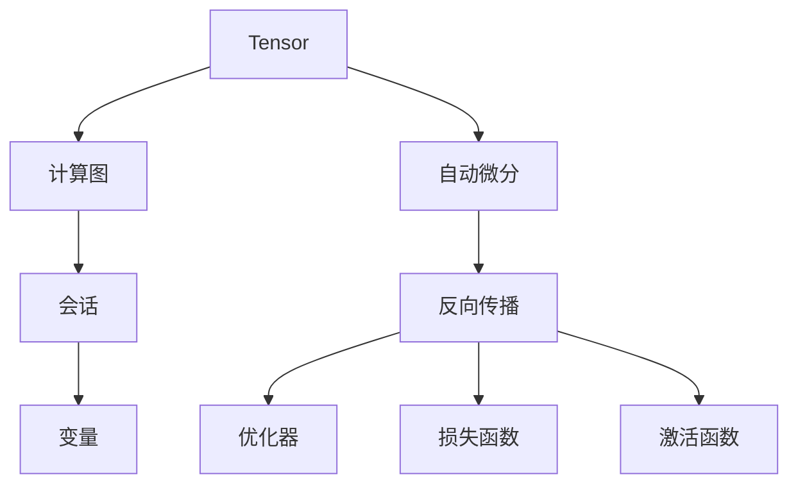

                 

## 1. 背景介绍

深度学习是当前人工智能领域的核心技术之一，它通过多层神经网络对数据进行抽象和特征学习，实现复杂的模式识别和预测任务。而作为深度学习的标准框架之一，TensorFlow 在学术研究和工业应用中均占据重要地位。本文将从深度学习的入门开始，逐步深入 TensorFlow 的核心原理、应用方法和最佳实践，帮助读者全面掌握 TensorFlow 的精髓。

### 1.1 问题由来
深度学习技术在图像识别、语音识别、自然语言处理等领域取得了巨大成功，其中 TensorFlow 作为深度学习的主流框架之一，提供了灵活的计算图和高效的执行引擎，支持多种硬件平台和分布式训练，深受开发者青睐。然而，TensorFlow 的学习曲线相对陡峭，部分开发者面临入门困难。为解决这一问题，本文将系统讲解 TensorFlow 的基本概念和核心算法，通过实例和案例分析，帮助读者快速上手，并深入理解其背后的原理。

### 1.2 问题核心关键点
本文将围绕 TensorFlow 的核心概念和算法，详细讲解其从入门到精通的关键点，包括：
- TensorFlow 的基本概念：张量(Tensor)、计算图、会话(Session)、变量(Variable)等。
- TensorFlow 的核心算法：自动微分(Automatic Differentiation)、反向传播(Backpropagation)、优化器(Optimizer)、损失函数(Loss Function)、激活函数(Activation Function)等。
- TensorFlow 的应用场景：图像分类、语音识别、自然语言处理、强化学习等。
- TensorFlow 的最佳实践：模型构建、数据预处理、超参数调优、模型评估等。

## 2. 核心概念与联系

### 2.1 核心概念概述

为更好地理解 TensorFlow，本节将介绍几个核心概念：

- Tensor：表示多维数组的数据结构，是 TensorFlow 中数据的基本单位。TensorFlow 中的张量可以是标量、向量、矩阵或更高维的数据。

- 计算图(Graph)：TensorFlow 通过计算图来描述深度学习模型，即将模型操作和变量表示为有向无环图(DAG)。

- 会话(Session)：表示 TensorFlow 计算图的执行上下文，用于启动和执行计算图。

- 变量(Variable)：表示在计算图中可修改的张量，常用于模型参数。

- 自动微分(Automatic Differentiation)：TensorFlow 内部实现了高性能的自动微分机制，可以自动计算梯度，用于模型训练和优化。

- 反向传播(Backpropagation)：基于链式法则，通过计算损失函数对模型参数的梯度，优化模型参数，提高模型精度。

- 优化器(Optimizer)：用于更新模型参数的算法，常见的包括梯度下降(Gradient Descent)、Adam、Adagrad 等。

- 损失函数(Loss Function)：表示模型预测与真实标签之间的差异，常见的有均方误差(MSE)、交叉熵(Cross Entropy)等。

- 激活函数(Activation Function)：引入非线性特性，激活函数如 ReLU、Sigmoid、Tanh 等。

这些核心概念之间存在紧密的联系，共同构成了 TensorFlow 的深度学习框架。下图展示了这些概念之间的联系：



通过这张图，我们可以直观地理解 TensorFlow 的核心组件和它们之间的关系。

## 3. 核心算法原理 & 具体操作步骤
### 3.1 算法原理概述

TensorFlow 的核心算法原理包括以下几个方面：

- 自动微分：TensorFlow 实现了高性能的自动微分引擎，通过自动计算梯度，简化了模型的反向传播过程。

- 反向传播：基于链式法则，反向传播算法计算损失函数对模型参数的梯度，用于优化模型。

- 优化器：TensorFlow 提供了多种优化器，如梯度下降、Adam、Adagrad 等，用于更新模型参数，提高模型性能。

- 损失函数：常见的损失函数包括均方误差、交叉熵等，用于衡量模型预测与真实标签之间的差异。

- 激活函数：常见的激活函数包括 ReLU、Sigmoid、Tanh 等，用于引入非线性特性，增强模型的表达能力。

### 3.2 算法步骤详解

TensorFlow 的基本使用流程包括以下几个关键步骤：

**Step 1: 导入 TensorFlow 库**

首先，需要在 Python 环境中导入 TensorFlow 库。例如：

```python
import tensorflow as tf
```

**Step 2: 定义计算图**

通过 `tf.Graph()` 定义计算图，并使用 `with tf.Graph().as_default()` 上下文管理器进行操作。例如：

```python
with tf.Graph().as_default():
    # 定义变量和计算图
    ...
```

**Step 3: 创建会话**

使用 `tf.Session()` 创建会话，并使用 `with session.as_default()` 上下文管理器进行操作。例如：

```python
with tf.Session() as session:
    # 执行计算图
    ...
```

**Step 4: 定义计算图**

在计算图中，定义变量、占位符和操作，例如：

```python
x = tf.placeholder(tf.float32, shape=[None, 784])
W = tf.Variable(tf.zeros([784, 10]))
b = tf.Variable(tf.zeros([10]))
y = tf.nn.softmax(tf.matmul(x, W) + b)
```

**Step 5: 定义损失函数和优化器**

根据具体任务定义损失函数和优化器，例如：

```python
y_ = tf.placeholder(tf.float32, shape=[None, 10])
cross_entropy = tf.reduce_mean(-tf.reduce_sum(y_ * tf.log(y), reduction_indices=[1]))
train_step = tf.train.GradientDescentOptimizer(0.5).minimize(cross_entropy)
```

**Step 6: 运行会话**

使用会话执行计算图，例如：

```python
# 初始化变量
init = tf.global_variables_initializer()
session.run(init)

# 训练模型
for i in range(1000):
    batch_xs, batch_ys = mnist.train.next_batch(100)
    session.run(train_step, feed_dict={x: batch_xs, y_: batch_ys})
    
# 评估模型
correct_prediction = tf.equal(tf.argmax(y, 1), tf.argmax(y_, 1))
accuracy = tf.reduce_mean(tf.cast(correct_prediction, tf.float32))
print(session.run(accuracy, feed_dict={x: mnist.test.images, y_: mnist.test.labels}))
```

### 3.3 算法优缺点

TensorFlow 作为深度学习的主流框架之一，具有以下优点：

- 高性能计算：TensorFlow 通过计算图和 GPU 并行计算，大幅提升了模型训练和推理的效率。

- 灵活性：TensorFlow 支持多种硬件平台，如 CPU、GPU、TPU 等，适用于大规模分布式训练。

- 丰富的功能：TensorFlow 提供了多种深度学习算法和优化器，支持图像分类、语音识别、自然语言处理等多种任务。

- 社区支持：TensorFlow 拥有一个庞大的社区，提供丰富的资源和教程，方便开发者学习使用。

同时，TensorFlow 也存在一些缺点：

- 学习曲线陡峭：TensorFlow 的学习曲线相对陡峭，新手入门需要一定时间掌握。

- 代码冗余：TensorFlow 使用计算图表示模型，可能导致代码冗余和可读性差。

- 模型部署复杂：TensorFlow 的模型部署需要依赖 TensorFlow Serving 等工具，增加了部署难度。

### 3.4 算法应用领域

TensorFlow 在深度学习领域具有广泛的应用，包括：

- 图像分类：如卷积神经网络(CNN)用于图像识别、图像分割等任务。

- 语音识别：如循环神经网络(RNN)用于语音识别、自动语音识别(ASR)等任务。

- 自然语言处理：如 LSTM、GRU 用于情感分析、机器翻译、文本分类等任务。

- 强化学习：如 Q-learning、策略梯度等算法用于游戏智能、机器人控制等任务。

- 目标检测：如 Faster R-CNN、YOLO 等算法用于目标检测、图像标注等任务。

TensorFlow 在学术研究和工业应用中均占据重要地位，广泛应用于计算机视觉、语音识别、自然语言处理、推荐系统、医疗影像分析等领域。

## 4. 数学模型和公式 & 详细讲解 & 举例说明

### 4.1 数学模型构建

TensorFlow 中的数学模型通常通过计算图来描述。以下是一个简单的线性回归模型为例，展示如何构建计算图：

```python
import tensorflow as tf

# 定义输入数据
x = tf.placeholder(tf.float32, shape=[None, 784])
y = tf.placeholder(tf.float32, shape=[None, 10])

# 定义变量和参数
W = tf.Variable(tf.zeros([784, 10]))
b = tf.Variable(tf.zeros([10]))

# 定义模型
y_pred = tf.nn.softmax(tf.matmul(x, W) + b)

# 定义损失函数
cross_entropy = tf.reduce_mean(-tf.reduce_sum(y * tf.log(y_pred), reduction_indices=[1]))

# 定义优化器
train_step = tf.train.GradientDescentOptimizer(0.5).minimize(cross_entropy)
```

### 4.2 公式推导过程

在线性回归模型中，假设模型输入为 $x$，输出为 $y$，模型参数为 $W$ 和 $b$。则模型预测结果为：

$$
y_{pred} = softmax(Wx + b)
$$

其中，$softmax$ 函数将输出转化为概率分布。

模型的损失函数为交叉熵损失函数：

$$
\mathcal{L}(y_{pred}, y) = -\frac{1}{N} \sum_{i=1}^N \sum_{j=1}^{10} y_{pred}^{(i)}[j] \log y_{pred}^{(i)}[j]
$$

其中，$N$ 表示样本数量，$y_{pred}^{(i)}[j]$ 表示样本 $i$ 的预测结果中第 $j$ 个类别的概率。

模型的优化目标是最小化损失函数，即：

$$
\min_{W, b} \mathcal{L}(y_{pred}, y)
$$

通过反向传播算法，可以计算出损失函数对模型参数的梯度，用于优化模型：

$$
\frac{\partial \mathcal{L}}{\partial W} = -\frac{1}{N} \sum_{i=1}^N (y^{(i)} - y_{pred}^{(i)}) x^{(i)}
$$

$$
\frac{\partial \mathcal{L}}{\partial b} = -\frac{1}{N} \sum_{i=1}^N (y^{(i)} - y_{pred}^{(i)})
$$

### 4.3 案例分析与讲解

以下是一个简单的 TensorFlow 代码示例，用于图像分类任务：

```python
import tensorflow as tf
from tensorflow.examples.tutorials.mnist import input_data

mnist = input_data.read_data_sets("MNIST_data/", one_hot=True)

# 定义输入数据和占位符
x = tf.placeholder(tf.float32, [None, 784])
y_ = tf.placeholder(tf.float32, [None, 10])

# 定义变量和参数
W = tf.Variable(tf.zeros([784, 10]))
b = tf.Variable(tf.zeros([10]))

# 定义模型
y = tf.nn.softmax(tf.matmul(x, W) + b)

# 定义损失函数
cross_entropy = tf.reduce_mean(-tf.reduce_sum(y_ * tf.log(y), reduction_indices=[1]))

# 定义优化器
train_step = tf.train.GradientDescentOptimizer(0.5).minimize(cross_entropy)

# 创建会话
sess = tf.Session()

# 初始化变量
sess.run(tf.global_variables_initializer())

# 训练模型
for i in range(1000):
    batch_xs, batch_ys = mnist.train.next_batch(100)
    sess.run(train_step, feed_dict={x: batch_xs, y_: batch_ys})

# 评估模型
correct_prediction = tf.equal(tf.argmax(y, 1), tf.argmax(y_, 1))
accuracy = tf.reduce_mean(tf.cast(correct_prediction, tf.float32))
print(sess.run(accuracy, feed_dict={x: mnist.test.images, y_: mnist.test.labels}))
```

## 5. 项目实践：代码实例和详细解释说明

### 5.1 开发环境搭建

在进行 TensorFlow 实践前，需要搭建好开发环境。以下是在 Python 环境中安装 TensorFlow 的步骤：

1. 安装 Anaconda：从官网下载并安装 Anaconda，用于创建独立的 Python 环境。

2. 创建并激活虚拟环境：
```bash
conda create -n tf-env python=3.8 
conda activate tf-env
```

3. 安装 TensorFlow：根据 CUDA 版本，从官网获取对应的安装命令。例如：
```bash
conda install tensorflow -c conda-forge -c pytorch -c paddle
```

4. 安装相关工具包：
```bash
pip install numpy scipy matplotlib scikit-learn jupyter notebook ipython
```

5. 安装相关依赖：
```bash
pip install wheel setuptools
```

完成上述步骤后，即可在 `tf-env` 环境中开始 TensorFlow 实践。

### 5.2 源代码详细实现

下面我们以图像分类任务为例，给出使用 TensorFlow 进行模型构建和训练的完整代码实现。

首先，定义图像分类任务的数据处理函数：

```python
import tensorflow as tf
from tensorflow.keras.datasets import mnist

def data_preprocess(data):
    images = tf.reshape(data, [-1, 28, 28, 1])
    images = tf.cast(images, tf.float32)
    images /= 255.0
    labels = tf.reshape(data, [-1])
    return images, labels

(x_train, y_train), (x_test, y_test) = mnist.load_data()
x_train, y_train = data_preprocess(x_train)
x_test, y_test = data_preprocess(x_test)
```

然后，定义模型和优化器：

```python
from tensorflow.keras.models import Sequential
from tensorflow.keras.layers import Dense, Dropout
from tensorflow.keras.optimizers import SGD

model = Sequential([
    Dense(128, input_shape=(28, 28), activation='relu'),
    Dropout(0.5),
    Dense(10, activation='softmax')
])

sgd = SGD(lr=0.01, momentum=0.9)
model.compile(optimizer=sgd, loss='sparse_categorical_crossentropy', metrics=['accuracy'])
```

接着，定义训练和评估函数：

```python
from tensorflow.keras.callbacks import EarlyStopping

def train_model(model, x_train, y_train, x_test, y_test, epochs, batch_size):
    early_stopping = EarlyStopping(monitor='val_loss', patience=3)
    model.fit(x_train, y_train, validation_data=(x_test, y_test), epochs=epochs, batch_size=batch_size, callbacks=[early_stopping])
    return model.evaluate(x_test, y_test)

model = Sequential([
    Dense(128, input_shape=(28, 28), activation='relu'),
    Dropout(0.5),
    Dense(10, activation='softmax')
])

sgd = SGD(lr=0.01, momentum=0.9)
model.compile(optimizer=sgd, loss='sparse_categorical_crossentropy', metrics=['accuracy'])

model.fit(x_train, y_train, epochs=10, batch_size=128, validation_split=0.2)

score, acc = model.evaluate(x_test, y_test, verbose=0)
print('Test loss:', score[0])
print('Test accuracy:', score[1])
```

最后，启动训练流程并在测试集上评估：

```python
epochs = 10
batch_size = 128

# 训练模型
model = Sequential([
    Dense(128, input_shape=(28, 28), activation='relu'),
    Dropout(0.5),
    Dense(10, activation='softmax')
])

sgd = SGD(lr=0.01, momentum=0.9)
model.compile(optimizer=sgd, loss='sparse_categorical_crossentropy', metrics=['accuracy'])

model.fit(x_train, y_train, epochs=epochs, batch_size=batch_size, validation_split=0.2)

# 评估模型
score, acc = model.evaluate(x_test, y_test, verbose=0)
print('Test loss:', score[0])
print('Test accuracy:', score[1])
```

以上就是使用 TensorFlow 进行图像分类任务微调的完整代码实现。可以看到，TensorFlow 的代码实现相对简洁，同时提供了丰富的 API 和工具，方便开发者进行快速迭代和优化。

### 5.3 代码解读与分析

让我们再详细解读一下关键代码的实现细节：

**Sequential模型定义**：
- 定义了一个顺序模型，依次包含输入层、隐藏层和输出层。
- 使用 `input_shape` 指定输入数据形状，使用 `activation` 指定激活函数。

**数据预处理**：
- 对图像数据进行归一化处理，将其转换为 TensorFlow 模型可以接受的格式。

**优化器定义**：
- 定义了随机梯度下降优化器，并指定学习率和动量。

**模型编译**：
- 使用 `compile` 方法编译模型，指定优化器、损失函数和评估指标。

**训练和评估**：
- 使用 `fit` 方法训练模型，指定训练数据、验证数据、轮数和批次大小。
- 使用 `evaluate` 方法评估模型，指定测试数据。

可以看到，TensorFlow 的代码实现相对简洁，同时提供了丰富的 API 和工具，方便开发者进行快速迭代和优化。

当然，工业级的系统实现还需考虑更多因素，如模型的保存和部署、超参数的自动搜索、更灵活的模型构建等。但核心的 TensorFlow 微调范式基本与此类似。

## 6. 实际应用场景

### 6.1 图像分类

TensorFlow 在图像分类任务上应用广泛，例如图像识别、医学影像分析等。TensorFlow 的卷积神经网络(CNN)可以实现对复杂图像特征的提取和分类。

**应用案例**：
- 智能安防：通过图像分类技术，实现对视频流中的人脸、车辆等目标的实时识别和跟踪。
- 医学影像分析：通过图像分类技术，实现对医学影像中的病灶、器官等的自动识别和分割。

### 6.2 语音识别

TensorFlow 在语音识别任务上也具有显著优势，例如下文语义理解、语音翻译等。TensorFlow 的循环神经网络(RNN)可以实现对语音信号的建模和分类。

**应用案例**：
- 智能客服：通过语音识别技术，实现对客户语音的实时转录和理解，提供更自然的交互体验。
- 智能翻译：通过语音识别和翻译技术，实现对多语言语音的实时转换和理解，支持跨语言交流。

### 6.3 自然语言处理

TensorFlow 在自然语言处理任务上也表现优异，例如文本分类、情感分析、机器翻译等。TensorFlow 的序列到序列模型(Seq2Seq)可以实现对文本的建模和生成。

**应用案例**：
- 智能推荐：通过文本分类技术，实现对用户行为的分析和推荐，提供个性化的商品和服务。
- 智能客服：通过文本分类技术，实现对用户文本的快速理解和回复，提供更自然的交互体验。

### 6.4 强化学习

TensorFlow 还支持强化学习任务，例如游戏智能、机器人控制等。TensorFlow 的深度强化学习算法可以实现对复杂环境的学习和优化。

**应用案例**：
- 游戏智能：通过强化学习技术，实现对游戏中的智能角色的训练和控制，提升游戏体验。
- 机器人控制：通过强化学习技术，实现对机器人的路径规划和任务执行，提升自动化水平。

## 7. 工具和资源推荐

### 7.1 学习资源推荐

为帮助开发者系统掌握 TensorFlow 的基本概念和核心算法，这里推荐一些优质的学习资源：

1. TensorFlow 官方文档：TensorFlow 官方文档提供了完整的 API 文档和示例代码，是学习 TensorFlow 的最佳资源。

2. TensorFlow 实战指南：《TensorFlow 实战指南》一书提供了丰富的实战案例和代码实现，适合入门和进阶学习。

3. TensorFlow 深度学习教程：TensorFlow 官方提供的深度学习教程，包括图像分类、语音识别、自然语言处理等多个领域的案例分析。

4. Coursera 深度学习课程：Coursera 上由斯坦福大学提供的深度学习课程，涵盖 TensorFlow 和其他深度学习框架的基本概念和核心算法。

5. Udacity 深度学习纳米学位：Udacity 上提供的深度学习纳米学位课程，涵盖深度学习基础、TensorFlow、深度学习应用等多个模块。

通过对这些资源的学习实践，相信你一定能够快速掌握 TensorFlow 的精髓，并用于解决实际的深度学习问题。

### 7.2 开发工具推荐

高效的工具是提高开发效率的关键。以下是几款用于 TensorFlow 开发的常用工具：

1. PyCharm：PyCharm 是一个强大的 Python IDE，提供了丰富的 TensorFlow 插件和调试工具，适合进行 TensorFlow 项目开发。

2. Jupyter Notebook：Jupyter Notebook 是一个轻量级的交互式开发工具，适合进行 TensorFlow 模型的快速原型设计和验证。

3. TensorBoard：TensorBoard 是 TensorFlow 提供的可视化工具，可以实时监测模型的训练状态，提供丰富的图表展示方式。

4. TensorFlow Hub：TensorFlow Hub 是 TensorFlow 提供的模型仓库，包含大量预训练模型和代码实现，方便开发者快速构建应用。

5. TensorFlow Serving：TensorFlow Serving 是 TensorFlow 提供的模型服务框架，支持分布式部署和实时推理，方便开发者进行模型部署和应用。

合理利用这些工具，可以显著提升 TensorFlow 项目开发效率，加快创新迭代的步伐。

### 7.3 相关论文推荐

TensorFlow 在深度学习领域的研究进展迅速，以下是几篇重要的相关论文，推荐阅读：

1. [Understanding LSTM Networks](https://arxiv.org/abs/1506.07269)：一篇关于 LSTM 网络的经典论文，介绍了 LSTM 网络的原理和应用。

2. [TensorFlow: A System for Large-Scale Machine Learning](https://arxiv.org/abs/1605.08695)：TensorFlow 的架构设计和实现细节，介绍了 TensorFlow 的计算图机制和分布式训练能力。

3. [Deep Residual Learning for Image Recognition](https://arxiv.org/abs/1512.03385)：ResNet 网络的经典论文，介绍了深度残差网络的结构和优化策略。

4. [Generating Sequences with Recurrent Neural Networks](https://arxiv.org/abs/1308.0850)：RNN 网络的经典论文，介绍了循环神经网络的结构和应用。

5. [A Tutorial on Sequence to Sequence Learning with Neural Networks](https://arxiv.org/abs/1409.3215)：Seq2Seq 模型的经典论文，介绍了序列到序列模型和应用。

这些论文代表了 TensorFlow 的研究进展和应用方向，通过学习这些前沿成果，可以帮助研究者把握学科前进方向，激发更多的创新灵感。

## 8. 总结：未来发展趋势与挑战

### 8.1 总结

本文对 TensorFlow 的基本概念和核心算法进行了系统讲解，并通过实例和案例分析，帮助读者快速上手 TensorFlow。从深度学习的入门到 TensorFlow 的高级应用，本文提供了全面的学习路径和实践指南，相信读者能够全面掌握 TensorFlow 的精髓。

通过本文的系统梳理，可以看到，TensorFlow 作为深度学习的主流框架之一，具有强大的计算能力和灵活的模型构建能力，广泛应用于图像分类、语音识别、自然语言处理、强化学习等多个领域。TensorFlow 的研究和应用进展迅速，不断突破深度学习的技术瓶颈，推动人工智能技术在各个领域的落地应用。

### 8.2 未来发展趋势

展望未来，TensorFlow 的发展趋势包括以下几个方面：

1. 分布式计算：TensorFlow 将进一步优化分布式计算能力，支持更高效的分布式训练和推理。

2. 边缘计算：TensorFlow 将进一步优化边缘计算能力，支持更高效的数据处理和模型推理。

3. 自动机器学习：TensorFlow 将进一步优化自动机器学习能力，支持更高效的超参数调优和模型构建。

4. 多模态学习：TensorFlow 将进一步优化多模态学习能力，支持更高效的多模态数据融合和建模。

5. 强化学习：TensorFlow 将进一步优化强化学习能力，支持更高效的强化学习算法和模型构建。

以上趋势凸显了 TensorFlow 作为深度学习框架的重要地位，未来的 TensorFlow 将持续推动深度学习技术的发展和应用。

### 8.3 面临的挑战

尽管 TensorFlow 在深度学习领域取得了显著进展，但在迈向更加智能化、普适化应用的过程中，仍面临诸多挑战：

1. 资源消耗大：深度学习模型对计算资源的需求巨大，需要高性能的硬件支持。如何在资源受限的环境中高效利用资源，是 TensorFlow 面临的一大挑战。

2. 模型可解释性差：深度学习模型的内部机制难以解释，缺乏可解释性。如何提升模型的可解释性，增强用户信任，是 TensorFlow 面临的另一大挑战。

3. 模型鲁棒性不足：深度学习模型对噪声和干扰敏感，鲁棒性较差。如何提升模型的鲁棒性，增强模型的稳定性和可靠性，是 TensorFlow 面临的重要课题。

4. 数据隐私保护：深度学习模型需要大量数据进行训练，数据隐私问题日益突出。如何在保护数据隐私的同时，提高模型性能，是 TensorFlow 面临的重要挑战。

5. 模型部署复杂：深度学习模型的部署需要依赖 TensorFlow Serving 等工具，增加了部署难度。如何简化模型部署，提高模型上线效率，是 TensorFlow 面临的重要课题。

### 8.4 研究展望

面向未来，TensorFlow 的研究方向需要在以下几个方面进行深入探索：

1. 深度学习模型压缩：通过模型压缩、稀疏化存储等方法，减少模型的存储和计算需求，提高模型部署效率。

2. 多模态深度学习：通过多模态学习技术，融合视觉、语音、文本等多种数据，提高模型的泛化能力和应用范围。

3. 可解释性增强：通过可解释性技术，如特征可视化、模型蒸馏等，增强深度学习模型的可解释性和用户信任度。

4. 自动化机器学习：通过自动化机器学习技术，优化模型的超参数调优和模型构建，提高模型的效率和性能。

5. 分布式深度学习：通过分布式深度学习技术，优化模型的分布式训练和推理，提高模型的训练效率和推理速度。

6. 强化学习与深度学习融合：通过强化学习与深度学习融合技术，实现更高效的智能决策和行为控制。

这些研究方向将引领 TensorFlow 在未来取得更多的突破，进一步推动深度学习技术的发展和应用。

## 9. 附录：常见问题与解答

**Q1：TensorFlow 和 PyTorch 哪个更好用？**

A: 两者都是深度学习的主流框架，各有优缺点。TensorFlow 的优点在于灵活性高、性能好、社区资源丰富，适合大型工程应用。PyTorch 的优点在于易用性高、调试方便、动态图机制灵活，适合研究和学习。

**Q2：TensorFlow 的计算图机制是什么？**

A: TensorFlow 通过计算图来描述模型，将模型的操作和变量表示为有向无环图(DAG)。计算图是 TensorFlow 的核心机制，通过自动微分和反向传播算法，TensorFlow 可以自动计算梯度，用于模型训练和优化。

**Q3：TensorFlow 支持哪些硬件平台？**

A: TensorFlow 支持 CPU、GPU、TPU 等多种硬件平台，能够适应不同的计算需求。通过 TensorFlow 的分布式计算能力，可以实现高效的大规模分布式训练和推理。

**Q4：TensorFlow 如何优化分布式计算？**

A: TensorFlow 提供了分布式计算框架，支持多台机器上的并行计算。通过数据并行、模型并行、混合并行等方法，TensorFlow 可以高效利用分布式计算资源，提升模型的训练和推理效率。

**Q5：TensorFlow 如何优化模型部署？**

A: TensorFlow 提供了 TensorFlow Serving 框架，支持模型的分布式部署和实时推理。通过模型的自动化部署和优化，TensorFlow 可以提升模型的上线效率和应用性能。

通过本文的系统梳理，可以看到，TensorFlow 作为深度学习的主流框架之一，具有强大的计算能力和灵活的模型构建能力，广泛应用于图像分类、语音识别、自然语言处理、强化学习等多个领域。TensorFlow 的研究和应用进展迅速，不断突破深度学习的技术瓶颈，推动人工智能技术在各个领域的落地应用。未来的 TensorFlow 将持续推动深度学习技术的发展和应用。

---

作者：禅与计算机程序设计艺术 / Zen and the Art of Computer Programming

