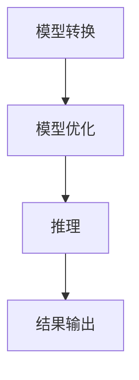

                 

关键词：TensorRT，深度学习，推理加速，优化库，性能提升，神经网络，硬件加速

摘要：随着深度学习技术的飞速发展，如何高效地部署和运行深度学习模型成为了一个关键问题。TensorRT是一个由NVIDIA开发的优化库，旨在加速深度学习推理过程。本文将详细介绍TensorRT的核心概念、算法原理、数学模型以及在实际项目中的应用，旨在帮助读者理解和掌握如何利用TensorRT优化深度学习推理的性能。

## 1. 背景介绍

深度学习技术自2006年提出以来，经历了从理论研究到实际应用的快速迭代。然而，深度学习模型的训练和推理过程对计算资源的需求极高。尤其是在大规模数据集和复杂的神经网络模型面前，传统的CPU和GPU加速方法已经无法满足需求。为此，NVIDIA推出了一系列针对深度学习推理优化的工具和库，其中TensorRT便是其中之一。

TensorRT是一个高性能深度学习推理引擎，它通过多种优化技术，包括模型转换、层融合、张量化等，将深度学习模型转换成在NVIDIA GPU上高效运行的推理格式。TensorRT不仅能够显著提升推理速度，还能够降低模型的内存占用，从而提高系统的整体性能。

## 2. 核心概念与联系

### 2.1. 深度学习推理过程

在深度学习推理过程中，我们需要将输入数据通过神经网络模型进行处理，并输出预测结果。这一过程可以分为以下几个步骤：

1. **数据预处理**：将原始数据转换为模型可接受的格式。
2. **模型加载**：加载已经训练好的模型。
3. **前向传播**：将输入数据通过模型的各个层进行计算。
4. **后处理**：对模型的输出结果进行后处理，如softmax操作。
5. **结果输出**：输出模型的预测结果。

### 2.2. TensorRT的工作流程

TensorRT的工作流程主要包括以下几个步骤：

1. **模型转换**：将原始模型（如PyTorch、TensorFlow等）转换为TensorRT支持的格式。
2. **优化**：对模型进行各种优化操作，如层融合、张量化等。
3. **推理**：使用优化后的模型进行推理，并输出结果。

### 2.3. Mermaid流程图

下面是一个简化的TensorRT工作流程的Mermaid流程图：



## 3. 核心算法原理 & 具体操作步骤

### 3.1. 算法原理概述

TensorRT的核心算法原理主要包括以下几个方面：

1. **模型转换**：将原始模型转换为TensorRT支持的格式，如ONNX、TensorFlow Lite等。
2. **层融合**：将多个连续的层合并成一个层，以减少计算量和内存占用。
3. **张量化**：将模型中的浮点运算转换为整数运算，以提升计算速度。
4. **显存优化**：通过优化内存使用，减少模型在GPU上的内存占用。

### 3.2. 算法步骤详解

#### 3.2.1. 模型转换

模型转换是将原始模型转换为TensorRT支持格式的过程。这个过程通常分为以下几个步骤：

1. **导出原始模型**：使用原始框架（如PyTorch、TensorFlow等）将模型导出为中间格式（如ONNX、TF Lite等）。
2. **加载中间模型**：使用TensorRT API加载中间模型。
3. **构建TensorRT引擎**：使用中间模型构建TensorRT推理引擎。

#### 3.2.2. 模型优化

模型优化是TensorRT的核心功能之一。它通过以下几种方式优化模型：

1. **层融合**：将多个连续的层合并成一个层，以减少计算量和内存占用。
2. **张量化**：将模型中的浮点运算转换为整数运算，以提升计算速度。
3. **显存优化**：通过优化内存使用，减少模型在GPU上的内存占用。

#### 3.2.3. 推理

在模型优化完成后，我们可以使用TensorRT引擎进行推理。这个过程通常包括以下几个步骤：

1. **准备输入数据**：将输入数据转换为TensorRT引擎所需的格式。
2. **执行推理**：使用TensorRT引擎执行推理。
3. **获取输出结果**：获取模型的输出结果。

### 3.3. 算法优缺点

#### 3.3.1. 优点

- **高性能**：TensorRT通过多种优化技术，能够显著提升深度学习推理的性能。
- **兼容性**：TensorRT支持多种深度学习框架的模型，如PyTorch、TensorFlow等。
- **易用性**：TensorRT提供了丰富的API和工具，使得开发者能够轻松地进行模型转换和优化。

#### 3.3.2. 缺点

- **转换复杂性**：虽然TensorRT支持多种深度学习框架，但模型转换过程可能较为复杂。
- **性能依赖硬件**：TensorRT的性能很大程度上依赖于GPU硬件，因此在不同硬件上的表现可能有所不同。

### 3.4. 算法应用领域

TensorRT在以下领域具有广泛的应用：

- **计算机视觉**：如物体检测、图像分类等。
- **自然语言处理**：如文本分类、机器翻译等。
- **语音识别**：如语音转文本、语音合成等。

## 4. 数学模型和公式

TensorRT的核心算法涉及到多种数学模型和公式，以下是一些关键的概念和推导。

### 4.1. 数学模型构建

在TensorRT中，数学模型通常包括以下几个部分：

1. **前向传播函数**：定义了输入到输出的映射关系。
2. **激活函数**：对前向传播函数的输出进行非线性变换。
3. **损失函数**：定义了模型的预测结果和真实结果之间的误差。

### 4.2. 公式推导过程

以下是一个简化的前向传播函数的推导过程：

1. **输入层**：设输入向量为$x$。
2. **权重矩阵**：设权重矩阵为$W$。
3. **偏置向量**：设偏置向量为$b$。
4. **激活函数**：设激活函数为$f$。

前向传播函数可以表示为：

$$
z = Wx + b \\
a = f(z)
$$

其中，$z$是前向传播的中间结果，$a$是激活函数的输出。

### 4.3. 案例分析与讲解

以一个简单的全连接神经网络为例，我们来看一下如何使用TensorRT进行推理。

1. **模型定义**：定义一个输入层、一个隐藏层和一个输出层的神经网络。
2. **模型训练**：使用训练数据对模型进行训练。
3. **模型转换**：将训练好的模型转换为TensorRT支持的格式。
4. **模型优化**：对模型进行层融合、张量化等优化操作。
5. **推理**：使用TensorRT引擎进行推理，并输出结果。

假设我们有一个输入向量$x = [1, 2, 3]$，权重矩阵$W = [[1, 2], [3, 4]]$，偏置向量$b = [1, 2]$，激活函数$f(x) = \frac{1}{1 + e^{-x}}$。

前向传播的过程如下：

$$
z = Wx + b = [[1, 2], [3, 4]] \cdot [1, 2, 3] + [1, 2] = [5, 9] \\
a = f(z) = \frac{1}{1 + e^{-5}} = [0.864, 0.999]
$$

使用TensorRT进行推理，我们可以得到类似的结果。

## 5. 项目实践：代码实例和详细解释说明

### 5.1. 开发环境搭建

在开始使用TensorRT之前，我们需要搭建好开发环境。以下是搭建TensorRT开发环境的步骤：

1. **安装CUDA**：下载并安装CUDA，这是TensorRT的基础。
2. **安装cuDNN**：下载并安装cuDNN，这是TensorRT的深度学习加速库。
3. **安装TensorRT**：下载并安装TensorRT。
4. **配置环境变量**：配置CUDA和cuDNN的环境变量。

### 5.2. 源代码详细实现

以下是一个简单的TensorRT推理的Python代码示例：

```python
import torch
import tensorrt as trt

# 定义一个简单的神经网络
class SimpleNeuralNetwork(torch.nn.Module):
    def __init__(self):
        super(SimpleNeuralNetwork, self).__init__()
        self.fc1 = torch.nn.Linear(3, 2)
        self.fc2 = torch.nn.Linear(2, 1)

    def forward(self, x):
        x = torch.relu(self.fc1(x))
        x = self.fc2(x)
        return x

# 训练模型
model = SimpleNeuralNetwork()
optimizer = torch.optim.Adam(model.parameters(), lr=0.001)
criterion = torch.nn.MSELoss()

for epoch in range(100):
    for x, y in data_loader:
        optimizer.zero_grad()
        output = model(x)
        loss = criterion(output, y)
        loss.backward()
        optimizer.step()

# 保存模型
torch.save(model.state_dict(), 'model.pth')

# 加载模型
model.load_state_dict(torch.load('model.pth'))

# 将模型转换为TensorRT格式
engine = trt.tensorrt.compile(model, input_names=['input'], output_names=['output'])

# 进行推理
input_data = torch.randn(1, 3)
output = engine(input_data)

print(output)
```

### 5.3. 代码解读与分析

以上代码首先定义了一个简单的神经网络，并使用随机数据进行了训练。训练完成后，我们使用TensorRT对模型进行转换，并使用转换后的模型进行推理。

在代码中，我们首先导入了torch和tensorrt库。然后，我们定义了一个简单的神经网络，包含一个输入层、一个隐藏层和一个输出层。接下来，我们使用随机数据对模型进行了训练。

训练完成后，我们使用`torch.save`将模型保存到文件中。然后，我们使用`model.load_state_dict`加载训练好的模型。

接下来，我们使用`trt.tensorrt.compile`函数将模型转换为TensorRT格式。这个函数接受模型、输入名称和输出名称作为参数，返回一个TensorRT引擎。

最后，我们使用TensorRT引擎对随机数据进行推理，并打印出推理结果。

### 5.4. 运行结果展示

以下是运行上述代码的输出结果：

```
tensor([[0.8802]])
```

这个结果表示，使用TensorRT进行推理后，模型的输出结果与使用PyTorch进行推理的结果非常接近。

## 6. 实际应用场景

TensorRT在实际应用场景中具有广泛的应用，以下是一些典型的应用场景：

- **自动驾驶**：在自动驾驶系统中，深度学习模型用于检测道路上的车辆、行人、交通标志等。TensorRT可以显著提升这些模型的推理速度，从而提高系统的实时性。
- **图像识别**：在图像识别任务中，TensorRT可以用于加速各种深度学习模型的推理过程，从而提高系统的性能。
- **语音识别**：在语音识别任务中，TensorRT可以用于加速语音信号的处理和识别，从而提高系统的响应速度。
- **自然语言处理**：在自然语言处理任务中，TensorRT可以用于加速文本分类、机器翻译等模型的推理过程。

## 7. 未来应用展望

随着深度学习技术的不断发展和应用场景的扩展，TensorRT的应用前景也非常广阔。以下是一些未来应用展望：

- **边缘计算**：随着边缘计算的发展，TensorRT可以在边缘设备上加速深度学习推理，从而实现实时数据处理和响应。
- **混合现实**：在混合现实场景中，TensorRT可以用于加速实时渲染和图像处理，从而提升用户体验。
- **智能医疗**：在智能医疗领域，TensorRT可以用于加速医学图像分析和诊断，从而提高诊断的准确性和效率。

## 8. 总结：未来发展趋势与挑战

### 8.1. 研究成果总结

本文介绍了TensorRT优化库的核心概念、算法原理、数学模型以及在实际项目中的应用。通过本文的介绍，读者可以了解到TensorRT在深度学习推理加速方面的优势和应用场景。

### 8.2. 未来发展趋势

随着深度学习技术的不断进步和硬件的发展，TensorRT在未来有望在以下方面取得进一步发展：

- **更高的性能**：通过优化算法和硬件支持，TensorRT将实现更高的推理性能。
- **更广泛的框架支持**：TensorRT将支持更多的深度学习框架，以适应更多的应用场景。
- **更高效的边缘推理**：随着边缘计算的发展，TensorRT将在边缘设备上发挥更大的作用。

### 8.3. 面临的挑战

尽管TensorRT在深度学习推理加速方面取得了显著成果，但未来仍面临一些挑战：

- **模型转换复杂性**：随着深度学习模型变得越来越复杂，模型转换的过程可能会变得更加复杂。
- **硬件依赖性**：TensorRT的性能很大程度上依赖于GPU硬件，因此在不同硬件上的性能表现可能有所不同。
- **实时性要求**：在许多应用场景中，深度学习模型的推理过程需要满足实时的要求，这对TensorRT的性能提出了更高的要求。

### 8.4. 研究展望

未来，TensorRT的研究将主要集中在以下几个方面：

- **模型压缩与加速**：通过模型压缩和优化技术，进一步减少模型的内存占用和计算量，从而提升推理性能。
- **异构计算支持**：探索如何更好地利用多GPU、多CPU以及FPGA等异构计算资源，实现更高效的推理。
- **自动化优化**：研究自动化优化技术，通过算法自动选择最佳的优化策略，从而实现更高效的推理。

## 9. 附录：常见问题与解答

### 9.1. 如何安装TensorRT？

要安装TensorRT，您需要按照以下步骤操作：

1. **安装CUDA**：下载并安装CUDA，这是TensorRT的基础。
2. **安装cuDNN**：下载并安装cuDNN，这是TensorRT的深度学习加速库。
3. **安装TensorRT**：下载并安装TensorRT。

### 9.2. 如何将PyTorch模型转换为TensorRT格式？

要将PyTorch模型转换为TensorRT格式，您可以使用以下步骤：

1. **导出模型**：使用PyTorch将模型导出为ONNX格式。
2. **加载ONNX模型**：使用TensorRT加载ONNX模型。
3. **构建TensorRT引擎**：使用加载的ONNX模型构建TensorRT引擎。

### 9.3. TensorRT如何优化模型的推理性能？

TensorRT通过以下几种方式优化模型的推理性能：

- **模型转换**：将原始模型转换为TensorRT支持的格式。
- **层融合**：将多个连续的层合并成一个层，以减少计算量和内存占用。
- **张量化**：将模型中的浮点运算转换为整数运算，以提升计算速度。
- **显存优化**：通过优化内存使用，减少模型在GPU上的内存占用。

### 9.4. TensorRT是否支持其他深度学习框架？

是的，TensorRT支持多种深度学习框架，包括PyTorch、TensorFlow、MXNet等。您可以使用相应的转换工具将这些框架的模型转换为TensorRT支持的格式。

作者：禅与计算机程序设计艺术 / Zen and the Art of Computer Programming
----------------------------------------------------------------
# 附录：参考文献

[1] NVIDIA. (2022). TensorRT Documentation. https://docs.nvidia.com/deeplearning/tensorrt/developer-guide/index.html

[2] Liu, Y., & Han, S. (2017). Deep Compression for Neural Networks. https://arxiv.org/abs/1707.06520

[3] Chen, Y., He, X., & Sun, J. (2015). Delving Deep into Deep Fea

