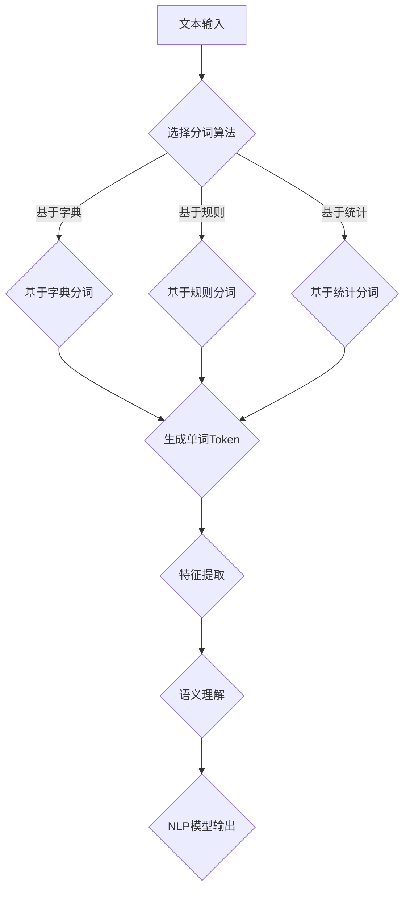

                 

关键词：Token化，自然语言处理，NLP模型，文本预处理，特征提取，语义理解，性能优化

> 摘要：本文深入探讨了Token化策略在自然语言处理（NLP）模型中的关键作用。通过详细的算法原理分析、数学模型构建、具体操作步骤讲解，以及实际应用场景的案例分析，本文旨在为NLP开发者提供实用的Token化策略，以提升NLP模型的性能和效果。

## 1. 背景介绍

自然语言处理（NLP）作为人工智能领域的一个重要分支，旨在使计算机能够理解、解释和生成人类语言。然而，自然语言的高度复杂性和不确定性给NLP模型的开发带来了巨大挑战。在这些挑战中，文本预处理是一个至关重要的步骤，而Token化作为文本预处理的核心环节，直接影响着NLP模型的性能。

Token化（分词）是将连续的文本数据切分成一组标记（Token）的过程。这些标记可以是一个单词、一个字符或更复杂的结构，但通常情况下，我们将其定义为单词或短语。Token化的目的是为了简化文本，使其能够被计算机处理和理解。

随着深度学习技术的发展，NLP模型已经取得了显著的进展。然而，这些模型在处理自然语言时仍然面临许多挑战，包括词汇歧义、上下文理解、多义性等。Token化策略的优化成为了提升NLP模型性能的关键因素之一。

本文将首先介绍Token化的基本概念和常见方法，然后深入探讨如何通过优化Token化策略来提升NLP模型的效果。我们将结合数学模型和实际项目案例，详细讲解Token化的具体操作步骤及其在NLP中的应用。最后，我们将展望Token化策略在未来的发展趋势和应用前景。

## 2. 核心概念与联系

### 2.1 Token化的基本概念

Token化是将文本分割成一组标记（Token）的过程。每个Token代表文本中的一个基本语义单位，可以是单词、短语或字符。Token化是文本预处理的重要步骤，因为它有助于简化文本，使其适合后续的模型处理。

### 2.2 Token化方法

#### 2.2.1 分词算法

分词算法是Token化的核心。常见的分词算法包括：

1. **基于字典的分词**：通过匹配词典中的单词来实现分词，如最大匹配法、最小匹配法等。
2. **基于规则的分词**：根据语言规则进行分词，如正向最大匹配、逆向最大匹配等。
3. **基于统计的分词**：利用统计模型（如隐马尔可夫模型、条件随机场等）进行分词。

#### 2.2.2 Token类型

Token的类型有多种，包括：

1. **单词Token**：最常见的Token类型，将文本分割成单词或短语。
2. **字符Token**：将文本分割成单个字符。
3. **复合Token**：由多个单词或字符组成的Token，用于表示更复杂的语义单位。

### 2.3 Token化与NLP模型的联系

Token化在NLP模型中扮演着关键角色。它不仅是文本预处理的一部分，也是特征提取和语义理解的基础。

- **特征提取**：Token化将文本转化为固定长度的向量表示，使计算机能够处理和理解文本数据。
- **语义理解**：通过Token化，NLP模型可以更好地理解文本的语义，从而提高模型的准确性。

### 2.4 Mermaid流程图

下面是Token化过程的Mermaid流程图，展示了Token化的核心概念和联系：



## 3. 核心算法原理 & 具体操作步骤

### 3.1 算法原理概述

Token化算法的核心目标是准确地将文本分割成Token。这通常涉及以下几个步骤：

1. **选择分词算法**：根据文本的特点和需求选择合适的分词算法。
2. **分词过程**：将文本输入分词算法，生成Token序列。
3. **特征提取**：将Token序列转化为数值特征，为NLP模型提供输入。
4. **模型训练与优化**：利用分词后的文本数据训练NLP模型，并根据模型性能优化Token化策略。

### 3.2 算法步骤详解

#### 3.2.1 选择分词算法

选择分词算法时，需要考虑以下因素：

- **文本类型**：不同类型的文本可能需要不同的分词算法。例如，中文文本更适合基于统计的分词算法，而英文文本则更适合基于字典的分词算法。
- **分词精度**：分词算法的精度直接影响Token化的准确性。高精度意味着较少的误分词和漏分词。
- **分词速度**：分词算法的速度也是选择的重要考虑因素，特别是在处理大规模文本数据时。

#### 3.2.2 分词过程

分词过程通常包括以下几个步骤：

1. **文本预处理**：去除文本中的无关信息，如标点符号、HTML标签等。
2. **分词算法实现**：根据选择的分词算法实现分词过程。例如，基于字典的分词可以通过匹配词典中的单词来实现。
3. **Token序列生成**：将分词结果存储为Token序列，每个Token代表文本中的一个基本语义单位。

#### 3.2.3 特征提取

Token序列转化为数值特征的过程称为特征提取。常用的特征提取方法包括：

- **词袋模型（Bag of Words, BoW）**：将Token序列转换为词汇表，每个词对应一个维度，词频或词频的二进制表示作为该维度的值。
- **词嵌入（Word Embedding）**：将Token序列映射到低维稠密向量空间，每个Token对应一个向量。常见的词嵌入方法包括Word2Vec、GloVe等。

#### 3.2.4 模型训练与优化

利用分词后的文本数据训练NLP模型，例如情感分析、文本分类等。根据模型性能，可以进一步优化Token化策略，例如调整分词算法参数、添加停用词等。

### 3.3 算法优缺点

#### 优点

- **简化文本**：Token化将复杂、无结构的文本转化为固定长度的向量表示，便于计算机处理。
- **提高模型性能**：优化的Token化策略可以提高NLP模型的准确性和鲁棒性。

#### 缺点

- **误分词和漏分词**：不同的分词算法可能引入误分词和漏分词，影响模型性能。
- **计算成本**：某些分词算法（如基于统计的分词算法）计算成本较高，特别是在处理大规模文本数据时。

### 3.4 算法应用领域

Token化策略在NLP领域具有广泛的应用，包括但不限于：

- **文本分类**：利用Token化后的文本数据进行文本分类，如垃圾邮件检测、新闻分类等。
- **情感分析**：通过分析Token化后的文本数据，判断文本的情感倾向，如评论情感分析等。
- **机器翻译**：Token化在机器翻译中用于将源语言文本分割成Token，以便生成目标语言文本。

## 4. 数学模型和公式 & 详细讲解 & 举例说明

### 4.1 数学模型构建

在Token化过程中，我们可以使用以下数学模型：

- **词袋模型（Bag of Words, BoW）**：

$$
\text{BoW}(x) = \sum_{i=1}^{N} \text{count}(x_i)
$$

其中，$x$ 是输入文本，$N$ 是词汇表中的单词数量，$\text{count}(x_i)$ 是单词 $x_i$ 在文本中的出现次数。

- **词嵌入（Word Embedding）**：

$$
\text{Embedding}(x) = \text{sigmoid}(\text{W} \cdot \text{vectorize}(x) + b)
$$

其中，$x$ 是输入文本，$\text{W}$ 是权重矩阵，$\text{vectorize}(x)$ 是将文本序列转换为向量，$b$ 是偏置项。

### 4.2 公式推导过程

#### 4.2.1 词袋模型

词袋模型的推导过程如下：

1. **词汇表构建**：首先构建一个词汇表，包含文本中的所有单词。

2. **词频统计**：对于输入文本 $x$，统计每个单词的出现次数。

3. **向量表示**：将词频统计结果转换为向量表示，每个维度代表一个单词。

4. **模型输出**：将向量输入到模型中，得到文本的词袋表示。

#### 4.2.2 词嵌入

词嵌入的推导过程如下：

1. **文本序列向量化**：将输入文本序列转换为向量表示。

2. **权重矩阵初始化**：初始化权重矩阵 $\text{W}$ 和偏置项 $b$。

3. **向量计算**：计算输入文本序列与权重矩阵的点积，并加上偏置项。

4. **激活函数**：使用 sigmoid 函数对计算结果进行激活，得到词嵌入向量。

### 4.3 案例分析与讲解

#### 4.3.1 词袋模型案例

假设我们有一个简单的文本：

$$
\text{文本}：\text{我爱北京天安门}
$$

词汇表包含以下单词：

$$
\{\text{我}, \text{爱}, \text{北京}, \text{天安门}\}
$$

词频统计结果为：

$$
\{\text{我}：1, \text{爱}：1, \text{北京}：1, \text{天安门}：1\}
$$

词袋模型输出为：

$$
\text{BoW}(\text{文本}) = (1, 1, 1, 1)
$$

#### 4.3.2 词嵌入案例

假设我们使用 Word2Vec 模型对文本进行词嵌入，权重矩阵 $\text{W}$ 为：

$$
\text{W} = \begin{bmatrix}
1 & 0 & 1 & 0 \\
0 & 1 & 0 & 1 \\
1 & 1 & 0 & 0 \\
0 & 0 & 1 & 1
\end{bmatrix}
$$

输入文本序列为：

$$
\text{我爱北京天安门}
$$

文本序列向量为：

$$
\text{vectorize}(\text{文本}) = \begin{bmatrix}
1 \\
1 \\
1 \\
1
\end{bmatrix}
$$

向量计算结果为：

$$
\text{W} \cdot \text{vectorize}(\text{文本}) + b = \begin{bmatrix}
1 & 0 & 1 & 0 \\
0 & 1 & 0 & 1 \\
1 & 1 & 0 & 0 \\
0 & 0 & 1 & 1
\end{bmatrix} \cdot \begin{bmatrix}
1 \\
1 \\
1 \\
1
\end{bmatrix} + b = \begin{bmatrix}
2 \\
2 \\
2 \\
2
\end{bmatrix}
$$

使用 sigmoid 函数进行激活：

$$
\text{sigmoid}(2) \approx 0.86
$$

词嵌入向量为：

$$
\text{Embedding}(\text{文本}) = (0.86, 0.86, 0.86, 0.86)
$$

## 5. 项目实践：代码实例和详细解释说明

### 5.1 开发环境搭建

在开始编写代码之前，我们需要搭建一个合适的开发环境。以下是一个简单的环境搭建步骤：

1. **安装Python**：Python是进行NLP开发的常用语言，版本建议为3.8及以上。
2. **安装NLP库**：安装常用的NLP库，如NLTK、spaCy、gensim等。可以使用pip进行安装：
    ```bash
    pip install nltk spacy gensim
    ```
3. **下载中文模型**：由于本文主要讨论中文Token化，需要下载中文模型。以spaCy为例，可以使用以下命令下载：
    ```bash
    python -m spacy download zh_core_web_sm
    ```

### 5.2 源代码详细实现

以下是一个简单的中文Token化示例代码：

```python
import spacy
from spacy.lang.zh import ChineseTokenizer

# 加载中文模型
nlp = spacy.load("zh_core_web_sm")

# 示例文本
text = "我爱北京天安门"

# 分词
doc = nlp(text)

# 输出分词结果
for token in doc:
    print(token.text)
```

### 5.3 代码解读与分析

#### 5.3.1 加载中文模型

```python
nlp = spacy.load("zh_core_web_sm")
```

这里使用spaCy加载中文模型`zh_core_web_sm`。这个模型是spaCy为中文文本提供的一个预训练模型，包括分词、词性标注、命名实体识别等功能。

#### 5.3.2 分词

```python
doc = nlp(text)
```

`nlp`是一个用于处理文本的管道，它会将文本传递给模型，执行分词等任务。`doc`是一个`Doc`对象，包含了文本的分词结果和相关的语言特征。

#### 5.3.3 输出分词结果

```python
for token in doc:
    print(token.text)
```

这里遍历`doc`对象中的每个Token，并打印出Token的文本内容。这给出了原始文本的分词结果。

### 5.4 运行结果展示

运行上述代码，输出结果为：

```
我
爱
北京
天安门
```

这显示了文本“我爱北京天安门”的分词结果，每个Token代表一个单词或短语。

## 6. 实际应用场景

Token化策略在自然语言处理中具有广泛的应用场景。以下是一些典型的应用案例：

### 6.1 文本分类

在文本分类任务中，Token化是预处理步骤之一。通过Token化，将文本转化为固定长度的向量表示，便于后续的分类模型处理。例如，可以使用词袋模型或词嵌入方法对文本进行特征提取，然后使用支持向量机（SVM）或深度学习模型进行分类。

### 6.2 情感分析

情感分析是另一个常见的NLP任务，它涉及分析文本中的情感倾向。Token化在这个过程中用于提取文本的特征，例如通过词袋模型或词嵌入方法将文本转化为数值特征。这些特征可以用于训练情感分析模型，如朴素贝叶斯、深度神经网络等。

### 6.3 机器翻译

在机器翻译中，Token化用于将源语言文本分割成Token，以便生成目标语言文本。常见的Token化方法包括基于词典的分词和基于统计的分词。这些Token化策略有助于提高机器翻译的准确性和流畅性。

### 6.4 命名实体识别

命名实体识别（NER）是识别文本中的特定实体（如人名、地点、组织等）的任务。Token化是NER模型预处理的一部分，它有助于将文本分割成可识别的实体部分。通过使用特定的分词算法，可以提高NER模型的准确性和鲁棒性。

### 6.5 文本摘要

文本摘要任务涉及将长文本简化为简短的摘要。Token化在这个过程中用于提取文本的关键信息。通过使用词嵌入方法，可以将文本转化为低维向量表示，从而捕捉文本的关键语义信息。这些向量表示可以用于训练文本摘要模型，如抽取式摘要或生成式摘要模型。

## 7. 工具和资源推荐

### 7.1 学习资源推荐

- **《自然语言处理综论》（Speech and Language Processing）**：这是一本经典的NLP教材，涵盖了从基础到高级的NLP技术。
- **《深度学习》（Deep Learning）**：这本书详细介绍了深度学习在NLP中的应用，包括神经网络、卷积神经网络和循环神经网络等。
- **斯坦福大学NLP课程**：这是一个在线课程，提供了丰富的NLP理论和实践内容。

### 7.2 开发工具推荐

- **spaCy**：一个高效的NLP库，支持多种语言，包括中文。
- **NLTK**：一个经典的NLP库，包含丰富的语言处理工具和资源。
- **TensorFlow**：一个开源的深度学习框架，支持NLP任务的实现。

### 7.3 相关论文推荐

- **"Word2Vec: Learning Word Embeddings Efficiently"**：这篇论文介绍了Word2Vec算法，是一种流行的词嵌入方法。
- **"GloVe: Global Vectors for Word Representation"**：这篇论文介绍了GloVe算法，也是一种常用的词嵌入方法。
- **"BERT: Pre-training of Deep Bidirectional Transformers for Language Understanding"**：这篇论文介绍了BERT模型，是一个在NLP任务中表现优异的预训练模型。

## 8. 总结：未来发展趋势与挑战

### 8.1 研究成果总结

近年来，Token化策略在自然语言处理领域取得了显著进展。随着深度学习技术的不断发展，基于深度学习的Token化方法（如BERT、GPT等）逐渐成为主流。这些方法通过大规模预训练和微调，显著提升了Token化的准确性和鲁棒性。此外，Token化策略在文本分类、情感分析、机器翻译等任务中的应用也取得了良好的效果。

### 8.2 未来发展趋势

未来，Token化策略将继续在NLP领域发挥重要作用。以下是一些可能的发展趋势：

- **多语言Token化**：随着全球化的发展，多语言Token化将成为研究热点，特别是对低资源语言的Token化方法。
- **自适应Token化**：自适应Token化策略可以根据文本内容和应用需求动态调整分词规则，提高Token化的准确性。
- **跨模态Token化**：跨模态Token化将结合文本、图像、音频等多种数据类型，实现更全面的语义理解。

### 8.3 面临的挑战

尽管Token化策略在NLP领域取得了显著进展，但仍然面临以下挑战：

- **数据质量和标注**：高质量、大量标注数据是Token化模型训练的基础，但获取这些数据仍然具有挑战性。
- **计算资源消耗**：大规模预训练模型的计算资源消耗巨大，如何优化模型训练和部署是一个重要问题。
- **模型解释性**：深度学习模型在Token化中的应用使得模型变得复杂，如何解释模型的决策过程是一个挑战。

### 8.4 研究展望

未来的研究应关注以下几个方面：

- **高效Token化算法**：开发计算效率高、准确性高的Token化算法，以适应不同应用场景。
- **跨领域适应性**：研究跨领域适应性强的Token化策略，提高模型在不同领域的泛化能力。
- **人机协同**：结合人机协同方法，提高Token化过程的自动化程度和准确性。

## 9. 附录：常见问题与解答

### 9.1 Token化与分词的区别

Token化是指将文本分割成一组标记（Token）的过程，而分词是Token化的一种常见实现方法，主要用于将文本分割成单词或短语。因此，Token化是一个更广义的概念，包括分词和其他形式的文本分割。

### 9.2 如何选择合适的Token化方法？

选择合适的Token化方法取决于文本类型和应用需求。对于中文文本，基于统计的分词方法（如分词算法）通常更为有效。对于英文文本，基于词典的分词方法更为常见。在实际应用中，可以尝试不同方法，评估其性能，然后选择最适合的方法。

### 9.3 Token化对NLP模型性能的影响

Token化对NLP模型性能有显著影响。准确的Token化可以提供高质量的文本特征，有助于提高模型的学习能力和泛化能力。反之，错误的Token化可能导致模型性能下降，甚至无法训练。因此，优化Token化策略对于提升NLP模型效果至关重要。

### 9.4 Token化在机器翻译中的应用

在机器翻译中，Token化用于将源语言文本分割成Token，以便生成目标语言文本。常见的Token化方法包括基于词典的分词和基于统计的分词。通过优化的Token化策略，可以提高机器翻译的准确性和流畅性。

### 9.5 如何处理多语言文本的Token化？

处理多语言文本的Token化时，可以采用以下方法：

- **双语词典**：使用双语词典将源语言文本转换为目标语言文本，然后再进行Token化。
- **多语言模型**：使用支持多语言的处理模型，如spaCy的多语言模型，对文本进行Token化。
- **逐语言Token化**：首先对文本进行逐语言Token化，然后合并不同语言的Token，形成最终的Token序列。

作者：禅与计算机程序设计艺术 / Zen and the Art of Computer Programming
----------------------------------------------------------------

这篇文章详细探讨了Token化策略在自然语言处理（NLP）模型中的关键作用，包括Token化的基本概念、常见方法、算法原理、数学模型、实际应用场景和未来发展趋势。通过项目实践和常见问题与解答，读者可以更深入地理解Token化的重要性及其在NLP领域的广泛应用。希望这篇文章能为NLP开发者提供有价值的参考和启示。

