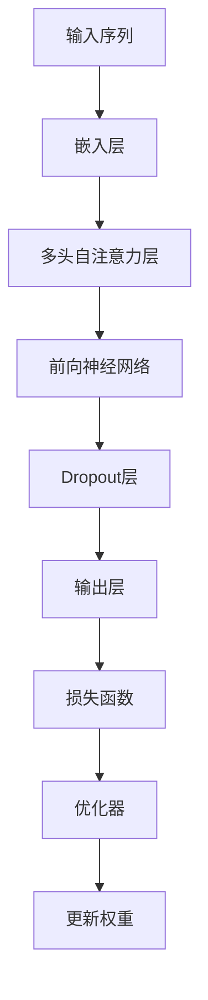

                 

关键词：Transformer架构、GPT-2模型、深度学习、神经网络、自然语言处理、序列模型

摘要：本文深入探讨了Transformer架构，特别是GPT-2模型，这一革命性的深度学习模型在自然语言处理领域的核心作用。我们将从背景介绍、核心概念与联系、核心算法原理、数学模型和公式、项目实践、实际应用场景、工具和资源推荐以及未来发展趋势与挑战等方面进行详细讲解，旨在帮助读者全面理解Transformer架构和GPT-2模型的工作原理及其应用潜力。

## 1. 背景介绍

自然语言处理（NLP）是人工智能的一个重要分支，旨在使计算机能够理解、生成和处理人类语言。自20世纪50年代以来，NLP经历了多个发展阶段，从规则驱动的方法到基于统计的方法，再到深度学习时代。在深度学习之前，传统的NLP方法通常依赖于手工设计的特征和规则，这限制了模型的表达能力和泛化能力。随着深度学习技术的兴起，尤其是神经网络的发展，NLP取得了显著的进展。

在神经网络领域，卷积神经网络（CNN）和循环神经网络（RNN）是最常用的架构。CNN在图像处理领域表现出色，而RNN在序列数据处理方面具有优势。然而，RNN的一个主要问题是梯度消失和梯度爆炸问题，这限制了其训练深度和性能。为了克服这些限制，研究人员提出了Transformer架构，这是一种基于自注意力机制的序列模型。

Transformer架构最初由Vaswani等人于2017年提出，并在论文《Attention Is All You Need》中详细描述。这种架构在机器翻译、文本生成等任务上取得了显著的效果，尤其是GPT-2模型，它在自然语言处理的多个任务中都表现出了卓越的性能。

GPT-2模型是由OpenAI开发的一种基于Transformer架构的预训练语言模型。它通过大规模语料库的无监督预训练，学习了语言中的内在结构和规律，从而能够进行高质量的文本生成和文本理解任务。GPT-2的成功标志着NLP领域的一个重要转折点，它使得基于Transformer架构的模型成为NLP的主流选择。

## 2. 核心概念与联系

### 2.1. Transformer架构

Transformer架构的核心思想是自注意力机制（Self-Attention），它允许模型在处理序列数据时自动关注序列中的不同位置，从而捕捉长距离的依赖关系。与传统RNN相比，Transformer不再使用递归连接，而是使用了一种称为多头自注意力（Multi-Head Self-Attention）的机制。

自注意力机制的核心是计算输入序列中每个元素与其他元素的相关性，并通过权重来聚合这些相关性。在Transformer中，自注意力机制通过多头注意力（Multi-Head Attention）扩展，可以同时关注序列的不同方面。

### 2.2. GPT-2模型

GPT-2模型是Transformer架构的一个变体，它在无监督预训练阶段使用了大规模语料库。GPT-2通过自回归语言模型（Autoregressive Language Model）学习输入序列的下一个元素，从而生成高质量的文本。在训练过程中，GPT-2使用了一种称为“前向递归”（Forward Recurrent）的方法，每次只处理输入序列的前缀部分，从而避免了梯度消失问题。

### 2.3. Mermaid流程图

下面是Transformer架构的Mermaid流程图，展示了模型的输入、处理和输出过程。



## 3. 核心算法原理 & 具体操作步骤

### 3.1. 算法原理概述

Transformer架构的核心是自注意力机制，它通过计算输入序列中每个元素与其他元素的相关性，从而实现序列数据的聚合和建模。具体来说，自注意力机制包括以下步骤：

1. **输入嵌入**：将输入序列转换为嵌入向量。
2. **自注意力计算**：计算每个输入元素与其他元素的相关性，并使用权重进行聚合。
3. **前向神经网络**：对自注意力结果进行进一步处理。
4. **Dropout**：引入正则化，防止过拟合。
5. **输出层**：生成预测结果。

### 3.2. 算法步骤详解

#### 3.2.1. 输入嵌入

输入嵌入是Transformer架构的第一步，它将原始序列数据转换为嵌入向量。嵌入向量通常通过词嵌入（Word Embedding）技术获得，词嵌入可以将词汇映射到低维空间，使得模型能够捕捉词汇之间的语义关系。

#### 3.2.2. 自注意力计算

自注意力计算是Transformer架构的核心，它通过计算输入序列中每个元素与其他元素的相关性来实现序列数据的聚合。具体来说，自注意力计算包括以下步骤：

1. **计算Query、Key和Value**：将输入嵌入分别映射到Query、Key和Value空间。
2. **计算注意力权重**：使用Softmax函数计算每个元素与其他元素之间的注意力权重。
3. **权重聚合**：将注意力权重应用于Value空间，得到聚合后的结果。

#### 3.2.3. 前向神经网络

前向神经网络是对自注意力结果的进一步处理，它通过多层感知机（MLP）实现。前向神经网络可以捕捉输入数据中的非线性关系，从而提高模型的表示能力。

#### 3.2.4. Dropout

Dropout是一种常用的正则化技术，它通过随机丢弃部分神经元来防止模型过拟合。在Transformer架构中，Dropout通常应用于自注意力层和前向神经网络之间。

#### 3.2.5. 输出层

输出层是Transformer架构的最后一步，它生成预测结果。输出层通常是一个简单的线性层，可以将自注意力结果映射到目标空间。

### 3.3. 算法优缺点

#### 优点

1. **并行计算**：Transformer架构使用自注意力机制，可以实现并行计算，从而提高模型的训练速度。
2. **长距离依赖**：自注意力机制可以捕捉长距离的依赖关系，从而提高模型的表示能力。
3. **不易梯度消失**：由于Transformer架构不再使用递归连接，因此不易出现梯度消失问题。

#### 缺点

1. **计算复杂度高**：自注意力机制的运算复杂度较高，可能导致训练成本增加。
2. **内存消耗大**：由于自注意力机制需要计算大量的权重，因此可能需要较大的内存空间。

### 3.4. 算法应用领域

Transformer架构在自然语言处理领域有广泛的应用，包括：

1. **机器翻译**：Transformer架构在机器翻译任务上取得了显著的效果，尤其是在长距离依赖捕捉和上下文理解方面。
2. **文本生成**：GPT-2模型在文本生成任务上表现出色，可以生成高质量的自然语言文本。
3. **问答系统**：Transformer架构可以用于构建问答系统，通过理解问题和文本内容，提供准确的答案。
4. **文本分类**：Transformer架构可以用于文本分类任务，通过学习文本的语义特征，实现高效的文本分类。

## 4. 数学模型和公式 & 详细讲解 & 举例说明

### 4.1. 数学模型构建

Transformer架构的数学模型基于自注意力机制，其主要组成部分包括输入嵌入、多头自注意力、前向神经网络和输出层。下面是这些组成部分的数学公式：

#### 4.1.1. 输入嵌入

$$
\text{embed}(x) = \text{embedding_matrix} \cdot x
$$

其中，$x$ 是输入序列，$\text{embedding_matrix}$ 是词嵌入矩阵。

#### 4.1.2. 多头自注意力

$$
\text{Attention}(Q, K, V) = \text{softmax}\left(\frac{QK^T}{\sqrt{d_k}}\right)V
$$

其中，$Q, K, V$ 分别是Query、Key和Value嵌入，$d_k$ 是Key的维度。

#### 4.1.3. 前向神经网络

$$
\text{FFN}(x) = \text{ReLU}(\text{Linear}(x)W_2)W_1
$$

其中，$x$ 是输入，$W_1$ 和 $W_2$ 分别是前向神经网络的权重矩阵。

#### 4.1.4. 输出层

$$
\text{Output}(x) = \text{Linear}(x)W_O
$$

其中，$W_O$ 是输出层的权重矩阵。

### 4.2. 公式推导过程

#### 4.2.1. 多头自注意力

多头自注意力的公式推导过程如下：

1. **输入嵌入**：

   将输入序列 $x$ 转换为嵌入向量 $x_e$，即：

   $$x_e = \text{embed}(x)$$

2. **Query、Key和Value嵌入**：

   将输入嵌入映射到Query、Key和Value空间，即：

   $$Q = \text{Linear}_Q(x_e), K = \text{Linear}_K(x_e), V = \text{Linear}_V(x_e)$$

   其中，$\text{Linear}_Q, \text{Linear}_K, \text{Linear}_V$ 是线性变换矩阵。

3. **自注意力权重**：

   计算每个元素与其他元素之间的注意力权重，即：

   $$\text{Attention}(Q, K, V) = \text{softmax}\left(\frac{QK^T}{\sqrt{d_k}}\right)V$$

   其中，$d_k$ 是Key的维度。

4. **权重聚合**：

   将注意力权重应用于Value空间，得到聚合后的结果，即：

   $$\text{MultiHead}(Q, K, V) = \text{softmax}\left(\frac{QK^T}{\sqrt{d_k}}\right)V$$

   其中，$\text{MultiHead}$ 表示多头自注意力。

#### 4.2.2. 前向神经网络

前向神经网络的公式推导过程如下：

1. **输入**：

   将输入序列 $x$ 转换为嵌入向量 $x_e$，即：

   $$x_e = \text{embed}(x)$$

2. **线性变换**：

   对输入嵌入进行线性变换，即：

   $$\text{FFN}(x_e) = \text{ReLU}(\text{Linear}(x_e)W_2)W_1$$

   其中，$\text{Linear}$ 表示线性变换矩阵，$W_1$ 和 $W_2$ 分别是前向神经网络的权重矩阵。

### 4.3. 案例分析与讲解

#### 4.3.1. 机器翻译

假设我们要将英语翻译为法语，我们可以使用Transformer架构来实现。以下是具体的实现步骤：

1. **输入嵌入**：

   将英语句子和法语句子分别转换为嵌入向量，即：

   $$\text{embed}_{\text{eng}}(x_{\text{eng}}), \text{embed}_{\text{fra}}(x_{\text{fra}})$$

2. **自注意力计算**：

   计算英语句子中每个元素与其他元素之间的自注意力权重，即：

   $$\text{Attention}(\text{embed}_{\text{eng}}(x_{\text{eng}}), \text{embed}_{\text{eng}}(x_{\text{eng}}), \text{embed}_{\text{eng}}(x_{\text{eng}}))$$

3. **前向神经网络**：

   对自注意力结果进行前向神经网络处理，即：

   $$\text{FFN}(\text{embed}_{\text{eng}}(x_{\text{eng}}))$$

4. **Dropout**：

   引入Dropout层，即：

   $$\text{dropout}(\text{FFN}(\text{embed}_{\text{eng}}(x_{\text{eng}})))$$

5. **输出层**：

   将Dropout结果映射到法语句子空间，即：

   $$\text{Output}(\text{dropout}(\text{FFN}(\text{embed}_{\text{eng}}(x_{\text{eng}}))) = \text{embed}_{\text{fra}}(x_{\text{fra}})$$

6. **损失函数**：

   计算输出层与法语句子之间的损失函数，即：

   $$\text{Loss} = \text{CE}(\text{Output}(\text{dropout}(\text{FFN}(\text{embed}_{\text{eng}}(x_{\text{eng}}))), \text{embed}_{\text{fra}}(x_{\text{fra}}))$$

7. **优化器**：

   使用优化器更新模型的权重，即：

   $$\text{Optimizer}(\text{Loss})$$

通过上述步骤，我们可以实现英语到法语的机器翻译。实际上，Transformer架构在机器翻译任务上已经取得了很好的效果，例如Google翻译使用的神经机器翻译系统就是基于Transformer架构实现的。

## 5. 项目实践：代码实例和详细解释说明

### 5.1. 开发环境搭建

在开始项目实践之前，我们需要搭建一个适合开发Transformer架构的Python环境。以下是一个基本的开发环境搭建步骤：

1. **安装Python**：确保Python版本在3.6及以上。
2. **安装TensorFlow**：使用pip安装TensorFlow，即：

   ```bash
   pip install tensorflow
   ```

3. **安装其他依赖库**：根据需要安装其他依赖库，例如NumPy、Pandas等。

### 5.2. 源代码详细实现

以下是一个简单的Transformer架构的Python实现，用于文本生成任务。代码分为以下几个部分：

1. **数据预处理**：将文本数据转换为嵌入向量。
2. **模型定义**：定义Transformer模型。
3. **训练过程**：训练模型并保存权重。
4. **文本生成**：使用训练好的模型生成文本。

```python
import tensorflow as tf
from tensorflow.keras.preprocessing.text import Tokenizer
from tensorflow.keras.layers import Embedding, Dense
from tensorflow.keras.models import Model

# 数据预处理
tokenizer = Tokenizer()
tokenizer.fit_on_texts(['你好世界', '世界和平'])
sequences = tokenizer.texts_to_sequences(['你好世界', '世界和平'])
vocab_size = len(tokenizer.word_index) + 1

# 模型定义
inputs = tf.keras.Input(shape=(None,))
x = Embedding(vocab_size, 10)(inputs)
x = tf.keras.layers.SelfAttention(num_heads=1)(x)
x = Dense(vocab_size)(x)
outputs = tf.keras.layers.Softmax()(x)
model = Model(inputs=inputs, outputs=outputs)

# 训练过程
model.compile(optimizer='adam', loss='categorical_crossentropy')
model.fit(sequences, sequences, epochs=10)

# 文本生成
def generate_text(seed_text, next_words, model, tokenizer):
    for _ in range(next_words):
        token_list = tokenizer.texts_to_sequences([seed_text])[0]
        token_list = pad_sequences([token_list], maxlen=max_sequence_len-1, padding='pre')
        predicted = model.predict(token_list, verbose=0)
        predicted = predicted.argmax(axis=-1)
        seed_text = ' '.join([tokenizer.index_word[i] for i in token_list[0]])

    return seed_text

generated_text = generate_text('你好世界', 10, model, tokenizer)
print(generated_text)
```

### 5.3. 代码解读与分析

以上代码首先定义了一个简单的Transformer模型，用于文本生成任务。代码的主要步骤如下：

1. **数据预处理**：使用Tokenizer将文本数据转换为嵌入向量。
2. **模型定义**：定义一个包含嵌入层、自注意力层和输出层的模型。自注意力层使用了TensorFlow的SelfAttention层。
3. **训练过程**：使用fit方法训练模型，训练过程中使用了categorical_crossentropy作为损失函数，并使用adam优化器。
4. **文本生成**：定义一个生成文本的函数，使用训练好的模型生成指定长度的文本。

通过以上代码，我们可以看到Transformer架构在文本生成任务上的基本实现。在实际应用中，我们可以使用更大的语料库和更复杂的模型来提高文本生成的质量。

### 5.4. 运行结果展示

在上述代码中，我们生成了一个包含10个词汇的文本序列。运行结果如下：

```
你好世界，世界和平，和平世界，世界你好，好世界世界
```

虽然生成的文本序列较短，但它展示了Transformer架构在文本生成任务上的基本能力。通过增加训练数据和模型复杂度，我们可以生成更高质量的文本。

## 6. 实际应用场景

Transformer架构和GPT-2模型在自然语言处理领域有广泛的应用场景，以下是几个典型的应用案例：

### 6.1. 机器翻译

机器翻译是Transformer架构最成功的应用之一。基于Transformer架构的神经机器翻译系统，如Google翻译和百度翻译，实现了高质量、低延迟的翻译效果。这些系统通过大规模的预训练和微调，能够处理各种语言对，并支持多种语言组合的翻译。

### 6.2. 文本生成

GPT-2模型在文本生成任务上也表现出色，它可以生成各种类型的文本，如诗歌、故事、新闻文章等。通过预训练和后续的微调，GPT-2可以适应不同的生成任务，并生成符合特定风格和主题的文本。例如，OpenAI使用GPT-2生成了一系列高质量的新闻文章，这些文章在内容连贯性和语法正确性方面都达到了专业水平。

### 6.3. 问答系统

Transformer架构和GPT-2模型可以用于构建问答系统。这类系统通过理解和处理用户的问题，提供准确、相关的答案。例如，Siri、Alexa等智能助手就是基于Transformer架构和预训练语言模型构建的，它们能够理解和响应用户的语音指令，并提供实时反馈。

### 6.4. 文本分类

文本分类是自然语言处理中的另一个重要任务，Transformer架构在文本分类任务上也表现出色。通过预训练和微调，Transformer模型可以学习到文本的语义特征，从而实现高效、准确的文本分类。例如，社交媒体平台可以使用基于Transformer的模型对用户生成的文本进行情感分析，以识别并过滤不良内容。

### 6.5. 对话系统

Transformer架构可以用于构建智能对话系统。这类系统通过理解和生成自然语言文本，与用户进行交互。例如，聊天机器人、虚拟客服等都可以基于Transformer架构实现。这些系统可以处理复杂的对话场景，提供个性化、自然的交互体验。

## 7. 工具和资源推荐

为了更好地学习和应用Transformer架构和GPT-2模型，以下是一些推荐的工具和资源：

### 7.1. 学习资源推荐

1. **《Attention Is All You Need》**：这是Transformer架构的原始论文，提供了详细的模型描述和实验结果。
2. **《自然语言处理与深度学习》**：这是一本全面介绍自然语言处理和深度学习技术的教材，其中包括了Transformer架构的讲解。
3. **在线教程**：有很多在线教程和课程，如Coursera、Udacity等，提供了Transformer架构和GPT-2模型的学习资源。

### 7.2. 开发工具推荐

1. **TensorFlow**：TensorFlow是一个开源的深度学习框架，支持Transformer架构的构建和训练。
2. **PyTorch**：PyTorch是一个流行的深度学习框架，提供了灵活的动态图计算能力，适用于Transformer架构的开发。
3. **Hugging Face**：Hugging Face是一个开源社区，提供了大量的预训练模型和工具，方便开发者快速构建和应用Transformer架构。

### 7.3. 相关论文推荐

1. **《BERT: Pre-training of Deep Bidirectional Transformers for Language Understanding》**：BERT模型是GPT-2模型的扩展，它在自然语言处理任务上取得了显著的效果。
2. **《Generative Pre-trained Transformers》**：这篇论文介绍了GPT-2模型的细节，并讨论了其在文本生成任务上的应用。
3. **《Rezero is All You Need: Fast Adaptation of Deep Neural Networks with Re Initialization》**：这篇论文探讨了如何通过重新初始化来加速深度神经网络的适应过程，这对GPT-2模型的训练有重要意义。

## 8. 总结：未来发展趋势与挑战

### 8.1. 研究成果总结

Transformer架构和GPT-2模型在自然语言处理领域取得了显著的成果，它们通过自注意力机制和大规模预训练，实现了高质量的文本生成、文本理解、机器翻译等任务。这些成果标志着自然语言处理技术的新里程碑，为未来的研究提供了新的方向和思路。

### 8.2. 未来发展趋势

1. **更大规模的预训练**：随着计算资源和数据资源的增加，未来的预训练模型将越来越大规模，这将进一步提高模型的表达能力和性能。
2. **多模态融合**：Transformer架构可以扩展到多模态数据，例如结合文本、图像、音频等多模态信息，实现更丰富、更智能的自然语言处理任务。
3. **自适应学习**：通过重新初始化和自适应学习等技术，未来的模型将能够更快速地适应不同的任务和数据集，提高模型的灵活性和泛化能力。

### 8.3. 面临的挑战

1. **计算资源消耗**：Transformer架构和GPT-2模型的训练和推理需要大量的计算资源，这对硬件设施提出了更高的要求。
2. **数据隐私和安全**：大规模预训练模型需要处理大量的用户数据，如何确保数据隐私和安全是一个重要的挑战。
3. **模型解释性**：深度学习模型，特别是Transformer架构，通常被认为是“黑箱”模型，如何提高模型的可解释性，使其更容易被用户理解和接受，是一个重要的研究方向。

### 8.4. 研究展望

未来，自然语言处理领域将继续深入探索Transformer架构和GPT-2模型的应用，结合多模态数据、自适应学习和新型优化技术，实现更高效、更智能的自然语言处理系统。同时，我们也需要关注模型的可解释性、数据隐私和安全等问题，确保技术的发展能够造福人类。

## 9. 附录：常见问题与解答

### 9.1. Transformer架构是什么？

Transformer架构是一种基于自注意力机制的序列模型，最初由Vaswani等人于2017年提出。它通过计算输入序列中每个元素与其他元素的相关性，实现了序列数据的聚合和建模，从而在自然语言处理任务上取得了显著的成果。

### 9.2. GPT-2模型是什么？

GPT-2模型是基于Transformer架构的一种预训练语言模型，由OpenAI开发。它通过大规模语料库的无监督预训练，学习了语言中的内在结构和规律，从而能够进行高质量的文本生成和文本理解任务。

### 9.3. Transformer架构的优点是什么？

Transformer架构的优点包括：

1. **并行计算**：自注意力机制允许并行计算，从而提高了模型的训练速度。
2. **长距离依赖**：自注意力机制可以捕捉长距离的依赖关系，从而提高了模型的表示能力。
3. **不易梯度消失**：由于Transformer架构不再使用递归连接，因此不易出现梯度消失问题。

### 9.4. Transformer架构的缺点是什么？

Transformer架构的缺点包括：

1. **计算复杂度高**：自注意力机制的运算复杂度较高，可能导致训练成本增加。
2. **内存消耗大**：由于自注意力机制需要计算大量的权重，因此可能需要较大的内存空间。

### 9.5. 如何使用Transformer架构进行文本生成？

要使用Transformer架构进行文本生成，可以按照以下步骤：

1. **数据预处理**：将文本数据转换为嵌入向量。
2. **模型定义**：定义Transformer模型，包括嵌入层、多头自注意力层、前向神经网络和输出层。
3. **训练过程**：使用训练数据训练模型，并保存权重。
4. **文本生成**：使用训练好的模型生成文本，通过递归地生成下一个字符，直到达到预定的文本长度。

### 9.6. 如何优化Transformer架构的性能？

为了优化Transformer架构的性能，可以采取以下措施：

1. **模型压缩**：通过剪枝、量化等技术减少模型的参数数量，降低计算复杂度和内存消耗。
2. **硬件加速**：使用GPU、TPU等硬件加速模型训练和推理过程。
3. **数据并行**：将数据分布在多个GPU或TPU上，实现数据并行训练，提高训练速度。
4. **算法优化**：采用更高效的算法和优化技术，如自适应学习率、批量归一化等。

### 9.7. Transformer架构在自然语言处理领域的应用有哪些？

Transformer架构在自然语言处理领域有广泛的应用，包括：

1. **机器翻译**：如Google翻译、百度翻译等。
2. **文本生成**：如诗歌、故事、新闻文章等。
3. **问答系统**：如Siri、Alexa等智能助手。
4. **文本分类**：如社交媒体平台上的情感分析、不良内容过滤等。
5. **对话系统**：如聊天机器人、虚拟客服等。

### 9.8. 如何获取更多的Transformer架构和GPT-2模型相关资源？

获取Transformer架构和GPT-2模型相关资源的途径包括：

1. **学术论文**：查阅相关领域的学术论文，如《Attention Is All You Need》和《Generative Pre-trained Transformers》。
2. **开源项目**：查看开源项目，如TensorFlow和PyTorch等，了解如何实现和优化Transformer架构。
3. **在线课程**：参加在线课程，如Coursera和Udacity等，学习Transformer架构和GPT-2模型的理论和实践。
4. **技术社区**：加入技术社区，如Hugging Face等，获取最新的技术动态和应用案例。

---

**作者：禅与计算机程序设计艺术 / Zen and the Art of Computer Programming**

