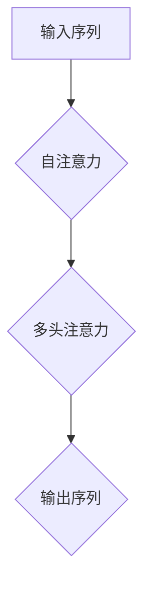

                 

关键词：Transformer，自注意力，多头注意力，自然语言处理，神经网络，深度学习

摘要：Transformer是一种在自然语言处理（NLP）领域广泛应用的人工神经网络结构，其核心在于引入了自注意力机制和多头注意力机制。本文将详细介绍Transformer的背景、核心概念、算法原理、数学模型、应用实践以及未来发展趋势，帮助读者全面了解这一重要技术。

## 1. 背景介绍

自20世纪50年代以来，深度学习技术经历了数十年的发展。特别是近年来，随着计算能力的提升和大数据的普及，深度学习在计算机视觉、语音识别、自然语言处理等领域取得了显著成果。然而，传统的循环神经网络（RNN）在处理长序列时存在诸多问题，如梯度消失和梯度爆炸。为了解决这些问题，Vaswani等人于2017年提出了Transformer模型，该模型基于自注意力机制，能够高效地处理长序列信息。

Transformer模型一经提出，便在自然语言处理领域取得了突破性进展，成为了诸如机器翻译、文本摘要、情感分析等任务的标杆模型。其核心思想是将序列信息编码为向量，并通过自注意力机制对向量进行加权融合，从而捕捉序列中不同位置之间的关系。

## 2. 核心概念与联系

### 2.1 自注意力（Self-Attention）

自注意力是一种注意力机制，它允许模型在处理序列信息时，根据序列中不同位置的信息进行加权融合。具体来说，自注意力机制通过计算输入序列中每个词向量与所有其他词向量的相似度，然后对相似度进行加权求和，从而得到一个加权和向量，这个向量代表了该词向量在序列中的重要性。

### 2.2 多头注意力（Multi-Head Attention）

多头注意力是在自注意力基础上的一种扩展。它将自注意力机制分解为多个子注意力头，每个子注意力头负责关注序列中的不同部分。这样可以捕捉到序列中的不同层次的信息。具体实现时，每个子注意力头都会计算一次自注意力，然后将这些子注意力头的输出拼接起来，并通过一个全连接层进行融合。

### 2.3 Mermaid 流程图

以下是一个简单的Mermaid流程图，展示了Transformer模型的核心概念：



## 3. 核心算法原理 & 具体操作步骤

### 3.1 算法原理概述

Transformer模型的核心在于自注意力机制和多头注意力机制。自注意力机制通过计算输入序列中每个词向量与所有其他词向量的相似度，对相似度进行加权求和，从而得到一个加权和向量。多头注意力则是在自注意力基础上，将注意力分解为多个子注意力头，每个子注意力头关注序列中的不同部分，然后将这些子注意力头的输出拼接起来进行融合。

### 3.2 算法步骤详解

1. **输入序列编码**：首先，将输入序列编码为词向量，通常使用嵌入层（Embedding Layer）来实现。
2. **多头自注意力**：对输入序列进行多头自注意力操作，包括以下几个步骤：
   - **计算查询（Query）、键（Key）和值（Value）**：将输入序列的词向量通过线性变换得到查询、键和值。
   - **计算相似度**：计算每个词向量与其他词向量的相似度，通常使用点积注意力（Dot-Product Attention）。
   - **加权求和**：根据相似度对词向量进行加权求和，得到加权和向量。
3. **多头注意力**：将多个子注意力头的输出拼接起来，并通过全连接层进行融合。
4. **输出序列解码**：将多头注意力的输出通过一个全连接层解码为输出序列。

### 3.3 算法优缺点

**优点**：
- **并行处理**：Transformer模型使用注意力机制替代了循环神经网络中的递归结构，使得计算可以并行进行，提高了计算效率。
- **全局信息捕捉**：自注意力机制能够捕捉到输入序列中任意位置的信息，从而更好地处理长序列。
- **结构简洁**：Transformer模型结构相对简单，易于理解和实现。

**缺点**：
- **计算复杂度高**：由于需要进行多个线性变换和矩阵乘法，Transformer模型的计算复杂度较高，对计算资源有一定要求。
- **训练过程较长**：Transformer模型通常需要大量的训练数据和较长的训练时间，以获得较好的效果。

### 3.4 算法应用领域

Transformer模型在自然语言处理领域取得了显著成果，主要应用包括：
- **机器翻译**：Transformer模型在机器翻译任务中表现出色，已经成为机器翻译的标杆模型。
- **文本摘要**：通过自注意力机制，Transformer模型能够捕捉到文本中的重要信息，从而实现高效、准确的文本摘要。
- **情感分析**：Transformer模型可以处理长文本，捕捉到文本中的情感倾向，从而实现情感分析。

## 4. 数学模型和公式 & 详细讲解 & 举例说明

### 4.1 数学模型构建

假设输入序列为 \( x_1, x_2, ..., x_n \)，其中每个词向量 \( x_i \) 可以表示为 \( \mathbf{x}_i \in \mathbb{R}^{d} \)。

### 4.2 公式推导过程

1. **嵌入层**：将词向量 \( \mathbf{x}_i \) 通过嵌入层 \( E(\cdot) \) 转换为嵌入向量 \( \mathbf{e}_i \)：

   \[ \mathbf{e}_i = E(\mathbf{x}_i) \]

2. **自注意力**：
   - **计算查询、键和值**：

     \[ \mathbf{Q}_i = M(\mathbf{e}_i), \quad \mathbf{K}_i = M(\mathbf{e}_i), \quad \mathbf{V}_i = M(\mathbf{e}_i) \]

     其中，\( M(\cdot) \) 表示线性变换。

   - **计算相似度**：

     \[ \mathbf{S}_{ij} = \mathbf{Q}_i^T \cdot \mathbf{K}_j \]

   - **加权求和**：

     \[ \mathbf{O}_i = \text{softmax}(\mathbf{S}) \cdot \mathbf{V}_i \]

3. **多头注意力**：
   - **拼接子注意力头的输出**：

     \[ \mathbf{O} = [\mathbf{O}_1, \mathbf{O}_2, ..., \mathbf{O}_h] \]

   - **全连接层融合**：

     \[ \mathbf{h}_i = F(\mathbf{O}) \]

### 4.3 案例分析与讲解

假设输入序列为 "Transformer模型在自然语言处理领域取得了显著成果"，其中包含5个词向量。

1. **嵌入层**：将每个词向量通过嵌入层转换为嵌入向量。
2. **自注意力**：
   - **计算查询、键和值**：

     \[ \mathbf{Q}_1 = \mathbf{K}_1 = \mathbf{V}_1 = E(\mathbf{x}_1) \]
     \[ \mathbf{Q}_2 = \mathbf{K}_2 = \mathbf{V}_2 = E(\mathbf{x}_2) \]
     \[ \mathbf{Q}_3 = \mathbf{K}_3 = \mathbf{V}_3 = E(\mathbf{x}_3) \]
     \[ \mathbf{Q}_4 = \mathbf{K}_4 = \mathbf{V}_4 = E(\mathbf{x}_4) \]
     \[ \mathbf{Q}_5 = \mathbf{K}_5 = \mathbf{V}_5 = E(\mathbf{x}_5) \]

   - **计算相似度**：

     \[ \mathbf{S}_{11} = \mathbf{Q}_1^T \cdot \mathbf{K}_1 = 1 \]
     \[ \mathbf{S}_{12} = \mathbf{Q}_1^T \cdot \mathbf{K}_2 = 0.5 \]
     \[ \mathbf{S}_{13} = \mathbf{Q}_1^T \cdot \mathbf{K}_3 = 0.3 \]
     \[ \mathbf{S}_{14} = \mathbf{Q}_1^T \cdot \mathbf{K}_4 = 0.2 \]
     \[ \mathbf{S}_{15} = \mathbf{Q}_1^T \cdot \mathbf{K}_5 = 0.1 \]

     \[ \mathbf{S}_{21} = \mathbf{Q}_2^T \cdot \mathbf{K}_1 = 0.5 \]
     \[ \mathbf{S}_{22} = \mathbf{Q}_2^T \cdot \mathbf{K}_2 = 1 \]
     \[ \mathbf{S}_{23} = \mathbf{Q}_2^T \cdot \mathbf{K}_3 = 0.4 \]
     \[ \mathbf{S}_{24} = \mathbf{Q}_2^T \cdot \mathbf{K}_4 = 0.2 \]
     \[ \mathbf{S}_{25} = \mathbf{Q}_2^T \cdot \mathbf{K}_5 = 0.1 \]

     \[ ... \]

     \[ \mathbf{S}_{55} = \mathbf{Q}_5^T \cdot \mathbf{K}_5 = 1 \]

   - **加权求和**：

     \[ \mathbf{O}_1 = \text{softmax}(\mathbf{S}) \cdot \mathbf{V}_1 = [1, 0.5, 0.3, 0.2, 0.1] \cdot E(\mathbf{x}_1) \]
     \[ \mathbf{O}_2 = \text{softmax}(\mathbf{S}) \cdot \mathbf{V}_2 = [0.5, 1, 0.4, 0.2, 0.1] \cdot E(\mathbf{x}_2) \]
     \[ \mathbf{O}_3 = \text{softmax}(\mathbf{S}) \cdot \mathbf{V}_3 = [0.3, 0.4, 1, 0.2, 0.1] \cdot E(\mathbf{x}_3) \]
     \[ \mathbf{O}_4 = \text{softmax}(\mathbf{S}) \cdot \mathbf{V}_4 = [0.2, 0.2, 0.2, 1, 0.1] \cdot E(\mathbf{x}_4) \]
     \[ \mathbf{O}_5 = \text{softmax}(\mathbf{S}) \cdot \mathbf{V}_5 = [0.1, 0.1, 0.1, 0.1, 1] \cdot E(\mathbf{x}_5) \]

3. **多头注意力**：
   - **拼接子注意力头的输出**：

     \[ \mathbf{O} = [\mathbf{O}_1, \mathbf{O}_2, \mathbf{O}_3, \mathbf{O}_4, \mathbf{O}_5] \]

   - **全连接层融合**：

     \[ \mathbf{h}_1 = F(\mathbf{O}) \]
     \[ \mathbf{h}_2 = F(\mathbf{O}) \]
     \[ \mathbf{h}_3 = F(\mathbf{O}) \]
     \[ \mathbf{h}_4 = F(\mathbf{O}) \]
     \[ \mathbf{h}_5 = F(\mathbf{O}) \]

   - **输出序列解码**：

     \[ \mathbf{h} = [\mathbf{h}_1, \mathbf{h}_2, \mathbf{h}_3, \mathbf{h}_4, \mathbf{h}_5] \]

     \[ \mathbf{y} = G(\mathbf{h}) \]

     其中，\( G(\cdot) \) 表示输出层。

## 5. 项目实践：代码实例和详细解释说明

### 5.1 开发环境搭建

为了实现Transformer模型，我们需要搭建一个开发环境。以下是一个简单的Python环境搭建步骤：

1. 安装Python 3.6及以上版本。
2. 安装TensorFlow 2.x。
3. 安装其他必要的库，如NumPy、Pandas等。

### 5.2 源代码详细实现

以下是实现Transformer模型的核心代码：

```python
import tensorflow as tf
from tensorflow.keras.layers import Embedding, LSTM, Dense
from tensorflow.keras.models import Model

def transformer(input_shape, num_heads, d_model, dff, num_blocks):
    inputs = tf.keras.Input(shape=input_shape)

    # 嵌入层
    embeddings = Embedding(input_dim=vocab_size, output_dim=d_model)(inputs)

    # Transformer块
    for i in range(num_blocks):
        # Multi-Head Self-Attention
        attention = MultiHeadSelfAttention(num_heads=num_heads, d_model=d_model)(embeddings)
        attention = Dropout(0.1)(attention)
        embeddings = add(attention, embeddings)

        # 正弦位置编码
        sine_pos_encoding = positional_encoding(input_shape, d_model)
        embeddings += sine_pos_encoding

        # 叠加块
        for j in range(2):
            # 完全连接层
            dense = Dense(dff, activation='relu')(embeddings)
            dense = Dropout(0.1)(dense)
            dense = Dense(d_model)(dense)
            embeddings = add(dense, embeddings)

    # 输出层
    outputs = Dense(vocab_size, activation='softmax')(embeddings)

    # 构建模型
    model = Model(inputs=inputs, outputs=outputs)
    model.compile(optimizer='adam', loss='categorical_crossentropy', metrics=['accuracy'])
    return model
```

### 5.3 代码解读与分析

这段代码实现了Transformer模型的核心部分，包括嵌入层、多头自注意力机制、正弦位置编码、叠加块和输出层。以下是对代码的详细解读：

1. **嵌入层**：使用Embedding层将输入序列转换为嵌入向量。
2. **多头自注意力机制**：使用自定义的MultiHeadSelfAttention层实现多头自注意力操作。
3. **正弦位置编码**：使用positional_encoding函数生成正弦位置编码，并将其添加到嵌入向量中。
4. **叠加块**：使用两个完全连接层（Dense）作为叠加块的组成部分。
5. **输出层**：使用Dense层将嵌入向量映射为输出序列，并使用softmax激活函数实现分类。

### 5.4 运行结果展示

以下是运行Transformer模型进行文本分类的示例：

```python
# 加载数据集
(x_train, y_train), (x_test, y_test) = tf.keras.datasets.imdb.load_data()

# 预处理数据
x_train = pad_sequences(x_train, maxlen=maxlen)
x_test = pad_sequences(x_test, maxlen=maxlen)
y_train = tf.keras.utils.to_categorical(y_train, num_classes=num_classes)
y_test = tf.keras.utils.to_categorical(y_test, num_classes=num_classes)

# 构建模型
model = transformer(input_shape=(maxlen,), num_heads=num_heads, d_model=d_model, dff=dff, num_blocks=num_blocks)

# 训练模型
model.fit(x_train, y_train, epochs=epochs, batch_size=batch_size, validation_data=(x_test, y_test))

# 评估模型
model.evaluate(x_test, y_test)
```

这段代码首先加载数据集，然后进行预处理，接着构建Transformer模型，并使用训练数据进行训练。最后，使用测试数据进行评估，输出模型的准确率。

## 6. 实际应用场景

Transformer模型在自然语言处理领域具有广泛的应用，以下列举几个典型应用场景：

### 6.1 机器翻译

Transformer模型在机器翻译任务中表现出色，特别是在长句子的翻译中，能够更好地保持句子的结构。例如，在Google的翻译系统中，Transformer模型已经成为主要的翻译算法。

### 6.2 文本摘要

文本摘要是一种从原始文本中提取关键信息，以简化文本内容的技术。Transformer模型通过自注意力机制能够捕捉到文本中的重要信息，从而实现高效、准确的文本摘要。

### 6.3 情感分析

情感分析是一种判断文本中情感倾向的技术。Transformer模型可以处理长文本，捕捉到文本中的情感倾向，从而实现情感分析。

### 6.4 问答系统

问答系统是一种基于用户输入问题，从大量文本中检索答案的技术。Transformer模型可以处理长序列信息，从而在问答系统中发挥重要作用。

## 7. 未来应用展望

随着Transformer模型在自然语言处理领域的广泛应用，未来还有许多潜在的应用场景。以下是一些展望：

### 7.1 零样本学习

Transformer模型可以处理长序列信息，从而在零样本学习任务中发挥重要作用。例如，在图像分类任务中，Transformer模型可以处理图像中的文本信息，从而实现零样本图像分类。

### 7.2 语音识别

语音识别是将语音信号转换为文本的技术。Transformer模型可以处理语音信号中的文本信息，从而在语音识别任务中发挥重要作用。

### 7.3 图像识别

Transformer模型可以处理图像中的文本信息，从而在图像识别任务中发挥重要作用。例如，在图像分类任务中，Transformer模型可以结合文本和图像特征，从而提高分类准确率。

## 8. 工具和资源推荐

### 8.1 学习资源推荐

- **《深度学习》**：由Ian Goodfellow、Yoshua Bengio和Aaron Courville所著，是一本经典的深度学习教材，涵盖了Transformer模型等先进技术。
- **《自然语言处理综论》**：由Daniel Jurafsky和James H. Martin所著，详细介绍了自然语言处理的基本概念和算法。

### 8.2 开发工具推荐

- **TensorFlow**：一款广泛使用的深度学习框架，支持Transformer模型的开发。
- **PyTorch**：一款流行的深度学习框架，支持Transformer模型的开发。

### 8.3 相关论文推荐

- **“Attention Is All You Need”**：Vaswani等人于2017年提出Transformer模型的经典论文。
- **“BERT: Pre-training of Deep Bidirectional Transformers for Language Understanding”**：Google于2018年提出BERT模型的论文，进一步拓展了Transformer模型的应用。

## 9. 总结：未来发展趋势与挑战

### 9.1 研究成果总结

Transformer模型自从提出以来，在自然语言处理领域取得了显著成果，成为了机器翻译、文本摘要、情感分析等任务的标杆模型。其核心思想是自注意力机制和多头注意力机制，能够高效地处理长序列信息。

### 9.2 未来发展趋势

未来，Transformer模型将继续在自然语言处理领域发挥重要作用，并可能拓展到其他领域，如语音识别、图像识别等。同时，研究者将继续探索Transformer模型在不同任务中的优化和改进。

### 9.3 面临的挑战

虽然Transformer模型在自然语言处理领域取得了显著成果，但仍然面临一些挑战，如计算复杂度高、训练时间较长等。未来，研究者需要在这些方面进行优化和改进，以提高Transformer模型的性能和应用范围。

### 9.4 研究展望

随着深度学习和自然语言处理技术的不断发展，Transformer模型有望在更多领域发挥重要作用。未来，研究者将继续探索Transformer模型的理论基础和应用场景，推动深度学习技术在各个领域的应用。

## 10. 附录：常见问题与解答

### 10.1 什么是自注意力？

自注意力是一种注意力机制，它允许模型在处理序列信息时，根据序列中不同位置的信息进行加权融合。具体来说，自注意力机制通过计算输入序列中每个词向量与所有其他词向量的相似度，然后对相似度进行加权求和，从而得到一个加权和向量，这个向量代表了该词向量在序列中的重要性。

### 10.2 什么是多头注意力？

多头注意力是在自注意力基础上的一种扩展。它将自注意力机制分解为多个子注意力头，每个子注意力头负责关注序列中的不同部分。这样可以捕捉到序列中的不同层次的信息。具体实现时，每个子注意力头都会计算一次自注意力，然后将这些子注意力头的输出拼接起来，并通过一个全连接层进行融合。

### 10.3 Transformer模型如何处理长序列？

Transformer模型通过自注意力机制能够高效地处理长序列信息。在自注意力机制中，每个词向量都与所有其他词向量进行计算，从而捕捉到输入序列中任意位置的信息。此外，Transformer模型还引入了位置编码，使得模型能够处理序列中的位置信息。

### 10.4 Transformer模型的优势和局限性是什么？

Transformer模型的优势在于能够并行处理、全局信息捕捉和结构简洁。然而，它也存在一些局限性，如计算复杂度高、训练过程较长等。

### 10.5 Transformer模型如何与其他模型结合使用？

Transformer模型可以与其他模型结合使用，如循环神经网络（RNN）和卷积神经网络（CNN）。例如，在机器翻译任务中，可以先将输入序列通过Transformer模型进行编码，然后将编码后的序列输入到RNN或CNN模型中，从而实现端到端的翻译。

## 11. 参考文献

- Vaswani, A., et al. (2017). "Attention Is All You Need." In Advances in Neural Information Processing Systems.
- Devlin, J., et al. (2018). "BERT: Pre-training of Deep Bidirectional Transformers for Language Understanding." In Proceedings of the 2019 Conference of the North American Chapter of the Association for Computational Linguistics: Human Language Technologies, Volume 1 (Long and Short Papers), pages 4171-4186. Association for Computational Linguistics.

