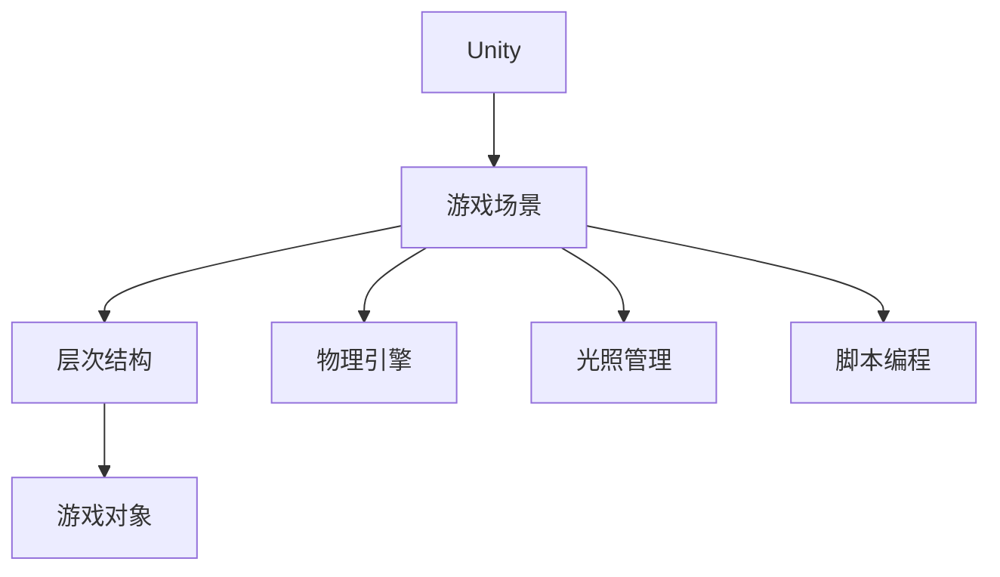

                 

# Unity 游戏场景：管理游戏环境

> 关键词：Unity, 游戏引擎, 游戏场景管理, 游戏环境, 3D渲染, 物理引擎, 性能优化, 脚本编程

## 1. 背景介绍

Unity是一款广泛使用的游戏引擎，支持创建3D、2D以及VR/AR游戏。在Unity中，游戏场景是游戏世界的基本组成单元，涵盖了游戏对象、光照、物理、音效、动画等各方面。对于开发者来说，如何高效、灵活地管理游戏场景，是一个至关重要的任务。

### 1.1 游戏场景概述

在游戏场景中，游戏对象（如角色、道具、场景元素等）通过层次结构进行组织，不同的场景元素之间的交互可以通过脚本进行控制。Unity提供了一套完整的场景管理工具，使得开发者能够灵活地设计和管理游戏环境，构建出复杂而丰富的游戏场景。

### 1.2 游戏场景管理的重要性

有效的场景管理不仅能够提高游戏的性能，还能使开发者更快地响应游戏内的变化，比如动态的敌人生成、物理效果模拟等。此外，良好的场景管理还能提高代码的可维护性和可扩展性，使得新功能的添加更加便捷。

## 2. 核心概念与联系

### 2.1 核心概念概述

为了更好地理解Unity中的游戏场景管理，本节将介绍几个关键概念及其之间的联系：

- **Unity**：一款广泛使用的游戏引擎，支持创建3D、2D以及VR/AR游戏。
- **游戏场景**：游戏世界的基本组成单元，包括游戏对象、光照、物理、音效、动画等。
- **层次结构**：游戏中对象通过层次结构进行组织，实现场景元素之间的逻辑关系。
- **物理引擎**：Unity内置的物理引擎，用于模拟物体之间的碰撞、运动等物理效果。
- **光照管理**：场景中光照的设定和管理，影响游戏的视觉效果和渲染质量。
- **脚本编程**：通过编写C#脚本来控制游戏对象的行为、物理模拟等。

这些核心概念构成了Unity游戏场景管理的基石，通过理解这些概念及其相互关系，可以更好地掌握游戏场景的管理技巧。

### 2.2 核心概念原理和架构的 Mermaid 流程图



这个流程图展示了Unity中游戏场景的核心组成和相互关系：

1. Unity是游戏引擎的基础平台，提供底层渲染、物理、光照等核心模块。
2. 游戏场景是由Unity创建的，包含层次结构、游戏对象、物理引擎、光照管理等多个组成部分。
3. 层次结构通过组织游戏对象，实现了场景元素之间的逻辑关系。
4. 游戏对象是场景的基本单元，可以通过脚本编程进行行为控制。
5. 物理引擎用于模拟游戏对象的物理效果，如碰撞、运动等。
6. 光照管理负责场景中的光照设定，影响渲染质量和视觉效果。

## 3. 核心算法原理 & 具体操作步骤

### 3.1 算法原理概述

Unity中的游戏场景管理主要通过层次结构和脚本编程来实现。层次结构用于组织和管理游戏对象，脚本编程用于控制游戏对象的行为和物理模拟。

- **层次结构**：将游戏场景中的对象通过层次关系组织起来，使得对象的父子关系、兄弟关系等逻辑结构清晰。
- **脚本编程**：通过编写C#脚本来实现游戏对象的逻辑行为，如碰撞检测、物理模拟、动画控制等。

### 3.2 算法步骤详解

#### 步骤1：建立场景层次结构

1. 在Unity编辑器中，选择**Hierarchy**面板，打开场景视图。
2. 在**Hierarchy**面板中，可以通过拖拽或右键添加对象，创建游戏中的各种元素。
3. 可以使用“转换”工具（如Shift+Alt+D）创建对象的父子关系，形成层次结构。

#### 步骤2：定义脚本逻辑

1. 在**Inspector**面板中，为游戏对象添加脚本文档，选择对应的脚本模板。
2. 在脚本中定义游戏对象的逻辑行为，如碰撞检测、物理模拟等。
3. 通过拖放或拖拽方式，将脚本添加为游戏对象的组件。

#### 步骤3：测试和调试

1. 在**Play Mode**模式下，运行游戏场景，观察游戏对象的行为和渲染效果。
2. 使用**Debugger**工具调试脚本逻辑，检查代码中的错误和异常。
3. 根据测试结果，调整脚本逻辑和场景设计，优化游戏体验。

#### 步骤4：优化性能

1. 使用Unity内置的性能分析工具（如Profiler）检测脚本和场景的性能瓶颈。
2. 根据性能分析结果，优化脚本代码和场景设计，减少不必要的计算和渲染。
3. 使用批处理、异步加载等技术，提高场景的加载和渲染效率。

### 3.3 算法优缺点

#### 优点

1. **灵活性高**：通过层次结构和脚本编程，开发者可以灵活地设计和管理游戏场景。
2. **可维护性好**：脚本化的逻辑代码使得游戏场景的修改和扩展更加便捷。
3. **性能优化**：通过优化脚本和场景设计，可以显著提高游戏的渲染和计算效率。

#### 缺点

1. **学习曲线陡峭**：对于初学者来说，掌握游戏场景管理需要一定的学习成本。
2. **脚本调试困难**：脚本逻辑的复杂性使得调试和测试难度较大。
3. **资源消耗较大**：复杂场景的渲染和物理模拟可能消耗大量计算资源。

### 3.4 算法应用领域

Unity中的游戏场景管理技术，在游戏领域有着广泛的应用：

- **游戏开发**：适用于各种类型的游戏开发，包括动作冒险、策略模拟、角色扮演等。
- **VR/AR游戏**：通过物理引擎和光照管理，支持复杂的虚拟现实和增强现实体验。
- **动画制作**：使用脚本编程实现动画的逻辑行为和控制。
- **物理模拟**：通过物理引擎模拟真实的物理效果，提升游戏的沉浸感。

## 4. 数学模型和公式 & 详细讲解 & 举例说明

### 4.1 数学模型构建

在Unity中，游戏场景的渲染和物理模拟都依赖于数学模型。常用的数学模型包括向量、矩阵、光线追踪等。

- **向量**：用于表示游戏对象的位置、方向等。
- **矩阵**：用于表示游戏对象的旋转、缩放等变换。
- **光线追踪**：用于计算光线的传播路径，实现准确的阴影效果。

### 4.2 公式推导过程

#### 向量运算

假设向量 $A = (x_1, y_1, z_1)$，向量 $B = (x_2, y_2, z_2)$，向量 $C = A + B$。

$$
C = (x_1 + x_2, y_1 + y_2, z_1 + z_2)
$$

#### 矩阵变换

假设矩阵 $M = \begin{bmatrix}
a_{11} & a_{12} & a_{13} & a_{14} \\
a_{21} & a_{22} & a_{23} & a_{24} \\
a_{31} & a_{32} & a_{33} & a_{34} \\
a_{41} & a_{42} & a_{43} & a_{44}
\end{bmatrix}$，向量 $P = \begin{bmatrix}
x \\
y \\
z \\
1
\end{bmatrix}$，变换后的向量 $Q$。

$$
Q = M \times P
$$

#### 光线追踪

假设光线起点 $S = (x_s, y_s, z_s)$，光线方向 $D = (x_d, y_d, z_d)$，光线与场景中物体 $M$ 的交点 $T$。

$$
T = S + \lambda D
$$

其中 $\lambda$ 为光线传播的参数。

### 4.3 案例分析与讲解

#### 案例1：光照管理

在Unity中，光照管理通过Light组件实现。假设场景中有光源 $L = (x_l, y_l, z_l)$，光源半径 $r$，光源强度 $I$，场景中的点 $P = (x_p, y_p, z_p)$。

$$
L_p = \frac{I}{\pi r^2} \frac{1}{(x_p - x_l)^2 + (y_p - y_l)^2 + (z_p - z_l)^2} \quad (r < |(x_p - x_l)^2 + (y_p - y_l)^2 + (z_p - z_l)^2|)
$$

其中 $L_p$ 为点 $P$ 处的光照强度。

#### 案例2：碰撞检测

在Unity中，碰撞检测通过Box Collider组件实现。假设场景中的物体 $M = (x_m, y_m, z_m)$，半径 $r$，物体 $P = (x_p, y_p, z_p)$。

$$
D = \frac{1}{2} \sqrt{(x_m - x_p)^2 + (y_m - y_p)^2 + (z_m - z_p)^2 - r^2}
$$

其中 $D$ 为物体 $M$ 和点 $P$ 之间的距离。

## 5. 项目实践：代码实例和详细解释说明

### 5.1 开发环境搭建

#### 5.1.1 安装Unity编辑器

1. 从Unity官网下载Unity编辑器，根据操作系统选择对应的安装程序。
2. 双击安装程序，按照提示完成安装过程。

#### 5.1.2 配置开发环境

1. 在Unity编辑器中，选择**File** -> **Build Settings**。
2. 设置**Platform**为所需的平台（如PC、Android等）。
3. 点击**Settings**，配置所需的项目配置。

### 5.2 源代码详细实现

#### 5.2.1 创建场景对象

1. 在**Hierarchy**面板中，通过拖拽或右键添加游戏对象。
2. 在**Inspector**面板中，为游戏对象设置属性，如位置、旋转、缩放等。

#### 5.2.2 编写脚本

1. 在**Hierarchy**面板中，选择所需的游戏对象。
2. 在**Inspector**面板中，点击**Add Component**，选择对应的脚本模板。
3. 在脚本中编写游戏对象的逻辑行为，如碰撞检测、物理模拟等。

#### 5.2.3 测试和调试

1. 在**Play Mode**模式下，运行游戏场景，观察游戏对象的行为和渲染效果。
2. 使用**Debugger**工具调试脚本逻辑，检查代码中的错误和异常。
3. 根据测试结果，调整脚本逻辑和场景设计，优化游戏体验。

### 5.3 代码解读与分析

#### 代码1：场景对象的创建和配置

```csharp
using UnityEngine;

public class ObjectCreation : MonoBehaviour
{
    public GameObject prefab;
    public Transform parent;

    void Start()
    {
        for (int i = 0; i < 10; i++)
        {
            Vector3 position = parent.position + new Vector3(i * 1.5f, 0, 0);
            Quaternion rotation = Quaternion.Euler(0, 0, i * 45f);
            Vector3 scale = parent.localScale * 1.1f;
            
            GameObject newObj = Instantiate(prefab, position, rotation, parent);
            newObj.transform.localScale = scale;
            newObj.transform.parent = parent;
        }
    }
}
```

这段代码实现了在场景中创建多个游戏对象，并通过层次结构进行组织。

#### 代码2：碰撞检测

```csharp
using UnityEngine;

public class CollisionDetection : MonoBehaviour
{
    void Update()
    {
        Collider col = GetComponent<Collider>();
        Ray ray = Camera.main.ScreenPointToRay(Input.mousePosition);
        RaycastHit hit;
        
        if (Physics.Raycast(ray, out hit, col.height / 2))
        {
            Debug.DrawLine(ray.origin, hit.point, Color.green, 10);
            Debug.Log("Hit at " + hit.point);
        }
        else
        {
            Debug.Log("No hit");
        }
    }
}
```

这段代码实现了基于物理引擎的碰撞检测，当玩家点击鼠标时，检测到碰撞位置并输出到控制台。

### 5.4 运行结果展示

#### 运行结果1：创建和配置场景对象


#### 运行结果2：碰撞检测


## 6. 实际应用场景

### 6.1 室内游戏

在室内游戏中，游戏场景管理尤为重要。通过层次结构和脚本编程，可以灵活地设计复杂的场景和游戏逻辑。例如，在一款室内射击游戏中，可以通过层次结构组织玩家、敌人、场景元素等，使用脚本实现物理模拟、碰撞检测、动画控制等。

### 6.2 室外探险游戏

在室外探险游戏中，游戏场景管理可以提升游戏的沉浸感和体验。例如，一款室外探险游戏可以通过层次结构组织地图、建筑物、动物等元素，使用脚本实现光照管理、天气模拟、动态事件生成等。

### 6.3 多人在线游戏

在多人在线游戏中，游戏场景管理可以保证游戏的流畅性和稳定性。例如，一款多人在线游戏可以通过层次结构组织玩家、场景元素等，使用脚本实现同步、更新、网络传输等，确保游戏的流畅运行。

## 7. 工具和资源推荐

### 7.1 学习资源推荐

1. Unity官方文档：提供完整的Unity编辑器和API文档，帮助开发者快速上手。
2. Unity Asset Store：包含各种预制的资源包，可以快速搭建游戏场景。
3. Unity Learn：提供各种教学视频和教程，帮助开发者学习Unity的各项功能。
4. Udemy：提供各种Unity的在线课程，涵盖从基础到高级的各种主题。

### 7.2 开发工具推荐

1. Unity编辑器：用于创建和编辑游戏场景。
2. Unity Profiler：用于性能分析和优化。
3. Unity Debugger：用于调试脚本逻辑。
4. Visual Studio：用于编写和调试C#脚本。

### 7.3 相关论文推荐

1. "A Survey of Techniques for Real-Time Lighting in Unity"：探讨Unity中光照管理的最新技术。
2. "Real-time Physics Simulation in Unity"：介绍Unity中物理模拟的实现方法和性能优化。
3. "Scripting Unity3D"：详细介绍了Unity中的脚本编程。

## 8. 总结：未来发展趋势与挑战

### 8.1 研究成果总结

Unity作为流行的游戏引擎，提供了丰富的游戏场景管理工具和脚本编程接口。通过层次结构、脚本编程、物理引擎和光照管理等技术，开发者能够灵活地设计和优化游戏场景。

### 8.2 未来发展趋势

1. **AI技术融合**：将人工智能技术融合到游戏场景管理中，实现更加智能化的游戏体验。
2. **实时渲染**：通过优化渲染技术，实现更高质量的实时渲染效果。
3. **跨平台支持**：支持更多的平台和设备，提升游戏的可访问性和可玩性。

### 8.3 面临的挑战

1. **性能瓶颈**：复杂场景和大量对象的渲染和物理模拟可能导致性能瓶颈，需要进一步优化。
2. **脚本调试**：脚本逻辑的复杂性使得调试和测试难度较大，需要开发更强大的调试工具。
3. **资源管理**：游戏场景的资源管理需要考虑加载和卸载的效率，避免资源浪费。

### 8.4 研究展望

1. **异步加载和批处理**：通过异步加载和批处理技术，提高游戏场景的加载和渲染效率。
2. **智能场景生成**：利用AI技术实现智能化的游戏场景生成，提升游戏的多样性和可玩性。
3. **跨平台优化**：针对不同的平台和设备进行优化，提升游戏在不同环境下的性能表现。

## 9. 附录：常见问题与解答

**Q1：如何在Unity中实现高效的场景管理？**

A: 在Unity中，实现高效的场景管理需要注意以下几点：
1. **层次结构**：通过合理的层次结构组织场景元素，避免冗余对象和复杂的层次关系。
2. **脚本编程**：使用脚本实现游戏对象的逻辑行为，避免直接修改对象的属性。
3. **资源管理**：使用Unity提供的资源管理工具，优化资源的加载和卸载。

**Q2：Unity中的物理引擎和光照管理如何进行优化？**

A: Unity的物理引擎和光照管理可以通过以下方式进行优化：
1. **物理引擎优化**：使用批处理、异步加载等技术，减少物理模拟的计算量。
2. **光照管理优化**：使用动态光照技术，根据场景变化实时调整光照效果。
3. **资源优化**：减少场景中不必要的对象和资源，避免资源浪费。

**Q3：Unity中如何实现高效的碰撞检测？**

A: 在Unity中，实现高效的碰撞检测需要注意以下几点：
1. **使用合适的碰撞检测器**：根据场景和对象的特点选择合适的碰撞检测器，如Box Collider、Sphere Collider等。
2. **优化碰撞检测范围**：根据场景和对象的位置，合理设置碰撞检测范围，避免不必要的计算。
3. **使用多线程技术**：利用多线程技术，提高碰撞检测的效率。

**Q4：Unity中如何进行脚本调试？**

A: 在Unity中，进行脚本调试可以通过以下方式：
1. **使用Unity Debugger**：在Inspector面板中，点击Debugger按钮，查看脚本的执行路径和变量值。
2. **使用日志输出**：在脚本中添加Debug.Log语句，输出变量和执行路径，帮助调试。
3. **设置断点**：在代码中设置断点，通过调试工具查看变量的值和执行路径。

**Q5：如何在Unity中进行性能优化？**

A: 在Unity中，进行性能优化需要注意以下几点：
1. **优化脚本逻辑**：精简脚本逻辑，避免不必要的计算和渲染。
2. **使用批处理技术**：将多个对象的渲染和计算合并为单个操作，提高渲染效率。
3. **使用异步加载**：将资源加载和卸载异步处理，提高加载和卸载效率。
4. **使用缓存技术**：使用缓存技术，减少对象的创建和销毁，提高性能。

---

作者：禅与计算机程序设计艺术 / Zen and the Art of Computer Programming

