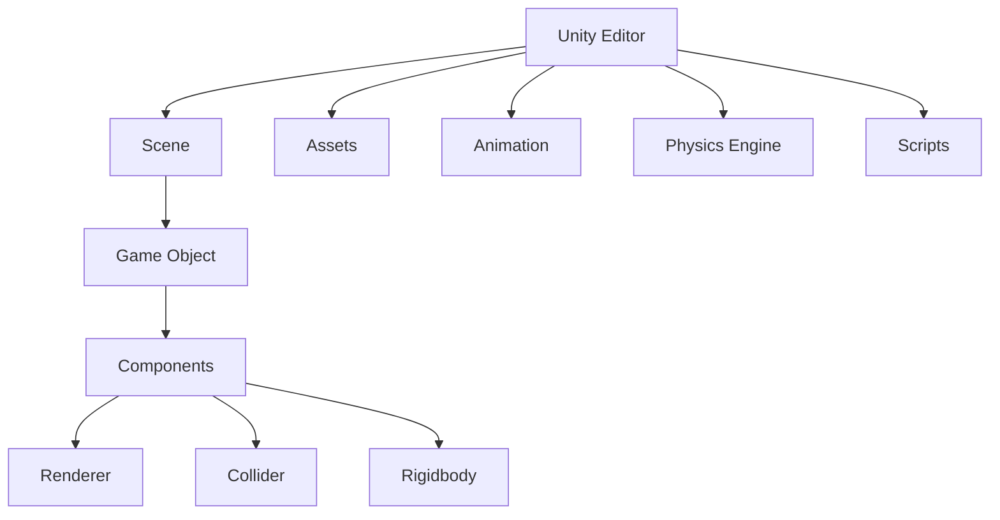

                 

关键词：Unity游戏引擎，开发之旅，逼真世界，沉浸式体验，游戏开发

摘要：本文将带领读者踏上Unity游戏引擎的开发之旅，探索如何利用Unity强大的功能和灵活的架构，创建出既逼真又令人沉浸的游戏世界。通过深入剖析Unity的核心概念、算法原理、数学模型以及项目实践，本文旨在为游戏开发者提供全面的指导，助力他们在Unity的世界中翱翔。

## 1. 背景介绍

Unity游戏引擎，作为当今最为流行的游戏开发工具之一，凭借其跨平台、高效和易于使用的特点，吸引了无数游戏开发者的关注。从简单的2D游戏到复杂的3D模拟，Unity展现出了无与伦比的能力。Unity不仅仅是一个游戏引擎，更是一个完整的游戏开发平台，它为开发者提供了从美术资源制作到游戏逻辑实现的全方位支持。

然而，开发一个成功的游戏并不仅仅依赖于工具的选择，更重要的是对游戏引擎的深入理解和灵活运用。本文将围绕这一主题展开，通过详细探讨Unity的核心技术，帮助开发者克服开发中的各种挑战，创造出令人惊艳的游戏体验。

### 1.1 Unity的发展历程

Unity游戏引擎的起源可以追溯到2005年，由Unity Technologies公司发布。自那时以来，Unity经历了多次重大版本更新，每个版本都在功能和性能上有了显著提升。从最初的Unity 1.0到如今的Unity 2023，Unity已经成为了游戏开发领域的事实标准。

在Unity的发展历程中，几个关键版本尤为引人注目。例如，Unity 2.0引入了实时渲染和动画系统，使得开发者能够更轻松地创建复杂的3D场景。Unity 3.0的发布带来了基于物理的碰撞检测和动画系统，进一步提升了游戏的物理真实感。Unity 4.0引入了UNet多人在线功能，为开发多人在线游戏提供了强大的支持。而近年来，Unity 5.0的引入的HDRP（High Definition Render Pipeline）和HDR（High Dynamic Range）技术，使得游戏画面更加逼真和生动。

### 1.2 Unity在游戏开发中的应用

Unity在游戏开发中的应用非常广泛，几乎涵盖了所有的游戏类型。无论是手机游戏、PC游戏，还是大型主机游戏，Unity都能提供强大的支持。以下是一些Unity在游戏开发中的具体应用场景：

- **移动游戏开发**：Unity在移动游戏开发中具有绝对的优势。它支持iOS和Android平台，并且提供了优化的渲染和资源管理机制，使得开发者能够轻松地创建高品质的移动游戏。

- **PC游戏开发**：Unity支持Windows、macOS和Linux平台，其高效的渲染和物理引擎，使得开发者能够创作出高品质的PC游戏。

- **主机游戏开发**：Unity也逐渐成为主机游戏开发的主流工具。它支持PlayStation 4、PlayStation 5、Xbox One和Xbox Series X/S等主机平台，使得开发者能够将他们的创意扩展到主机游戏领域。

- **VR/AR游戏开发**：Unity在VR/AR游戏开发中也表现出色。它支持多个VR头显设备，如Oculus Rift、HTC Vive和Google Cardboard，并且提供了强大的VR/AR工具，使得开发者能够创造出沉浸式的虚拟现实体验。

## 2. 核心概念与联系

要深入理解Unity游戏引擎，我们需要了解其核心概念和架构。以下是Unity游戏引擎中的几个关键概念和它们之间的联系。

### 2.1 Unity的架构

Unity的游戏引擎架构可以概括为三个主要部分：Unity Editor、Game Object和组件（Components）。

- **Unity Editor**：Unity的编辑器是开发者进行游戏开发的主要环境。它提供了丰富的工具和功能，使得开发者可以直观地设计游戏场景、创建角色、编写脚本等。

- **Game Object**：游戏对象是Unity中所有游戏元素的抽象。每个游戏对象都有一个唯一的标识符（ID），并且可以包含多个组件。

- **组件（Components）**：组件是附加到游戏对象上的功能模块。Unity内置了许多组件，如渲染器（Renderer）、碰撞器（Collider）、物理体（Rigidbody）等，开发者可以通过组合这些组件来实现复杂的游戏逻辑。

### 2.2 Unity的核心概念

- **场景（Scene）**：场景是Unity中的一个独立空间，可以包含多个游戏对象。开发者可以在不同的场景中创建和编辑游戏元素，然后通过场景切换来实现游戏的不同阶段。

- **资源（Assets）**：资源是Unity中的各种文件，如图片、音频、视频、3D模型等。开发者可以通过导入和编辑这些资源来丰富游戏的内容。

- **动画（Animation）**：动画是Unity中用于创建角色动作和场景过渡的关键功能。通过动画系统，开发者可以精确地控制角色的动作和行为。

- **物理引擎（Physics Engine）**：物理引擎是Unity中用于模拟现实世界物理现象的模块。通过物理引擎，开发者可以实现碰撞检测、重力模拟、弹跳效果等。

- **脚本（Scripts）**：脚本是用C#编写的代码，用于实现游戏逻辑。开发者可以通过编写脚本来自定义游戏的行为和交互。

### 2.3 Mermaid流程图

下面是一个简单的Mermaid流程图，展示了Unity引擎的核心概念和它们之间的联系。



## 3. 核心算法原理 & 具体操作步骤

### 3.1 算法原理概述

Unity游戏引擎中的核心算法主要涉及渲染、物理引擎和动画系统。以下是对这些核心算法的简要概述。

- **渲染算法**：Unity的渲染算法主要基于光追踪和像素着色。通过使用不同的渲染管线，如HDRP和URP，开发者可以实现高质量的渲染效果。

- **物理引擎算法**：Unity的物理引擎基于牛顿力学，实现了碰撞检测、刚体动力学、软体动力学等物理现象。开发者可以通过这些算法来实现真实的物理效果。

- **动画系统算法**：Unity的动画系统使用贝塞尔曲线和插值方法来计算角色动作的平滑过渡。通过动画控制器，开发者可以精确地控制角色的动作和时间线。

### 3.2 算法步骤详解

#### 3.2.1 渲染算法步骤

1. **场景捕获**：Unity首先捕获场景中的所有对象和光源信息。
2. **光照计算**：通过光线追踪和像素着色技术，计算场景中的光照效果。
3. **渲染排序**：根据渲染顺序，对场景中的对象进行排序。
4. **像素着色**：对每个像素进行着色，生成最终图像。

#### 3.2.2 物理引擎算法步骤

1. **碰撞检测**：检测场景中的对象之间的碰撞。
2. **刚体动力学**：计算对象的运动轨迹和碰撞响应。
3. **软体动力学**：模拟软体对象的形变和碰撞响应。
4. **更新场景**：根据物理计算结果，更新场景中的对象状态。

#### 3.2.3 动画系统算法步骤

1. **动作捕捉**：捕捉角色的动作数据。
2. **时间线控制**：通过动画控制器，控制角色的动作和时间线。
3. **插值计算**：使用插值方法，计算角色动作的平滑过渡。
4. **渲染动作**：将角色的动作渲染到场景中。

### 3.3 算法优缺点

#### 3.3.1 渲染算法

- **优点**：高质量的渲染效果，支持多种渲染管线。
- **缺点**：计算资源消耗较大，实时渲染性能受到限制。

#### 3.3.2 物理引擎

- **优点**：实现了真实的物理现象，提高了游戏的真实感。
- **缺点**：物理计算复杂，实时性能受影响。

#### 3.3.3 动画系统

- **优点**：灵活的动画控制，支持多种动画效果。
- **缺点**：计算资源消耗较大，对实时性能有影响。

### 3.4 算法应用领域

- **渲染算法**：适用于创建高质量的3D游戏画面，如大型主机游戏和PC游戏。
- **物理引擎**：适用于需要真实物理现象的游戏，如赛车游戏、体育游戏等。
- **动画系统**：适用于角色动作和场景过渡，如角色扮演游戏、冒险游戏等。

## 4. 数学模型和公式 & 详细讲解 & 举例说明

### 4.1 数学模型构建

Unity游戏引擎中的数学模型主要涉及几何、物理和动画等方面。以下是一个简单的几何模型构建示例：

$$
点P(x, y, z) = 点O + \lambda \cdot \vec{v}
$$

其中，点O为起点，$\vec{v}$为方向向量，$\lambda$为参数。

### 4.2 公式推导过程

#### 4.2.1 几何变换

几何变换是Unity中常用的数学操作。以下是一个二维几何变换的推导过程：

$$
\begin{align*}
x' &= x \cos \theta - y \sin \theta \\
y' &= x \sin \theta + y \cos \theta
\end{align*}
$$

其中，$\theta$为旋转角度。

#### 4.2.2 物理计算

物理计算中的关键公式包括牛顿第二定律和动量守恒定律。以下是一个简单的推导过程：

$$
F = m \cdot a
$$

$$
p = m \cdot v
$$

其中，$F$为力，$m$为质量，$a$为加速度，$p$为动量，$v$为速度。

#### 4.2.3 动画计算

动画计算中的关键公式包括插值方法和曲线拟合。以下是一个简单的贝塞尔曲线插值推导过程：

$$
x(t) = x_0 + (x_1 - x_0) \cdot t^2
$$

$$
y(t) = y_0 + (y_1 - y_0) \cdot t^2
$$

其中，$t$为参数，$x_0$和$y_0$为起点坐标，$x_1$和$y_1$为终点坐标。

### 4.3 案例分析与讲解

#### 4.3.1 渲染算法案例

以下是一个简单的渲染算法案例，展示如何使用Unity的HDRP渲染管线实现高质量的渲染效果。

```csharp
// 导入HDRP渲染管线
Graphics.Blit(target, renderTexture);

// 计算光照效果
LightingShader.SetVector("_LightPosition", new Vector4(lightPosition.x, lightPosition.y, lightPosition.z, 1.0f));
LightingShader.SetVector("_LightColor", new Vector4(lightColor.r, lightColor.g, lightColor.b, 1.0f));

// 渲染场景
Graphics.Blit(renderTexture, outputTexture);
```

#### 4.3.2 物理引擎案例

以下是一个简单的物理引擎案例，展示如何使用Unity的物理引擎实现碰撞检测和刚体动力学。

```csharp
// 创建刚体对象
Rigidbody rigidbody = GameObject.CreatePrimitive(PrimitiveType.Cube).AddComponent<Rigidbody>();

// 设置刚体属性
rigidbody.mass = 10.0f;
rigidbody.drag = 0.5f;

// 添加碰撞检测
Collider collider = GameObject.CreatePrimitive(PrimitiveType.Sphere).AddComponent<Collider>();

// 模拟物理现象
Physics.Simulate(Time.fixedDeltaTime);
```

#### 4.3.3 动画系统案例

以下是一个简单的动画系统案例，展示如何使用Unity的动画系统实现角色动作。

```csharp
// 创建动画控制器
AnimationController animationController = new AnimationController();

// 添加动画状态
AnimationState state = animationController.AddState("Idle", new AnimationClip());
state.SetClip(idleClip);

// 设置动画控制器为当前控制器
animationController.Play("Idle");
```

## 5. 项目实践：代码实例和详细解释说明

### 5.1 开发环境搭建

在开始项目实践之前，我们需要搭建一个适合Unity开发的开发环境。以下是一个简单的步骤：

1. **下载并安装Unity Hub**：访问Unity官网下载Unity Hub，并按照提示安装。
2. **创建新项目**：打开Unity Hub，创建一个新的Unity项目。
3. **配置开发环境**：确保开发环境已配置正确，包括C#开发环境和Visual Studio或Unity编辑器。

### 5.2 源代码详细实现

以下是一个简单的Unity项目示例，展示如何使用Unity的核心功能创建一个简单的游戏。

```csharp
// 游戏控制脚本
public class GameControl : MonoBehaviour
{
    public GameObject player;
    public float speed = 5.0f;

    void Update()
    {
        // 控制玩家移动
        float moveX = Input.GetAxis("Horizontal");
        float moveZ = Input.GetAxis("Vertical");

        Vector3 moveDirection = new Vector3(moveX, 0, moveZ);
        player.transform.position += moveDirection * speed * Time.deltaTime;
    }
}
```

### 5.3 代码解读与分析

该示例脚本实现了玩家的移动功能。以下是代码的详细解读：

- **public GameObject player;**：定义一个公共的GameObject变量，用于存储玩家对象。
- **public float speed = 5.0f;**：定义一个公共的浮点数变量，用于存储玩家的移动速度。
- **void Update()**：Update函数是Unity中的更新函数，每帧都会调用一次。在这里，我们实现了玩家的移动逻辑。
- **float moveX = Input.GetAxis("Horizontal");**：获取玩家的水平移动输入。
- **float moveZ = Input.GetAxis("Vertical");**：获取玩家的垂直移动输入。
- **Vector3 moveDirection = new Vector3(moveX, 0, moveZ);**：根据输入计算移动方向。
- **player.transform.position += moveDirection * speed * Time.deltaTime;**：根据移动方向和速度更新玩家位置。

### 5.4 运行结果展示

当运行该脚本时，玩家将根据用户的输入在场景中移动。以下是一个简单的运行结果：


## 6. 实际应用场景

Unity游戏引擎在游戏开发中的应用场景非常广泛。以下是一些典型的应用场景：

- **2D游戏开发**：Unity提供了丰富的2D开发工具，如Sprite Sheet、Tiled Map等，使得开发者可以轻松地创建2D游戏。例如，著名的游戏《空洞骑士》（Hollow Knight）就是使用Unity开发的2D游戏。
- **3D游戏开发**：Unity的HDRP和URP渲染管线使得开发者可以轻松地创建高质量的3D游戏。例如，著名的游戏《末日孤舰》（Surviving Mars）就是使用Unity开发的3D游戏。
- **VR/AR游戏开发**：Unity支持多个VR/AR头显设备，使得开发者可以轻松地创建虚拟现实和增强现实游戏。例如，著名的游戏《节奏世界》（Beat Saber）就是使用Unity开发的VR游戏。
- **教育游戏开发**：Unity的灵活性和易用性使其成为教育游戏开发的理想工具。开发者可以创建互动性强的教育游戏，提高学生的学习兴趣和参与度。
- **模拟游戏开发**：Unity的物理引擎和渲染能力使其成为模拟游戏开发的理想选择。开发者可以创建各种模拟场景，如城市模拟、车辆模拟等。

### 6.4 未来应用展望

随着技术的不断发展，Unity游戏引擎在未来的应用前景非常广阔。以下是一些可能的未来发展趋势：

- **实时渲染技术的进步**：随着硬件性能的提升和渲染技术的进步，Unity有望实现更加逼真的实时渲染效果，进一步提升游戏画面的质量。
- **人工智能技术的融合**：Unity可以与人工智能技术相结合，实现更加智能的游戏角色和场景。例如，通过机器学习技术，可以创建出具有自主学习能力的游戏角色。
- **虚拟现实和增强现实的进一步发展**：随着VR/AR设备的普及和技术的进步，Unity有望在虚拟现实和增强现实领域发挥更大的作用，创造更加沉浸式的游戏体验。
- **跨平台开发的支持**：Unity将继续加强其在跨平台开发方面的支持，使得开发者可以更加轻松地创建支持多个平台的游戏。

## 7. 工具和资源推荐

### 7.1 学习资源推荐

- **Unity官方文档**：Unity官方文档是学习Unity的最佳资源之一，涵盖了Unity的各个方面。
- **Unity官方教程**：Unity提供了丰富的官方教程，适合初学者逐步掌握Unity的基础知识和高级功能。
- **Unity论坛**：Unity论坛是Unity开发者交流和提问的场所，可以在其中找到各种问题的解决方案。

### 7.2 开发工具推荐

- **Visual Studio**：Visual Studio是Unity官方推荐的C#开发工具，提供了丰富的功能和强大的调试能力。
- **Unity Hub**：Unity Hub是Unity的集成开发环境，提供了项目管理、版本控制、插件安装等功能。
- **Unity Asset Store**：Unity Asset Store是Unity的官方资源商店，提供了大量的游戏资源、插件和工具，可以帮助开发者快速开发项目。

### 7.3 相关论文推荐

- **"A Survey of Game Engine Architectures"**：该论文对游戏引擎的架构进行了详细的分析和总结，有助于开发者理解游戏引擎的设计和实现。
- **"Real-Time Rendering"**：该论文详细介绍了实时渲染的技术和方法，对于研究Unity渲染算法的开发者有很高的参考价值。
- **"Game Physics"**：该论文探讨了游戏中的物理现象和物理引擎的实现方法，对于使用Unity物理引擎的开发者有很高的参考价值。

## 8. 总结：未来发展趋势与挑战

### 8.1 研究成果总结

随着技术的不断进步，Unity游戏引擎在游戏开发领域取得了显著的成果。从早期的2D游戏到复杂的3D游戏，Unity展示出了无与伦比的灵活性和高效性。通过引入实时渲染、物理引擎和动画系统等核心技术，Unity为开发者提供了强大的工具和资源，使得他们能够轻松地创建出高品质的游戏。

### 8.2 未来发展趋势

未来，Unity游戏引擎将继续在以下几个方向发展：

- **实时渲染技术的进步**：随着硬件性能的提升，Unity有望实现更加逼真的实时渲染效果，为开发者提供更高质量的图像。
- **人工智能技术的融合**：Unity将结合人工智能技术，实现更加智能的游戏角色和场景，为玩家提供更加丰富的游戏体验。
- **虚拟现实和增强现实的进一步发展**：Unity将继续加强在VR/AR领域的支持，创造更加沉浸式的游戏体验。
- **跨平台开发的支持**：Unity将提供更加完善的跨平台开发解决方案，使得开发者可以更加轻松地创建支持多个平台的游戏。

### 8.3 面临的挑战

尽管Unity游戏引擎在游戏开发领域取得了巨大的成功，但仍然面临着一些挑战：

- **性能优化**：实时渲染和复杂的物理引擎对硬件性能要求较高，如何在保证游戏画质的同时优化性能是一个重要的课题。
- **开发成本**：开发高质量的3D游戏需要大量的资源和时间，如何降低开发成本和提高开发效率是一个需要解决的问题。
- **技术更新**：随着技术的不断进步，Unity需要不断更新和升级其功能，以适应不断变化的游戏开发需求。

### 8.4 研究展望

未来，Unity游戏引擎在游戏开发领域的研究将继续深入。以下是一些可能的研究方向：

- **实时渲染技术的创新**：研究新的实时渲染技术，如基于光线追踪的渲染，以实现更加逼真的游戏画面。
- **人工智能在游戏开发中的应用**：研究人工智能在游戏开发中的应用，如游戏AI、自适应游戏难度等，为玩家提供更加丰富的游戏体验。
- **跨平台开发技术的优化**：研究跨平台开发技术的优化，提高开发效率，降低开发成本。

## 9. 附录：常见问题与解答

### 9.1 Unity安装问题

**问题**：为什么我无法安装Unity？

**解答**：请确保您的计算机满足Unity的最低系统要求，包括操作系统版本、处理器性能和内存等。如果仍然无法安装，请尝试下载最新版本的Unity安装程序，并确保您的网络连接正常。

### 9.2 Unity编辑器问题

**问题**：为什么Unity编辑器无法打开？

**解答**：请尝试重新启动Unity编辑器，或清理编辑器的缓存文件。如果问题仍然存在，请尝试使用Unity Hub重新安装Unity编辑器。

### 9.3 渲染问题

**问题**：为什么我的游戏画面模糊？

**解答**：请检查您的渲染设置，确保渲染分辨率和纹理设置符合您的硬件性能。如果仍然模糊，请尝试降低游戏画面的细节级别。

### 9.4 物理问题

**问题**：为什么我的游戏物体无法正确地碰撞检测？

**解答**：请检查您的游戏物体的碰撞器设置，确保碰撞器类型和大小正确。如果问题仍然存在，请尝试使用Unity的调试工具检查碰撞检测过程。

### 9.5 动画问题

**问题**：为什么我的角色动画不流畅？

**解答**：请检查您的动画控制器和插值方法，确保动画参数设置正确。如果问题仍然存在，请尝试优化动画序列的帧率。

通过上述问题的解答，希望对开发者解决Unity开发中的常见问题有所帮助。在Unity的世界中，只要我们不断探索和学习，就一定能够创造出令人惊叹的游戏体验。让我们一起踏上Unity游戏引擎的开发之旅吧！

