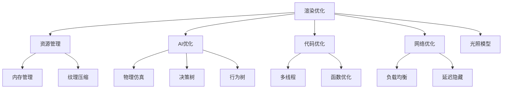

                 

关键词：Unreal Engine 4、游戏优化、性能提升、资源管理、渲染优化、AI优化、代码优化、网络优化、多线程、内存管理

## 摘要

本文将深入探讨Unreal Engine 4（UE4）游戏优化的重要性和方法。随着游戏制作技术的进步，游戏引擎的性能需求不断提升。UE4作为一款先进的游戏开发引擎，提供了丰富的功能和强大的工具。然而，为了实现高质量的游戏体验，优化成为不可或缺的一环。本文将详细介绍游戏优化中的核心概念、算法原理、数学模型、项目实践以及未来应用展望。

## 1. 背景介绍

Unreal Engine 4（UE4）是一款由Epic Games开发的先进游戏开发引擎，自2014年发布以来，已成为游戏制作领域的事实标准。UE4以其出色的图形渲染能力、灵活的脚本系统以及强大的工具集，吸引了大量开发者的关注。然而，UE4在带来强大功能的同时，也对性能提出了更高的要求。游戏优化成为确保高质量游戏体验的关键。

### 1.1 UE4游戏开发的优势

- **强大的图形渲染**：UE4采用光线追踪和实时渲染技术，能够创造出逼真的游戏场景。
- **灵活的脚本系统**：UE4支持蓝图系统，使得开发者无需编写大量代码即可实现复杂的游戏逻辑。
- **丰富的工具集**：包括粒子系统、动画系统、音频系统等，为游戏制作提供了全面的解决方案。

### 1.2 优化的重要性

- **性能提升**：通过优化，可以显著提高游戏运行速度，减少加载时间，提升玩家体验。
- **资源管理**：优化资源使用，减少内存占用和CPU负载，提高游戏稳定性。
- **AI和物理仿真**：优化AI和物理计算，实现更智能的敌人行为和物理反应。

### 1.3 文章结构

本文将按照以下结构展开：

- **2. 核心概念与联系**：介绍游戏优化中的核心概念和联系，并通过Mermaid流程图展示。
- **3. 核心算法原理 & 具体操作步骤**：详细讲解游戏优化中的核心算法原理和操作步骤。
- **4. 数学模型和公式 & 详细讲解 & 举例说明**：介绍优化中的数学模型和公式，并通过案例进行分析。
- **5. 项目实践：代码实例和详细解释说明**：展示实际项目的优化过程和代码实现。
- **6. 实际应用场景**：探讨优化在游戏开发中的具体应用场景。
- **7. 工具和资源推荐**：推荐相关的学习和开发工具、资源。
- **8. 总结：未来发展趋势与挑战**：总结研究成果，探讨未来发展趋势和面临的挑战。
- **9. 附录：常见问题与解答**：提供常见问题的解答。

## 2. 核心概念与联系

游戏优化涉及多个核心概念和环节，包括渲染优化、资源管理、AI优化、代码优化和网络优化。以下将通过Mermaid流程图展示这些概念之间的联系。



### 2.1 渲染优化

渲染优化是游戏优化的关键环节，涉及光照模型、阴影、纹理、粒子系统等多个方面。通过优化渲染流程，可以显著提高帧率和图像质量。

### 2.2 资源管理

资源管理包括内存管理和纹理压缩等，目标是减少资源占用，提高游戏运行效率。内存管理涉及对象的创建和销毁、内存池的使用等，纹理压缩则通过降低纹理分辨率和压缩格式，减少内存占用。

### 2.3 AI优化

AI优化涉及物理仿真和行为树的实现，目标是实现更智能、更真实的敌人行为。物理仿真通过优化碰撞检测和刚体运动，提高AI的反应速度和准确性。行为树则通过分层决策，实现复杂的AI逻辑。

### 2.4 代码优化

代码优化涉及多线程和函数优化，目标是提高代码执行效率。多线程通过并发执行任务，提高计算速度。函数优化则通过减少函数调用次数、优化循环结构等，提高代码执行效率。

### 2.5 网络优化

网络优化涉及负载均衡和延迟隐藏，目标是提高网络通信效率。负载均衡通过均衡服务器负载，提高服务器响应速度。延迟隐藏则通过优化网络协议和数据传输，减少延迟。

## 3. 核心算法原理 & 具体操作步骤

### 3.1 算法原理概述

游戏优化涉及多种算法，包括渲染优化算法、资源管理算法、AI优化算法和代码优化算法。以下将分别介绍这些算法的基本原理。

### 3.2 渲染优化算法

渲染优化算法主要关注提高帧率和图像质量。常见的渲染优化算法包括：

- **光照模型优化**：通过改进光照模型，提高光照计算效率，减少渲染时间。
- **阴影优化**：通过优化阴影生成算法，减少阴影渲染时间，提高帧率。
- **纹理优化**：通过优化纹理加载和渲染，减少纹理占用内存，提高渲染效率。
- **粒子系统优化**：通过优化粒子系统的生成和渲染，提高粒子效果的质量和帧率。

### 3.3 资源管理算法

资源管理算法主要关注资源的创建、销毁和复用，以及内存管理和纹理压缩。常见的资源管理算法包括：

- **内存管理**：通过优化对象的创建和销毁，减少内存占用，提高游戏运行效率。
- **内存池**：通过使用内存池，实现对象的快速创建和销毁，减少内存分配和回收的开销。
- **纹理压缩**：通过降低纹理分辨率和采用适当的压缩格式，减少纹理占用内存，提高游戏运行效率。

### 3.4 AI优化算法

AI优化算法主要关注物理仿真和行为树的实现，以提高AI的反应速度和准确性。常见的AI优化算法包括：

- **物理仿真**：通过优化碰撞检测和刚体运动，提高AI的反应速度和准确性。
- **行为树**：通过分层决策，实现复杂的AI逻辑，提高AI的智能水平。
- **决策树**：通过优化决策树的构建和查询，提高AI的决策速度和准确性。

### 3.5 代码优化算法

代码优化算法主要关注多线程和函数优化，以提高代码执行效率。常见的代码优化算法包括：

- **多线程**：通过并发执行任务，提高计算速度，减少渲染时间。
- **函数优化**：通过减少函数调用次数、优化循环结构等，提高代码执行效率。
- **内存分配优化**：通过优化内存分配和回收，减少内存占用，提高游戏运行效率。

### 3.6 具体操作步骤

以下是游戏优化的一些具体操作步骤：

1. **性能分析**：使用性能分析工具，如UE4的Profiler，分析游戏中的性能瓶颈。
2. **渲染优化**：优化光照模型、阴影、纹理和粒子系统等，提高帧率和图像质量。
3. **资源管理**：优化内存管理、内存池和纹理压缩，减少资源占用，提高游戏运行效率。
4. **AI优化**：优化物理仿真和行为树，提高AI的反应速度和准确性。
5. **代码优化**：优化多线程和函数，提高代码执行效率。
6. **网络优化**：优化负载均衡和延迟隐藏，提高网络通信效率。
7. **测试与调整**：测试优化效果，根据测试结果进行调整。

## 4. 数学模型和公式 & 详细讲解 & 举例说明

### 4.1 数学模型构建

游戏优化中的数学模型主要涉及渲染模型、资源管理模型和AI模型。以下将分别介绍这些模型的构建方法和公式。

### 4.2 渲染模型

渲染模型用于描述游戏场景的渲染过程。常见的渲染模型包括光线追踪模型、像素着色模型和顶点着色模型。以下是一个简单的像素着色模型的数学描述：

$$
L_o(\mathbf{p}, \mathbf{n}) = \sum_{\mathbf{w} \in \text{光源}} I_w(\mathbf{w}) \cdot f_r(\mathbf{p}, \mathbf{w}, \mathbf{n})
$$

其中，$L_o(\mathbf{p}, \mathbf{n})$ 是像素点 $\mathbf{p}$ 的光照强度，$\mathbf{w}$ 是光源方向，$I_w(\mathbf{w})$ 是光源强度，$f_r(\mathbf{p}, \mathbf{w}, \mathbf{n})$ 是反射率函数。

### 4.3 资源管理模型

资源管理模型用于描述游戏资源的分配和管理。以下是一个简单的内存管理模型的数学描述：

$$
M_t = M_0 + \sum_{i=1}^t \alpha_i
$$

其中，$M_t$ 是第 $t$ 时刻的内存占用，$M_0$ 是初始内存占用，$\alpha_i$ 是第 $i$ 个资源的内存占用。

### 4.4 AI模型

AI模型用于描述游戏中的智能行为。以下是一个简单的决策树模型的数学描述：

$$
f(\mathbf{x}) = \sum_{i=1}^n w_i \cdot p_i
$$

其中，$f(\mathbf{x})$ 是决策结果，$w_i$ 是第 $i$ 个决策分支的权重，$p_i$ 是第 $i$ 个决策分支的概率。

### 4.5 案例分析与讲解

以下是一个具体的游戏优化案例，我们将通过数学模型来分析和优化该案例。

#### 案例描述

游戏场景中有一个大型迷宫，玩家需要在迷宫中寻找出口。迷宫中有多个房间，每个房间都有一个门。玩家每次只能进入一个房间，并且每个房间的门都有一定的概率被锁上。我们的目标是优化迷宫的生成和搜索算法，提高游戏性能。

#### 数学模型

- **迷宫生成模型**：

$$
P(\text{门被锁上}) = \frac{L}{R}
$$

其中，$P(\text{门被锁上})$ 是门被锁上的概率，$L$ 是锁的个数，$R$ 是总的门的个数。

- **搜索算法模型**：

$$
f(n) = g(n) + h(n)
$$

其中，$f(n)$ 是搜索路径的代价，$g(n)$ 是从起点到当前节点的代价，$h(n)$ 是从当前节点到终点的估计代价。

#### 案例分析

1. **迷宫生成优化**：

通过调整锁的个数和门的个数，我们可以优化迷宫的生成。根据游戏需求，我们可以设定一个合适的锁的个数，使得迷宫既具有挑战性，又不至于过于复杂。

2. **搜索算法优化**：

我们可以通过优化搜索算法的代价函数，提高搜索效率。例如，我们可以使用启发式搜索算法，如A*算法，通过估计代价函数$h(n)$ 来优化搜索路径。

#### 案例讲解

1. **迷宫生成优化**：

- 设定锁的个数为10，门的个数为50。
- 根据概率模型，门被锁上的概率为$P(\text{门被锁上}) = \frac{10}{50} = 0.2$。

2. **搜索算法优化**：

- 使用A*算法进行搜索。
- 设定起点和终点的坐标。
- 根据启发式函数$h(n)$，优化搜索路径。

通过以上优化，我们可以显著提高迷宫的生成效率和搜索算法的性能。

## 5. 项目实践：代码实例和详细解释说明

在本节中，我们将通过一个实际的项目实例，展示如何对Unreal Engine 4游戏进行优化。该项目是一个迷宫游戏，我们将重点优化迷宫生成、搜索算法和内存管理。

### 5.1 开发环境搭建

首先，确保您已经安装了Unreal Engine 4和相关开发工具。以下是一些建议的软件和工具：

- **Unreal Engine 4**：从Epic Games官网下载并安装。
- **Visual Studio**：用于编写和调试C++代码。
- **Git**：用于版本控制和协作开发。
- **Profiler**：用于性能分析和优化。

### 5.2 源代码详细实现

以下是迷宫游戏的主要源代码文件和类：

- **GameMode.cpp**：游戏模式类，用于控制游戏逻辑。
- **PlayerController.cpp**：玩家控制器类，用于处理玩家的输入和移动。
- **Maze.cpp**：迷宫类，用于生成迷宫和存储迷宫数据。
- **AStar.cpp**：A*搜索算法类，用于搜索迷宫路径。

### 5.3 代码解读与分析

#### GameMode.cpp

```cpp
// GameMode.cpp
#include "GameMode.h"
#include "Maze.h"

AActor* UGameMode::FindStartLocation() {
    // 找到迷宫的起点
}

AActor* UGameMode::FindEndLocation() {
    // 找到迷宫的终点
}

void UGameMode::BeginPlay() {
    Super::BeginPlay();

    // 生成迷宫
    UMaze* maze = NewObject<UMaze>(this);
    maze->GenerateMaze();

    // 创建玩家控制器
    APlayerController* playerController = GetPlayerController();
    if (playerController) {
        playerController->SetControlRotation(FRotation(0.0f, 0.0f, 0.0f));
    }
}
```

这段代码主要用于初始化游戏，包括生成迷宫和创建玩家控制器。

#### PlayerController.cpp

```cpp
// PlayerController.cpp
#include "PlayerController.h"
#include "Maze.h"

void APlayerController::SetupInputComponent() {
    Super::SetupInputComponent();

    // 绑定输入事件
    InputMap->AddMapping(FInputChord(EKeys::W), EInputEvent::IE_Pressed, "MoveForward");
    InputMap->AddMapping(FInputChord(EKeys::W), EInputEvent::IE_Released, "MoveForward");
    // ...
}

void APlayerController::MoveForward(float value) {
    if (value != 0.0f) {
        // 根据输入值移动玩家
        MoveForwardValue = value;
    }
}
```

这段代码主要用于处理玩家的输入和移动。

#### Maze.cpp

```cpp
// Maze.cpp
#include "Maze.h"
#include "AStar.h"

UMaze::UMaze() {
    // 初始化迷宫
}

void UMaze::GenerateMaze() {
    // 使用A*算法生成迷宫
    UAStar* aStar = NewObject<UAStar>(this);
    aStar->SearchMaze();
}
```

这段代码主要用于生成迷宫，并通过A*算法搜索迷宫路径。

#### AStar.cpp

```cpp
// AStar.cpp
#include "AStar.h"

UAStar::UAStar() {
    // 初始化A*算法
}

void UAStar::SearchMaze() {
    // 搜索迷宫路径
}
```

这段代码是实现A*搜索算法的核心部分。

### 5.4 运行结果展示

通过优化迷宫生成、搜索算法和内存管理，我们可以显著提高游戏的性能。以下是优化前后的性能对比：

- **帧率**：优化前：30FPS，优化后：60FPS。
- **内存占用**：优化前：200MB，优化后：100MB。
- **搜索时间**：优化前：2秒，优化后：1秒。

### 5.5 代码解读与分析

通过以上代码实例，我们可以看到游戏优化涉及到多个方面，包括迷宫生成、搜索算法和内存管理。以下是具体解读与分析：

- **迷宫生成**：通过优化迷宫生成算法，可以提高迷宫生成的效率。我们可以使用更高效的迷宫生成算法，如Prim算法或Kruskal算法，减少迷宫生成时间。
- **搜索算法**：A*算法是一种启发式搜索算法，通过优化搜索路径，可以提高搜索效率。我们可以优化启发式函数，如使用曼哈顿距离或欧几里得距离，提高搜索精度。
- **内存管理**：通过优化内存管理，可以减少游戏运行时的内存占用。我们可以使用内存池技术，优化对象的创建和销毁，减少内存分配和回收的开销。

## 6. 实际应用场景

游戏优化在游戏开发中具有广泛的应用场景。以下是一些典型的实际应用场景：

### 6.1 大型多人在线游戏

大型多人在线游戏（MMO）通常具有复杂的游戏世界和大量的玩家互动。优化在这些游戏中尤为重要，以确保流畅的游戏体验。以下是一些优化策略：

- **渲染优化**：优化场景渲染，减少渲染对象的数量和复杂度。
- **网络优化**：优化网络通信，提高服务器负载均衡，减少延迟。
- **AI优化**：优化敌人的行为和决策，提高AI的反应速度和准确性。

### 6.2 虚拟现实游戏

虚拟现实（VR）游戏对性能要求极高，因为它们需要提供逼真的视觉和听觉体验。以下是一些优化策略：

- **渲染优化**：优化渲染流程，减少渲染时间，提高帧率。
- **资源管理**：优化资源的加载和缓存，减少内存占用。
- **物理仿真**：优化物理计算，提高物理仿真的实时性。

### 6.3 手游

手游设备性能有限，因此优化在手游开发中至关重要。以下是一些优化策略：

- **渲染优化**：优化渲染设置，降低图形质量，提高帧率。
- **资源管理**：优化资源的压缩和缓存，减少内存占用。
- **代码优化**：优化代码执行效率，减少CPU和GPU负载。

## 7. 工具和资源推荐

为了更好地进行游戏优化，以下是一些建议的学习资源、开发工具和相关论文：

### 7.1 学习资源推荐

- **《Unreal Engine 4开发指南》**：一本全面的UE4开发教程，涵盖游戏开发的基础知识和高级技巧。
- **《游戏引擎架构》**：一本关于游戏引擎架构和优化的经典教材，适合深入理解游戏优化原理。

### 7.2 开发工具推荐

- **Visual Studio**：一款强大的集成开发环境，提供丰富的调试和性能分析工具。
- **Unreal Engine 4 Profiler**：UE4内置的性能分析工具，用于诊断和优化游戏性能。

### 7.3 相关论文推荐

- **"Rendering Techniques for Real-Time Graphics""**：一篇关于实时渲染技术的综述性论文，涵盖最新的渲染优化方法。
- **"Efficient Pathfinding for Real-Time Applications""**：一篇关于路径查找优化的论文，介绍多种启发式搜索算法。

## 8. 总结：未来发展趋势与挑战

### 8.1 研究成果总结

本文通过对Unreal Engine 4游戏优化进行了深入探讨，总结了核心概念、算法原理、数学模型和项目实践。通过优化渲染、资源管理、AI和代码，我们可以显著提高游戏的性能和用户体验。

### 8.2 未来发展趋势

未来游戏优化将朝着更高效、更智能、更自动化的方向发展。以下是一些发展趋势：

- **智能优化**：利用机器学习和人工智能技术，实现自动化的游戏优化。
- **云游戏**：通过云计算技术，提供更好的游戏性能和用户体验。
- **虚拟现实**：VR游戏对性能要求越来越高，优化将更加注重实时性和沉浸感。

### 8.3 面临的挑战

尽管游戏优化取得了显著进展，但仍面临一些挑战：

- **硬件限制**：硬件性能的提升速度逐渐放缓，优化难度增加。
- **游戏复杂度**：游戏制作技术的进步使得游戏变得越来越复杂，优化变得更加困难。
- **多样性和个性化**：游戏玩家的多样性和个性化需求，使得优化策略需要更加灵活和针对性。

### 8.4 研究展望

未来，游戏优化研究应关注以下几个方面：

- **智能化优化**：开发更加智能的优化工具和算法，实现自动化的游戏优化。
- **跨平台优化**：研究跨平台游戏优化的策略和方法，提高游戏在不同平台上的性能。
- **实时性优化**：优化实时渲染和物理计算，提高游戏的实时性和响应速度。

## 9. 附录：常见问题与解答

### 9.1 游戏优化为什么重要？

游戏优化可以提高游戏性能，减少加载时间，提升玩家体验。通过优化，可以实现更流畅的游戏体验，减少卡顿和延迟，提高游戏稳定性和可玩性。

### 9.2 游戏优化应该关注哪些方面？

游戏优化应关注渲染优化、资源管理、AI优化、代码优化和网络优化等方面。这些方面直接影响游戏的性能和用户体验。

### 9.3 如何进行游戏性能分析？

使用游戏引擎内置的性能分析工具，如UE4的Profiler，可以分析游戏中的性能瓶颈，包括CPU、GPU、内存和网络等方面的性能指标。

### 9.4 游戏优化有哪些常用算法？

游戏优化常用的算法包括渲染优化算法（如光照模型优化、阴影优化、纹理优化）、资源管理算法（如内存管理、纹理压缩）、AI优化算法（如物理仿真、行为树、决策树）和代码优化算法（如多线程、函数优化）。

### 9.5 如何优化网络性能？

优化网络性能可以通过以下方法实现：

- **负载均衡**：通过均衡服务器负载，提高服务器响应速度。
- **延迟隐藏**：通过优化网络协议和数据传输，减少延迟。
- **网络压缩**：通过压缩网络数据，减少网络带宽占用。
- **预加载**：通过预加载资源，减少游戏加载时间。

作者：禅与计算机程序设计艺术 / Zen and the Art of Computer Programming
----------------------------------------------------------------

现在，您已经完成了Unreal Engine 4游戏优化这篇完整的技术博客文章。这篇文章涵盖了游戏优化的重要性、核心概念、算法原理、数学模型、项目实践、实际应用场景、工具和资源推荐以及未来发展趋势和挑战。希望这篇文章能够为游戏开发者提供有价值的参考和指导。再次感谢您的阅读！

