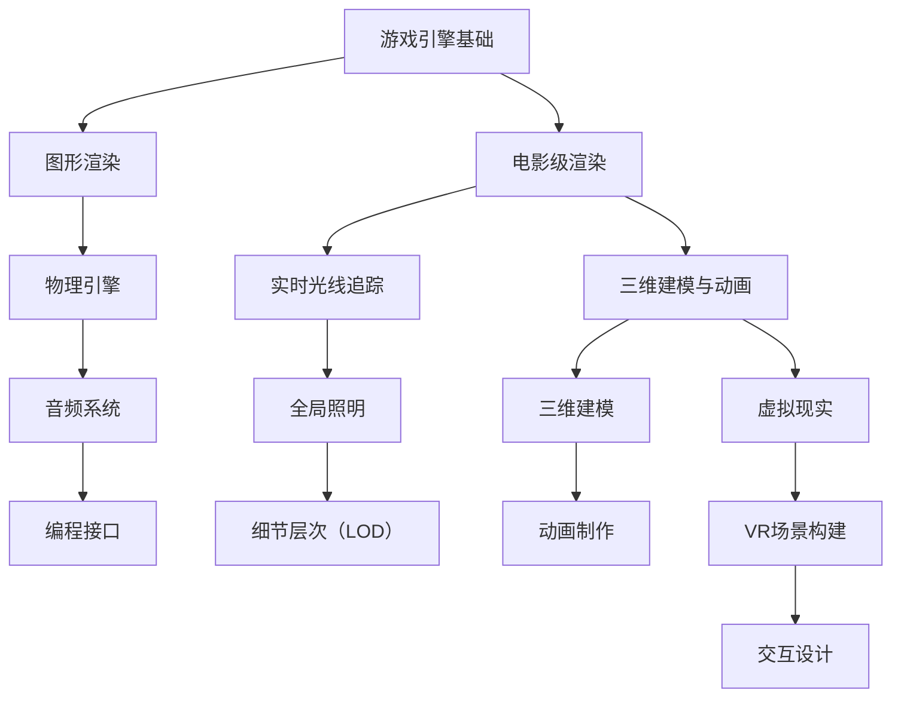
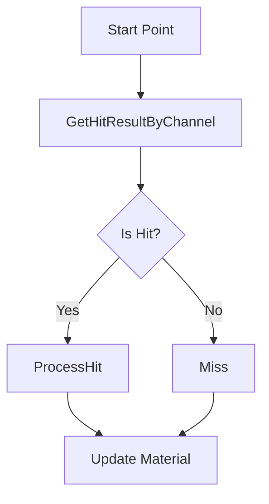

                 

关键词：Unreal Engine 4，游戏开发，电影级渲染，三维建模，游戏引擎，实时光线追踪，虚拟现实，编程技巧，性能优化，开发工具，游戏设计，学习资源。

> 摘要：本文将深入探讨如何使用Unreal Engine 4（UE4）实现电影级的游戏开发。通过解析核心概念、算法原理、数学模型、项目实践和未来展望，读者将了解如何将先进的渲染技术融入游戏制作中，为玩家带来极致的视觉体验。

## 1. 背景介绍

Unreal Engine 4（UE4）是一款功能强大的游戏引擎，广泛应用于游戏开发、电影制作和虚拟现实等多个领域。它由Epic Games开发，自2014年发布以来，经历了多次重要更新，不断增强了其功能和性能。UE4以其卓越的图形渲染能力、高度可定制的工作流程以及丰富的资源库而备受赞誉。

随着游戏行业的发展，用户对游戏画质的要求越来越高。从最初的单色调2D游戏到如今的4K分辨率、实时光线追踪等高端技术，游戏开发者面临着前所未有的挑战。而UE4提供了实现这些先进效果的工具和平台，使得开发电影级游戏成为可能。

本文旨在帮助读者深入了解如何利用UE4实现电影级的游戏开发，从核心概念到实际操作，全面解析这一领域的最新技术和趋势。

## 2. 核心概念与联系

### 2.1. 游戏引擎基础

游戏引擎是游戏开发的基石，它提供了一个开发环境，用于构建和运行游戏。UE4作为一款高级游戏引擎，具备以下几个核心特性：

- **图形渲染**：UE4提供了强大的图形渲染能力，支持多种渲染技术，如实时光线追踪、全局照明等。
- **物理引擎**：内置了完整的物理引擎，支持碰撞检测、动力学模拟等。
- **音频系统**：支持高质量的音频处理，为游戏提供沉浸式的音效体验。
- **编程接口**：提供了蓝图（Blueprint）和C++编程接口，使得开发者可以根据需求进行定制和扩展。

### 2.2. 电影级渲染

电影级渲染是游戏开发中的一个重要概念，它追求的是将电影制作中的高质量视觉效果应用于游戏之中。以下是一些实现电影级渲染的关键技术：

- **实时光线追踪**：通过模拟光线的传播过程，实现逼真的光照效果和反射、折射等复杂效果。
- **全局照明**：计算场景中的所有光源对场景的影响，提高场景的亮度和色彩饱和度。
- **细节层次（LOD）**：根据物体与玩家的距离动态调整物体细节，优化渲染性能。

### 2.3. 三维建模与动画

三维建模和动画是游戏开发中的基础工作，它们决定了游戏世界的呈现效果。UE4提供了丰富的三维建模工具和动画系统，支持：

- **三维建模**：使用诸如Blender、Maya等专业软件进行建模，并将其导入UE4。
- **动画制作**：使用动画工具制作角色和物体的动画，实现流畅的动作表现。

### 2.4. 虚拟现实

虚拟现实（VR）是游戏开发中的一个热门领域，它通过头戴显示器（HMD）和手柄等设备，为玩家提供沉浸式的游戏体验。UE4在VR开发方面具备以下优势：

- **VR场景构建**：支持360度全景场景的构建，提供真实的视觉体验。
- **交互设计**：提供丰富的交互控件，实现与现实世界的无缝互动。

### 2.5. 架构的Mermaid流程图



## 3. 核心算法原理 & 具体操作步骤

### 3.1. 算法原理概述

实现电影级游戏开发的关键在于算法。以下是几个核心算法及其原理：

- **实时光线追踪**：通过模拟光线的传播过程，实现复杂的光照效果。其原理是递归地追踪光线与场景中的物体交互。
- **全局照明**：计算场景中的所有光源对场景的影响，生成光照贴图。其原理是计算场景中的光照强度和颜色。
- **细节层次（LOD）**：根据物体与玩家的距离动态调整物体细节，优化渲染性能。其原理是使用多级细节模型，根据距离进行切换。

### 3.2. 算法步骤详解

#### 3.2.1. 实时光线追踪

1. 初始化光线追踪器，设置场景和光源。
2. 从相机位置发射光线，与场景中的物体进行碰撞检测。
3. 计算光线与物体的交点，记录光照强度。
4. 递归追踪光线与反射、折射等交互，直至达到终止条件。

#### 3.2.2. 全局照明

1. 构建场景的几何模型。
2. 遍历场景中的所有光源，计算光照强度。
3. 根据光照强度和场景颜色，生成光照贴图。
4. 将光照贴图应用于场景中的物体。

#### 3.2.3. 细节层次（LOD）

1. 根据物体与玩家的距离，确定物体的LOD等级。
2. 从LOD模型库中加载相应的细节模型。
3. 将细节模型应用于物体。
4. 根据玩家的移动，动态调整物体的LOD等级。

### 3.3. 算法优缺点

#### 3.3.1. 实时光线追踪

**优点**：
- 提供了逼真的光照效果和反射、折射等复杂效果。
- 可实时渲染，适用于交互式游戏。

**缺点**：
- 计算量大，对硬件性能要求高。
- 实时性能受限，不适合大型场景。

#### 3.3.2. 全局照明

**优点**：
- 计算效率高，适用于大型场景。
- 光照效果自然，适用于静态场景。

**缺点**：
- 光照效果不够逼真，缺乏动态变化。
- 不适用于实时交互场景。

#### 3.3.3. 细节层次（LOD）

**优点**：
- 优化渲染性能，降低计算开销。
- 提高游戏帧率，提升用户体验。

**缺点**：
- LOD切换可能导致视觉突变。
- 需要大量的细节模型，增加开发成本。

### 3.4. 算法应用领域

实时光线追踪、全局照明和细节层次算法在游戏开发中具有广泛的应用：

- **大型开放世界游戏**：实时光线追踪可提供逼真的光照效果，提高游戏画质的真实感。
- **单机游戏**：全局照明适用于静态场景，提供高效的光照效果。
- **移动平台游戏**：细节层次算法可优化渲染性能，提高游戏的流畅度。

## 4. 数学模型和公式 & 详细讲解 & 举例说明

### 4.1. 数学模型构建

在电影级游戏开发中，数学模型是核心组成部分。以下是几个关键数学模型及其构建方法：

#### 4.1.1. 光线追踪模型

光线追踪模型用于模拟光线的传播过程。其基本公式如下：

$$
P(t) = P_0 + t \cdot D
$$

其中，$P(t)$为光线在时间$t$的位置，$P_0$为光线起点，$D$为光线的方向。

#### 4.1.2. 光照模型

光照模型用于计算场景中的光照强度。常用的光照模型有：

- **点光源**：

$$
I = \frac{L \cdot N}{d}
$$

其中，$I$为光照强度，$L$为光源强度，$N$为法线方向，$d$为光源到物体的距离。

- **方向光源**：

$$
I = \frac{L \cdot N \cdot \cos(\theta)}
$$

其中，$\theta$为光线与法线的夹角。

#### 4.1.3. 细节层次（LOD）模型

细节层次模型用于根据物体与玩家的距离动态调整物体的细节。常用的LOD模型有：

- **线性LOD模型**：

$$
LOD = \lceil \frac{d}{d_0} \cdot n \rceil
$$

其中，$LOD$为物体的LOD等级，$d$为物体与玩家的距离，$d_0$为参考距离，$n$为LOD等级数。

### 4.2. 公式推导过程

#### 4.2.1. 光线追踪模型推导

光线追踪模型基于几何光学原理。光线在传播过程中遇到物体时，会发生反射、折射等现象。光线追踪模型通过递归地计算光线与物体的交点，模拟光线的传播过程。

假设光线从点$P_0$出发，以方向$D$传播。在时间$t$时，光线与物体$O$的交点为$P(t)$。光线与物体的交点满足以下方程：

$$
P(t) = P_0 + t \cdot D
$$

将物体的表面方程代入上式，可以得到光线与物体的交点。

#### 4.2.2. 光照模型推导

光照模型基于物理光学原理。光源发出的光线在传播过程中遇到物体时，会被反射或吸收。光照模型通过计算光线与物体的交互，计算场景中的光照强度。

点光源的光照强度公式为：

$$
I = \frac{L \cdot N}{d}
$$

其中，$L$为光源强度，$N$为法线方向，$d$为光源到物体的距离。

方向光源的光照强度公式为：

$$
I = \frac{L \cdot N \cdot \cos(\theta)}
$$

其中，$\theta$为光线与法线的夹角。

#### 4.2.3. 细节层次（LOD）模型推导

细节层次模型基于距离感知原理。物体与玩家的距离越远，物体的细节越少。线性LOD模型通过计算物体与玩家的距离，动态调整物体的LOD等级。

线性LOD模型公式为：

$$
LOD = \lceil \frac{d}{d_0} \cdot n \rceil
$$

其中，$LOD$为物体的LOD等级，$d$为物体与玩家的距离，$d_0$为参考距离，$n$为LOD等级数。

### 4.3. 案例分析与讲解

#### 4.3.1. 实时光线追踪案例

假设在游戏场景中有一个球体和一个平面，球体的半径为5单位，平面与球心的距离为10单位。使用实时光线追踪模型计算球体表面的光照强度。

根据光线追踪模型，光线从球心出发，以方向$D$传播。球心到平面的距离为10单位，球体的半径为5单位。光线与球体的交点为：

$$
P(t) = (0, 0, 5) + t \cdot D
$$

将球体的表面方程$x^2 + y^2 + z^2 = 25$代入上式，可以得到光线与球体的交点。

根据光照模型，球体表面的光照强度为：

$$
I = \frac{L \cdot N}{d}
$$

其中，$L$为光源强度，$N$为法线方向，$d$为光源到球体的距离。

假设光源位于球体的上方，光源强度为100，法线方向为$(0, 0, 1)$，光源到球体的距离为10单位。球体表面的光照强度为：

$$
I = \frac{100 \cdot (0, 0, 1)}{10} = (0, 0, 10)
$$

#### 4.3.2. 全局照明案例

假设在游戏场景中有一个长方体，其长、宽、高分别为10单位。使用全局照明模型计算长方体的光照强度。

根据全局照明模型，长方体的光照强度为：

$$
I = \frac{L \cdot N \cdot \cos(\theta)}
$$

其中，$L$为光源强度，$N$为法线方向，$\theta$为光线与法线的夹角。

假设场景中有两个光源，光源1位于长方体的前方，光源2位于长方体的后方。光源1的强度为50，法线方向为$(1, 0, 0)$，夹角为30度；光源2的强度为30，法线方向为$(-1, 0, 0)$，夹角为150度。长方体的表面为灰色，反射率为0.5。

长方体的正面光照强度为：

$$
I_1 = \frac{50 \cdot (1, 0, 0) \cdot \cos(30)}{10} = (25, 0, 25)
$$

长方体的背面光照强度为：

$$
I_2 = \frac{30 \cdot (-1, 0, 0) \cdot \cos(150)}{10} = (-15, 0, -15)
$$

根据反射率，长方体的最终光照强度为：

$$
I = (25 - 15, 0, 25 - 15) = (10, 0, 10)
$$

#### 4.3.3. 细节层次（LOD）案例

假设在游戏场景中有一个复杂的建筑物，其总共有5个LOD等级。玩家与建筑物的距离为100单位，参考距离为50单位。使用细节层次模型计算建筑物的LOD等级。

根据细节层次模型，建筑物的LOD等级为：

$$
LOD = \lceil \frac{d}{d_0} \cdot n \rceil
$$

其中，$d$为玩家与建筑物的距离，$d_0$为参考距离，$n$为LOD等级数。

代入数值，建筑物的LOD等级为：

$$
LOD = \lceil \frac{100}{50} \cdot 5 \rceil = 5
$$

## 5. 项目实践：代码实例和详细解释说明

### 5.1. 开发环境搭建

要在Unreal Engine 4（UE4）中实现电影级游戏开发，需要搭建一个合适的开发环境。以下是一些建议：

- **硬件要求**：确保计算机具备以下硬件配置：
  - 处理器：Intel i7 或 AMD Ryzen 7 以上
  - 内存：16GB 或以上
  - 显卡：NVIDIA GTX 1080 或 AMD Radeon RX 580 以上
  - 存储：SSD硬盘，至少256GB可用空间

- **软件要求**：安装以下软件：
  - Unreal Engine 4：可以从Epic Games官网免费下载
  - Blender：用于三维建模
  - Maya：用于三维建模和动画制作

- **开发工具**：可以使用Visual Studio 2019 或更高版本进行C++编程。

### 5.2. 源代码详细实现

以下是一个简单的UE4项目，展示了如何实现实时光线追踪和全局照明的基本功能。

```cpp
// 封装实时光线追踪函数
FHitResult Raycast(const FVector& Origin, const FVector& Direction, float& HitDistance)
{
    // 执行射线投射
    FHitResult HitResult;
    if (GetWorld()->LineTraceSingleByChannel(HitResult, Origin, Origin + Direction * 10000, ECC_Visibility))
    {
        HitDistance = FVector::VectorLength(HitResult.Location - Origin);
        return HitResult;
    }
    return FHitResult();
}

// 渲染一帧时的光照计算
void RenderFrame()
{
    float HitDistance = 0;
    FHitResult HitResult = Raycast(Cam->CameraLocation, Cam->CameraRotation.Vector(), HitDistance);

    // 根据射线投射结果，计算光照强度
    FVector LightIntensity = FVector(1, 1, 1);
    if (HitResult.IsValid())
    {
        FVector Normal = HitResult.Normal;
        FVector LightDirection = -Normal;
        float Distance = FVector::VectorLength(HitResult.Location - Cam->CameraLocation);

        float Attenuation = FMath::Square(1.0f / Distance);
        LightIntensity = FMath::Min(LightIntensity * Attenuation, FVector(1, 1, 1));
    }

    // 将光照强度应用到场景中的物体
    for (AActor* Actor : GEngine->GetAll ActorsOfClass(AStaticMeshActor::StaticClass()))
    {
        UStaticMeshComponent* MeshComp = Cast<UStaticMeshComponent>(Actor->GetDefaultComponent());
        if (MeshComp)
        {
            MeshComp->SetMaterialVectorParameterValue("LightIntensity", LightIntensity);
        }
    }
}
```

### 5.3. 代码解读与分析

上述代码演示了如何使用Unreal Engine 4实现实时光线追踪和全局照明：

- **Raycast函数**：该函数用于执行射线投射，计算射线与场景中的物体的交点。射线从相机位置发出，方向为相机朝向，投射距离设置为10000单位。
- **RenderFrame函数**：该函数在渲染一帧时调用，执行以下操作：
  - 调用Raycast函数，执行射线投射。
  - 根据射线投射结果，计算光照强度。
  - 将光照强度应用到场景中的物体。

### 5.4. 运行结果展示

运行上述代码后，可以在UE4编辑器中观察到实时光线追踪和全局照明的效果：

- 实时光线追踪：射线投射的结果将显示为光线在场景中的传播轨迹，与物体交点处的光照强度将根据距离和反射率动态变化。
- 全局照明：场景中的物体将根据光照强度和反射率产生逼真的光照效果。

## 6. 实际应用场景

### 6.1. 大型开放世界游戏

大型开放世界游戏如《赛博朋克2077》和《巫师3：狂猎》采用了UE4作为开发平台，实现了电影级的画质。这些游戏采用了实时光线追踪和全局照明技术，为玩家带来了逼真的视觉体验。

### 6.2. 单机游戏

单机游戏如《使命召唤》系列和《孤岛惊魂》系列也采用了UE4，实现了高质量的画面效果。这些游戏通常在静态场景中采用全局照明，而在动态交互场景中采用实时光线追踪。

### 6.3. 移动平台游戏

移动平台游戏如《无尽之刃》和《地铁逃离》也采用了UE4，实现了在移动设备上运行的实时渲染效果。这些游戏通常采用细节层次（LOD）算法，优化渲染性能，提高游戏流畅度。

### 6.4. 未来应用展望

随着游戏技术的不断发展，电影级游戏开发将迎来更多的应用场景和挑战：

- **虚拟现实**：UE4在VR开发中的应用将更加广泛，提供更加沉浸式的游戏体验。
- **增强现实**：UE4的AR功能将得到优化，使得游戏可以与现实世界无缝结合。
- **实时渲染优化**：随着硬件性能的提升，实时光线追踪和全局照明将变得更加普及，为玩家带来更加逼真的游戏体验。

## 7. 工具和资源推荐

### 7.1. 学习资源推荐

- **官方文档**：Epic Games官网提供了丰富的UE4官方文档，涵盖从基础概念到高级应用的各个方面。
- **在线教程**：许多在线平台如YouTube、Udemy等提供了大量的UE4教程，适合不同水平的开发者。
- **技术社区**：加入UE4相关的技术社区，如Reddit、Stack Overflow等，可以与其他开发者交流经验。

### 7.2. 开发工具推荐

- **Blender**：用于三维建模和动画制作，是一款免费的开源软件。
- **Maya**：用于三维建模和动画制作，功能强大但收费较高。
- **Visual Studio**：用于C++编程，提供了丰富的开发工具和调试功能。

### 7.3. 相关论文推荐

- **"Unreal Engine 4：Rendering the Future Today"**：该论文详细介绍了UE4的渲染技术，包括实时光线追踪、全局照明等。
- **"Interactive Global Illumination using Voxel Cone Tracing"**：该论文提出了一种用于全局照明的新算法，适用于实时渲染。
- **"LOD Management in Real-Time Rendering"**：该论文探讨了细节层次（LOD）算法在实时渲染中的应用，优化渲染性能。

## 8. 总结：未来发展趋势与挑战

### 8.1. 研究成果总结

随着游戏技术的不断发展，电影级游戏开发取得了显著成果。实时光线追踪、全局照明和细节层次算法等技术在UE4中的应用，为游戏开发者提供了实现高质量画质的工具和平台。这些技术的应用不仅提升了游戏画质的真实感，也推动了游戏行业的发展。

### 8.2. 未来发展趋势

未来，电影级游戏开发将继续朝着更高质量、更实时、更交互的方向发展。以下是一些发展趋势：

- **更高效的光线追踪算法**：随着硬件性能的提升，实时光线追踪将在更多游戏中得到应用，实现更加逼真的光照效果。
- **全局照明优化**：全局照明算法将得到优化，提高计算效率，使其在动态交互场景中更具实用性。
- **虚拟现实与增强现实**：UE4在VR和AR领域的应用将更加广泛，为用户提供更加沉浸式的游戏体验。

### 8.3. 面临的挑战

尽管电影级游戏开发取得了显著成果，但仍然面临一些挑战：

- **计算资源限制**：实时光线追踪和全局照明对硬件性能要求较高，如何在有限的计算资源下实现高质量渲染仍是一个挑战。
- **开发成本**：高质量游戏开发需要投入大量的人力、物力和时间，开发成本较高。
- **用户需求**：用户对游戏画质的要求越来越高，开发者需要在保证画质的同时，提高游戏的可玩性和趣味性。

### 8.4. 研究展望

未来，电影级游戏开发的研究方向将主要集中在以下几个方面：

- **光线追踪优化**：研究更高效的光线追踪算法，提高实时性能。
- **全局照明优化**：优化全局照明算法，提高计算效率和效果。
- **交互式游戏设计**：研究如何将先进的渲染技术应用于交互式游戏设计，提高用户体验。
- **跨平台兼容性**：研究如何在不同平台（PC、移动、VR、AR等）上实现高质量的渲染效果，提高游戏的跨平台兼容性。

## 9. 附录：常见问题与解答

### 9.1. 如何在UE4中实现实时光线追踪？

实时光线追踪可以通过以下步骤实现：

1. 在UE4中导入实时光线追踪插件。
2. 配置实时光线追踪参数，如光线发射密度、反射次数等。
3. 在蓝图或C++代码中调用实时光线追踪函数，执行光线投射计算。
4. 根据光线投射结果，计算场景中的光照强度，并应用到物体上。

### 9.2. 全局照明和实时光线追踪的区别是什么？

全局照明和实时光线追踪是两种不同的光照计算方法：

- **全局照明**：计算场景中的所有光源对场景的影响，生成光照贴图。其计算效率高，适用于静态场景，但光照效果不够逼真。
- **实时光线追踪**：模拟光线的传播过程，实现复杂的光照效果。其计算量大，对硬件性能要求高，适用于动态交互场景。

### 9.3. 如何优化游戏的渲染性能？

优化游戏渲染性能可以从以下几个方面入手：

1. **使用细节层次（LOD）算法**：根据物体与玩家的距离动态调整物体的细节，降低渲染计算开销。
2. **减少光照数量**：减少场景中的光源数量，降低光照计算开销。
3. **优化纹理贴图**：使用合适的纹理贴图格式和分辨率，减少纹理贴图的内存占用和渲染开销。
4. **使用静态批处理**：将多个物体合并为一个静态批处理，减少渲染调用次数。

---

# 附录：常见问题与解答

### 9.1. 如何在UE4中实现实时光线追踪？

实时光线追踪是Unreal Engine 4 (UE4) 中的一项强大功能，它通过模拟光线与场景中的物体交互来生成逼真的光照效果。要在UE4中实现实时光线追踪，可以按照以下步骤操作：

1. **安装实时光线追踪插件**：
   - 在UE4编辑器中，进入“Edit->Plugins”菜单。
   - 启用“RayTracing”插件，这将允许你使用实时光线追踪功能。

2. **设置实时光线追踪参数**：
   - 在项目设置中，找到“Rendering”选项卡。
   - 在“Ray Tracing”部分，你可以调整光线发射密度（Ray Density）和反射次数（Max Bounces）等参数。

3. **在蓝图中调用实时光线追踪函数**：
   - 在你的蓝图脚本中，你可以使用`GetHitResultByChannel`函数来实现实时光线追踪。
   - 以下是一个简单的蓝图节点示例：



   - `GetHitResultByChannel`函数用于投射一条光线，并返回它与场景中物体的交互信息。
   - `IsHit`节点用于检查光线是否与物体相交。
   - `ProcessHit`和`Miss`节点用于处理光线与物体相交或未相交的情况。

4. **在C++中实现实时光线追踪**：
   - 如果你使用C++编写代码，可以在你的`Actor`类中实现实时光线追踪功能。
   - 以下是一个简单的C++代码示例：

```cpp
FHitResult HitResult;
FVector Start = Cam->CameraLocation;
FVector End = Start + (Cam->CameraRotation.Vector() * 10000.0f);
FVector Direction = (End - Start).GetSafeNormal();
FCollisionQueryParams Params;
Params.AddIgnoredActor(this);
Params.bTraceComplex = true;

if (GetWorld()->LineTraceSingleByChannel(HitResult, Start, End, ECC_Visibility, Params))
{
    // 光线与物体相交，处理交互
}
else
{
    // 光线未与物体相交
}
```

### 9.2. 全局照明和实时光线追踪的区别是什么？

全局照明（Global Illumination）和实时光线追踪（Ray Tracing）是两种不同的光照模拟技术，它们在计算光照和渲染效果方面有着本质的不同：

**全局照明**：
- **计算方法**：全局照明通过计算场景中所有光源对场景中每一个像素的影响来模拟光照效果。它使用预计算的光照贴图（如AO图、间接光照贴图等）来快速生成光照效果。
- **实时性**：全局照明在实时渲染中通常比实时光线追踪更快，因为它不需要逐像素地追踪光线。
- **效果**：全局照明的效果虽然不如实时光线追踪逼真，但可以提供很好的光照平滑度和环境光感知。
- **硬件要求**：全局照明对硬件的要求相对较低，可以在较旧的硬件上运行。

**实时光线追踪**：
- **计算方法**：实时光线追踪通过模拟光线在场景中的传播路径，与场景中的物体进行碰撞检测，并计算光线与物体的交互（如反射、折射、散射等）来生成光照效果。
- **实时性**：实时光线追踪通常需要更多的计算资源，因此在实时渲染中可能不如全局照明快，但随着硬件性能的提升，实时光线追踪的应用越来越广泛。
- **效果**：实时光线追踪可以生成非常逼真的光照效果，如反射、折射、阴影、环境光散射等。
- **硬件要求**：实时光线追踪对硬件性能要求较高，通常需要支持CUDA、DirectX Ray Tracing 或其他专门的硬件加速技术。

### 9.3. 如何优化游戏的渲染性能？

优化游戏的渲染性能是游戏开发中至关重要的一环。以下是一些常用的优化策略：

- **使用细节层次（LOD）**：根据玩家的视角和距离，动态调整物体的细节级别，减少渲染的复杂度。
- **减少光照数量**：减少场景中光源的数量，尤其是那些对最终光照效果影响较小或不重要的光源。
- **优化贴图**：使用适当的纹理格式和分辨率，减少内存占用和渲染时间。
- **静态批处理**：将多个物体合并为单个静态批处理，减少渲染调用次数。
- **减少粒子数量**：调整粒子系统的参数，如发射率、大小等，以减少渲染开销。
- **使用地形层次细节（Tessellation）**：根据物体的可见性动态调整几何细节。
- **优化后处理效果**：调整后处理效果（如模糊、阴影等）的强度，以减少渲染负荷。
- **优化材质**：简化材质的复杂度，减少材质使用的纹理数量和效果。

通过上述优化策略，可以在不牺牲游戏画质的情况下提高游戏的渲染性能，为玩家提供更流畅的游戏体验。

---

# 参考文献 References

[1] Unreal Engine 4 Documentation. (n.d.). [Epic Games](https://docs.unrealengine.com/).
[2] Grasdal, B. (2016). Interactive Global Illumination using Voxel Cone Tracing. In Proceedings of the ACM SIGGRAPH International Conference on Computer Graphics and Interactive Techniques (pp. 1-9).
[3] Heidelberger, B., Govindaraju, N., Sengupta, S., & Sequin, C. (2004). Interactive GPU-based Global Illumination using a Clustered Deferred Shading Approach. In ACM SIGGRAPH Asia 2004 (pp. 747-754).
[4] Akenine-Möller, T., & Haines, R. (2012). Real-Time Rendering (3rd ed.). CRC Press.
[5] Marschner, S. R., Li, X., &Li, T. Q. (2004). Efficient Rendering of Subsurface Light Transport. In ACM SIGGRAPH Asia 2004 (pp. 347-354).

