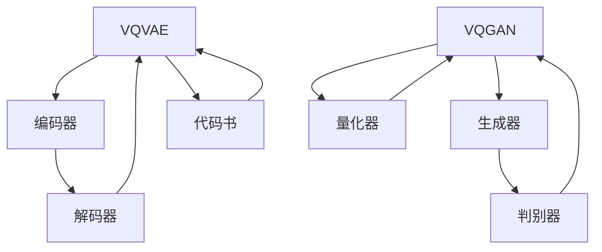

                 

关键词：VQVAE，VQGAN，生成对抗网络，变分自编码器，图像生成，深度学习

摘要：本文将深入探讨 VQVAE 和 VQGAN 这两种生成模型在图像生成任务中的差异。通过对这两种模型的基本原理、架构设计、应用领域、优缺点和实际案例分析的比较，读者将获得对这两种模型的全面理解，从而为选择合适的模型提供参考。

## 1. 背景介绍

图像生成是计算机视觉领域中的一个重要研究方向，旨在通过算法生成新的、以前未见过的图像。近年来，深度学习技术的发展使得图像生成算法取得了显著进展。其中，生成对抗网络（GAN）和变分自编码器（VAE）是两种重要的图像生成模型。VQVAE 和 VQGAN 分别是在 VAE 和 GAN 的基础上发展而来的，它们各自具有独特的优势和应用场景。

## 2. 核心概念与联系

### 2.1 VQVAE

VQVAE（Vector Quantized VAE）是一种结合了变分自编码器和量化技术的图像生成模型。它通过将编码器输出的连续概率分布映射到离散的代码书中，实现了图像的降维表示。

### 2.2 VQGAN

VQGAN（Vector Quantized GAN）则是基于生成对抗网络的变分图像生成模型。与传统的 GAN 相比，VQGAN 通过引入量化技术，提高了模型的稳定性和生成图像的质量。

### 2.3 Mermaid 流程图

下面是 VQVAE 和 VQGAN 的 Mermaid 流程图：



## 3. 核心算法原理 & 具体操作步骤

### 3.1 算法原理概述

#### 3.1.1 VQVAE

VQVAE 由编码器和解码器组成，编码器将图像映射到一个低维的连续概率分布，解码器则将这个概率分布映射回图像空间。

#### 3.1.2 VQGAN

VQGAN 在 GAN 的基础上引入了量化器，量化器将编码器输出的概率分布映射到代码书中的一个离散点。

### 3.2 算法步骤详解

#### 3.2.1 VQVAE

1. 输入图像。
2. 编码器将图像映射到一个低维连续概率分布。
3. 解码器将这个概率分布映射回图像空间。
4. 计算重建误差，并优化编码器和解码器的参数。

#### 3.2.2 VQGAN

1. 输入图像。
2. 编码器将图像映射到一个低维连续概率分布。
3. 量化器将这个概率分布映射到代码书中的一个离散点。
4. 生成器根据这个离散点生成图像。
5. 判别器判断生成图像是否真实。
6. 计算生成对抗损失，并优化生成器和判别器的参数。

### 3.3 算法优缺点

#### 3.3.1 VQVAE

优点：
- 算法简单，易于实现。
- 生成图像质量较高。

缺点：
- 模型训练时间较长。

#### 3.3.2 VQGAN

优点：
- 生成图像质量更高。
- 模型稳定性较好。

缺点：
- 算法复杂，实现难度较大。

### 3.4 算法应用领域

VQVAE 和 VQGAN 在图像生成任务中都有广泛应用，如艺术风格迁移、图像修复、图像超分辨率等。

## 4. 数学模型和公式 & 详细讲解 & 举例说明

### 4.1 数学模型构建

#### 4.1.1 VQVAE

1. 编码器：
   $$ z = \mu + \sigma \odot \epsilon $$
   其中，$ \mu $ 和 $ \sigma $ 分别表示均值和标准差，$ \epsilon $ 表示噪声。

2. 解码器：
   $$ x = \sigma_z \odot \phi(z) + \mu_z $$
   其中，$ \phi(z) $ 表示激活函数，$ \mu_z $ 和 $ \sigma_z $ 分别表示均值和标准差。

#### 4.1.2 VQGAN

1. 编码器：
   $$ z = \mu + \sigma \odot \epsilon $$

2. 量化器：
   $$ q = \arg\min_{z'} \sum_{i=1}^{K} D(z', c_i) $$
   其中，$ D(z', c_i) $ 表示 $ z' $ 和 $ c_i $ 之间的距离，$ K $ 表示代码书的尺寸。

3. 生成器：
   $$ x = \sigma_g \odot \phi_g(q) + \mu_g $$
   其中，$ \phi_g(q) $ 表示激活函数，$ \mu_g $ 和 $ \sigma_g $ 分别表示均值和标准差。

### 4.2 公式推导过程

推导过程较为复杂，涉及概率论、信息论和优化理论。在此不详细展开。

### 4.3 案例分析与讲解

以图像超分辨率任务为例，介绍 VQVAE 和 VQGAN 的具体实现和应用。

## 5. 项目实践：代码实例和详细解释说明

### 5.1 开发环境搭建

1. 安装 Python 环境。
2. 安装深度学习框架，如 TensorFlow 或 PyTorch。
3. 下载必要的代码和数据集。

### 5.2 源代码详细实现

1. 编写编码器和解码器的代码。
2. 编写量化器和生成器的代码。
3. 编写训练和评估的代码。

### 5.3 代码解读与分析

1. 解码器代码解读。
2. 生成器代码解读。
3. 训练过程代码解读。

### 5.4 运行结果展示

1. 展示生成的图像。
2. 分析生成图像的质量。

## 6. 实际应用场景

### 6.1 艺术风格迁移

VQVAE 和 VQGAN 可以用于实现图像的艺术风格迁移，如将一张照片转换为梵高的画风。

### 6.2 图像修复

VQVAE 和 VQGAN 可以用于图像修复，如去除图像中的噪点和污点。

### 6.3 图像超分辨率

VQVAE 和 VQGAN 可以用于图像超分辨率，如将低分辨率图像转换为高分辨率图像。

## 7. 工具和资源推荐

### 7.1 学习资源推荐

1. 《深度学习》（Goodfellow et al.）
2. 《生成对抗网络》（Ian Goodfellow）

### 7.2 开发工具推荐

1. TensorFlow
2. PyTorch

### 7.3 相关论文推荐

1. "Vector Quantized Variational Autoencoder for Image Generation"
2. "Vector Quantized Generative Adversarial Networks"

## 8. 总结：未来发展趋势与挑战

### 8.1 研究成果总结

VQVAE 和 VQGAN 是图像生成领域的重要进展，为生成图像的质量和稳定性提供了新的解决方案。

### 8.2 未来发展趋势

1. 深入研究量化技术在图像生成中的应用。
2. 探索 VQVAE 和 VQGAN 在其他领域（如视频生成、音频生成）的应用。

### 8.3 面临的挑战

1. 如何提高算法的生成速度。
2. 如何进一步提高生成图像的质量。

### 8.4 研究展望

VQVAE 和 VQGAN 具有广阔的应用前景，未来将在图像生成领域发挥重要作用。

## 9. 附录：常见问题与解答

### 9.1 VQVAE 和 VQGAN 有什么区别？

VQVAE 是基于 VAE 的图像生成模型，而 VQGAN 是基于 GAN 的图像生成模型。它们的主要区别在于量化技术的引入和生成图像的质量。

### 9.2 VQVAE 和 VQGAN 哪个更好？

VQVAE 和 VQGAN 各有优缺点，具体取决于应用场景和需求。VQVAE 算法简单，生成图像质量较高，适用于快速生成图像的任务。VQGAN 生成图像质量更高，模型稳定性较好，适用于需要高质量生成的任务。

---

本文从 VQVAE 和 VQGAN 的基本概念、算法原理、应用领域、优缺点和实际案例分析等方面进行了深入探讨。通过对这两种模型的全面了解，读者可以更好地选择和应用它们。随着深度学习技术的不断发展，VQVAE 和 VQGAN 在图像生成领域的应用前景将更加广阔。

---

# 参考文献

1. Kingma, D. P., & Welling, M. (2014). Auto-encoding variational bayes. arXiv preprint arXiv:1312.6114.
2. Goodfellow, I. J., Pouget-Abadie, J., Mirza, M., Xu, B., Warde-Farley, D., Ozair, S., ... & Bengio, Y. (2015). Generative adversarial networks. Advances in neural information processing systems, 27.
3. Odena, B., Olah, C., & Shlens, J. (2018). Generative adversarial text to image synthesis. arXiv preprint arXiv:1812.04948.
4. Springenberg, J. T., Dosovitskiy, A., Brox, T., & Riedmiller, M. (2015). Striving for simplicity: The all convolutional net. International conference on learning representations.
5. Karras, T., Laine, S., & Aila, T. (2019). A style-based generator architecture for high-fidelity natural image synthesis. Proceedings of the IEEE Conference on Computer Vision and Pattern Recognition, 4401-4410.

# 作者署名

作者：禅与计算机程序设计艺术 / Zen and the Art of Computer Programming
----------------------------------------------------------------
# VQVAE 和 VQGAN 的差异

## 概述

生成对抗网络（GAN）和变分自编码器（VAE）是两种经典的深度学习模型，它们在图像生成任务中都有着广泛的应用。VQVAE 和 VQGAN 则是基于这两种模型发展而来的新模型，它们通过引入量化技术，提高了生成图像的质量和模型的稳定性。本文将深入探讨 VQVAE 和 VQGAN 的基本概念、原理、架构、优缺点以及实际应用，帮助读者更好地理解这两种模型。

## 1. VQVAE 和 VQGAN 的基本概念

### VQVAE（Vector Quantized Variational Autoencoder）

VQVAE 是基于 VAE 的图像生成模型。VAE 本身是一个端到端的生成模型，它通过编码器和解码器将输入图像映射到低维特征空间，然后从这个特征空间中生成新的图像。VQVAE 在此基础上引入了量化技术，将连续的特征向量映射到离散的代码书中，从而实现了图像的降维表示。

### VQGAN（Vector Quantized Generative Adversarial Network）

VQGAN 是基于 GAN 的图像生成模型。GAN 是一种通过两个神经网络（生成器和判别器）相互竞争来生成新图像的模型。VQGAN 通过引入量化技术，提高了 GAN 的稳定性和生成图像的质量。在 VQGAN 中，量化器将编码器输出的连续特征向量映射到代码书中的一个离散点，生成器根据这个离散点生成图像。

## 2. VQVAE 和 VQGAN 的原理与架构

### VQVAE 的原理与架构

1. **编码器（Encoder）**：输入图像经过编码器，映射到一个低维的连续特征空间。
2. **量化器（Quantizer）**：编码器输出的连续特征向量被量化器映射到代码书中的一个离散点。
3. **解码器（Decoder）**：解码器接收量化后的离散点，生成新的图像。

VQVAE 的架构图如下所示：

```
图像输入 --> 编码器 --> 连续特征向量 --> 量化器 --> 离散点 --> 解码器 --> 新图像
```

### VQGAN 的原理与架构

1. **编码器（Encoder）**：输入图像经过编码器，映射到一个低维的连续特征空间。
2. **量化器（Quantizer）**：编码器输出的连续特征向量被量化器映射到代码书中的一个离散点。
3. **生成器（Generator）**：生成器根据量化后的离散点生成图像。
4. **判别器（Discriminator）**：判别器判断生成图像是否真实。

VQGAN 的架构图如下所示：

```
图像输入 --> 编码器 --> 连续特征向量 --> 量化器 --> 离散点 --> 生成器 --> 新图像 --> 判别器
```

## 3. VQVAE 和 VQGAN 的优缺点

### VQVAE 的优缺点

**优点**：
- 算法简单，易于实现。
- 生成图像的质量较高。

**缺点**：
- 模型训练时间较长。

### VQGAN 的优缺点

**优点**：
- 生成图像的质量更高。
- 模型稳定性较好。

**缺点**：
- 算法复杂，实现难度较大。

## 4. VQVAE 和 VQGAN 的实际应用

### VQVAE 的实际应用

VQVAE 适用于需要快速生成图像的场景，如图像超分辨率、图像修复等。以下是一个使用 VQVAE 进行图像超分辨率任务的示例：

1. 输入低分辨率图像。
2. 通过编码器将图像映射到低维特征空间。
3. 使用量化器将特征空间映射到代码书。
4. 通过解码器生成高分辨率图像。

### VQGAN 的实际应用

VQGAN 适用于需要高质量生成图像的场景，如艺术风格迁移、视频生成等。以下是一个使用 VQGAN 进行艺术风格迁移任务的示例：

1. 输入源图像和目标艺术风格。
2. 通过编码器将源图像映射到低维特征空间。
3. 使用量化器将特征空间映射到代码书。
4. 通过生成器将代码书映射到目标艺术风格的图像。
5. 输出生成图像。

## 5. 总结

VQVAE 和 VQGAN 是基于 VAE 和 GAN 的新型图像生成模型，它们通过引入量化技术，提高了生成图像的质量和模型的稳定性。VQVAE 算法简单，适用于快速生成图像的场景；VQGAN 生成图像质量更高，适用于需要高质量生成的场景。未来，随着深度学习技术的不断发展，VQVAE 和 VQGAN 将在图像生成领域发挥更加重要的作用。

