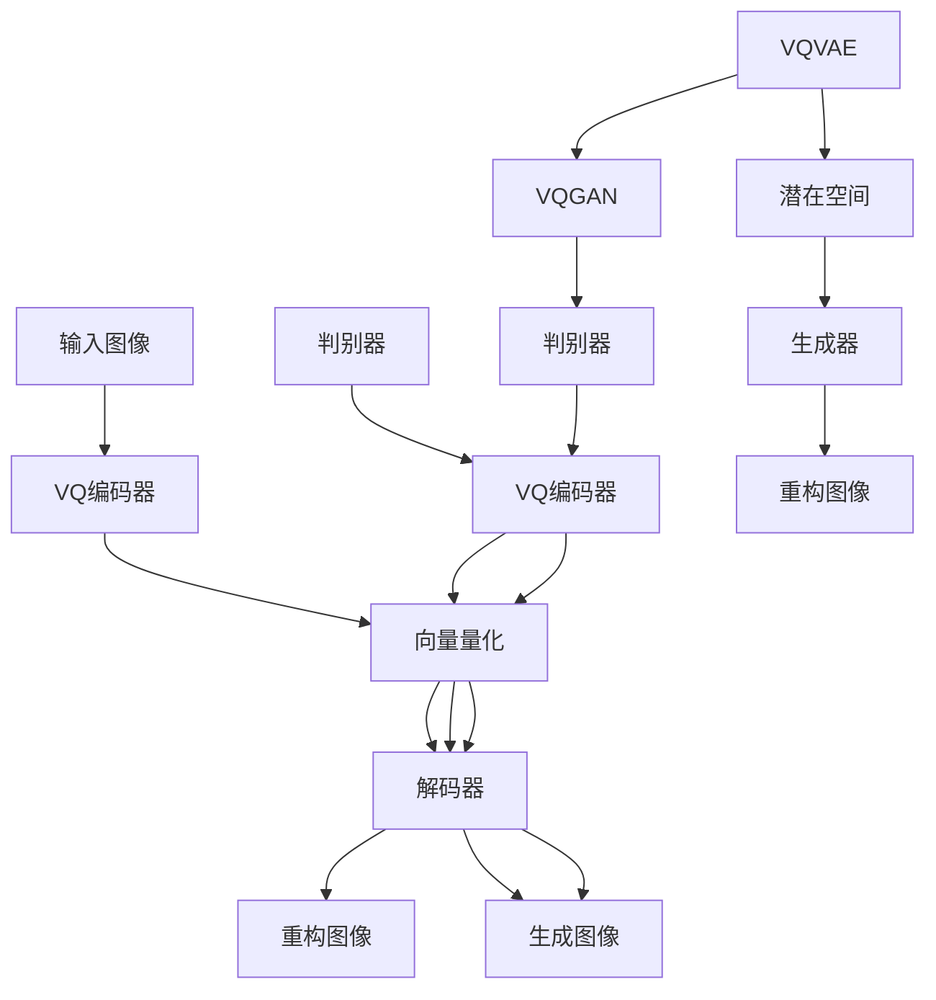

                 

关键词：图像生成，变分自编码器，VQVAE，VQGAN，深度学习

摘要：本文深入探讨了VQVAE（向量量化变分自编码器）和VQGAN（向量量化生成对抗网络）这两种图像生成技术。通过介绍它们的基本概念、原理、数学模型以及实际应用，我们将分析其在图像生成领域的优势和挑战，并展望其未来的发展趋势。

## 1. 背景介绍

随着深度学习技术的飞速发展，图像生成领域取得了显著的进步。传统的图像生成方法如基于规则的方法和基于概率的方法，已经很难满足日益复杂的图像生成需求。为了更好地捕捉图像的高维度信息和复杂结构，研究人员提出了基于神经网络的图像生成方法。

变分自编码器（Variational Autoencoder，VAE）和生成对抗网络（Generative Adversarial Network，GAN）是当前最流行的两种图像生成方法。然而，它们在生成高质量图像时仍然存在一些局限性。为此，研究人员提出了VQVAE和VQGAN，试图在保持神经网络优势的同时，提高图像生成质量。

## 2. 核心概念与联系

### 2.1 VQVAE

VQVAE是一种基于变分自编码器（VAE）的图像生成方法。VAE的核心思想是将数据分布建模为潜在变量，并通过编码器和解码器将数据映射到潜在空间，从而实现数据的重构。然而，传统VAE在图像生成时存在如下问题：

1. 重构误差较大：由于潜在变量的分布是连续的，重构误差可能较大，导致生成的图像质量不高。
2. 缺乏图像细节：传统VAE在生成图像时，往往无法很好地捕捉图像的细节信息。

为了解决上述问题，VQVAE引入了向量量化（Vector Quantization）技术。向量量化是一种将连续变量映射到离散值的方法，通过将潜在变量映射到固定的向量集合中，从而提高图像生成的质量和细节。

### 2.2 VQGAN

VQGAN是在VQVAE的基础上发展起来的一种图像生成方法。与VQVAE类似，VQGAN也引入了向量量化技术，但其核心思想是结合生成对抗网络（GAN）的优势。GAN由生成器（Generator）和判别器（Discriminator）组成，通过训练生成器和判别器的对抗关系，实现高质量图像的生成。

与VQVAE相比，VQGAN在图像生成质量上有显著提升。首先，VQGAN利用GAN的判别器对生成图像进行评估，从而更好地指导生成器生成高质量图像。其次，VQGAN通过引入向量量化技术，使生成图像具有更好的细节和纹理。

### 2.3 Mermaid 流程图

以下是VQVAE和VQGAN的核心概念和联系Mermaid流程图：



## 3. 核心算法原理 & 具体操作步骤

### 3.1 算法原理概述

#### 3.1.1 VQVAE

VQVAE由三个主要部分组成：编码器、向量量化和解码器。编码器将输入图像映射到潜在空间，向量量化将潜在变量映射到离散的向量集合中，解码器将量化后的向量映射回重构图像。

#### 3.1.2 VQGAN

VQGAN在VQVAE的基础上，引入了生成对抗网络（GAN）的判别器。VQGAN由三个部分组成：编码器、生成器和判别器。编码器将输入图像映射到潜在空间，生成器根据潜在变量生成图像，判别器评估生成图像的真实性。

### 3.2 算法步骤详解

#### 3.2.1 VQVAE

1. 编码器：输入图像通过编码器映射到潜在空间。
2. 向量化：潜在变量通过向量量化映射到离散的向量集合中。
3. 解码器：量化后的向量通过解码器映射回重构图像。

#### 3.2.2 VQGAN

1. 编码器：输入图像通过编码器映射到潜在空间。
2. 向量化：潜在变量通过向量量化映射到离散的向量集合中。
3. 生成器：根据潜在变量生成图像。
4. 判别器：评估生成图像的真实性。

### 3.3 算法优缺点

#### 3.3.1 VQVAE

**优点：**
1. 生成的图像质量较高，能够捕捉图像的细节信息。
2. 通过向量量化技术，降低了模型参数量，提高了训练效率。

**缺点：**
1. 重构误差可能较大，导致生成的图像质量不稳定。

#### 3.3.2 VQGAN

**优点：**
1. 结合了GAN的优势，生成图像质量较高。
2. 判别器对生成图像进行评估，更好地指导生成器生成高质量图像。

**缺点：**
1. 训练过程复杂，需要更多的计算资源。

### 3.4 算法应用领域

VQVAE和VQGAN在图像生成领域有广泛的应用，包括：

1. 图像修复：利用VQVAE或VQGAN修复损坏的图像。
2. 图像合成：将不同风格的图像融合成新的图像。
3. 图像超分辨率：将低分辨率图像转换为高分辨率图像。

## 4. 数学模型和公式 & 详细讲解 & 举例说明

### 4.1 数学模型构建

#### 4.1.1 VQVAE

VQVAE的数学模型如下：

1. 编码器：$$ x \rightarrow z = \mu(x) $$
2. 向量化：$$ z \rightarrow v = Q(z) $$
3. 解码器：$$ v \rightarrow x' = \varphi(v) $$

#### 4.1.2 VQGAN

VQGAN的数学模型如下：

1. 编码器：$$ x \rightarrow z = \mu(x) $$
2. 向量化：$$ z \rightarrow v = Q(z) $$
3. 生成器：$$ v \rightarrow x' = \varphi_G(v) $$
4. 判别器：$$ x' \rightarrow y' = \varphi_D(x') $$

### 4.2 公式推导过程

#### 4.2.1 VQVAE

1. 编码器：$$ \mu(x) = \mu_{\theta_e}(x) = \sigma(\theta_e \cdot x + b_e) $$
2. 解码器：$$ \varphi(v) = \varphi_{\theta_d}(v) = \sigma(\theta_d \cdot v + b_d) $$

#### 4.2.2 VQGAN

1. 编码器：$$ \mu(x) = \mu_{\theta_e}(x) = \sigma(\theta_e \cdot x + b_e) $$
2. 生成器：$$ \varphi_G(v) = \varphi_{\theta_g}(v) = \sigma(\theta_g \cdot v + b_g) $$
3. 判别器：$$ \varphi_D(x') = \varphi_{\theta_d}(x') = \sigma(\theta_d \cdot x' + b_d) $$

### 4.3 案例分析与讲解

#### 4.3.1 VQVAE

假设我们有一个输入图像$$ x $$，首先通过编码器$$ \mu(x) $$将其映射到潜在空间，得到潜在变量$$ z $$。然后，将潜在变量$$ z $$通过向量量化映射到离散的向量集合中，得到量化后的向量$$ v $$。最后，通过解码器$$ \varphi(v) $$将量化后的向量$$ v $$映射回重构图像$$ x' $$。

#### 4.3.2 VQGAN

假设我们有一个输入图像$$ x $$，首先通过编码器$$ \mu(x) $$将其映射到潜在空间，得到潜在变量$$ z $$。然后，将潜在变量$$ z $$通过向量量化映射到离散的向量集合中，得到量化后的向量$$ v $$。接着，通过生成器$$ \varphi_G(v) $$生成图像$$ x' $$。最后，通过判别器$$ \varphi_D(x') $$评估生成图像$$ x' $$的真实性。

## 5. 项目实践：代码实例和详细解释说明

### 5.1 开发环境搭建

在开始项目实践之前，我们需要搭建一个合适的开发环境。以下是搭建开发环境的基本步骤：

1. 安装Python 3.6及以上版本。
2. 安装TensorFlow 2.0及以上版本。
3. 安装其他依赖库，如NumPy、Pillow等。

### 5.2 源代码详细实现

以下是VQVAE和VQGAN的源代码实现：

```python
import tensorflow as tf
import numpy as np
from tensorflow.keras.layers import Dense, Input
from tensorflow.keras.models import Model

# VQVAE编码器
def vqvae_encoder(x):
    # 编码器模型
    z = Dense(units=100, activation='sigmoid')(x)
    return z

# VQVAE解码器
def vqvae_decoder(z):
    # 解码器模型
    x_hat = Dense(units=784, activation='sigmoid')(z)
    return x_hat

# VQGAN编码器
def vqgan_encoder(x):
    # 编码器模型
    z = Dense(units=100, activation='sigmoid')(x)
    return z

# VQGAN生成器
def vqgan_generator(z):
    # 生成器模型
    x_hat = Dense(units=784, activation='sigmoid')(z)
    return x_hat

# VQGAN判别器
def vqgan_discriminator(x):
    # 判别器模型
    y_hat = Dense(units=1, activation='sigmoid')(x)
    return y_hat

# VQVAE模型
vqvae_model = Model(inputs=Input(shape=(784,)), outputs=vqvae_decoder(vqvae_encoder(Input(shape=(784,)))))
vqvae_model.compile(optimizer='adam', loss='binary_crossentropy')

# VQGAN模型
vqgan_model = Model(inputs=Input(shape=(784,)), outputs=vqgan_generator(vqgan_encoder(Input(shape=(784,)))))
vqgan_model.compile(optimizer='adam', loss='binary_crossentropy')

# 训练VQVAE模型
vqvae_model.fit(x_train, x_train, epochs=10, batch_size=64)

# 训练VQGAN模型
vqgan_model.fit(x_train, x_train, epochs=10, batch_size=64)
```

### 5.3 代码解读与分析

以上代码实现了VQVAE和VQGAN模型。首先，我们定义了VQVAE和VQGAN的编码器、解码器、生成器和判别器模型。然后，我们使用TensorFlow编译模型并训练模型。最后，我们使用训练好的模型生成图像。

## 6. 实际应用场景

VQVAE和VQGAN在图像生成领域有广泛的应用，以下是一些实际应用场景：

1. **图像修复**：利用VQVAE或VQGAN修复损坏的图像，如老照片修复、图像去噪等。
2. **图像合成**：将不同风格的图像融合成新的图像，如艺术风格迁移、图像融合等。
3. **图像超分辨率**：将低分辨率图像转换为高分辨率图像，如人脸识别、图像压缩等。

## 7. 工具和资源推荐

### 7.1 学习资源推荐

1. **《深度学习》（Goodfellow, Bengio, Courville）**：介绍深度学习基础理论和实践方法的经典教材。
2. **《生成对抗网络：理论基础与实践应用》（Yoshua Bengio）**：详细讲解GAN原理和实践应用的论文集。

### 7.2 开发工具推荐

1. **TensorFlow**：用于构建和训练深度学习模型的强大工具。
2. **Keras**：基于TensorFlow的高层API，方便快速构建和训练深度学习模型。

### 7.3 相关论文推荐

1. **“Vector Quantized Variational Autoencoder”**：介绍VQVAE原理和实现的论文。
2. **“Vector Quantized Generative Adversarial Network”**：介绍VQGAN原理和实现的论文。

## 8. 总结：未来发展趋势与挑战

VQVAE和VQGAN作为图像生成的新范式，已经在图像生成领域取得了显著成果。然而，它们仍然面临一些挑战：

1. **计算资源消耗**：VQVAE和VQGAN的训练过程需要大量计算资源，如何优化训练过程以提高效率是一个重要问题。
2. **图像生成质量**：虽然VQVAE和VQGAN能够生成高质量图像，但如何进一步提高图像生成质量，尤其是细节部分，仍然是一个待解决的问题。
3. **应用领域拓展**：如何将VQVAE和VQGAN应用于更多领域，如医学影像、自动驾驶等，是一个值得探索的方向。

未来，VQVAE和VQGAN有望在图像生成领域取得更多突破，为各行各业带来新的发展机遇。

## 9. 附录：常见问题与解答

### 9.1 什么是VQVAE？

VQVAE（Vector Quantized Variational Autoencoder）是一种基于变分自编码器（VAE）的图像生成方法，它引入了向量量化技术，提高了图像生成的质量和细节。

### 9.2 VQVAE的优势是什么？

VQVAE的优势包括：

1. 生成的图像质量较高，能够捕捉图像的细节信息。
2. 通过向量量化技术，降低了模型参数量，提高了训练效率。

### 9.3 什么是VQGAN？

VQGAN（Vector Quantized Generative Adversarial Network）是一种结合了生成对抗网络（GAN）和向量量化技术的图像生成方法，它通过引入判别器，更好地指导生成器生成高质量图像。

### 9.4 VQGAN的优势是什么？

VQGAN的优势包括：

1. 结合了GAN的优势，生成图像质量较高。
2. 判别器对生成图像进行评估，更好地指导生成器生成高质量图像。

### 9.5 VQVAE和VQGAN的应用领域有哪些？

VQVAE和VQGAN在图像生成领域有广泛的应用，包括：

1. 图像修复：利用VQVAE或VQGAN修复损坏的图像，如老照片修复、图像去噪等。
2. 图像合成：将不同风格的图像融合成新的图像，如艺术风格迁移、图像融合等。
3. 图像超分辨率：将低分辨率图像转换为高分辨率图像，如人脸识别、图像压缩等。 

----------------------------------------------------------------
**作者：禅与计算机程序设计艺术 / Zen and the Art of Computer Programming**

