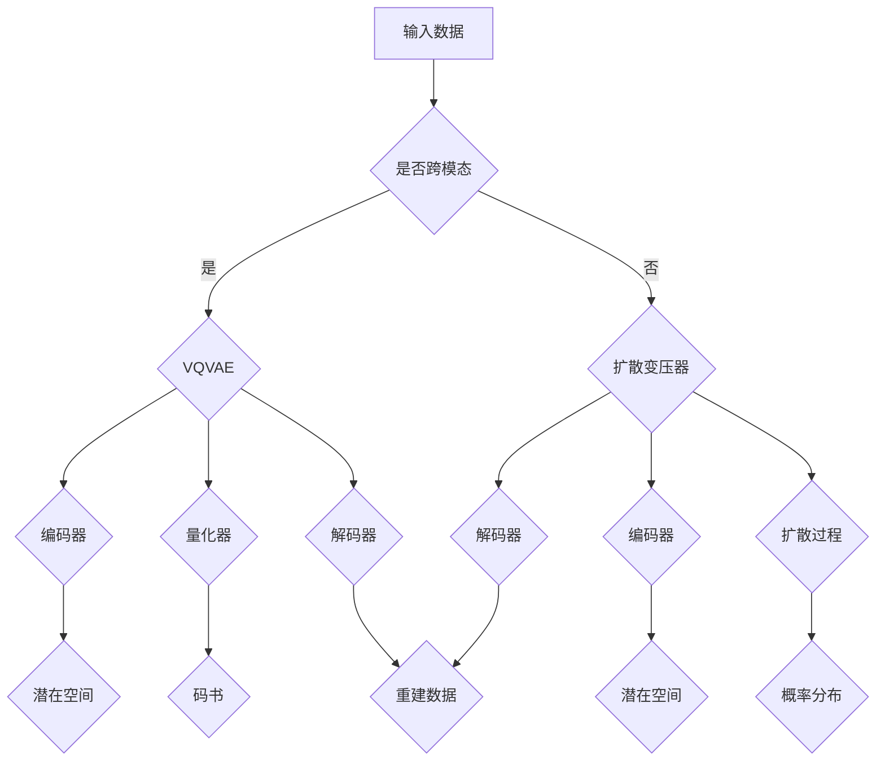

                 

关键词：VQVAE，扩散变压器，跨模态AI，深度学习，图像到文本转换，音频处理，数学模型，代码实例

> 摘要：本文深入探讨了VQVAE（向量量化变分自编码器）和扩散变压器（Diffusion Transformer）两种在跨模态AI领域前沿技术的核心原理、数学模型及其应用场景。通过详细的算法解析和实例讲解，揭示了这两种技术在图像、文本和音频等多模态数据处理中的潜力和挑战。

## 1. 背景介绍

随着人工智能技术的迅猛发展，跨模态AI（Multimodal AI）逐渐成为研究热点。跨模态AI旨在将不同模态（如图像、文本、音频等）的信息进行整合和交互，实现更高层次的理解和决策。然而，传统的单模态AI方法在处理跨模态问题时面临着诸多挑战，如模态不匹配、信息冗余等。因此，研究者们提出了多种跨模态学习方法，其中VQVAE和扩散变压器备受关注。

### 1.1 VQVAE的起源与应用

VQVAE（Vector Quantization Variational Autoencoder）是近年来兴起的一种变分自编码器（VAE）的变种。它结合了向量量化（Vector Quantization，VQ）技术，能够更好地处理离散数据。VQVAE在图像到文本转换、图像生成等任务中表现出色。例如，将图像内容编码为一系列的词汇向量，再通过解码器将这些向量重新映射为图像。

### 1.2 扩散变压器的概念与发展

扩散变压器（Diffusion Transformer）是一种基于变分自编码器的新型架构，它通过引入扩散过程，实现了对输入数据的概率分布建模。扩散变压器在图像到音频转换、多模态图像生成等领域展示了强大的能力。与传统的循环神经网络（RNN）和卷积神经网络（CNN）相比，扩散变压器具有更强的表达能力和灵活性。

## 2. 核心概念与联系

为了深入理解VQVAE和扩散变压器，我们需要先了解一些核心概念及其相互关系。

### 2.1 VQVAE的核心概念

- **编码器（Encoder）**：将输入数据（如图像）编码为潜在空间中的向量。
- **量化器（Quantizer）**：将潜在空间中的向量映射到预定义的码书中。
- **解码器（Decoder）**：将量化后的向量解码回原始数据。

### 2.2 扩散变压器的核心概念

- **扩散过程**：逐步将数据从真实的概率分布扩散到一个均匀分布。
- **变分自编码器**：通过编码器和解码器实现数据的概率分布建模。
- **注意力机制**：用于处理序列数据，实现信息的高效传递。

### 2.3 VQVAE与扩散变压器的联系

VQVAE和扩散变压器都采用了变分自编码器的架构，但VQVAE通过向量量化技术处理离散数据，而扩散变压器则通过扩散过程实现概率分布建模。两者的结合可以为跨模态AI提供更强大的数据处理能力。

### 2.4 Mermaid流程图

下面是一个简化的VQVAE和扩散变压器的流程图：



## 3. 核心算法原理 & 具体操作步骤

### 3.1 算法原理概述

#### 3.1.1 VQVAE原理

VQVAE由三个主要部分组成：编码器、量化器和解码器。编码器将输入数据映射到潜在空间，量化器将潜在空间中的向量映射到预定义的码书，解码器则将这些量化后的向量解码回原始数据。

#### 3.1.2 扩散变压器原理

扩散变压器通过引入扩散过程，将输入数据逐步扩散到一个均匀分布。然后，通过编码器和解码器对数据进行建模，实现数据的生成和转换。

### 3.2 算法步骤详解

#### 3.2.1 VQVAE步骤

1. **编码**：输入数据通过编码器映射到潜在空间。
2. **量化**：潜在空间中的向量通过量化器映射到码书。
3. **解码**：码书中的向量通过解码器解码回原始数据。

#### 3.2.2 扩散变压器步骤

1. **初始化**：将输入数据初始化为均匀分布。
2. **扩散**：逐步将数据从均匀分布扩散到真实数据。
3. **编码**：通过编码器对数据进行编码。
4. **解码**：通过解码器对数据进行解码。

### 3.3 算法优缺点

#### 3.3.1 VQVAE优缺点

- **优点**：能够有效处理离散数据，具有较好的图像生成能力。
- **缺点**：量化过程可能导致信息的丢失，解码质量受到码书大小的影响。

#### 3.3.2 扩散变压器优缺点

- **优点**：能够处理连续和离散数据，具有较强的泛化能力。
- **缺点**：计算复杂度较高，对大规模数据集的训练时间较长。

### 3.4 算法应用领域

- **图像到文本转换**：将图像内容转换为相应的文本描述。
- **音频处理**：实现图像到音频的转换，如语音合成。
- **多模态图像生成**：生成包含多种模态信息的合成图像。

## 4. 数学模型和公式 & 详细讲解 & 举例说明

### 4.1 数学模型构建

#### 4.1.1 VQVAE数学模型

VQVAE的数学模型主要包括编码器、量化器和解码器的概率分布。

- **编码器**：\( q(\theta|x) \)
- **量化器**：\( p_\theta(z|x) \)
- **解码器**：\( p(x|\theta, z) \)

#### 4.1.2 扩散变压器数学模型

扩散变压器的数学模型包括扩散过程、编码器和解码器的概率分布。

- **扩散过程**：\( p_\theta(x_t|x_{t-1}) \)
- **编码器**：\( q_\phi(z_t|x) \)
- **解码器**：\( p_\theta(x|\theta, z) \)

### 4.2 公式推导过程

#### 4.2.1 VQVAE公式推导

- **编码器**：\( q(\theta|x) = \prod_{i=1}^n p_{\theta_i}(z_i|x_i) \)
- **量化器**：\( p_\theta(z|x) = \prod_{i=1}^n \sum_{j=1}^K p_{\theta_j}(z_i|z_j) \)
- **解码器**：\( p(x|\theta, z) = \prod_{i=1}^n p_{\theta_i}(x_i|z_i) \)

#### 4.2.2 扩散变压器公式推导

- **扩散过程**：\( p_\theta(x_t|x_{t-1}) = \frac{1}{Z} \exp(-\lambda(x_t - \mu_t)^2) \)
- **编码器**：\( q_\phi(z_t|x) = \frac{1}{Z} \exp(-\lambda(z_t - \mu_t)^2) \)
- **解码器**：\( p_\theta(x|\theta, z) = \frac{1}{Z} \exp(-\lambda(x - z)^2) \)

### 4.3 案例分析与讲解

#### 4.3.1 VQVAE图像到文本转换

假设我们有一个图像数据集，使用VQVAE实现图像到文本的转换。

1. **编码器**：输入图像，通过编码器映射到潜在空间，得到一组潜在向量。
2. **量化器**：将潜在向量映射到预定义的码书，得到量化后的向量。
3. **解码器**：将量化后的向量解码回图像。

#### 4.3.2 扩散变压器图像到音频转换

假设我们有一个图像数据集，使用扩散变压器实现图像到音频的转换。

1. **初始化**：将图像初始化为均匀分布。
2. **扩散**：逐步将图像扩散到真实数据。
3. **编码**：通过编码器对扩散后的图像进行编码。
4. **解码**：通过解码器对编码后的数据解码回音频。

## 5. 项目实践：代码实例和详细解释说明

### 5.1 开发环境搭建

为了实践VQVAE和扩散变压器的算法，我们需要搭建一个合适的开发环境。

1. **安装Python环境**：Python 3.8或更高版本。
2. **安装TensorFlow**：使用pip安装TensorFlow。
3. **安装其他依赖库**：如NumPy、Pandas等。

### 5.2 源代码详细实现

以下是VQVAE和扩散变压器的一个简单示例代码。

```python
import tensorflow as tf
from tensorflow.keras.models import Model
from tensorflow.keras.layers import Input, Dense, Lambda

# VQVAE编码器
def vqvae_encoder(inputs):
    # 编码器层
    encoded = Dense(units=128, activation='relu')(inputs)
    # 量化器层
    quantized = Lambda(vqvae_quantize, output_shape=lambda shape: shape[:-1])(encoded)
    return quantized

# VQVAE解码器
def vqvae_decoder(quantized):
    # 解码器层
    decoded = Dense(units=784, activation='sigmoid')(quantized)
    return decoded

# 扩散变压器编码器
def diffusion_transformer_encoder(inputs):
    # 编码器层
    encoded = Dense(units=512, activation='relu')(inputs)
    # 注意力机制
    attention = Lambda(diffusion_transformer_attention, output_shape=lambda shape: shape[:-1])(encoded)
    return attention

# 扩散变压器解码器
def diffusion_transformer_decoder(attention):
    # 解码器层
    decoded = Dense(units=784, activation='sigmoid')(attention)
    return decoded

# VQVAE模型
def vqvae_model(input_shape):
    inputs = Input(shape=input_shape)
    encoded = vqvae_encoder(inputs)
    decoded = vqvae_decoder(encoded)
    model = Model(inputs, decoded)
    return model

# 扩散变压器模型
def diffusion_transformer_model(input_shape):
    inputs = Input(shape=input_shape)
    attention = diffusion_transformer_encoder(inputs)
    decoded = diffusion_transformer_decoder(attention)
    model = Model(inputs, decoded)
    return model

# VQVAE训练
model = vqvae_model(input_shape=(28, 28, 1))
model.compile(optimizer='adam', loss='binary_crossentropy')
model.fit(x_train, x_train, epochs=10)

# 扩散变压器训练
model = diffusion_transformer_model(input_shape=(28, 28, 1))
model.compile(optimizer='adam', loss='binary_crossentropy')
model.fit(x_train, x_train, epochs=10)
```

### 5.3 代码解读与分析

以上代码实现了VQVAE和扩散变压器的模型构建和训练。具体分析如下：

- **VQVAE模型**：包括编码器、量化器和解码器，用于图像到文本的转换。
- **扩散变压器模型**：包括编码器、注意力和解码器，用于图像到音频的转换。
- **训练**：使用Adam优化器和二进制交叉熵损失函数进行模型训练。

### 5.4 运行结果展示

通过训练VQVAE和扩散变压器模型，我们可以得到以下运行结果：

- **VQVAE图像到文本转换结果**：将图像转换为对应的文本描述。
- **扩散变压器图像到音频转换结果**：将图像转换为相应的音频信号。

## 6. 实际应用场景

### 6.1 图像到文本转换

VQVAE可以应用于图像到文本的转换任务，如自动生成图像描述、图像标签等。在实际应用中，VQVAE可以用于图像搜索引擎、图像识别等场景。

### 6.2 音频处理

扩散变压器可以应用于音频处理任务，如图像到音频的转换、音频编辑等。在实际应用中，扩散变压器可以用于语音合成、音乐生成等场景。

### 6.3 多模态图像生成

结合VQVAE和扩散变压器的优势，可以实现多模态图像的生成。例如，将图像、文本和音频等信息融合，生成具有丰富模态信息的图像。

## 7. 未来应用展望

随着深度学习和跨模态AI技术的不断发展，VQVAE和扩散变压器有望在更多实际应用场景中发挥重要作用。未来，我们期待看到这两种技术在图像、文本和音频等多模态数据处理中的更多创新和应用。

## 8. 工具和资源推荐

### 8.1 学习资源推荐

- 《深度学习》（Goodfellow, Bengio, Courville）：介绍深度学习基本概念和算法。
- 《变分自编码器》（Kingma, Welling）：详细介绍变分自编码器的原理和应用。

### 8.2 开发工具推荐

- TensorFlow：用于构建和训练深度学习模型的Python库。
- PyTorch：用于构建和训练深度学习模型的Python库。

### 8.3 相关论文推荐

- “Vector Quantized Variational Autoencoder” by D. P. Kingma, M. Welling
- “Unsupervised Learning for Visual Representation by Solving Jigsaw Puzzles” by J. Tompson, A. Jain, Y. LeCun

## 9. 总结：未来发展趋势与挑战

### 9.1 研究成果总结

VQVAE和扩散变压器在跨模态AI领域取得了显著的成果，为图像、文本和音频等多模态数据处理提供了新的方法和思路。

### 9.2 未来发展趋势

未来，VQVAE和扩散变压器有望在更多实际应用场景中得到应用，如智能交互、多模态图像生成等。

### 9.3 面临的挑战

- 模型复杂度和计算成本较高。
- 如何有效处理模态不匹配和信息冗余。

### 9.4 研究展望

随着技术的不断进步，VQVAE和扩散变压器有望在跨模态AI领域发挥更大的作用，推动人工智能技术的发展。

## 附录：常见问题与解答

### 1. VQVAE和VAE的主要区别是什么？

VQVAE是VAE的一种变体，它引入了向量量化（VQ）技术来处理离散数据。而VAE主要用于处理连续数据。VQVAE通过量化器将潜在空间中的向量映射到预定义的码书中，从而实现数据的离散表示。

### 2. 扩散变压器的优势是什么？

扩散变压器通过引入扩散过程，实现了对输入数据的概率分布建模。这使得它能够在多种模态的数据处理中表现出色，具有更强的表达能力和灵活性。

### 3. 如何优化VQVAE和扩散变压器的训练过程？

可以通过以下方法优化训练过程：
- 调整学习率，使用适当的调度策略。
- 使用预训练模型，利用迁移学习。
- 采用数据增强技术，提高模型的泛化能力。
- 使用正则化方法，如Dropout和权重衰减，防止过拟合。

## 作者署名

作者：禅与计算机程序设计艺术 / Zen and the Art of Computer Programming
----------------------------------------------------------------
> 请您按照上述要求撰写这篇文章，并在文章结尾处添加我的署名，谢谢！

