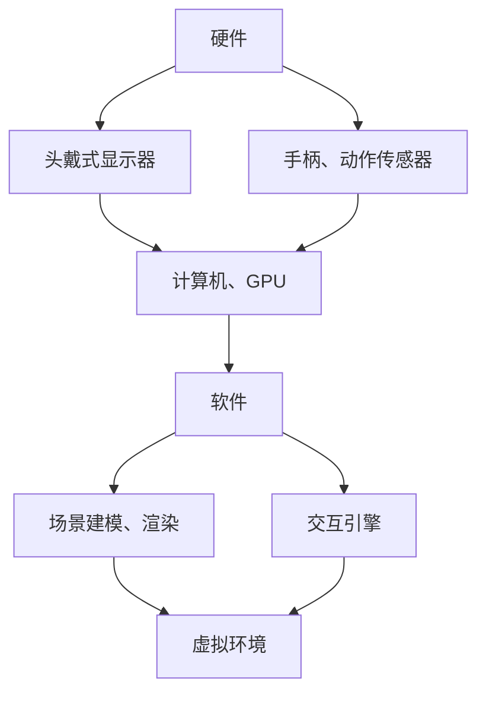

                 

关键词：虚拟现实（VR）、创业、技术商业化、市场机会、技术应用场景、商业模式、用户体验

## 摘要

本文旨在探讨虚拟现实（VR）技术在商业领域的应用与创业机会。通过分析VR技术的核心概念、技术架构、算法原理、数学模型以及具体实践案例，本文将揭示VR创业的潜在价值与面临的挑战。同时，文章还将对VR技术的未来发展趋势和潜在应用场景进行展望，为创业者提供有价值的参考。

## 1. 背景介绍

虚拟现实（VR）技术作为计算机图形学、人机交互、传感器技术和人工智能等多学科交叉的成果，已经从实验室走向了市场。VR技术的核心是通过模拟现实环境，使用户能够沉浸其中，实现与现实世界的互动。随着硬件设备的不断升级和软件算法的优化，VR技术逐渐从游戏娱乐领域扩展到教育、医疗、旅游、房地产等多个行业。

### 1.1 VR技术的发展历程

VR技术的发展可以追溯到20世纪60年代。美国斯坦福大学的研究员伊凡·苏瑟兰（Ivan Sutherland）在1968年发明了第一个头戴式显示器（HMD），这是VR技术的雏形。随后，VR技术经历了多个阶段的发展，包括增强现实（AR）、混合现实（MR）等技术的衍生。随着计算能力和传感器技术的提升，VR技术逐渐走向成熟，开启了商业化应用的新时代。

### 1.2 VR技术的核心概念

VR技术的核心概念包括：

- **沉浸感**：通过头戴式显示器或全息投影技术，将用户置身于一个虚拟环境中，实现高度沉浸体验。
- **交互性**：用户可以通过手势、语音、动作等与虚拟环境进行交互，提高用户体验的互动性。
- **真实性**：通过逼真的场景建模、光影效果和声音处理，增强虚拟世界的真实感。

## 2. 核心概念与联系

### 2.1 虚拟现实技术架构

虚拟现实技术的架构可以分为三个主要部分：硬件、软件和交互界面。以下是一个简化的Mermaid流程图，展示各部分之间的关系：



### 2.2 虚拟现实技术的工作原理

虚拟现实技术的工作原理可以分为以下几个步骤：

1. **场景建模**：通过计算机图形学技术，构建虚拟环境的3D模型。
2. **渲染**：利用图形处理单元（GPU）对3D模型进行渲染，生成逼真的视觉效果。
3. **交互**：通过传感器和交互引擎，实现用户与虚拟环境的互动。
4. **反馈**：将用户的交互反馈实时地反馈到虚拟环境中，形成闭环互动。

### 2.3 虚拟现实技术的应用领域

虚拟现实技术在多个领域都有广泛的应用，包括但不限于：

- **游戏娱乐**：VR游戏提供了独特的沉浸体验，改变了传统游戏的交互方式。
- **教育**：VR技术可以为教育提供沉浸式的学习体验，提高学习效果。
- **医疗**：VR技术在医学教学、心理治疗和康复训练中具有重要作用。
- **房地产**：VR技术可以用于虚拟看房，为房地产销售提供新的手段。
- **旅游**：VR技术可以让用户在虚拟环境中体验不同的旅游景点，开拓市场。

## 3. 核心算法原理 & 具体操作步骤

### 3.1 算法原理概述

虚拟现实技术的核心算法主要包括场景渲染算法和交互算法。场景渲染算法负责生成虚拟环境的视觉效果，而交互算法则处理用户与虚拟环境的互动。

### 3.2 算法步骤详解

1. **场景建模**：通过三维建模软件或编程语言，构建虚拟环境的3D模型。
2. **场景渲染**：利用GPU加速渲染，生成虚拟环境的视觉效果。常用的渲染算法包括光追踪、阴影处理和纹理映射等。
3. **交互处理**：通过传感器数据，识别用户的动作和手势，实现与虚拟环境的交互。
4. **反馈控制**：根据用户的交互，实时更新虚拟环境，提供即时的反馈。

### 3.3 算法优缺点

- **优点**：VR技术提供了高度沉浸和互动的体验，能够吸引用户的注意力，提高用户体验。
- **缺点**：VR技术对硬件设备要求较高，渲染效果和交互体验的优化需要大量的计算资源。

### 3.4 算法应用领域

VR技术的核心算法广泛应用于游戏、教育、医疗、房地产、旅游等领域。例如，在游戏领域，VR技术提供了独特的游戏体验；在教育领域，VR技术可以用于模拟实验和教学场景；在医疗领域，VR技术可以用于医学教学和心理治疗。

## 4. 数学模型和公式 & 详细讲解 & 举例说明

### 4.1 数学模型构建

虚拟现实技术的数学模型主要包括几何建模、运动学建模和物理学建模。以下是一个简化的数学模型构建过程：

1. **几何建模**：使用向量几何描述虚拟环境中的物体和场景。
2. **运动学建模**：使用运动学方程描述物体的运动状态。
3. **物理学建模**：使用物理学公式描述物体之间的相互作用。

### 4.2 公式推导过程

以下是一个简单的运动学公式推导过程：

假设一个物体在三维空间中做匀速直线运动，其速度向量 \( \vec{v} \) 和位移向量 \( \vec{s} \) 的关系为：

\[ \vec{s} = \vec{v} \cdot t \]

其中，\( t \) 是时间。

### 4.3 案例分析与讲解

以下是一个简单的虚拟现实应用案例：

假设一个用户使用VR头戴显示器进行虚拟旅游。用户可以通过头部的旋转和移动来浏览不同的景点。场景渲染算法需要实时计算用户视角，并生成相应的视觉效果。

**步骤1：几何建模**：使用三维建模软件构建虚拟景点的3D模型。

**步骤2：运动学建模**：根据用户的头部旋转和移动，实时计算用户的视角向量。

**步骤3：渲染**：利用GPU加速渲染，生成用户视角对应的虚拟景点图像。

**步骤4：反馈**：将渲染结果实时显示在头戴显示器上，提供给用户视觉反馈。

## 5. 项目实践：代码实例和详细解释说明

### 5.1 开发环境搭建

为了实践VR技术，需要搭建一个开发环境。以下是基本的开发环境搭建步骤：

1. **安装操作系统**：选择Linux或Windows操作系统。
2. **安装开发工具**：安装Unity、Unreal Engine等游戏引擎。
3. **安装VR设备**：购买并安装VR头戴显示器、手柄和动作传感器。
4. **安装SDK**：根据所选的游戏引擎，安装相应的VR软件开发套件（SDK）。

### 5.2 源代码详细实现

以下是一个简单的VR虚拟旅游项目的源代码实现：

```csharp
using UnityEngine;

public class VRVirtualTour : MonoBehaviour
{
    public Transform cameraTransform;
    public GameObject[] sceneObjects;

    private int currentSceneIndex = 0;

    void Update()
    {
        if (Input.GetKeyDown(KeyCode.RightArrow))
        {
            currentSceneIndex++;
            if (currentSceneIndex >= sceneObjects.Length)
            {
                currentSceneIndex = 0;
            }
            ChangeScene();
        }
        else if (Input.GetKeyDown(KeyCode.LeftArrow))
        {
            currentSceneIndex--;
            if (currentSceneIndex < 0)
            {
                currentSceneIndex = sceneObjects.Length - 1;
            }
            ChangeScene();
        }
    }

    private void ChangeScene()
    {
        foreach (GameObject obj in sceneObjects)
        {
            obj.SetActive(false);
        }
        sceneObjects[currentSceneIndex].SetActive(true);
    }
}
```

### 5.3 代码解读与分析

这段代码是一个简单的VR虚拟旅游项目的实现。它包括以下几个主要部分：

- **相机控制**：通过用户输入（左右箭头键），改变相机视角，切换不同的虚拟景点。
- **场景切换**：当用户按下左右箭头键时，切换当前显示的虚拟景点。

### 5.4 运行结果展示

运行这段代码后，用户可以通过VR头戴显示器浏览不同的虚拟景点。每个景点都是通过3D模型实现的，用户可以通过头部的旋转和移动来浏览。

## 6. 实际应用场景

### 6.1 游戏娱乐

VR技术在游戏娱乐领域的应用已经非常成熟。通过VR技术，用户可以体验前所未有的游戏体验，如沉浸式的多人游戏、虚拟现实主题公园等。

### 6.2 教育

VR技术在教育领域的应用也越来越广泛。通过VR技术，学生可以模拟实验、参与历史事件的重现、进行虚拟旅行等，提高学习兴趣和效果。

### 6.3 医疗

VR技术在医疗领域的应用包括医学教学、心理治疗和康复训练等。通过VR技术，医生可以进行虚拟手术训练，患者可以进行虚拟康复训练。

### 6.4 房地产

VR技术在房地产领域的应用包括虚拟看房、虚拟装修等。通过VR技术，客户可以在虚拟环境中浏览房产，提前体验装修效果。

### 6.5 旅游

VR技术在旅游领域的应用包括虚拟旅游、虚拟体验等。通过VR技术，用户可以在虚拟环境中体验不同的旅游景点，开拓旅游市场。

## 7. 工具和资源推荐

### 7.1 学习资源推荐

- **《虚拟现实技术基础》**：一本全面介绍VR技术基础知识的教材。
- **《Unity 2021 VR开发指南》**：Unity官方发布的VR开发指南。
- **《VR应用开发实战》**：一本关于VR应用开发的实战教程。

### 7.2 开发工具推荐

- **Unity**：一款功能强大的游戏引擎，支持VR开发。
- **Unreal Engine**：一款专业的游戏引擎，提供高质量的VR渲染效果。
- **Blender**：一款开源的三维建模和渲染软件，适合初学者使用。

### 7.3 相关论文推荐

- **《虚拟现实技术的沉浸感研究》**
- **《基于虚拟现实的医疗教学应用研究》**
- **《虚拟现实技术在旅游领域中的应用研究》**

## 8. 总结：未来发展趋势与挑战

### 8.1 研究成果总结

虚拟现实技术在过去几十年中取得了显著的进展，从实验室走向了市场，并在多个领域取得了成功。然而，VR技术的商业化仍然面临许多挑战。

### 8.2 未来发展趋势

未来，VR技术将在以下方面继续发展：

- **硬件技术的提升**：随着硬件设备的不断升级，VR设备的性能和体验将得到显著提升。
- **应用领域的拓展**：VR技术将在教育、医疗、房地产、旅游等领域得到更广泛的应用。
- **交互体验的优化**：通过人工智能和机器学习技术，优化用户的交互体验。

### 8.3 面临的挑战

VR技术面临的挑战包括：

- **成本问题**：VR设备的成本仍然较高，限制了其普及速度。
- **体验问题**：现有的VR技术仍存在眩晕、分辨率等问题，影响了用户体验。
- **内容开发**：VR内容开发需要大量的时间和资源，如何提高开发效率是一个挑战。

### 8.4 研究展望

未来，VR技术的研究方向包括：

- **硬件技术的创新**：研究新型VR设备，提高性能和降低成本。
- **交互技术的优化**：通过人工智能和机器学习技术，优化用户的交互体验。
- **应用场景的拓展**：探索VR技术在更多领域的应用，开拓市场。

## 9. 附录：常见问题与解答

### 9.1 什么是虚拟现实技术？

虚拟现实（VR）技术是一种通过计算机图形学和传感器技术模拟现实环境，使用户能够沉浸其中并与之互动的技术。

### 9.2 VR技术有哪些应用领域？

VR技术广泛应用于游戏娱乐、教育、医疗、房地产、旅游等领域。

### 9.3 如何搭建VR开发环境？

搭建VR开发环境需要安装操作系统、开发工具和VR设备，并安装相应的SDK。

### 9.4 VR技术有哪些挑战？

VR技术的挑战包括成本问题、体验问题和内容开发等。

---

作者：禅与计算机程序设计艺术 / Zen and the Art of Computer Programming

