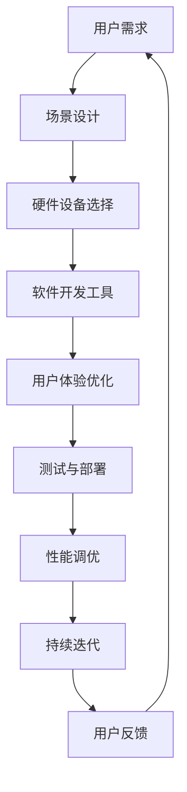

                 

关键词：虚拟现实，应用开发，沉浸式体验，开发工具，技术应用

> 摘要：本文旨在探讨虚拟现实（VR）应用开发的现状、核心概念、算法原理、数学模型、实践案例及其未来发展趋势。通过介绍VR技术的基本原理和开发流程，本文将帮助读者了解如何构建高质量的沉浸式体验。

## 1. 背景介绍

虚拟现实（Virtual Reality，简称VR）是一种通过计算机技术模拟出来的三维环境，用户可以通过特定的设备（如头戴式显示器、手柄等）与这个环境进行互动。自20世纪90年代以来，VR技术经历了快速的发展，逐渐从实验室走向了市场。如今，VR技术已经广泛应用于游戏、教育、医疗、工程等多个领域，带来了前所未有的沉浸式体验。

### 虚拟现实技术的定义与特点

虚拟现实技术是指通过计算机模拟产生一个三维空间，用户可以通过特殊设备如VR头显、传感器等，感知和与这个环境进行交互。其主要特点包括：

- **沉浸感**：用户能够完全沉浸在虚拟环境中，感觉就像身处其中。
- **交互性**：用户可以通过手势、语音、运动等方式与虚拟环境进行互动。
- **多样性**：虚拟现实可以模拟各种场景，从太空到海底，从城市到古代文明，满足用户的多样化需求。

### 虚拟现实的应用领域

虚拟现实技术已广泛应用于以下领域：

- **游戏**：为玩家提供全新的游戏体验，如《Beat Saber》、《VRChat》等。
- **教育**：通过虚拟现实技术，学生可以“走进”历史事件、探索科学现象。
- **医疗**：用于手术模拟、心理治疗等，如《MindMaze》用于中风患者的康复。
- **工程与建筑**：通过虚拟现实技术，设计师和工程师可以在虚拟环境中查看和修改设计方案。

## 2. 核心概念与联系

为了更好地理解虚拟现实应用开发，我们需要掌握一些核心概念和它们之间的联系。以下是关键概念及它们的联系，以及相关的Mermaid流程图。



### 2.1 用户需求分析

用户需求分析是VR应用开发的第一步，它决定了应用的方向和功能。通过市场调研、用户访谈等方式，了解用户对VR应用的需求，包括交互方式、功能模块、使用场景等。

### 2.2 场景设计与规划

场景设计是构建虚拟现实应用的核心。设计师需要根据用户需求，设计出符合实际需求的虚拟环境。这一过程包括场景布局、角色设计、交互逻辑等。

### 2.3 硬件设备选择

硬件设备选择直接影响用户体验。根据应用场景，选择合适的VR头显、手柄、传感器等设备。例如，对于游戏应用，可能需要高性能的VR头显和手柄；对于教育应用，则可能更注重设备的稳定性和易用性。

### 2.4 软件开发工具

软件开发工具是VR应用开发的基石。常用的VR开发平台包括Unity、Unreal Engine等。这些平台提供了丰富的开发工具和资源，帮助开发者快速构建VR应用。

### 2.5 用户体验优化

用户体验优化是确保应用质量的关键。开发者需要不断测试、调整，优化应用的交互逻辑、视觉效果、性能等，以提供更好的用户体验。

### 2.6 测试与部署

在开发完成后，需要进行全面的测试，包括功能测试、性能测试、兼容性测试等。确保应用在多种设备和平台上都能正常运行。测试通过后，应用即可部署到目标平台。

### 2.7 性能调优

性能调优是提升应用性能的关键。开发者需要通过优化代码、调整资源配置等方式，提高应用的运行效率，确保流畅的用户体验。

### 2.8 持续迭代

VR应用开发是一个持续迭代的过程。通过收集用户反馈，不断优化应用，提高用户满意度。

### 2.9 用户反馈与改进

用户反馈是改进应用的重要依据。开发者需要积极收集用户反馈，分析用户需求，优化应用功能。

## 3. 核心算法原理 & 具体操作步骤

### 3.1 算法原理概述

虚拟现实应用开发中，核心算法主要包括渲染算法、运动跟踪算法、交互算法等。以下将分别介绍这些算法的原理。

#### 3.1.1 渲染算法

渲染算法是虚拟现实应用中负责生成图像的核心算法。常见的渲染算法包括光追踪、体积渲染、实时渲染等。

- **光追踪**：通过模拟光线传播，生成真实感强的图像。
- **体积渲染**：用于渲染透明或半透明物体，如云层、烟雾等。
- **实时渲染**：在实时环境中生成图像，用于游戏、教育等应用。

#### 3.1.2 运动跟踪算法

运动跟踪算法用于实时跟踪用户的运动和姿态，以更新虚拟环境的视角。常见的运动跟踪算法包括：

- **惯性测量单元（IMU）**：通过加速度计、陀螺仪等传感器，实时跟踪用户运动。
- **计算机视觉**：利用摄像头和深度传感器，实现用户姿态的识别和跟踪。

#### 3.1.3 交互算法

交互算法是虚拟现实应用中实现用户与虚拟环境交互的核心。常见的交互算法包括：

- **手势识别**：通过识别用户手势，实现与虚拟环境的交互。
- **语音识别**：通过语音命令，实现与虚拟环境的交互。
- **触觉反馈**：通过触觉设备，提供实时的触觉反馈，增强用户体验。

### 3.2 算法步骤详解

#### 3.2.1 渲染算法步骤

1. **场景建模**：根据设计需求，建立虚拟环境的3D模型。
2. **光照模拟**：设置场景中的光源，进行光照模拟。
3. **纹理映射**：将纹理贴图映射到3D模型上，增强视觉效果。
4. **渲染输出**：将渲染后的图像输出到VR头显，生成虚拟环境。

#### 3.2.2 运动跟踪算法步骤

1. **传感器数据采集**：通过IMU或计算机视觉传感器，采集用户运动和姿态数据。
2. **数据处理**：对采集到的数据进行滤波、插值等处理，提高数据准确性。
3. **姿态更新**：根据处理后的数据，更新虚拟环境的视角。
4. **实时反馈**：将更新后的视角实时输出到VR头显，提供流畅的用户体验。

#### 3.2.3 交互算法步骤

1. **手势识别**：
   - **数据采集**：通过摄像头或深度传感器，采集用户手势数据。
   - **特征提取**：对采集到的手势数据进行特征提取，如轮廓、手势形状等。
   - **分类识别**：利用机器学习算法，对提取的特征进行分类识别，确定用户手势类型。

2. **语音识别**：
   - **语音信号处理**：对采集到的语音信号进行预处理，如去噪、增强等。
   - **特征提取**：提取语音信号中的声学特征，如频谱特征、倒谱特征等。
   - **语音识别**：利用深度学习算法，对提取的特征进行语音识别，转换为文本。

3. **触觉反馈**：
   - **触觉信号生成**：根据用户操作，生成相应的触觉信号。
   - **触觉输出**：通过触觉设备，将触觉信号输出给用户。

### 3.3 算法优缺点

#### 3.3.1 渲染算法

**优点**：真实感强，能够呈现高质量的视觉效果。

**缺点**：计算量大，对硬件性能要求高；实时渲染困难，难以处理复杂场景。

#### 3.3.2 运动跟踪算法

**优点**：实时性强，能够准确跟踪用户运动。

**缺点**：在复杂环境下，跟踪精度可能下降；对传感器依赖较高。

#### 3.3.3 交互算法

**优点**：提供了丰富的交互方式，增强用户体验。

**缺点**：手势识别、语音识别等算法可能存在误识别；触觉反馈设备成本较高。

### 3.4 算法应用领域

#### 3.4.1 游戏应用

在游戏应用中，渲染算法和交互算法尤为重要。高质量的渲染效果和丰富的交互方式，为玩家提供了沉浸式的游戏体验。

#### 3.4.2 教育应用

在教育应用中，运动跟踪算法和交互算法有助于实现虚拟课堂、虚拟实验等功能，提高教学效果。

#### 3.4.3 医疗应用

在医疗应用中，渲染算法和交互算法有助于实现手术模拟、康复训练等功能，提高医疗技术水平。

#### 3.4.4 工程应用

在工程应用中，虚拟现实技术可用于建筑设计、机械设计等领域，提高设计效率和精度。

## 4. 数学模型和公式 & 详细讲解 & 举例说明

### 4.1 数学模型构建

在虚拟现实应用开发中，数学模型是构建虚拟环境的重要工具。以下是几个常用的数学模型及其构建方法。

#### 4.1.1 3D模型构建

3D模型构建是虚拟现实应用的基础。常用的3D模型构建方法包括：

- **多边形模型**：使用多边形（如三角形、四边形）构建3D模型，适用于大多数虚拟现实应用。
- **曲面模型**：使用曲面（如圆柱面、球面）构建3D模型，适用于一些特殊场景。

#### 4.1.2 光照模型

光照模型用于模拟虚拟环境中的光照效果。常用的光照模型包括：

- **真实感光照模型**：如光追踪、全局光照等，用于生成真实感强的图像。
- **简化的光照模型**：如基本光照模型、Phong光照模型等，用于快速渲染图像。

#### 4.1.3 运动模型

运动模型用于模拟虚拟环境中的物体运动。常用的运动模型包括：

- **刚体运动模型**：用于模拟刚体物体的运动，如直线运动、旋转运动等。
- **柔性体运动模型**：用于模拟柔性物体的运动，如弹簧、绳索等。

### 4.2 公式推导过程

以下分别介绍几个常用数学模型的公式推导过程。

#### 4.2.1 3D模型构建公式

**多边形模型构建公式**：

- **顶点坐标**：\( V = (x, y, z) \)
- **面方程**：\( A \cdot X + B \cdot Y + C \cdot Z + D = 0 \)，其中 \( A, B, C, D \) 为面方程的系数。

**曲面模型构建公式**：

- **圆柱面方程**：\( (x - x_c)^2 + (y - y_c)^2 = r^2 \)，其中 \( x_c, y_c \) 为圆柱面中心坐标，\( r \) 为圆柱面半径。
- **球面方程**：\( (x - x_c)^2 + (y - y_c)^2 + (z - z_c)^2 = r^2 \)，其中 \( x_c, y_c, z_c \) 为球面中心坐标，\( r \) 为球面半径。

#### 4.2.2 光照模型公式

**真实感光照模型**：

- **光迹方程**：\( R(t) = O + tD \)，其中 \( O \) 为光线起点，\( D \) 为光线方向。
- **散射方程**：\( L(t) = \int_{\Omega} f_r(\omega_i, \omega_o) L_i(\omega_i) \cos \theta_i d\omega_i \)，其中 \( f_r \) 为反射率，\( L_i \) 为入射光强度，\( \theta_i \) 为入射角。

**简化的光照模型**：

- **基本光照模型**：
  - **漫反射**：\( L_d = k_d \cdot I \cdot \cos \theta \)，其中 \( k_d \) 为漫反射系数，\( I \) 为入射光强度，\( \theta \) 为入射角。
  - **镜面反射**：\( L_s = k_s \cdot I \cdot \cos \theta \)，其中 \( k_s \) 为镜面反射系数。

**Phong光照模型**：

- **漫反射**：\( L_d = k_d \cdot (I \cdot N) \)，其中 \( N \) 为表面法线。
- **镜面反射**：\( L_s = k_s \cdot (I \cdot R)^p \)，其中 \( R \) 为反射光方向，\( p \) 为高光指数。

#### 4.2.3 运动模型公式

**刚体运动模型**：

- **位移公式**：\( \vec{r}(t) = \vec{r}_0 + \vec{v}t \)，其中 \( \vec{r}_0 \) 为初始位置，\( \vec{v} \) 为速度。
- **旋转公式**：\( \vec{r}(t) = \vec{r}_0 + (\vec{R}_0 + \vec{\omega} \times \vec{t})t \)，其中 \( \vec{R}_0 \) 为旋转中心，\( \vec{\omega} \) 为角速度。

**柔性体运动模型**：

- **弹簧模型**：\( F = -kx \)，其中 \( F \) 为弹簧力，\( k \) 为弹簧系数，\( x \) 为弹簧压缩或拉伸量。
- **绳索模型**：\( T = mg \)，其中 \( T \) 为绳索张力，\( m \) 为绳索质量，\( g \) 为重力加速度。

### 4.3 案例分析与讲解

以下通过一个简单的案例，讲解如何使用数学模型构建虚拟环境。

#### 4.3.1 案例背景

假设我们要构建一个简单的虚拟房间，房间的墙壁是圆柱面，地面是矩形平面。房间内有一个人，我们要实现人的运动和房间内光源的光照效果。

#### 4.3.2 模型构建

1. **3D模型构建**：

- **圆柱面墙壁**：使用圆柱面方程构建，半径为2米，高度为3米。
- **矩形平面地面**：使用矩形方程构建，边长为4米。

2. **光照模型**：

- **光源位置**：在房间的正上方，距离地面2米。
- **光照强度**：设置为中等强度。

3. **运动模型**：

- **人的位置**：初始位置在房间中心，速度为0。
- **人的运动**：在房间内进行随机运动，速度为0.5米/秒。

#### 4.3.3 数学模型应用

1. **3D模型构建**：

- **圆柱面墙壁**：

  - **圆柱面方程**：\( (x - 0)^2 + (y - 0)^2 = 2^2 \)
  - **高度**：3米

- **矩形平面地面**：

  - **矩形方程**：\( x = 0, y = 0, z = 0 \)
  - **边长**：4米

2. **光照模型**：

- **光源位置**：

  - **光源坐标**：\( (0, 0, 2) \)
  - **光照强度**：0.5

3. **运动模型**：

- **人的位置**：

  - **初始位置**：\( (2, 2, 0) \)
  - **速度**：\( (0.5, 0.5, 0) \)

#### 4.3.4 案例实现

1. **3D模型构建**：

- **圆柱面墙壁**：

  ```mermaid
  graph TD
  A[圆柱面] --> B{参数}
  B --> C[半径：2米]
  B --> D[高度：3米]
  ```

- **矩形平面地面**：

  ```mermaid
  graph TD
  E[矩形平面] --> F{参数}
  F --> G[边长：4米]
  ```

2. **光照模型**：

- **光源位置**：

  ```mermaid
  graph TD
  H[光源] --> I{参数}
  I --> J[坐标：(0, 0, 2)]
  I --> K[光照强度：0.5]
  ```

3. **运动模型**：

- **人的位置**：

  ```mermaid
  graph TD
  L[人] --> M{参数}
  M --> N[初始位置：(2, 2, 0)]
  M --> O[速度：(0.5, 0.5, 0)]
  ```

通过上述数学模型的应用，我们可以构建出一个简单的虚拟房间，并实现人的运动和房间内光源的光照效果。

## 5. 项目实践：代码实例和详细解释说明

### 5.1 开发环境搭建

在进行虚拟现实应用开发之前，我们需要搭建一个合适的开发环境。以下是开发环境搭建的步骤：

1. **安装Unity**：从Unity官网下载并安装Unity Hub，然后通过Unity Hub安装Unity引擎和相关插件。
2. **安装VR设备驱动**：根据你的VR设备，安装相应的驱动程序。
3. **安装Unity插件**：安装用于VR开发的插件，如Unity VR SDK、Oculus SDK等。

### 5.2 源代码详细实现

以下是一个简单的虚拟现实应用示例，展示如何使用Unity开发一个VR游戏。

```csharp
using UnityEngine;

public class VRGame : MonoBehaviour
{
    // 渲染设置
    public Material material;
    public Color color;

    // 渲染帧率
    private float frameRate = 60.0f;

    // 渲染函数
    private void OnRenderImage(RenderTexture src, RenderTexture dest)
    {
        // 设置材质颜色
        material.color = color;

        // 绘制立方体
        Graphics.DrawCube(new Vector3(0, 1, 0), 0.5f, material);

        // 复制源纹理到目标纹理
        Graphics.Blit(src, dest);
    }

    // 更新函数
    private void Update()
    {
        // 获取用户输入
        float moveSpeed = 0.1f;
        float rotationSpeed = 0.05f;

        // 移动和旋转
        transform.position += Input.GetAxis("Horizontal") * moveSpeed * Vector3.right;
        transform.position += Input.GetAxis("Vertical") * moveSpeed * Vector3.forward;
        transform.Rotate(Vector3.up, Input.GetAxis("Mouse X") * rotationSpeed);
        transform.Rotate(Vector3.left, Input.GetAxis("Mouse Y") * rotationSpeed);
    }
}
```

### 5.3 代码解读与分析

1. **渲染设置**：在Unity中，渲染设置通常通过材质（Material）实现。我们定义了一个名为`material`的材质对象，用于控制立方体的颜色。
2. **渲染函数**：`OnRenderImage`函数是Unity中的渲染钩子，用于在每一帧绘制图形。在这个函数中，我们首先设置材质的颜色，然后使用`Graphics.DrawCube`函数绘制一个立方体。
3. **更新函数**：`Update`函数是Unity中的更新钩子，用于处理每一帧的输入和更新。在这个函数中，我们使用`Input.GetAxis`获取用户的输入，然后根据输入计算移动和旋转的速度，更新立方体的位置和旋转角度。

### 5.4 运行结果展示

运行上述代码后，我们可以在VR头显中看到一个简单的VR游戏场景，玩家可以通过移动和旋转来控制立方体的移动和旋转。这个简单的例子展示了如何使用Unity开发一个基本的VR应用。

## 6. 实际应用场景

虚拟现实技术在各个领域的实际应用场景如下：

### 6.1 游戏

在游戏领域，虚拟现实技术为玩家带来了全新的游戏体验。例如，《Beat Saber》是一款流行的VR音乐游戏，玩家需要用虚拟的剑切割虚拟的方块，同时跟随音乐的节奏。这种沉浸式的游戏体验深受玩家喜爱。

### 6.2 教育

在教育领域，虚拟现实技术可以为学生提供更生动的学习体验。例如，通过虚拟现实技术，学生可以“走进”历史事件，如古埃及、古希腊等，亲身体验历史场景。此外，虚拟现实还可以用于模拟科学实验、化学实验等，提高学生的学习兴趣和动手能力。

### 6.3 医疗

在医疗领域，虚拟现实技术可以用于手术模拟、康复训练等。例如，医生可以通过虚拟现实技术进行手术模拟，提高手术技能；中风患者可以通过虚拟现实技术进行康复训练，改善运动功能。此外，虚拟现实还可以用于心理治疗，如恐惧症治疗、焦虑症治疗等。

### 6.4 工程

在工程领域，虚拟现实技术可以用于建筑设计、机械设计等。通过虚拟现实技术，设计师可以在虚拟环境中查看和修改设计方案，提高设计效率和精度。此外，虚拟现实还可以用于工程仿真，如机械运动仿真、流体动力学仿真等，帮助工程师更好地理解和优化设计方案。

## 7. 工具和资源推荐

### 7.1 学习资源推荐

- **《虚拟现实技术基础》**：一本全面介绍虚拟现实技术的书籍，适合初学者入门。
- **《Unity VR开发实战》**：一本关于Unity VR开发的实战指南，适合有一定编程基础的读者。
- **VRChat**：一个开源的VR社交平台，提供了丰富的VR内容，适合学习VR社交应用开发。

### 7.2 开发工具推荐

- **Unity**：一款功能强大的游戏引擎，支持VR开发。
- **Unreal Engine**：一款专业的游戏引擎，提供了丰富的VR开发工具和资源。
- **Unity VR SDK**：Unity官方提供的VR开发工具包，提供了大量的VR功能接口。
- **Oculus SDK**：Oculus官方提供的VR开发工具包，支持Oculus VR设备。

### 7.3 相关论文推荐

- **《Virtual Reality: The Third Era of Human-Computer Interaction》**：一篇关于虚拟现实技术发展的综述论文。
- **《A Survey of Virtual Reality Applications》**：一篇关于虚拟现实应用领域的综述论文。
- **《Real-Time Rendering》**：一本关于实时渲染技术的经典教材。

## 8. 总结：未来发展趋势与挑战

### 8.1 研究成果总结

虚拟现实技术近年来取得了显著的研究成果。在渲染算法、运动跟踪算法、交互算法等方面，研究者们提出了许多新的算法和方法，提高了虚拟现实技术的性能和体验。同时，虚拟现实技术在游戏、教育、医疗、工程等领域的应用也日益广泛，取得了良好的效果。

### 8.2 未来发展趋势

未来，虚拟现实技术将继续快速发展，主要趋势包括：

- **性能提升**：随着硬件技术的进步，虚拟现实设备的性能将进一步提高，为用户提供更高质量的沉浸式体验。
- **应用拓展**：虚拟现实技术将在更多领域得到应用，如虚拟旅游、虚拟购物、虚拟会议等。
- **人工智能结合**：虚拟现实技术与人工智能技术的结合，将带来更智能的交互体验和更丰富的虚拟环境。

### 8.3 面临的挑战

尽管虚拟现实技术取得了显著成果，但仍然面临一些挑战：

- **硬件成本**：高性能的VR设备价格较高，限制了其在大众市场的普及。
- **眩晕问题**：虚拟现实技术可能引起用户的眩晕感，影响用户体验。
- **内容创作**：高质量的虚拟现实内容创作需要较高的技术门槛和成本，限制了内容的丰富程度。
- **隐私与安全**：虚拟现实应用可能涉及用户的隐私数据，如何保障用户隐私和安全是一个重要问题。

### 8.4 研究展望

为了解决上述挑战，未来研究方向包括：

- **低成本高性能硬件**：研发低成本、高性能的VR设备，降低用户使用门槛。
- **优化渲染算法**：提高渲染算法的效率，减少眩晕感，提高用户体验。
- **智能交互**：结合人工智能技术，实现更智能、更自然的交互体验。
- **隐私保护**：加强虚拟现实应用中的隐私保护措施，保障用户隐私安全。

通过不断的研究和技术创新，虚拟现实技术有望在未来实现更广泛的应用，为人类带来更加美好的数字生活。

## 9. 附录：常见问题与解答

### 9.1 虚拟现实技术是什么？

虚拟现实（VR）是一种通过计算机技术模拟出来的三维环境，用户可以通过特定的设备（如头戴式显示器、手柄等）与这个环境进行互动。

### 9.2 虚拟现实技术的核心算法有哪些？

虚拟现实技术的核心算法包括渲染算法、运动跟踪算法和交互算法。渲染算法用于生成虚拟环境的图像；运动跟踪算法用于实时跟踪用户的运动和姿态；交互算法用于实现用户与虚拟环境的交互。

### 9.3 如何搭建虚拟现实开发环境？

搭建虚拟现实开发环境的基本步骤包括：

1. 安装Unity或Unreal Engine等游戏引擎。
2. 安装VR设备驱动程序。
3. 安装Unity VR SDK或Oculus SDK等VR开发工具包。

### 9.4 虚拟现实技术在哪些领域有应用？

虚拟现实技术广泛应用于游戏、教育、医疗、工程、旅游、娱乐等领域。

### 9.5 虚拟现实技术有哪些挑战？

虚拟现实技术面临的挑战包括硬件成本、眩晕问题、内容创作难度、隐私与安全等。

