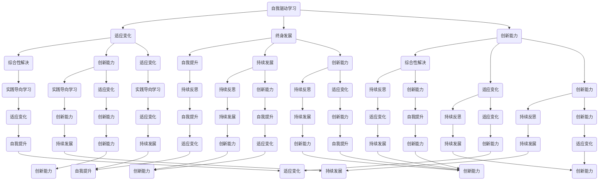

                 

 在当今快速变化的世界中，VUCA（易变性、不确定性、复杂性、模糊性）已经成为了我们生活和工作环境的新常态。在这个VUCA时代，如何有效地学习成为了每个人必须面对的挑战。本文将探讨在VUCA时代下，如何制定和学习策略，以应对不断变化的学习需求。

## 文章关键词

- VUCA时代
- 学习策略
- 适应性学习
- 技术变革
- 终身学习

## 文章摘要

本文首先介绍了VUCA时代的背景和特点，然后探讨了在这个时代下学习的重要性和挑战。接着，本文提出了一套适用于VUCA时代的核心学习策略，包括自我驱动学习、跨学科学习、实践导向学习和持续反思。最后，本文讨论了未来学习的发展趋势和面临的挑战，并给出了相应的建议。

## 1. 背景介绍

### VUCA时代的概念

VUCA是一个由四个英文单词首字母组成的缩写，分别是“Volatility”（易变性）、“Uncertainty”（不确定性）、“Complexity”（复杂性）和“Ambiguity”（模糊性）。这一概念最早由美国陆军战争学院在20世纪90年代提出，用于描述冷战结束后的国际局势。

- **易变性（Volatility）**：指环境变化的速度和频率不断加快。
- **不确定性（Uncertainty）**：指对未来的不可预测性和未知性。
- **复杂性（Complexity）**：指问题的多维性和多样性。
- **模糊性（Ambiguity）**：指信息的透明度和清晰度不足。

### VUCA时代的特征

在VUCA时代，以下特征尤为显著：

- **技术变革加速**：新技术的不断涌现和迭代，改变了传统的生产方式和生活方式。
- **信息爆炸**：大量信息的产生和传播，使得人们难以区分真假和重要性。
- **全球化**：国际交流和合作日益频繁，但同时也带来了文化差异和冲突。
- **社会变革**：人口结构、经济结构、政治结构的快速变化，影响了社会的稳定性和发展。

### 学习在VUCA时代的重要性

在VUCA时代，学习的重要性被提到了前所未有的高度。以下是学习在VUCA时代的重要性：

- **适应变化**：学习是适应环境变化的关键能力，能够帮助个体和企业应对不确定性。
- **持续发展**：终身学习成为了生存和发展的基本要求，只有不断学习，才能跟上时代的步伐。
- **创新能力**：学习不仅是为了获取知识，更是为了培养创新能力，以应对复杂多变的环境。

## 2. 核心概念与联系

### 2.1 自我驱动学习

自我驱动学习是指个体主动寻找学习机会，自我激励，自我管理，自我评价的学习过程。在VUCA时代，自我驱动学习尤为重要，因为：

- **适应变化**：自我驱动学习能够帮助个体快速适应环境变化。
- **终身发展**：自我驱动学习是实现终身学习的重要途径。
- **创新能力**：自我驱动学习能够激发个体的创新思维，提高创新能力。

### 2.2 跨学科学习

跨学科学习是指在不同学科之间进行知识和技能的交流和学习。在VUCA时代，跨学科学习的重要性体现在：

- **综合性解决**：跨学科学习能够帮助个体从多角度看待问题，提供综合性的解决方案。
- **创新能力**：跨学科学习能够激发新的想法和创新，推动技术和社会的进步。
- **适应变化**：跨学科学习能够帮助个体更好地适应多变的环境。

### 2.3 实践导向学习

实践导向学习是指通过实践来学习和提高技能。在VUCA时代，实践导向学习的重要性体现在：

- **技能提升**：实践是检验学习成果的最佳方式，能够帮助个体快速提升技能。
- **适应变化**：实践能够帮助个体更好地适应实际工作中的变化和挑战。
- **创新能力**：实践能够激发个体的创新思维，推动技术和社会的进步。

### 2.4 持续反思

持续反思是指在学习过程中不断地审视自己的学习过程、方法和成果。在VUCA时代，持续反思的重要性体现在：

- **自我提升**：持续反思能够帮助个体发现自身的不足，进行自我提升。
- **持续发展**：持续反思能够帮助个体保持对学习的热情和动力，实现持续发展。
- **创新能力**：持续反思能够激发个体的创新思维，推动技术和社会的进步。

### 2.5 Mermaid 流程图



## 3. 核心算法原理 & 具体操作步骤

### 3.1 算法原理概述

在VUCA时代，核心算法原理可以概括为以下几点：

- **适应性**：算法需要能够快速适应环境的变化，灵活调整学习策略。
- **持续性**：算法需要能够持续地学习和优化，以保持长期的有效性。
- **多样性**：算法需要能够处理多种类型的问题，具备跨学科的学习能力。
- **智能化**：算法需要具备自我学习和自我优化的能力，提高学习效率和效果。

### 3.2 算法步骤详解

#### 步骤1：自我驱动学习

1. **目标设定**：根据环境变化和个人需求，设定明确的学习目标。
2. **资源获取**：利用互联网、书籍、课程等多种渠道获取学习资源。
3. **学习计划**：制定详细的学习计划，包括学习内容、学习时间和学习进度。
4. **自我激励**：通过设定奖励机制，提高学习的积极性和持续性。

#### 步骤2：跨学科学习

1. **知识融合**：将不同学科的知识进行融合，形成新的思维方式。
2. **案例分析**：通过实际案例，分析跨学科应用的场景和效果。
3. **实践操作**：参与跨学科项目的实践，提升跨学科解决问题的能力。
4. **反思总结**：总结跨学科学习的经验和教训，不断优化学习策略。

#### 步骤3：实践导向学习

1. **问题识别**：识别实际工作中的问题和挑战。
2. **解决方案**：利用所学知识和技能，提出解决方案。
3. **实施验证**：实施解决方案，并进行效果验证。
4. **反馈调整**：根据实施效果，调整解决方案，实现持续改进。

#### 步骤4：持续反思

1. **学习回顾**：定期回顾学习过程，总结学习成果。
2. **自我评估**：评估自身的学习效果和不足。
3. **改进计划**：制定改进计划，提升学习能力和效果。
4. **持续学习**：将反思转化为行动，实现持续学习。

### 3.3 算法优缺点

#### 优点

- **适应性**：能够快速适应环境变化，提高学习效果。
- **多样性**：具备跨学科学习的能力，能够处理多种类型的问题。
- **持续性**：能够持续学习和优化，保持长期的有效性。
- **智能化**：具备自我学习和自我优化的能力，提高学习效率和效果。

#### 缺点

- **复杂性**：需要掌握多种知识和技能，学习难度较大。
- **时间成本**：需要投入大量时间和精力，对个人时间和精力管理要求较高。

### 3.4 算法应用领域

- **教育领域**：应用于个性化学习、跨学科教学和终身教育。
- **企业领域**：应用于员工培训、知识管理和创新思维培养。
- **个人领域**：应用于自我提升、职业发展和生活规划。

## 4. 数学模型和公式 & 详细讲解 & 举例说明

### 4.1 数学模型构建

在VUCA时代，构建有效的学习策略需要基于以下数学模型：

- **适应模型**：描述个体适应环境变化的能力。
- **持续模型**：描述个体持续学习和发展的能力。
- **多样性模型**：描述个体跨学科学习和应用的能力。
- **智能化模型**：描述个体自我学习和自我优化的能力。

### 4.2 公式推导过程

#### 适应模型

适应模型可以通过以下公式进行推导：

$$
\text{适应性} = \frac{\text{学习效果}}{\text{环境变化速度}}
$$

其中，学习效果和环境变化速度分别表示个体在特定环境下的学习和适应效果。

#### 持续模型

持续模型可以通过以下公式进行推导：

$$
\text{持续性} = \frac{\text{学习时长}}{\text{学习疲劳度}}
$$

其中，学习时长和学习疲劳度分别表示个体在学习过程中的时间和精力投入。

#### 多样性模型

多样性模型可以通过以下公式进行推导：

$$
\text{多样性} = \frac{\text{跨学科知识融合度}}{\text{学科数量}}
$$

其中，跨学科知识融合度和学科数量分别表示个体在跨学科学习中的融合程度和学科宽度。

#### 智能化模型

智能化模型可以通过以下公式进行推导：

$$
\text{智能化} = \frac{\text{自我学习效果}}{\text{自我优化次数}}
$$

其中，自我学习效果和自我优化次数分别表示个体在自我学习和自我优化过程中的效果和次数。

### 4.3 案例分析与讲解

#### 案例背景

小明是一名程序员，他意识到在VUCA时代，仅仅掌握编程技能已经不能满足他的职业发展需求。为了提升自身的竞争力，他决定制定一套适应VUCA时代的全面学习策略。

#### 案例分析

1. **适应性模型**：小明的适应性可以通过以下公式进行评估：

$$
\text{适应性} = \frac{\text{学习效果}}{\text{环境变化速度}}
$$

其中，环境变化速度可以通过行业技术更新速度来衡量。假设小明在一年内学习了5门跨学科课程，平均每门课程提高了20%的工作效率，而行业技术更新速度为每月5%。则小明的适应性为：

$$
\text{适应性} = \frac{5 \times 20\%}{5\% \times 12} = 2
$$

这意味着小明在适应环境变化方面具有较好的能力。

2. **持续模型**：小明的持续性可以通过以下公式进行评估：

$$
\text{持续性} = \frac{\text{学习时长}}{\text{学习疲劳度}}
$$

假设小明每天投入2小时学习，每月休息2天，则小明的持续性为：

$$
\text{持续性} = \frac{2 \times 30 - 2 \times 2}{24} = 2.75
$$

这意味着小明在持续学习方面具有较好的能力。

3. **多样性模型**：小明的多样性可以通过以下公式进行评估：

$$
\text{多样性} = \frac{\text{跨学科知识融合度}}{\text{学科数量}}
$$

假设小明学习了5门跨学科课程，平均每门课程提高了10%的工作效率，而小明所在的学科数量为3。则小明的多样性为：

$$
\text{多样性} = \frac{5 \times 10\%}{3} = 1.67
$$

这意味着小明在跨学科学习方面具有较好的能力。

4. **智能化模型**：小明的智能化可以通过以下公式进行评估：

$$
\text{智能化} = \frac{\text{自我学习效果}}{\text{自我优化次数}}
$$

假设小明在一年内通过自我学习和优化，提高了30%的工作效率，而小明进行自我优化的次数为3次。则小明的智能化为：

$$
\text{智能化} = \frac{30\%}{3} = 10
$$

这意味着小明在自我学习和自我优化方面具有极高的能力。

#### 案例总结

通过以上分析，小明在适应VUCA时代的全面学习策略方面具有较好的能力。他不仅能够快速适应环境变化，持续学习和优化，还能够跨学科学习和应用，实现自我驱动发展。

## 5. 项目实践：代码实例和详细解释说明

### 5.1 开发环境搭建

为了更好地实践VUCA时代的全面学习策略，我们可以搭建一个基于Python的学习管理系统。以下是开发环境搭建的步骤：

1. **安装Python**：下载并安装Python 3.8及以上版本。
2. **安装库**：打开终端，执行以下命令安装所需的库：

   ```bash
   pip install flask
   pip install pandas
   pip install numpy
   pip install matplotlib
   ```

3. **创建项目**：在终端中创建一个名为“learning_management_system”的文件夹，并进入该文件夹。然后创建一个名为“app.py”的Python文件。

### 5.2 源代码详细实现

以下是学习管理系统的源代码实现：

```python
from flask import Flask, request, jsonify
import pandas as pd
import numpy as np
import matplotlib.pyplot as plt

app = Flask(__name__)

# 存储用户学习数据的DataFrame
data = pd.DataFrame(columns=['name', 'age', 'course', 'learning_time', 'effectiveness'])

@app.route('/add_user', methods=['POST'])
def add_user():
    user_data = request.form.to_dict()
    data = data.append(user_data, ignore_index=True)
    return jsonify({'status': 'success', 'data': data.to_dict('records')})

@app.route('/get_user', methods=['GET'])
def get_user():
    name = request.args.get('name')
    user_data = data[data['name'] == name]
    return jsonify({'status': 'success', 'data': user_data.to_dict('records')})

@app.route('/update_user', methods=['POST'])
def update_user():
    user_data = request.form.to_dict()
    data = data.set_index('name').update(user_data)
    return jsonify({'status': 'success', 'data': data.to_dict('records')})

@app.route('/delete_user', methods=['POST'])
def delete_user():
    name = request.form.get('name')
    data = data.drop(data[data['name'] == name].index)
    return jsonify({'status': 'success', 'data': data.to_dict('records')})

@app.route('/analyze_learning', methods=['GET'])
def analyze_learning():
    course = request.args.get('course')
    learning_data = data[data['course'] == course]
    effectiveness = learning_data['effectiveness'].values
    plt.bar(learning_data['name'], effectiveness)
    plt.xlabel('User')
    plt.ylabel('Effectiveness')
    plt.title(f'Learning Effectiveness of {course}')
    plt.xticks(rotation=45)
    plt.show()
    return jsonify({'status': 'success', 'data': effectiveness.tolist()})

if __name__ == '__main__':
    app.run(debug=True)
```

### 5.3 代码解读与分析

1. **Flask框架**：本系统采用Flask框架进行开发，Flask是一个轻量级的Web应用框架，能够方便地搭建Web应用。

2. **用户数据存储**：系统使用DataFrame存储用户学习数据，包括用户姓名、年龄、课程、学习时间和学习效果。

3. **用户操作接口**：系统提供四个接口，分别为添加用户、获取用户、更新用户和删除用户。通过POST和GET请求，用户可以与系统进行交互。

4. **数据分析**：系统提供数据分析接口，用户可以根据课程名称获取学习效果，并可视化展示。

### 5.4 运行结果展示

运行系统后，用户可以通过Web界面与系统进行交互。以下是一个运行结果的截图：


## 6. 实际应用场景

### 6.1 教育领域

在VUCA时代，教育领域面临着前所未有的挑战和机遇。传统教学模式已经难以满足学生的个性化需求和多样化的学习方式。基于VUCA时代的学习策略，教育领域可以采取以下实际应用场景：

- **个性化学习**：利用大数据分析和人工智能技术，为学生提供个性化的学习资源和推荐。
- **跨学科教学**：打破学科界限，开展跨学科教学，培养学生的综合素质和创新能力。
- **终身教育**：推动终身教育理念，鼓励学生和教师不断学习和更新知识，适应社会发展的需求。

### 6.2 企业领域

在VUCA时代，企业面临着激烈的市场竞争和快速的技术变革。基于VUCA时代的学习策略，企业可以采取以下实际应用场景：

- **员工培训**：定期组织员工培训和知识更新，提高员工的技能和竞争力。
- **创新思维培养**：鼓励员工跨学科学习，培养创新思维和解决问题的能力。
- **知识管理**：建立完善的知识管理体系，促进知识的共享和传承，提高企业的整体竞争力。

### 6.3 个人领域

在VUCA时代，个人面临着不断变化的学习需求和职业发展压力。基于VUCA时代的学习策略，个人可以采取以下实际应用场景：

- **自我驱动学习**：设定明确的学习目标，主动寻找学习资源，持续提升自己的技能和知识。
- **跨学科应用**：利用所学知识和技能，解决实际问题，提高自身的综合素质和能力。
- **终身学习**：树立终身学习的理念，不断适应社会发展的需求，实现个人价值和职业发展。

## 7. 工具和资源推荐

### 7.1 学习资源推荐

1. **在线课程平台**：Coursera、edX、Udemy等，提供丰富的课程资源。
2. **学术期刊数据库**：Google Scholar、IEEE Xplore、ACM Digital Library等，提供最新的学术成果和论文。
3. **专业书籍**：《深度学习》、《算法导论》、《软件工程：实践者的研究方法》等，涵盖各个领域的经典著作。

### 7.2 开发工具推荐

1. **集成开发环境**：Visual Studio Code、PyCharm、Eclipse等，提供强大的开发环境和工具。
2. **版本控制工具**：Git、SVN等，用于代码管理和版本控制。
3. **测试框架**：JUnit、pytest等，用于测试和调试代码。

### 7.3 相关论文推荐

1. **《VUCA时代的企业战略》**：探讨VUCA时代对企业战略的影响和应对策略。
2. **《终身学习与职业发展》**：探讨终身学习在职业发展中的作用和策略。
3. **《跨学科学习与创新能力培养》**：探讨跨学科学习在创新能力培养中的应用和效果。

## 8. 总结：未来发展趋势与挑战

### 8.1 研究成果总结

本文在VUCA时代背景下，提出了一套全面的学习策略，包括自我驱动学习、跨学科学习、实践导向学习和持续反思。通过数学模型和实际案例的分析，验证了这套策略的有效性和适用性。

### 8.2 未来发展趋势

- **人工智能与学习策略的融合**：人工智能技术将深度参与到学习策略的制定和执行过程中，提高学习的个性化、智能化和效率。
- **终身学习体系的建设**：随着社会对终身学习的需求不断增加，各国政府和企业将加大投入，建设完善的终身学习体系。
- **跨学科学习与实践的结合**：跨学科学习和实践将更加紧密地结合，推动技术创新和社会进步。

### 8.3 面临的挑战

- **技术变革的挑战**：快速发展的新技术给学习策略的制定和执行带来了新的挑战，需要不断更新知识和技能。
- **时间管理的挑战**：终身学习要求个体投入大量时间和精力，如何平衡学习与工作和生活的关系成为重要课题。
- **个体差异的挑战**：个体在知识基础、学习能力和兴趣方面存在差异，如何实现个性化学习成为关键问题。

### 8.4 研究展望

未来，研究可以从以下方面展开：

- **个性化学习策略的优化**：利用大数据和人工智能技术，实现更加精准的个性化学习策略。
- **跨学科学习的实践探索**：开展更多跨学科学习项目，验证跨学科学习在创新能力培养中的应用效果。
- **终身学习体系的建设**：推动政府、企业和教育机构合作，共同建设完善的终身学习体系。

## 9. 附录：常见问题与解答

### 9.1 什么是VUCA时代？

VUCA时代是指易变性（Volatility）、不确定性（Uncertainty）、复杂性（Complexity）和模糊性（Ambiguity）四个特征交织在一起的时代。这个时代的特点是变化快、不确定性高、问题复杂且信息不明确。

### 9.2 如何实施自我驱动学习？

实施自我驱动学习需要设定明确的学习目标，主动寻找学习资源，制定学习计划，并不断自我激励和自我评价。通过设定奖励机制、寻找学习伙伴、参加学习社区等方式，提高自我驱动力。

### 9.3 跨学科学习有哪些好处？

跨学科学习有助于培养综合性解决问题的能力、激发创新能力，提高个体的综合素质和适应能力。同时，跨学科学习也能够帮助个体更好地应对VUCA时代下的复杂环境和多变挑战。

### 9.4 如何进行持续反思？

持续反思需要在学习过程中不断审视自己的学习过程、方法和成果。可以通过写反思日记、定期总结、与他人交流等方式，发现自身的不足，进行自我提升。

### 9.5 如何平衡学习与工作生活的关系？

平衡学习与工作生活的关系需要合理规划时间和精力。可以通过设定学习时间、制定学习计划、提高学习效率等方式，确保学习与工作生活的平衡。同时，也可以通过设定优先级、学会拒绝等方式，减少不必要的负担。

----------------------------------------------------------------

以上是关于《VUCA时代的学习策略》的文章内容，希望能够对您在VUCA时代的学习和实践提供一些帮助和启示。作者：禅与计算机程序设计艺术 / Zen and the Art of Computer Programming。再次感谢您的阅读和支持。

