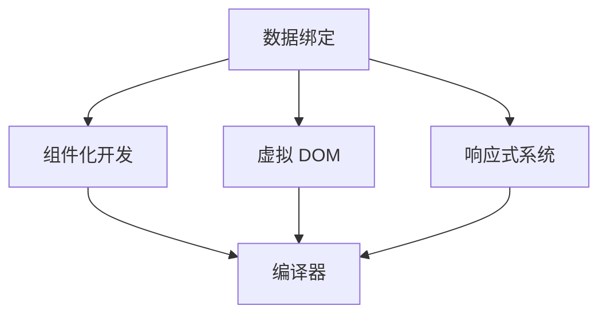

                 

关键词：Vue.js、渐进式框架、JavaScript、前端开发、组件化、双向绑定、数据驱动、开发者体验、生态系统

> 摘要：Vue.js 作为一款渐进式 JavaScript 框架，凭借其简洁、高效和灵活的特点，已经成为前端开发领域的重要工具。本文将深入探讨 Vue.js 的核心优势，包括渐进式设计、组件化开发、双向绑定机制以及丰富的生态系统，帮助开发者更好地理解和利用 Vue.js。

## 1. 背景介绍

### Vue.js 的起源与发展

Vue.js 是由前 Google 前端工程师尤雨溪（Evan You）于 2014 年创建的。最初，Vue.js 是作为一个轻量级的视图层库诞生的，目的是简化前端开发中视图与数据绑定的操作。随着时间的推移，Vue.js 逐渐发展成为一个功能丰富、易于扩展的渐进式框架。

Vue.js 的发展历程可以分为几个关键阶段：

- **1.0 版本**：Vue.js 1.0 在 2015 年发布，引入了双向绑定、虚拟 DOM 等核心概念，标志着 Vue.js 开始受到广泛关注。

- **2.0 版本**：Vue.js 2.0 于 2016 年发布，采用全新核心，引入了组件化思想，使开发者可以更方便地进行模块化开发。

- **3.0 版本**：Vue.js 3.0 于 2020 年发布，引入了基于 Proxy 的响应式系统、Composition API 等新技术，进一步提升了框架的性能和灵活性。

### Vue.js 在前端开发中的地位

Vue.js 目前已经成为前端开发领域的一股重要力量。根据市场份额调研，Vue.js 是当前最受欢迎的前端框架之一，其用户群体遍布全球。Vue.js 在国内前端开发者中的受欢迎程度尤其突出，许多大型企业和初创公司都在使用 Vue.js 进行项目开发。

Vue.js 的优势在于其渐进式设计，使得开发者可以根据项目需求逐步引入 Vue.js 的各种功能，而无需一次性承担整个框架的重量。这种设计思想使得 Vue.js 成为了一个灵活、高效的前端开发工具，得到了广大开发者的青睐。

## 2. 核心概念与联系

### Vue.js 的核心概念

Vue.js 的核心概念主要包括：

- **数据绑定**：Vue.js 通过双向绑定机制实现了视图与数据的自动同步，减少了开发者手动操作 DOM 的负担。

- **组件化开发**：Vue.js 支持组件化开发，通过定义组件来复用代码，提高了项目的可维护性。

- **虚拟 DOM**：Vue.js 使用虚拟 DOM 来实现高效的视图更新，通过对比虚拟 DOM 和实际 DOM 的差异，只更新需要更新的部分，提升了性能。

### Vue.js 的架构

Vue.js 的架构设计简洁明了，主要包括以下几个方面：

- **响应式系统**：Vue.js 的响应式系统基于数据劫持和依赖收集，实现了对数据的自动更新。

- **虚拟 DOM**：虚拟 DOM 是一个轻量级的 JavaScript 对象，用于表示实际 DOM 树的结构。Vue.js 通过虚拟 DOM 实现高效的视图更新。

- **编译器**：Vue.js 的编译器负责将模板编译为渲染函数，使得开发者可以以声明式的方式编写视图。

### Mermaid 流程图

以下是 Vue.js 核心概念和架构的 Mermaid 流程图：



## 3. 核心算法原理 & 具体操作步骤

### 3.1 算法原理概述

Vue.js 的核心算法主要包括响应式系统和虚拟 DOM 算法。

- **响应式系统**：Vue.js 使用观察者模式实现响应式系统。在数据变更时，通过依赖收集机制收集所有依赖该数据的渲染函数，并触发更新。

- **虚拟 DOM 算法**：Vue.js 使用虚拟 DOM 算法实现高效的视图更新。虚拟 DOM 是一个轻量级的 JavaScript 对象，用于表示实际 DOM 树的结构。Vue.js 通过对比虚拟 DOM 和实际 DOM 的差异，只更新需要更新的部分，从而提升性能。

### 3.2 算法步骤详解

#### 3.2.1 响应式系统

1. **数据劫持**：Vue.js 使用 Object.defineProperty() 方法对数据进行劫持，监听数据的变更。

2. **依赖收集**：当数据变更时，Vue.js 会触发依赖收集，收集所有依赖该数据的渲染函数。

3. **派发更新**：收集到依赖后，Vue.js 会触发更新，执行渲染函数。

#### 3.2.2 虚拟 DOM 算法

1. **创建虚拟 DOM**：Vue.js 编译模板，生成渲染函数，并创建虚拟 DOM 对象。

2. **比较虚拟 DOM**：Vue.js 对比新旧虚拟 DOM 对象，找出差异。

3. **更新实际 DOM**：根据虚拟 DOM 的差异，更新实际 DOM 树。

### 3.3 算法优缺点

#### 优点

- **数据绑定**：Vue.js 的双向绑定机制使得开发者无需手动操作 DOM，降低了开发难度。

- **虚拟 DOM**：虚拟 DOM 算法实现了高效的视图更新，提升了性能。

- **组件化开发**：Vue.js 支持组件化开发，提高了代码的可维护性和复用性。

#### 缺点

- **虚拟 DOM**：虚拟 DOM 算法引入了一定的性能开销，相对于直接操作 DOM，虚拟 DOM 可能会降低性能。

- **模板编译**：Vue.js 的模板编译过程可能需要一定的时间，对于大型项目，模板编译可能会成为性能瓶颈。

### 3.4 算法应用领域

Vue.js 适用于各种前端开发场景，尤其适合大型应用和复杂交互的开发。以下是一些常见的应用领域：

- **Web 应用程序**：Vue.js 适用于构建 Web 应用程序，具有快速开发、高性能和丰富的组件生态系统。

- **移动端应用**：Vue.js 适用于移动端应用开发，可以通过编译器将代码编译为 iOS 和 Android 平台的 Native 代码。

- **企业级应用**：Vue.js 在企业级应用开发中也有广泛应用，例如中后台管理系统、电商平台等。

## 4. 数学模型和公式 & 详细讲解 & 举例说明

### 4.1 数学模型构建

Vue.js 的响应式系统可以看作是一个图结构，其中每个节点表示一个数据变量，每个变量都有一个对应的观察者列表，记录所有依赖该变量的渲染函数。

### 4.2 公式推导过程

设 \(V\) 表示变量集合，\(O\) 表示观察者集合，\(R\) 表示依赖关系集合。则响应式系统的数学模型可以表示为：

\[ R = \{ (v, o) | v \in V, o \in O, v \text{ 依赖 } o \} \]

当数据变更时，Vue.js 会触发依赖收集，将变更的数据更新到观察者列表中。设 \(U\) 表示更新集合，则更新过程可以表示为：

\[ U = \{ (v, u) | v \in V, u \in U, v \text{ 被更新 } u \} \]

### 4.3 案例分析与讲解

假设有一个简单的 Vue.js 应用，包含一个数字变量 `count`，以及一个渲染函数 `displayCount`，用于显示数字变量。

1. **数据初始化**：

```javascript
const count = 0;
```

2. **依赖收集**：

当 `count` 变量被创建时，Vue.js 会自动收集依赖它的渲染函数 `displayCount`。

3. **数据变更**：

```javascript
count = 1;
```

当 `count` 变量变更时，Vue.js 会触发依赖收集，更新观察者列表。

4. **渲染更新**：

Vue.js 会根据更新集合 `U`，重新执行渲染函数 `displayCount`，更新视图。

```html
<div>{{ count }}</div>
```

## 5. 项目实践：代码实例和详细解释说明

### 5.1 开发环境搭建

1. **安装 Node.js**：

下载并安装 Node.js，确保版本在 10.0.0 以上。

2. **安装 Vue CLI**：

通过 npm 安装 Vue CLI：

```shell
npm install -g @vue/cli
```

3. **创建新项目**：

```shell
vue create my-vue-app
```

### 5.2 源代码详细实现

1. **项目结构**：

```shell
my-vue-app/
|-- src/
|   |-- assets/
|   |-- components/
|   |-- views/
|   |-- App.vue
|   |-- main.js
```

2. **组件代码**：

```html
<!-- src/components/HelloWorld.vue -->
<template>
  <div>
    <h1>{{ msg }}</h1>
  </div>
</template>

<script>
export default {
  name: 'HelloWorld',
  props: {
    msg: String
  }
}
</script>
```

3. **应用主文件**：

```javascript
// src/main.js
import Vue from 'vue'
import App from './App.vue'

new Vue({
  el: '#app',
  render: h => h(App)
})
```

4. **应用入口**：

```html
<!-- src/App.vue -->
<template>
  <div id="app">
    <hello-world msg="Vue.js 优势：渐进式 JavaScript 框架"/>
  </div>
</template>

<script>
import HelloWorld from './components/HelloWorld.vue'

export default {
  name: 'App',
  components: {
    HelloWorld
  }
}
</script>
```

### 5.3 代码解读与分析

1. **组件化开发**：

在 Vue.js 中，组件是代码复用的基本单位。通过定义组件，可以将功能模块化，提高代码的可维护性。

2. **数据绑定**：

在组件中，通过 `props` 接收外部数据，并通过 `{{ msg }}` 实现数据绑定，显示组件的属性。

3. **应用主文件**：

在主文件中，通过 `new Vue()` 实例化 Vue 应用，并设置 `el` 属性绑定到 HTML 元素，通过 `render` 函数设置应用的根组件。

### 5.4 运行结果展示

在命令行中执行 `npm run serve`，启动 Vue.js 应用，在浏览器中访问 `http://localhost:8080/`，可以看到以下页面：

```html
<!DOCTYPE html>
<html>
  <head>
    <meta charset="utf-8" />
    <script src="/src/main.js"></script>
    <title>Hello World</title>
  </head>
  <body>
    <div id="app">
      <h1>Hello World</h1>
    </div>
  </body>
</html>
```

## 6. 实际应用场景

### 6.1 企业级应用

Vue.js 适用于构建企业级应用，例如中后台管理系统、电商平台等。Vue.js 的组件化开发和双向绑定机制使得开发者可以更快速地实现复杂的功能，提高开发效率。

### 6.2 移动端应用

Vue.js 可以通过编译器将代码编译为 iOS 和 Android 平台的 Native 代码，适用于移动端应用开发。Vue.js 的虚拟 DOM 算法和组件化开发使得移动端应用可以拥有高性能的用户体验。

### 6.3 个人项目

Vue.js 适用于个人项目开发，例如博客、个人主页等。Vue.js 的简单易用和丰富的组件库使得开发者可以更快速地搭建项目，专注于业务逻辑的实现。

### 6.4 未来应用展望

随着 Vue.js 不断迭代更新，其性能和功能将得到进一步提升。未来，Vue.js 在前端开发领域仍将发挥重要作用，有望在更多领域得到应用，如物联网、WebAssembly 等。

## 7. 工具和资源推荐

### 7.1 学习资源推荐

- 《Vue.js 官方文档》：Vue.js 官方文档是学习 Vue.js 的最佳资源，包含了 Vue.js 的详细教程和 API 文档。

- 《Vue.js 源码解析》：这本书深入剖析了 Vue.js 的源码，帮助开发者理解 Vue.js 的内部工作原理。

### 7.2 开发工具推荐

- Vue CLI：Vue CLI 是 Vue.js 官方提供的脚手架工具，用于快速搭建 Vue.js 项目。

- Vue Devtools：Vue Devtools 是 Vue.js 官方提供的开发工具，用于调试 Vue.js 应用。

### 7.3 相关论文推荐

- 《Vue.js 3.0：基于 Proxy 的响应式系统》：该论文介绍了 Vue.js 3.0 的响应式系统，基于 Proxy 的实现原理。

- 《Vue.js 的虚拟 DOM 算法》：该论文深入分析了 Vue.js 的虚拟 DOM 算法，以及其优化策略。

## 8. 总结：未来发展趋势与挑战

### 8.1 研究成果总结

Vue.js 作为一款渐进式 JavaScript 框架，凭借其简洁、高效和灵活的特点，已经成为前端开发领域的重要工具。Vue.js 的核心优势在于组件化开发、双向绑定机制和虚拟 DOM 算法，这些技术为开发者提供了更好的开发体验和更高的性能。

### 8.2 未来发展趋势

随着 Vue.js 的不断迭代更新，其性能和功能将得到进一步提升。未来，Vue.js 在前端开发领域仍将发挥重要作用，有望在更多领域得到应用，如物联网、WebAssembly 等。

### 8.3 面临的挑战

尽管 Vue.js 具有诸多优势，但仍然面临一些挑战。例如，虚拟 DOM 算法引入了一定的性能开销，可能对大型项目产生负面影响。此外，Vue.js 的生态系统仍在不断发展，某些功能可能不够完善。

### 8.4 研究展望

为了解决上述挑战，Vue.js 的开发团队将继续优化虚拟 DOM 算法，提高性能。同时，Vue.js 还将不断完善其生态系统，提供更多的开发工具和资源，以满足开发者多样化的需求。

## 9. 附录：常见问题与解答

### Q：Vue.js 与其他前端框架相比，有哪些优势？

A：Vue.js 的优势主要体现在以下几个方面：

- **渐进式框架**：Vue.js 是一个渐进式框架，开发者可以根据项目需求逐步引入 Vue.js 的各种功能，无需一次性承担整个框架的重量。

- **数据绑定**：Vue.js 的双向绑定机制减少了开发者手动操作 DOM 的负担，提高了开发效率。

- **虚拟 DOM**：Vue.js 的虚拟 DOM 算法实现了高效的视图更新，提升了性能。

- **组件化开发**：Vue.js 支持组件化开发，提高了代码的可维护性和复用性。

### Q：Vue.js 是否支持路由和状态管理？

A：是的，Vue.js 支持路由和状态管理。

- **路由**：Vue.js 使用 Vue Router 作为路由管理工具，支持单页面应用（SPA）的开发。

- **状态管理**：Vue.js 使用 Vuex 作为状态管理工具，用于管理应用的状态。

### Q：Vue.js 是否支持服务端渲染（SSR）？

A：是的，Vue.js 支持服务端渲染（SSR）。Vue Server Renderer 是 Vue.js 的服务端渲染插件，用于将 Vue.js 应用渲染为服务器端 HTML。

## 结语

Vue.js 作为一款渐进式 JavaScript 框架，凭借其简洁、高效和灵活的特点，已经成为前端开发领域的重要工具。本文从 Vue.js 的起源与发展、核心概念与联系、核心算法原理、数学模型与公式、项目实践、实际应用场景、工具和资源推荐、未来发展趋势与挑战以及常见问题与解答等方面，全面介绍了 Vue.js 的优势和应用。希望本文能为广大开发者提供有价值的参考和启示。作者：禅与计算机程序设计艺术 / Zen and the Art of Computer Programming。

