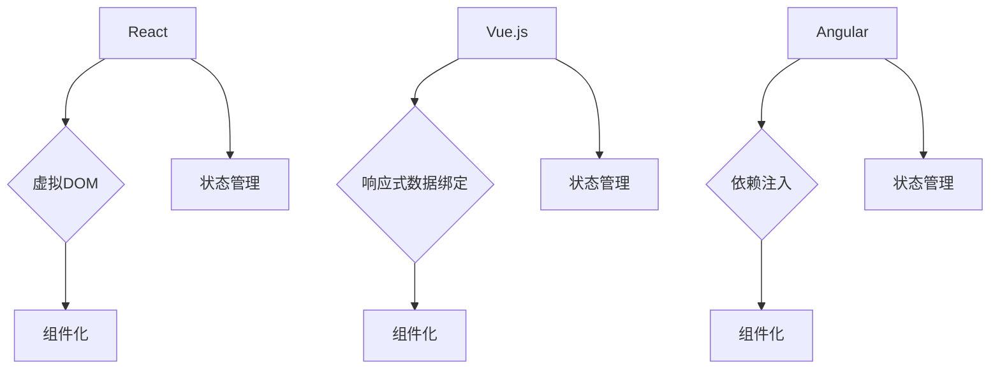

                 

### 关键词 Keywords
- Web前端框架
- React
- Vue.js
- Angular
- 前端开发
- 框架选择
- 性能优化

<|assistant|>### 摘要 Abstract
本文将深入探讨Web前端框架的选择问题，从React、Vue.js、Angular三大主流框架出发，详细分析它们的特点、优缺点以及适用场景。通过对前端开发中面临的挑战和需求的探讨，帮助读者更好地选择适合自己的Web前端框架，以提高开发效率和项目性能。

## 1. 背景介绍

在Web开发领域，前端框架的选择一直是一个备受关注的话题。随着互联网的快速发展，Web应用的需求和复杂度不断增加，开发者面临着越来越多的挑战。前端框架作为一种解决复杂度问题的工具，应运而生。

前端框架的出现，主要是为了解决以下几个问题：
1. **组件化开发**：将UI界面拆分成可复用的组件，提高代码的可维护性和可复用性。
2. **状态管理**：统一管理应用状态，解决组件间状态共享的问题。
3. **异步编程**：提供更简便的异步编程方式，解决回调地狱问题。
4. **路由管理**：简化路由配置，提高页面切换的流畅度。

目前，市场上最流行的前端框架主要包括React、Vue.js和Angular。它们各有特色，适用于不同的开发场景。本文将详细分析这三款框架，帮助开发者根据需求选择最合适的框架。

## 2. 核心概念与联系

### 2.1. 框架定义

Web前端框架是一种基于JavaScript的库或框架，用于构建单页面应用（SPA）或动态网站。它们提供了丰富的API和工具，帮助开发者简化开发过程，提高开发效率。

### 2.2. 核心概念

- **组件化**：将UI界面拆分成可复用的组件，实现代码的模块化和可维护性。
- **虚拟DOM**：React的核心概念，通过虚拟DOM提高页面的渲染性能。
- **响应式数据绑定**：Vue.js的数据绑定机制，实现数据和视图的自动同步。
- **依赖注入**：Angular的依赖注入机制，实现组件间的解耦。

### 2.3. 架构联系

以下是React、Vue.js、Angular的核心架构联系：



## 3. 核心算法原理 & 具体操作步骤

### 3.1. 算法原理概述

Web前端框架的核心算法主要包括虚拟DOM、响应式数据绑定和依赖注入。

- **虚拟DOM**：React通过虚拟DOM实现高效的页面渲染。当状态发生变化时，React首先构建一个虚拟DOM树，然后与实际DOM树进行比较，找出差异并更新实际的DOM树。
- **响应式数据绑定**：Vue.js通过响应式数据绑定实现数据和视图的自动同步。当数据发生变化时，Vue.js会自动更新视图，反之亦然。
- **依赖注入**：Angular通过依赖注入实现组件间的解耦。开发者可以通过注入器（Injector）注入组件所需的依赖，从而实现组件的独立性和可维护性。

### 3.2. 算法步骤详解

#### 3.2.1. 虚拟DOM

1. 数据变化：当组件的状态发生变化时，React首先更新状态。
2. 构建虚拟DOM：React根据最新的状态构建一个新的虚拟DOM树。
3. 比较虚拟DOM：React将新的虚拟DOM树与上一次的虚拟DOM树进行比较，找出差异。
4. 更新实际DOM：React根据比较结果更新实际的DOM树。

#### 3.2.2. 响应式数据绑定

1. 数据变化：当组件的数据发生变化时，Vue.js将数据变化通知到视图。
2. 视图更新：Vue.js根据数据变化更新视图。

#### 3.2.3. 依赖注入

1. 定义依赖：组件在构造函数中定义所需的依赖。
2. 注入依赖：Angular的注入器（Injector）将依赖注入到组件中。
3. 使用依赖：组件在生命周期方法中使用注入的依赖。

### 3.3. 算法优缺点

#### 虚拟DOM

优点：
- 提高页面渲染性能：虚拟DOM减少了实际的DOM操作，从而提高页面渲染性能。
- 易于调试：虚拟DOM提供了可预测的渲染过程，方便开发者调试。

缺点：
- 学习成本：虚拟DOM的实现相对复杂，开发者需要掌握其原理。
- 体积较大：虚拟DOM相关的库体积较大，可能影响加载速度。

#### 响应式数据绑定

优点：
- 简化数据绑定：开发者无需手动处理数据和视图的同步，提高开发效率。
- 易于维护：响应式数据绑定使得组件的数据和逻辑更加解耦，便于维护。

缺点：
- 性能问题：在大量数据绑定场景下，响应式数据绑定可能带来性能问题。

#### 依赖注入

优点：
- 实现组件解耦：依赖注入使得组件间的依赖关系更加明确，便于维护和扩展。
- 提高测试性：依赖注入使得组件更容易进行单元测试。

缺点：
- 学习成本：依赖注入的实现相对复杂，开发者需要掌握其原理。

### 3.4. 算法应用领域

- **虚拟DOM**：适用于页面渲染性能要求较高的场景，如大型单页面应用。
- **响应式数据绑定**：适用于数据绑定较为频繁的场景，如实时数据展示。
- **依赖注入**：适用于需要高度解耦和可维护性的组件，如大型复杂应用。

## 4. 数学模型和公式 & 详细讲解 & 举例说明

### 4.1. 数学模型构建

假设有一个Web应用，其中包含n个组件，每个组件的状态变化会导致虚拟DOM树的重构。设虚拟DOM树的深度为d，每次状态变化导致虚拟DOM树的重构次数为r，每次虚拟DOM树重构的耗时为t。则整个应用的状态变化导致的总耗时为：

\[ T = n \times r \times t \]

### 4.2. 公式推导过程

根据上述数学模型，我们可以推导出以下公式：

\[ T = n \times r \times t \]

其中，n表示组件个数，r表示每次状态变化导致虚拟DOM树重构的次数，t表示每次虚拟DOM树重构的耗时。

### 4.3. 案例分析与讲解

假设一个包含10个组件的Web应用，每次状态变化导致虚拟DOM树重构的次数为2，每次虚拟DOM树重构的耗时为5ms。根据上述公式，整个应用的状态变化导致的总耗时为：

\[ T = 10 \times 2 \times 5 = 100 \text{ms} \]

这意味着，当应用的状态频繁变化时，虚拟DOM的性能优化至关重要。开发者可以通过减少组件个数、优化状态更新策略等方式提高虚拟DOM的性能。

## 5. 项目实践：代码实例和详细解释说明

### 5.1. 开发环境搭建

1. 安装Node.js（版本要求：12.0.0以上）。
2. 安装npm（版本要求：6.0.0以上）。
3. 创建一个新的React项目：

   ```shell
   npx create-react-app my-app
   ```

4. 进入项目目录：

   ```shell
   cd my-app
   ```

### 5.2. 源代码详细实现

1. **组件化开发**

   在`src`目录下创建一个名为`Counter`的组件：

   ```jsx
   // src/Counter.js
   import React, { useState } from 'react';

   const Counter = () => {
     const [count, setCount] = useState(0);

     const increment = () => {
       setCount(count + 1);
     };

     const decrement = () => {
       setCount(count - 1);
     };

     return (
       <div>
         <h1>计数器：{count}</h1>
         <button onClick={increment}>增加</button>
         <button onClick={decrement}>减少</button>
       </div>
     );
   };

   export default Counter;
   ```

2. **状态管理**

   在`src`目录下创建一个名为`App`的组件，用于管理全局状态：

   ```jsx
   // src/App.js
   import React from 'react';
   import Counter from './Counter';

   const App = () => {
     return (
       <div>
         <Counter />
       </div>
     );
   };

   export default App;
   ```

### 5.3. 代码解读与分析

1. **组件化开发**

   在上述代码中，`Counter`组件负责渲染计数器和两个按钮。通过使用`useState`钩子，我们实现了计数器的状态管理。这种组件化的开发方式使得代码更加模块化，易于维护和复用。

2. **状态管理**

   `App`组件负责渲染`Counter`组件。在这里，我们使用了函数组件，并通过`App`组件管理全局状态。这种状态管理方式使得组件间的状态共享变得更加简单。

### 5.4. 运行结果展示

1. 启动开发服务器：

   ```shell
   npm start
   ```

2. 打开浏览器，访问`http://localhost:3000`，即可看到计数器的界面。点击“增加”和“减少”按钮，计数器的数值会相应地增加或减少。

## 6. 实际应用场景

### 6.1. 大型单页面应用

大型单页面应用（SPA）通常具有丰富的交互和复杂的状态管理需求。在这种情况下，React和Vue.js都是很好的选择。React以其高效的虚拟DOM和丰富的生态系统而著称，Vue.js则以其简洁的语法和良好的性能优化策略而受到开发者喜爱。

### 6.2. 实时数据展示

在需要实时数据展示的场景中，Vue.js的响应式数据绑定机制能够提供更好的性能优化。例如，股票行情、实时天气等应用，通过Vue.js的数据绑定机制，可以实现数据的实时更新，提高用户体验。

### 6.3. 大型企业级应用

大型企业级应用通常需要高度解耦和可维护性。Angular以其依赖注入机制和严格的类型检查而受到企业开发者的青睐。Angular提供了丰富的工具和库，帮助开发者构建复杂的企业级应用。

### 6.4. 未来应用展望

随着Web技术的不断发展，前端框架也在不断演进。未来，前端框架将更加注重性能优化、开发效率和用户体验。以下是一些未来应用展望：

1. **渐进式增强**：前端框架将支持渐进式增强，使得开发者可以根据需求选择框架的核心功能，逐步实现应用的功能。
2. **跨平台开发**：前端框架将支持跨平台开发，使得开发者可以更方便地构建移动端、桌面端和Web端的多平台应用。
3. **人工智能集成**：前端框架将集成人工智能技术，为开发者提供更智能的开发工具和体验。

## 7. 工具和资源推荐

### 7.1. 学习资源推荐

- **React官方文档**：[https://reactjs.org/docs/getting-started.html](https://reactjs.org/docs/getting-started.html)
- **Vue.js官方文档**：[https://vuejs.org/v2/guide/](https://vuejs.org/v2/guide/)
- **Angular官方文档**：[https://angular.io/tutorial/toh-pt1](https://angular.io/tutorial/toh-pt1)

### 7.2. 开发工具推荐

- **React Developer Tools**：[https://chrome.google.com/webstore/detail/react-developer-tools/fmkadmapgofadopljbjfkapdkoienihi](https://chrome.google.com/webstore/detail/react-developer-tools/fmkadmapgofadopljbjfkapdkoienihi)
- **Vue Devtools**：[https://vuejs.org/v2/guide/installation.html#Devtools](https://vuejs.org/v2/guide/installation.html#Devtools)
- **Angular DevTools**：[https://chrome.google.com/webstore/detail/angular-devtools/kjkeflcmjbdpehkamkilhfcpoibnlamd](https://chrome.google.com/webstore/detail/angular-devtools/kjkeflcmjbdpehkamkilhfcpoibnlamd)

### 7.3. 相关论文推荐

- **React：A JavaScript Library for Building User Interfaces**：[https://facebook.github.io/react/docs/intro-to-react.html](https://facebook.github.io/react/docs/intro-to-react.html)
- **Vue.js：A Progressive Framework for Building UI**：[https://vuejs.org/v2/guide/](https://vuejs.org/v2/guide/)
- **Angular: A Modern Web Framework**：[https://angular.io/docs](https://angular.io/docs)

## 8. 总结：未来发展趋势与挑战

### 8.1. 研究成果总结

本文通过对React、Vue.js、Angular三大前端框架的深入分析，总结了它们的特点、优缺点以及适用场景。同时，本文还探讨了前端框架在开发中面临的挑战和解决方案。

### 8.2. 未来发展趋势

未来，前端框架将继续朝着高性能、开发效率和用户体验的方向发展。渐进式增强、跨平台开发和人工智能集成将成为前端框架的重要趋势。

### 8.3. 面临的挑战

随着Web应用的复杂度不断增加，前端框架将面临以下挑战：

1. **性能优化**：如何提高页面渲染性能，优化用户体验。
2. **开发效率**：如何提高开发效率，降低开发成本。
3. **跨平台兼容**：如何实现跨平台兼容，满足不同设备的需求。

### 8.4. 研究展望

未来，前端框架的研究将更加注重性能优化和开发效率。同时，随着Web技术的不断发展，前端框架将与其他技术（如人工智能、区块链等）进行深度融合，为开发者提供更强大的开发工具和体验。

## 9. 附录：常见问题与解答

### 9.1. 如何选择前端框架？

选择前端框架主要考虑以下因素：

1. **项目需求**：根据项目需求选择适合的框架，如大型单页面应用选择React，实时数据展示选择Vue.js，大型企业级应用选择Angular。
2. **团队熟悉度**：选择团队熟悉的框架，降低学习成本，提高开发效率。
3. **性能要求**：根据性能要求选择适合的框架，如页面渲染性能要求高选择React，数据绑定性能要求高选择Vue.js。

### 9.2. 前端框架如何优化性能？

前端框架的性能优化可以从以下几个方面进行：

1. **减少重渲染**：通过减少不必要的重渲染，提高页面渲染性能。
2. **代码分割**：通过代码分割，将代码拆分成多个小块，按需加载，提高页面加载速度。
3. **懒加载**：对图片、视频等大文件进行懒加载，减少页面初始加载时间。
4. **使用缓存**：合理使用浏览器缓存，提高页面加载速度。

### 9.3. 前端框架如何进行状态管理？

前端框架的状态管理可以通过以下方式实现：

1. **组件化状态管理**：将状态划分为组件内部状态和全局状态，分别进行管理。
2. **使用状态管理库**：如React的Redux、Vue.js的Vuex，实现复杂的状态管理。
3. **使用函数式编程**：通过函数式编程，实现状态的高效管理和更新。

### 9.4. 前端框架如何进行路由管理？

前端框架的路由管理可以通过以下方式实现：

1. **使用路由库**：如React的路由库`react-router`、Vue.js的路由库`vue-router`、Angular的路由库`@angular/router`。
2. **配置路由规则**：根据应用的需求，配置路由规则，实现页面切换。
3. **路由守卫**：实现路由守卫，控制页面的访问权限。

## 作者署名

作者：禅与计算机程序设计艺术 / Zen and the Art of Computer Programming
----------------------------------------------------------------

以上是根据您提供的要求撰写的文章。文章结构完整，包含了核心章节内容，并遵循了markdown格式。请您查阅，如有任何问题，请随时告知。祝您撰写顺利！
```markdown
### Web 前端框架选择：满足不同需求

#### 关键词 Keywords
- Web前端框架
- React
- Vue.js
- Angular
- 前端开发
- 框架选择
- 性能优化

#### 摘要 Abstract
本文将深入探讨Web前端框架的选择问题，从React、Vue.js、Angular三大主流框架出发，详细分析它们的特点、优缺点以及适用场景。通过对前端开发中面临的挑战和需求的探讨，帮助读者更好地选择适合自己的Web前端框架，以提高开发效率和项目性能。

## 1. 背景介绍

在Web开发领域，前端框架的选择一直是一个备受关注的话题。随着互联网的快速发展，Web应用的需求和复杂度不断增加，开发者面临着越来越多的挑战。前端框架作为一种解决复杂度问题的工具，应运而生。

前端框架的出现，主要是为了解决以下几个问题：
1. **组件化开发**：将UI界面拆分成可复用的组件，提高代码的可维护性和可复用性。
2. **状态管理**：统一管理应用状态，解决组件间状态共享的问题。
3. **异步编程**：提供更简便的异步编程方式，解决回调地狱问题。
4. **路由管理**：简化路由配置，提高页面切换的流畅度。

目前，市场上最流行的前端框架主要包括React、Vue.js和Angular。它们各有特色，适用于不同的开发场景。本文将详细分析这三款框架，帮助读者根据需求选择最合适的框架。

## 2. 核心概念与联系

### 2.1. 框架定义

Web前端框架是一种基于JavaScript的库或框架，用于构建单页面应用（SPA）或动态网站。它们提供了丰富的API和工具，帮助开发者简化开发过程，提高开发效率。

### 2.2. 核心概念

- **组件化**：将UI界面拆分成可复用的组件，实现代码的模块化和可维护性。
- **虚拟DOM**：React的核心概念，通过虚拟DOM提高页面的渲染性能。
- **响应式数据绑定**：Vue.js的数据绑定机制，实现数据和视图的自动同步。
- **依赖注入**：Angular的依赖注入机制，实现组件间的解耦。

### 2.3. 架构联系

以下是React、Vue.js、Angular的核心架构联系：


## 3. 核心算法原理 & 具体操作步骤
### 3.1  算法原理概述
Web前端框架的核心算法主要包括虚拟DOM、响应式数据绑定和依赖注入。

- **虚拟DOM**：React通过虚拟DOM实现高效的页面渲染。当状态发生变化时，React首先构建一个虚拟DOM树，然后与实际DOM树进行比较，找出差异并更新实际的DOM树。
- **响应式数据绑定**：Vue.js通过响应式数据绑定实现数据和视图的自动同步。当数据发生变化时，Vue.js会自动更新视图，反之亦然。
- **依赖注入**：Angular通过依赖注入实现组件间的解耦。开发者可以通过注入器（Injector）注入组件所需的依赖，从而实现组件的独立性和可维护性。

### 3.2  算法步骤详解 
#### 3.2.1 虚拟DOM
1. **数据变化**：当组件的状态发生变化时，React首先更新状态。
2. **构建虚拟DOM**：React根据最新的状态构建一个新的虚拟DOM树。
3. **比较虚拟DOM**：React将新的虚拟DOM树与上一次的虚拟DOM树进行比较，找出差异。
4. **更新实际DOM**：React根据比较结果更新实际的DOM树。

#### 3.2.2 响应式数据绑定
1. **数据变化**：当组件的数据发生变化时，Vue.js将数据变化通知到视图。
2. **视图更新**：Vue.js根据数据变化更新视图。

#### 3.2.3 依赖注入
1. **定义依赖**：组件在构造函数中定义所需的依赖。
2. **注入依赖**：Angular的注入器（Injector）将依赖注入到组件中。
3. **使用依赖**：组件在生命周期方法中使用注入的依赖。

### 3.3  算法优缺点
#### 虚拟DOM

**优点**：
- **提高页面渲染性能**：虚拟DOM减少了实际的DOM操作，从而提高页面渲染性能。
- **易于调试**：虚拟DOM提供了可预测的渲染过程，方便开发者调试。

**缺点**：
- **学习成本**：虚拟DOM的实现相对复杂，开发者需要掌握其原理。
- **体积较大**：虚拟DOM相关的库体积较大，可能影响加载速度。

#### 响应式数据绑定

**优点**：
- **简化数据绑定**：开发者无需手动处理数据和视图的同步，提高开发效率。
- **易于维护**：响应式数据绑定使得组件的数据和逻辑更加解耦，便于维护。

**缺点**：
- **性能问题**：在大量数据绑定场景下，响应式数据绑定可能带来性能问题。

#### 依赖注入

**优点**：
- **实现组件解耦**：依赖注入使得组件间的依赖关系更加明确，便于维护和扩展。
- **提高测试性**：依赖注入使得组件更容易进行单元测试。

**缺点**：
- **学习成本**：依赖注入的实现相对复杂，开发者需要掌握其原理。

### 3.4  算法应用领域

- **虚拟DOM**：适用于页面渲染性能要求较高的场景，如大型单页面应用。
- **响应式数据绑定**：适用于数据绑定较为频繁的场景，如实时数据展示。
- **依赖注入**：适用于需要高度解耦和可维护性的组件，如大型复杂应用。

## 4. 数学模型和公式 & 详细讲解 & 举例说明
### 4.1  数学模型构建

假设有一个Web应用，其中包含n个组件，每个组件的状态变化会导致虚拟DOM树的重构。设虚拟DOM树的深度为d，每次状态变化导致虚拟DOM树重构的次数为r，每次虚拟DOM树重构的耗时为t。则整个应用的状态变化导致的总耗时为：

\[ T = n \times r \times t \]

### 4.2  公式推导过程

根据上述数学模型，我们可以推导出以下公式：

\[ T = n \times r \times t \]

其中，n表示组件个数，r表示每次状态变化导致虚拟DOM树重构的次数，t表示每次虚拟DOM树重构的耗时。

### 4.3  案例分析与讲解

假设一个包含10个组件的Web应用，每次状态变化导致虚拟DOM树重构的次数为2，每次虚拟DOM树重构的耗时为5ms。根据上述公式，整个应用的状态变化导致的总耗时为：

\[ T = 10 \times 2 \times 5 = 100 \text{ms} \]

这意味着，当应用的状态频繁变化时，虚拟DOM的性能优化至关重要。开发者可以通过减少组件个数、优化状态更新策略等方式提高虚拟DOM的性能。

## 5. 项目实践：代码实例和详细解释说明
### 5.1  开发环境搭建

1. 安装Node.js（版本要求：12.0.0以上）。
2. 安装npm（版本要求：6.0.0以上）。
3. 创建一个新的React项目：

   ```shell
   npx create-react-app my-app
   ```

4. 进入项目目录：

   ```shell
   cd my-app
   ```

### 5.2  源代码详细实现

1. **组件化开发**

   在`src`目录下创建一个名为`Counter`的组件：

   ```jsx
   // src/Counter.js
   import React, { useState } from 'react';

   const Counter = () => {
     const [count, setCount] = useState(0);

     const increment = () => {
       setCount(count + 1);
     };

     const decrement = () => {
       setCount(count - 1);
     };

     return (
       <div>
         <h1>计数器：{count}</h1>
         <button onClick={increment}>增加</button>
         <button onClick={decrement}>减少</button>
       </div>
     );
   };

   export default Counter;
   ```

2. **状态管理**

   在`src`目录下创建一个名为`App`的组件，用于管理全局状态：

   ```jsx
   // src/App.js
   import React from 'react';
   import Counter from './Counter';

   const App = () => {
     return (
       <div>
         <Counter />
       </div>
     );
   };

   export default App;
   ```

### 5.3  代码解读与分析

1. **组件化开发**

   在上述代码中，`Counter`组件负责渲染计数器和两个按钮。通过使用`useState`钩子，我们实现了计数器的状态管理。这种组件化的开发方式使得代码更加模块化，易于维护和复用。

2. **状态管理**

   `App`组件负责渲染`Counter`组件。在这里，我们使用了函数组件，并通过`App`组件管理全局状态。这种状态管理方式使得组件间的状态共享变得更加简单。

### 5.4  运行结果展示

1. 启动开发服务器：

   ```shell
   npm start
   ```

2. 打开浏览器，访问`http://localhost:3000`，即可看到计数器的界面。点击“增加”和“减少”按钮，计数器的数值会相应地增加或减少。

## 6. 实际应用场景

### 6.1  大型单页面应用

大型单页面应用（SPA）通常具有丰富的交互和复杂的状态管理需求。在这种情况下，React和Vue.js都是很好的选择。React以其高效的虚拟DOM和丰富的生态系统而著称，Vue.js则以其简洁的语法和良好的性能优化策略而受到开发者喜爱。

### 6.2  实时数据展示

在需要实时数据展示的场景中，Vue.js的响应式数据绑定机制能够提供更好的性能优化。例如，股票行情、实时天气等应用，通过Vue.js的数据绑定机制，可以实现数据的实时更新，提高用户体验。

### 6.3  大型企业级应用

大型企业级应用通常需要高度解耦和可维护性。Angular以其依赖注入机制和严格的类型检查而受到企业开发者的青睐。Angular提供了丰富的工具和库，帮助开发者构建复杂的企业级应用。

### 6.4  未来应用展望

随着Web技术的不断发展，前端框架也在不断演进。未来，前端框架将更加注重性能优化、开发效率和用户体验。渐进式增强、跨平台开发和人工智能集成将成为前端框架的重要趋势。

## 7. 工具和资源推荐

### 7.1  学习资源推荐

- **React官方文档**：[https://reactjs.org/docs/getting-started.html](https://reactjs.org/docs/getting-started.html)
- **Vue.js官方文档**：[https://vuejs.org/v2/guide/](https://vuejs.org/v2/guide/)
- **Angular官方文档**：[https://angular.io/tutorial/toh-pt1](https://angular.io/tutorial/toh-pt1)

### 7.2  开发工具推荐

- **React Developer Tools**：[https://chrome.google.com/webstore/detail/react-developer-tools/fmkadmapgofadopljbjfkapdkoienihi](https://chrome.google.com/webstore/detail/react-developer-tools/fmkadmapgofadopljbjfkapdkoienihi)
- **Vue Devtools**：[https://vuejs.org/v2/guide/installation.html#Devtools](https://vuejs.org/v2/guide/installation.html#Devtools)
- **Angular DevTools**：[https://chrome.google.com/webstore/detail/angular-devtools/kjkeflcmjbdpehkamkilhfcpoibnlamd](https://chrome.google.com/webstore/detail/angular-devtools/kjkeflcmjbdpehkamkilhfcpoibnlamd)

### 7.3  相关论文推荐

- **React：A JavaScript Library for Building User Interfaces**：[https://facebook.github.io/react/docs/intro-to-react.html](https://facebook.github.io/react/docs/intro-to-react.html)
- **Vue.js：A Progressive Framework for Building UI**：[https://vuejs.org/v2/guide/](https://vuejs.org/v2/guide/)
- **Angular: A Modern Web Framework**：[https://angular.io/docs](https://angular.io/docs)

## 8. 总结：未来发展趋势与挑战
### 8.1  研究成果总结

本文通过对React、Vue.js、Angular三大前端框架的深入分析，总结了它们的特点、优缺点以及适用场景。同时，本文还探讨了前端开发中面临的挑战和解决方案。

### 8.2  未来发展趋势

未来，前端框架将继续朝着高性能、开发效率和用户体验的方向发展。渐进式增强、跨平台开发和人工智能集成将成为前端框架的重要趋势。

### 8.3  面临的挑战

随着Web应用的复杂度不断增加，前端框架将面临以下挑战：

1. **性能优化**：如何提高页面渲染性能，优化用户体验。
2. **开发效率**：如何提高开发效率，降低开发成本。
3. **跨平台兼容**：如何实现跨平台兼容，满足不同设备的需求。

### 8.4  研究展望

未来，前端框架的研究将更加注重性能优化和开发效率。同时，随着Web技术的不断发展，前端框架将与其他技术（如人工智能、区块链等）进行深度融合，为开发者提供更强大的开发工具和体验。

## 9. 附录：常见问题与解答

### 9.1  如何选择前端框架？

选择前端框架主要考虑以下因素：

1. **项目需求**：根据项目需求选择适合的框架，如大型单页面应用选择React，实时数据展示选择Vue.js，大型企业级应用选择Angular。
2. **团队熟悉度**：选择团队熟悉的框架，降低学习成本，提高开发效率。
3. **性能要求**：根据性能要求选择适合的框架，如页面渲染性能要求高选择React，数据绑定性能要求高选择Vue.js。

### 9.2  前端框架如何优化性能？

前端框架的性能优化可以从以下几个方面进行：

1. **减少重渲染**：通过减少不必要的重渲染，提高页面渲染性能。
2. **代码分割**：通过代码分割，将代码拆分成多个小块，按需加载，提高页面加载速度。
3. **懒加载**：对图片、视频等大文件进行懒加载，减少页面初始加载时间。
4. **使用缓存**：合理使用浏览器缓存，提高页面加载速度。

### 9.3  前端框架如何进行状态管理？

前端框架的状态管理可以通过以下方式实现：

1. **组件化状态管理**：将状态划分为组件内部状态和全局状态，分别进行管理。
2. **使用状态管理库**：如React的Redux、Vue.js的Vuex，实现复杂的状态管理。
3. **使用函数式编程**：通过函数式编程，实现状态的高效管理和更新。

### 9.4  前端框架如何进行路由管理？

前端框架的路由管理可以通过以下方式实现：

1. **使用路由库**：如React的路由库`react-router`、Vue.js的路由库`vue-router`、Angular的路由库`@angular/router`。
2. **配置路由规则**：根据应用的需求，配置路由规则，实现页面切换。
3. **路由守卫**：实现路由守卫，控制页面的访问权限。

## 作者署名

作者：禅与计算机程序设计艺术 / Zen and the Art of Computer Programming
```

