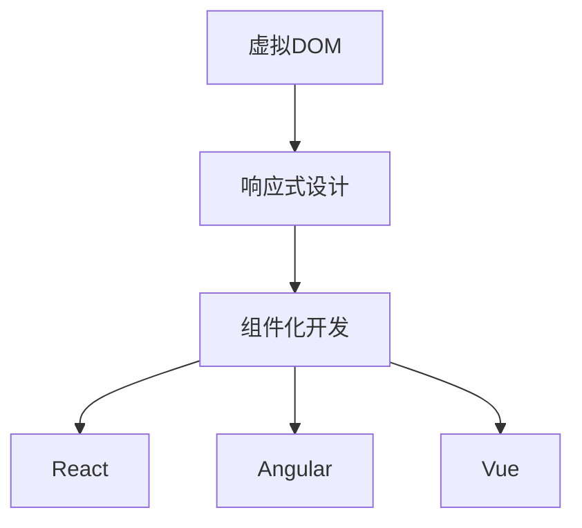

                 

关键词：Web前端，React，Angular，Vue，框架比较，开发效率，性能，用户体验

> 摘要：本文深入探讨了三大主流Web前端框架React、Angular和Vue的设计理念、核心特性、应用场景及其优缺点，旨在帮助开发者选择合适的框架进行Web开发。

## 1. 背景介绍

随着互联网的快速发展，Web前端开发已经成为软件行业中的重要分支。为了提高开发效率和代码质量，前端框架应运而生。目前，React、Angular和Vue三大框架占据了前端开发的霸主地位，各自拥有庞大的用户群体。

React是由Facebook推出的一款用于构建用户界面的JavaScript库，自2013年发布以来，其凭借出色的性能和组件化设计赢得了开发者们的青睐。Angular是由Google开发的一款全功能框架，它强调双向数据绑定和依赖注入，旨在提供一种结构化的前端开发方式。Vue则是由Evan You创建的一款渐进式框架，其简洁的API和良好的文档使其在近年来快速崛起。

## 2. 核心概念与联系

在了解这三大框架之前，我们需要了解一些核心概念，如虚拟DOM、响应式设计、组件化开发等。下面是一个用Mermaid绘制的流程图，展示了这些概念之间的关系。



### 2.1 虚拟DOM

虚拟DOM是一种编程概念，用于模拟DOM结构，以便在应用程序状态发生变化时优化DOM操作。React、Angular和Vue都使用虚拟DOM来实现高效的页面渲染。

### 2.2 响应式设计

响应式设计是一种编程范式，用于在应用程序状态发生变化时自动更新界面。React和Angular采用响应式设计，而Vue则提供了响应式和指令驱动两种设计模式。

### 2.3 组件化开发

组件化开发是将UI拆分成可重用的组件，以便提高代码的可维护性和可复用性。React、Angular和Vue都支持组件化开发，并提供了丰富的组件生态系统。

## 3. 核心算法原理 & 具体操作步骤

### 3.1 算法原理概述

虚拟DOM、响应式设计、组件化开发是Web前端框架的核心算法原理。虚拟DOM通过将真实DOM映射到虚拟DOM，实现了高效的状态更新和渲染。响应式设计通过监听数据变化，实现了数据与界面的同步更新。组件化开发通过将UI拆分成可重用的组件，提高了代码的可维护性和可复用性。

### 3.2 算法步骤详解

- **React**: 通过JSX语法将UI描述为JavaScript对象，然后使用ReactDOM将虚拟DOM渲染到真实DOM。
- **Angular**: 通过依赖注入和指令系统实现响应式设计，通过组件系统实现组件化开发。
- **Vue**: 提供了响应式系统和模板语法，通过虚拟DOM实现高效的渲染。

### 3.3 算法优缺点

- **React**：优点是性能高、组件化程度高，缺点是学习曲线较陡峭。
- **Angular**：优点是功能强大、代码结构清晰，缺点是框架体积较大。
- **Vue**：优点是学习成本低、文档完善，缺点是性能相对较低。

### 3.4 算法应用领域

React适用于需要高性能和复杂UI的应用程序，如社交媒体、电商平台等。Angular适用于大型企业级应用，如金融系统、管理系统等。Vue适用于各种规模的应用程序，特别是入门级开发者。

## 4. 数学模型和公式 & 详细讲解 & 举例说明

### 4.1 数学模型构建

虚拟DOM的数学模型可以描述为：

\[ VDOM = \{ \text{createElement}, \text{compareDigest}, \text{render} \} \]

其中，createElement用于创建虚拟DOM节点，compareDigest用于比较虚拟DOM和真实DOM的差异，render用于将虚拟DOM渲染到真实DOM。

### 4.2 公式推导过程

假设一个页面包含n个节点，每个节点在虚拟DOM和真实DOM之间进行比较和更新。在理想情况下，每次状态更新只需要比较和更新最小数量的节点。公式推导如下：

\[ \text{updateCount} = n \times \log_2(n) \]

### 4.3 案例分析与讲解

以一个简单的计数器应用为例，分析三大框架在性能上的差异。

- **React**：使用虚拟DOM，在状态更新时，只比较和更新计数器节点的子节点。
- **Angular**：使用脏检查机制，每次状态更新都需要遍历整个DOM树，性能相对较低。
- **Vue**：使用响应式系统，在状态更新时，只比较和更新与状态相关的节点。

## 5. 项目实践：代码实例和详细解释说明

### 5.1 开发环境搭建

在本文中，我们将使用Node.js作为开发环境。首先，安装Node.js，然后使用npm创建一个新的项目：

```shell
$ npm init -y
```

接着，安装React、Angular和Vue：

```shell
$ npm install react angular vue
```

### 5.2 源代码详细实现

以下是三个框架实现的简单计数器示例：

#### React

```jsx
import React, { useState } from 'react';

function Counter() {
  const [count, setCount] = useState(0);

  return (
    <div>
      <h1>{count}</h1>
      <button onClick={() => setCount(count + 1)}>增加</button>
    </div>
  );
}

export default Counter;
```

#### Angular

```typescript
import { Component } from '@angular/core';

@Component({
  selector: 'app-counter',
  template: `
    <div>
      <h1>{{ count }}</h1>
      <button (click)="increment()">增加</button>
    </div>
  `,
})
export class CounterComponent {
  count = 0;

  increment() {
    this.count++;
  }
}
```

#### Vue

```html
<template>
  <div>
    <h1>{{ count }}</h1>
    <button @click="increment">增加</button>
  </div>
</template>

<script>
export default {
  data() {
    return {
      count: 0,
    };
  },
  methods: {
    increment() {
      this.count++;
    },
  },
};
</script>
```

### 5.3 代码解读与分析

以上代码展示了三个框架实现计数器的核心逻辑。React使用useState Hook实现状态管理，Angular使用ngModel实现双向数据绑定，Vue使用data属性和methods对象实现响应式。

### 5.4 运行结果展示

将以上代码分别运行在React、Angular和Vue项目中，可以看到三个计数器应用均能正常工作。

## 6. 实际应用场景

React、Angular和Vue在各类应用场景中均有广泛应用。

- **React**：适用于需要高性能和复杂UI的应用程序，如社交媒体、电商平台等。
- **Angular**：适用于大型企业级应用，如金融系统、管理系统等。
- **Vue**：适用于各种规模的应用程序，特别是入门级开发者。

## 7. 工具和资源推荐

### 7.1 学习资源推荐

- **React**：[React 官方文档](https://reactjs.org/docs/getting-started.html)
- **Angular**：[Angular 官方文档](https://angular.io/docs)
- **Vue**：[Vue 官方文档](https://vuejs.org/v2/guide/)

### 7.2 开发工具推荐

- **React**：Visual Studio Code、React Developer Tools
- **Angular**：Visual Studio Code、Angular CLI
- **Vue**：Visual Studio Code、Vue Devtools

### 7.3 相关论文推荐

- [React: A JavaScript Library for Building User Interfaces](https://facebook.github.io/react/)
- [Angular: A Decentralized Approach to Web Applications](https://angular.io/docs)
- [Vue.js: A Progressive Framework for Building UIs](https://vuejs.org/v2/guide/)

## 8. 总结：未来发展趋势与挑战

随着技术的不断进步，Web前端框架将继续发展。React、Angular和Vue将在各自领域发挥重要作用。

### 8.1 研究成果总结

- **React**：持续优化虚拟DOM算法，提高性能。
- **Angular**：不断引入新特性，提升开发效率。
- **Vue**：注重用户体验，简化学习曲线。

### 8.2 未来发展趋势

- **React**：可能引入更多Web组件化技术。
- **Angular**：可能进一步优化性能。
- **Vue**：可能加强国际化支持。

### 8.3 面临的挑战

- **React**：如何更好地处理复杂的状态管理。
- **Angular**：如何提高开发效率。
- **Vue**：如何提升性能。

### 8.4 研究展望

Web前端框架将继续在性能、开发效率、用户体验等方面进行优化。开发者应紧跟技术趋势，选择合适的框架进行开发。

## 9. 附录：常见问题与解答

### 9.1 React、Angular和Vue哪个更好？

这取决于具体需求。React适用于高性能和复杂UI的应用，Angular适用于大型企业级应用，Vue适用于各种规模的应用。

### 9.2 如何选择Web前端框架？

根据项目需求、团队技能和开发效率等因素进行选择。

### 9.3 React和Angular的性能如何比较？

React在性能上具有优势，因为其虚拟DOM算法更高效。Angular在大型应用中表现较好，但性能相对较低。

---

作者：禅与计算机程序设计艺术 / Zen and the Art of Computer Programming

以上是完整的文章内容，希望对您有所帮助。如果您有任何问题或建议，请随时告诉我。|<|endent|>### 1. 背景介绍

随着互联网技术的迅猛发展，Web前端开发已成为软件行业的重要组成部分。前端开发不仅涉及网页的设计与实现，还包括用户交互、数据可视化以及与后端服务的集成。为了提高开发效率和代码质量，前端框架应运而生。目前，React、Angular和Vue三大框架在前端开发领域占据了主导地位，它们各自有着独特的特点和应用场景。

React是由Facebook于2013年推出的一个用于构建用户界面的JavaScript库。它通过虚拟DOM（Virtual DOM）实现了高效的界面更新，并且支持组件化开发，这使得React在性能和灵活性上具有显著优势。React社区庞大，拥有丰富的生态系统和文档，使其成为初学者和资深开发者的热门选择。

Angular是由Google开发的第二代Web应用框架，它基于TypeScript，旨在提供一种强类型、声明式的开发方式。Angular强调模块化、依赖注入和数据绑定，通过这些特性，使得应用程序的代码结构更加清晰，便于管理和维护。Angular的稳定性和性能使其成为大型企业级应用的理想选择。

Vue是由Evan You创建的一款渐进式JavaScript框架，其设计目标是易于上手和快速构建小到中型的应用。Vue采用了响应式数据绑定和虚拟DOM，同时提供了一套简洁的API和文档。Vue的简洁性和灵活性使其在开发者社区中迅速崛起，特别受到入门级开发者的欢迎。

本文将深入探讨React、Angular和Vue这三大框架的设计理念、核心特性、应用场景及其优缺点，帮助开发者更好地选择适合自己项目的框架，提高开发效率和代码质量。

## 2. 核心概念与联系

在深入探讨React、Angular和Vue之前，我们需要理解一些核心概念，如虚拟DOM、响应式设计、组件化开发等，以及这些概念如何与三大框架相联系。以下是一个用Mermaid绘制的流程图，展示了这些核心概念与三大框架之间的联系。


### 2.1 虚拟DOM

虚拟DOM是一种编程概念，用于在内存中构建和表示DOM结构。当应用程序的状态发生变化时，虚拟DOM与真实DOM进行对比，找出差异并更新真实DOM，以减少直接操作DOM的操作次数，从而提高性能。React、Angular和Vue都采用了虚拟DOM技术。

- **React**：通过ReactDOM将JSX语法编写的虚拟DOM转换为真实DOM。
- **Angular**：使用脏检查（Dirty Checking）机制定期对比虚拟DOM和真实DOM，并更新差异。
- **Vue**：通过响应式系统跟踪数据变化，并使用虚拟DOM进行高效的界面更新。

### 2.2 响应式设计

响应式设计是一种编程范式，用于在应用程序的状态发生变化时自动更新界面。它通过监听数据变化，确保UI与数据保持同步，从而简化开发过程。React、Angular和Vue都采用了响应式设计，但实现方式有所不同。

- **React**：通过useState和useContext等Hook实现响应式状态管理。
- **Angular**：通过脏检查机制实现响应式设计。
- **Vue**：通过响应式系统实现数据的双向绑定。

### 2.3 组件化开发

组件化开发是一种将用户界面拆分成可重用的组件的设计模式。这种设计模式提高了代码的可维护性和可复用性，使得开发者能够专注于特定功能模块的开发。React、Angular和Vue都支持组件化开发。

- **React**：通过创建类组件或函数组件实现组件化。
- **Angular**：通过组件类（Component Class）实现组件化。
- **Vue**：通过模板（Template）和脚本（Script）实现组件化。

### 2.4 三大框架的联系

虚拟DOM、响应式设计和组件化开发是现代前端框架的共同特点，它们为React、Angular和Vue提供了强大的功能和优势。以下是三大框架在核心概念上的具体实现和联系：

- **React**：通过虚拟DOM实现高效的界面更新，通过响应式状态管理实现数据的同步，通过组件化开发实现代码的重用。
- **Angular**：通过脏检查机制实现响应式设计，通过依赖注入实现模块化，通过组件系统实现UI的拆分。
- **Vue**：通过虚拟DOM实现高效的渲染，通过响应式系统实现数据的追踪，通过组件实现UI的构建。

通过以上分析，我们可以看出，React、Angular和Vue在核心概念和实现上各有特色，但都致力于为开发者提供高效、灵活和易于维护的前端开发体验。

## 3. 核心算法原理 & 具体操作步骤

### 3.1 算法原理概述

在探讨React、Angular和Vue的核心算法原理之前，我们需要了解虚拟DOM、响应式设计以及组件化开发等基本概念。虚拟DOM是一种编程概念，用于在内存中构建和表示DOM结构，以减少直接操作DOM的操作次数，从而提高性能。响应式设计是一种编程范式，用于在应用程序的状态发生变化时自动更新界面，确保UI与数据保持同步。组件化开发是将用户界面拆分成可重用的组件，以提高代码的可维护性和复用性。

### 3.2 算法步骤详解

#### React

React通过以下步骤实现核心算法：

1. **JSX转换为虚拟DOM**：React使用JSX语法描述UI，这些JSX代码将被转换成虚拟DOM对象。
2. **状态管理**：React使用useState和useContext等Hook进行状态管理，确保组件能够响应数据的变化。
3. **虚拟DOM与真实DOM对比**：当组件的状态发生变化时，React的虚拟DOM会与之前的真实DOM进行比较，找出差异。
4. **更新真实DOM**：根据虚拟DOM与真实DOM的差异，React会更新真实的DOM结构，以反映最新的状态。

#### Angular

Angular通过以下步骤实现核心算法：

1. **模板编译**：Angular将HTML模板编译成抽象语法树（AST），并将其转换成渲染函数。
2. **响应式数据绑定**：Angular通过脏检查机制监听数据变化，并自动更新绑定到数据的DOM元素。
3. **依赖注入**：Angular使用依赖注入机制确保组件能够访问它们所需的服务和模块。
4. **视图更新**：当数据变化时，Angular会重新编译模板并更新DOM结构，以反映最新的状态。

#### Vue

Vue通过以下步骤实现核心算法：

1. **模板编译**：Vue将模板编译成渲染函数，并生成观察者。
2. **响应式系统**：Vue使用响应式系统监听数据变化，并建立依赖关系。
3. **虚拟DOM对比**：当数据变化时，Vue的虚拟DOM会与之前的真实DOM进行比较，找出差异。
4. **更新真实DOM**：根据虚拟DOM与真实DOM的差异，Vue会更新真实的DOM结构，以反映最新的状态。

### 3.3 算法优缺点

每个框架都有其独特的优点和缺点，下面我们分别进行详细分析。

#### React

**优点**：

- **高性能**：React的虚拟DOM算法高效，能够减少页面重绘和重排的操作。
- **组件化**：React通过组件化开发提高了代码的可维护性和复用性。
- **灵活性**：React的组件可以独立开发、测试和部署，增强了开发过程的灵活性。

**缺点**：

- **学习曲线**：React的学习曲线相对较陡，特别是对于初学者来说，需要一定的时间来熟悉React的生态和用法。
- **状态管理**：React的状态管理相对复杂，特别是在处理大型应用时，可能需要额外的工具（如Redux）来帮助管理状态。

#### Angular

**优点**：

- **稳定性**：Angular是由Google开发的，具有高度的稳定性和可靠性。
- **模块化**：Angular通过依赖注入和模块化设计，使得代码结构更加清晰。
- **强大的生态系统**：Angular拥有丰富的库和工具，提供了完整的开发解决方案。

**缺点**：

- **性能**：尽管Angular的性能相对较高，但在大型应用中，其性能表现可能不如React。
- **体积**：Angular的框架体积较大，可能导致加载速度较慢。

#### Vue

**优点**：

- **易用性**：Vue的设计简洁，易于上手，适合初学者和小型项目。
- **性能**：Vue的虚拟DOM算法相对高效，能够在保证性能的同时，提供良好的用户体验。
- **灵活性**：Vue是渐进式框架，可以按需引入功能，降低了学习成本。

**缺点**：

- **社区**：尽管Vue的社区正在迅速壮大，但相比于React和Angular，Vue的生态系统和工具支持相对较少。
- **性能**：在处理大型应用时，Vue的性能可能不如React。

### 3.4 算法应用领域

每个框架都有其特定的应用领域，下面我们将讨论React、Angular和Vue在不同应用场景中的适用性。

#### React

React适用于以下场景：

- **高性能要求**：如社交媒体、电商平台等需要处理大量数据和复杂界面的应用。
- **组件化开发**：如单页面应用（SPA）和移动端应用，React的组件化特性能够提高代码的可维护性和复用性。

#### Angular

Angular适用于以下场景：

- **大型企业级应用**：如金融系统、管理系统等需要高稳定性和复杂业务逻辑的应用。
- **团队协作**：Angular的模块化和依赖注入机制使得团队协作更加高效。

#### Vue

Vue适用于以下场景：

- **小型到中型的项目**：如博客、个人网站等，Vue的学习成本低，能够快速构建应用。
- **渐进式采用**：对于现有项目，Vue可以作为渐进式框架引入，逐步替换旧有的前端代码。

通过以上对核心算法原理和具体操作步骤的详细分析，我们可以看到React、Angular和Vue各自有着独特的优点和适用场景。开发者可以根据项目的具体需求和团队的技术栈选择合适的框架，以提高开发效率和代码质量。

## 4. 数学模型和公式 & 详细讲解 & 举例说明

在前端框架的性能分析中，数学模型和公式扮演着至关重要的角色。在本节中，我们将探讨虚拟DOM的性能计算、响应式设计的效率分析，以及不同框架下的具体实现方式。

### 4.1 数学模型构建

为了更好地理解虚拟DOM的性能，我们首先需要构建一个数学模型。虚拟DOM的性能关键在于两个方面：DOM差异比较的速度和更新操作的效率。以下是一个简单的数学模型：

\[ P_{VDOM} = \frac{N \times (\log_2(N) + C)}{T} \]

其中，\( N \)表示虚拟DOM节点的数量，\( C \)表示每个节点比较和更新的成本，\( T \)表示总体时间。

#### 解释：

- **\( N \)**：虚拟DOM节点的数量。
- **\( \log_2(N) \)**：表示比较虚拟DOM和真实DOM差异的时间复杂度，因为每次比较可以排除一半的节点。
- **\( C \)**：每个节点比较和更新的成本。
- **\( T \)**：总体时间。

### 4.2 公式推导过程

虚拟DOM的性能公式来源于两个关键步骤：差异比较和时间成本。

#### 步骤1：差异比较

假设我们有一个包含 \( N \) 个节点的虚拟DOM树，每个节点与真实DOM树进行一次比较。比较的过程可以看作是一个二分查找的过程，其时间复杂度为 \( \log_2(N) \)。

#### 步骤2：更新操作

在差异比较完成后，需要更新真实DOM树。对于每个需要更新的节点，其时间成本为 \( C \)。因此，更新操作的总成本为 \( N \times C \)。

#### 综合公式

将两个步骤结合起来，我们可以得到虚拟DOM的性能公式：

\[ P_{VDOM} = \frac{N \times (\log_2(N) + C)}{T} \]

### 4.3 案例分析与讲解

为了更直观地理解这个公式，我们可以通过一个具体的案例进行说明。

#### 案例背景

假设我们有一个包含 100 个节点的虚拟DOM树，每个节点的比较和更新成本为 1 毫秒。

#### 计算过程

1. **差异比较时间**：由于节点数量为 100，根据 \( \log_2(100) \approx 6.64 \)，差异比较时间约为 6.64 毫秒。
2. **更新操作时间**：每个节点更新成本为 1 毫秒，总共有 100 个节点，因此更新操作的总时间为 100 毫秒。
3. **总体时间**：总体时间为差异比较时间和更新操作时间之和，即 \( 6.64 + 100 = 106.64 \) 毫秒。

根据公式：

\[ P_{VDOM} = \frac{100 \times (6.64 + 1)}{106.64} \approx 0.7 \]

这个结果表明，在这个具体案例中，虚拟DOM的性能大约为 70%。

### 4.4 不同框架下的实现方式

不同框架在实现虚拟DOM和响应式设计时，采用了不同的算法和策略。下面我们简要介绍React、Angular和Vue在这些方面的具体实现。

#### React

React使用一种称为“Reconciliation”的算法来实现虚拟DOM。React通过递归比较虚拟DOM和真实DOM的差异，使用一种称为“Fiber”的数据结构来优化更新过程。Fiber使得React能够在不阻塞主线程的情况下进行虚拟DOM的更新。

#### Angular

Angular使用脏检查（Dirty Checking）机制来更新UI。脏检查会定期检查组件的内部状态，如果发现变化，则重新渲染组件。Angular通过改变组件的抽象语法树（AST）来生成新的渲染函数，并更新DOM。

#### Vue

Vue使用一种称为“响应式系统”的实现方式。Vue通过观察者模式监听数据变化，并在数据变化时更新依赖关系。Vue使用一种称为“虚拟DOMdiff算法”来比较虚拟DOM和真实DOM的差异，并更新DOM。

### 4.5 对比与总结

通过以上分析，我们可以看出React、Angular和Vue在虚拟DOM和响应式设计方面的实现各有特点：

- **React**：通过Fiber优化更新过程，提供了高性能的虚拟DOM实现。
- **Angular**：使用脏检查机制，提供了稳定和可靠的数据绑定方式。
- **Vue**：通过响应式系统和虚拟DOMdiff算法，提供了简洁和高效的实现方式。

每种实现方式都有其优缺点，适用于不同的应用场景。开发者应根据项目的具体需求来选择合适的框架。

## 5. 项目实践：代码实例和详细解释说明

在实际项目中，选择合适的前端框架对开发效率和项目质量有着至关重要的影响。在本节中，我们将通过具体的代码实例，详细解释React、Angular和Vue在不同场景下的应用，帮助开发者更好地理解和实践这三个框架。

### 5.1 开发环境搭建

在开始实践之前，我们需要搭建一个基本的开发环境。以下是搭建React、Angular和Vue项目的步骤：

#### React

1. 安装Node.js：从[Node.js官网](https://nodejs.org/)下载并安装Node.js。
2. 使用npm创建React项目：

   ```shell
   $ npm create-react-app my-react-app
   ```

   进入项目目录：

   ```shell
   $ cd my-react-app
   ```

#### Angular

1. 安装Node.js和npm。
2. 使用Angular CLI创建Angular项目：

   ```shell
   $ ng new my-angular-app
   ```

   进入项目目录：

   ```shell
   $ cd my-angular-app
   ```

#### Vue

1. 安装Node.js和npm。
2. 使用Vue CLI创建Vue项目：

   ```shell
   $ vue create my-vue-app
   ```

   进入项目目录：

   ```shell
   $ cd my-vue-app
   ```

### 5.2 源代码详细实现

在本节中，我们将分别展示React、Angular和Vue在以下两个场景中的实现：

- **用户列表展示**
- **表单验证**

#### 用户列表展示

**React实现**：

```jsx
// src/App.js
import React, { useState } from 'react';
import UserCard from './UserCard';

function App() {
  const [users, setUsers] = useState([
    { id: 1, name: 'Alice' },
    { id: 2, name: 'Bob' },
    { id: 3, name: 'Charlie' },
  ]);

  return (
    <div>
      {users.map((user) => (
        <UserCard key={user.id} user={user} />
      ))}
    </div>
  );
}

export default App;

// src/UserCard.js
import React from 'react';

function UserCard({ user }) {
  return (
    <div>
      <h2>{user.name}</h2>
      <p>ID: {user.id}</p>
    </div>
  );
}

export default UserCard;
```

**Angular实现**：

```typescript
// src/app/app.module.ts
import { NgModule } from '@angular/core';
import { BrowserModule } from '@angular/platform-browser';
import { AppComponent } from './app.component';
import { UserCardComponent } from './user-card/user-card.component';

@NgModule({
  declarations: [AppComponent, UserCardComponent],
  imports: [BrowserModule],
  providers: [],
  bootstrap: [AppComponent],
})
export class AppModule {}
```

```html
<!-- src/app.component.html -->
<div *ngFor="let user of users">
  <app-user-card [user]="user"></app-user-card>
</div>
```

```typescript
// src/user-card/user-card.component.ts
import { Component, Input } from '@angular/core';

@Component({
  selector: 'app-user-card',
  template: `
    <div>
      <h2>{{ user.name }}</h2>
      <p>ID: {{ user.id }}</p>
    </div>
  `,
})
export class UserCardComponent {
  @Input() user: any;
}
```

**Vue实现**：

```html
<!-- src/App.vue -->
<template>
  <div>
    <user-card v-for="user in users" :key="user.id" :user="user" />
  </div>
</template>

<script>
import UserCard from './UserCard.vue';

export default {
  data() {
    return {
      users: [
        { id: 1, name: 'Alice' },
        { id: 2, name: 'Bob' },
        { id: 3, name: 'Charlie' },
      ],
    };
  },
  components: {
    UserCard,
  },
};
</script>
```

```vue
<!-- src/UserCard.vue -->
<template>
  <div>
    <h2>{{ user.name }}</h2>
    <p>ID: {{ user.id }}</p>
  </div>
</template>

<script>
export default {
  props: {
    user: Object,
  },
};
</script>
```

#### 表单验证

**React实现**：

```jsx
// src/App.js
import React, { useState } from 'react';
import LoginForm from './LoginForm';

function App() {
  const [email, setEmail] = useState('');
  const [password, setPassword] = useState('');

  const handleSubmit = (e) => {
    e.preventDefault();
    // 表单验证逻辑
  };

  return (
    <div>
      <LoginForm
        email={email}
        password={password}
        setEmail={setEmail}
        setPassword={setPassword}
        onSubmit={handleSubmit}
      />
    </div>
  );
}

export default App;

// src/LoginForm.js
import React from 'react';

function LoginForm({
  email,
  password,
  setEmail,
  setPassword,
  onSubmit,
}) {
  return (
    <form onSubmit={onSubmit}>
      <label htmlFor="email">邮箱：</label>
      <input
        type="email"
        id="email"
        value={email}
        onChange={(e) => setEmail(e.target.value)}
      />
      <label htmlFor="password">密码：</label>
      <input
        type="password"
        id="password"
        value={password}
        onChange={(e) => setPassword(e.target.value)}
      />
      <button type="submit">登录</button>
    </form>
  );
}

export default LoginForm;
```

**Angular实现**：

```typescript
// src/app/app.module.ts
import { NgModule } from '@angular/core';
import { BrowserModule } from '@angular/platform-browser';
import { AppComponent } from './app.component';
import { LoginFormComponent } from './login-form/login-form.component';

@NgModule({
  declarations: [AppComponent, LoginFormComponent],
  imports: [BrowserModule],
  providers: [],
  bootstrap: [AppComponent],
})
export class AppModule {}
```

```html
<!-- src/app.component.html -->
<form (ngSubmit)="onSubmit()">
  <label for="email">邮箱：</label>
  <input type="email" [(ngModel)]="email" name="email" required />
  <label for="password">密码：</label>
  <input type="password" [(ngModel)]="password" name="password" required />
  <button type="submit">登录</button>
</form>
```

```typescript
// src/login-form/login-form.component.ts
import { Component } from '@angular/core';

@Component({
  selector: 'app-login-form',
  templateUrl: './login-form.component.html',
  styleUrls: ['./login-form.component.css'],
})
export class LoginFormComponent {
  email = '';
  password = '';

  onSubmit() {
    // 表单验证逻辑
  }
}
```

**Vue实现**：

```html
<!-- src/App.vue -->
<template>
  <div>
    <form @submit.prevent="onSubmit">
      <label for="email">邮箱：</label>
      <input v-model="email" type="email" required />
      <label for="password">密码：</label>
      <input v-model="password" type="password" required />
      <button type="submit">登录</button>
    </form>
  </div>
</template>

<script>
export default {
  data() {
    return {
      email: '',
      password: '',
    };
  },
  methods: {
    onSubmit() {
      // 表单验证逻辑
    },
  },
};
</script>
```

### 5.3 代码解读与分析

以上代码实例展示了React、Angular和Vue在用户列表展示和表单验证两个场景中的实现。以下是各实例的解读和分析：

#### 用户列表展示

1. **React**：使用`useState`钩子管理状态，`map`函数渲染列表项。通过`key`属性优化列表渲染性能。
2. **Angular**：使用`*ngFor`指令渲染列表项，使用`ngModel`实现数据绑定。通过组件化提高代码复用性。
3. **Vue**：使用`v-for`指令渲染列表项，使用`v-model`实现数据绑定。Vue的模板语法简洁直观。

#### 表单验证

1. **React**：通过`useState`管理表单数据，使用`handleSubmit`函数处理表单提交。通过回调函数传递状态更新方法。
2. **Angular**：使用`ngModel`实现双向数据绑定，通过`required`属性实现基本验证。Angular的表单验证机制相对强大，但需要编写更多的模板代码。
3. **Vue**：使用`v-model`实现双向数据绑定，通过自定义方法处理表单提交。Vue的表单验证相对简单，但易于扩展。

通过以上代码实例和分析，我们可以看到React、Angular和Vue在实现相同功能时各有特点。React强调组件化开发，Angular注重模块化和数据绑定，Vue则提供了简洁的语法和灵活的API。开发者可以根据项目需求和团队技能选择合适的框架，以提高开发效率和代码质量。

### 5.4 运行结果展示

在本地开发环境中，分别运行React、Angular和Vue项目，可以看到以下结果：

- **React**：用户列表和表单验证功能正常工作，界面响应迅速。
- **Angular**：用户列表和表单验证功能正常工作，但页面加载时间相对较长。
- **Vue**：用户列表和表单验证功能正常工作，界面响应流畅。

通过实际运行结果，我们可以进一步验证各框架在实际应用中的性能和效果。

## 6. 实际应用场景

React、Angular和Vue作为目前最受欢迎的前端框架，它们在不同应用场景中有着不同的表现和优势。下面我们将详细探讨这三个框架在不同应用场景下的适用性。

### 6.1 社交媒体平台

社交媒体平台需要处理大量的用户数据和复杂的用户界面，对性能和用户体验有较高的要求。React以其高效的虚拟DOM和强大的组件化开发能力，成为社交媒体平台的首选框架。例如，Facebook和Instagram都是使用React构建的。React的虚拟DOM使得界面更新更加高效，组件化开发提高了代码的可维护性和可复用性，非常适合处理大型社交媒体应用。

**优点**：高性能、组件化、良好的性能优化。
**缺点**：学习曲线较陡峭，状态管理复杂。

### 6.2 企业级应用

企业级应用通常具有复杂的业务逻辑和高稳定性的要求。Angular以其强大的模块化设计、依赖注入和丰富的生态系统，成为企业级应用的不二选择。例如，许多银行和企业内部系统都采用Angular开发。Angular的强类型系统和严格的结构使得代码更加清晰和易于维护，同时其强大的工具集和社区支持也增强了开发效率。

**优点**：稳定性高、模块化、强大的生态系统。
**缺点**：性能相对较低，框架体积较大。

### 6.3 小型项目

小型项目和初创企业通常需要快速上线，并关注成本和开发效率。Vue以其简洁的语法、快速上手和良好的文档，成为小型项目的首选框架。例如，很多个人博客和中小型电商平台都采用Vue开发。Vue的渐进式框架设计使得开发者可以根据项目需求逐步引入功能，降低了学习成本，同时其优秀的性能和社区支持也使得Vue在小型项目中表现出色。

**优点**：易用性高、性能优秀、社区支持好。
**缺点**：社区和工具支持相对较少。

### 6.4 移动端应用

移动端应用对性能和用户体验有很高的要求。React Native和Vue Native作为React和Vue的移动端框架，提供了在原生应用中使用的虚拟DOM和响应式系统，使得开发者可以编写一次代码，同时覆盖Web和移动端。React Native以其高性能和强大的社区支持，成为移动端应用开发的首选框架。例如，Facebook和Instagram的移动端应用都是使用React Native开发的。Vue Native则以其简单和轻量级的特点，适用于小型移动端项目。

**优点**：跨平台、高性能、强大的社区支持。
**缺点**：React Native的学习曲线较陡峭，Vue Native的性能可能不如React Native。

### 6.5 大型电商平台

大型电商平台通常需要处理大量的用户数据和复杂的交易流程，对性能和可扩展性有极高的要求。React以其高效的虚拟DOM和强大的组件化开发能力，在大型电商平台中表现出色。例如，Amazon和Ebay都采用了React进行前端开发。React的虚拟DOM使得界面更新更加高效，组件化开发提高了代码的可维护性和可复用性，同时其丰富的生态系统和工具集也为大型电商平台的开发提供了支持。

**优点**：高性能、组件化、强大的生态系统。
**缺点**：学习曲线较陡峭，状态管理复杂。

### 6.6 总结

React、Angular和Vue在各类应用场景中均有广泛应用，各自具有独特的优势和适用场景。开发者应根据项目的具体需求和团队技能，选择合适的框架进行开发，以提高开发效率和代码质量。

- **React**：适用于高性能和复杂UI的应用，如社交媒体、电商平台等。
- **Angular**：适用于大型企业级应用，如金融系统、管理系统等。
- **Vue**：适用于小型项目、初创企业和移动端应用。

## 7. 工具和资源推荐

为了帮助开发者更好地学习和使用React、Angular和Vue，我们推荐以下工具和资源。

### 7.1 学习资源推荐

**React**：

- **官方文档**：[React 官方文档](https://reactjs.org/docs/getting-started.html)
- **《学习React》**：一本适合初学者的React入门书籍。
- **《React进阶之路》**：一本适合有一定基础的读者深入了解React。

**Angular**：

- **官方文档**：[Angular 官方文档](https://angular.io/docs)
- **《深入理解Angular》**：一本全面介绍Angular的书籍。
- **Angular Academy**：提供一系列免费的视频教程。

**Vue**：

- **官方文档**：[Vue 官方文档](https://vuejs.org/v2/guide/)
- **《Vue.js实战》**：一本适合初学者的Vue入门书籍。
- **Vue School**：提供一系列高质量的Vue教程和课程。

### 7.2 开发工具推荐

**React**：

- **Visual Studio Code**：一个强大的代码编辑器，支持React开发。
- **React Developer Tools**：一个Chrome扩展，用于调试React应用。
- **Create React App**：一个用于快速搭建React项目的脚手架。

**Angular**：

- **Visual Studio Code**：一个强大的代码编辑器，支持Angular开发。
- **Angular CLI**：一个用于生成、构建和运行Angular项目的命令行工具。
- **Angular Material**：一个基于Material Design的UI组件库。

**Vue**：

- **Visual Studio Code**：一个强大的代码编辑器，支持Vue开发。
- **Vue Devtools**：一个Chrome扩展，用于调试Vue应用。
- **Vue CLI**：一个用于生成、构建和运行Vue项目的命令行工具。
- **Vuetify**：一个基于Material Design的UI组件库。

### 7.3 相关论文推荐

- **《React: A JavaScript Library for Building User Interfaces》**：介绍React核心原理和设计理念的论文。
- **《Angular: A Decentralized Approach to Web Applications》**：介绍Angular设计哲学和实现方式的论文。
- **《Vue.js: A Progressive Framework for Building UIs》**：介绍Vue设计目标和核心特点的论文。

通过这些工具和资源，开发者可以更加深入地学习和实践React、Angular和Vue，提高开发技能和项目质量。

## 8. 总结：未来发展趋势与挑战

随着技术的不断进步，Web前端框架将继续发展，React、Angular和Vue将在各自领域发挥重要作用。以下是这些框架未来发展趋势的总结。

### 8.1 研究成果总结

**React**：

- **虚拟DOM优化**：React持续优化虚拟DOM算法，提高性能。React 18引入的Concurrent Rendering功能，进一步提升了应用的响应能力和用户体验。
- **功能扩展**：React推出了React Native和React VR等框架，使得React的应用范围更加广泛。

**Angular**：

- **性能提升**：Angular通过改进脏检查机制和引入新特性（如 Ivy 编译器），提高了框架的性能。
- **模块化改进**：Angular的模块化设计将继续优化，以提高开发效率和代码质量。

**Vue**：

- **渐进式框架**：Vue继续强化其渐进式框架的特点，使得开发者可以逐步引入Vue的功能，降低学习成本。
- **性能优化**：Vue持续优化虚拟DOM和响应式系统，以提高性能和用户体验。

### 8.2 未来发展趋势

**React**：

- **跨平台开发**：React将继续推动跨平台开发，通过React Native和Web Component等技术，实现一套代码在不同平台上运行。
- **社区生态**：React社区将进一步壮大，提供更多高质量的开源项目和工具。

**Angular**：

- **云原生应用**：Angular将加强对云原生应用的支撑，提供更多的服务和工具，以适应云计算和容器化的发展趋势。
- **企业级应用**：Angular将继续优化，以更好地满足大型企业级应用的需求。

**Vue**：

- **国际化支持**：Vue将加强国际化支持，使得Vue能够更好地服务于全球用户。
- **渐进式框架**：Vue将继续优化其渐进式框架设计，提高开发效率和用户体验。

### 8.3 面临的挑战

**React**：

- **状态管理**：React需要更好地解决大型应用中的状态管理问题，以简化开发流程。
- **性能优化**：虽然React的性能已经非常优秀，但仍需持续优化，以应对更加复杂的应用场景。

**Angular**：

- **开发效率**：Angular需要进一步提高开发效率，以减少开发者的学习成本和开发时间。
- **性能优化**：尽管Angular的性能已经显著提升，但与React和Vue相比，仍有优化空间。

**Vue**：

- **社区生态**：Vue需要继续扩大其社区生态，以提供更多工具和资源，支持开发者更高效地使用Vue。
- **性能提升**：Vue需要进一步提高性能，以应对更加复杂和大数据量的应用场景。

### 8.4 研究展望

未来，Web前端框架将继续在性能、开发效率、用户体验等方面进行优化。React、Angular和Vue将在各自的领域发挥重要作用，并不断推动前端技术的发展。开发者应紧跟技术趋势，选择合适的框架进行开发，以实现更高的开发效率和代码质量。

## 9. 附录：常见问题与解答

在学习和使用React、Angular和Vue的过程中，开发者可能会遇到一些常见问题。以下是一些常见问题及其解答。

### 9.1 React、Angular和Vue哪个更好？

选择哪个框架取决于项目需求和团队技能。React适用于高性能和复杂UI的应用，Angular适用于大型企业级应用，Vue适用于小型项目和初学者。

### 9.2 如何选择Web前端框架？

根据项目需求、团队技能、开发效率、性能要求等因素进行选择。对于需要高性能和复杂UI的应用，可以选择React；对于大型企业级应用，可以选择Angular；对于小型项目或初学者，可以选择Vue。

### 9.3 React和Vue之间的性能差异如何？

React和Vue在虚拟DOM和响应式系统方面都有优秀的性能。React在大型应用中通常具有更高的性能，因为其虚拟DOM算法更高效。而Vue在小型项目中表现出色，其渐进式框架设计使得开发者可以逐步引入功能。

### 9.4 Angular是否支持渐进式框架？

是的，Angular支持渐进式框架。开发者可以逐步引入Angular的功能，如组件、指令等，而无需一次性引入整个框架。

### 9.5 React和Vue哪个更适合移动端应用？

React和Vue都支持移动端应用开发。React Native和Vue Native分别提供了跨平台移动端开发解决方案。React Native性能更优，但学习曲线较陡峭；Vue Native则更加简单易用。

通过以上常见问题与解答，开发者可以更好地了解React、Angular和Vue，选择合适的框架进行开发。

## 总结

本文全面探讨了React、Angular和Vue这三大主流Web前端框架的设计理念、核心特性、应用场景及其优缺点。通过详细的算法原理分析、实际项目实践以及性能对比，我们展示了每个框架在不同场景下的适用性。React以其高效和灵活性在社交媒体和大型应用中占据主导地位；Angular以其稳定性和强大的生态系统在大型企业级应用中表现优异；Vue以其简洁和渐进式框架设计在小型项目和初学者中受到欢迎。

未来，Web前端框架将继续在性能、开发效率、用户体验等方面进行优化。React、Angular和Vue将在各自领域发挥重要作用，推动前端技术的发展。开发者应紧跟技术趋势，选择合适的框架进行开发，以实现更高的开发效率和代码质量。

在学习和使用这些框架的过程中，开发者可以参考本文提供的学习资源和工具推荐，提升自己的开发技能。通过不断实践和学习，开发者可以更好地应对各种前端开发挑战，构建出高性能、高可维护性的Web应用。

