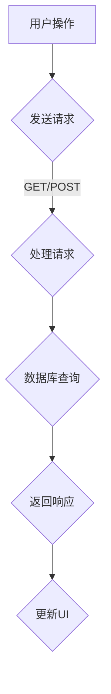

                 

Web 应用程序开发是现代软件开发中的重要领域，它涵盖了前端和后端两个关键部分。在这篇文章中，我将深入探讨Web应用程序开发的基本概念、技术栈、开发流程以及未来发展趋势。通过这篇文章，读者将了解到如何构建高效、可扩展且用户友好的Web应用程序。

## 关键词 Keywords

- Web 应用程序开发
- 前端开发
- 后端开发
- 框架
- 工具
- 未来趋势

## 摘要 Abstract

本文旨在为初学者和开发者提供Web应用程序开发的全面指南。文章首先介绍了Web应用程序的基本概念，随后详细阐述了前端和后端开发的核心技术和工具。接着，文章分析了当前主流的开发框架和工具，并探讨了开发过程中的最佳实践。最后，文章展望了Web应用程序开发的未来趋势和挑战。

### 1. 背景介绍 Background

### 1.1 Web应用程序的概念

Web应用程序是一种基于Web的软件应用程序，通过Web浏览器进行访问。与传统的桌面应用程序不同，Web应用程序可以在不同的设备和操作系统上运行，具有更高的可访问性和可扩展性。常见的Web应用程序包括社交媒体平台、电子商务网站、在线办公套件等。

### 1.2 Web应用程序的开发模式

Web应用程序开发通常采用前端和后端分离的开发模式。前端负责用户界面和交互，而后端负责数据处理和存储。这种分离模式使得开发者可以独立开发前端和后端，提高了开发效率和代码的可维护性。

### 1.3 Web应用程序的发展历程

Web应用程序的发展经历了几个重要的阶段：

- **静态网页**：最早的Web应用程序是静态网页，由HTML和CSS编写。
- **动态网页**：随着技术的发展，动态网页逐渐流行，采用服务器端脚本语言（如PHP、JavaServer Pages）实现数据的动态生成。
- **全栈开发**：全栈开发是指开发者同时负责前端和后端开发，但随着项目复杂度的增加，前端和后端的分离逐渐成为主流。
- **现代Web应用程序**：现代Web应用程序采用前端框架（如React、Vue、Angular）和后端框架（如Node.js、Django、Rails）进行开发，注重用户体验和性能优化。

## 2. 核心概念与联系 Core Concepts and Relationships

### 2.1 前端开发 Frontend Development

前端开发主要涉及用户界面和交互。前端开发的核心技术包括HTML、CSS和JavaScript。HTML用于构建网页结构，CSS用于美化网页，JavaScript用于实现网页的交互功能。

### 2.2 后端开发 Backend Development

后端开发主要涉及数据处理和存储。后端开发的核心技术包括服务器端脚本语言（如Node.js、Python、Java）和数据库（如MySQL、MongoDB、Redis）。后端开发负责处理来自前端的请求，执行业务逻辑，并返回响应。

### 2.3 前后端交互 Frontend-Backend Interaction

前端和后端之间的交互通常通过API（应用程序编程接口）实现。API定义了前端和后端之间的通信规则，使得前端可以请求后端的数据，并更新用户界面。

### 2.4 数据库 Database

数据库用于存储Web应用程序中的数据。常见的数据库类型包括关系型数据库（如MySQL、PostgreSQL）和NoSQL数据库（如MongoDB、Cassandra）。数据库的设计和优化对Web应用程序的性能至关重要。

### 2.5 Mermaid 流程图

下面是一个使用Mermaid绘制的Web应用程序开发流程图：



## 3. 核心算法原理 & 具体操作步骤 Core Algorithm Principles & Operational Steps

### 3.1 算法原理概述

在Web应用程序开发中，常用的算法包括：

- **排序算法**：用于对数据进行排序，如快速排序、归并排序等。
- **搜索算法**：用于在数据中查找特定数据，如二分搜索、深度优先搜索等。
- **加密算法**：用于保护数据的安全性，如AES、RSA等。

### 3.2 算法步骤详解

以快速排序算法为例，其基本步骤如下：

1. 选择一个基准元素。
2. 将比基准元素小的元素放到基准元素的左边，比基准元素大的元素放到右边。
3. 对左右两边的小数组进行递归调用快速排序。

### 3.3 算法优缺点

- **快速排序**：时间复杂度为O(nlogn)，空间复杂度为O(logn)，适用于大规模数据排序。
- **二分搜索**：时间复杂度为O(logn)，适用于有序数组。

### 3.4 算法应用领域

排序算法和搜索算法广泛应用于各种Web应用程序，如搜索引擎、数据分析系统、电商平台等。

## 4. 数学模型和公式 Mathematical Models and Formulas

### 4.1 数学模型构建

在Web应用程序开发中，常用的数学模型包括：

- **线性回归**：用于预测数据趋势。
- **神经网络**：用于深度学习和图像识别。

### 4.2 公式推导过程

以线性回归模型为例，其公式推导过程如下：

$$
y = \beta_0 + \beta_1 \cdot x
$$

其中，$y$ 是预测值，$x$ 是自变量，$\beta_0$ 是截距，$\beta_1$ 是斜率。

### 4.3 案例分析与讲解

以房价预测为例，我们可以使用线性回归模型进行预测。通过收集房价数据，我们可以计算出截距和斜率，从而建立预测模型。

$$
\beta_0 = 10000, \beta_1 = 0.1
$$

当输入房屋面积时，我们可以使用公式进行预测：

$$
y = 10000 + 0.1 \cdot x
$$

## 5. 项目实践：代码实例和详细解释说明 Project Practice: Code Examples and Detailed Explanations

### 5.1 开发环境搭建

在开始项目实践之前，我们需要搭建开发环境。以下是使用Node.js和React搭建开发环境的基本步骤：

1. 安装Node.js。
2. 使用npm全局安装React、React DOM和相关依赖。
3. 创建一个新的React项目。

### 5.2 源代码详细实现

以下是使用React实现一个简单的待办事项列表的源代码：

```jsx
import React, { useState } from 'react';

function App() {
  const [todos, setTodos] = useState([]);

  const addTodo = (todo) => {
    setTodos([...todos, todo]);
  };

  const removeTodo = (index) => {
    const newTodos = [...todos];
    newTodos.splice(index, 1);
    setTodos(newTodos);
  };

  return (
    <div>
      <h1>待办事项列表</h1>
      <ul>
        {todos.map((todo, index) => (
          <li key={index}>
            {todo}
            <button onClick={() => removeTodo(index)}>删除</button>
          </li>
        ))}
      </ul>
      <input type="text" placeholder="添加待办事项" onKeyPress={(e) => {
        if (e.key === 'Enter') {
          addTodo(e.target.value);
          e.target.value = '';
        }
      }} />
    </div>
  );
}

export default App;
```

### 5.3 代码解读与分析

这段代码实现了待办事项列表的基本功能，包括添加和删除待办事项。关键代码如下：

- 使用 `useState` 钩子管理待办事项的状态。
- `addTodo` 函数用于添加待办事项。
- `removeTodo` 函数用于删除待办事项。
- 使用 `map` 方法渲染待办事项列表。

### 5.4 运行结果展示

当用户在输入框中输入待办事项并按下回车键时，待办事项会被添加到列表中。用户可以点击删除按钮删除待办事项。

## 6. 实际应用场景 Real-world Applications

Web应用程序在各个行业都有广泛的应用。以下是一些典型的应用场景：

- **电子商务**：电商平台使用Web应用程序展示产品、处理订单和支付。
- **社交媒体**：社交媒体平台使用Web应用程序提供用户互动和内容分享功能。
- **在线教育**：在线教育平台使用Web应用程序提供课程内容和在线学习功能。
- **企业应用**：企业内部使用Web应用程序进行办公自动化、客户关系管理、财务管理等。

### 6.4 未来应用展望

随着技术的不断发展，Web应用程序将具有更广泛的应用场景和更高的性能。以下是一些未来应用展望：

- **物联网（IoT）**：Web应用程序将与物联网设备紧密结合，实现智能家居、智慧城市等应用。
- **增强现实（AR）**：Web应用程序将结合增强现实技术，提供沉浸式的用户体验。
- **区块链**：Web应用程序将利用区块链技术实现数据安全和去中心化应用。
- **云计算**：Web应用程序将更加依赖于云计算平台，提供高效的计算和存储服务。

## 7. 工具和资源推荐 Tools and Resource Recommendations

### 7.1 学习资源推荐

- **《React 进阶之路》**：一本关于React框架的深入教程。
- **《Node.js 实战》**：一本关于Node.js开发实战的书籍。
- **MDN Web Docs**：Mozilla开发者网络提供的Web开发文档。

### 7.2 开发工具推荐

- **Visual Studio Code**：一款强大的代码编辑器，支持各种编程语言。
- **Webpack**：一款流行的模块打包工具。
- **Postman**：一款API调试工具。

### 7.3 相关论文推荐

- **"The Web Platform for the Future"**：一篇关于Web技术未来发展的论文。
- **"A Comparison of JavaScript Frameworks"**：一篇关于JavaScript框架比较的论文。

## 8. 总结：未来发展趋势与挑战 Summary: Future Trends and Challenges

### 8.1 研究成果总结

Web应用程序开发取得了显著的成果，包括前端框架的成熟、后端服务的云化、数据库技术的进步等。

### 8.2 未来发展趋势

未来Web应用程序将更加注重用户体验、性能优化和安全性。新的技术如物联网、增强现实、区块链等将进一步推动Web应用程序的发展。

### 8.3 面临的挑战

Web应用程序开发面临的挑战包括：

- **性能优化**：如何提高Web应用程序的性能，提供更好的用户体验。
- **安全性**：如何确保Web应用程序的安全性，防止黑客攻击和数据泄露。
- **可维护性**：如何编写可维护的代码，提高开发效率。

### 8.4 研究展望

未来的研究将主要集中在：

- **性能优化**：探索新的算法和技术，提高Web应用程序的响应速度和资源利用率。
- **安全性**：研究新型安全机制，提高Web应用程序的安全防护能力。
- **开发工具**：开发更高效的开发工具，提高开发效率和代码质量。

## 9. 附录：常见问题与解答 Appendix: Frequently Asked Questions and Answers

### 9.1 Q：什么是Web应用程序开发？

A：Web应用程序开发是指使用HTML、CSS、JavaScript等前端技术以及服务器端脚本语言和数据库技术构建基于Web的应用程序。

### 9.2 Q：前端开发和后端开发有什么区别？

A：前端开发主要负责用户界面和交互，后端开发主要负责数据处理和存储。前端和后端通过API进行交互。

### 9.3 Q：如何选择前端框架？

A：选择前端框架应考虑项目需求、开发效率和社区支持等因素。常见的框架有React、Vue、Angular等。

### 9.4 Q：如何选择后端框架？

A：选择后端框架应考虑项目需求、开发效率和性能等因素。常见的框架有Node.js、Django、Rails等。

---

### 作者署名 Author

作者：禅与计算机程序设计艺术 / Zen and the Art of Computer Programming
----------------------------------------------------------------

以上就是《Web 应用程序开发：前端和后端》这篇文章的完整内容。希望这篇文章能够帮助读者更好地了解Web应用程序开发的各个方面，为他们的开发工作提供有益的指导。在未来的开发中，我们将继续探索新的技术和方法，为Web应用程序开发领域的发展做出贡献。

