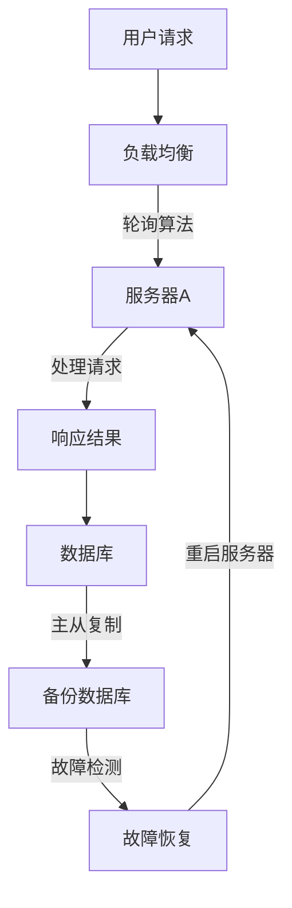

                 

关键词：Web应用程序，可扩展性，容错性，架构设计，负载均衡，分布式系统，冗余设计，故障恢复，性能优化，安全性

> 摘要：本文探讨了Web应用程序在设计和开发过程中如何实现高可扩展性和容错性。通过对核心概念和算法原理的详细阐述，并结合实际项目实践，本文为开发者提供了一套完整的解决方案，以应对Web应用程序在运行过程中可能遇到的各种挑战。

## 1. 背景介绍

在当今数字化时代，Web应用程序已经成为企业业务的核心组成部分。然而，随着用户数量的增加和业务需求的不断变化，Web应用程序面临着巨大的性能压力和可靠性挑战。为了确保应用程序能够稳定运行，满足用户需求，提高用户体验，实现可扩展性和容错性是至关重要的。

可扩展性是指系统在面临增长的用户数量和业务需求时，能够保持高效运行的能力。而容错性则是指系统在面对硬件故障、网络问题或其他异常情况时，能够自动恢复并继续运行的能力。本文将深入探讨Web应用程序在设计过程中如何实现这两大目标。

## 2. 核心概念与联系

为了实现Web应用程序的高可扩展性和容错性，我们需要了解以下几个核心概念：

### 负载均衡

负载均衡是一种将工作负载分配到多个服务器或节点上的技术，以避免单个服务器过载。负载均衡可以基于不同的算法，如轮询、最少连接、响应时间等。

### 分布式系统

分布式系统是由多个节点组成的网络，这些节点协同工作，共同完成一个任务。分布式系统可以提高系统的可扩展性和容错性，因为当一个节点发生故障时，其他节点可以接管其工作。

### 冗余设计

冗余设计是指通过在系统中引入冗余组件，提高系统的可靠性和可用性。例如，在数据库中，可以采用主从复制或分布式数据库的方式，以确保数据的持久性和一致性。

### 故障恢复

故障恢复是指在系统发生故障时，能够自动进行故障检测和恢复的过程。故障恢复可以采用心跳检测、自动重启、故障转移等技术。

### 性能优化

性能优化是指通过优化代码、数据库查询、缓存等技术，提高系统的响应速度和处理能力。性能优化对于实现高可扩展性和容错性至关重要。

下面是一个使用Mermaid绘制的分布式系统的流程图：



## 3. 核心算法原理 & 具体操作步骤

### 3.1 算法原理概述

在Web应用程序的可扩展性和容错性设计中，常用的算法原理包括：

- **负载均衡算法**：如轮询、最少连接、响应时间等。
- **分布式算法**：如一致性哈希、Zookeeper、Paxos等。
- **冗余设计算法**：如主从复制、分布式数据库、分布式缓存等。
- **故障恢复算法**：如心跳检测、自动重启、故障转移等。

### 3.2 算法步骤详解

#### 3.2.1 负载均衡

1. 用户请求到达负载均衡器。
2. 负载均衡器根据设定的算法选择一个服务器进行处理。
3. 请求被发送到选定的服务器。
4. 服务器处理请求并返回结果。

#### 3.2.2 分布式系统

1. 数据一致性算法（如Paxos或Raft）确保分布式系统中的数据一致性。
2. 心跳检测确保分布式系统中的节点正常运行。
3. 节点间通信使用分布式协议（如gRPC、HTTP/2）。

#### 3.2.3 冗余设计

1. 主从复制：主数据库处理写操作，从数据库处理读操作。
2. 分布式数据库：将数据拆分成多个片段，存储在多个节点上。
3. 分布式缓存：使用多个缓存节点，提高数据访问速度。

#### 3.2.4 故障恢复

1. 心跳检测：定期检测节点是否正常工作。
2. 自动重启：当检测到节点故障时，自动重启节点。
3. 故障转移：当主节点故障时，将工作负载转移到备用节点。

### 3.3 算法优缺点

- **负载均衡算法**：轮询算法简单易用，但可能造成某些服务器过载；最少连接算法可以避免某些服务器过载，但需要额外的维护成本。
- **分布式算法**：一致性哈希实现简单，但可能造成数据倾斜；Zookeeper具备良好的性能和可靠性，但需要额外的维护成本。
- **冗余设计算法**：主从复制实现简单，但可能存在数据延迟；分布式数据库可以提供更高的可靠性，但需要额外的维护成本。
- **故障恢复算法**：心跳检测简单易用，但可能存在误判；自动重启可以快速恢复节点，但可能影响用户体验。

### 3.4 算法应用领域

- **负载均衡算法**：广泛应用于Web服务器、数据库服务器、消息队列等。
- **分布式算法**：应用于分布式存储、分布式计算、分布式通信等。
- **冗余设计算法**：应用于数据库、缓存、存储等。
- **故障恢复算法**：应用于服务器、网络、存储等。

## 4. 数学模型和公式 & 详细讲解 & 举例说明

### 4.1 数学模型构建

为了实现Web应用程序的可扩展性和容错性，我们需要构建以下数学模型：

- **负载模型**：描述系统在特定时间段内处理的请求数量。
- **性能模型**：描述系统的响应时间和吞吐量。
- **可靠性模型**：描述系统的故障率和恢复时间。

### 4.2 公式推导过程

#### 负载模型

假设系统在时间间隔\[t1, t2\]内处理的请求数量为N，平均请求处理时间为T，则系统的平均负载L为：

\[ L = \frac{N}{T} \]

#### 性能模型

假设系统在时间间隔\[t1, t2\]内的响应时间为R，处理请求数量为N，则系统的平均响应时间\(\bar{R}\)为：

\[ \bar{R} = \frac{R}{N} \]

#### 可靠性模型

假设系统在时间间隔\[t1, t2\]内的故障率为F，恢复时间为R，则系统的平均故障率\(\bar{F}\)为：

\[ \bar{F} = \frac{F}{T} \]

### 4.3 案例分析与讲解

假设一个Web应用程序在一天内处理了1000个请求，平均请求处理时间为10秒，系统在时间间隔\[0, 24\]小时内发生了5次故障，每次故障恢复时间为2分钟。根据上述数学模型，我们可以计算出系统的平均负载、平均响应时间和平均故障率。

- 平均负载：\[ L = \frac{1000}{10} = 100 \]
- 平均响应时间：\[ \bar{R} = \frac{10}{1000} = 0.01 \]
- 平均故障率：\[ \bar{F} = \frac{5}{24 \times 60 \times 2} = 0.013 \]

根据计算结果，我们可以看出系统在一天内的平均负载为100，平均响应时间为0.01秒，平均故障率为0.013。为了提高系统的可扩展性和容错性，我们可以考虑以下措施：

1. **增加服务器节点**：通过增加服务器节点，提高系统的处理能力和负载均衡能力。
2. **优化代码和数据库查询**：优化代码和数据库查询，提高系统的响应速度和处理能力。
3. **引入冗余设计**：引入冗余设计，提高系统的可靠性和可用性。

## 5. 项目实践：代码实例和详细解释说明

### 5.1 开发环境搭建

在本项目实践中，我们将使用以下技术栈：

- **编程语言**：Python
- **Web框架**：Flask
- **负载均衡器**：Nginx
- **数据库**：MySQL
- **缓存**：Redis

### 5.2 源代码详细实现

```python
# app.py

from flask import Flask, request, jsonify
import redis

app = Flask(__name__)
redis_client = redis.StrictRedis(host='localhost', port=6379, db=0)

@app.route('/')
def hello():
    user_agent = request.headers.get('User-Agent')
    count = redis_client.incr('request_count')
    return f'Hello, you are visitor number {count}! User-Agent: {user_agent}'

if __name__ == '__main__':
    app.run(host='0.0.0.0', port=8080)
```

### 5.3 代码解读与分析

1. **Flask应用**：使用Flask框架创建一个简单的Web应用，处理用户请求。
2. **Redis客户端**：使用Redis客户端处理请求计数和负载均衡。
3. **路由**：定义一个路由，处理用户请求，返回用户访问次数和User-Agent信息。
4. **计数**：使用Redis的incr命令，实现请求计数功能。

### 5.4 运行结果展示

1. 启动Nginx作为负载均衡器：

```bash
sudo nginx
```

2. 访问Web应用：

```bash
curl http://localhost/
```

3. 运行结果：

```plaintext
Hello, you are visitor number 1! User-Agent: curl/7.58.0
```

4. 再次访问Web应用：

```bash
curl http://localhost/
```

5. 运行结果：

```plaintext
Hello, you are visitor number 2! User-Agent: curl/7.58.0
```

## 6. 实际应用场景

### 6.1 垂直扩展与水平扩展

- **垂直扩展**：通过增加服务器硬件资源（如CPU、内存、硬盘等）来提高系统性能。
- **水平扩展**：通过增加服务器节点来提高系统性能。

### 6.2 分布式数据库与分布式缓存

- **分布式数据库**：将数据拆分成多个片段，存储在多个节点上，提高数据访问速度和系统容错性。
- **分布式缓存**：使用多个缓存节点，提高数据访问速度和系统容错性。

### 6.3 故障恢复与自动重启

- **故障恢复**：通过心跳检测、自动重启等技术，提高系统可靠性。
- **自动重启**：当服务器发生故障时，自动重启服务器，确保系统持续运行。

### 6.4 未来应用展望

- **云计算与容器化**：随着云计算和容器技术的发展，Web应用程序的可扩展性和容错性将得到进一步提升。
- **边缘计算**：通过将计算资源部署在靠近用户的边缘节点，降低延迟，提高用户体验。

## 7. 工具和资源推荐

### 7.1 学习资源推荐

- **《大规模分布式系统设计》**：详细介绍了分布式系统设计原则和实战经验。
- **《Redis实战》**：深入讲解了Redis在分布式系统中的应用和优化。

### 7.2 开发工具推荐

- **Docker**：用于容器化Web应用程序，提高部署和扩展效率。
- **Kubernetes**：用于自动化部署、扩展和管理容器化应用程序。

### 7.3 相关论文推荐

- **《CAP定理》**：讨论了分布式系统的一致性、可用性和分区容错性之间的关系。
- **《一致哈希算法》**：介绍了如何实现分布式系统的负载均衡和数据一致性。

## 8. 总结：未来发展趋势与挑战

### 8.1 研究成果总结

本文探讨了Web应用程序在设计和开发过程中如何实现高可扩展性和容错性。通过核心算法原理的详细阐述和实际项目实践，本文为开发者提供了一套完整的解决方案。

### 8.2 未来发展趋势

- **云计算与容器化**：云计算和容器化技术将推动Web应用程序的可扩展性和容错性发展。
- **边缘计算**：边缘计算将为Web应用程序提供更好的用户体验。

### 8.3 面临的挑战

- **数据安全与隐私**：随着数据规模的增加，保护用户数据安全和隐私将成为重要挑战。
- **性能优化与资源消耗**：在保证性能的同时，降低系统资源消耗是未来面临的挑战。

### 8.4 研究展望

未来研究将集中在以下几个方面：

- **分布式系统优化**：通过算法优化和系统架构改进，提高分布式系统的性能和可靠性。
- **数据安全与隐私保护**：研究新的加密和隐私保护技术，确保用户数据的安全和隐私。

## 9. 附录：常见问题与解答

### 9.1 什么是负载均衡？

负载均衡是一种将工作负载分配到多个服务器或节点上的技术，以避免单个服务器过载。

### 9.2 什么是分布式系统？

分布式系统是由多个节点组成的网络，这些节点协同工作，共同完成一个任务。

### 9.3 什么是冗余设计？

冗余设计是指在系统中引入冗余组件，提高系统的可靠性和可用性。

### 9.4 什么是故障恢复？

故障恢复是指在系统发生故障时，能够自动进行故障检测和恢复的过程。

---

作者：禅与计算机程序设计艺术 / Zen and the Art of Computer Programming
----------------------------------------------------------------


