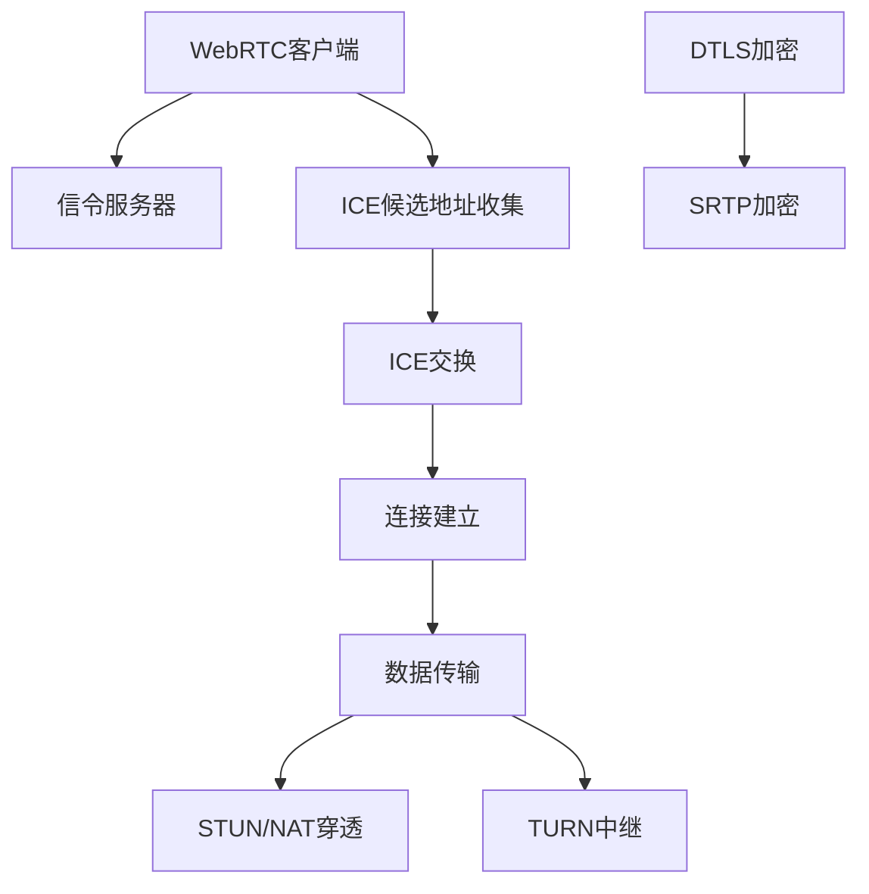

                 

关键词：WebRTC、实时通信、互动功能、浏览器、音视频传输、ICE、DTLS、SRTP、STUN、NAT穿透

> 摘要：本文将深入探讨WebRTC实时通信协议的应用，详细解析其在浏览器中实现互动功能的技术原理和具体实现步骤，以及相关的数学模型和实际项目案例。通过本文，读者可以全面了解WebRTC的工作机制，掌握其在现代互联网应用中的重要性和实际应用场景。

## 1. 背景介绍

### 1.1 WebRTC的起源与发展

WebRTC（Web Real-Time Communication）是一个开源项目，旨在实现网页上的实时通信功能，包括语音、视频和数据交换。它起源于Google，并在2011年作为Chrome浏览器的一部分首次推出。随着WebRTC的成熟和广泛采用，越来越多的Web应用开始集成实时通信功能，例如视频会议、在线教育、远程医疗、在线游戏等。

### 1.2 实时通信的重要性

在现代社会，实时通信已经成为互联网应用的重要组成部分。它不仅提供了即时的沟通体验，还极大地提高了工作效率和用户体验。实时通信的应用场景广泛，从个人聊天到企业协作，从教育到娱乐，都有着不可替代的作用。

### 1.3 WebRTC的优势

WebRTC具有以下优势：

- **跨平台兼容性**：WebRTC可以在不同的操作系统和浏览器上运行，无需安装额外的插件。
- **低延迟和高带宽利用率**：WebRTC采用了高效的编解码技术和网络优化算法，确保了通信的实时性和稳定性。
- **安全性**：WebRTC使用加密技术来保护通信数据，确保通信过程的安全。
- **易用性**：WebRTC提供了简单的API和接口，使得开发者可以轻松地实现实时通信功能。

## 2. 核心概念与联系

### 2.1 WebRTC的工作原理

WebRTC通过一系列协议和标准来实现实时通信。这些协议包括：

- **信令协议**：用于交换会话信息，如ICE候选地址、SDP信息等。
- **NAT穿透技术**：如STUN和TURN，帮助穿越NAT和防火墙。
- **传输层协议**：如DTLS和SRTP，用于加密传输数据。

### 2.2 WebRTC的关键技术

- **ICE（Interactive Connectivity Establishment）**：ICE协议用于发现和选择最佳的NAT穿透方案。
- **DTLS（Datagram Transport Layer Security）**：DTLS用于加密通信数据，确保数据传输的安全性。
- **SRTP（Secure Real-time Transport Protocol）**：SRTP用于加密和认证实时传输的数据。
- **STUN（Session Traversal Utilities for NAT）**：STUN用于获取NAT后的IP地址和端口。
- **TURN（Traversal Using Relays around NAT）**：TURN用于中继通信，当ICE和STUN无法穿透NAT时使用。

### 2.3 WebRTC架构图



## 3. 核心算法原理 & 具体操作步骤

### 3.1 算法原理概述

WebRTC的核心算法主要包括ICE算法和NAT穿透技术。ICE算法通过交换ICE候选地址，选择最佳的连接方案。NAT穿透技术则通过STUN和TURN协议帮助客户端和服务器穿越NAT。

### 3.2 算法步骤详解

1. **ICE候选地址收集**：客户端收集本地的IP地址和端口信息，包括LAN地址和公网地址。
2. **ICE交换**：客户端和服务器交换ICE候选地址，选择最佳连接。
3. **连接建立**：根据ICE算法的结果，客户端和服务器建立连接。
4. **数据传输**：使用DTLS和SRTP协议加密数据，确保通信安全性。
5. **NAT穿透**：如果需要，通过STUN和TURN协议实现NAT穿透。

### 3.3 算法优缺点

**优点**：

- **高效性**：ICE算法和NAT穿透技术使得WebRTC能够实现低延迟和高带宽利用率。
- **安全性**：DTLS和SRTP协议提供了通信数据的加密和认证。
- **跨平台兼容性**：WebRTC可以在不同的操作系统和浏览器上运行。

**缺点**：

- **复杂度**：WebRTC的实现涉及多个协议和标准，对于开发者来说有一定难度。
- **性能问题**：在带宽较低或网络不稳定的情况下，WebRTC的性能可能受到影响。

### 3.4 算法应用领域

WebRTC主要应用于需要实时通信的互联网应用，如：

- **视频会议**：实现多人实时视频通话。
- **在线教育**：提供实时视频教学和互动。
- **远程医疗**：实现远程医疗服务和实时诊断。
- **在线游戏**：提供实时语音和视频通信功能。

## 4. 数学模型和公式 & 详细讲解 & 举例说明

### 4.1 数学模型构建

WebRTC的数学模型主要涉及ICE算法和NAT穿透技术。

**ICE算法**：

- **计算NAT类型**：根据STUN响应，计算NAT类型。
- **选择最佳连接**：根据ICE候选地址，选择最佳连接。

**NAT穿透技术**：

- **STUN协议**：获取NAT后的IP地址和端口。
- **TURN协议**：在中继服务器上建立隧道，实现NAT穿透。

### 4.2 公式推导过程

**ICE算法**：

- **NAT类型计算**：

  $$NAT_Type = f(NAT_Type_1, NAT_Type_2, NAT_Type_3)$$

  其中，$NAT_Type_1, NAT_Type_2, NAT_Type_3$ 分别表示STUN响应中的NAT类型。

- **选择最佳连接**：

  $$Best_Connection = argmin_{c \in Connections} \sum_{i=1}^{n} (Distance(c, i)^2)$$

  其中，$Connections$ 表示所有可能的连接，$Distance(c, i)$ 表示连接$c$与候选地址$i$的距离。

**NAT穿透技术**：

- **STUN协议**：

  $$STUN_Server = f(IP_Address, Port)$$

  其中，$IP_Address, Port$ 分别表示NAT后的IP地址和端口。

- **TURN协议**：

  $$TURN_Tunnel = f(NAT_Server, NAT_Port)$$

  其中，$NAT_Server, NAT_Port$ 分别表示NAT服务器的IP地址和端口。

### 4.3 案例分析与讲解

**案例**：假设有一个客户端在NAT网络中，需要与公网上的服务器建立实时通信。

**步骤**：

1. **收集ICE候选地址**：客户端收集本地的IP地址和端口信息，包括LAN地址和公网地址。
2. **发送STUN请求**：客户端发送STUN请求到STUN服务器，获取NAT后的IP地址和端口。
3. **计算NAT类型**：根据STUN响应，计算NAT类型。
4. **发送ICE候选地址到服务器**：客户端发送ICE候选地址到服务器。
5. **服务器发送ICE候选地址到客户端**：服务器发送ICE候选地址到客户端。
6. **选择最佳连接**：客户端和服务器根据ICE候选地址，选择最佳连接。
7. **建立连接**：客户端和服务器根据选择的连接，建立连接。
8. **数据传输**：使用DTLS和SRTP协议加密数据，确保通信安全性。

## 5. 项目实践：代码实例和详细解释说明

### 5.1 开发环境搭建

**环境要求**：

- Node.js环境：用于搭建信令服务器。
- Web开发框架：如React、Vue等，用于搭建Web客户端。

**步骤**：

1. 安装Node.js。
2. 安装Web开发框架。
3. 搭建信令服务器。
4. 搭建Web客户端。

### 5.2 源代码详细实现

**信令服务器**：

```javascript
const express = require('express');
const app = express();

app.use(express.json());

app.post('/signal', (req, res) => {
    // 处理信令请求
    // 保存会话信息
    // 返回响应
});

app.listen(3000, () => {
    console.log('信令服务器运行在端口3000');
});
```

**Web客户端**：

```html
<!DOCTYPE html>
<html>
<head>
    <title>WebRTC客户端</title>
</head>
<body>
    <video id="localVideo" autoplay></video>
    <video id="remoteVideo" autoplay></video>
    <script>
        // 实现WebRTC客户端逻辑
    </script>
</body>
</html>
```

### 5.3 代码解读与分析

**信令服务器**：用于处理客户端之间的信令请求，如ICE候选地址交换。它提供了一个简单的接口，使得客户端可以发送和接收信令。

**Web客户端**：使用了WebRTC API，实现了视频通信功能。它包括两个视频标签，分别用于显示本地视频和远程视频。客户端通过信令服务器交换ICE候选地址，建立连接，并开始传输数据。

### 5.4 运行结果展示

**结果**：在Web浏览器中打开客户端页面，可以看到本地视频和远程视频实时通信的效果。客户端可以通过信令服务器与服务器进行交互，实现实时通信功能。

## 6. 实际应用场景

### 6.1 视频会议

视频会议是WebRTC最广泛的应用之一。通过WebRTC，可以实现多人实时视频通话，提高会议效率。

### 6.2 在线教育

在线教育平台可以通过WebRTC实现实时视频教学和互动，提供更好的学习体验。

### 6.3 远程医疗

远程医疗可以通过WebRTC实现医生与患者的实时视频沟通，提供远程诊断和治疗服务。

### 6.4 在线游戏

在线游戏可以通过WebRTC实现实时语音和视频通信，提高游戏体验。

## 7. 工具和资源推荐

### 7.1 学习资源推荐

- 《WebRTC 实时通信技术》
- 《WebRTC 实时通信编程》
- 《WebRTC权威指南》

### 7.2 开发工具推荐

- WebRTC.io：一个WebRTC开发平台，提供WebRTC的API和工具。
- WebrtcHacks：一个WebRTC开发博客，提供WebRTC的技术指导和实例。

### 7.3 相关论文推荐

- "WebRTC: Real-Time Communication on the Web"
- "WebRTC in Action: Real-Time Communication for the Web"
- "WebRTC: A Protocol for Real-Time Communication on the Web"

## 8. 总结：未来发展趋势与挑战

### 8.1 研究成果总结

WebRTC作为实时通信技术的代表，已经取得了显著的成果。它实现了浏览器中的实时通信功能，广泛应用于视频会议、在线教育、远程医疗等领域。

### 8.2 未来发展趋势

- **低延迟和高带宽利用率**：随着5G和Wi-Fi 6等技术的普及，WebRTC将实现更低的延迟和更高的带宽利用率。
- **安全性增强**：WebRTC将进一步加强通信数据的安全性，提高用户隐私保护。
- **跨平台兼容性提升**：WebRTC将不断提升跨平台的兼容性，支持更多设备和操作系统。

### 8.3 面临的挑战

- **性能优化**：在低带宽和低延迟的网络环境下，WebRTC的性能需要进一步优化。
- **安全性提升**：随着网络攻击的增多，WebRTC需要不断提升安全性，保护用户的隐私和数据安全。

### 8.4 研究展望

未来，WebRTC将继续在实时通信领域发挥重要作用。随着技术的发展，WebRTC将实现更高效、更安全、更稳定的实时通信功能，推动互联网应用的创新和发展。

## 9. 附录：常见问题与解答

### 9.1 WebRTC是否支持多种编解码器？

是的，WebRTC支持多种编解码器，包括H.264、VP8、VP9等。开发者可以根据应用需求和带宽条件选择合适的编解码器。

### 9.2 WebRTC如何保证通信的安全性？

WebRTC使用DTLS和SRTP协议来保证通信的安全性。DTLS用于加密传输数据，SRTP用于认证和加密实时传输的数据，确保数据传输的安全性。

### 9.3 WebRTC是否支持多方通信？

是的，WebRTC支持多方通信。通过ICE算法和信令服务器，可以实现多方视频会议和多人实时通信。

### 9.4 WebRTC是否支持移动设备？

是的，WebRTC支持移动设备。大多数现代移动浏览器都支持WebRTC，包括Chrome、Firefox、Safari和Edge。

### 9.5 WebRTC是否支持实时数据传输？

是的，WebRTC支持实时数据传输。通过数据通道（Data Channels），可以实现实时数据的传输，如文件共享、实时游戏数据等。

---

作者：禅与计算机程序设计艺术 / Zen and the Art of Computer Programming

本文基于WebRTC实时通信协议的应用，详细介绍了其在浏览器中实现互动功能的技术原理、实现步骤、数学模型和实际项目案例。通过本文，读者可以全面了解WebRTC的工作机制，掌握其在现代互联网应用中的重要性和实际应用场景。未来，随着技术的不断发展，WebRTC将在实时通信领域发挥更加重要的作用。

