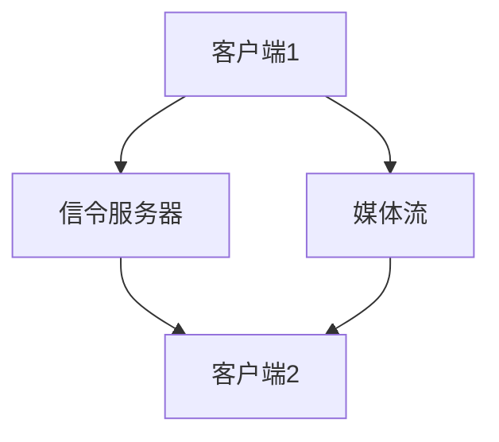

                 

关键词：WebRTC，实时通信，浏览器，音视频传输，协议，安全性

摘要：本文旨在深入探讨WebRTC技术，详细介绍其核心概念、算法原理、数学模型及其在实际项目中的应用，并展望未来WebRTC技术的发展趋势与挑战。通过本文，读者将全面了解WebRTC技术的优势、应用场景及开发实践。

## 1. 背景介绍

在互联网高速发展的今天，实时通信（Real-Time Communication，简称RTC）已成为诸多应用场景的必要需求。从视频会议、在线教育到实时游戏，实时通信技术极大地丰富了互联网的交互体验。传统的实时通信技术大多依赖于专用的客户端软件，而WebRTC（Web Real-Time Communication）的出现，则将实时通信能力无缝集成到了Web浏览器中，使得开发者可以更加便捷地实现跨浏览器的实时通信功能。

WebRTC是由Google发起并推动的一个开放项目，旨在实现浏览器之间的实时音视频通信。自2011年发布以来，WebRTC得到了广泛的关注和采用，目前已成为实现Web端实时通信的首选技术。WebRTC通过提供一套完整的协议和API，使得开发者无需关心底层复杂细节，即可实现高质量的实时音视频通信。

## 2. 核心概念与联系

### 2.1 WebRTC核心概念

WebRTC包括三个核心组件：

- **媒体组件（Media Components）**：处理音视频编码、解码、传输等媒体相关的功能。
- **数据组件（Data Components）**：提供数据通道，用于传输非媒体数据，如文件传输、实时消息等。
- **信令组件（Signaling Components）**：负责建立和维持通信的连接，包括地址交换、密钥协商等。

### 2.2 WebRTC架构

WebRTC的架构设计旨在实现高度模块化和可扩展性。其基本架构包括：

- **客户端（Client）**：使用WebRTC API进行音视频采集、编码、传输等操作。
- **信令服务器（Signaling Server）**：负责客户端之间的信号交换，确保通信连接建立。
- **媒体服务器（Media Server）**：可选，用于处理媒体流的中转、混合等功能。

### 2.3 WebRTC工作流程

WebRTC的工作流程如下：

1. **建立信令连接**：客户端通过信令服务器交换信息，包括IP地址、端口、密钥等。
2. **协商媒体参数**：客户端通过信令服务器协商媒体参数，如编解码器、分辨率、帧率等。
3. **采集媒体数据**：客户端采集音视频数据，进行编码。
4. **发送媒体数据**：客户端将编码后的媒体数据发送给对端。
5. **接收媒体数据**：对端接收媒体数据，进行解码后播放。

### 2.4 WebRTC Mermaid流程图



## 3. 核心算法原理 & 具体操作步骤

### 3.1 算法原理概述

WebRTC的核心算法主要包括：

- **编解码算法（Codec）**：用于音视频数据的压缩和解压缩。
- **网络拥塞控制算法**：用于在网络带宽变化时调整数据传输速率。
- **媒体流同步算法**：确保音视频数据在播放时保持同步。

### 3.2 算法步骤详解

1. **媒体采集**：客户端使用内置摄像头、麦克风等设备采集音视频数据。
2. **编码**：使用编解码器对音视频数据进行压缩编码。
3. **传输**：将编码后的媒体数据发送到对端。
4. **解码**：对端接收到媒体数据后，使用相应的编解码器进行解码。
5. **播放**：解码后的音视频数据在本地播放。

### 3.3 算法优缺点

#### 优点：

- **跨平台性**：WebRTC可以在不同操作系统和浏览器上运行，无需安装专用软件。
- **高实时性**：WebRTC提供了高效的网络拥塞控制和媒体同步算法，确保实时通信质量。
- **安全性**：WebRTC支持端到端加密，保证通信数据的安全性。

#### 缺点：

- **性能要求**：WebRTC对客户端的硬件性能有较高要求，尤其是处理大量音视频数据时。
- **兼容性问题**：虽然WebRTC得到了广泛支持，但并非所有浏览器和平台都完全兼容。

### 3.4 算法应用领域

WebRTC广泛应用于以下领域：

- **视频会议**：企业级、教育级、医疗级等多场景视频会议。
- **在线教育**：实时互动课堂、远程教学等。
- **实时游戏**：多人在线游戏、实时语音聊天等。
- **直播**：实时视频直播、互动直播等。

## 4. 数学模型和公式 & 详细讲解 & 举例说明

### 4.1 数学模型构建

WebRTC的数学模型主要包括以下方面：

- **编解码模型**：基于H.264、H.265、VP8等编解码算法，实现音视频数据的压缩与解压缩。
- **网络模型**：基于TCP、UDP等传输协议，实现数据传输的可靠性与实时性。
- **加密模型**：基于AES、RSA等加密算法，实现数据传输的安全性。

### 4.2 公式推导过程

假设音视频数据传输速率为\( R \)，网络带宽为\( B \)，则：

\[ R = B \times \eta \]

其中，\( \eta \)为编码效率。

### 4.3 案例分析与讲解

假设一个视频会议场景，要求视频帧率为\( 30 \)帧/秒，每帧大小为\( 1080 \times 1920 \)像素，编解码器压缩效率为\( 90\% \)，则：

- **原始数据传输速率**：\( 30 \times 1080 \times 1920 \times 3 \times 90\% = 68,280,000 \)比特/秒（约68Mbps）。
- **网络带宽需求**：为了保证实时传输，网络带宽至少需要\( 68Mbps \)。

## 5. 项目实践：代码实例和详细解释说明

### 5.1 开发环境搭建

为了实现WebRTC的实时通信功能，我们需要搭建一个开发环境。以下是基本步骤：

1. **安装Node.js**：WebRTC依赖于Node.js环境，首先需要安装Node.js。
2. **安装WebRTC模块**：使用npm安装WebRTC模块。
3. **搭建信令服务器**：使用WebSocket协议搭建信令服务器，用于客户端之间的信号交换。

### 5.2 源代码详细实现

以下是WebRTC客户端的简单示例代码：

```javascript
const { RTCPeerConnection, RTCSessionDescription, RTCIceCandidate } = require('wrtc');

// 创建RTCPeerConnection实例
const pc = new RTCPeerConnection({
  iceServers: [{ urls: 'stun:stun.l.google.com:19302' }],
});

// 添加音视频轨道
const audioTrack = getAudioTracks()[0];
const videoTrack = getVideoTracks()[0];
pc.addTrack(audioTrack, audioStream);
pc.addTrack(videoTrack, videoStream);

// 监听ICE候选者事件
pc.onicecandidate = (event) => {
  if (event.candidate) {
    sendToServer('candidate', event.candidate);
  }
};

// 监听会话描述符事件
pc.onnegotiationneeded = () => {
  pc.createOffer((offer) => {
    pc.setLocalDescription(offer);
    sendToServer('offer', offer);
  });
};

// 处理服务器返回的响应
const handleRemoteAnswer = (answer) => {
  pc.setRemoteDescription(new RTCSessionDescription(answer));
};

// 发送ICE候选者和会话描述符到服务器
function sendToServer(type, message) {
  // 实现与信令服务器的通信
}

// 获取音视频轨道
function getAudioTracks() {
  // 实现获取音频轨道的逻辑
}

function getVideoTracks() {
  // 实现获取视频轨道的逻辑
}
```

### 5.3 代码解读与分析

上述代码实现了一个基本的WebRTC客户端，主要功能包括：

- **创建RTCPeerConnection实例**：初始化RTCPeerConnection，配置STUN服务器。
- **添加音视频轨道**：将音频和视频轨道添加到RTCPeerConnection。
- **处理ICE候选者和会话描述符事件**：监听ICE候选者和会话描述符事件，并处理服务器返回的响应。
- **发送ICE候选者和会话描述符到服务器**：将ICE候选者和会话描述符发送到信令服务器。

### 5.4 运行结果展示

运行上述代码后，客户端将能够建立与服务器和另一客户端的实时通信连接，实现音视频传输。

## 6. 实际应用场景

WebRTC技术在多个领域具有广泛的应用：

- **视频会议**：企业级、教育级、医疗级等多场景视频会议。
- **在线教育**：实时互动课堂、远程教学等。
- **实时游戏**：多人在线游戏、实时语音聊天等。
- **直播**：实时视频直播、互动直播等。

### 6.1 典型案例

- **Zoom**：Zoom是一款基于WebRTC技术的视频会议软件，提供高质量的实时音视频通信。
- **Google Meet**：Google Meet是一款基于WebRTC技术的在线会议工具，广泛应用于企业内部通信。
- **Twitch**：Twitch是一款基于WebRTC技术的直播平台，支持实时视频直播和互动。

## 7. 未来应用展望

随着WebRTC技术的不断成熟，未来其在以下领域具有广阔的应用前景：

- **低延迟通信**：5G网络的普及将推动WebRTC在低延迟通信领域的应用，如自动驾驶、远程医疗等。
- **边缘计算**：边缘计算与WebRTC技术的结合，可以实现更加高效的实时通信，满足复杂场景的需求。
- **物联网**：WebRTC技术可用于物联网设备的实时通信，如智能家居、智能穿戴设备等。

## 8. 工具和资源推荐

### 8.1 学习资源推荐

- 《WebRTC权威指南》（作者：Benoit Durand）：全面介绍WebRTC技术及其应用。
- 《WebRTC实战》（作者：Imran Ali）：详细讲解WebRTC开发实战。

### 8.2 开发工具推荐

- **WebRTC-Shell**：一个基于WebRTC的浏览器扩展，用于测试WebRTC功能。
- **WebRTC-Support**：一个用于检查浏览器WebRTC支持的在线工具。

### 8.3 相关论文推荐

- “WebRTC: Real-Time Communication on the Web” （作者：Dan J. Bernstein等）：介绍WebRTC技术的开创性论文。
- “WebRTC in the Wild: An Analysis of the Web's Real-Time Communication Infrastructure” （作者：Peter Blono等）：对WebRTC在实际应用中的性能分析。

## 9. 总结：未来发展趋势与挑战

### 9.1 研究成果总结

WebRTC技术自发布以来，取得了显著的成果，已成为实现Web端实时通信的首选技术。其在跨平台性、高实时性、安全性等方面具有明显优势，广泛应用于多个领域。

### 9.2 未来发展趋势

- **标准化**：WebRTC将进一步推动相关标准化工作，提升其在不同平台和浏览器上的兼容性。
- **性能优化**：随着5G、边缘计算等技术的发展，WebRTC将在低延迟、高带宽等方面实现进一步优化。
- **多样化应用**：WebRTC将在更多新兴领域得到应用，如物联网、虚拟现实等。

### 9.3 面临的挑战

- **兼容性问题**：虽然WebRTC得到了广泛支持，但仍需解决不同平台和浏览器之间的兼容性问题。
- **性能瓶颈**：面对复杂场景和大量用户的同时在线，WebRTC的性能仍需进一步提升。
- **隐私保护**：随着WebRTC应用的普及，如何保护用户隐私将成为重要议题。

### 9.4 研究展望

WebRTC技术具有广阔的发展前景，未来将在多个领域发挥重要作用。研究者需关注标准化、性能优化、隐私保护等方面，推动WebRTC技术的持续创新与发展。

## 附录：常见问题与解答

### Q：WebRTC支持哪些编解码器？

A：WebRTC支持多种编解码器，包括H.264、H.265、VP8、VP9等。

### Q：WebRTC如何保证通信数据的安全性？

A：WebRTC支持端到端加密，采用AES、RSA等加密算法，确保通信数据在传输过程中不被窃听和篡改。

### Q：WebRTC在低带宽环境下的表现如何？

A：WebRTC具有自适应网络带宽变化的能力，通过网络拥塞控制算法和编解码器动态调整，能够在低带宽环境下实现良好的实时通信质量。

作者：禅与计算机程序设计艺术 / Zen and the Art of Computer Programming
----------------------------------------------------------------
本文由禅与计算机程序设计艺术撰写，旨在深入探讨WebRTC技术，详细介绍其核心概念、算法原理、数学模型及其在实际项目中的应用，并展望未来WebRTC技术的发展趋势与挑战。通过本文，读者将全面了解WebRTC技术的优势、应用场景及开发实践。希望本文能为WebRTC技术的研究与应用提供有益的参考。

