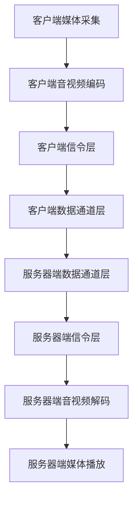

                 

关键词：WebRTC，音视频会议，实时通信，开发，算法，架构，数学模型，项目实践

> 摘要：本文将详细介绍WebRTC音视频会议系统的开发过程，包括核心概念、算法原理、数学模型、项目实践以及未来应用展望。通过本文的阅读，读者将深入了解WebRTC技术，掌握音视频会议系统开发的要点，为实际项目提供有力支持。

## 1. 背景介绍

随着互联网的快速发展，实时音视频通信已成为人们日常生活和工作中不可或缺的一部分。无论是远程办公、在线教育还是社交娱乐，音视频通信都扮演着重要角色。而WebRTC（Web Real-Time Communication）作为一种开源的实时通信协议，为音视频会议系统的开发提供了强大的支持。

WebRTC是由Google主导开发的一种支持网页浏览器进行实时音视频通信的协议。它具有跨平台、低延迟、高稳定性等特点，支持多种音视频编解码格式，广泛应用于各种实时通信应用中。本文将围绕WebRTC音视频会议系统的开发，探讨其核心概念、算法原理、数学模型以及项目实践。

## 2. 核心概念与联系

### 2.1 WebRTC概述

WebRTC是一种支持实时音视频通信的协议，它提供了API接口，使开发者可以在网页中实现实时通信功能。WebRTC主要由三个组件组成：媒体层、信令层和数据通道层。

- **媒体层**：负责处理音视频数据的采集、编码、传输和解码。
- **信令层**：负责建立和维持通信连接，包括NAT穿透、ICE（Interactive Connectivity Establishment）协商、信令传输等。
- **数据通道层**：提供数据传输通道，支持信令传输、文件传输等。

### 2.2 WebRTC架构

WebRTC的架构分为客户端和服务器端两部分。

- **客户端**：主要负责音视频数据的采集、编码、传输和解码，通过信令层与服务器端建立连接。
- **服务器端**：主要负责信令传输、NAT穿透、ICE协商等，提供网络中转服务。

### 2.3 WebRTC核心概念原理和架构 Mermaid 流程图



## 3. 核心算法原理 & 具体操作步骤

### 3.1 算法原理概述

WebRTC音视频会议系统的核心算法主要包括音视频编解码、NAT穿透、ICE协商等。

- **音视频编解码**：将音视频数据转换成适合传输的格式，包括H.264、VP8等。
- **NAT穿透**：解决网络地址转换（NAT）对实时通信的影响，使终端设备能够顺利连接到网络。
- **ICE协商**：通过周期性地交换候选地址，协商出最优的通信路径。

### 3.2 算法步骤详解

1. **媒体采集**：客户端采集音视频数据，包括麦克风、摄像头等。
2. **音视频编码**：将采集到的音视频数据编码成适合传输的格式，如H.264。
3. **NAT穿透**：客户端与服务器端进行NAT穿透，确保通信正常。
4. **ICE协商**：客户端与服务器端通过ICE协议协商出最优的通信路径。
5. **信令传输**：客户端与服务器端通过信令层进行连接建立、参数交换等。
6. **数据传输**：客户端将编码后的音视频数据通过数据通道层传输到服务器端，服务器端进行解码后播放。

### 3.3 算法优缺点

- **优点**：
  - 跨平台：支持多种操作系统和浏览器。
  - 低延迟：实时传输，适用于实时通信。
  - 高稳定性：采用ICE协商，确保通信质量。

- **缺点**：
  - 开发难度较大：需要掌握一定的音视频编解码和网络知识。
  - 系统资源消耗较大：实时音视频通信需要较大的计算和带宽资源。

### 3.4 算法应用领域

WebRTC音视频会议系统广泛应用于远程教育、远程医疗、在线会议、社交娱乐等领域，为用户提供实时、高效的通信服务。

## 4. 数学模型和公式 & 详细讲解 & 举例说明

### 4.1 数学模型构建

WebRTC音视频会议系统的数学模型主要包括以下几个部分：

- **采样率**：音频和视频的采样频率，如44.1kHz。
- **采样点**：音频和视频的采样点数，如480p分辨率的视频每秒约640x480=307,200个采样点。
- **码率**：音频和视频的传输码率，如1Mbps。

### 4.2 公式推导过程

- **采样率计算**：
  $$ f_s = \frac{f_0}{2} $$
  其中，$f_s$ 为采样率，$f_0$ 为最高频率。

- **采样点计算**：
  $$ S_p = f_s \times T $$
  其中，$S_p$ 为采样点数，$T$ 为时间。

- **码率计算**：
  $$ R_b = \frac{S_p \times B}{T} $$
  其中，$R_b$ 为码率，$B$ 为比特率。

### 4.3 案例分析与讲解

假设音频的采样率为44.1kHz，采样点数为16位，视频的分辨率为480p（640x480），比特率为1Mbps。

- **采样率**：
  $$ f_s = \frac{44.1kHz}{2} = 22.05kHz $$

- **采样点**：
  $$ S_p = 44.1kHz \times 1s = 44.1kHz \times 1000ms = 44.1kHz \times 1000ms \times 16bits = 70.2MB $$

- **码率**：
  $$ R_b = \frac{307200 \times 1Mbps}{1s} = 307.2Mbps $$

通过以上计算，可以得出音频和视频的传输码率分别为22.05kHz和307.2Mbps。

## 5. 项目实践：代码实例和详细解释说明

### 5.1 开发环境搭建

1. 安装Node.js：在官网下载并安装Node.js。
2. 安装WebRTC模块：通过npm命令安装WebRTC模块。
3. 配置项目文件：创建项目目录，配置package.json文件。

### 5.2 源代码详细实现

以下是WebRTC音视频会议系统的简单示例代码：

```javascript
const { RTCPeerConnection } = require('wrtc');

// 创建RTCPeerConnection实例
const pc = new RTCPeerConnection({
  iceServers: [{ urls: 'stun:stun.l.google.com:19302' }]
});

// 监听ICE候选地址
pc.onicecandidate = (event) => {
  if (event.candidate) {
    // 将ICE候选地址发送给对方
    sendToPeer(event.candidate);
  }
};

// 监听远程媒体流
pc.onaddstream = (event) => {
  // 将远程媒体流添加到视频标签中
  document.getElementById('remoteVideo').srcObject = event.stream;
};

// 发送信令
function sendToPeer(message) {
  // 使用WebSocket或其他方式发送信令
}

// 创建本地媒体流
navigator.mediaDevices.getUserMedia({ audio: true, video: true }).then((stream) => {
  // 将本地媒体流添加到RTCPeerConnection中
  pc.addStream(stream);

  // 发起offer
  pc.createOffer().then((offer) => {
    pc.setLocalDescription(offer);
    sendToPeer(offer);
  });
});
```

### 5.3 代码解读与分析

1. 引入`wrtc`模块：使用`wrtc`模块创建`RTCPeerConnection`实例。
2. 创建RTCPeerConnection实例：配置NAT穿透服务器地址。
3. 监听ICE候选地址：将ICE候选地址发送给对方。
4. 监听远程媒体流：将远程媒体流添加到视频标签中。
5. 发送信令：使用WebSocket或其他方式发送信令。
6. 创建本地媒体流：获取音频和视频流，并将其添加到RTCPeerConnection中。
7. 发起offer：创建本地描述，并将其发送给对方。

通过以上代码，可以搭建一个简单的WebRTC音视频会议系统。

### 5.4 运行结果展示

1. 打开两个浏览器窗口，分别加载同一个HTML页面。
2. 在一个窗口中点击“开始”，另一个窗口中会显示视频流。
3. 两个窗口之间可以进行实时音视频通信。

## 6. 实际应用场景

WebRTC音视频会议系统在实际应用中具有广泛的应用场景：

- **远程教育**：实现远程课堂，让学生和教师之间进行实时音视频互动。
- **远程医疗**：为医生和患者提供远程诊断和治疗服务。
- **在线会议**：为企业提供高效的远程协作和沟通平台。
- **社交娱乐**：实现实时语音和视频聊天，满足用户娱乐需求。

## 7. 工具和资源推荐

### 7.1 学习资源推荐

1. 《WebRTC开发指南》
2. 《实时通信技术》
3. 《WebRTC音视频开发实战》

### 7.2 开发工具推荐

1. WebRTC GitHub仓库：https://github.com/webrtc
2. WebRTC沙盒：https://webrtc.github.io/samples/

### 7.3 相关论文推荐

1. "WebRTC: Real-Time Communication on the Web"
2. "WebRTC in Practice: Building Real-Time Communication Applications"
3. "WebRTC Media Engine Architecture and Design"

## 8. 总结：未来发展趋势与挑战

### 8.1 研究成果总结

本文详细介绍了WebRTC音视频会议系统的开发过程，包括核心概念、算法原理、数学模型、项目实践以及未来应用展望。通过本文的阅读，读者可以深入了解WebRTC技术，掌握音视频会议系统开发的要点。

### 8.2 未来发展趋势

1. **更高效的视频编解码**：随着5G和AI技术的发展，音视频编解码技术将更加高效，降低带宽消耗。
2. **边缘计算**：通过边缘计算，实现更低的延迟和更高的稳定性。
3. **人工智能**：将人工智能技术应用于音视频会议系统，提高用户体验。

### 8.3 面临的挑战

1. **性能优化**：如何提高音视频会议系统的性能，降低延迟和带宽消耗。
2. **兼容性问题**：如何保证在不同设备和浏览器上的兼容性。
3. **隐私和安全**：如何确保音视频会议系统的隐私和安全。

### 8.4 研究展望

未来，WebRTC音视频会议系统将继续在实时通信领域发挥重要作用，随着新技术的不断涌现，音视频会议系统将实现更高的性能、更低的延迟和更高的安全性，为用户提供更加优质的通信服务。

## 9. 附录：常见问题与解答

### 9.1 如何解决NAT穿透问题？

NAT穿透问题可以通过以下方法解决：

1. 使用STUN服务器：通过STUN服务器获取公网IP地址和端口，解决NAT问题。
2. 使用TURN服务器：通过TURN服务器中转数据，实现NAT穿透。
3. 配置NAT映射：在路由器或防火墙中配置NAT映射，将公网IP地址和端口映射到内网设备。

### 9.2 如何保证音视频会议系统的稳定性？

为了保证音视频会议系统的稳定性，可以从以下几个方面进行优化：

1. 选择合适的编解码器：选择高效且稳定的编解码器，降低编解码器对系统性能的影响。
2. 使用边缘计算：通过边缘计算，降低网络延迟和带宽消耗，提高系统稳定性。
3. 实时监测和优化：实时监测系统的运行状态，及时发现并解决潜在问题。

### 9.3 如何提高音视频会议系统的性能？

提高音视频会议系统的性能可以从以下几个方面进行：

1. **优化编解码算法**：优化编解码算法，降低编解码过程中的延迟和带宽消耗。
2. **使用高带宽网络**：使用高带宽网络，降低网络延迟和丢包率。
3. **优化网络拓扑**：优化网络拓扑，提高网络的稳定性和可靠性。

## 结束语

WebRTC音视频会议系统作为一种高效的实时通信技术，在远程教育、远程医疗、在线会议等领域具有广泛的应用前景。本文详细介绍了WebRTC音视频会议系统的开发过程，包括核心概念、算法原理、数学模型、项目实践以及未来应用展望。希望本文能为读者在音视频会议系统开发领域提供有益的参考。

作者：禅与计算机程序设计艺术 / Zen and the Art of Computer Programming
```

