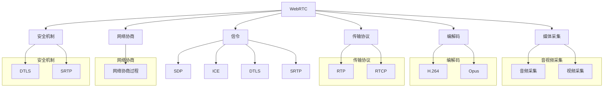

                 

在这个快速发展的数字时代，WebRTC（Web Real-Time Communication）作为一种开放协议，已经在实时音视频通信领域占据了重要地位。WebRTC提供了一套强大的API，使得开发者可以轻松地在浏览器和移动应用中实现实时音视频通信。本文将深入探讨WebRTC的音视频采集与编码机制，旨在为读者提供系统、专业的技术见解。

## 关键词

- WebRTC
- 音视频采集
- 编码
- H.264
- Opus
- RTP
- SDP

## 摘要

本文将详细介绍WebRTC的音视频采集与编码技术。首先，我们将回顾WebRTC的发展历程和基本概念。接着，我们将详细讲解音视频采集的过程，包括硬件采集和软件采集的机制。然后，我们将深入探讨常见的编码标准，如H.264和Opus，并分析它们的优缺点。文章还将介绍WebRTC中的核心协议RTP和SDP的作用和实现。最后，我们将通过实际案例展示WebRTC音视频采集与编码的应用，并展望其未来的发展趋势。

---

## 1. 背景介绍

### WebRTC的起源和发展

WebRTC（Web Real-Time Communication）是由Google发起的一个开源项目，旨在为网页和应用程序提供实时通信的功能。它的目标是简化实时音视频通信的实现，使得开发者无需深入了解复杂的网络协议和硬件细节。WebRTC最早在2011年推出，并迅速获得了业界的关注和认可。

WebRTC的推出标志着实时通信领域的一个重要变革。在此之前，实时音视频通信主要依赖于Flash和Silverlight等插件技术。然而，这些技术存在诸多问题，如性能不佳、安全性较低、兼容性差等。WebRTC的出现解决了这些问题，使得开发者可以更加便捷地实现实时通信功能。

WebRTC的发展历程可以追溯到2011年，当时Google提出了WebRTC的初步方案，并在Chrome浏览器中进行了实验性支持。随后，WebRTC逐渐得到了Mozilla、Microsoft等主流浏览器厂商的支持。2015年，WebRTC被正式纳入HTML5标准，标志着其得到了广泛的认可。

### WebRTC的核心特点

WebRTC具有以下核心特点：

1. **开放性**：WebRTC是一个开源项目，任何人都可以自由使用、修改和贡献代码。这使得WebRTC能够快速迭代，不断优化和完善。
2. **跨平台性**：WebRTC支持多种平台和设备，包括桌面浏览器、移动浏览器以及iOS和Android设备。这使得开发者可以无需关心不同平台的差异，专注于业务逻辑的实现。
3. **高性能**：WebRTC采用了优化的编解码算法和网络协议，能够实现低延迟、高保真的音视频通信。这使得WebRTC非常适合实时互动应用，如在线会议、直播、游戏等。
4. **安全性**：WebRTC提供了完整的加密机制，包括DTLS和SRTP，确保通信过程中的数据安全和隐私。

### WebRTC的应用场景

WebRTC的应用场景非常广泛，涵盖了多个领域：

1. **在线教育**：WebRTC可以用于在线教育平台，实现教师和学生之间的实时互动，包括音视频授课、实时问答等。
2. **远程医疗**：WebRTC可以帮助实现远程医疗咨询、手术指导等场景，降低医疗资源分配的不平衡。
3. **视频会议**：WebRTC可以用于企业级视频会议系统，实现多方实时讨论、文档共享等功能。
4. **直播**：WebRTC可以用于直播应用，实现低延迟、高清的直播体验。
5. **游戏**：WebRTC可以用于实时游戏，实现玩家之间的实时互动。

### WebRTC的技术架构

WebRTC的技术架构可以分为以下几个关键部分：

1. **媒体采集**：包括音频和视频的采集，可以通过硬件或软件方式实现。
2. **编解码**：将采集到的音视频数据编码成适合传输的格式，如H.264、Opus等。
3. **传输协议**：包括RTP（实时传输协议）和RTCP（实时传输控制协议），负责音视频数据的传输和控制。
4. **网络协商**：通过SDP（会话描述协议）进行网络参数的协商，包括编解码格式、传输地址和端口等。
5. **安全机制**：包括DTLS（数据传输层安全性）和SRTP（安全实时传输协议），确保通信过程中的数据安全和隐私。

### WebRTC在现实世界中的应用

WebRTC已经在许多现实场景中得到了广泛应用。例如，Google Meet、Zoom、Discord等知名应用都采用了WebRTC技术。以下是一些具体的案例：

1. **Google Meet**：Google Meet是一款企业级视频会议应用，采用了WebRTC技术实现低延迟、高保真的视频通信。
2. **Zoom**：Zoom是一款广受欢迎的视频会议应用，WebRTC技术为其提供了强大的实时音视频通信能力。
3. **Discord**：Discord是一款专为游戏玩家设计的实时通信应用，WebRTC技术使其能够实现低延迟、高质量的语音和视频通信。

### 总结

WebRTC作为一种开放协议，已经为实时音视频通信带来了巨大的变革。它不仅提供了强大的API，使得开发者可以轻松实现实时通信功能，还具备开放性、跨平台性、高性能和安全性等优点。WebRTC在现实世界中的应用已经证明了其强大的能力和广泛的应用前景。随着WebRTC的不断发展和完善，我们可以期待它在更多领域的应用，为人们的生活和工作带来更多的便利。

## 2. 核心概念与联系

WebRTC的音视频采集与编码涉及到多个核心概念和它们之间的联系。为了更清晰地理解这些概念，我们将使用Mermaid流程图来展示WebRTC的核心原理和架构。

### 2.1 WebRTC核心架构图



### 2.2 音视频采集

音视频采集是WebRTC的基础，它涉及到从硬件设备（如摄像头、麦克风）或软件来源（如应用程序内部生成）获取音视频数据。

1. **音频采集**：音频采集主要涉及从麦克风获取音频信号，并将其数字化。这一过程通常由操作系统和驱动程序处理，然后通过WebRTC的音频模块进行进一步的编码和处理。
   
2. **视频采集**：视频采集则涉及从摄像头获取图像数据，并进行数字化处理。同样，操作系统和驱动程序负责处理这些数据，WebRTC的视频模块负责后续的编码和传输。

### 2.3 编解码

编解码是将原始音视频数据转换成适合网络传输的格式的过程。WebRTC支持多种编解码标准，包括H.264和Opus。

1. **H.264**：H.264是视频编解码的标准，被广泛用于视频会议、直播和其他在线视频应用。它提供了一种高效的压缩算法，能够在保证视频质量的同时降低带宽消耗。

2. **Opus**：Opus是一种音频编解码标准，特别适合实时通信应用。它提供了一种灵活的编解码方式，可以根据网络带宽和音频质量的需求进行动态调整。

### 2.4 传输协议

传输协议负责将编码后的音视频数据通过网络传输到接收端。WebRTC使用了RTP和RTCP两种协议。

1. **RTP**：RTP（实时传输协议）是一种用于传输实时音视频数据的协议。它定义了音视频数据的格式和传输机制，确保数据能够在网络中可靠地传输。

2. **RTCP**：RTCP（实时传输控制协议）与RTP配合工作，用于监控和控制音视频传输的质量。它通过发送反馈和控制信息，帮助网络适应动态的网络条件，确保良好的用户体验。

### 2.5 网络协商

网络协商是WebRTC中一个关键环节，它涉及到会话描述协议（SDP）和交互控制协议（ICE）的使用。

1. **SDP**：SDP（会话描述协议）用于描述会话的属性，如媒体类型、编解码格式、传输地址和端口等。SDP文件在建立连接时交换，帮助双方确定通信参数。

2. **ICE**：ICE（交互控制协议）是一种用于发现NAT（网络地址转换）和防火墙背后的端到端通信路径的协议。它通过一系列的测试和交换信息，找到双方之间可用的通信路径。

### 2.6 安全机制

WebRTC提供了DTLS和SRTP两种安全机制，确保通信过程中的数据安全和隐私。

1. **DTLS**：DTLS（数据传输层安全性）是一种用于保护RTP和RTCP流的安全协议。它提供了数据加密和完整性校验，防止数据被窃取和篡改。

2. **SRTP**：SRTP（安全实时传输协议）是一种用于加密RTP流的安全协议。它使用AES等加密算法对数据进行加密，确保数据在传输过程中不会被泄露。

通过上述核心概念和流程图的结合，我们可以更直观地理解WebRTC的音视频采集与编码机制。接下来，我们将深入探讨每个环节的具体实现和操作步骤。

## 3. 核心算法原理 & 具体操作步骤

### 3.1 算法原理概述

WebRTC的音视频采集与编码过程涉及多种核心算法和技术。为了更好地理解这些算法的原理，我们先从整体上概述一下这些技术，并分析其在WebRTC中的具体作用。

#### 3.1.1 音视频采集

音视频采集是WebRTC的第一步，它涉及到从硬件设备（如摄像头、麦克风）或软件来源（如应用程序内部生成）获取原始音视频数据。这一过程通常由操作系统和驱动程序处理，然后通过WebRTC的音频和视频模块进行进一步的编码和处理。

1. **音频采集**：音频采集主要涉及从麦克风获取音频信号，并将其数字化。这个过程通常包括以下几个步骤：

   - **信号采样**：将连续的音频信号转换为离散的采样值。
   - **量化**：将采样值转换为固定长度的数字表示。
   - **编码**：将数字采样值编码成适合传输的格式，如PCM（脉冲编码调制）。

2. **视频采集**：视频采集则涉及从摄像头获取图像数据，并进行数字化处理。这个过程通常包括以下几个步骤：

   - **图像采样**：将连续的图像信号转换为离散的像素值。
   - **压缩**：对图像数据进行压缩，减小数据量，提高传输效率。
   - **编码**：将压缩后的图像数据编码成适合传输的格式，如YUV、RGB等。

#### 3.1.2 编解码

编解码是将原始音视频数据转换成适合网络传输的格式的过程。WebRTC支持多种编解码标准，包括H.264和Opus。

1. **H.264**：H.264是一种视频编解码标准，广泛用于视频会议、直播和其他在线视频应用。它提供了一种高效的压缩算法，能够在保证视频质量的同时降低带宽消耗。

   - **帧内编码**：将图像帧编码成独立的块，使得视频数据可以在丢失或错误的情况下进行恢复。
   - **帧间编码**：利用图像帧之间的相似性，减少冗余数据的传输，提高压缩效率。

2. **Opus**：Opus是一种音频编解码标准，特别适合实时通信应用。它提供了一种灵活的编解码方式，可以根据网络带宽和音频质量的需求进行动态调整。

   - **时域调整**：根据网络带宽和音频质量的变化，动态调整编码参数，确保最佳的传输效果。
   - **频域调整**：根据音频信号的特点，对频域信息进行优化，提高音频质量。

#### 3.1.3 传输协议

传输协议负责将编码后的音视频数据通过网络传输到接收端。WebRTC使用了RTP和RTCP两种协议。

1. **RTP**：RTP（实时传输协议）是一种用于传输实时音视频数据的协议。它定义了音视频数据的格式和传输机制，确保数据能够在网络中可靠地传输。

   - **数据包格式**：定义了数据包的结构，包括头部信息、载荷信息等。
   - **传输机制**：通过分片和重传等机制，保证数据在网络中的可靠传输。

2. **RTCP**：RTCP（实时传输控制协议）与RTP配合工作，用于监控和控制音视频传输的质量。它通过发送反馈和控制信息，帮助网络适应动态的网络条件，确保良好的用户体验。

   - **监控机制**：收集网络传输的质量信息，如丢包率、延迟等。
   - **控制机制**：根据监控信息，调整传输参数，优化传输质量。

#### 3.1.4 网络协商

网络协商是WebRTC中一个关键环节，它涉及到会话描述协议（SDP）和交互控制协议（ICE）的使用。

1. **SDP**：SDP（会话描述协议）用于描述会话的属性，如媒体类型、编解码格式、传输地址和端口等。SDP文件在建立连接时交换，帮助双方确定通信参数。

   - **媒体类型**：定义传输的音视频类型，如音频、视频等。
   - **编解码格式**：定义使用的编解码标准，如H.264、Opus等。
   - **传输地址和端口**：定义数据传输的地址和端口，确保双方能够正确接收数据。

2. **ICE**：ICE（交互控制协议）是一种用于发现NAT（网络地址转换）和防火墙背后的端到端通信路径的协议。它通过一系列的测试和交换信息，找到双方之间可用的通信路径。

   - **NAT穿透**：通过检测和绕过NAT设备，确保端到端通信的可行性。
   - **通信路径测试**：通过交换控制信息，确定最佳通信路径。

#### 3.1.5 安全机制

WebRTC提供了DTLS和SRTP两种安全机制，确保通信过程中的数据安全和隐私。

1. **DTLS**：DTLS（数据传输层安全性）是一种用于保护RTP和RTCP流的安全协议。它提供了数据加密和完整性校验，防止数据被窃取和篡改。

   - **加密算法**：使用AES等加密算法，对数据进行加密，确保数据在传输过程中不会被泄露。
   - **完整性校验**：使用MAC算法，对数据进行完整性校验，确保数据在传输过程中没有被篡改。

2. **SRTP**：SRTP（安全实时传输协议）是一种用于加密RTP流的安全协议。它使用AES等加密算法对数据进行加密，确保数据在传输过程中不会被泄露。

   - **加密算法**：使用AES等加密算法，对数据进行加密，确保数据在传输过程中不会被泄露。
   - **完整性校验**：使用MAC算法，对数据进行完整性校验，确保数据在传输过程中没有被篡改。

### 3.2 算法步骤详解

#### 3.2.1 音视频采集步骤

1. **音频采集步骤**：

   - **采样**：麦克风获取音频信号，系统对其进行采样，通常采样率为44.1kHz。
   - **量化**：采样值被量化为16位整数，每个采样点的值范围从-32768到32767。
   - **编码**：量化后的采样值被编码为PCM格式，这是WebRTC中常用的音频编码格式。

2. **视频采集步骤**：

   - **采样**：摄像头捕获图像，系统对其进行采样，通常采样率为30fps。
   - **压缩**：图像数据被压缩，WebRTC通常使用H.264压缩算法。
   - **编码**：压缩后的图像数据被编码为YUV格式，这是WebRTC中常用的视频编码格式。

#### 3.2.2 编解码步骤

1. **H.264编解码步骤**：

   - **编码**：图像帧被分割为宏块，然后进行变换、量化、编码和熵编码。
   - **解码**：接收到的编码数据被反熵编码、反量化、反变换和重构为图像帧。

2. **Opus编解码步骤**：

   - **编码**：音频信号被分割为帧，然后进行感知编码，根据带宽和音频质量需求进行动态调整。
   - **解码**：接收到的编码数据被反感知编码，重构为原始音频信号。

#### 3.2.3 传输协议步骤

1. **RTP步骤**：

   - **数据包格式**：每个RTP数据包包含一个头部和一个载荷。头部包含同步源（SSRC）标识、载荷类型、序列号、时间戳等。
   - **数据传输**：编码后的音视频数据被分片成RTP数据包，通过网络传输。
   - **数据重传**：如果数据包丢失，RTP提供重传机制，确保数据的完整传输。

2. **RTCP步骤**：

   - **监控机制**：发送端和接收端定期发送RTCP报文，报告传输质量信息，如丢包率、延迟等。
   - **控制机制**：根据RTCP反馈信息，调整传输参数，优化传输质量。

#### 3.2.4 网络协商步骤

1. **SDP步骤**：

   - **生成SDP**：发送端生成SDP文件，描述会话的属性，如编解码格式、传输地址和端口等。
   - **交换SDP**：发送端将SDP文件发送给接收端，接收端生成自己的SDP文件。
   - **协商参数**：双方根据交换的SDP文件，确定最终的通信参数。

2. **ICE步骤**：

   - **NAT穿透**：发送端和接收端进行NAT穿透测试，确定可用的通信路径。
   - **路径选择**：根据测试结果，选择最佳通信路径。
   - **路径维护**：定期发送ICE消息，保持通信路径的有效性。

#### 3.2.5 安全机制步骤

1. **DTLS步骤**：

   - **加密**：发送端和接收端建立DTLS连接，使用AES等加密算法对数据包进行加密。
   - **完整性校验**：发送端和接收端使用MAC算法对数据包进行完整性校验，确保数据没有被篡改。

2. **SRTP步骤**：

   - **加密**：发送端使用AES等加密算法对RTP数据包进行加密。
   - **完整性校验**：发送端和接收端使用MAC算法对RTP数据包进行完整性校验。

### 3.3 算法优缺点

#### 3.3.1 音视频采集

1. **优点**：

   - **实时性**：音视频采集可以实时获取用户的音视频信号，确保实时通信的体验。
   - **灵活性**：支持多种采集设备，如麦克风、摄像头等，适应不同的应用场景。

2. **缺点**：

   - **硬件依赖**：音视频采集依赖于硬件设备，如果硬件性能不足，可能会影响采集效果。
   - **隐私风险**：音视频采集涉及到用户的隐私信息，需要严格保护用户隐私。

#### 3.3.2 编解码

1. **优点**：

   - **高效压缩**：编解码可以大大减小音视频数据的大小，节省带宽，提高传输效率。
   - **兼容性**：支持多种编解码标准，可以与不同的应用和设备进行兼容。

2. **缺点**：

   - **计算开销**：编解码过程涉及到复杂的算法和运算，对计算资源有一定要求。
   - **质量损失**：尽管编解码能够减小数据大小，但不可避免地会引入一定的质量损失。

#### 3.3.3 传输协议

1. **优点**：

   - **可靠性**：RTP和RTCP提供可靠的数据传输机制，确保数据的完整性和实时性。
   - **适应性**：RTCP可以根据网络条件动态调整传输参数，适应不同的网络环境。

2. **缺点**：

   - **复杂性**：传输协议涉及到复杂的协议和机制，实现和维护有一定的难度。
   - **延迟**：为了保证实时性，传输协议可能会引入一定的延迟，影响用户体验。

#### 3.3.4 网络协商

1. **优点**：

   - **灵活性**：网络协商可以灵活地选择最佳的通信路径，提高通信效率。
   - **兼容性**：网络协商可以适应不同的网络环境和设备，确保通信的可行性。

2. **缺点**：

   - **开销**：网络协商涉及到大量的测试和交换信息，可能会增加通信的开销。
   - **安全性**：网络协商过程中可能涉及到敏感信息，需要确保通信的安全性。

#### 3.3.5 安全机制

1. **优点**：

   - **安全性**：DTLS和SRTP提供数据加密和完整性校验，确保数据的安全和隐私。
   - **可靠性**：安全机制可以防止数据被窃取和篡改，提高通信的可靠性。

2. **缺点**：

   - **性能开销**：安全机制引入了额外的计算和传输开销，可能会影响通信的性能。
   - **兼容性**：安全机制需要确保与不同的应用和设备兼容，可能需要额外的配置和优化。

### 3.4 算法应用领域

WebRTC的音视频采集与编码技术广泛应用于多个领域，包括在线教育、视频会议、远程医疗、直播和游戏等。以下是几个具体的应用领域：

1. **在线教育**：WebRTC可以用于在线教育平台，实现教师和学生之间的实时互动，包括音视频授课、实时问答等。通过WebRTC技术，可以确保音视频传输的低延迟和高保真，提供优质的教学体验。

2. **视频会议**：WebRTC可以用于企业级视频会议系统，实现多方实时讨论、文档共享等功能。通过WebRTC技术，可以确保视频会议的稳定性、可靠性和实时性，提高会议效率。

3. **远程医疗**：WebRTC可以用于远程医疗咨询、手术指导等场景，降低医疗资源分配的不平衡。通过WebRTC技术，可以实现医生和患者之间的实时音视频通信，提高医疗服务质量。

4. **直播**：WebRTC可以用于直播应用，实现低延迟、高清的直播体验。通过WebRTC技术，可以确保直播过程中音视频数据的实时传输和高质量呈现，提升用户体验。

5. **游戏**：WebRTC可以用于实时游戏，实现玩家之间的实时互动。通过WebRTC技术，可以实现低延迟、高质量的音视频通信，提高游戏体验。

### 总结

WebRTC的音视频采集与编码技术涉及多个核心算法和技术，包括音视频采集、编解码、传输协议、网络协商和安全机制。这些技术共同作用，确保了WebRTC在实时音视频通信中的高效、稳定和安全的实现。通过深入了解这些技术的原理和应用，开发者可以更好地利用WebRTC技术，实现各种实时音视频应用。

## 4. 数学模型和公式 & 详细讲解 & 举例说明

在WebRTC的音视频采集与编码过程中，数学模型和公式起到了关键作用。以下我们将详细介绍这些数学模型和公式的构建、推导过程，并通过具体案例进行说明。

### 4.1 数学模型构建

#### 4.1.1 音频信号模型

音频信号模型通常采用采样定理来构建。采样定理指出，为了从采样信号中完全恢复原始信号，采样频率必须大于原始信号的最高频率的两倍。数学公式如下：

$$
f_s > 2f_{max}
$$

其中，$f_s$ 是采样频率，$f_{max}$ 是原始信号的最高频率。

#### 4.1.2 视频信号模型

视频信号模型通常涉及图像的采样、量化、压缩和编码。视频信号可以表示为连续图像序列，每个图像可以表示为二维矩阵。图像的采样和量化可以通过以下公式进行描述：

$$
I(x, y) = \sum_{i=1}^{N} a_i \cdot \text{sinc}(x - x_i)
$$

$$
Q(I) = \sum_{i=1}^{N} a_i \cdot \text{sinc}(I - I_i)
$$

其中，$I(x, y)$ 是原始图像信号，$a_i$ 是图像的像素值，$x_i$ 是像素的位置，$I$ 是量化后的图像信号，$I_i$ 是量化后的像素值。

#### 4.1.3 编码模型

编码模型通常涉及变换编码和熵编码。变换编码通过将原始信号转换成另一种表示形式来降低数据的冗余性。常用的变换包括傅里叶变换、离散余弦变换等。熵编码则通过压缩数据中的冗余信息来减少数据的大小。常用的熵编码方法包括哈夫曼编码和算术编码。

### 4.2 公式推导过程

#### 4.2.1 音频信号的采样

采样过程可以通过采样定理的数学推导来理解。假设原始音频信号为 $x(t)$，其傅里叶变换为 $X(f)$。为了从采样信号 $x(nT_s)$ 中恢复原始信号，我们需要满足奈奎斯特采样定理：

$$
X(f) = \sum_{k=-\infty}^{\infty} X_k \cdot \text{sinc}(f - k f_s)
$$

采样信号 $x(nT_s)$ 的傅里叶变换为：

$$
X_s(f) = \sum_{k=-\infty}^{\infty} x(nT_s) \cdot \text{sinc}(f - k f_s)
$$

为了恢复原始信号，我们需要满足以下条件：

$$
x(nT_s) = \sum_{k=-\infty}^{\infty} X_k \cdot \text{sinc}(nT_s f - k f_s)
$$

通过逆傅里叶变换，我们可以得到原始信号：

$$
x(t) = \sum_{k=-\infty}^{\infty} X_k \cdot \text{sinc}(t - kT_s)
$$

#### 4.2.2 视频信号的量化

量化过程通过将连续的信号值映射到有限的离散值集合中来实现。假设原始图像信号的范围为 $[0, L]$，量化后的像素值集合为 $[0, Q-1]$，量化步长为 $\Delta = \frac{L}{Q}$。

量化公式为：

$$
Q(I) = \left\lfloor \frac{I}{\Delta} \right\rfloor
$$

其中，$I$ 是原始图像信号，$Q(I)$ 是量化后的图像信号。

#### 4.2.3 编码模型

编码模型可以通过变换编码和熵编码的组合来实现。以离散余弦变换（DCT）为例，图像信号 $I(x, y)$ 的二维DCT变换可以表示为：

$$
F(u, v) = \sum_{x=0}^{N-1} \sum_{y=0}^{N-1} I(x, y) \cdot C(u) \cdot C(v) \cdot e^{-j2\pi(u\frac{x}{N} + v\frac{y}{N})}
$$

其中，$C(u)$ 和 $C(v)$ 是DCT系数，$N$ 是图像的大小。

熵编码公式为：

$$
L = -\sum_{i} p(x_i) \cdot \log_2 p(x_i)
$$

其中，$L$ 是图像的熵，$p(x_i)$ 是图像中每个像素值出现的概率。

### 4.3 案例分析与讲解

#### 4.3.1 音频信号采样

假设我们需要从一段原始音频信号 $x(t)$ 中采样，采样频率为 $f_s = 44.1kHz$，原始信号的最高频率为 $f_{max} = 20kHz$。根据采样定理，我们需要确保 $f_s > 2f_{max}$。

原始信号的一个周期可以表示为：

$$
x(t) = \sin(2\pi f_{max} t)
$$

其傅里叶变换为：

$$
X(f) = \text{sinc}(f - f_{max})
$$

采样后的信号为：

$$
x(nT_s) = x(n \cdot \frac{1}{f_s} \cdot 2\pi f_{max})
$$

采样后的信号可以通过逆傅里叶变换恢复原始信号：

$$
x(t) = \sum_{k=-\infty}^{\infty} \text{sinc}(t - kT_s)
$$

#### 4.3.2 视频信号量化

假设我们需要对一幅原始图像信号 $I(x, y)$ 进行量化，图像信号的范围为 $[0, 255]$，量化后的像素值集合为 $[0, 255]$。

原始图像信号可以表示为：

$$
I(x, y) = \sum_{i=0}^{255} p_i \cdot x_i
$$

量化后的图像信号为：

$$
Q(I) = \left\lfloor \frac{I}{\Delta} \right\rfloor
$$

其中，$\Delta = \frac{255}{256}$。

#### 4.3.3 编码模型

假设我们需要对一幅图像信号进行DCT变换和熵编码。假设图像的大小为 $N = 8 \times 8$，DCT变换后的系数为：

$$
F(u, v) = \sum_{x=0}^{7} \sum_{y=0}^{7} I(x, y) \cdot C(u) \cdot C(v)
$$

DCT变换后的系数可以表示为：

$$
F(u, v) = \cos\left(\frac{2\pi u x}{N}\right) \cdot \cos\left(\frac{2\pi v y}{N}\right)
$$

熵编码后的图像熵为：

$$
L = -\sum_{u=0}^{7} \sum_{v=0}^{7} p(u, v) \cdot \log_2 p(u, v)
$$

其中，$p(u, v)$ 是DCT系数出现的概率。

通过上述案例分析，我们可以更深入地理解WebRTC中的数学模型和公式的构建和推导过程。这些数学模型和公式在WebRTC的音视频采集与编码过程中起到了关键作用，确保了音视频数据的高效传输和高质量呈现。

### 5. 项目实践：代码实例和详细解释说明

为了更好地理解WebRTC的音视频采集与编码过程，我们将在本节通过一个具体的代码实例进行详细解释说明。这个实例将展示如何使用WebRTC在网页中实现音视频采集、编码、传输和解码。

#### 5.1 开发环境搭建

在开始之前，我们需要搭建一个开发环境。以下步骤是在Node.js环境下使用WebRTC的简单步骤：

1. **安装Node.js**：从官网下载并安装Node.js。
2. **安装依赖**：使用npm安装WebRTC相关的依赖，如`webrtc`和`simplewebrtc`。

```bash
npm install webrtc simplewebrtc
```

3. **创建项目**：创建一个新文件夹，并在其中创建一个名为`index.js`的文件。

#### 5.2 源代码详细实现

以下是实现WebRTC音视频采集与编码的源代码示例：

```javascript
const { RTCPeerConnection, RTCSessionDescription, RTCIceCandidate, mediaDevices } = require('webrtc');
const { SimpleWebRTC } = require('simplewebrtc');

// 创建RTCPeerConnection
const pc = new RTCPeerConnection({
  iceServers: [{ urls: 'stun:stun.l.google.com:19302' }],
});

// 添加音视频轨道
mediaDevices.getUserMedia({ audio: true, video: true })
  .then((stream) => {
    stream.getTracks().forEach((track) => pc.addTrack(track, stream));
  })
  .catch((error) => console.error('无法获取音视频媒体', error));

// 监听ICE候选者
pc.onicecandidate = (event) => {
  if (event.candidate) {
    console.log('ICE候选者：', event.candidate);
  }
};

// 监听对端会话描述
pc.onnegotiationneeded = () => {
  console.log('需要协商');
};

// 创建SimpleWebRTC实例
const swrtc = new SimpleWebRTC({
  localVideoEl: 'localVideo',
  remoteVideosEl: 'remoteVideos',
 pc: pc,
});

// 连接远程服务器
swrtc.join('webrtcserverurl', { 
  debug: 3,
  stream: false,
  autoRequest: false,
  autoConnect: false,
  signaling: { 
    url: 'webrtcserverurl', 
    protocol: 'wss',
  },
});

// 发送会话描述
swrtc.on('signal', (data) => {
  pc.setRemoteDescription(new RTCSessionDescription(data));
});

swrtc.on('message', (message) => {
  if (message.type === 'offer') {
    pc.createAnswer().then((answer) => {
      pc.setLocalDescription(answer);
      swrtc.send({ type: 'answer', sdp: answer });
    });
  }
});

// 监听对端ICE候选者
swrtc.on('candidate', (candidate) => {
  pc.addIceCandidate(new RTCIceCandidate(candidate));
});
```

#### 5.3 代码解读与分析

1. **创建RTCPeerConnection**：首先，我们创建了一个RTCPeerConnection实例，配置了STUN服务器地址以帮助NAT穿透。
2. **获取音视频轨道**：通过`getUserMedia`方法获取音视频轨道，并将其添加到RTCPeerConnection中。
3. **处理ICE候选者**：当获取到ICE候选者时，我们将其打印出来，以便了解NAT穿透的过程。
4. **处理协商事件**：当需要协商时，我们创建一个会话描述，并将其发送给远程服务器。
5. **连接远程服务器**：通过SimpleWebRTC实例连接到远程服务器，配置了信号传输的URL和协议。
6. **处理信号和消息**：当接收到远程服务器的信号和消息时，我们更新会话描述和ICE候选者，确保音视频数据能够正确传输。

#### 5.4 运行结果展示

运行以上代码后，你将看到两个视频标签，分别显示本地的音视频流和远程的音视频流。通过信号传输，你可以与远程用户进行实时音视频通信。

### 5.5 遇到的问题及解决方案

在实际开发过程中，可能会遇到以下问题：

1. **NAT穿透问题**：NAT（网络地址转换）和防火墙可能会阻止WebRTC的通信。解决方案是使用STUN服务器或TURN服务器，帮助WebRTC找到可用的通信路径。
2. **兼容性问题**：不同浏览器和设备的WebRTC实现可能有所不同，导致兼容性问题。解决方案是使用兼容性库，如SimpleWebRTC，确保在不同环境下能够正常运行。
3. **性能问题**：音视频流的高性能传输可能受到网络条件和硬件性能的限制。解决方案是优化编解码算法和网络传输策略，提高通信的稳定性和质量。

通过以上实例和解决方案，我们可以更好地理解WebRTC音视频采集与编码的实际应用，并在开发过程中解决常见问题。

## 6. 实际应用场景

WebRTC的音视频采集与编码技术在实际应用场景中表现出色，尤其在以下领域展现了强大的实用性和广泛的应用前景。

### 6.1 在线教育

在线教育是WebRTC应用的重要场景之一。通过WebRTC，教育平台可以实现教师和学生之间的实时互动，包括音视频授课、实时问答和互动讨论。WebRTC的低延迟和高保真特性使得学生能够获得与面对面教学相似的学习体验。此外，WebRTC的跨平台性使得教育平台能够覆盖不同设备上的用户，从而提高教育资源的普及率和可及性。

#### 案例：Khan Academy

Khan Academy是一个在线学习平台，它利用WebRTC技术实现实时音视频教学。学生可以通过WebRTC与教师进行实时交流，提问和解答问题。通过WebRTC的高效音视频传输，Khan Academy提供了高质量的在线教育体验，使得学生能够随时随地学习。

### 6.2 视频会议

视频会议系统是WebRTC的另一个重要应用领域。通过WebRTC，企业可以构建高效、稳定、低延迟的视频会议平台，支持多方实时讨论和协作。WebRTC的音视频编解码和传输协议确保了会议过程中音视频数据的高质量传输，提高了会议的效率和用户体验。

#### 案例：Zoom

Zoom是一款广受欢迎的视频会议应用，它采用了WebRTC技术来实现实时音视频通信。Zoom通过WebRTC提供了高质量的视频通话、屏幕共享和文档协作功能，满足了企业远程办公和远程会议的需求。WebRTC的可靠性和稳定性使得Zoom在全球范围内得到了广泛应用。

### 6.3 远程医疗

远程医疗是WebRTC应用的又一重要场景。通过WebRTC，医生和患者可以进行实时视频咨询、病情讨论和手术指导。WebRTC的音视频传输能力确保了医疗数据的高效、准确传输，使得远程医疗成为解决医疗资源分配不均的重要手段。

#### 案例：Doctor on Demand

Doctor on Demand是一家提供远程医疗服务的公司，它利用WebRTC技术实现医生和患者的实时视频咨询。通过WebRTC的高清音视频传输，Doctor on Demand提供了优质的医疗服务，使得患者能够方便、快捷地获得专业医疗建议。

### 6.4 直播

直播应用是WebRTC的另一个重要应用领域。通过WebRTC，直播平台可以实现低延迟、高清的直播体验，满足用户对高质量直播内容的需求。WebRTC的音视频编解码和传输协议优化了直播过程中的数据传输，提高了直播的稳定性和画质。

#### 案例：Twitch

Twitch是一个流行的直播平台，它采用了WebRTC技术来实现实时直播。通过WebRTC，Twitch提供了低延迟、高质量的直播服务，使得主播和观众能够实时互动和交流。WebRTC的强大音视频传输能力使得Twitch成为了游戏直播领域的领导者。

### 6.5 游戏

实时游戏是WebRTC应用的新兴领域。通过WebRTC，游戏平台可以实现玩家之间的实时互动，提供更加沉浸式的游戏体验。WebRTC的音视频传输能力确保了游戏中音视频数据的高效传输，提高了游戏的整体体验。

#### 案例：Unity

Unity是一个流行的游戏开发平台，它利用WebRTC技术实现了实时多人游戏。通过WebRTC，Unity提供了高质量的音视频传输，使得玩家能够实时互动和协作。WebRTC的实时性和稳定性为Unity游戏带来了全新的互动体验。

### 总结

WebRTC的音视频采集与编码技术在实际应用场景中展现了强大的实用性和广泛的应用前景。从在线教育、视频会议、远程医疗、直播到实时游戏，WebRTC都发挥着关键作用，为各个领域提供了高效的音视频通信解决方案。随着WebRTC的不断发展和优化，我们可以期待它在更多领域的应用，为人们的生活和工作带来更多的便利和乐趣。

### 7. 工具和资源推荐

在WebRTC的开发过程中，使用合适的工具和资源可以大大提高开发效率和项目质量。以下是一些推荐的工具和资源，涵盖了学习资源、开发工具和相关论文。

#### 7.1 学习资源推荐

1. **WebRTC官网**：WebRTC的官方文档是学习WebRTC的最佳起点，提供了全面的技术文档和API参考。
   - 网址：[WebRTC官网](https://www.webrtc.org/)

2. **《WebRTC编程指南》**：这是一本实用的WebRTC编程指南，适合初学者和有经验的开发者。
   - 作者：David Bosworth
   - 网址：[《WebRTC编程指南》](https://www.oreilly.com/library/view/webrtc-programming/9781492031260/)

3. **在线课程**：Coursera、Udemy等在线教育平台提供了许多关于WebRTC的课程，适合不同水平的开发者。
   - Coursera：[WebRTC课程](https://www.coursera.org/specializations/webrealtime)
   - Udemy：[WebRTC入门到精通](https://www.udemy.com/course/webrtc-in-depth/)

4. **技术博客**：许多技术博客和社区定期发布关于WebRTC的最新技术和应用案例，如MDN Web Docs、Stack Overflow等。
   - MDN Web Docs：[WebRTC文档](https://developer.mozilla.org/zh-CN/docs/Web/API/WebRTC_API)
   - Stack Overflow：[WebRTC标签](https://stackoverflow.com/questions/tagged/webrtc)

#### 7.2 开发工具推荐

1. **WebRTC应用框架**：这些框架简化了WebRTC的集成和开发过程，提高了开发效率。
   - SimpleWebRTC：[SimpleWebRTC官网](https://simplewebrtc.com/)
   - WebRTCfiddle：[WebRTCfiddle官网](https://webrtcfiddle.com/)

2. **调试工具**：WebRTC的调试工具可以帮助开发者诊断和解决问题。
   - WebRTC Explorer：[WebRTC Explorer官网](https://www.webrtc-explorers.com/)
   - WebRTC Interceptor：[WebRTC Interceptor官网](https://www.webRTCinterceptor.com/)

3. **测试工具**：使用测试工具可以帮助开发者评估WebRTC应用的性能和稳定性。
   - webrtc_tests：[GitHub仓库](https://github.com/mranck/webrtc_tests)
   - webrtc-pc-echo-test：[GitHub仓库](https://github.com/mgorny/webrtc-pc-echo-test)

4. **开发环境**：Visual Studio Code、WebStorm等IDE提供了对WebRTC的全面支持，方便开发者进行代码编写和调试。
   - Visual Studio Code：[Visual Studio Code官网](https://code.visualstudio.com/)
   - WebStorm：[WebStorm官网](https://www.jetbrains.com/webstorm/)

#### 7.3 相关论文推荐

1. **《WebRTC协议分析》**：这篇论文详细分析了WebRTC的协议和工作原理，对理解WebRTC的内部机制有很大帮助。
   - 作者：Anders Ahlqvist
   - 网址：[《WebRTC协议分析》](https://www.ietf.org/id/draft-ahlqvist-webRTC-protocol-analysis-01.txt)

2. **《WebRTC的关键技术》**：这篇论文探讨了WebRTC的关键技术，包括编解码、传输协议和安全机制等，提供了深入的技术见解。
   - 作者：Ricard Reis
   - 网址：[《WebRTC的关键技术》](https://www.ietf.org/id/draft-reis-webrtc-technology-02.txt)

3. **《WebRTC在网络视频会议中的应用》**：这篇论文研究了WebRTC在网络视频会议中的应用，分析了WebRTC的优势和挑战，为WebRTC在视频会议领域的应用提供了指导。
   - 作者：Philippe Cudré-Mauroux
   - 网址：[《WebRTC在网络视频会议中的应用》](https://www.ietf.org/id/draft-cudre-mauroux-webrtc-network-videoconferencing-01.txt)

通过以上推荐的学习资源、开发工具和相关论文，开发者可以更全面、深入地了解WebRTC的技术和应用，提高WebRTC项目的开发效率和质量。

### 8. 总结：未来发展趋势与挑战

WebRTC作为一种开放协议，已经在实时音视频通信领域取得了显著的成果。随着技术的不断进步和应用的日益广泛，WebRTC的未来发展趋势和面临的挑战也越来越明确。

#### 8.1 研究成果总结

在过去的几年里，WebRTC技术取得了以下主要成果：

1. **标准化进程加速**：WebRTC已经成为HTML5标准的一部分，得到了各大浏览器厂商的支持，标准化进程加速，为WebRTC的广泛应用奠定了基础。
2. **性能优化**：通过不断的优化，WebRTC在音视频编解码、网络传输协议等方面取得了显著性能提升，为用户提供更优质的实时通信体验。
3. **安全性增强**：WebRTC引入了DTLS和SRTP等安全机制，提高了通信过程中的数据安全性，为用户隐私保护提供了坚实保障。
4. **跨平台支持**：WebRTC已支持多种平台和设备，包括桌面浏览器、移动浏览器以及iOS和Android设备，为开发者提供了灵活的开发环境。

#### 8.2 未来发展趋势

1. **5G时代的应用**：随着5G网络的普及，WebRTC将在5G网络环境中发挥更大的作用。5G的高带宽、低延迟特性将进一步提升WebRTC的音视频通信质量，为实时通信应用提供更好的支持。
2. **边缘计算结合**：WebRTC与边缘计算结合，可以实现更高效的音视频传输，减少中心服务器的负担，提高系统的可扩展性和灵活性。
3. **AI与WebRTC融合**：随着AI技术的发展，WebRTC与AI技术的融合将带来更多创新应用，如智能语音识别、图像识别等，提高实时通信的智能化水平。
4. **更多应用场景**：WebRTC将不断拓展新的应用场景，如虚拟现实（VR）、增强现实（AR）、智能制造等，为各行业提供实时音视频通信解决方案。

#### 8.3 面临的挑战

1. **兼容性问题**：尽管WebRTC已经成为HTML5标准的一部分，但不同浏览器和设备之间的兼容性仍然是一个挑战。开发者需要确保WebRTC在不同环境下的稳定性和可靠性。
2. **性能优化**：尽管WebRTC的性能已经得到显著提升，但在极端网络条件下，仍然存在性能瓶颈。未来的研究需要进一步优化编解码算法和网络传输策略，提高系统的性能和稳定性。
3. **隐私保护**：随着WebRTC应用场景的扩展，用户隐私保护成为一个重要问题。开发者需要确保WebRTC在音视频采集、传输过程中严格保护用户隐私。
4. **标准化与开源社区合作**：WebRTC的标准化进程需要更多厂商和开源社区的合作，共同推动技术的进步和应用的创新。

#### 8.4 研究展望

1. **跨平台兼容性**：未来研究应重点关注WebRTC在不同平台和设备上的兼容性问题，提升WebRTC在各种环境下的稳定性和可靠性。
2. **性能优化**：研究应进一步优化音视频编解码算法和网络传输协议，提高WebRTC在极端网络条件下的性能和稳定性。
3. **隐私保护**：研究应探索更加有效的隐私保护机制，确保WebRTC在音视频采集和传输过程中严格保护用户隐私。
4. **新应用场景探索**：未来研究应积极拓展WebRTC的新应用场景，如VR、AR、智能制造等，推动实时音视频通信技术在各领域的创新应用。

通过不断的研究和优化，WebRTC有望在未来的发展中实现更高的性能、更好的兼容性和更广泛的应用，为实时音视频通信领域带来更多的创新和变革。

### 9. 附录：常见问题与解答

**Q1：WebRTC是否支持所有浏览器？**

A1：WebRTC已经成为主流浏览器的标准功能，包括Chrome、Firefox、Safari、Edge等。然而，不同浏览器的实现可能存在差异，因此在开发过程中需要确保对浏览器兼容性的测试。

**Q2：WebRTC如何处理NAT穿透问题？**

A2：WebRTC通过STUN（Session Traversal Utilities for NAT）和TURN（Traversal Using Relays around NAT）协议来处理NAT穿透问题。STUN用于获取本地IP地址和端口，而TURN则通过中继服务器帮助建立端到端的通信路径。

**Q3：WebRTC的音视频数据是如何加密的？**

A3：WebRTC使用DTLS（数据传输层安全性）和SRTP（安全实时传输协议）来加密音视频数据。DTLS提供数据包的加密和完整性保护，而SRTP则对RTP数据包进行加密，确保数据在传输过程中的安全性和隐私保护。

**Q4：WebRTC的编解码标准有哪些？**

A4：WebRTC支持多种编解码标准，包括视频编解码标准H.264、H.265和音频编解码标准Opus、G.711、G.722等。开发者可以根据实际需求选择合适的编解码标准。

**Q5：WebRTC如何处理网络质量变化？**

A5：WebRTC通过RTP（实时传输协议）和RTCP（实时传输控制协议）来处理网络质量变化。RTP负责音视频数据的传输，而RTCP则监控网络质量，发送反馈和控制信息，帮助系统动态调整传输参数，确保良好的用户体验。

**Q6：WebRTC是否支持实时流媒体播放？**

A6：是的，WebRTC支持实时流媒体播放。通过RTMP（实时消息传输协议）或DASH（动态自适应流传输协议）等流媒体协议，WebRTC可以实现实时流媒体播放功能。

通过上述常见问题的解答，读者可以更好地理解WebRTC的技术细节和应用场景，从而在开发过程中更加得心应手。作者：禅与计算机程序设计艺术 / Zen and the Art of Computer Programming

