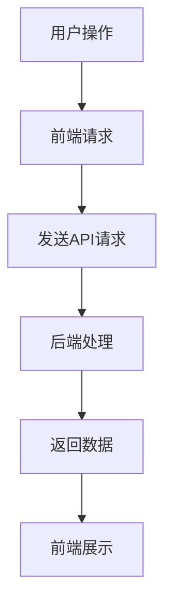

                 

Web前后端分离架构是现代软件开发领域的一种重要设计模式，它通过将网站的逻辑层（后端）与表示层（前端）分开，提高了系统的可维护性、扩展性和灵活性。本文将详细探讨Web前后端分离架构的设计与实现，旨在为开发者提供一种系统化的理解和实践路径。

## 文章关键词

- Web前后端分离
- 架构设计
- 跨平台开发
- RESTful API
- 单页应用
- 前端框架
- 后端框架

## 文章摘要

本文首先介绍了Web前后端分离架构的背景和重要性，然后详细阐述了前后端分离的核心概念、实现原理以及设计模式。接着，文章通过具体的算法原理、数学模型和项目实践，帮助开发者掌握前后端分离架构的设计与实现方法。最后，文章总结了当前的应用场景、未来发展趋势以及面临的挑战。

## 1. 背景介绍

### 1.1 Web开发的发展历程

Web开发经历了从静态页面到动态交互的演变过程。最早的Web应用主要是静态页面，开发者只需要编写HTML、CSS和JavaScript代码，将这些文件上传到服务器即可。随着互联网的发展，用户对互动性和个性化的需求逐渐增加，静态页面已经无法满足需求。于是，开发者开始探索动态网页技术，例如ASP、PHP等服务器端脚本语言。

进入21世纪，随着互联网技术的飞速发展，特别是移动互联网的普及，Web开发迎来了新的挑战和机遇。为了应对这些挑战，开发者提出了前后端分离的理念，即通过技术手段将前端和后端的开发工作分离开来，从而提高开发效率和系统可维护性。

### 1.2 前后端分离的必要性

1. **提升开发效率**：前后端分离使得前端和后端开发者可以独立工作，避免了传统模式下由于职责不明导致的协作困难，从而提高了开发效率。
   
2. **增强系统可维护性**：前后端分离使得系统的模块化程度更高，每个模块的职责更加明确，便于维护和升级。

3. **跨平台兼容性**：前后端分离架构能够更好地支持多种平台和设备的访问，增强了系统的兼容性和灵活性。

4. **优化用户体验**：前后端分离使得前端可以更快速地响应用户的需求，提升了用户体验。

## 2. 核心概念与联系

### 2.1 前端

前端通常指的是用户通过浏览器访问的网站或应用，主要包括HTML、CSS和JavaScript。前端的主要职责是接收用户的输入，将用户操作转化为请求，并将后端返回的数据呈现给用户。

### 2.2 后端

后端是指处理业务逻辑和数据处理的部分，通常由服务器端脚本语言（如Java、Python、Node.js等）编写。后端主要负责接收前端的请求，处理数据，并将结果返回给前端。

### 2.3 API接口

API（应用程序接口）是前后端分离架构的核心，它定义了前端与后端之间数据交互的规则。通过API接口，前端可以向后端发送请求，获取数据，然后在前端进行展示和处理。

### 2.4 Mermaid 流程图

以下是一个简化的Mermaid流程图，展示了前后端分离架构的基本流程：



## 3. 核心算法原理 & 具体操作步骤

### 3.1 算法原理概述

前后端分离架构的核心在于API接口的设计与实现。API接口是一种基于HTTP协议的数据交换方式，通常采用RESTful架构风格。RESTful API的设计原则包括资源标识、统一接口、状态转移、无状态等。

### 3.2 算法步骤详解

1. **用户操作**：用户在浏览器中进行操作，例如点击按钮、填写表单等。

2. **前端请求**：前端根据用户的操作，构造HTTP请求，将请求发送到后端。

3. **发送API请求**：后端服务器接收到前端请求后，根据请求的URL和HTTP方法，找到对应的API处理程序。

4. **后端处理**：后端处理程序根据请求的数据，执行相应的业务逻辑，如数据查询、数据插入等。

5. **返回数据**：后端将处理结果以JSON或XML格式返回给前端。

6. **前端展示**：前端接收到后端返回的数据后，将其渲染到页面上，供用户查看。

### 3.3 算法优缺点

#### 优点：

1. **模块化**：前后端分离使得系统模块化程度更高，便于维护和升级。

2. **灵活性**：前后端分离使得前端和后端可以独立开发，提高了系统的可扩展性。

3. **高性能**：通过优化前端代码和后端服务，可以显著提高系统的性能。

#### 缺点：

1. **复杂性**：前后端分离增加了系统的复杂性，需要更多的技术栈和工具支持。

2. **安全性**：API接口的安全性是前后端分离架构的一大挑战，需要采取相应的安全措施。

### 3.4 算法应用领域

前后端分离架构在Web应用开发中得到了广泛应用，如电商平台、社交网络、在线教育平台等。它可以支持多种开发模式，包括单页应用（SPA）、多页应用（MPA）等。

## 4. 数学模型和公式 & 详细讲解 & 举例说明

### 4.1 数学模型构建

在前后端分离架构中，我们可以使用一个简单的数学模型来描述数据流动过程。设\( X \)为用户输入，\( Y \)为后端处理结果，\( Z \)为前端展示结果，则有：

$$
X \rightarrow API \rightarrow Y \rightarrow 前端渲染 \rightarrow Z
$$

### 4.2 公式推导过程

首先，假设用户输入\( X \)是一个随机变量，其概率分布为\( P(X) \)。

当用户输入\( X \)时，前端生成一个请求\( R \)，其概率分布为\( P(R|X) \)。

后端接收到请求\( R \)后，根据请求的内容进行数据处理，得到一个结果\( Y \)，其概率分布为\( P(Y|R) \)。

最后，前端根据结果\( Y \)进行渲染，得到一个展示结果\( Z \)，其概率分布为\( P(Z|Y) \)。

### 4.3 案例分析与讲解

假设一个电商平台的后端服务接收到一个用户登录请求，其流程如下：

1. 用户在浏览器中输入用户名和密码，前端生成一个HTTP POST请求。

2. 前端请求发送到后端，后端接收到请求后，调用身份验证模块进行用户身份验证。

3. 身份验证成功后，后端返回用户信息（如用户ID、用户名等）。

4. 前端接收到用户信息后，将其渲染到页面上，显示用户的登录状态。

在这个案例中，\( X \)为用户输入（用户名和密码），\( Y \)为后端处理结果（用户信息），\( Z \)为前端展示结果（用户登录状态）。

## 5. 项目实践：代码实例和详细解释说明

### 5.1 开发环境搭建

在实现前后端分离架构时，我们通常需要搭建两个独立的环境：前端环境和后端环境。以下是一个基本的开发环境搭建步骤：

1. **前端环境**：

   - 安装Node.js和npm（Node.js的包管理工具）

   - 创建一个新的npm项目

   - 安装前端框架（如React、Vue等）

2. **后端环境**：

   - 安装Java或Python运行环境

   - 创建一个新的后端项目

   - 安装后端框架（如Spring Boot、Django等）

### 5.2 源代码详细实现

以下是一个简单的前后端分离架构示例，前端使用React，后端使用Spring Boot。

**前端代码（React）**：

```jsx
// components/LoginForm.js
import React, { useState } from 'react';
import axios from 'axios';

const LoginForm = () => {
  const [username, setUsername] = useState('');
  const [password, setPassword] = useState('');

  const handleSubmit = async (e) => {
    e.preventDefault();
    try {
      const response = await axios.post('/api/login', {
        username,
        password,
      });
      alert('登录成功');
    } catch (error) {
      alert('登录失败');
    }
  };

  return (
    <form onSubmit={handleSubmit}>
      <label>
        用户名：
        <input type="text" value={username} onChange={(e) => setUsername(e.target.value)} />
      </label>
      <label>
        密码：
        <input type="password" value={password} onChange={(e) => setPassword(e.target.value)} />
      </label>
      <button type="submit">登录</button>
    </form>
  );
};

export default LoginForm;
```

**后端代码（Spring Boot）**：

```java
// com.example.demo.controller.LoginController.java
import org.springframework.web.bind.annotation.PostMapping;
import org.springframework.web.bind.annotation.RequestBody;
import org.springframework.web.bind.annotation.RestController;

@RestController
public class LoginController {

  @PostMapping("/api/login")
  public String login(@RequestBody LoginRequest request) {
    // 身份验证逻辑
    if ("admin".equals(request.getUsername()) && "admin123".equals(request.getPassword())) {
      return "{\"status\": \"success\", \"user\": {\"id\": 1, \"username\": \"admin\"}}";
    } else {
      return "{\"status\": \"failure\"}";
    }
  }
}
```

### 5.3 代码解读与分析

在前端代码中，我们创建了一个简单的登录表单，通过axios库向后端发送HTTP POST请求。

在后端代码中，我们创建了一个RESTful API接口，用于接收前端发送的登录请求，并执行身份验证逻辑。

### 5.4 运行结果展示

1. **前端运行结果**：

   当用户在登录表单中输入正确的用户名和密码并提交时，前端会通过axios库向后端发送一个HTTP POST请求。请求成功后，会在弹窗中显示“登录成功”提示。

2. **后端运行结果**：

   后端接收到前端发送的登录请求后，会根据请求的内容执行身份验证逻辑。如果用户名和密码正确，后端会返回一个JSON格式的响应，表示登录成功。否则，返回登录失败。

## 6. 实际应用场景

### 6.1 电商平台

电商平台通常采用前后端分离架构，前端负责用户交互和页面渲染，后端负责数据处理和库存管理。通过API接口，前端可以获取商品信息、用户订单等数据。

### 6.2 社交网络

社交网络应用通常也采用前后端分离架构，前端负责用户的互动和消息推送，后端负责用户数据存储和消息处理。通过API接口，前端可以发送和接收用户消息，获取用户动态等。

### 6.3 在线教育平台

在线教育平台通常采用前后端分离架构，前端负责课程页面展示和学生互动，后端负责课程数据管理和学生成绩记录。通过API接口，前端可以获取课程信息、学生进度等数据。

## 6.4 未来应用展望

随着Web技术的不断进步，前后端分离架构在未来将得到更广泛的应用。以下是几个未来应用展望：

1. **微服务架构**：前后端分离架构与微服务架构结合，可以实现更灵活的系统架构，提高系统的可扩展性和可维护性。

2. **云计算与容器化**：随着云计算和容器化技术的发展，前后端分离架构可以更好地支持分布式部署和弹性扩展。

3. **智能化与大数据**：前后端分离架构可以与人工智能和大数据技术相结合，实现更智能化的Web应用。

## 7. 工具和资源推荐

### 7.1 学习资源推荐

1. 《JavaScript高级程序设计》

2. 《RESTful API设计》

3. 《Spring Boot实战》

### 7.2 开发工具推荐

1. Visual Studio Code

2. Postman

3. Git

### 7.3 相关论文推荐

1. "RESTful Web Services"

2. "Microservices: The New Architecture Style for Cloud-Enabled Apps"

3. "Frontend-Driven Development"

## 8. 总结：未来发展趋势与挑战

### 8.1 研究成果总结

前后端分离架构在现代Web开发中已经得到广泛应用，其模块化、灵活性和高性能的特点为开发者提供了极大的便利。通过API接口的设计和实现，前后端分离架构实现了前端和后端的解耦，提高了系统的可维护性和可扩展性。

### 8.2 未来发展趋势

1. **微服务与前后端分离**：微服务架构与前后端分离架构的结合将进一步提高系统的灵活性和可扩展性。

2. **云计算与容器化**：云计算和容器化技术的发展将推动前后端分离架构在分布式部署和弹性扩展方面的应用。

3. **智能化与大数据**：前后端分离架构与人工智能和大数据技术的结合将实现更智能化的Web应用。

### 8.3 面临的挑战

1. **安全性**：API接口的安全性问题是一个亟待解决的挑战。

2. **性能优化**：前后端分离架构需要针对性能进行优化，以满足高并发和高负载场景的需求。

3. **开发复杂性**：前后端分离架构增加了系统的复杂性，需要更多的技术栈和工具支持。

### 8.4 研究展望

未来，前后端分离架构将继续在Web开发领域发挥重要作用。通过不断探索新技术和优化现有架构，开发者可以构建出更加灵活、高效和智能的Web应用。

## 9. 附录：常见问题与解答

### 9.1 前后端分离与前后端一体化的区别

前后端分离与前后端一体化的主要区别在于开发模式的不同。前后端分离模式下，前端和后端分别独立开发，通过API接口进行数据交互；而前后端一体化模式下，前端和后端代码通常在同一项目中开发，通过文件上传的方式进行部署。

### 9.2 前后端分离架构的安全性如何保障

前后端分离架构的安全性可以通过以下措施进行保障：

1. **使用HTTPS**：使用HTTPS协议加密数据传输，确保数据传输的安全性。

2. **身份验证**：在API接口中加入身份验证机制，确保只有授权用户可以访问接口。

3. **输入验证**：对用户输入进行严格的验证，防止恶意输入。

4. **使用安全框架**：使用安全框架（如Spring Security）来处理安全问题。

### 9.3 前后端分离架构的性能优化方法

前后端分离架构的性能优化可以通过以下方法进行：

1. **缓存**：使用缓存技术（如Redis）减少数据库访问次数。

2. **异步处理**：使用异步处理技术（如异步IO）提高系统的并发性能。

3. **负载均衡**：使用负载均衡技术（如Nginx）分发请求，提高系统的处理能力。

4. **代码优化**：优化代码，减少不必要的数据库查询和计算操作。

---

以上是关于《Web前后端分离架构设计与实现》的完整文章。通过本文的介绍，相信读者已经对前后端分离架构有了更深入的理解，并能够运用到实际项目中。希望这篇文章能够为您的Web开发之路提供有益的参考。

---

**作者：禅与计算机程序设计艺术 / Zen and the Art of Computer Programming**

