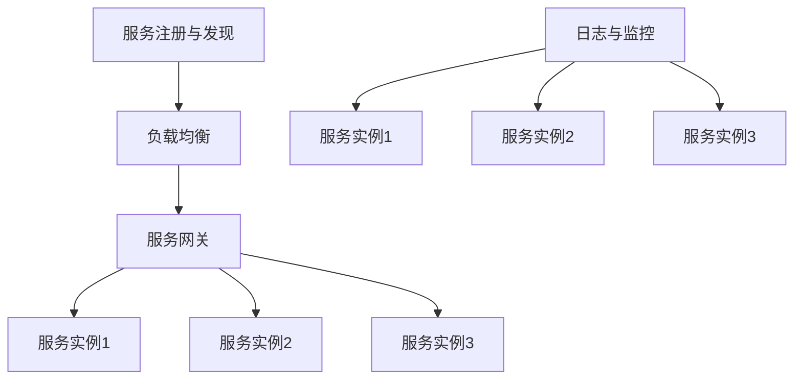

                 

  
> **关键词：** Web后端，微服务架构，设计模式，分布式系统，高可用性，性能优化  
>
> **摘要：** 本文旨在探讨Web后端微服务架构的设计原则、实现方法、以及在实际开发中的应用。通过深入分析微服务架构的特点和优势，结合具体实例，为开发者提供了一套全面而实用的微服务架构设计指南。

## 1. 背景介绍

在传统的单体架构中，整个系统通常由一个单一的代码库构成，所有功能模块都集成在一起。这种方式在系统规模较小时表现良好，但随着业务需求的增加和系统复杂度的提升，单体架构的弊端逐渐显现：

1. **维护困难**：随着代码库的庞大，维护和更新的难度也随之增加。
2. **部署复杂**：部署一个庞大的单体应用需要耗费大量时间和资源，而且容易出现部署失败的情况。
3. **扩展性差**：在需要增加新功能或优化现有功能时，必须对整个系统进行修改，导致开发和部署周期延长。

为了解决这些问题，微服务架构应运而生。微服务架构将应用程序拆分成一组小型的、独立部署的服务，每个服务负责一个特定的业务功能。这些服务通过轻量级的通信协议（如HTTP/REST、gRPC）进行交互。微服务架构的优点包括：

1. **高可维护性**：每个服务都是独立的，可以独立开发、测试和部署，降低了维护成本。
2. **高扩展性**：可以根据业务需求单独扩展某个服务，而不影响其他服务。
3. **高容错性**：某个服务的故障不会影响整个系统的运行，可以通过重试、限流等手段进行故障隔离和恢复。

本文将详细介绍微服务架构的设计原则、实现方法以及在实际开发中的应用，帮助开发者更好地理解和应用微服务架构。

## 2. 核心概念与联系

### 2.1 微服务的定义

微服务（Microservices）是一种软件开发方法，它将应用程序构建为一组小的、独立的服务，每个服务都有自己的业务逻辑和数据库。这些服务通过轻量级通信协议进行交互，如HTTP/REST、gRPC等。

### 2.2 微服务与传统单体架构的区别

**1. 技术栈独立**

在微服务架构中，每个服务可以采用不同的编程语言和技术栈，而传统单体架构通常要求所有功能模块使用相同的编程语言和技术栈。

**2. 数据库独立**

微服务架构中，每个服务都有自己的数据库，这样可以避免数据一致性问题。而在单体架构中，通常使用共享数据库，这可能导致数据一致性和并发性问题。

**3. 独立部署**

在微服务架构中，每个服务可以独立部署和扩展，这样可以提高部署效率和系统容错性。而在传统单体架构中，整个系统需要一起部署，部署复杂度较高。

### 2.3 微服务架构的组成部分

1. **服务注册与发现**：服务注册与发现是微服务架构的核心组件，它负责管理服务的注册和发现，确保服务之间的通信。

2. **负载均衡**：负载均衡器负责将客户端请求分发到多个服务实例上，以提高系统的吞吐量和可用性。

3. **服务网关**：服务网关负责接收客户端请求，并将其转发到相应的服务实例上。此外，服务网关还可以提供路由、安全认证等功能。

4. **配置中心**：配置中心负责管理服务的配置信息，确保各个服务实例使用相同的配置。

5. **日志与监控**：日志与监控组件负责记录服务的运行日志，并对服务进行监控和报警。

### 2.4 微服务架构的 Mermaid 流程图



## 3. 核心算法原理 & 具体操作步骤

### 3.1 算法原理概述

微服务架构的设计原则主要包括：

1. **解耦**：通过将应用程序拆分为小的、独立的模块，减少模块之间的依赖关系，提高系统的可维护性和可扩展性。
2. **自治**：每个服务拥有独立的开发、测试和部署流程，可以独立运行和扩展，降低了系统的复杂度。
3. **异步通信**：服务之间通过异步通信进行交互，可以降低系统的延迟和负载，提高系统的吞吐量和可靠性。

### 3.2 算法步骤详解

1. **服务拆分**：根据业务需求，将应用程序拆分为多个小的、独立的模块。
2. **服务注册与发现**：将服务注册到服务注册中心，并从服务注册中心发现其他服务的地址。
3. **负载均衡**：使用负载均衡器将客户端请求分发到多个服务实例上。
4. **服务调用**：通过HTTP/REST或gRPC等通信协议调用其他服务。
5. **配置管理**：使用配置中心管理服务的配置信息。
6. **日志与监控**：记录服务的运行日志，并对服务进行监控和报警。

### 3.3 算法优缺点

**优点：**

1. **高可维护性**：每个服务都是独立的，可以独立开发、测试和部署，降低了维护成本。
2. **高扩展性**：可以根据业务需求单独扩展某个服务，而不影响其他服务。
3. **高容错性**：某个服务的故障不会影响整个系统的运行，可以通过重试、限流等手段进行故障隔离和恢复。

**缺点：**

1. **系统复杂性增加**：需要管理多个服务实例、服务间通信、服务注册与发现等，增加了系统的复杂性。
2. **分布式事务管理困难**：在需要跨服务的事务处理时，需要进行分布式事务管理，增加了系统的复杂度。

### 3.4 算法应用领域

微服务架构广泛应用于电子商务、在线支付、社交媒体、物流跟踪等领域。这些领域通常具有高并发、高可扩展性和高可用性的需求，微服务架构可以很好地满足这些需求。

## 4. 数学模型和公式 & 详细讲解 & 举例说明

### 4.1 数学模型构建

在微服务架构中，可以使用状态机模型来描述服务的状态转换和事件处理。状态机模型包括以下关键要素：

1. **状态（State）**：表示服务的当前状态，如运行、故障、待部署等。
2. **事件（Event）**：表示触发状态转换的原因，如服务启动、故障恢复、部署完成等。
3. **转移（Transition）**：表示状态之间的转换关系，如从运行状态转换为故障状态。

### 4.2 公式推导过程

状态机模型的数学模型可以表示为：

\[ S = \{ s_1, s_2, ..., s_n \} \] （状态集合）

\[ E = \{ e_1, e_2, ..., e_m \} \] （事件集合）

\[ T = \{ (s_i, e_j, s_k) \mid s_i \rightarrow s_k \text{ when } e_j \text{ occurs} \} \] （转移关系）

### 4.3 案例分析与讲解

假设一个简单的微服务状态机模型，包括以下状态和事件：

- **状态**：运行（Running）、故障（Faulty）、待部署（Pending）
- **事件**：启动（Start）、故障恢复（FaultyRecovery）、部署完成（Deployed）

状态机模型可以表示为：

\[ S = \{ Running, Faulty, Pending \} \]

\[ E = \{ Start, FaultyRecovery, Deployed \} \]

\[ T = \{ (Running, Start, Running), (Faulty, FaultyRecovery, Running), (Pending, Deployed, Running) \} \]

当服务处于运行状态时，接收到启动事件后会继续运行。当服务处于故障状态时，接收到故障恢复事件后会恢复到运行状态。当服务处于待部署状态时，接收到部署完成事件后会变为运行状态。

### 4.4 案例分析与讲解

#### 示例 1：服务启动过程

假设服务处于待部署状态，接收到启动事件。根据状态机模型，服务将转换到运行状态。具体步骤如下：

1. 服务接收到启动事件。
2. 服务根据状态机模型判断当前状态为待部署。
3. 服务调用启动逻辑，开始执行启动流程。
4. 启动流程完成后，服务状态从待部署转换为运行状态。

#### 示例 2：服务故障恢复过程

假设服务处于故障状态，接收到故障恢复事件。根据状态机模型，服务将恢复到运行状态。具体步骤如下：

1. 服务接收到故障恢复事件。
2. 服务根据状态机模型判断当前状态为故障。
3. 服务调用故障恢复逻辑，尝试修复故障。
4. 故障恢复逻辑执行完成后，服务状态从故障转换为运行状态。

## 5. 项目实践：代码实例和详细解释说明

### 5.1 开发环境搭建

为了实现微服务架构，我们需要搭建一个开发环境。以下是一个基本的开发环境搭建步骤：

1. 安装Java环境：在服务器上安装Java SDK，确保版本不低于Java 8。
2. 安装Maven：Maven是Java项目的构建工具，用于管理项目的依赖和构建过程。
3. 安装Docker：Docker是一个开源的容器引擎，用于打包、交付和运行应用。
4. 安装Kubernetes：Kubernetes是一个开源的容器编排平台，用于管理容器化的应用程序。
5. 安装Nginx：Nginx是一个高性能的HTTP和反向代理服务器，用于实现负载均衡和服务网关。

### 5.2 源代码详细实现

以下是一个简单的微服务项目示例，该示例包括用户服务（UserService）和订单服务（OrderService）。

#### 用户服务（UserService）

1. **用户服务接口**：定义用户服务的接口，包括注册、登录和查询用户信息等功能。

```java
public interface UserService {
    User register(User user);
    User login(String username, String password);
    User getUserById(Long userId);
}
```

2. **用户服务实现**：实现用户服务的接口，使用Spring Boot框架开发。

```java
@Service
public class UserServiceImpl implements UserService {
    private final UserRepository userRepository;

    @Autowired
    public UserServiceImpl(UserRepository userRepository) {
        this.userRepository = userRepository;
    }

    @Override
    public User register(User user) {
        // 注册用户逻辑
    }

    @Override
    public User login(String username, String password) {
        // 登录用户逻辑
    }

    @Override
    public User getUserById(Long userId) {
        // 查询用户逻辑
    }
}
```

3. **用户服务主类**：创建用户服务的主类，配置服务注册和发现。

```java
@SpringBootApplication
@EnableDiscoveryClient
public class UserServiceApplication {
    public static void main(String[] args) {
        SpringApplication.run(UserServiceApplication.class, args);
    }
}
```

#### 订单服务（OrderService）

1. **订单服务接口**：定义订单服务的接口，包括创建订单、查询订单和取消订单等功能。

```java
public interface OrderService {
    Order createOrder(Order order);
    Order getOrderById(Long orderId);
    void cancelOrder(Long orderId);
}
```

2. **订单服务实现**：实现订单服务的接口，使用Spring Boot框架开发。

```java
@Service
public class OrderServiceImpl implements OrderService {
    private final OrderRepository orderRepository;

    @Autowired
    public OrderServiceImpl(OrderRepository orderRepository) {
        this.orderRepository = orderRepository;
    }

    @Override
    public Order createOrder(Order order) {
        // 创建订单逻辑
    }

    @Override
    public Order getOrderById(Long orderId) {
        // 查询订单逻辑
    }

    @Override
    public void cancelOrder(Long orderId) {
        // 取消订单逻辑
    }
}
```

3. **订单服务主类**：创建订单服务的主类，配置服务注册和发现。

```java
@SpringBootApplication
@EnableDiscoveryClient
public class OrderServiceApplication {
    public static void main(String[] args) {
        SpringApplication.run(OrderServiceApplication.class, args);
    }
}
```

### 5.3 代码解读与分析

在用户服务和订单服务中，我们使用了Spring Boot框架进行开发。Spring Boot是一个基于Spring的快速开发框架，它简化了Spring应用的配置和部署过程。

1. **服务接口**：服务接口定义了服务的功能和方法，是服务开发的基础。
2. **服务实现**：服务实现类实现了服务接口中的方法，实现了具体的业务逻辑。
3. **主类**：主类使用了`@SpringBootApplication`注解，表示这是一个Spring Boot应用程序。同时，使用了`@EnableDiscoveryClient`注解，表示开启服务注册和发现功能。

### 5.4 运行结果展示

通过Spring Boot的`SpringApplication.run()`方法启动用户服务和订单服务后，可以使用以下命令进行服务测试：

```shell
curl http://localhost:8080/users/register \
    -d 'username=user1&password=user1&email=user1@example.com'
```

该命令将发送一个注册请求到用户服务，并返回注册结果。

## 6. 实际应用场景

### 6.1 在线购物平台

在线购物平台通常具有高并发、高可用性和高扩展性的需求。使用微服务架构可以更好地满足这些需求：

1. **用户服务**：处理用户注册、登录和查询等功能。
2. **商品服务**：处理商品信息管理、库存管理等功能。
3. **订单服务**：处理订单创建、查询和取消等功能。
4. **支付服务**：处理支付功能，如支付请求、支付结果通知等。

### 6.2 物流跟踪系统

物流跟踪系统需要实时处理大量物流信息，并确保数据的一致性和准确性。使用微服务架构可以实现以下功能：

1. **订单服务**：处理订单创建、更新和取消等功能。
2. **物流服务**：处理物流信息查询、跟踪和更新等功能。
3. **库存服务**：处理库存信息查询和更新等功能。

### 6.3 社交媒体平台

社交媒体平台通常具有海量用户和海量数据，需要保证系统的可扩展性和高可用性。使用微服务架构可以实现以下功能：

1. **用户服务**：处理用户注册、登录和查询等功能。
2. **内容服务**：处理内容发布、查询和删除等功能。
3. **评论服务**：处理评论发布、查询和删除等功能。
4. **消息服务**：处理消息发送、查询和删除等功能。

## 7. 工具和资源推荐

### 7.1 学习资源推荐

1. **《微服务设计》**：由Martin Fowler和Mike Malone合著的一本关于微服务架构的经典书籍，涵盖了微服务架构的设计原则、实现方法和应用案例。
2. **《Spring Cloud微服务实战》**：由重点介绍了如何使用Spring Cloud框架实现微服务架构，包括服务注册与发现、负载均衡、配置管理等方面的内容。

### 7.2 开发工具推荐

1. **Docker**：用于容器化应用程序，便于部署和扩展。
2. **Kubernetes**：用于容器编排，实现自动化部署、扩展和管理。
3. **Spring Boot**：用于快速开发微服务应用程序，提供了丰富的组件和功能。

### 7.3 相关论文推荐

1. **"Microservices: Designing the Applications of the Future"**：由Martin Fowler发表的一篇关于微服务架构的论文，详细介绍了微服务架构的设计原则和实践经验。
2. **"Building Microservices"**：由Sam Newman发表的一篇关于微服务架构的论文，涵盖了微服务架构的各个方面，包括设计、实现和部署等。

## 8. 总结：未来发展趋势与挑战

### 8.1 研究成果总结

微服务架构在近年来得到了广泛的应用和认可，成为软件开发领域的重要方向。通过拆分大型单体应用为小型服务，微服务架构提高了系统的可维护性、可扩展性和容错性。同时，微服务架构也带来了一些新的挑战，如服务间通信、分布式事务管理、服务治理等。

### 8.2 未来发展趋势

1. **服务网格（Service Mesh）**：服务网格是一种用于管理服务间通信和安全的独立基础设施层。随着服务数量的增加，服务网格将成为微服务架构的重要组件。
2. **容器化与云原生**：容器化和云原生技术的快速发展将推动微服务架构的进一步优化和普及。例如，Kubernetes等容器编排平台将更好地支持微服务架构的部署和管理。
3. **智能化与自动化**：随着人工智能和机器学习技术的发展，微服务架构中的服务治理、监控和优化将更加智能化和自动化。

### 8.3 面临的挑战

1. **服务间通信**：微服务架构中的服务间通信涉及多个网络协议和消息中间件，如何保证通信的可靠性、高效性和安全性是一个重要的挑战。
2. **分布式事务管理**：分布式事务管理是实现数据一致性的关键。如何在多个服务之间实现分布式事务，同时保证性能和可扩展性是一个复杂的问题。
3. **服务治理**：随着服务数量的增加，如何有效地管理和监控大量服务成为一个挑战。服务治理需要解决服务注册与发现、负载均衡、故障恢复等问题。

### 8.4 研究展望

未来，微服务架构将在以下几个方面取得突破：

1. **服务自动化**：通过自动化工具和平台，实现服务的自动化部署、扩展和管理。
2. **服务智能化**：利用人工智能和机器学习技术，实现对服务性能的实时监控和优化。
3. **服务安全**：加强对服务间通信和安全性的保护，防止服务被攻击和数据泄露。

## 9. 附录：常见问题与解答

### Q1. 微服务架构与传统单体架构的区别是什么？

**A1.** 微服务架构与传统单体架构的主要区别在于：

1. **技术栈独立**：微服务架构允许每个服务采用不同的编程语言和技术栈，而传统单体架构要求所有功能模块使用相同的编程语言和技术栈。
2. **数据库独立**：微服务架构中，每个服务都有自己的数据库，避免了数据一致性问题，而传统单体架构通常使用共享数据库。
3. **部署独立**：微服务架构中，每个服务可以独立部署和扩展，提高了系统的可维护性和可扩展性，而传统单体架构需要一起部署所有功能模块。

### Q2. 微服务架构中的服务如何通信？

**A2.** 微服务架构中的服务通常通过以下方式进行通信：

1. **HTTP/REST**：使用HTTP/REST协议进行简单的文本通信，适用于大多数服务间通信场景。
2. **gRPC**：基于Protocol Buffers的二进制通信协议，适用于高性能、低延迟的服务间通信。
3. **消息队列**：使用消息队列（如RabbitMQ、Kafka）进行异步通信，适用于需要解耦的场景。

### Q3. 微服务架构中的服务治理是什么？

**A3.** 微服务架构中的服务治理是指对服务进行监控、管理和优化的过程，包括：

1. **服务注册与发现**：服务启动时向服务注册中心注册，其他服务可以通过服务注册中心发现服务的地址。
2. **负载均衡**：根据服务实例的负载情况，将请求均匀地分发到不同的服务实例上。
3. **故障恢复**：在服务发生故障时，自动将请求转移到其他可用实例，确保系统的可用性。
4. **日志与监控**：记录服务的运行日志，并对服务进行实时监控和报警。

### Q4. 微服务架构中的分布式事务管理如何实现？

**A4.** 分布式事务管理是微服务架构中的一项重要挑战。常见的分布式事务管理策略包括：

1. **最终一致性强**：通过消息队列实现最终一致性的分布式事务，例如两阶段提交协议。
2. **本地事务性**：每个服务使用本地事务，避免跨服务的分布式事务，适用于对一致性要求不高的场景。
3. **补偿事务**：在分布式事务失败时，通过补偿事务进行数据回滚，确保数据的一致性。

## 10. 参考文献

1. Fowler, M. (2014). "Microservices: Designing the Applications of the Future." https://martinfowler.com/microservices/
2. Newman, S. (2015). "Building Microservices." https://www.oreilly.com/library/view/building-microservices/9781449371936/
3. Bolding, L. (2017). "Spring Cloud微服务实战." 机械工业出版社。
4. Hietala, A., et al. (2018). "Service Mesh: A Common Abstraction for Managing Service Topologies." https://istio.io/docs/what-is-istio/

