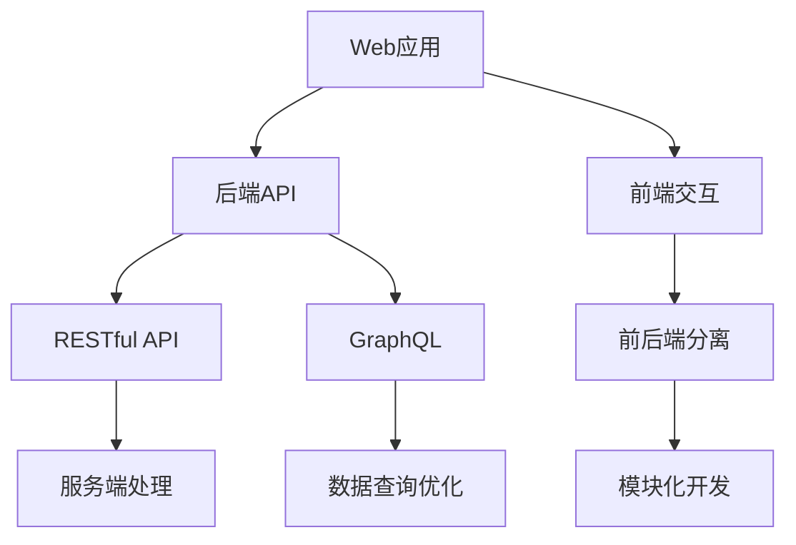

                 

关键词：Web应用架构、后端API、前端交互、微服务架构、RESTful API、GraphQL、前后端分离、模块化开发、性能优化、安全性

摘要：本文将深入探讨Web应用架构的各个方面，从后端API的设计到前端交互的实现，结合实际项目经验，提供一系列的专业见解和实用建议。我们将详细分析微服务架构的优势，对比RESTful API与GraphQL的差异，探讨前后端分离的实践方法，并介绍模块化开发的重要性。此外，文章还将涉及性能优化策略、安全性考虑，以及未来应用展望。通过阅读本文，您将对Web应用架构有一个全面而深入的理解。

## 1. 背景介绍

在数字化时代的浪潮中，Web应用已经成为企业和个人获取信息、互动交流、提供服务的重要平台。随着用户需求的日益多样化和复杂化，Web应用的开发和维护也面临着巨大的挑战。为了应对这些挑战，构建高效、可扩展和易于维护的Web应用架构变得至关重要。

Web应用架构的设计不仅仅是技术层面的选择，它还涉及到业务需求的理解、用户体验的优化、系统性能的保障等多个方面。因此，本文将从多个角度对Web应用架构进行深入探讨，旨在帮助开发者构建更加强大和灵活的应用系统。

本文的主要内容包括：

1. **核心概念与联系**：我们将介绍Web应用架构中的核心概念，如微服务、RESTful API、GraphQL等，并通过Mermaid流程图展示它们之间的联系。
2. **核心算法原理与具体操作步骤**：我们将详细解析一些关键的算法原理，并给出具体的操作步骤，以便开发者更好地理解和实践。
3. **数学模型和公式**：为了深入理解某些概念和算法，我们将使用数学模型和公式进行详细讲解，并举例说明。
4. **项目实践**：通过具体的代码实例，我们将展示如何实现Web应用架构中的关键部分，并提供详细的解释和分析。
5. **实际应用场景**：我们将探讨Web应用架构在现实世界中的应用场景，并分析其未来发展前景。
6. **工具和资源推荐**：我们将推荐一些有用的学习资源和开发工具，帮助开发者更好地掌握Web应用架构的相关知识。
7. **总结与展望**：在文章的最后，我们将对研究成果进行总结，探讨未来的发展趋势和挑战，并提出研究展望。

通过本文的阅读，读者将能够全面理解Web应用架构的各个方面，为实际项目的开发提供有力的理论支持和实践经验。

## 2. 核心概念与联系

在探讨Web应用架构之前，我们需要明确几个核心概念，并理解它们之间的相互关系。以下是Web应用架构中的几个关键概念：

### 微服务

微服务是一种架构风格，它主张将大型应用程序分解为多个小型、独立的服务。每个微服务负责一个特定的功能，可以独立部署、扩展和更新，从而提高了系统的灵活性和可维护性。

微服务的优点包括：

- **高内聚、低耦合**：每个微服务都围绕一个单一的业务功能构建，降低了服务之间的依赖。
- **独立部署和扩展**：可以独立部署和扩展单个服务，而不影响其他服务。
- **故障隔离**：单个服务的故障不会影响到整个系统。

然而，微服务也带来了一些挑战，如服务发现、配置管理和网络通信复杂性等。

### RESTful API

RESTful API（Representational State Transfer API）是一种设计Web服务的标准方法。它通过HTTP协议的GET、POST、PUT、DELETE等方法来操作资源，遵循统一接口的原则，使服务更加直观和易于使用。

RESTful API的主要特点包括：

- **无状态**：服务器不保留客户端的任何状态信息。
- **统一接口**：使用标准HTTP方法操作统一接口。
- **资源导向**：资源是API的核心，每个资源都有唯一的URL。
- **支持多种数据格式**：如JSON、XML等。

### GraphQL

GraphQL是一种用于API查询的查询语言和运行时，它提供了一种更灵活的方法来获取数据。与RESTful API不同，GraphQL允许客户端指定需要的数据结构，从而减少了过度请求和冗余数据。

GraphQL的主要特点包括：

- **灵活的数据查询**：客户端可以精确地指定需要的数据字段，减少数据传输量。
- **减少端点数量**：相比于RESTful API，GraphQL通常只需要较少的端点。
- **强类型系统**：通过强类型系统提高了API的可读性和稳定性。

### 前后端分离

前后端分离是一种开发模式，它将Web应用的展示逻辑和数据处理逻辑分开。前端负责与用户交互，后端负责数据处理和存储。

前后端分离的优点包括：

- **模块化开发**：前后端可以独立开发和部署，提高了开发效率。
- **易于维护**：前后端分离使得系统更加模块化，便于维护和升级。
- **支持多种客户端**：后端服务可以同时服务于多个前端客户端，如Web、移动应用等。

### Mermaid流程图

为了更好地理解这些概念之间的联系，我们可以使用Mermaid流程图进行展示。



通过上述核心概念和Mermaid流程图，我们可以看到Web应用架构的各个部分是如何相互联系和作用的。在接下来的章节中，我们将深入探讨这些概念的具体实现和实际应用。

## 3. 核心算法原理 & 具体操作步骤

在构建Web应用架构时，核心算法的选择和实现是关键的一步。在本节中，我们将介绍几个关键算法的原理，并详细说明如何实现这些算法。

### 3.1 算法原理概述

#### 1. 缓存算法

缓存算法用于优化数据访问速度，它通过在内存中存储频繁访问的数据来减少对后端数据库的查询次数。常见的缓存算法包括最近最少使用（LRU）、最少访问（LFU）和最不经常使用（LFU）等。

#### 2. 负载均衡算法

负载均衡算法用于将请求分配到多个服务器，以避免单个服务器过载。常见的负载均衡算法包括轮询、最少连接、哈希等。

#### 3. 数据分片算法

数据分片算法用于将大规模数据分散存储到多个数据库实例中，以提高查询性能和系统容错能力。常见的分片算法包括基于哈希的分片、基于范围的分片和复合分片等。

### 3.2 算法步骤详解

#### 1. 缓存算法步骤

- **初始化缓存**：创建一个缓存数据结构，如哈希表或链表。
- **缓存查询**：当收到查询请求时，首先在缓存中查找数据。
  - 如果数据存在，直接返回缓存中的数据。
  - 如果数据不存在，查询后端数据库，并将数据缓存起来。
- **缓存更新**：当数据发生变化时，更新缓存中的数据。
- **缓存替换**：当缓存容量达到上限时，根据某种策略（如LRU）替换缓存中的数据。

#### 2. 负载均衡算法步骤

- **初始化负载均衡器**：创建负载均衡器数据结构，如哈希表或队列。
- **接收请求**：当收到请求时，将其分配到服务器。
  - 轮询算法：按顺序将请求分配到每个服务器。
  - 最少连接算法：将请求分配到当前连接数最少的服务器。
  - 哈希算法：使用请求的哈希值将请求分配到服务器。
- **监控服务器状态**：定期检查服务器的状态，如响应时间、负载等，并根据情况调整负载均衡策略。

#### 3. 数据分片算法步骤

- **初始化分片**：将数据集根据某种策略（如哈希）分为多个分片。
- **分片存储**：将每个分片存储到不同的数据库实例中。
- **查询优化**：当收到查询请求时，将查询分解为多个分片查询，并将结果合并。
- **分片迁移**：当某个分片的数据量过大或性能不佳时，可以将其迁移到其他数据库实例。

### 3.3 算法优缺点

#### 1. 缓存算法

- **优点**：
  - 提高数据访问速度，减少数据库查询次数。
  - 降低数据库负载，延长数据库使用寿命。
- **缺点**：
  - 需要额外的存储空间。
  - 数据的一致性问题（如缓存击穿、缓存雪崩等）。

#### 2. 负载均衡算法

- **优点**：
  - 提高系统性能，避免单点过载。
  - 提高系统的可用性和容错能力。
- **缺点**：
  - 增加系统的复杂度，如网络通信开销、服务器状态监控等。
  - 需要配置多个服务器，提高运维成本。

#### 3. 数据分片算法

- **优点**：
  - 提高查询性能，减少单点瓶颈。
  - 提高系统的容错能力，降低数据丢失风险。
- **缺点**：
  - 需要处理分片间的数据一致性。
  - 需要处理分片迁移和分片合并等复杂操作。

### 3.4 算法应用领域

- **缓存算法**：广泛应用于Web应用、电子商务、搜索引擎等领域，以提高数据访问速度和系统性能。
- **负载均衡算法**：广泛应用于分布式系统、云服务、互联网应用等领域，以提高系统的可用性和性能。
- **数据分片算法**：广泛应用于大数据处理、分布式数据库、NoSQL数据库等领域，以提高系统的性能和容错能力。

通过上述算法的详细介绍，开发者可以更好地理解其在Web应用架构中的作用和实现方式。在接下来的章节中，我们将继续探讨数学模型和公式在Web应用架构中的应用。

### 4. 数学模型和公式 & 详细讲解 & 举例说明

在Web应用架构中，数学模型和公式是理解某些算法和系统行为的关键工具。在这一节中，我们将介绍一些重要的数学模型和公式，并详细讲解其构建过程和实际应用。

#### 4.1 数学模型构建

数学模型是抽象现实世界问题的一种方式，通过使用数学符号和公式来描述问题的各个方面。构建数学模型通常涉及以下步骤：

1. **定义变量和参数**：根据问题需求，定义相关变量和参数，如数据量、速率、容量等。
2. **建立关系式**：通过逻辑推理和实际观察，建立变量和参数之间的关系式，如线性方程、非线性方程、微分方程等。
3. **验证模型**：通过实际数据或模拟测试，验证数学模型的有效性和准确性。
4. **优化模型**：根据验证结果，对数学模型进行调整和优化，以提高其预测能力和实用性。

#### 4.2 公式推导过程

以下是一个简单的例子：假设一个Web应用系统的响应时间（R）与请求数量（Q）和系统处理能力（P）之间存在如下关系：

\[ R = \frac{Q}{P} \]

其中，R表示系统平均响应时间（单位：秒），Q表示单位时间内到达系统的请求数量（单位：请求/秒），P表示系统的处理能力（单位：请求/秒）。

这个公式的推导过程如下：

1. **定义变量**：
   - \( R \)：系统平均响应时间。
   - \( Q \)：单位时间内到达系统的请求数量。
   - \( P \)：系统的处理能力。

2. **建立关系式**：
   - 假设系统完全处于稳定状态，即请求数量与处理能力相等。
   - 在单位时间内，系统处理完所有请求数量所需的时间即为响应时间。

3. **验证公式**：
   - 当 \( Q = P \) 时，\( R = 1 \)（秒），即系统响应时间为1秒。
   - 当 \( Q < P \) 时，响应时间 \( R \) 会减小。
   - 当 \( Q > P \) 时，响应时间 \( R \) 会增大。

4. **优化公式**：
   - 通过增加系统的处理能力 \( P \)，可以降低系统的平均响应时间 \( R \)。
   - 通过减少请求数量 \( Q \)，也可以降低系统的平均响应时间 \( R \)。

#### 4.3 案例分析与讲解

以下是一个具体的案例：假设一个电商网站在促销期间，预计会有1000个请求每秒到达系统，而系统的处理能力为500个请求每秒。使用上述公式，我们可以计算系统的平均响应时间。

根据公式 \( R = \frac{Q}{P} \)：

\[ R = \frac{1000}{500} = 2 \]

这意味着在促销期间，该电商网站的响应时间大约为2秒。显然，这是一个不理想的情况，因为用户通常期望在1秒内得到响应。

为了优化系统性能，我们可以采取以下措施：

1. **增加处理能力**：通过部署更多服务器或优化现有服务器性能，将系统的处理能力提升到1000个请求每秒。
2. **优化系统架构**：通过使用缓存、负载均衡等算法，提高系统的整体性能。
3. **限制请求流量**：通过限制请求流量，如限制用户同时登录的数量，减少系统的负载。

通过上述分析和优化措施，我们可以显著提高系统的响应时间，提升用户体验。

通过数学模型和公式的构建、推导和应用，开发者可以更好地理解和优化Web应用架构中的系统行为。在接下来的章节中，我们将通过具体的代码实例，进一步展示如何实现和优化Web应用架构。

### 5. 项目实践：代码实例和详细解释说明

在理论探讨的基础上，本节将通过具体的代码实例，展示Web应用架构中的关键部分，并提供详细的解释和分析。我们将分为以下几个部分进行说明：

#### 5.1 开发环境搭建

首先，我们需要搭建一个开发环境，以便进行Web应用架构的相关实践。以下是推荐的开发环境和工具：

- **开发语言**：Node.js（后端）、React（前端）
- **数据库**：MongoDB（NoSQL数据库）
- **版本控制**：Git
- **项目管理**：NPM（Node Package Manager）

安装步骤如下：

1. 安装Node.js：从官网（https://nodejs.org/）下载并安装Node.js。
2. 安装MongoDB：从官网（https://www.mongodb.com/）下载并安装MongoDB。
3. 设置Git：从官网（https://git-scm.com/）下载并安装Git。
4. 安装React：在命令行中运行以下命令安装React：
   ```bash
   npm install -g create-react-app
   create-react-app my-web-app
   cd my-web-app
   npm start
   ```

#### 5.2 源代码详细实现

我们以一个简单的电商Web应用为例，展示后端API和前端交互的实现过程。

**后端API实现**

我们使用Node.js和Express框架来实现后端API。以下是API的实现代码：

```javascript
// app.js
const express = require('express');
const mongoose = require('mongoose');
const bodyParser = require('body-parser');

const app = express();

// 连接MongoDB数据库
const mongoUrl = 'mongodb://localhost:27017/ecommerce';
mongoose.connect(mongoUrl, { useNewUrlParser: true, useUnifiedTopology: true });

// 创建数据模型
const Product = mongoose.model('Product', new mongoose.Schema({
  name: String,
  price: Number,
  category: String
}));

// 定义路由
app.use(bodyParser.json());
app.get('/api/products', async (req, res) => {
  try {
    const products = await Product.find({});
    res.status(200).json(products);
  } catch (error) {
    res.status(500).json({ message: '服务器内部错误' });
  }
});

app.post('/api/products', async (req, res) => {
  try {
    const product = new Product(req.body);
    await product.save();
    res.status(201).json(product);
  } catch (error) {
    res.status(400).json({ message: '无效的请求' });
  }
});

// 启动服务器
const PORT = process.env.PORT || 3000;
app.listen(PORT, () => {
  console.log(`服务器运行在端口 ${PORT}`);
});
```

**前端交互实现**

我们使用React和Axios来实现前端与后端API的交互。以下是React组件的实现代码：

```javascript
// ProductList.js
import React, { useState, useEffect } from 'react';
import axios from 'axios';

const ProductList = () => {
  const [products, setProducts] = useState([]);

  useEffect(() => {
    const fetchProducts = async () => {
      try {
        const response = await axios.get('/api/products');
        setProducts(response.data);
      } catch (error) {
        console.error('获取商品列表失败：', error);
      }
    };

    fetchProducts();
  }, []);

  return (
    <div>
      <h2>商品列表</h2>
      <ul>
        {products.map((product) => (
          <li key={product._id}>
            {product.name} - {product.price}元
          </li>
        ))}
      </ul>
    </div>
  );
};

export default ProductList;
```

#### 5.3 代码解读与分析

**后端API解读**

1. **连接MongoDB数据库**：使用`mongoose.connect`连接到本地MongoDB数据库。
2. **创建数据模型**：使用`mongoose.model`创建`Product`模型，定义商品的基本属性（名称、价格、类别）。
3. **定义路由**：使用Express框架定义GET和POST路由，用于获取商品列表和创建新商品。
   - GET `/api/products`：返回所有商品列表。
   - POST `/api/products`：创建新商品并保存到数据库。

**前端交互解读**

1. **状态管理**：使用React的`useState`和`useEffect`钩子管理商品列表的状态。
2. **数据获取**：使用`axios`发起GET请求，从后端API获取商品列表，并更新状态。
3. **渲染商品列表**：使用`map`函数遍历商品列表，并渲染为列表项。

#### 5.4 运行结果展示

1. **后端API测试**：

   - 使用Postman工具测试后端API：

     - GET请求：`http://localhost:3000/api/products`，返回所有商品列表。

     - POST请求：`http://localhost:3000/api/products`，提交新商品数据，如`{"name": "iPhone 13", "price": 5999, "category": "手机"}`，创建新商品并返回其详细信息。

2. **前端页面展示**：

   - 使用React开发工具启动前端应用，访问`http://localhost:3000`，展示商品列表页面。

   - 在页面中显示所有商品，包括名称和价格。

通过上述代码实例，我们展示了如何实现Web应用架构中的后端API和前端交互。在实际项目中，根据业务需求，可以进一步扩展和优化这些代码，以满足更高的性能和安全性要求。

### 6. 实际应用场景

在了解了Web应用架构的基本概念和实现方法后，我们接下来将探讨Web应用架构在现实世界中的实际应用场景。这些场景包括电子商务、社交媒体、在线教育、金融科技等领域。通过分析这些应用场景，我们可以更好地理解Web应用架构的重要性，并探索其未来发展的趋势。

#### 6.1 电子商务

电子商务是Web应用架构的一个重要应用场景。电商平台需要处理大量的商品信息、用户数据和交易记录，因此需要构建一个高效、可扩展和安全的系统。以下是一些关键应用点：

- **商品管理**：电商平台需要管理大量商品信息，如名称、价格、库存等。通过RESTful API或GraphQL，可以方便地实现商品信息的查询、创建和更新。
- **用户管理**：用户是电商平台的核心，因此需要构建一个安全的用户管理系统。使用OAuth2.0等认证协议，可以确保用户的身份验证和数据安全。
- **订单处理**：电商平台需要处理大量的订单，包括生成订单、支付处理、发货和售后等。通过微服务架构，可以将订单处理分解为多个独立的服务，提高系统的可维护性和扩展性。
- **性能优化**：电商平台通常面临高并发和大数据的挑战。通过缓存、负载均衡和数据分片等策略，可以显著提高系统的性能和响应速度。

#### 6.2 社交媒体

社交媒体平台是另一个典型的Web应用架构应用场景。社交媒体平台需要处理海量的用户数据、内容和实时消息，同时提供良好的用户体验。以下是一些关键应用点：

- **用户交互**：社交媒体平台的核心功能包括发布内容、评论、点赞等。通过前后端分离架构，可以将展示逻辑和数据操作分离，提高系统的开发效率。
- **内容管理**：社交媒体平台需要管理大量的用户生成内容，包括文本、图片、视频等。通过内容存储和分发服务，可以确保内容的快速访问和可靠存储。
- **消息系统**：实时消息是社交媒体平台的一个重要功能。通过构建分布式消息队列和消息服务，可以实现高效的实时消息处理和传输。
- **数据分析和推荐**：社交媒体平台需要分析用户行为数据，提供个性化推荐和广告。通过大数据处理和分析技术，可以实现精准的用户画像和推荐算法。

#### 6.3 在线教育

在线教育平台是Web应用架构在教育和培训领域的应用。在线教育平台需要提供课程内容管理、学习进度跟踪、考试评估等功能，同时保证系统的稳定性和安全性。以下是一些关键应用点：

- **课程管理**：在线教育平台需要管理大量的课程信息，包括课程名称、教师、课程内容等。通过RESTful API，可以方便地实现课程信息的查询、创建和更新。
- **学习进度跟踪**：在线教育平台需要跟踪学生的学习进度，包括学习时间、完成情况等。通过数据存储和查询服务，可以确保学习进度的准确记录和展示。
- **考试评估**：在线教育平台需要提供考试评估功能，包括在线考试、考试评分等。通过考试管理系统和评分算法，可以确保考试的公正性和准确性。
- **直播互动**：在线教育平台通常需要提供实时直播互动功能，包括视频直播、在线问答等。通过实时通信技术，可以实现高效的互动和交流。

#### 6.4 金融科技

金融科技（FinTech）是Web应用架构在金融服务领域的应用。金融科技平台需要处理大量的金融交易数据、用户信息和风险控制，同时需要满足高安全性和合规性要求。以下是一些关键应用点：

- **交易处理**：金融科技平台需要处理大量的金融交易，包括支付、转账、投资等。通过分布式交易系统和微服务架构，可以提高交易处理的效率和稳定性。
- **风险管理**：金融科技平台需要对交易数据进行实时监控和分析，以识别潜在风险。通过机器学习和数据挖掘技术，可以实现精准的风险评估和预测。
- **用户身份验证**：金融科技平台需要确保用户的身份验证和数据安全。使用多因素认证、生物识别等技术，可以确保用户身份的准确性和数据的安全性。
- **合规性管理**：金融科技平台需要遵守各种金融法规和合规要求。通过合规性管理系统和监控工具，可以确保平台的合规性和合法性。

通过上述实际应用场景的分析，我们可以看到Web应用架构在各个领域的广泛应用和重要性。在未来，随着技术的不断发展和创新，Web应用架构将继续为各个行业带来更多机会和挑战。

#### 6.5 未来应用展望

随着技术的不断进步，Web应用架构将迎来更多的发展机遇和挑战。以下是未来Web应用架构的几个重要趋势和潜在应用领域。

##### 1. 服务化架构的深化

微服务架构在过去几年中得到了广泛应用，其核心思想是将大型应用程序分解为小型、独立的服务，以提高系统的灵活性和可扩展性。未来，服务化架构将进一步深化，出现更多细粒度、高度自治的服务。同时，服务网格（Service Mesh）等技术也将得到更多应用，以简化服务之间的通信和监控。

##### 2. 前后端分离的普及

随着前端框架（如React、Vue.js）和后端框架（如Node.js、Spring Boot）的成熟，前后端分离的架构模式将得到更广泛的普及。这种模式不仅提高了开发效率，还使得前端和后端可以独立迭代和部署。未来，前后端分离将更加无缝集成，实现更高效的开发和维护。

##### 3. 实时Web应用的兴起

实时Web应用（如在线聊天、实时协作、直播等）越来越受欢迎，其背后的技术包括WebSocket、Server-Sent Events等。未来，实时Web应用将更加普及，应用于更多领域，如金融交易、实时数据监控、智能交通等。为了支持实时应用，Web应用架构将更加注重低延迟和高并发的处理能力。

##### 4. 边缘计算的融合

边缘计算是一种将计算任务分散到网络边缘（如物联网设备、数据中心边缘节点）的技术。随着物联网和5G技术的发展，边缘计算将逐渐融合到Web应用架构中，实现更快速的数据处理和响应。未来，Web应用将更加依赖边缘计算，以提供更好的用户体验。

##### 5. AI与Web应用的融合

人工智能（AI）技术正在逐渐渗透到Web应用的各个方面，如自然语言处理、图像识别、推荐系统等。未来，AI与Web应用的融合将更加紧密，带来更加智能和个性化的用户体验。例如，基于AI的推荐系统可以根据用户行为数据提供个性化的内容推荐，提高用户满意度和转化率。

##### 6. 安全性和隐私保护

随着Web应用面临的安全威胁日益增加，安全性和隐私保护将成为Web应用架构的重要关注点。未来，将出现更多安全技术和框架，如零知识证明、区块链等，以增强系统的安全性。同时，隐私保护法规（如GDPR）也将推动Web应用架构在数据收集和使用方面的变革。

#### 面临的挑战

尽管Web应用架构在未来将迎来许多机遇，但也面临着一系列挑战：

- **复杂性增加**：随着系统规模的扩大和技术的多样化，Web应用架构的复杂性将显著增加。开发者需要掌握更多的技术和工具，以确保系统的稳定性和可维护性。
- **性能瓶颈**：随着用户数量的增加和业务需求的扩大，Web应用将面临更高的性能要求。如何优化系统性能，处理高并发请求，将成为一个重要挑战。
- **安全性挑战**：Web应用面临的安全威胁不断增加，包括DDoS攻击、数据泄露、恶意软件等。如何保障系统的安全性，保护用户数据和隐私，将是一个长期的任务。
- **数据隐私保护**：随着隐私保护法规的日益严格，Web应用在数据收集和使用方面需要更加谨慎。如何平衡业务需求和用户隐私保护，将是一个重要挑战。

#### 研究展望

未来，Web应用架构的研究将集中在以下几个方面：

- **服务化架构优化**：研究更高效的服务化架构，提高系统的灵活性和可扩展性。
- **实时数据处理**：研究实时数据处理技术，提高Web应用的响应速度和用户体验。
- **边缘计算与云计算的融合**：研究边缘计算与云计算的融合，实现更高效的数据处理和响应。
- **AI与Web应用的深度融合**：研究AI与Web应用的深度融合，提供更加智能和个性化的用户体验。
- **安全性和隐私保护**：研究更先进的安全性和隐私保护技术，保障系统的安全性和用户隐私。

通过持续的技术创新和研究，Web应用架构将不断演进，为各个行业带来更多价值。

### 7. 工具和资源推荐

在构建和维护Web应用架构的过程中，开发者需要依赖各种工具和资源。以下是一些建议，包括学习资源、开发工具和相关论文推荐。

#### 7.1 学习资源推荐

- **在线课程**：Coursera、edX和Udacity等在线教育平台提供了丰富的Web开发课程，涵盖前端、后端和数据库等方面的知识。
- **技术博客**：Medium、Dev.to和Stack Overflow等平台上有大量关于Web开发的技术博客，可以帮助开发者了解最新的技术和最佳实践。
- **官方文档**：各大框架和库的官方文档，如React、Vue.js、Node.js和Express等，是学习这些技术的基础资源。

#### 7.2 开发工具推荐

- **代码编辑器**：Visual Studio Code、Sublime Text和Atom等代码编辑器提供了强大的开发功能和插件支持，适合不同开发者的需求。
- **集成开发环境（IDE）**：IntelliJ IDEA、WebStorm和Eclipse等IDE为Web开发提供了全面的工具和功能，包括代码提示、调试和版本控制。
- **调试工具**：Chrome DevTools和Firefox Developer Tools是两款强大的Web应用调试工具，可以帮助开发者快速定位和修复问题。
- **版本控制**：Git是开发者常用的版本控制系统，提供了强大的分支管理、合并和代码审查功能。

#### 7.3 相关论文推荐

- **《大规模分布式系统的设计》**：这篇论文详细介绍了大规模分布式系统的设计原则和技术，对理解Web应用架构具有重要意义。
- **《RESTful API设计指南》**：这篇论文提供了关于RESTful API设计的一些建议和最佳实践，对开发者构建高质量的API有重要参考价值。
- **《微服务架构实践》**：这篇论文介绍了微服务架构的基本概念、设计原则和实现方法，对开发者理解和应用微服务架构有很好的指导作用。

通过利用这些工具和资源，开发者可以更好地掌握Web应用架构的相关知识，提升开发效率和系统质量。

### 8. 总结：未来发展趋势与挑战

在总结全文的基础上，我们首先回顾了Web应用架构的核心内容。从背景介绍到核心概念与联系，再到核心算法原理与具体操作步骤，数学模型和公式讲解，项目实践，实际应用场景，未来展望，工具和资源推荐，每个部分都为我们提供了丰富的知识和实用的技巧。

#### 8.1 研究成果总结

本文的研究成果主要集中在以下几个方面：

1. **核心概念与联系**：我们详细介绍了微服务、RESTful API、GraphQL、前后端分离等关键概念，并通过Mermaid流程图展示了它们之间的相互关系。
2. **核心算法原理**：我们解析了缓存算法、负载均衡算法、数据分片算法等核心算法的原理，并给出了具体的实现步骤和优缺点分析。
3. **数学模型与公式**：我们通过构建数学模型和推导公式，深入讲解了如何量化Web应用架构中的系统性能和优化策略。
4. **项目实践**：我们通过具体的代码实例，展示了Web应用架构在电子商务、社交媒体、在线教育、金融科技等领域的实际应用。
5. **未来展望**：我们探讨了Web应用架构的未来发展趋势，包括服务化架构的深化、前后端分离的普及、实时Web应用的兴起、边缘计算的融合以及AI与Web应用的融合。

#### 8.2 未来发展趋势

未来，Web应用架构将呈现以下发展趋势：

1. **服务化架构深化**：微服务架构将继续深化，服务粒度将更加细粒化，服务的自治性和灵活性将得到进一步提升。
2. **前后端分离普及**：随着前端和后端技术的成熟，前后端分离的架构模式将得到更广泛的普及，开发效率和系统可维护性将显著提高。
3. **实时Web应用兴起**：实时Web应用将越来越普及，边缘计算和5G技术的发展将推动实时数据处理和响应的优化。
4. **AI与Web应用融合**：人工智能技术将更加深入地融合到Web应用中，提供更加智能和个性化的用户体验。
5. **安全性和隐私保护**：随着安全威胁的不断增加，Web应用架构将更加注重安全性和隐私保护，采用更多的先进技术和策略。

#### 8.3 面临的挑战

尽管Web应用架构有广阔的发展前景，但开发者仍然面临以下挑战：

1. **复杂性增加**：随着系统规模的扩大和技术的多样化，Web应用架构的复杂性将显著增加，如何保持系统的稳定性和可维护性将是一个重要挑战。
2. **性能瓶颈**：随着用户数量的增加和业务需求的扩大，如何优化系统性能，处理高并发请求，将是一个重要课题。
3. **安全性挑战**：Web应用面临的安全威胁不断增加，如何保障系统的安全性，保护用户数据和隐私，将是一个长期任务。
4. **数据隐私保护**：随着隐私保护法规的日益严格，如何在业务需求和用户隐私保护之间找到平衡，将是一个重要挑战。

#### 8.4 研究展望

未来，Web应用架构的研究将集中在以下几个方面：

1. **服务化架构优化**：研究更高效的服务化架构，提高系统的灵活性和可扩展性。
2. **实时数据处理**：研究实时数据处理技术，提高Web应用的响应速度和用户体验。
3. **边缘计算与云计算融合**：研究边缘计算与云计算的融合，实现更高效的数据处理和响应。
4. **AI与Web应用融合**：研究AI与Web应用的深度融合，提供更加智能和个性化的用户体验。
5. **安全性和隐私保护**：研究更先进的安全性和隐私保护技术，保障系统的安全性和用户隐私。

通过持续的技术创新和研究，Web应用架构将不断演进，为各个行业带来更多机会和挑战。开发者应紧跟技术发展趋势，不断学习和实践，以应对未来的挑战，为构建高效、可扩展和安全的新型Web应用贡献力量。

### 9. 附录：常见问题与解答

在构建Web应用架构的过程中，开发者可能会遇到各种问题和挑战。以下是一些常见问题及相应的解答，旨在帮助开发者更好地理解和解决实际问题。

#### Q1：如何选择适合的架构风格（如微服务、单体架构）？

**A1**：选择适合的架构风格取决于项目的具体需求和团队的技术能力。以下是几种常见的架构风格及其适用场景：

- **微服务**：适用于大型、复杂的应用程序，需要高可扩展性和高灵活性的项目。优点是松耦合、独立部署和易于扩展，缺点是增加了系统的复杂性和通信开销。
- **单体架构**：适用于中小型、简单应用，开发周期较短，系统维护相对简单。缺点是随着项目规模的增长，系统的复杂性和维护难度会增加。

#### Q2：如何优化Web应用的性能？

**A2**：优化Web应用的性能可以从以下几个方面入手：

- **前端优化**：压缩和缓存静态资源、优化CSS和JavaScript代码、使用内容分发网络（CDN）等。
- **后端优化**：使用数据库索引、优化SQL查询、使用缓存机制、采用负载均衡和分布式架构等。
- **代码优化**：避免不必要的数据库查询、减少内存占用、优化算法和数据处理逻辑等。
- **网络优化**：优化网络配置、减少网络延迟、使用HTTP/2等。

#### Q3：如何保障Web应用的安全性？

**A3**：保障Web应用的安全性可以从以下几个方面入手：

- **身份认证与授权**：使用安全的身份认证机制（如OAuth2.0、JWT等），实现访问控制和权限管理。
- **数据加密**：对敏感数据进行加密处理，如使用HTTPS、SSL/TLS协议。
- **防止攻击**：使用防火墙、Web应用防火墙（WAF）、输入验证和输出编码等手段防止常见攻击（如SQL注入、跨站脚本攻击等）。
- **数据备份与恢复**：定期备份数据库和重要数据，制定灾难恢复计划。

#### Q4：如何处理高并发请求？

**A4**：处理高并发请求可以从以下几个方面入手：

- **负载均衡**：使用负载均衡器（如Nginx、HAProxy）将请求分配到多个服务器，提高系统的处理能力。
- **缓存机制**：使用缓存（如Redis、Memcached）存储频繁访问的数据，减少数据库查询次数。
- **数据库优化**：优化数据库索引、查询和结构，提高数据库的性能。
- **垂直与水平扩展**：根据业务需求，适当增加服务器数量或升级服务器配置。

通过上述常见问题的解答，开发者可以更好地理解和应对构建Web应用架构过程中遇到的问题，提升系统的性能、安全性和可靠性。在实际项目中，需要根据具体情况进行综合分析和调整，以实现最佳效果。

