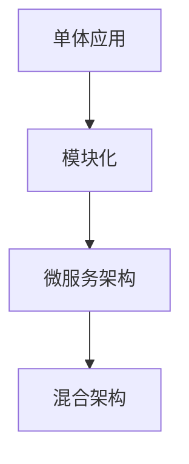

                 

关键词：Web架构设计，单体应用，微服务，架构演化，分布式系统，DevOps，容器化，服务网格

摘要：本文旨在探讨Web架构设计的演进过程，从传统的单体应用模式到现代的微服务架构。通过对不同架构模式的深入分析，本文将揭示它们的优势和劣势，并提供实用的设计原则和实践指南，以帮助开发者构建高效、可扩展的Web应用。

## 1. 背景介绍

Web架构设计是软件开发中的一个关键领域，它决定了应用的性能、可扩展性和维护性。随着互联网的快速发展，Web应用的规模和复杂性不断增加，传统的单体应用模式逐渐暴露出许多问题，如系统瓶颈、维护困难、部署复杂等。为了解决这些问题，开发者开始探索新的架构模式，微服务架构应运而生。

### 单体应用模式

单体应用模式是一种将所有功能模块、业务逻辑、数据库等都集中在一个单一的应用程序中的架构模式。这种模式在早期互联网应用中非常普遍，因为它简单、易于实现。然而，随着应用规模的扩大，单体应用模式的缺点也逐渐显现：

1. **性能瓶颈**：随着用户数量的增加，单体应用可能会出现性能瓶颈，响应速度变慢。
2. **维护困难**：所有的功能模块集中在一个应用程序中，更新和维护变得更加复杂。
3. **部署复杂**：单体应用通常需要整体部署，一旦出现问题，整个应用都会受到影响。

### 微服务架构

微服务架构是一种将应用程序拆分为多个独立的服务，每个服务负责特定的业务功能，并通过API进行通信的架构模式。这种模式的核心思想是“分离关注点”，即每个服务都是自治的，可以独立开发、部署和扩展。微服务架构的兴起解决了单体应用模式中的许多问题：

1. **性能提升**：通过拆分为多个独立的服务，应用可以更高效地利用资源，提升响应速度。
2. **易于维护**：每个服务都是独立的，更新和维护变得更加简单。
3. **部署灵活**：服务可以独立部署，减少了对整个应用的影响。

## 2. 核心概念与联系

### 单体应用与微服务的关系

单体应用和微服务并不是互相排斥的，而是可以相互补充的。实际上，许多现代Web应用都是采用“微服务+单体应用”的混合架构。在这种架构中，核心业务逻辑采用微服务架构，而一些非核心功能或模块仍然采用单体应用模式。

### Mermaid流程图

下面是一个简单的Mermaid流程图，展示了单体应用和微服务的演化过程：



## 3. 核心算法原理 & 具体操作步骤

### 3.1 算法原理概述

微服务架构的核心在于“服务拆分”和“服务自治”。服务拆分是将一个庞大的应用程序拆分为多个小的、功能单一的服务，每个服务都独立运行在一个独立的容器中。服务自治则是指每个服务都有自己独立的数据库、配置、部署和管理。

### 3.2 算法步骤详解

1. **服务拆分**：首先，需要对现有的应用程序进行功能分析和业务逻辑梳理，确定哪些功能可以独立拆分为服务。一般来说，功能单一、耦合度低、业务变化频繁的部分更适合作为独立的服务。
2. **服务定义**：每个服务都需要有一个清晰的接口定义，包括API接口、数据模型等。接口定义应该尽量简洁、明确，以便于其他服务调用。
3. **服务部署**：每个服务都应该独立部署，以便于进行灰度发布、故障隔离等操作。部署可以使用容器技术，如Docker，以及编排工具，如Kubernetes。
4. **服务通信**：服务之间通过API进行通信，可以使用HTTP/REST、gRPC等协议。为了保证通信的高效和稳定，可以使用服务网格技术，如Istio、Linkerd等。
5. **服务监控**：对每个服务的运行状态、性能等进行监控，及时发现和解决潜在问题。

### 3.3 算法优缺点

#### 优点

1. **可扩展性**：通过拆分为多个独立的服务，应用可以更灵活地扩展。
2. **高可用性**：服务可以独立部署和扩展，提高了系统的可用性。
3. **易于维护**：每个服务都是独立的，维护和更新更加方便。

#### 缺点

1. **分布式复杂性**：随着服务的增加，分布式系统的复杂性也会增加，如服务发现、负载均衡等。
2. **通信开销**：服务之间需要进行频繁的通信，可能会产生一定的通信开销。

### 3.4 算法应用领域

微服务架构广泛应用于电子商务、金融、社交网络、物联网等场景。在这些场景中，应用规模庞大，业务需求多变，微服务架构可以更好地满足这些需求。

## 4. 数学模型和公式 & 详细讲解 & 举例说明

### 4.1 数学模型构建

在微服务架构中，关键性能指标包括响应时间、吞吐量、可用性等。我们可以使用队列模型来构建数学模型，分析这些性能指标。

#### 队列模型

假设每个服务都有一条处理队列，队列长度为L，服务处理时间为T，那么我们可以使用以下公式来计算系统的响应时间：

$$
T_r = T + \frac{L}{\lambda}
$$

其中，$\lambda$为服务请求的到达率。

### 4.2 公式推导过程

我们首先假设服务请求到达过程是均匀的，即每个时间单位内有$\lambda$个请求到达。每个请求在队列中的等待时间服从指数分布，平均等待时间为$\frac{1}{\lambda}$。

设队列长度为L，处理时间为T，那么系统在时间t内的响应时间可以表示为：

$$
T_r(t) = T + \int_{0}^{t} (L(\tau) + 1) d\tau
$$

其中，$L(\tau)$为时间$\tau$时刻的队列长度。

为了简化计算，我们可以假设队列长度是随时间变化的，但变化速度较慢。那么在时间t内，队列长度的变化可以近似为线性变化，即：

$$
L(t) \approx L_0 + \lambda t
$$

其中，$L_0$为初始队列长度。

代入上述公式，我们得到：

$$
T_r(t) = T + \int_{0}^{t} (\lambda t + 1) d\tau = T + (\lambda t + 1)t = T + \lambda t^2 + t
$$

### 4.3 案例分析与讲解

假设我们有一个服务，处理时间为2秒，到达率为1次/秒，初始队列为空。那么我们可以使用上述公式计算系统在1分钟内的平均响应时间：

$$
T_r(60) = 2 + \lambda \cdot 60^2 + 60 = 2 + 3600 + 60 = 3662 \text{秒}
$$

这意味着，在1分钟内，平均每个请求需要等待3662秒才能得到处理。显然，这是一个非常不合理的响应时间。通过分析，我们发现队列长度是导致响应时间过长的关键因素。为了解决这个问题，我们可以增加服务器的处理能力，降低到达率，或者优化队列处理算法。

## 5. 项目实践：代码实例和详细解释说明

### 5.1 开发环境搭建

为了演示微服务架构的应用，我们使用Spring Boot和Docker来构建一个简单的博客系统。以下是搭建开发环境的基本步骤：

1. 安装Docker：在[官方Docker网站](https://www.docker.com/)下载并安装Docker。
2. 安装JDK：下载并安装Java开发工具包（JDK），版本需要与Spring Boot兼容。
3. 安装IDE：选择一个合适的IDE，如IntelliJ IDEA或Eclipse，并安装Spring Boot插件。

### 5.2 源代码详细实现

博客系统分为三个服务：用户服务（User Service）、文章服务（Post Service）和评论服务（Comment Service）。以下是每个服务的简要实现：

#### 用户服务（User Service）

```java
@SpringBootApplication
public class UserServiceApplication {
    public static void main(String[] args) {
        SpringApplication.run(UserServiceApplication.class, args);
    }

    @Bean
    public UserMapper userMapper() {
        return new UserMapper();
    }

    @Bean
    public UserRepository userRepository() {
        return new UserRepository();
    }
}
```

#### 文章服务（Post Service）

```java
@SpringBootApplication
public class PostServiceApplication {
    public static void main(String[] args) {
        SpringApplication.run(PostServiceApplication.class, args);
    }

    @Bean
    public PostMapper postMapper() {
        return new PostMapper();
    }

    @Bean
    public PostRepository postRepository() {
        return new PostRepository();
    }
}
```

#### 评论服务（Comment Service）

```java
@SpringBootApplication
public class CommentServiceApplication {
    public static void main(String[] args) {
        SpringApplication.run(CommentServiceApplication.class, args);
    }

    @Bean
    public CommentMapper commentMapper() {
        return new CommentMapper();
    }

    @Bean
    public CommentRepository commentRepository() {
        return new CommentRepository();
    }
}
```

### 5.3 代码解读与分析

以上代码展示了如何使用Spring Boot构建微服务。每个服务都有自己的主类，包含Spring Boot应用的入口。通过注解`@SpringBootApplication`，Spring Boot应用可以自动配置Spring容器、数据访问等。

每个服务还包含一个数据访问层，如`UserMapper`、`PostMapper`和`CommentMapper`，用于与数据库进行交互。这些数据访问层通常使用MyBatis等ORM框架实现。

### 5.4 运行结果展示

在构建好服务之后，我们可以使用Docker命令将它们打包并运行。以下是运行用户服务的命令：

```bash
docker build -t user-service . -f user-service/Dockerfile
docker run -d -p 8080:8080 user-service
```

类似地，我们可以运行文章服务和评论服务。在运行完成后，我们可以使用浏览器访问这些服务，并查看运行结果。

## 6. 实际应用场景

### 6.1 电子商务平台

电子商务平台是微服务架构的典型应用场景。例如，阿里巴巴的淘宝和天猫都采用了微服务架构。通过将电子商务平台的各个功能模块拆分为独立的服务，如商品服务、订单服务、支付服务、物流服务等，可以更好地应对高并发、海量数据等挑战。

### 6.2 金融行业

金融行业对系统的稳定性和安全性要求极高，因此微服务架构在金融行业也得到了广泛应用。例如，中国建设银行使用了微服务架构来构建其网上银行系统，通过将不同的业务功能模块化，提高了系统的可扩展性和可维护性。

### 6.3 物联网

物联网（IoT）应用通常涉及大量的设备和数据，因此需要具备高效的数据处理能力和良好的可扩展性。微服务架构可以帮助物联网应用实现模块化，例如，可以将传感器数据处理、设备管理、数据存储等功能拆分为独立的服务，从而更好地应对物联网应用的需求。

## 7. 工具和资源推荐

### 7.1 学习资源推荐

1. 《微服务设计》：这是一本经典的微服务架构设计指南，详细介绍了微服务的概念、架构模式和最佳实践。
2. 《大规模分布式存储系统》：这本书详细介绍了分布式存储系统的设计原理和实现方法，对于理解微服务架构中的数据存储和处理非常有帮助。

### 7.2 开发工具推荐

1. Spring Boot：这是一个强大的微服务开发框架，支持快速构建独立的、生产级的微服务应用。
2. Docker：这是一个用于容器化的工具，可以将应用及其依赖环境打包为一个独立的容器，便于部署和管理。

### 7.3 相关论文推荐

1. "Microservices: A Definition of a Microservice Architecture"
2. "The 12 Factors: Foundations for the Cloud Native Web Architecture and Organization"
3. "A Note on the Dictionary of Computer Science and Technology"

## 8. 总结：未来发展趋势与挑战

### 8.1 研究成果总结

微服务架构在过去几年中得到了广泛应用，并在实际应用中取得了显著成果。通过将应用拆分为独立的服务，微服务架构显著提高了系统的可扩展性和可维护性。此外，容器化和自动化部署等技术的普及也为微服务架构的落地提供了有力支持。

### 8.2 未来发展趋势

1. **服务网格技术的成熟**：服务网格技术如Istio、Linkerd等正在逐渐成熟，将为微服务架构提供更高效、更安全的通信和管理方式。
2. **服务自动化**：随着AI技术的发展，服务自动化将成为微服务架构的一个重要趋势。例如，自动故障检测、自动扩容等。
3. **多语言微服务**：未来，多语言微服务将成为一种趋势，允许开发者使用最合适的语言来构建不同的服务。

### 8.3 面临的挑战

1. **分布式复杂性**：随着服务的增加，分布式系统的复杂性也在增加，如服务发现、负载均衡、数据一致性等。
2. **运维挑战**：微服务架构的运维复杂度较高，需要专业的运维团队来管理和维护。
3. **团队协作**：微服务架构要求开发者和运维人员有较高的协作能力，这对于团队协作提出了新的要求。

### 8.4 研究展望

未来，微服务架构的研究将聚焦于提高系统的稳定性、安全性和可扩展性。同时，随着AI、区块链等新技术的不断发展，微服务架构也将与这些新技术深度融合，为开发者提供更强大的开发工具和平台。

## 9. 附录：常见问题与解答

### 9.1 微服务与单体应用的对比

| 对比项 | 微服务 | 单体应用 |
| ------ | ------ | -------- |
| 可扩展性 | 高 | 低 |
| 维护性 | 高 | 低 |
| 部署复杂度 | 高 | 低 |
| 通信开销 | 高 | 低 |

### 9.2 微服务的最佳实践

1. **服务拆分**：遵循“单一职责原则”，将功能拆分为独立的服务。
2. **服务自治**：确保每个服务都可以独立部署和扩展。
3. **服务通信**：使用稳定、高效的通信协议，如HTTP/REST、gRPC。
4. **服务监控**：对每个服务的运行状态、性能进行实时监控。

### 9.3 微服务架构中的数据管理

1. **去中心化**：每个服务都有自己的数据库，避免单点故障。
2. **数据一致性**：使用分布式事务管理或最终一致性模型，确保数据一致性。
3. **数据隔离**：确保不同服务之间的数据隔离，避免数据污染。

## 作者署名

作者：禅与计算机程序设计艺术 / Zen and the Art of Computer Programming

----------------------------------------------------------------

文章完成。本文详细探讨了Web架构设计从单体应用到微服务的演进过程，提供了深入的理论分析和实践指导，旨在帮助开发者更好地理解和应用微服务架构。希望本文能对您的学习和发展有所帮助。如果您有任何问题或建议，欢迎随时交流。再次感谢您选择阅读本文。

