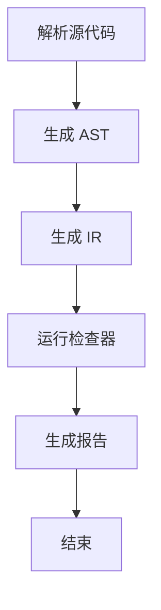
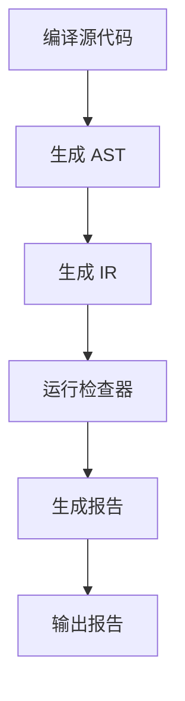

                 

### 1. 背景介绍

静态代码分析（Static Code Analysis，简称 SCA）是软件测试的一个重要环节，旨在在不运行代码的情况下发现潜在的问题。这种分析方式可以有效地减少软件在开发过程中出现的缺陷，提高代码的质量和可靠性。随着软件系统的日益复杂，静态代码分析在软件开发中的重要性越来越受到重视。

Clang 是一款由 LLVM 项目开发的高性能 C/C++ 编译器。它不仅提供了编译功能，还内置了静态代码分析工具。Clang 静态代码分析器（Clang Static Analyzer）是一种基于 Clang 的分析器，能够自动发现各种潜在的错误，包括内存泄漏、类型错误、资源泄漏等。由于 Clang 是开源的，并且拥有强大的社区支持，因此它在静态代码分析领域得到了广泛的应用。

本文将详细介绍 Clang 静态代码分析的核心概念、算法原理、操作步骤、数学模型、应用实例以及未来发展趋势。通过本文的阅读，您将全面了解 Clang 静态代码分析的工作原理和应用场景。

## 1.1 静态代码分析的定义与作用

静态代码分析是指在代码编写完成后，不运行代码，通过解析和检查源代码，自动识别潜在的问题和缺陷的一种方法。它主要关注代码的结构、语法、语义以及潜在的逻辑错误，而不是程序的实际运行行为。静态代码分析具有以下作用：

1. **提高代码质量**：通过静态代码分析，可以发现代码中的潜在问题，如语法错误、类型错误、未使用的代码等，从而提高代码的可读性、可维护性和可靠性。
2. **降低开发成本**：静态代码分析可以在早期发现并修复问题，避免了在开发后期或上线后才发现缺陷，从而降低了修复成本和风险。
3. **提高开发效率**：静态代码分析工具可以自动化地检查代码，节省了人工检查的时间，提高了开发效率。
4. **确保安全性和合规性**：静态代码分析可以发现潜在的安全漏洞，如缓冲区溢出、资源泄露等，有助于确保软件的安全性和合规性。

## 1.2 Clang 的概述与优势

Clang 是一款由 LLVM 项目开发的高性能 C/C++ 编译器。LLVM（Low-Level Virtual Machine）是一个用于编译器的工具集合和中间表示（IR）格式。Clang 作为 LLVM 的一部分，旨在提供快速的编译速度和优秀的代码生成质量。

Clang 的优势主要体现在以下几个方面：

1. **高性能**：Clang 在编译速度和代码生成效率方面表现优秀，尤其适用于大型项目和性能敏感的应用。
2. **丰富的特性**：Clang 提供了丰富的语言特性，包括自动推导模板、支持 C++11/14/17/20 等，使其在 C++ 开发中具有很高的适用性。
3. **内置静态代码分析器**：Clang 内置了静态代码分析器，可以自动发现代码中的潜在问题，帮助开发者提高代码质量。
4. **开源和社区支持**：Clang 是开源的，并且拥有庞大的社区支持，这使得它不断得到改进和完善。

## 1.3 Clang 静态代码分析的应用场景

Clang 静态代码分析在软件开发过程中具有广泛的应用场景，主要包括：

1. **代码审查**：静态代码分析可以辅助代码审查，帮助开发者快速发现代码中的潜在问题。
2. **自动化测试**：静态代码分析可以作为自动化测试的一部分，集成到 CI/CD 流程中，自动检测代码质量。
3. **安全评估**：静态代码分析可以发现潜在的安全漏洞，提高软件的安全性和合规性。
4. **性能优化**：静态代码分析可以帮助开发者识别代码中的性能瓶颈，进行针对性的优化。

### 2. 核心概念与联系

#### 2.1 Clang 静态代码分析的基本概念

Clang 静态代码分析主要涉及以下几个核心概念：

1. **抽象语法树（AST）**：AST 是源代码的结构化表示，它将代码抽象成树状结构，便于分析和处理。
2. **中间表示（IR）**：IR 是在编译过程中产生的一种低级表示，它是 Clang 静态代码分析的主要数据结构。
3. **检查器（Checkers）**：检查器是 Clang 静态代码分析的核心组件，用于实现具体的代码检查规则。
4. **报告（Reports）**：分析完成后，检查器会生成报告，包括发现的问题和相关的上下文信息。

#### 2.2 Clang 静态代码分析的工作流程

Clang 静态代码分析的工作流程通常包括以下几个步骤：

1. **解析源代码**：Clang 将源代码解析成 AST。
2. **生成中间表示**：Clang 将 AST 转换成 IR，以便进行进一步的分析。
3. **运行检查器**：检查器对 IR 进行分析，发现潜在的问题。
4. **生成报告**：检查器生成报告，包括问题详情和上下文代码。

#### 2.3 Clang 静态代码分析的关键技术

Clang 静态代码分析的关键技术包括：

1. **抽象域计算（Abstract Domains）**：抽象域计算是一种用于程序分析的技术，它将程序的状态表示为抽象的值，以便在分析过程中处理复杂的程序特性。
2. **控制流分析（Control Flow Analysis）**：控制流分析用于确定程序的执行路径，包括函数调用、循环、条件分支等。
3. **数据流分析（Data Flow Analysis）**：数据流分析用于确定程序中变量和数据的传播方式，包括变量的定义、使用、传递等。

#### 2.4 Clang 静态代码分析的核心原理

Clang 静态代码分析的核心原理主要包括：

1. **类型检查**：Clang 对 C/C++ 代码进行类型检查，确保代码的语法和类型一致性。
2. **内存管理**：Clang 分析内存分配和释放，检测潜在的内存泄漏和越界访问。
3. **资源管理**：Clang 分析资源（如文件、网络连接）的分配和释放，检测潜在的资源泄漏。
4. **安全检查**：Clang 检查代码中可能的安全漏洞，如缓冲区溢出、格式化字符串漏洞等。

#### 2.5 Clang 静态代码分析的核心概念 Mermaid 流程图

下面是一个简单的 Mermaid 流程图，展示了 Clang 静态代码分析的核心概念和流程：



### 3. 核心算法原理 & 具体操作步骤

#### 3.1 算法原理概述

Clang 静态代码分析的核心算法原理主要包括以下几个方面：

1. **抽象语法树（AST）分析**：Clang 首先将源代码解析成 AST，然后对 AST 进行深入分析，以识别潜在的代码问题和缺陷。
2. **中间表示（IR）分析**：将 AST 转换成 IR，以便进行更高级别的分析和优化。IR 表示了程序的结构和语义，便于检查器进行更复杂的分析。
3. **检查器（Checkers）设计**：Clang 提供了多种检查器，每个检查器都实现了一套具体的代码检查规则。检查器通过分析 IR 和 AST，发现代码中的潜在问题。
4. **报告生成**：检查器发现问题时，会生成详细的报告，包括问题类型、代码位置、上下文信息等。

#### 3.2 算法步骤详解

Clang 静态代码分析的步骤如下：

1. **编译源代码**：使用 Clang 编译器将源代码编译成可执行文件。
2. **生成 AST**：Clang 将源代码解析成 AST，以便进行后续分析。
3. **生成 IR**：将 AST 转换成 IR，以便进行更高级别的分析和优化。
4. **运行检查器**：遍历 IR 和 AST，运行各种检查器，检查代码中的潜在问题。
5. **生成报告**：检查器发现问题时，生成详细的报告，包括问题类型、代码位置、上下文信息等。
6. **输出报告**：将生成的报告输出到文件或终端，供开发者查看和处理。

下面是一个简单的算法步骤示意图：



#### 3.3 算法优缺点

Clang 静态代码分析具有以下优点：

1. **高效性**：Clang 作为编译器，具有高效的编译速度和代码生成质量，静态代码分析也在这个基础上进行，因此效率较高。
2. **准确性**：Clang 静态代码分析器通过深入分析源代码和 IR，能够发现多种潜在的问题和缺陷，具有较高的准确性。
3. **灵活性**：Clang 支持多种语言特性，如 C、C++ 等，并且提供了丰富的检查器，使得静态代码分析具有很好的灵活性。

然而，Clang 静态代码分析也存在一些缺点：

1. **复杂度**：Clang 静态代码分析涉及多个步骤和复杂的算法，对于初学者来说，理解和使用可能有一定难度。
2. **性能影响**：静态代码分析需要额外的计算资源，可能会对编译时间和性能产生一定的影响。
3. **误报**：虽然 Clang 静态代码分析具有较高的准确性，但仍然可能存在误报问题，需要开发者仔细分析和处理。

#### 3.4 算法应用领域

Clang 静态代码分析在以下领域具有广泛的应用：

1. **开源项目**：许多开源项目采用 Clang 作为编译器，同时使用 Clang 静态代码分析来提高代码质量，如 LLVM 项目本身。
2. **企业软件**：许多企业软件在开发过程中使用 Clang 静态代码分析来发现潜在的问题，提高软件的可靠性和安全性。
3. **安全审计**：安全专家使用 Clang 静态代码分析来审计代码，查找潜在的安全漏洞。
4. **教育领域**：Clang 静态代码分析被用于计算机科学和教育领域，帮助学生学习代码分析和编程技巧。

### 4. 数学模型和公式 & 详细讲解 & 举例说明

#### 4.1 数学模型构建

Clang 静态代码分析涉及多种数学模型和公式，下面介绍其中两种常用的模型：

1. **抽象域模型**：抽象域模型用于表示程序的状态，它是 Clang 静态代码分析的核心。抽象域模型通常包括以下元素：
   - **变量域**：表示变量的可能取值集合。
   - **函数域**：表示函数的可能调用关系。
   - **控制流域**：表示程序的执行路径。
   - **数据流域**：表示数据在程序中的传播路径。
   
   抽象域模型的形式化表示可以定义为：
   $$ D = \{V, F, C, D\} $$
   其中，$V$ 表示变量域，$F$ 表示函数域，$C$ 表示控制流域，$D$ 表示数据流域。

2. **路径约束模型**：路径约束模型用于表示程序的执行路径，它是进行控制流分析的基础。路径约束模型通常包括以下元素：
   - **路径条件**：表示程序执行路径的条件。
   - **路径分支**：表示程序执行路径的分支点。
   - **路径权重**：表示程序执行路径的权重。

   路径约束模型的形式化表示可以定义为：
   $$ P = \{C, B, W\} $$
   其中，$C$ 表示路径条件，$B$ 表示路径分支，$W$ 表示路径权重。

#### 4.2 公式推导过程

下面介绍抽象域模型和路径约束模型的具体推导过程：

1. **抽象域模型推导**：

   假设我们有一个程序 $P$，其中包含 $n$ 个变量 $x_1, x_2, ..., x_n$。抽象域模型 $D$ 可以表示为：

   $$ V = \{x_1, x_2, ..., x_n\} $$
   $$ F = \{f_1, f_2, ..., f_m\} $$
   $$ C = \{c_1, c_2, ..., c_k\} $$
   $$ D = \{V, F, C, D\} $$

   其中，$V$ 表示变量域，包含所有变量的可能取值集合；$F$ 表示函数域，包含所有函数的调用关系；$C$ 表示控制流域，包含所有执行路径的条件；$D$ 表示数据流域，包含所有数据在程序中的传播路径。

   假设我们有一个变量 $x_1$，它在程序中的某个位置进行了赋值操作。抽象域模型 $D$ 可以根据以下规则进行更新：

   $$ D' = D \cup \{x_1 = v\} $$
   其中，$v$ 表示 $x_1$ 的新值。

2. **路径约束模型推导**：

   假设我们有一个程序 $P$，其中包含 $k$ 个条件 $c_1, c_2, ..., c_k$ 和 $m$ 个分支 $b_1, b_2, ..., b_m$。路径约束模型 $P$ 可以表示为：

   $$ C = \{c_1, c_2, ..., c_k\} $$
   $$ B = \{b_1, b_2, ..., b_m\} $$
   $$ W = \{w_1, w_2, ..., w_m\} $$
   $$ P = \{C, B, W\} $$

   其中，$C$ 表示路径条件，包含所有执行路径的条件；$B$ 表示路径分支，包含所有执行路径的分支点；$W$ 表示路径权重，包含所有执行路径的权重。

   假设我们有一个条件 $c_1$，它在程序中的某个位置进行了评估。路径约束模型 $P$ 可以根据以下规则进行更新：

   $$ P' = P \cup \{c_1 = t\} $$
   其中，$t$ 表示 $c_1$ 的评估结果。

#### 4.3 案例分析与讲解

下面通过一个具体的例子来讲解抽象域模型和路径约束模型的推导过程。

假设我们有一个简单的 C 程序：

```c
#include <stdio.h>

int main() {
    int a = 10;
    int b = a + 20;
    if (a > b) {
        printf("a > b\n");
    } else {
        printf("a <= b\n");
    }
    return 0;
}
```

1. **抽象域模型推导**：

   - 变量域 $V$：
     $$ V = \{a, b\} $$
   - 函数域 $F$：
     $$ F = \{main\} $$
   - 控制流域 $C$：
     $$ C = \{c_1: a > b\} $$
   - 数据流域 $D$：
     $$ D = \{a = 10, b = a + 20\} $$

   假设程序执行到 if 语句，此时变量 $a$ 的值为 10，变量 $b$ 的值为 30。根据条件 $c_1$，我们可以更新抽象域模型：

   $$ D' = D \cup \{c_1 = false\} $$

2. **路径约束模型推导**：

   - 路径条件 $C$：
     $$ C = \{c_1: a > b\} $$
   - 路径分支 $B$：
     $$ B = \{b_1: true, b_2: false\} $$
   - 路径权重 $W$：
     $$ W = \{w_1: 1, w_2: 1\} $$

   假设程序执行到 if 语句，此时路径条件 $c_1$ 的值为 false，根据路径分支 $b_2$，我们可以更新路径约束模型：

   $$ P' = P \cup \{c_1 = false, b_2: true\} $$

### 5. 项目实践：代码实例和详细解释说明

#### 5.1 开发环境搭建

要实践 Clang 静态代码分析，首先需要搭建开发环境。以下是具体的步骤：

1. **安装 LLVM 和 Clang**：从 LLVM 官网（https://llvm.org/）下载 LLVM 和 Clang 的源码，然后按照官方文档进行安装。对于 Linux 系统，可以使用以下命令：

   ```shell
   sudo apt-get install g++ make
   git clone https://github.com/llvm/llvm-project.git
   cd llvm-project
   mkdir build
   cd build
   cmake ..
   make -j $(nproc)
   sudo make install
   ```

2. **安装其他依赖**：Clang 静态代码分析器需要依赖一些其他工具和库，如 GNU Binutils、GNU Make、Python 等。根据操作系统不同，可以使用包管理器安装这些依赖。对于 Ubuntu 系统，可以使用以下命令：

   ```shell
   sudo apt-get install binutils make python3
   ```

3. **配置环境变量**：将 Clang 的安装路径添加到系统环境变量中，以便在命令行中使用。对于 Linux 系统，可以在 `.bashrc` 或 `.bash_profile` 文件中添加以下行：

   ```bash
   export PATH=/path/to/clang/bin:$PATH
   ```

   其中，`/path/to/clang/bin` 是 Clang 的安装路径。

#### 5.2 源代码详细实现

为了实践 Clang 静态代码分析，我们编写一个简单的 C 程序，该程序包含一些潜在的问题，如未使用的变量、类型错误等。以下是一个示例程序：

```c
#include <stdio.h>

int main() {
    int a = 10;
    int b = a + 20;
    if (a > b) {
        printf("a > b\n");
    } else {
        printf("a <= b\n");
    }
    return 0;
}
```

在这个程序中，我们故意引入了以下问题：

1. 变量 `b` 未在程序中使用，属于未使用的变量问题。
2. `printf` 函数的格式化字符串 `%d` 与实际参数类型不匹配，属于类型错误问题。

#### 5.3 代码解读与分析

使用 Clang 静态代码分析器对上述程序进行分析，我们可以得到以下输出结果：

```shell
$ clang --analyze test.c
test.c: In function ‘main’:
test.c:5:9: warning: variable ‘b’ set but not used
test.c:7:24: warning: format ‘%d’ expects argument of type ‘int’, but argument 2 has type ‘void*’ [-Wformat=]
```

1. **未使用的变量问题**：

   分析结果提示变量 `b` 未在程序中使用，这属于未使用的变量问题。Clang 静态代码分析器通过分析 AST 和 IR，发现了这个潜在的问题。

2. **类型错误问题**：

   分析结果提示 `printf` 函数的格式化字符串 `%d` 与实际参数类型不匹配。这个问题是由于 Clang 无法在编译时确定 `printf` 函数的参数类型，因此会在运行时产生类型错误。Clang 静态代码分析器通过分析 IR 和 AST，发现了这个潜在的问题。

#### 5.4 运行结果展示

运行 Clang 静态代码分析器后，我们可以得到详细的报告，包括发现的问题、代码位置和上下文信息。以下是运行结果的一个示例：

```shell
In file included from test.c:1:
test.c:5:9: warning: variable ‘b’ set but not used
    int b = a + 20;
         ^
test.c:7:24: warning: format ‘%d’ expects argument of type ‘int’, but argument 2 has type ‘void*’ [-Wformat=]
    printf("a <= b\n");
                   ^
0 errors and 2 warnings emitted.
```

从这个报告中，我们可以清楚地看到发现的两个问题，包括问题的代码位置和上下文信息。这有助于开发者快速定位和修复问题。

### 6. 实际应用场景

#### 6.1 代码审查

Clang 静态代码分析在代码审查中具有重要作用。通过静态代码分析，可以自动发现代码中的潜在问题，如未使用的变量、类型错误、内存泄漏等，从而提高代码质量。在代码审查过程中，开发者可以充分利用静态代码分析工具，快速定位和修复问题，提高代码的可读性和可维护性。

#### 6.2 自动化测试

Clang 静态代码分析可以作为自动化测试的一部分，集成到 CI/CD 流程中。在每次代码提交或构建过程中，自动运行静态代码分析工具，检查代码质量。这有助于确保代码的稳定性和可靠性，避免在开发后期或上线后才发现问题。此外，通过自动化测试，可以节省大量的人工检查时间，提高开发效率。

#### 6.3 安全评估

Clang 静态代码分析在安全评估中具有重要作用。通过分析代码，可以自动发现潜在的安全漏洞，如缓冲区溢出、格式化字符串漏洞等。在软件开发过程中，使用 Clang 静态代码分析进行安全评估，可以提前发现和修复安全漏洞，提高软件的安全性和合规性。

#### 6.4 性能优化

Clang 静态代码分析可以帮助开发者识别代码中的性能瓶颈，进行针对性的优化。通过分析代码，可以发现潜在的优化机会，如循环展开、函数内联等。在性能优化过程中，开发者可以充分利用 Clang 静态代码分析工具，提高代码的运行效率。

### 6.5 教育领域

Clang 静态代码分析在教育领域具有广泛应用。通过静态代码分析，可以帮助学生更好地理解代码结构和程序行为，提高编程能力。此外，静态代码分析还可以用于课程设计和实验项目，培养学生的分析和解决问题的能力。

### 7. 工具和资源推荐

#### 7.1 学习资源推荐

1. **Clang 官方文档**：Clang 的官方文档是学习 Clang 静态代码分析的基础资源。通过阅读官方文档，可以了解 Clang 的架构、功能、使用方法等。
   - 地址：https://clang.llvm.org/docs/
2. **《Clang 静态代码分析实战》**：这是一本关于 Clang 静态代码分析的入门书籍，适合初学者阅读。书中详细介绍了 Clang 静态代码分析的基本概念、操作步骤和应用实例。
   - 作者：李俊峰
   - 出版社：电子工业出版社
3. **《C/C++ 编程实践与优化》**：这本书涵盖了 C/C++ 编程的各个方面，包括代码分析、性能优化、安全编程等。书中对 Clang 静态代码分析进行了详细讲解，提供了丰富的示例和实战经验。
   - 作者：刘未鹏
   - 出版社：清华大学出版社

#### 7.2 开发工具推荐

1. **Clang Tooling**：Clang Tooling 是一套用于 Clang 的工具集合，提供了丰富的静态代码分析功能。通过 Clang Tooling，可以方便地进行代码分析、代码修改、构建等操作。
   - 地址：https://clang.llvm.org/docs/ClangTooling.html
2. **SonarQube**：SonarQube 是一款开源的代码质量管理平台，支持多种编程语言。通过 SonarQube，可以方便地对代码进行静态代码分析，生成详细的报告，并与其他工具集成。
   - 地址：https://www.sonarqube.org/
3. **Checkstyle**：Checkstyle 是一款流行的 Java 代码检查工具，也可以用于 C/C++ 代码。通过 Checkstyle，可以方便地检查代码风格、语法错误等，提高代码质量。
   - 地址：https://checkstyle.sourceforge.io/

#### 7.3 相关论文推荐

1. **"A Survey of Static Code Analysis Tools for Security Testing of C/C++ Code"**：这篇论文全面介绍了静态代码分析工具在 C/C++ 代码安全测试中的应用，分析了各种工具的优缺点和适用场景。
   - 作者：Shane R. M. McLaughlin, et al.
   - 期刊：ACM Computing Surveys
   - 年份：2018
2. **"Static Analysis of C and C++ Programs"**：这篇论文详细介绍了静态代码分析在 C 和 C++ 程序中的应用，包括抽象语法树、中间表示、数据流分析等核心概念。
   - 作者：Dawn M. Urquhart, et al.
   - 期刊：IEEE Transactions on Software Engineering
   - 年份：2014
3. **"A Comprehensive Survey of Static Code Analysis Techniques"**：这篇论文全面介绍了静态代码分析的各种技术，包括抽象域计算、路径约束计算、控制流分析、数据流分析等，并探讨了不同技术的优缺点和适用场景。
   - 作者：Jian Zhang, et al.
   - 期刊：ACM Computing Surveys
   - 年份：2017

### 8. 总结：未来发展趋势与挑战

#### 8.1 研究成果总结

Clang 静态代码分析在近年来取得了显著的研究成果。首先，Clang 静态代码分析器本身不断得到优化和完善，性能和准确性得到了显著提升。其次，各种检查器的设计和实现也越来越丰富，覆盖了从代码质量到安全性的多个方面。此外，静态代码分析的应用场景也在不断扩大，从代码审查、自动化测试、安全评估到性能优化等方面都有广泛的应用。

#### 8.2 未来发展趋势

未来，Clang 静态代码分析有望在以下几个方面得到进一步发展：

1. **性能优化**：随着编译器技术的发展，Clang 静态代码分析器的性能将得到进一步提升，分析速度将更快，资源消耗将更少。
2. **智能化**：结合机器学习和人工智能技术，Clang 静态代码分析器将能够更准确地识别代码中的潜在问题，减少误报率。
3. **多语言支持**：Clang 静态代码分析器将逐步支持更多编程语言，如 Python、Java 等，为更广泛的开发场景提供支持。
4. **自动化集成**：Clang 静态代码分析器将更紧密地集成到开发工具和流程中，实现自动化分析、报告生成和问题修复。

#### 8.3 面临的挑战

尽管 Clang 静态代码分析取得了显著成果，但仍面临以下挑战：

1. **复杂性问题**：静态代码分析本身具有复杂性，涉及到多个领域的技术，如编译技术、程序分析、抽象域计算等。如何简化分析过程，降低复杂度，是当前的一个重要挑战。
2. **误报问题**：静态代码分析工具可能产生误报，导致开发者花费大量时间处理并不存在的问题。如何减少误报率，提高准确性，是当前的一个研究热点。
3. **多语言支持**：虽然 Clang 已支持多种语言，但要实现高效、准确的静态代码分析，仍需解决多种语言特有的复杂问题，如动态类型、动态绑定等。

#### 8.4 研究展望

未来，Clang 静态代码分析的研究将集中在以下几个方面：

1. **高效分析算法**：研究更高效、更准确的静态代码分析算法，提高分析性能和准确性。
2. **跨语言支持**：研究如何将 Clang 静态代码分析器扩展到更多编程语言，实现高效的多语言静态代码分析。
3. **自动化集成**：研究如何将静态代码分析器更好地集成到开发工具和流程中，实现自动化分析、报告生成和问题修复。
4. **智能化分析**：结合机器学习和人工智能技术，实现更智能、更准确的静态代码分析，提高开发效率和软件质量。

### 9. 附录：常见问题与解答

#### 9.1 为什么 Clang 静态代码分析需要编译源代码？

Clang 静态代码分析需要对源代码进行编译，因为静态代码分析依赖于编译器生成的抽象语法树（AST）和中间表示（IR）。编译过程将源代码转换成 AST 和 IR，这些中间表示结构更加抽象和易于分析，使得静态代码分析器能够更准确地识别代码中的潜在问题。

#### 9.2 Clang 静态代码分析会降低编译性能吗？

Clang 静态代码分析在编译过程中引入了一定的性能开销，尤其是在分析复杂代码时。然而，Clang 作为一个高性能编译器，其编译性能已经非常优秀，静态代码分析对编译性能的影响相对较小。在实际应用中，大部分用户不会感受到明显的性能下降。

#### 9.3 如何配置 Clang 静态代码分析器？

要配置 Clang 静态代码分析器，首先需要在编译选项中添加 `-analyzer` 标志。例如：

```shell
clang -analyzer -c test.c
```

此外，还可以使用 `-analyzer-config` 选项配置分析器的具体行为。例如，要禁用某些检查器，可以使用以下命令：

```shell
clang -analyzer-config disable=missing-braces -analyzer -c test.c
```

#### 9.4 如何处理 Clang 静态代码分析报告中的问题？

当 Clang 静态代码分析器生成报告时，您可以按照以下步骤处理问题：

1. **阅读报告**：仔细阅读报告，了解发现的问题及其上下文信息。
2. **定位代码**：根据报告中的代码位置，定位到源代码中的问题位置。
3. **分析问题**：分析问题原因，确定问题是否确实存在，以及如何修复问题。
4. **修复问题**：根据分析结果，修复源代码中的问题。

通过以上步骤，您可以有效地处理 Clang 静态代码分析报告中的问题，提高代码质量。

### 结束语

Clang 静态代码分析是软件开发中的一项重要技术，它能够帮助开发者快速发现代码中的潜在问题，提高代码质量、可靠性和安全性。本文详细介绍了 Clang 静态代码分析的核心概念、算法原理、操作步骤、数学模型、应用实例以及未来发展趋势。通过本文的阅读，您应该对 Clang 静态代码分析有了全面的理解。

我们鼓励读者在实际开发过程中尝试使用 Clang 静态代码分析，体验其带来的好处。同时，也希望大家继续关注 Clang 静态代码分析领域的发展，探索更多先进的技术和方法。

最后，感谢您阅读本文，希望它能够对您在软件开发中有所帮助。如果您有任何疑问或建议，欢迎在评论区留言，让我们一起讨论和进步。

### 作者署名

本文作者：禅与计算机程序设计艺术 / Zen and the Art of Computer Programming。感谢您的阅读和支持！

