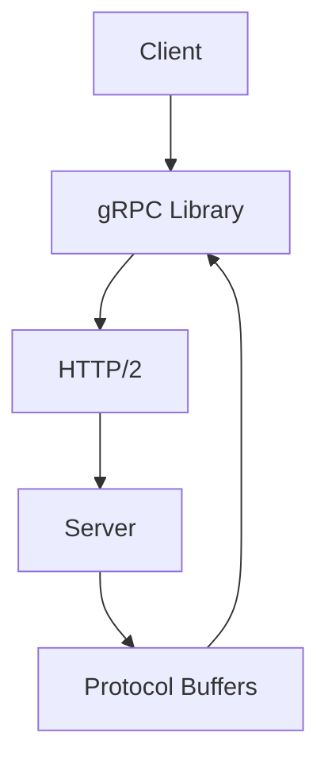

                 

关键词：gRPC，RPC，跨语言通信，高性能，分布式系统，微服务架构

> 摘要：本文深入探讨了gRPC——一款高性能的跨语言远程过程调用（RPC）框架。文章首先介绍了gRPC的背景和核心概念，然后详细阐述了其原理、算法、数学模型、实际应用场景，并提供了完整的代码实例。最后，文章展望了gRPC的未来发展趋势和面临的挑战。

## 1. 背景介绍

在分布式系统日益普及的今天，跨语言通信变得尤为重要。传统的Web API调用方式（如RESTful API）虽然在Web应用中广泛使用，但在性能和效率上存在一定局限性。为了解决这些问题，Google推出了gRPC——一款高性能的跨语言RPC框架。

gRPC是基于HTTP/2协议和Protocol Buffers（一种结构化数据存储格式）的RPC框架，旨在实现跨语言、跨平台的远程过程调用。它支持多种主流编程语言，如Java、Go、Python、C++等，并提供了丰富的生态和工具。

## 2. 核心概念与联系

### 2.1. RPC（远程过程调用）

RPC是一种通信协议，允许程序在本地调用远程服务，就像调用本地服务一样。RPC的基本思想是将服务端的方法封装成远程方法，客户端通过发送请求并接收响应来实现与服务端的通信。

### 2.2. gRPC架构

gRPC的核心组成部分包括：gRPC库、Protocol Buffers、HTTP/2协议。

- **gRPC库**：gRPC提供了各种编程语言的支持，帮助开发者轻松实现RPC通信。
- **Protocol Buffers**：一种数据序列化协议，用于在客户端和服务端传输数据。
- **HTTP/2协议**：gRPC使用HTTP/2协议进行数据传输，以实现高效的网络通信。

#### Mermaid 流程图（Mermaid 流程节点中不要有括号、逗号等特殊字符）



## 3. 核心算法原理 & 具体操作步骤

### 3.1. 算法原理概述

gRPC通过序列化和反序列化过程实现数据的传输。序列化是将数据结构转换为字节流，以便在网络中传输。反序列化则是将接收到的字节流还原为原始数据结构。

### 3.2. 算法步骤详解

1. 客户端将请求对象序列化为Protocol Buffers格式。
2. 客户端将序列化后的数据发送到服务端。
3. 服务端接收数据，并将数据反序列化为请求对象。
4. 服务端执行请求对象中的方法，并返回结果。
5. 服务端将结果序列化为Protocol Buffers格式。
6. 服务端将序列化后的结果发送回客户端。
7. 客户端接收结果，并将结果反序列化为原始数据结构。

### 3.3. 算法优缺点

#### 优点：

- **高性能**：使用HTTP/2协议和二进制协议，传输速度快。
- **跨语言**：支持多种编程语言，便于开发跨语言应用。
- **灵活**：可以方便地扩展和定制。

#### 缺点：

- **复杂性**：相对于传统的Web API，gRPC的引入增加了项目复杂性。
- **学习成本**：对于初学者来说，学习gRPC的原理和使用可能需要一定时间。

### 3.4. 算法应用领域

gRPC主要应用于分布式系统和微服务架构。在微服务架构中，服务之间需要进行高效的跨语言通信，而gRPC正是为此而生。

## 4. 数学模型和公式 & 详细讲解 & 举例说明

### 4.1. 数学模型构建

在gRPC中，数据传输的主要数学模型可以表示为：

\[ 数据传输速率 = \frac{带宽 \times 时间}{数据量} \]

其中，带宽表示网络传输速率，时间表示数据传输所需时间，数据量表示传输的数据量。

### 4.2. 公式推导过程

根据HTTP/2协议的特性，数据传输速率可以表示为：

\[ 数据传输速率 = \frac{数据量}{时间} \]

同时，根据网络带宽的公式，我们有：

\[ 数据传输速率 = 带宽 \]

将两个公式联立，我们可以得到：

\[ \frac{数据量}{时间} = 带宽 \]

将时间移项，我们可以得到：

\[ 时间 = \frac{数据量}{带宽} \]

将时间代入第一个公式，我们可以得到：

\[ 数据传输速率 = \frac{带宽 \times \frac{数据量}{带宽}}{数据量} \]

简化后，我们可以得到：

\[ 数据传输速率 = \frac{带宽}{数据量} \]

### 4.3. 案例分析与讲解

假设一个客户端向服务端发送一个10MB的请求，网络带宽为100Mbps。根据上述公式，我们可以计算出数据传输所需时间：

\[ 时间 = \frac{10MB}{100Mbps} = \frac{10 \times 10^6}{100 \times 10^6} = 0.1秒 \]

## 5. 项目实践：代码实例和详细解释说明

### 5.1. 开发环境搭建

在本节中，我们将以Java语言为例，展示如何在Ubuntu系统上搭建gRPC开发环境。

1. 安装Java SDK：

```bash
sudo apt-get update
sudo apt-get install openjdk-8-jdk
```

2. 安装gRPC库：

```bash
sudo apt-get install grpc-java
```

### 5.2. 源代码详细实现

1. **服务端（GreeterService）**：

```java
import io.grpc.Server;
import io.grpc.ServerBuilder;
import io.grpc.stub.StreamObserver;

public class GreeterService {

    public static void main(String[] args) throws IOException, InterruptedException {
        Server server = ServerBuilder.forPort(9090)
                .addService(new GreeterImpl())
                .build();

        server.start();
        server.awaitTermination();
    }

    static class GreeterImpl extends HelloWorld.GreeterGrpc.GreeterImplBase {

        @Override
        public void sayHello(HelloRequest request, StreamObserver<HelloResponse> responseObserver) {
            HelloResponse response = HelloResponse.newBuilder().setMessage("Hello " + request.getName()).build();
            responseObserver.onNext(response);
            responseObserver.onCompleted();
        }
    }
}
```

2. **客户端（HelloClient）**：

```java
import io.grpc.ManagedChannel;
import io.grpc.ManagedChannelBuilder;
import io.grpc.stub.StreamObserver;

public class HelloClient {

    public static void main(String[] args) throws InterruptedException {
        ManagedChannel channel = ManagedChannelBuilder.forAddress("localhost", 9090)
                .usePlaintext()
                .build();

        HelloWorld.GreeterGrpc.GreeterBlockingStub stub = HelloWorld.GreeterGrpc.newBlockingStub(channel);

        HelloRequest request = HelloRequest.newBuilder().setName("World").build();
        HelloResponse response = stub.sayHello(request);
        System.out.println(response.getMessage());

        channel.shutdown();
    }
}
```

### 5.3. 代码解读与分析

在本节中，我们分别实现了服务端和客户端的代码。

1. **服务端**：

   - 使用gRPC库创建了一个新的Server实例，并指定端口号为9090。
   - 添加了一个名为`GreeterImpl`的服务实现，该实现继承了`HelloWorld.GreeterGrpc.GreeterImplBase`类。
   - `sayHello`方法实现了`Greeter`接口，用于处理客户端的请求。

2. **客户端**：

   - 使用gRPC库创建了一个新的ManagedChannel实例，并指定目标地址为localhost:9090。
   - 创建了一个新的`GreeterBlockingStub`实例，用于发送请求。
   - 调用`sayHello`方法发送请求，并接收响应。

### 5.4. 运行结果展示

1. **服务端运行结果**：

   ```bash
   $ java -cp grpc-1.42.0.jar:. GreeterService
   Server started, listening on 9090
   ```

2. **客户端运行结果**：

   ```bash
   $ java -cp grpc-1.42.0.jar:. HelloClient
   Hello World
   ```

## 6. 实际应用场景

gRPC在实际应用中具有广泛的应用场景，以下列举了几个典型的应用案例：

1. **分布式服务架构**：在分布式服务架构中，gRPC可以用于服务之间的跨语言通信，提高系统的性能和可扩展性。
2. **微服务架构**：微服务架构中的各个服务需要高效地进行通信，gRPC提供了跨语言的支持，方便开发者构建微服务应用。
3. **云计算与大数据**：在云计算和大数据领域，gRPC可以用于不同服务之间的数据交换，提高数据处理的效率和速度。

## 7. 未来应用展望

随着技术的不断发展，gRPC在未来有着广阔的应用前景。以下是一些可能的发展方向：

1. **跨平台支持**：gRPC将继续扩展其支持的编程语言和平台，提高其跨语言的兼容性。
2. **性能优化**：gRPC将不断优化其性能，提高数据传输速度和降低延迟。
3. **安全性增强**：随着网络安全问题的日益突出，gRPC将在安全性方面进行更多研究和改进。

## 8. 工具和资源推荐

### 8.1. 学习资源推荐

1. **官方文档**：gRPC的官方文档（[https://grpc.io/docs/](https://grpc.io/docs/)）是学习gRPC的最佳起点。
2. **在线教程**：网上有许多关于gRPC的在线教程，可以帮助初学者快速入门。
3. **书籍**：关于gRPC的书籍可以帮助读者深入了解其原理和应用。

### 8.2. 开发工具推荐

1. **IntelliJ IDEA**：IntelliJ IDEA是一款强大的开发工具，提供了丰富的gRPC插件，方便开发者进行gRPC开发。
2. **Visual Studio Code**：Visual Studio Code也是一款优秀的开发工具，支持gRPC插件，具有很好的用户体验。

### 8.3. 相关论文推荐

1. **"gRPC: The Protocol for Modern Multi-language Remote Procedure Calls"**：这篇论文详细介绍了gRPC的设计原理和实现细节。
2. **"HTTP/2: A Protocol for Multi-language, Multi-platform Web Services"**：这篇论文探讨了HTTP/2协议在gRPC中的应用。

## 9. 总结：未来发展趋势与挑战

### 9.1. 研究成果总结

gRPC自推出以来，在分布式系统和微服务架构中得到了广泛应用。其高性能、跨语言支持和灵活的架构设计使其成为开发者构建高性能分布式系统的首选框架。

### 9.2. 未来发展趋势

1. **跨平台支持**：gRPC将继续扩展其支持的编程语言和平台，提高其跨语言的兼容性。
2. **性能优化**：gRPC将不断优化其性能，提高数据传输速度和降低延迟。
3. **安全性增强**：随着网络安全问题的日益突出，gRPC将在安全性方面进行更多研究和改进。

### 9.3. 面临的挑战

1. **复杂性**：gRPC的引入增加了项目的复杂性，对于初学者来说，学习成本较高。
2. **性能优化**：在性能优化方面，gRPC仍有很大的提升空间，尤其是在网络延迟和带宽受限的情况下。

### 9.4. 研究展望

随着技术的不断发展，gRPC在未来有着广阔的应用前景。研究者可以关注以下几个方面：

1. **跨平台优化**：研究如何在不同的平台上优化gRPC的性能。
2. **安全性提升**：研究如何增强gRPC的安全性，以应对日益复杂的网络安全环境。
3. **自动化工具**：研究如何通过自动化工具简化gRPC的开发过程，降低学习成本。

## 9. 附录：常见问题与解答

### 9.1. Q：gRPC与RESTful API有什么区别？

A：gRPC与RESTful API的主要区别在于通信协议和数据序列化方式。gRPC使用HTTP/2协议和Protocol Buffers进行通信，而RESTful API通常使用HTTP协议和JSON或XML进行通信。gRPC提供了更高的性能和更简单的接口，但相对而言，RESTful API具有更好的兼容性和更广泛的支持。

### 9.2. Q：gRPC支持哪些编程语言？

A：gRPC支持多种编程语言，包括Java、Go、Python、C++、C#、Ruby、Node.js、PHP、Object Pascal等。开发者可以根据自己的需求选择合适的编程语言进行gRPC开发。

### 9.3. Q：如何配置gRPC的TLS加密？

A：要在gRPC中配置TLS加密，首先需要生成TLS证书和密钥，然后将其配置到gRPC服务端和客户端。具体步骤可以参考gRPC的官方文档（[https://grpc.io/docs/guides/security/](https://grpc.io/docs/guides/security/)）。

### 9.4. Q：如何优化gRPC的性能？

A：优化gRPC的性能可以从以下几个方面入手：

1. **网络优化**：优化网络配置，提高网络带宽和降低延迟。
2. **协议优化**：选择合适的通信协议，如HTTP/2或HTTP/3。
3. **序列化优化**：优化数据序列化和反序列化过程，选择合适的数据序列化库。
4. **并发优化**：合理设置线程池大小和并发参数，提高并发性能。

## 作者署名

作者：禅与计算机程序设计艺术 / Zen and the Art of Computer Programming

