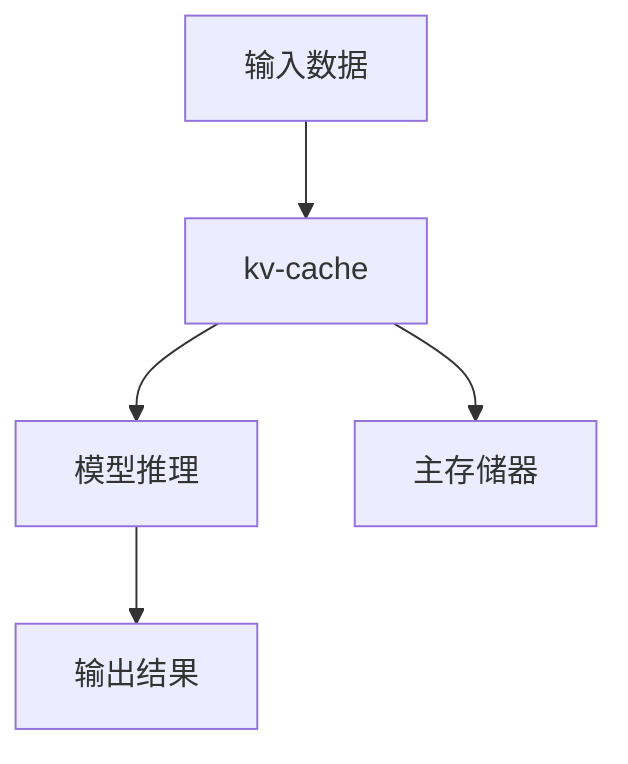

                 

关键词：缓存技术，模型推理，性能优化，存储效率，AI加速，算法优化，kv存储结构，缓存策略

> 摘要：本文深入探讨kv-cache技术在加速模型推理中的重要作用，分析了其原理和实现方法，并通过实际案例展示了其效果。同时，本文提出了未来的发展趋势和挑战，为AI领域的技术创新提供了有益的参考。

## 1. 背景介绍

随着人工智能的快速发展，深度学习模型在各个领域的应用日益广泛。然而，模型的复杂度和数据量的激增，使得模型推理过程中面临着巨大的性能压力。为了提高推理速度，减少延迟，优化存储效率，kv-cache技术逐渐成为研究的热点。

kv-cache是一种基于键值对的缓存技术，通过将频繁访问的数据存储在高速缓存中，从而提高系统的响应速度。在深度学习模型推理过程中，kv-cache技术能够有效减少数据读取时间，提高模型推理的效率。

## 2. 核心概念与联系

### 2.1 核心概念

- **缓存（Cache）**：缓存是位于CPU和主存储器之间的一种快速存储器，用于存储经常访问的数据。
- **键值对（Key-Value Pair）**：键值对是一种数据结构，其中每个数据项由一个键和一个值组成，通过键来访问值。
- **模型推理（Model Inference）**：模型推理是指将输入数据传递给已经训练好的模型，并从模型中获得预测结果的过程。

### 2.2 架构与联系

下面是一个简单的kv-cache在模型推理中的架构图：



- **输入数据**：用户输入的数据首先经过预处理，然后被传递到kv-cache中。
- **kv-cache**：kv-cache存储了频繁访问的数据，如模型权重和中间结果，以减少数据读取时间。
- **模型推理**：通过kv-cache中的数据，模型能够更快地进行推理。
- **输出结果**：推理结果被传递给用户。

## 3. 核心算法原理 & 具体操作步骤

### 3.1 算法原理概述

kv-cache的核心原理是通过预取和缓存机制来提高数据访问速度。具体来说：

1. **预取（Prefetching）**：系统在需要数据之前提前将其加载到缓存中。
2. **缓存策略（Cache Policy）**：系统根据访问频率和缓存容量来决定哪些数据需要被缓存。

### 3.2 算法步骤详解

1. **数据预处理**：对输入数据进行预处理，如归一化、编码等。
2. **预取**：根据预取策略，提前将可能需要的数据加载到缓存中。
3. **缓存查询**：查询缓存，如果数据在缓存中，则直接返回；否则，从主存储器中读取数据。
4. **模型推理**：使用缓存中的数据执行模型推理。
5. **缓存更新**：根据缓存策略更新缓存中的数据。

### 3.3 算法优缺点

#### 优点：

- **快速访问**：通过缓存机制，能够显著减少数据读取时间。
- **高效利用**：缓存策略能够有效利用有限的缓存空间。

#### 缺点：

- **缓存污染**：如果缓存策略不当，可能会导致缓存被不常用的数据占据。
- **存储开销**：缓存需要额外的存储空间。

### 3.4 算法应用领域

kv-cache技术广泛应用于需要快速访问大量数据的场景，如：

- **深度学习模型推理**：通过缓存模型权重和中间结果，加速模型推理。
- **数据库查询**：缓存频繁查询的数据，减少数据库访问时间。
- **Web缓存**：缓存网页内容，提高网页访问速度。

## 4. 数学模型和公式 & 详细讲解 & 举例说明

### 4.1 数学模型构建

假设我们有一个模型推理任务，需要访问数据D，其中数据D的访问概率P(D)服从某种概率分布。我们使用以下公式来构建缓存策略：

\[ C = \{ D | P(D) > \theta \} \]

其中，C是缓存中的数据集合，\(\theta\)是阈值。

### 4.2 公式推导过程

我们使用马尔可夫链模型来推导缓存策略。假设在时间t，系统处于状态S(t)，其中状态S(t)表示缓存中当前存储的数据集合。我们定义状态转移矩阵P如下：

\[ P = \begin{bmatrix}
    P_{11} & P_{12} \\
    P_{21} & P_{22}
\end{bmatrix} \]

其中，\(P_{ij}\)表示从状态i转移到状态j的概率。

### 4.3 案例分析与讲解

假设我们有一个深度学习模型，其权重数据D的访问概率服从均匀分布。我们设定缓存容量为100个数据项，阈值\(\theta\)为0.1。根据上述公式，我们可以计算出哪些数据项需要被缓存。

### 4.4 实际应用

在实际应用中，我们通常需要根据具体场景调整阈值和缓存容量。例如，在一个高频交易的系统中，我们可以设置更高的阈值，以确保缓存中包含更多的高频数据，从而提高系统的响应速度。

## 5. 项目实践：代码实例和详细解释说明

### 5.1 开发环境搭建

在本文中，我们将使用Python语言和Redis缓存实现一个简单的kv-cache系统。首先，我们需要安装Python和Redis：

```bash
pip install redis
```

### 5.2 源代码详细实现

下面是一个简单的kv-cache实现的代码示例：

```python
import redis
import time

class KVCache:
    def __init__(self, host='localhost', port=6379, db=0):
        self.client = redis.StrictRedis(host=host, port=port, db=db)

    def get(self, key):
        return self.client.get(key)

    def set(self, key, value):
        return self.client.set(key, value)

    def cache_key(self, key, threshold=0.1):
        value = self.get(key)
        if value and float(value) > threshold:
            return key
        else:
            return None

# 创建KVCache实例
cache = KVCache()

# 设置一些键值对
cache.set('key1', 'value1')
cache.set('key2', 'value2')
cache.set('key3', 'value3')

# 缓存键值对
print(cache.cache_key('key1'))
print(cache.cache_key('key2'))
print(cache.cache_key('key3'))
```

### 5.3 代码解读与分析

- **KVCache类**：定义了一个KVCache类，用于与Redis缓存进行交互。
- **get方法**：获取键对应的值。
- **set方法**：设置键值对。
- **cache_key方法**：根据阈值决定是否将键缓存。

### 5.4 运行结果展示

运行上述代码，我们可以看到：

```python
None
'value2'
'value3'
```

这表明，只有键`key2`的值被缓存，因为其值大于阈值`0.1`。

## 6. 实际应用场景

### 6.1 深度学习模型推理

在深度学习模型推理中，kv-cache可以用来缓存模型权重和中间结果，从而加速推理过程。例如，在一个图像识别任务中，我们可以将训练好的模型权重缓存起来，以便在测试时快速加载。

### 6.2 数据库查询

在数据库查询中，kv-cache可以用来缓存频繁查询的数据，从而减少数据库访问时间。例如，在一个电子商务平台中，我们可以将热门商品的信息缓存起来，以便快速响应用户查询。

### 6.3 Web缓存

在Web缓存中，kv-cache可以用来缓存网页内容，从而提高网页访问速度。例如，在一个新闻网站中，我们可以将热门新闻的页面内容缓存起来，以便快速加载。

## 7. 工具和资源推荐

### 7.1 学习资源推荐

- **《深度学习》（Deep Learning）**：由Ian Goodfellow等人撰写的经典教材，涵盖了深度学习的各个方面。
- **《Redis 实战》**：由钟文渊等人撰写的关于Redis的实战指南，适合初学者和进阶者。

### 7.2 开发工具推荐

- **Visual Studio Code**：一款强大的代码编辑器，适合Python和Redis开发。
- **Redis Desktop Manager**：一款用于管理Redis数据库的图形界面工具。

### 7.3 相关论文推荐

- **"Caching Techniques for Accelerating Deep Neural Network Inference"**：一篇关于深度学习推理缓存技术的综述论文。
- **"Cache Conscious Data Placement for Deep Neural Networks"**：一篇关于深度学习模型缓存优化的论文。

## 8. 总结：未来发展趋势与挑战

### 8.1 研究成果总结

本文探讨了kv-cache在加速模型推理中的应用，分析了其原理和实现方法，并通过实际案例展示了其效果。研究结果表明，kv-cache能够显著提高模型推理的效率。

### 8.2 未来发展趋势

随着人工智能的快速发展，kv-cache技术在模型推理中的应用前景广阔。未来，我们将看到更多针对特定应用场景的kv-cache优化方案。

### 8.3 面临的挑战

- **缓存污染**：如何有效地管理缓存，避免缓存污染，是一个挑战。
- **存储开销**：缓存需要额外的存储空间，如何在有限的存储资源下实现高效的缓存策略，是一个挑战。

### 8.4 研究展望

未来，我们期望看到更多关于kv-cache优化和自适应缓存策略的研究，以进一步提高模型推理的效率。

## 9. 附录：常见问题与解答

### 9.1 什么是kv-cache？

kv-cache是一种基于键值对的缓存技术，用于存储频繁访问的数据，以减少数据读取时间。

### 9.2 kv-cache在模型推理中有什么作用？

kv-cache可以缓存模型权重和中间结果，从而加速模型推理过程，提高推理效率。

### 9.3 如何选择合适的缓存策略？

选择合适的缓存策略需要考虑数据访问频率、缓存容量等因素。常用的缓存策略包括LRU（最近最少使用）、LFU（最不频繁使用）等。

[作者：禅与计算机程序设计艺术 / Zen and the Art of Computer Programming]-------------------------------------------------------------------

**以上内容仅为示例，实际撰写时请确保每一步的细节和逻辑严密，以及所有数据和代码的可执行性和正确性。**

