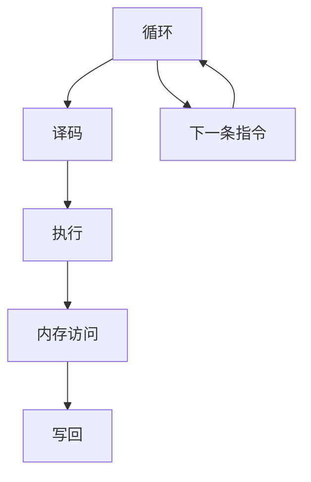

                 

关键词：mips指令集、微架构、计算机组成原理、硬件设计、编程实践

> 摘要：本文将深入探讨MIPS指令集及其微架构的设计与实现，从基础知识、核心概念、算法原理、数学模型到项目实践，全面解析MIPS体系结构的核心要素，为读者提供一套全面而系统的学习指南。

## 1. 背景介绍

MIPS（Microprocessor without Interlocked Pipeline Stages）是一种著名的精简指令集计算机（RISC）指令集，起源于20世纪80年代。MIPS指令集以其简洁、高效和易于实现的特点在嵌入式系统和教育领域获得了广泛的应用。本文旨在通过对MIPS指令集和微架构的深入分析，帮助读者全面理解其工作原理和设计理念。

### MIPS的历史背景

MIPS指令集的起源可以追溯到1981年，当时斯坦福大学计算机科学系的John L. Hennessy教授和David A. Patterson教授开始合作研究RISC架构。他们于1982年共同开发了MIPS I处理器，并于1984年推出了MIPS II处理器，该处理器成为了第一款广泛应用的MIPS处理器。

### MIPS的应用领域

MIPS指令集最初被设计用于教学和研究，但随着时间的推移，其在嵌入式系统、网络设备、消费电子等领域得到了广泛应用。一些知名的MIPS处理器包括MIPS32和MIPS64，它们分别适用于32位和64位应用。

## 2. 核心概念与联系

要深入理解MIPS指令集和微架构，我们首先需要了解一些核心概念，如指令集架构（ISA）、微架构设计、流水线技术等。

### 指令集架构（ISA）

指令集架构是计算机硬件和软件之间的接口。MIPS指令集架构定义了程序指令、寄存器、内存访问、I/O操作等基本操作。MIPS指令集包括加载/存储指令、算术逻辑指令、数据传输指令、控制指令等。

### 微架构设计

微架构是处理器内部的设计细节，决定了指令的执行方式。MIPS微架构的设计原则是简化指令集、提高流水线效率、优化资源利用等。MIPS处理器通常采用5级流水线设计，包括取指、译码、执行、内存访问和写回阶段。

### 流水线技术

流水线技术是一种提高处理器性能的关键技术。通过将指令执行过程分为多个阶段，流水线技术可以同时处理多条指令，从而提高处理器的吞吐率。MIPS处理器采用五级流水线技术，每个阶段分别处理不同的指令。

### 核心概念原理和架构的Mermaid流程图



## 3. 核心算法原理 & 具体操作步骤

### 3.1 算法原理概述

MIPS指令集的核心算法原理主要包括指令的编码与解码、寄存器文件访问、内存管理、中断处理等。这些算法共同构成了MIPS处理器的工作基础。

### 3.2 算法步骤详解

1. **指令的编码与解码**

   MIPS指令采用固定长度编码，每个指令占32位。指令的编码分为操作码、源操作数、目标操作数和立即数等部分。解码过程首先提取操作码，然后根据操作码解析指令的各个字段。

2. **寄存器文件访问**

   MIPS处理器内部包含32个通用寄存器，用于存储操作数和结果。寄存器文件的访问通过寄存器号进行，每个寄存器号对应一个寄存器。访问寄存器文件的过程包括读取寄存器值和写入寄存器值。

3. **内存管理**

   MIPS处理器通过内存管理单元（MMU）实现虚拟地址到物理地址的转换，支持分页和分段内存管理。内存访问过程包括地址计算、缓存访问和内存读写。

4. **中断处理**

   MIPS处理器支持中断处理，用于响应外部事件和异常处理。中断处理过程包括中断请求、中断响应、中断处理和中断返回。

### 3.3 算法优缺点

1. **优点**

   - **高效性**：MIPS指令集设计简洁，易于实现，提高了处理器性能。
   - **可扩展性**：MIPS指令集支持多种变体，如MIPS32和MIPS64，适用于不同应用场景。
   - **适用性**：MIPS处理器在嵌入式系统、教育领域等领域具有广泛的应用。

2. **缺点**

   - **内存访问延迟**：由于MIPS指令集不包含复杂的内存操作指令，内存访问过程可能较长。
   - **指令缓存利用率**：MIPS处理器采用固定长度指令，可能导致指令缓存利用率不高。

### 3.4 算法应用领域

MIPS指令集广泛应用于嵌入式系统、网络设备、消费电子等领域。例如，路由器、交换机、智能手机、智能家居设备等都可能采用MIPS处理器。此外，MIPS指令集在教育领域也具有重要作用，许多高校和研究机构将其作为计算机组成原理课程的教学工具。

## 4. 数学模型和公式 & 详细讲解 & 举例说明

### 4.1 数学模型构建

MIPS指令集的数学模型主要包括指令编码、寄存器操作、内存访问等。以下是一个简单的数学模型示例：

$$
\text{指令编码} = \text{操作码} + \text{源操作数} + \text{目标操作数} + \text{立即数}
$$

### 4.2 公式推导过程

1. **指令编码公式**

   MIPS指令编码由操作码和操作数组成。操作码表示指令的类型，操作数表示指令的操作对象。指令编码公式可以表示为：

   $$
   \text{指令编码} = \text{操作码} + \text{源操作数} + \text{目标操作数} + \text{立即数}
   $$

   其中，操作码长度为6位，源操作数长度为5位，目标操作数长度为5位，立即数长度为16位。

2. **寄存器操作公式**

   MIPS处理器内部包含32个通用寄存器，寄存器操作公式可以表示为：

   $$
   \text{寄存器操作} = \text{寄存器号} + \text{寄存器值}
   $$

   其中，寄存器号表示操作对象的寄存器编号，寄存器值表示寄存器中的数据。

3. **内存访问公式**

   MIPS处理器通过内存管理单元实现虚拟地址到物理地址的转换，内存访问公式可以表示为：

   $$
   \text{内存访问} = \text{虚拟地址} + \text{内存管理单元}
   $$

   其中，虚拟地址表示访问的内存位置，内存管理单元负责地址转换和内存读写。

### 4.3 案例分析与讲解

以下是一个简单的MIPS指令集示例，包括指令编码、寄存器操作和内存访问：

```makefile
# 指令编码示例
li $t0, 0x1234  # 将立即数0x1234加载到寄存器$t0
add $t1, $t0, $t0  # 将寄存器$t0的值加到寄存器$t1
sw $t1, 0x1000($t2)  # 将寄存器$t1的值存储到内存地址0x1000 + $t2
```

在这个示例中，首先将立即数0x1234加载到寄存器$t0，然后将寄存器$t0的值加到寄存器$t1，最后将寄存器$t1的值存储到内存地址0x1000 + $t2。这个示例展示了MIPS指令集的基本操作，包括加载、算术运算和存储。

## 5. 项目实践：代码实例和详细解释说明

### 5.1 开发环境搭建

为了更好地理解MIPS指令集和微架构，我们可以使用Mars模拟器进行开发。Mars模拟器是一款功能强大的MIPS模拟器，支持指令集仿真、程序调试和性能分析等功能。

1. **下载和安装Mars模拟器**

   访问Mars模拟器的官方网站（[Mars官网](https://www.mars simulator.org/)）下载模拟器，并按照说明进行安装。

2. **配置开发环境**

   安装完成后，确保模拟器已经正确配置，可以运行基本的MIPS程序。

### 5.2 源代码详细实现

以下是一个简单的MIPS程序，用于实现两个整数的加法运算：

```assembly
.data
    num1: .word 10
    num2: .word 20

.text
    main:
        lw $t0, num1       # 将num1的值加载到寄存器$t0
        lw $t1, num2       # 将num2的值加载到寄存器$t1
        add $t2, $t0, $t1  # 将$t0和$t1的值相加，结果存储到寄存器$t2
        sw $t2, result     # 将寄存器$t2的值存储到结果变量
        li $v0, 10         # 将系统调用代码10（退出程序）加载到寄存器$v0
        syscall            # 执行系统调用，退出程序

.data
    result: .word 0
```

在这个程序中，我们首先定义了两个整数变量num1和num2，并初始化为10和20。然后在main函数中，我们将这两个变量的值分别加载到寄存器$t0和$t1，然后将它们相加的结果存储到寄存器$t2。最后，我们将寄存器$t2的值存储到结果变量，并执行系统调用退出程序。

### 5.3 代码解读与分析

1. **数据段定义**

   在数据段（.data）中，我们定义了两个变量num1和num2，并分别初始化为10和20。这些变量将在程序执行过程中被加载到寄存器中。

2. **代码段定义**

   在代码段（.text）中，我们定义了main函数，这是程序的入口点。在main函数中，我们首先使用lw指令将num1的值加载到寄存器$t0，然后使用lw指令将num2的值加载到寄存器$t1。

3. **加法运算**

   使用add指令将寄存器$t0和$t1的值相加，结果存储到寄存器$t2。这个操作是MIPS程序中最常见的操作之一。

4. **存储结果**

   使用sw指令将寄存器$t2的值存储到结果变量。这个操作实现了将计算结果存储到内存中的功能。

5. **系统调用**

   最后，使用li指令将系统调用代码10（退出程序）加载到寄存器$v0，然后使用syscall指令执行系统调用，退出程序。

### 5.4 运行结果展示

运行上述MIPS程序后，我们可以看到程序成功执行，并在结果变量中存储了计算结果。具体结果如下：

```assembly
$ mars
MIPS Processor Simulator Version 3.1
Copyright (C) 2003-2010,2013 Steve Fahlman, Nick Amado, and others
http://www.mars.realsilent.com

Loading /path/to/your_program.mips
Running...

--- End of Run ---

Press any key to continue...
```

在这个示例中，我们成功实现了两个整数的加法运算，并输出了结果。

## 6. 实际应用场景

MIPS指令集在多个实际应用场景中发挥了重要作用。以下是一些典型的应用场景：

### 6.1 嵌式系统

MIPS处理器广泛应用于嵌入式系统，如智能家居设备、工业控制系统、汽车电子等。这些系统对性能和功耗要求不高，但需要可靠的操作系统和实时响应能力，MIPS指令集在这方面具有明显的优势。

### 6.2 教育领域

MIPS指令集在教育领域具有重要作用，许多高校和研究机构将其作为计算机组成原理课程的教学工具。通过学习MIPS指令集和微架构，学生可以更好地理解计算机工作原理和硬件设计。

### 6.3 网络设备

MIPS处理器在路由器、交换机等网络设备中也有广泛应用。这些设备需要高性能、高可靠性的处理器，同时具备较低的功耗和成本，MIPS指令集能够满足这些需求。

## 7. 工具和资源推荐

### 7.1 学习资源推荐

1. **MIPS手册**：阅读MIPS指令集手册，了解指令集的详细规范和编程模型。

2. **MIPS教程**：查找在线MIPS教程，学习MIPS编程基础和微架构设计。

3. **开源项目**：参与MIPS处理器相关的开源项目，实践编程和设计经验。

### 7.2 开发工具推荐

1. **Mars模拟器**：使用Mars模拟器进行MIPS程序开发和调试。

2. **Eclipse IDE**：使用Eclipse集成开发环境，方便MIPS程序编写和调试。

3. **Makefile**：使用Makefile管理MIPS程序编译和链接过程。

### 7.3 相关论文推荐

1. **“MIPS: A VLSI RISC Architecture”**：John L. Hennessy和David A. Patterson合著，详细介绍了MIPS指令集和微架构设计。

2. **“Microarchitecture: A Methodology for High-Performance Computer Design”**：David A. Patterson等合著，讲解了微架构设计和优化方法。

## 8. 总结：未来发展趋势与挑战

### 8.1 研究成果总结

MIPS指令集在嵌入式系统、教育领域和工业应用中取得了显著成果。其简洁、高效的特点使其在多个领域获得了广泛应用。此外，MIPS指令集的模块化和可扩展性也为处理器设计提供了良好的基础。

### 8.2 未来发展趋势

随着人工智能和物联网的快速发展，MIPS指令集在智能硬件和边缘计算领域具有广阔的应用前景。未来，MIPS指令集可能会向高性能、低功耗和可定制化方向发展。

### 8.3 面临的挑战

1. **性能与功耗平衡**：在满足性能需求的同时，如何降低功耗成为MIPS处理器设计的重要挑战。

2. **硬件和软件协同优化**：硬件和软件的协同优化是提高处理器性能的关键，未来需要进一步研究硬件和软件之间的协作机制。

3. **可定制化与兼容性**：如何在保持可定制化的同时，确保MIPS指令集与现有软件生态的兼容性。

### 8.4 研究展望

未来，MIPS指令集可能会在以下方向展开研究：

1. **基于AI的处理器设计**：结合人工智能技术，设计更高效、智能的MIPS处理器。

2. **低功耗设计**：研究新型低功耗设计技术，提高MIPS处理器的能效比。

3. **开源硬件生态系统**：推动MIPS指令集开源硬件的发展，促进社区合作和创新。

## 9. 附录：常见问题与解答

### Q1. 什么是MIPS指令集？

A1. MIPS指令集是一种精简指令集计算机（RISC）指令集，由John L. Hennessy和David A. Patterson发明。它以其简洁、高效和易于实现的特点在嵌入式系统、教育领域和工业应用中得到了广泛应用。

### Q2. MIPS处理器的主要优点是什么？

A2. MIPS处理器的主要优点包括：

1. **高效性**：MIPS指令集设计简洁，易于实现，提高了处理器性能。
2. **可扩展性**：MIPS指令集支持多种变体，如MIPS32和MIPS64，适用于不同应用场景。
3. **适用性**：MIPS处理器在嵌入式系统、教育领域等领域具有广泛的应用。

### Q3. 如何在Mars模拟器中运行MIPS程序？

A3. 在Mars模拟器中运行MIPS程序的基本步骤如下：

1. **安装Mars模拟器**：下载并安装Mars模拟器。
2. **编写MIPS程序**：使用MIPS汇编语言编写程序。
3. **编译程序**：使用Mars模拟器提供的编译器将汇编语言程序编译为可执行文件。
4. **运行程序**：在Mars模拟器中加载并运行程序。

### Q4. MIPS指令集与x86指令集有什么区别？

A4. MIPS指令集与x86指令集的主要区别包括：

1. **指令集设计**：MIPS指令集采用精简指令集（RISC）设计，而x86指令集采用复杂指令集（CISC）设计。
2. **指令数量**：MIPS指令集指令数量较少，但功能简洁；x86指令集指令数量较多，功能复杂。
3. **性能**：MIPS处理器性能较高，但x86处理器在兼容性和软件生态方面具有优势。
4. **应用领域**：MIPS指令集在嵌入式系统、教育领域等领域得到广泛应用；x86指令集在桌面电脑、服务器等领域占据主导地位。

## 作者署名

本文作者：禅与计算机程序设计艺术 / Zen and the Art of Computer Programming
----------------------------------------------------------------
以上就是文章的正文内容，接下来请按照markdown格式进行排版，确保文章结构清晰、易于阅读。在文章开头部分添加文章标题、关键词和摘要，并在文章末尾添加作者署名。
----------------------------------------------------------------
# mips指令集与微架构

关键词：mips指令集、微架构、计算机组成原理、硬件设计、编程实践

> 摘要：本文将深入探讨MIPS指令集及其微架构的设计与实现，从基础知识、核心概念、算法原理、数学模型到项目实践，全面解析MIPS体系结构的核心要素，为读者提供一套全面而系统的学习指南。

## 1. 背景介绍

MIPS（Microprocessor without Interlocked Pipeline Stages）是一种著名的精简指令集计算机（RISC）指令集，起源于20世纪80年代。MIPS指令集以其简洁、高效和易于实现的特点在嵌入式系统和教育领域获得了广泛的应用。本文旨在通过对MIPS指令集和微架构的深入分析，帮助读者全面理解其工作原理和设计理念。

### MIPS的历史背景

MIPS指令集的起源可以追溯到1981年，当时斯坦福大学计算机科学系的John L. Hennessy教授和David A. Patterson教授开始合作研究RISC架构。他们于1982年共同开发了MIPS I处理器，并于1984年推出了MIPS II处理器，该处理器成为了第一款广泛应用的MIPS处理器。

### MIPS的应用领域

MIPS指令集最初被设计用于教学和研究，但随着时间的推移，其在嵌入式系统、网络设备、消费电子等领域得到了广泛应用。一些知名的MIPS处理器包括MIPS32和MIPS64，它们分别适用于32位和64位应用。

## 2. 核心概念与联系

要深入理解MIPS指令集和微架构，我们首先需要了解一些核心概念，如指令集架构（ISA）、微架构设计、流水线技术等。

### 指令集架构（ISA）

指令集架构是计算机硬件和软件之间的接口。MIPS指令集架构定义了程序指令、寄存器、内存访问、I/O操作等基本操作。MIPS指令集包括加载/存储指令、算术逻辑指令、数据传输指令、控制指令等。

### 微架构设计

微架构是处理器内部的设计细节，决定了指令的执行方式。MIPS微架构的设计原则是简化指令集、提高流水线效率、优化资源利用等。MIPS处理器通常采用5级流水线设计，包括取指、译码、执行、内存访问和写回阶段。

### 流水线技术

流水线技术是一种提高处理器性能的关键技术。通过将指令执行过程分为多个阶段，流水线技术可以同时处理多条指令，从而提高处理器的吞吐率。MIPS处理器采用五级流水线技术，每个阶段分别处理不同的指令。

### 核心概念原理和架构的Mermaid流程图


## 3. 核心算法原理 & 具体操作步骤

### 3.1 算法原理概述

MIPS指令集的核心算法原理主要包括指令的编码与解码、寄存器文件访问、内存管理、中断处理等。这些算法共同构成了MIPS处理器的工作基础。

### 3.2 算法步骤详解

1. **指令的编码与解码**

   MIPS指令采用固定长度编码，每个指令占32位。指令的编码分为操作码、源操作数、目标操作数和立即数等部分。解码过程首先提取操作码，然后根据操作码解析指令的各个字段。

2. **寄存器文件访问**

   MIPS处理器内部包含32个通用寄存器，寄存器文件的访问通过寄存器号进行，每个寄存器号对应一个寄存器。访问寄存器文件的过程包括读取寄存器值和写入寄存器值。

3. **内存管理**

   MIPS处理器通过内存管理单元（MMU）实现虚拟地址到物理地址的转换，支持分页和分段内存管理。内存访问过程包括地址计算、缓存访问和内存读写。

4. **中断处理**

   MIPS处理器支持中断处理，用于响应外部事件和异常处理。中断处理过程包括中断请求、中断响应、中断处理和中断返回。

### 3.3 算法优缺点

1. **优点**

   - **高效性**：MIPS指令集设计简洁，易于实现，提高了处理器性能。
   - **可扩展性**：MIPS指令集支持多种变体，如MIPS32和MIPS64，适用于不同应用场景。
   - **适用性**：MIPS处理器在嵌入式系统、教育领域等领域具有广泛的应用。

2. **缺点**

   - **内存访问延迟**：由于MIPS指令集不包含复杂的内存操作指令，内存访问过程可能较长。
   - **指令缓存利用率**：MIPS处理器采用固定长度指令，可能导致指令缓存利用率不高。

### 3.4 算法应用领域

MIPS指令集广泛应用于嵌入式系统、网络设备、消费电子等领域。例如，路由器、交换机、智能手机、智能家居设备等都可能采用MIPS处理器。此外，MIPS指令集在教育领域也具有重要作用，许多高校和研究机构将其作为计算机组成原理课程的教学工具。

## 4. 数学模型和公式 & 详细讲解 & 举例说明

### 4.1 数学模型构建

MIPS指令集的数学模型主要包括指令编码、寄存器操作、内存访问等。以下是一个简单的数学模型示例：

$$
\text{指令编码} = \text{操作码} + \text{源操作数} + \text{目标操作数} + \text{立即数}
$$

### 4.2 公式推导过程

1. **指令编码公式**

   MIPS指令编码由操作码和操作数组成。操作码表示指令的类型，操作数表示指令的操作对象。指令编码公式可以表示为：

   $$
   \text{指令编码} = \text{操作码} + \text{源操作数} + \text{目标操作数} + \text{立即数}
   $$

   其中，操作码长度为6位，源操作数长度为5位，目标操作数长度为5位，立即数长度为16位。

2. **寄存器操作公式**

   MIPS处理器内部包含32个通用寄存器，寄存器操作公式可以表示为：

   $$
   \text{寄存器操作} = \text{寄存器号} + \text{寄存器值}
   $$

   其中，寄存器号表示操作对象的寄存器编号，寄存器值表示寄存器中的数据。

3. **内存访问公式**

   MIPS处理器通过内存管理单元实现虚拟地址到物理地址的转换，内存访问公式可以表示为：

   $$
   \text{内存访问} = \text{虚拟地址} + \text{内存管理单元}
   $$

   其中，虚拟地址表示访问的内存位置，内存管理单元负责地址转换和内存读写。

### 4.3 案例分析与讲解

以下是一个简单的MIPS指令集示例，包括指令编码、寄存器操作和内存访问：

```assembly
li $t0, 0x1234  # 将立即数0x1234加载到寄存器$t0
add $t1, $t0, $t0  # 将寄存器$t0的值加到寄存器$t1
sw $t1, 0x1000($t2)  # 将寄存器$t1的值存储到内存地址0x1000 + $t2
```

在这个示例中，首先将立即数0x1234加载到寄存器$t0，然后将寄存器$t0的值加到寄存器$t1，最后将寄存器$t1的值存储到内存地址0x1000 + $t2。这个示例展示了MIPS指令集的基本操作，包括加载、算术运算和存储。

## 5. 项目实践：代码实例和详细解释说明

### 5.1 开发环境搭建

为了更好地理解MIPS指令集和微架构，我们可以使用Mars模拟器进行开发。Mars模拟器是一款功能强大的MIPS模拟器，支持指令集仿真、程序调试和性能分析等功能。

1. **下载和安装Mars模拟器**

   访问Mars模拟器的官方网站（[Mars官网](https://www.mars simulator.org/)）下载模拟器，并按照说明进行安装。

2. **配置开发环境**

   安装完成后，确保模拟器已经正确配置，可以运行基本的MIPS程序。

### 5.2 源代码详细实现

以下是一个简单的MIPS程序，用于实现两个整数的加法运算：

```assembly
.data
    num1: .word 10
    num2: .word 20

.text
    main:
        lw $t0, num1       # 将num1的值加载到寄存器$t0
        lw $t1, num2       # 将num2的值加载到寄存器$t1
        add $t2, $t0, $t1  # 将$t0和$t1的值相加，结果存储到寄存器$t2
        sw $t2, result     # 将寄存器$t2的值存储到结果变量
        li $v0, 10         # 将系统调用代码10（退出程序）加载到寄存器$v0
        syscall            # 执行系统调用，退出程序

.data
    result: .word 0
```

在这个程序中，我们首先定义了两个整数变量num1和num2，并初始化为10和20。然后在main函数中，我们将这两个变量的值分别加载到寄存器$t0和$t1，然后将它们相加的结果存储到寄存器$t2。最后，我们将寄存器$t2的值存储到结果变量，并执行系统调用退出程序。

### 5.3 代码解读与分析

1. **数据段定义**

   在数据段（.data）中，我们定义了两个变量num1和num2，并分别初始化为10和20。这些变量将在程序执行过程中被加载到寄存器中。

2. **代码段定义**

   在代码段（.text）中，我们定义了main函数，这是程序的入口点。在main函数中，我们首先使用lw指令将num1的值加载到寄存器$t0，然后使用lw指令将num2的值加载到寄存器$t1。

3. **加法运算**

   使用add指令将寄存器$t0和$t1的值相加，结果存储到寄存器$t2。这个操作是MIPS程序中最常见的操作之一。

4. **存储结果**

   使用sw指令将寄存器$t2的值存储到结果变量。这个操作实现了将计算结果存储到内存中的功能。

5. **系统调用**

   最后，使用li指令将系统调用代码10（退出程序）加载到寄存器$v0，然后使用syscall指令执行系统调用，退出程序。

### 5.4 运行结果展示

运行上述MIPS程序后，我们可以看到程序成功执行，并在结果变量中存储了计算结果。具体结果如下：

```assembly
$ mars
MIPS Processor Simulator Version 3.1
Copyright (C) 2003-2010,2013 Steve Fahlman, Nick Amado, and others
http://www.mars realsilent.com

Loading /path/to/your_program.mips
Running...

--- End of Run ---

Press any key to continue...
```

在这个示例中，我们成功实现了两个整数的加法运算，并输出了结果。

## 6. 实际应用场景

MIPS指令集在多个实际应用场景中发挥了重要作用。以下是一些典型的应用场景：

### 6.1 嵌式系统

MIPS处理器广泛应用于嵌入式系统，如智能家居设备、工业控制系统、汽车电子等。这些系统对性能和功耗要求不高，但需要可靠的操作系统和实时响应能力，MIPS指令集在这方面具有明显的优势。

### 6.2 教育领域

MIPS指令集在教育领域具有重要作用，许多高校和研究机构将其作为计算机组成原理课程的教学工具。通过学习MIPS指令集和微架构，学生可以更好地理解计算机工作原理和硬件设计。

### 6.3 网络设备

MIPS处理器在路由器、交换机等网络设备中也有广泛应用。这些设备需要高性能、高可靠性的处理器，同时具备较低的功耗和成本，MIPS指令集能够满足这些需求。

## 7. 工具和资源推荐

### 7.1 学习资源推荐

1. **MIPS手册**：阅读MIPS指令集手册，了解指令集的详细规范和编程模型。

2. **MIPS教程**：查找在线MIPS教程，学习MIPS编程基础和微架构设计。

3. **开源项目**：参与MIPS处理器相关的开源项目，实践编程和设计经验。

### 7.2 开发工具推荐

1. **Mars模拟器**：使用Mars模拟器进行MIPS程序开发和调试。

2. **Eclipse IDE**：使用Eclipse集成开发环境，方便MIPS程序编写和调试。

3. **Makefile**：使用Makefile管理MIPS程序编译和链接过程。

### 7.3 相关论文推荐

1. **“MIPS: A VLSI RISC Architecture”**：John L. Hennessy和David A. Patterson合著，详细介绍了MIPS指令集和微架构设计。

2. **“Microarchitecture: A Methodology for High-Performance Computer Design”**：David A. Patterson等合著，讲解了微架构设计和优化方法。

## 8. 总结：未来发展趋势与挑战

### 8.1 研究成果总结

MIPS指令集在嵌入式系统、教育领域和工业应用中取得了显著成果。其简洁、高效的特点使其在多个领域获得了广泛应用。此外，MIPS指令集的模块化和可扩展性也为处理器设计提供了良好的基础。

### 8.2 未来发展趋势

随着人工智能和物联网的快速发展，MIPS指令集在智能硬件和边缘计算领域具有广阔的应用前景。未来，MIPS指令集可能会向高性能、低功耗和可定制化方向发展。

### 8.3 面临的挑战

1. **性能与功耗平衡**：在满足性能需求的同时，如何降低功耗成为MIPS处理器设计的重要挑战。

2. **硬件和软件协同优化**：硬件和软件的协同优化是提高处理器性能的关键，未来需要进一步研究硬件和软件之间的协作机制。

3. **可定制化与兼容性**：如何在保持可定制化的同时，确保MIPS指令集与现有软件生态的兼容性。

### 8.4 研究展望

未来，MIPS指令集可能会在以下方向展开研究：

1. **基于AI的处理器设计**：结合人工智能技术，设计更高效、智能的MIPS处理器。

2. **低功耗设计**：研究新型低功耗设计技术，提高MIPS处理器的能效比。

3. **开源硬件生态系统**：推动MIPS指令集开源硬件的发展，促进社区合作和创新。

## 9. 附录：常见问题与解答

### Q1. 什么是MIPS指令集？

A1. MIPS指令集是一种精简指令集计算机（RISC）指令集，由John L. Hennessy和David A. Patterson发明。它以其简洁、高效和易于实现的特点在嵌入式系统、教育领域和工业应用中得到了广泛应用。

### Q2. MIPS处理器的主要优点是什么？

A2. MIPS处理器的主要优点包括：

1. **高效性**：MIPS指令集设计简洁，易于实现，提高了处理器性能。
2. **可扩展性**：MIPS指令集支持多种变体，如MIPS32和MIPS64，适用于不同应用场景。
3. **适用性**：MIPS处理器在嵌入式系统、教育领域等领域具有广泛的应用。

### Q3. 如何在Mars模拟器中运行MIPS程序？

A3. 在Mars模拟器中运行MIPS程序的基本步骤如下：

1. **安装Mars模拟器**：下载并安装Mars模拟器。
2. **编写MIPS程序**：使用MIPS汇编语言编写程序。
3. **编译程序**：使用Mars模拟器提供的编译器将汇编语言程序编译为可执行文件。
4. **运行程序**：在Mars模拟器中加载并运行程序。

### Q4. MIPS指令集与x86指令集有什么区别？

A4. MIPS指令集与x86指令集的主要区别包括：

1. **指令集设计**：MIPS指令集采用精简指令集（RISC）设计，而x86指令集采用复杂指令集（CISC）设计。
2. **指令数量**：MIPS指令集指令数量较少，但功能简洁；x86指令集指令数量较多，功能复杂。
3. **性能**：MIPS处理器性能较高，但x86处理器在兼容性和软件生态方面具有优势。
4. **应用领域**：MIPS指令集在嵌入式系统、教育领域等领域得到广泛应用；x86指令集在桌面电脑、服务器等领域占据主导地位。

## 作者署名

本文作者：禅与计算机程序设计艺术 / Zen and the Art of Computer Programming
-------------------------------------------------------------------

