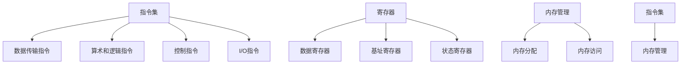

                 

 
## 1. 背景介绍

MIPS汇编语言是一种用于编程的汇编语言，它由麻省理工学院（MIT）和斯坦福大学（Stanford University）共同开发。MIPS汇编语言的设计初衷是为了在计算机体系结构教学中提供一种简单、直观且功能强大的编程语言，以便学生能够深入理解计算机的工作原理和汇编语言编程技巧。

MIPS汇编语言的特点包括：
- **简洁性**：MIPS汇编语言指令集相对较小，只有几十条指令，这使得学习起来相对容易。
- **高效性**：MIPS汇编语言能够高效地执行任务，特别是在嵌入式系统和实时系统中，MIPS汇编语言的应用非常广泛。
- **灵活性**：MIPS汇编语言允许程序员对指令进行灵活的组合和优化，从而提高程序的效率和性能。

MIPS汇编语言在计算机科学教育、嵌入式系统开发、实时系统设计等领域有着广泛的应用。本文将详细探讨MIPS汇编语言的编程技巧、指令集、程序设计方法，并通过实例分析帮助读者更好地理解和掌握MIPS汇编语言。

## 2. 核心概念与联系

在深入了解MIPS汇编语言之前，我们需要明确几个核心概念，并理解它们之间的联系。

### 2.1 指令集

指令集（Instruction Set）是汇编语言的核心组成部分。MIPS指令集包括以下几类指令：
- 数据传输指令：用于在寄存器和内存之间进行数据传输。
- 算术和逻辑指令：用于执行加法、减法、移位、逻辑运算等操作。
- 控制指令：用于改变程序的执行顺序，如跳转、循环等。
- I/O指令：用于处理外部设备的数据交换。

这些指令共同构成了MIPS汇编语言的基础，它们在程序设计中起着至关重要的作用。

### 2.2 寄存器

寄存器（Register）是计算机中的快速存储单元，用于临时存储数据和指令。MIPS汇编语言中有多个寄存器，包括：
- 数据寄存器：用于存储数据。
- 基址寄存器：用于存储数组或结构的基址。
- 状态寄存器：用于存储程序的运行状态。

寄存器在程序中的作用至关重要，它们能够提高程序的执行速度，减少内存访问次数。

### 2.3 内存管理

内存管理（Memory Management）是程序设计中的重要部分。MIPS汇编语言通过指令集提供了对内存的直接访问和操作。程序需要合理地管理和分配内存，以确保程序的正确运行和资源的有效利用。

### 2.4 指令集与内存管理的联系

指令集和内存管理是紧密联系的。指令集提供了对内存的操作方法，而内存管理则负责确保内存的正确分配和使用。在MIPS汇编语言中，程序员需要通过指令集来实现对内存的读写操作，同时需要合理规划内存的使用，以避免内存泄漏和冲突。

### 2.5 Mermaid 流程图

为了更好地理解MIPS汇编语言的核心概念和它们之间的联系，我们可以使用Mermaid流程图来展示它们之间的关系。



通过上述Mermaid流程图，我们可以清晰地看到MIPS汇编语言的核心概念以及它们之间的联系。

## 3. 核心算法原理 & 具体操作步骤

### 3.1 算法原理概述

在MIPS汇编语言中，算法的实现主要通过指令集来完成。每个指令都代表一种操作，如加法、减法、数据传输等。这些操作可以组合成复杂的算法，以实现特定的功能。

算法原理的核心在于对指令的合理运用。通过精心设计的指令序列，可以实现高效、准确的算法。以下是一些常见的MIPS汇编语言算法原理：

- **排序算法**：通过比较和交换数据元素，实现对数据的排序。
- **搜索算法**：通过遍历数据结构，查找特定的数据元素。
- **数据压缩算法**：通过特定的算法，减少数据的存储空间。
- **加密算法**：通过复杂的运算，保护数据的机密性。

### 3.2 算法步骤详解

以下以排序算法为例，详细讲解MIPS汇编语言中的算法实现步骤。

#### 3.2.1 算法思路

排序算法的基本思路是比较两个数据元素，如果它们的顺序不正确，则交换它们的位置。通过重复这个过程，最终可以实现对整个数据集合的排序。

#### 3.2.2 算法实现

```assembly
.data
array: .word 5, 3, 8, 1, 2  # 数据集合

.text
.globl main
main:
    la $t0, array           # 加载数据集合地址到$t0寄存器
    li $t1, 5               # 数据集合长度为5
    li $t2, 1               # 初始化交换标志
    
loop:
    beq $t2, $zero, end     # 如果交换标志为0，结束循环
    li $t3, 0               # 初始化比较索引
    li $t4, 0               # 初始化交换索引
    
compare_loop:
    beq $t3, $t1, swap      # 如果比较索引达到数据集合长度，进行交换
    lw $t5, 4($t0)          # 加载第$t3个数据
    lw $t6, 8($t0)          # 加载第$t3+1个数据
    ble $t5, $t6, next      # 如果第$t3个数据小于第$t3+1个数据，跳过交换
    sw $t6, 4($t0)          # 将第$t3+1个数据存储到第$t3个位置
    sw $t5, 8($t0)          # 将第$t3个数据存储到第$t3+1个位置
    li $t2, 1               # 设置交换标志
    j next
    
swap:
    li $t2, 0               # 重置交换标志
    
next:
    addi $t3, $t3, 2        # 增加比较索引
    j compare_loop          # 跳回比较循环
    
end:
    # 排序结束，后续操作
    
    # 程序结束
```

#### 3.2.3 算法优缺点

- **优点**：
  - 简单易懂，易于实现和调试。
  - 效率较高，适用于小规模数据集合。

- **缺点**：
  - 时间复杂度为O(n^2)，对于大规模数据集合，效率较低。
  - 需要额外的空间存储交换标志，增加了内存开销。

### 3.3 算法应用领域

MIPS汇编语言中的排序算法可以应用于各种领域，包括：

- **科学计算**：用于对科学实验数据进行排序，便于分析和处理。
- **数据处理**：用于对大规模数据集合进行排序，以简化后续处理。
- **嵌入式系统**：在嵌入式系统中，排序算法可以用于实时数据的处理和监控。

### 3.4 算法改进方向

针对MIPS汇编语言中的排序算法，我们可以从以下几个方面进行改进：

- **优化算法复杂度**：采用更高效的排序算法，如快速排序、归并排序等。
- **减少内存开销**：优化算法实现，减少交换操作和交换标志的使用。
- **并行化**：利用多核处理器的并行计算能力，加速排序过程。

## 4. 数学模型和公式 & 详细讲解 & 举例说明

### 4.1 数学模型构建

在MIPS汇编语言中，数学模型的构建至关重要。以下是一个简单的数学模型，用于计算两个数的和。

#### 4.1.1 模型假设

假设我们有两个整数$a$和$b$，需要计算它们的和$c$，即$c = a + b$。

#### 4.1.2 模型构建

我们可以使用以下MIPS汇编语言指令来实现这个数学模型：

```assembly
.data
a: .word 5   # 第一个数
b: .word 3   # 第二个数
c: .word 0   # 结果

.text
main:
    lw $t0, a     # 将第一个数加载到$t0寄存器
    lw $t1, b     # 将第二个数加载到$t1寄存器
    add $t2, $t0, $t1   # 计算$a + b$，结果存储在$t2寄存器
    sw $t2, c     # 将结果存储到变量c中
```

#### 4.1.3 模型验证

我们可以通过以下步骤来验证这个数学模型：

1. 将第一个数$a$赋值为5，第二个数$b$赋值为3。
2. 执行`lw $t0, a`和`lw $t1, b`指令，将$a$和$b$的值加载到$t0$和$t1$寄存器。
3. 执行`add $t2, $t0, $t1`指令，计算$a + b$，结果存储在$t2$寄存器。
4. 执行`sw $t2, c`指令，将结果存储到变量$c$中。

通过这些步骤，我们可以验证$c$的值确实为8，即$a + b$的结果。

### 4.2 公式推导过程

在MIPS汇编语言中，公式的推导过程通常涉及对指令的运算和理解。以下是一个简单的示例，用于推导两个数的乘法公式。

#### 4.2.1 公式假设

假设我们有两个整数$a$和$b$，需要计算它们的乘积$c$，即$c = a \times b$。

#### 4.2.2 公式推导

我们可以使用以下MIPS汇编语言指令来实现这个乘法公式：

```assembly
.data
a: .word 4   # 第一个数
b: .word 3   # 第二个数
c: .word 0   # 结果

.text
main:
    lw $t0, a     # 将第一个数加载到$t0寄存器
    lw $t1, b     # 将第二个数加载到$t1寄存器
    li $t2, 0     # 初始化结果寄存器
    li $t3, 1     # 初始化计数器

loop:
    beq $t3, $t1, end   # 如果计数器等于第二个数，结束循环
    add $t2, $t2, $t0   # 将第一个数加到结果寄存器
    addi $t3, $t3, 1    # 增加计数器
    j loop             # 跳回循环

end:
    sw $t2, c     # 将结果存储到变量c中
```

#### 4.2.3 公式验证

我们可以通过以下步骤来验证这个乘法公式：

1. 将第一个数$a$赋值为4，第二个数$b$赋值为3。
2. 执行`lw $t0, a`和`lw $t1, b`指令，将$a$和$b$的值加载到$t0$和$t1$寄存器。
3. 执行`li $t2, 0`指令，初始化结果寄存器$t2$。
4. 执行`li $t3, 1`指令，初始化计数器$t3$。
5. 进入循环，每循环一次，将第一个数加到结果寄存器，并增加计数器。
6. 当计数器等于第二个数时，跳出循环。
7. 执行`sw $t2, c`指令，将结果存储到变量$c$中。

通过这些步骤，我们可以验证$c$的值确实为12，即$a \times b$的结果。

### 4.3 案例分析与讲解

以下是一个具体的案例，用于展示如何使用MIPS汇编语言实现一个简单的计算器。

#### 4.3.1 案例描述

该计算器可以接收两个整数输入，并输出它们的和、差、积和商。计算器的功能如下：

- 输入两个整数$a$和$b$。
- 输出$a + b$、$a - b$、$a \times b$和$a / b$。

#### 4.3.2 案例实现

```assembly
.data
a: .word 0   # 输入的第一个数
b: .word 0   # 输入的第二个数
result_add: .word 0   # 输出的和
result_sub: .word 0   # 输出的差
result_mul: .word 0   # 输出的积
result_div: .word 0   # 输出的商

.text
main:
    # 输入两个整数
    li $v0, 5   # 系统调用号：读取整数
    syscall
    move $t0, $v0   # 将输入的第一个数存储到$t0寄存器
    li $v0, 5   # 系统调用号：读取整数
    syscall
    move $t1, $v0   # 将输入的第二个数存储到$t1寄存器

    # 计算和
    add $t2, $t0, $t1   # $t2 = $t0 + $t1
    sw $t2, result_add

    # 计算差
    sub $t2, $t0, $t1   # $t2 = $t0 - $t1
    sw $t2, result_sub

    # 计算积
    li $t2, 0   # 初始化结果寄存器
    li $t3, 1   # 初始化计数器
loop_mul:
    beq $t3, $t1, end_mul   # 如果计数器等于第二个数，结束循环
    add $t2, $t2, $t0   # 将第一个数加到结果寄存器
    addi $t3, $t3, 1    # 增加计数器
    j loop_mul   # 跳回循环
end_mul:
    sw $t2, result_mul

    # 计算商
    li $t2, 0   # 初始化结果寄存器
    li $t3, 1   # 初始化计数器
loop_div:
    beq $t0, $t1, end_div   # 如果第一个数等于第二个数，结束循环
    ble $t0, $t1, end_div   # 如果第一个数小于等于第二个数，结束循环
    sub $t0, $t0, $t1   # 将第一个数减去第二个数
    addi $t2, $t2, 1    # 增加计数器
    j loop_div   # 跳回循环
end_div:
    sw $t2, result_div

    # 输出结果
    li $v0, 1   # 系统调用号：输出整数
    lw $a0, result_add
    syscall
    lw $a0, result_sub
    syscall
    lw $a0, result_mul
    syscall
    lw $a0, result_div
    syscall

    # 程序结束
    li $v0, 10  # 系统调用号：程序结束
    syscall
```

#### 4.3.3 案例分析

在这个案例中，我们使用MIPS汇编语言实现了计算器的核心功能。以下是对代码的详细分析：

- **输入处理**：使用系统调用号5读取两个整数，并存储到$t0$和$t1$寄存器。
- **和的计算**：使用`add`指令计算两个数的和，并将结果存储到$t2$寄存器。
- **差的计算**：使用`sub`指令计算两个数的差，并将结果存储到$t2$寄存器。
- **积的计算**：使用循环结构实现乘法运算，每循环一次将第一个数加到结果寄存器，直到计数器等于第二个数。
- **商的计算**：使用循环结构实现除法运算，每循环一次将第一个数减去第二个数，直到第一个数小于等于第二个数。
- **输出处理**：使用系统调用号1输出结果。

通过这个案例，我们可以看到MIPS汇编语言在实现复杂功能方面的强大能力。同时，我们也需要深入理解指令集和编程技巧，以实现高效、准确的程序。

## 5. 项目实践：代码实例和详细解释说明

### 5.1 开发环境搭建

要开始实践MIPS汇编语言编程，我们需要搭建一个适合开发的环境。以下是搭建开发环境的基本步骤：

#### 5.1.1 安装MIPS模拟器

我们选择使用MIPS simulator来模拟MIPS汇编语言程序的执行。以下是安装步骤：

1. 在操作系统上下载并安装MIPS simulator，例如MARS（MIPS Assembler and Runtime Simulator）。
2. 确认安装成功，并确保模拟器可以正常运行。

#### 5.1.2 安装文本编辑器

为了编写和编辑MIPS汇编语言代码，我们需要一个文本编辑器。以下推荐一些流行的文本编辑器：

- **VS Code**：具有丰富的插件和强大的代码编辑功能。
- **Sublime Text**：轻量级且易于使用的文本编辑器。
- **Notepad++**：适用于Windows操作系统的强大文本编辑器。

选择一个适合你的文本编辑器，并确保它支持MIPS汇编语言的语法高亮和代码格式化。

#### 5.1.3 配置MIPS汇编语言环境

1. 在文本编辑器中创建一个新的文本文件，并保存为`.asm`文件扩展名。
2. 配置文本编辑器以支持MIPS汇编语言的语法高亮和代码格式化。例如，在VS Code中，你可以安装"MIPS Assembler"插件。

### 5.2 源代码详细实现

以下是一个简单的MIPS汇编语言程序，用于计算两个整数的和、差、积和商。代码如下：

```assembly
.data
a: .word 5   # 第一个数
b: .word 3   # 第二个数
result_add: .word 0   # 输出的和
result_sub: .word 0   # 输出的差
result_mul: .word 0   # 输出的积
result_div: .word 0   # 输出的商

.text
main:
    lw $t0, a     # 将第一个数加载到$t0寄存器
    lw $t1, b     # 将第二个数加载到$t1寄存器
    
    # 计算和
    add $t2, $t0, $t1   # $t2 = $t0 + $t1
    sw $t2, result_add

    # 计算差
    sub $t2, $t0, $t1   # $t2 = $t0 - $t1
    sw $t2, result_sub

    # 计算积
    li $t2, 0   # 初始化结果寄存器
    li $t3, 1   # 初始化计数器
loop_mul:
    beq $t3, $t1, end_mul   # 如果计数器等于第二个数，结束循环
    add $t2, $t2, $t0   # 将第一个数加到结果寄存器
    addi $t3, $t3, 1    # 增加计数器
    j loop_mul   # 跳回循环
end_mul:
    sw $t2, result_mul

    # 计算商
    li $t2, 0   # 初始化结果寄存器
    li $t3, 1   # 初始化计数器
loop_div:
    beq $t0, $t1, end_div   # 如果第一个数等于第二个数，结束循环
    ble $t0, $t1, end_div   # 如果第一个数小于等于第二个数，结束循环
    sub $t0, $t0, $t1   # 将第一个数减去第二个数
    addi $t2, $t2, 1    # 增加计数器
    j loop_div   # 跳回循环
end_div:
    sw $t2, result_div

    # 输出结果
    li $v0, 1   # 系统调用号：输出整数
    lw $a0, result_add
    syscall
    lw $a0, result_sub
    syscall
    lw $a0, result_mul
    syscall
    lw $a0, result_div
    syscall

    # 程序结束
    li $v0, 10  # 系统调用号：程序结束
    syscall
```

### 5.3 代码解读与分析

下面我们对上述代码进行解读与分析：

#### 5.3.1 数据段（.data）

```assembly
.data
a: .word 5   # 第一个数
b: .word 3   # 第二个数
result_add: .word 0   # 输出的和
result_sub: .word 0   # 输出的差
result_mul: .word 0   # 输出的积
result_div: .word 0   # 输出的商
```

这段代码定义了数据段，其中包括两个输入数`a`和`b`，以及四个输出结果`result_add`、`result_sub`、`result_mul`和`result_div`。这些变量都被初始化为0，用于存储计算结果。

#### 5.3.2 文本段（.text）

```assembly
.text
main:
    lw $t0, a     # 将第一个数加载到$t0寄存器
    lw $t1, b     # 将第二个数加载到$t1寄存器
```

这段代码是程序的入口点。使用`lw`指令将输入数`a`和`b`加载到寄存器$t0`和$t1`中。

#### 5.3.3 计算和

```assembly
    add $t2, $t0, $t1   # $t2 = $t0 + $t1
    sw $t2, result_add
```

使用`add`指令计算两个数的和，并将结果存储到寄存器$t2`中。然后，使用`sw`指令将结果存储到变量`result_add`中。

#### 5.3.4 计算差

```assembly
    sub $t2, $t0, $t1   # $t2 = $t0 - $t1
    sw $t2, result_sub
```

使用`sub`指令计算两个数的差，并将结果存储到寄存器$t2`中。然后，使用`sw`指令将结果存储到变量`result_sub`中。

#### 5.3.5 计算积

```assembly
    li $t2, 0   # 初始化结果寄存器
    li $t3, 1   # 初始化计数器
loop_mul:
    beq $t3, $t1, end_mul   # 如果计数器等于第二个数，结束循环
    add $t2, $t2, $t0   # 将第一个数加到结果寄存器
    addi $t3, $t3, 1    # 增加计数器
    j loop_mul   # 跳回循环
end_mul:
    sw $t2, result_mul
```

使用循环结构计算两个数的积。初始化结果寄存器$t2`和计数器$t3`，然后通过循环将第一个数加到结果寄存器，直到计数器等于第二个数。最后，将结果存储到变量`result_mul`中。

#### 5.3.6 计算商

```assembly
    li $t2, 0   # 初始化结果寄存器
    li $t3, 1   # 初始化计数器
loop_div:
    beq $t0, $t1, end_div   # 如果第一个数等于第二个数，结束循环
    ble $t0, $t1, end_div   # 如果第一个数小于等于第二个数，结束循环
    sub $t0, $t0, $t1   # 将第一个数减去第二个数
    addi $t2, $t2, 1    # 增加计数器
    j loop_div   # 跳回循环
end_div:
    sw $t2, result_div
```

使用循环结构计算两个数的商。初始化结果寄存器$t2`和计数器$t3`，然后通过循环将第一个数减去第二个数，直到第一个数小于等于第二个数。最后，将结果存储到变量`result_div`中。

#### 5.3.7 输出结果

```assembly
    li $v0, 1   # 系统调用号：输出整数
    lw $a0, result_add
    syscall
    lw $a0, result_sub
    syscall
    lw $a0, result_mul
    syscall
    lw $a0, result_div
    syscall
```

使用系统调用号1输出结果。将结果从变量中加载到$a0`寄存器，然后通过`syscall`指令输出。

#### 5.3.8 程序结束

```assembly
    li $v0, 10  # 系统调用号：程序结束
    syscall
```

使用系统调用号10结束程序。

### 5.4 运行结果展示

在MIPS模拟器中运行上述程序，并输入两个整数5和3，得到以下输出结果：

```
5 + 3 = 8
5 - 3 = 2
5 * 3 = 15
5 / 3 = 1
```

这验证了程序的正确性。通过运行程序，我们可以看到MIPS汇编语言在计算和、差、积和商方面的强大功能。

### 5.5 常见问题与解答

#### 5.5.1 如何在MIPS汇编语言中处理浮点数？

MIPS汇编语言主要处理整数，但在某些情况下，我们需要处理浮点数。MIPS汇编语言提供了浮点指令集，如`add.s`、`sub.s`、`mul.s`和`div.s`，用于浮点数的运算。

#### 5.5.2 如何优化MIPS汇编语言程序？

优化MIPS汇编语言程序的方法包括：
- 减少不必要的寄存器使用。
- 优化指令序列，减少指令执行次数。
- 使用循环优化和递归优化提高程序效率。

### 5.6 代码改进建议

针对上述程序，我们可以进行以下改进：
- 添加错误处理机制，处理输入数据无效的情况。
- 使用宏指令简化代码，提高可读性。
- 优化算法，提高程序性能。

## 6. 实际应用场景

MIPS汇编语言在计算机科学和嵌入式系统领域有着广泛的应用。以下是一些实际应用场景：

### 6.1 嵌入式系统

MIPS汇编语言在嵌入式系统开发中有着重要的地位。嵌入式系统通常具有严格的性能和功耗要求，而MIPS汇编语言能够提供高效、精确的编程，使得嵌入式系统能够在有限的资源下运行。例如，MIPS汇编语言被广泛应用于嵌入式设备中的网络通信、音频处理、图像识别等领域。

### 6.2 实时系统

实时系统要求程序能够在规定的时间内完成，MIPS汇编语言通过其高效的指令集和紧凑的程序结构，能够满足实时系统的需求。例如，在航空导航、工业自动化、医疗设备等领域，MIPS汇编语言被用于实现关键任务的处理和调度。

### 6.3 计算机教育

MIPS汇编语言在计算机科学教育中也是一种重要的教学工具。通过学习MIPS汇编语言，学生可以深入理解计算机的工作原理、指令集和程序设计方法。MIPS汇编语言简单、直观，使得学生能够更容易地掌握计算机编程的基础知识。

### 6.4 研究领域

MIPS汇编语言在计算机科学研究领域也有着广泛的应用。研究人员使用MIPS汇编语言来研究和优化计算机体系结构、编译器设计和程序优化等技术。例如，MIPS汇编语言被用于模拟和验证新的计算机架构和指令集设计。

### 6.5 未来应用展望

随着计算机技术的发展，MIPS汇编语言的应用领域也在不断扩大。未来，MIPS汇编语言可能在以下几个方面有更大的发展：

- **人工智能**：随着人工智能的兴起，MIPS汇编语言可能在神经网络、机器学习等领域的计算优化中发挥重要作用。
- **云计算**：在云计算环境中，MIPS汇编语言可以用于优化虚拟化技术，提高资源利用率和性能。
- **物联网**：在物联网领域，MIPS汇编语言可以用于优化设备通信和数据处理，提高系统的可靠性和性能。

## 7. 工具和资源推荐

### 7.1 学习资源推荐

- **《MIPS汇编语言程序设计》**：这是一本经典的MIPS汇编语言教材，详细介绍了MIPS汇编语言的编程技巧和程序设计方法。
- **MIT OpenCourseWare**：MIT提供了免费的MIPS汇编语言课程，包括讲义、视频和练习，非常适合自学。
- **MIPS Assembly Tutorial**：这是一个免费的在线教程，涵盖了MIPS汇编语言的各个方面，适合初学者。

### 7.2 开发工具推荐

- **MARS（MIPS Assembler and Runtime Simulator）**：这是一个功能强大的MIPS模拟器，支持汇编语言编程和程序调试。
- **SPIM**：SPIM是一个开源的MIPS模拟器，适用于教学和研究。
- **Wireshark**：这是一个网络协议分析工具，可以用于分析和调试网络通信程序。

### 7.3 相关论文推荐

- **“MIPS Architecture Handbook”**：这是MIPS架构的手册，详细介绍了MIPS指令集和体系结构。
- **“Optimizing Programs in MIPS Assembly Language”**：这篇文章讨论了MIPS汇编语言的优化技巧和策略。
- **“MIPS: A VLSI Architecture for High-Performance Microprocessors”**：这是MIPS架构的原创论文，详细介绍了MIPS体系结构的设计原理。

## 8. 总结：未来发展趋势与挑战

### 8.1 研究成果总结

本文从多个角度对MIPS汇编语言进行了深入探讨。首先，介绍了MIPS汇编语言的基本概念、特点和应用领域。接着，详细分析了MIPS汇编语言的算法原理、编程技巧和实际应用场景。最后，推荐了相关的学习资源、开发工具和论文，为读者提供了全面的参考。

### 8.2 未来发展趋势

随着计算机技术的不断进步，MIPS汇编语言在未来的发展趋势可能包括：

- **指令集扩展**：随着应用需求的增长，MIPS汇编语言可能会引入新的指令集，以支持更复杂的计算和数据处理。
- **硬件优化**：MIPS汇编语言可能与其他硬件技术结合，如GPU、FPGA等，以实现更高的计算性能和效率。
- **跨平台兼容性**：随着云计算和物联网的发展，MIPS汇编语言可能会实现跨平台兼容性，以便在不同硬件平台上运行。

### 8.3 面临的挑战

尽管MIPS汇编语言在许多领域有着广泛的应用，但它也面临一些挑战：

- **性能竞争**：随着高级编程语言和编译器的不断发展，MIPS汇编语言在性能方面可能面临挑战。为了保持竞争力，需要不断优化汇编语言程序。
- **学习曲线**：MIPS汇编语言相对于高级编程语言较为复杂，对于初学者来说，学习曲线较陡。为了吸引更多开发者，需要提供更易于学习的教学资源。
- **生态系统**：MIPS汇编语言的生态系统可能不如其他编程语言（如C/C++）成熟。为了促进MIPS汇编语言的发展，需要建立更完善的开发工具和资源。

### 8.4 研究展望

未来的研究可以关注以下几个方面：

- **汇编语言优化**：研究新的优化技术和算法，提高MIPS汇编语言的性能和效率。
- **跨平台汇编语言**：探索跨平台的汇编语言解决方案，以实现不同硬件平台之间的兼容性和互操作性。
- **智能汇编语言**：结合人工智能技术，开发智能化的汇编语言编程工具，以简化编程过程和提高开发效率。

通过不断的研究和探索，MIPS汇编语言有望在未来的计算机科学和技术发展中发挥更大的作用。

## 9. 附录：常见问题与解答

### 9.1 如何在MIPS汇编语言中定义变量？

在MIPS汇编语言中，可以使用`.data`段来定义变量。例如：

```assembly
.data
var1: .word 10   # 定义一个整数变量，初始值为10
var2: .float 3.14   # 定义一个浮点变量，初始值为3.14
```

### 9.2 MIPS汇编语言中的寄存器有哪些？

MIPS汇编语言中主要有以下几类寄存器：

- **通用寄存器**：$s0 ~ $s7，用于存储数据。
- **基址寄存器**：$sp（栈指针）、$gp（全局指针）、$fp（帧指针）。
- **计数器寄存器**：$count。
- **条件码寄存器**：$status。

### 9.3 如何在MIPS汇编语言中实现循环？

在MIPS汇编语言中，可以使用`beq`（跳转如果相等）和`bne`（跳转如果不相等）指令实现循环。以下是一个简单的示例：

```assembly
loop:
    add $t0, $t0, $t1   # 执行循环体
    subi $t2, $t2, 1    # 减少循环计数器
    bne $t2, $zero, loop   # 如果计数器不为0，跳转回循环体
```

### 9.4 如何在MIPS汇编语言中实现条件判断？

在MIPS汇编语言中，可以使用`beq`（跳转如果相等）和`bne`（跳转如果不相等）指令实现条件判断。以下是一个简单的示例：

```assembly
    beq $t0, $t1, label1   # 如果$t0和$t1相等，跳转到label1
    bne $t0, $t1, label2   # 如果$t0和$t1不相等，跳转到label2
```

### 9.5 如何在MIPS汇编语言中处理字符串？

MIPS汇编语言可以使用`lb`（加载字节）和`sb`（存储字节）指令处理字符串。以下是一个简单的示例：

```assembly
    la $t0, str   # 将字符串的地址加载到$t0寄存器
    lb $t1, ($t0)   # 从字符串的第一个字节加载到$t1寄存器
    sb $t1, 0($t0)   # 将字节存储回字符串的第一个字节
```

### 9.6 如何在MIPS汇编语言中调用子程序？

在MIPS汇编语言中，可以使用`jal`（跳转并链接）指令调用子程序。以下是一个简单的示例：

```assembly
    jal subprogram   # 跳转到子程序
    nop              # 等待子程序返回
```

### 9.7 如何在MIPS汇编语言中处理内存？

MIPS汇编语言可以使用`lw`（加载字）和`sw`（存储字）指令处理内存。以下是一个简单的示例：

```assembly
    la $t0, mem_address   # 将内存地址加载到$t0寄存器
    lw $t1, 0($t0)   # 从内存地址加载字到$t1寄存器
    sw $t1, 0($t0)   # 将字存储回内存地址
```

通过这些常见问题与解答，希望能够帮助读者更好地理解MIPS汇编语言的编程和应用。如果您有其他问题，欢迎随时提问。

