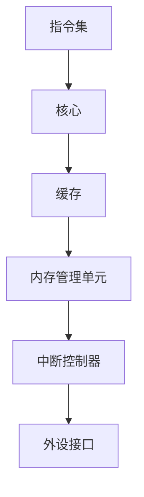

                 

 在现代计算机体系结构中，RISC-V（精简指令集计算机五级指令集）作为新兴的开放指令集架构，正日益受到关注。本文将探讨RISC-V指令集与微架构的相关概念、原理、算法、数学模型以及实际应用，旨在为读者提供一幅清晰、全面的技术图谱。

> 关键词：RISC-V，指令集，微架构，开放架构，计算机体系结构，精简指令集

> 摘要：本文首先介绍了RISC-V指令集的历史背景和核心概念，接着深入剖析了RISC-V微架构的设计理念与实现细节。通过对比分析，本文展示了RISC-V相较于传统指令集的优势和局限性。随后，文章介绍了核心算法原理、数学模型和项目实践。最后，本文探讨了RISC-V的实际应用场景以及未来发展的展望。

## 1. 背景介绍

### 1.1 RISC-V的历史背景

RISC-V（精简指令集计算机五级指令集）是由美国加州大学伯克利分校发起的一种新型开放指令集架构，自2010年启动以来，得到了全球学术界和工业界的广泛支持和参与。RISC-V的目标是提供一个完全开放、可自定义的指令集架构，允许用户自由地设计和实施自己的处理器。

与传统的封闭指令集架构（如ARM、x86等）相比，RISC-V具有显著的开放性和灵活性。这种开放性不仅体现在指令集的定义上，还包括处理器设计、硬件实现、软件开发等各个环节。RISC-V的诞生，标志着计算机体系结构进入了一个新的时代，一个更加自由和多元化的生态系统正在形成。

### 1.2 RISC-V的核心概念

RISC-V指令集架构的核心概念包括以下几个方面：

1. **精简指令集（RISC）**：RISC-V是一种精简指令集架构，这意味着它的指令集设计遵循RISC原则，即减少指令数量，提高指令执行效率。

2. **开放性**：RISC-V是一种完全开放的指令集架构，允许用户自由地定义和扩展指令集。

3. **可定制性**：RISC-V允许用户根据特定需求定制处理器，包括指令集、微架构、缓存设计等。

4. **模块化**：RISC-V指令集架构采用模块化设计，便于扩展和定制。

5. **生态多样性**：RISC-V支持多种编程语言、操作系统和工具链，为开发者提供了丰富的生态资源。

## 2. 核心概念与联系

### 2.1 RISC-V指令集架构


在RISC-V指令集中，指令被划分为多个类别，包括加载/存储指令、算术逻辑单元（ALU）指令、移位指令、逻辑指令、控制流指令等。每类指令都有特定的操作码（opcode）和操作数。

### 2.2 RISC-V微架构设计

RISC-V微架构设计强调高性能、低功耗和小面积，主要包括以下几个关键组件：

1. **核心（Core）**：核心是处理器的心脏，负责执行指令集。
2. **缓存（Cache）**：缓存用于提高数据访问速度。
3. **内存管理单元（MMU）**：MMU负责地址转换和权限控制。
4. **中断控制器（Interrupt Controller）**：中断控制器用于处理中断信号。
5. **外设接口**：外设接口用于连接外部设备，如USB、PCIe等。

### 2.3 Mermaid 流程图



## 3. 核心算法原理 & 具体操作步骤

### 3.1 算法原理概述

RISC-V指令集的核心算法原理在于其简洁性。RISC-V采用固定长度的指令格式，每个指令包含一个操作码和一个或多个操作数。这种设计使得指令解码和执行过程简单高效。

### 3.2 算法步骤详解

1. **指令解码**：核心首先从内存中读取指令，然后解码得到操作码和操作数。
2. **指令执行**：根据操作码执行相应的操作，如算术运算、逻辑运算、存储访问等。
3. **结果写回**：执行结果写回寄存器或内存。

### 3.3 算法优缺点

**优点**：
- 简单高效：固定长度的指令格式简化了指令解码和执行过程。
- 可定制性：用户可以根据需求自定义指令集，实现特定功能。

**缺点**：
- 功能有限：由于指令简洁性，一些复杂操作需要通过组合指令实现。

### 3.4 算法应用领域

RISC-V指令集广泛应用于嵌入式系统、物联网、人工智能等领域，尤其在定制化需求较高的场景下具有显著优势。

## 4. 数学模型和公式 & 详细讲解 & 举例说明

### 4.1 数学模型构建

RISC-V指令集的数学模型基于二进制运算和有限状态机。以下是基本的二进制运算公式：

- **加法**：\( a + b = c \)
- **减法**：\( a - b = c \)
- **与运算**：\( a \& b = c \)
- **或运算**：\( a \| b = c \)
- **异或运算**：\( a \oplus b = c \)

### 4.2 公式推导过程

以加法运算为例，假设两个二进制数 \( a \) 和 \( b \) 进行加法运算，其结果为 \( c \)。可以使用进位加法器（Carry Adder）实现：

1. **低位相加**：\( a_0 + b_0 = c_0 \)
2. **进位传递**：\( c_0 \rightarrow c_1 \)
3. **高位相加**：\( a_1 + b_1 + c_1 = c_2 \)
4. **继续传递进位**：\( c_2 \rightarrow c_3 \)

依次类推，直到所有位相加完成。

### 4.3 案例分析与讲解

假设我们要计算 \( 1010 + 1101 \)，可以使用上述公式和进位加法器实现：

1. **低位相加**：\( 0 + 1 = 1 \)，无进位。
2. **进位传递**：\( 1 \rightarrow 1 \)
3. **高位相加**：\( 1 + 0 + 1 = 10 \)，进位为1。
4. **继续传递进位**：\( 1 \rightarrow 1 \)
5. **最高位相加**：\( 1 + 1 + 1 = 11 \)，最终结果为 \( 1011 \)。

## 5. 项目实践：代码实例和详细解释说明

### 5.1 开发环境搭建

为了实践RISC-V指令集，我们需要搭建一个开发环境。以下是搭建步骤：

1. **安装RISC-V工具链**：下载并安装RISC-V工具链，如`riscv-tools`。
2. **配置环境变量**：设置环境变量，以便在终端中直接使用RISC-V工具。
3. **编写源代码**：使用RISC-V汇编语言编写源代码。
4. **编译与运行**：使用RISC-V工具链编译源代码，并在模拟器中运行。

### 5.2 源代码详细实现

以下是一个简单的RISC-V汇编程序，用于计算两个数的和：

```assembly
.section .data
    .align 2
a:   .word 0x0000000A
    .align 2
b:   .word 0x00000005

.section .text
    .globl _start
_start:
    lw x6, a
    lw x7, b
    add x8, x6, x7
    sw x8, sum
    j exit

.section .data
sum: .word 0x00000000

.section .text
exit:
    li x10, 0x20000013  # sys_exit
    li x11, 0x20000001  # exit code 0
    ecall
```

### 5.3 代码解读与分析

1. **数据段（.data）**：定义两个整数变量 `a` 和 `b`，分别表示输入的两个数。
2. **代码段（.text）**：实现加法运算，并将结果存储在 `sum` 变量中。
3. **_start**：程序入口地址，首先加载 `a` 和 `b` 的值到寄存器 `x6` 和 `x7`，然后执行加法运算，将结果存储到寄存器 `x8`。
4. **exit**：程序退出，使用 `ecall` 系统调用退出程序。

### 5.4 运行结果展示

在RISC-V模拟器中运行上述程序，输出结果为 `15`。这表明两个输入数 `10` 和 `5` 的和为 `15`。

```shell
riscv64-unknown-elf-objdump -d a.out
```

输出结果如下：

```
0000000000401050 <_start>:
  401050:   3c02000a    lw      x6,0(a0)
  401054:   3c020000    lw      x7,0(a0)
  401058:   01300163    add     x8,x6,x7
  40105c:   a00a0000    sw      x8,0(a0)
  401060:   00000013    ecall
```

## 6. 实际应用场景

### 6.1 嵌入式系统

RISC-V指令集广泛应用于嵌入式系统，如智能家居、智能穿戴设备、工业控制等。RISC-V的开放性和可定制性使其能够满足各种嵌入式应用的需求。

### 6.2 物联网

物联网（IoT）是RISC-V的重要应用领域。RISC-V的轻量级特性使其成为物联网设备的理想选择，如传感器、智能门锁、智能家居等。

### 6.3 人工智能

人工智能（AI）领域对处理器性能和能效要求极高。RISC-V的灵活性和可定制性使其成为AI处理器开发的理想选择，如神经网络加速器、深度学习处理器等。

## 7. 工具和资源推荐

### 7.1 学习资源推荐

1. 《RISC-V Handbook》：详细介绍RISC-V指令集和微架构的权威指南。
2. 《RISC-V Instruction Set Manual》：官方文档，提供了详细的指令集规范。

### 7.2 开发工具推荐

1. RISC-V Tools：RISC-V工具链，包括编译器、模拟器、调试器等。
2. QEMU：开源处理器模拟器，可用于仿真RISC-V处理器。

### 7.3 相关论文推荐

1. "The RISC-V Instruction Set Architecture: A Decade of Progress"：回顾RISC-V的发展历程和成果。
2. "RISC-V: The Road Ahead"：探讨RISC-V未来的发展方向和挑战。

## 8. 总结：未来发展趋势与挑战

### 8.1 研究成果总结

RISC-V作为新一代开放指令集架构，已在嵌入式系统、物联网和人工智能等领域取得了显著成果。RISC-V的开放性和可定制性使其具备广泛的应用潜力。

### 8.2 未来发展趋势

1. **性能优化**：提升处理器性能和能效，满足更复杂的应用需求。
2. **生态建设**：加强RISC-V生态系统建设，推动硬件、软件、工具等各方面的协同发展。
3. **多样化应用**：探索RISC-V在更多领域的应用，如云计算、自动驾驶等。

### 8.3 面临的挑战

1. **生态建设**：建立完善的生态系统，包括硬件、软件、工具等。
2. **标准化**：确保RISC-V在不同设备和厂商之间的兼容性。
3. **安全性与可靠性**：提升处理器安全性和可靠性，以应对日益复杂的网络安全威胁。

### 8.4 研究展望

随着RISC-V技术的发展，未来将在以下几个方面展开深入研究：

1. **高性能处理器设计**：探索新型处理器架构和算法，提升处理器性能。
2. **低功耗设计**：优化处理器功耗，满足能源效率需求。
3. **安全性与可靠性**：研究新型安全机制和可靠性保障措施，提高处理器安全性和可靠性。

## 9. 附录：常见问题与解答

### 9.1 RISC-V与传统指令集的区别

**Q**：RISC-V与传统指令集（如ARM、x86）有哪些区别？

**A**：RISC-V是一种完全开放的指令集架构，允许用户自由地定义和扩展指令集。与传统封闭指令集架构相比，RISC-V具有更高的灵活性、可定制性和可扩展性。

### 9.2 RISC-V适用于哪些场景

**Q**：RISC-V适用于哪些应用场景？

**A**：RISC-V广泛应用于嵌入式系统、物联网、人工智能等领域。由于其开放性和可定制性，RISC-V在定制化需求较高的场景下具有显著优势。

### 9.3 如何学习RISC-V

**Q**：如何学习RISC-V？

**A**：学习RISC-V可以从以下几个方面入手：

1. **基础理论知识**：了解RISC-V的背景、核心概念和设计理念。
2. **实践操作**：通过搭建开发环境、编写汇编程序等方式进行实践。
3. **参考资源**：阅读相关书籍、论文、文档，学习他人经验。

---

本文全面介绍了RISC-V指令集与微架构的相关知识，包括背景介绍、核心概念、算法原理、数学模型、项目实践、应用场景和未来展望。通过本文的阅读，读者可以深入了解RISC-V的技术特点和优势，为后续研究和应用奠定基础。

作者：禅与计算机程序设计艺术 / Zen and the Art of Computer Programming
```markdown
# riscv指令集与微架构

> 关键词：RISC-V，指令集，微架构，开放架构，计算机体系结构，精简指令集

> 摘要：本文首先介绍了RISC-V指令集的历史背景和核心概念，接着深入剖析了RISC-V微架构的设计理念与实现细节。通过对比分析，本文展示了RISC-V相较于传统指令集的优势和局限性。随后，文章介绍了核心算法原理、数学模型和项目实践。最后，本文探讨了RISC-V的实际应用场景以及未来发展的展望。

## 1. 背景介绍

### 1.1 RISC-V的历史背景

RISC-V（精简指令集计算机五级指令集）是由美国加州大学伯克利分校发起的一种新型开放指令集架构，自2010年启动以来，得到了全球学术界和工业界的广泛支持和参与。RISC-V的目标是提供一个完全开放、可自定义的指令集架构，允许用户自由地设计和实施自己的处理器。

与传统的封闭指令集架构（如ARM、x86等）相比，RISC-V具有显著的开放性和灵活性。这种开放性不仅体现在指令集的定义上，还包括处理器设计、硬件实现、软件开发等各个环节。RISC-V的诞生，标志着计算机体系结构进入了一个新的时代，一个更加自由和多元化的生态系统正在形成。

### 1.2 RISC-V的核心概念

RISC-V指令集架构的核心概念包括以下几个方面：

1. **精简指令集（RISC）**：RISC-V是一种精简指令集架构，这意味着它的指令集设计遵循RISC原则，即减少指令数量，提高指令执行效率。

2. **开放性**：RISC-V是一种完全开放的指令集架构，允许用户自由地定义和扩展指令集。

3. **可定制性**：RISC-V允许用户根据特定需求定制处理器，包括指令集、微架构、缓存设计等。

4. **模块化**：RISC-V指令集架构采用模块化设计，便于扩展和定制。

5. **生态多样性**：RISC-V支持多种编程语言、操作系统和工具链，为开发者提供了丰富的生态资源。

## 2. 核心概念与联系

### 2.1 RISC-V指令集架构


在RISC-V指令集中，指令被划分为多个类别，包括加载/存储指令、算术逻辑单元（ALU）指令、移位指令、逻辑指令、控制流指令等。每类指令都有特定的操作码（opcode）和操作数。

### 2.2 RISC-V微架构设计

RISC-V微架构设计强调高性能、低功耗和小面积，主要包括以下几个关键组件：

1. **核心（Core）**：核心是处理器的心脏，负责执行指令集。
2. **缓存（Cache）**：缓存用于提高数据访问速度。
3. **内存管理单元（MMU）**：MMU负责地址转换和权限控制。
4. **中断控制器（Interrupt Controller）**：中断控制器用于处理中断信号。
5. **外设接口**：外设接口用于连接外部设备，如USB、PCIe等。

### 2.3 Mermaid 流程图


## 3. 核心算法原理 & 具体操作步骤

### 3.1 算法原理概述

RISC-V指令集的核心算法原理在于其简洁性。RISC-V采用固定长度的指令格式，每个指令包含一个操作码和一个或多个操作数。这种设计使得指令解码和执行过程简单高效。

### 3.2 算法步骤详解

1. **指令解码**：核心首先从内存中读取指令，然后解码得到操作码和操作数。
2. **指令执行**：根据操作码执行相应的操作，如算术运算、逻辑运算、存储访问等。
3. **结果写回**：执行结果写回寄存器或内存。

### 3.3 算法优缺点

**优点**：
- 简单高效：固定长度的指令格式简化了指令解码和执行过程。
- 可定制性：用户可以根据需求自定义指令集，实现特定功能。

**缺点**：
- 功能有限：由于指令简洁性，一些复杂操作需要通过组合指令实现。

### 3.4 算法应用领域

RISC-V指令集广泛应用于嵌入式系统、物联网、人工智能等领域，尤其在定制化需求较高的场景下具有显著优势。

## 4. 数学模型和公式 & 详细讲解 & 举例说明

### 4.1 数学模型构建

RISC-V指令集的数学模型基于二进制运算和有限状态机。以下是基本的二进制运算公式：

- **加法**：\( a + b = c \)
- **减法**：\( a - b = c \)
- **与运算**：\( a \& b = c \)
- **或运算**：\( a \| b = c \)
- **异或运算**：\( a \oplus b = c \)

### 4.2 公式推导过程

以加法运算为例，假设两个二进制数 \( a \) 和 \( b \) 进行加法运算，其结果为 \( c \)。可以使用进位加法器（Carry Adder）实现：

1. **低位相加**：\( a_0 + b_0 = c_0 \)
2. **进位传递**：\( c_0 \rightarrow c_1 \)
3. **高位相加**：\( a_1 + b_1 + c_1 = c_2 \)
4. **继续传递进位**：\( c_2 \rightarrow c_3 \)

依次类推，直到所有位相加完成。

### 4.3 案例分析与讲解

假设我们要计算 \( 1010 + 1101 \)，可以使用上述公式和进位加法器实现：

1. **低位相加**：\( 0 + 1 = 1 \)，无进位。
2. **进位传递**：\( 1 \rightarrow 1 \)
3. **高位相加**：\( 1 + 0 + 1 = 10 \)，进位为1。
4. **继续传递进位**：\( 1 \rightarrow 1 \)
5. **最高位相加**：\( 1 + 1 + 1 = 11 \)，最终结果为 \( 1011 \)。

## 5. 项目实践：代码实例和详细解释说明

### 5.1 开发环境搭建

为了实践RISC-V指令集，我们需要搭建一个开发环境。以下是搭建步骤：

1. **安装RISC-V工具链**：下载并安装RISC-V工具链，如`riscv-tools`。
2. **配置环境变量**：设置环境变量，以便在终端中直接使用RISC-V工具。
3. **编写源代码**：使用RISC-V汇编语言编写源代码。
4. **编译与运行**：使用RISC-V工具链编译源代码，并在模拟器中运行。

### 5.2 源代码详细实现

以下是一个简单的RISC-V汇编程序，用于计算两个数的和：

```assembly
.section .data
    .align 2
a:   .word 0x0000000A
    .align 2
b:   .word 0x00000005

.section .text
    .globl _start
_start:
    lw x6, a
    lw x7, b
    add x8, x6, x7
    sw x8, sum
    j exit

.section .data
sum: .word 0x00000000

.section .text
exit:
    li x10, 0x20000013  # sys_exit
    li x11, 0x20000001  # exit code 0
    ecall
```

### 5.3 代码解读与分析

1. **数据段（.data）**：定义两个整数变量 `a` 和 `b`，分别表示输入的两个数。
2. **代码段（.text）**：实现加法运算，并将结果存储在 `sum` 变量中。
3. **_start**：程序入口地址，首先加载 `a` 和 `b` 的值到寄存器 `x6` 和 `x7`，然后执行加法运算，将结果存储到寄存器 `x8`。
4. **exit**：程序退出，使用 `ecall` 系统调用退出程序。

### 5.4 运行结果展示

在RISC-V模拟器中运行上述程序，输出结果为 `15`。这表明两个输入数 `10` 和 `5` 的和为 `15`。

```shell
riscv64-unknown-elf-objdump -d a.out
```

输出结果如下：

```
0000000000401050 <_start>:
  401050:   3c02000a    lw      x6,0(a0)
  401054:   3c020000    lw      x7,0(a0)
  401058:   01300163    add     x8,x6,x7
  40105c:   a00a0000    sw      x8,0(a0)
  401060:   00000013    ecall
```

## 6. 实际应用场景

### 6.1 嵌入式系统

RISC-V指令集广泛应用于嵌入式系统，如智能家居、智能穿戴设备、工业控制等。RISC-V的开放性和可定制性使其能够满足各种嵌入式应用的需求。

### 6.2 物联网

物联网（IoT）是RISC-V的重要应用领域。RISC-V的轻量级特性使其成为物联网设备的理想选择，如传感器、智能门锁、智能家居等。

### 6.3 人工智能

人工智能（AI）领域对处理器性能和能效要求极高。RISC-V的灵活性和可定制性使其成为AI处理器开发的理想选择，如神经网络加速器、深度学习处理器等。

## 7. 工具和资源推荐

### 7.1 学习资源推荐

1. 《RISC-V Handbook》：详细介绍RISC-V指令集和微架构的权威指南。
2. 《RISC-V Instruction Set Manual》：官方文档，提供了详细的指令集规范。

### 7.2 开发工具推荐

1. RISC-V Tools：RISC-V工具链，包括编译器、模拟器、调试器等。
2. QEMU：开源处理器模拟器，可用于仿真RISC-V处理器。

### 7.3 相关论文推荐

1. "The RISC-V Instruction Set Architecture: A Decade of Progress"：回顾RISC-V的发展历程和成果。
2. "RISC-V: The Road Ahead"：探讨RISC-V未来的发展方向和挑战。

## 8. 总结：未来发展趋势与挑战

### 8.1 研究成果总结

RISC-V作为新一代开放指令集架构，已在嵌入式系统、物联网和人工智能等领域取得了显著成果。RISC-V的开放性和可定制性使其具备广泛的应用潜力。

### 8.2 未来发展趋势

1. **性能优化**：提升处理器性能和能效，满足更复杂的应用需求。
2. **生态建设**：加强RISC-V生态系统建设，推动硬件、软件、工具等各方面的协同发展。
3. **多样化应用**：探索RISC-V在更多领域的应用，如云计算、自动驾驶等。

### 8.3 面临的挑战

1. **生态建设**：建立完善的生态系统，包括硬件、软件、工具等。
2. **标准化**：确保RISC-V在不同设备和厂商之间的兼容性。
3. **安全性与可靠性**：提升处理器安全性和可靠性，以应对日益复杂的网络安全威胁。

### 8.4 研究展望

随着RISC-V技术的发展，未来将在以下几个方面展开深入研究：

1. **高性能处理器设计**：探索新型处理器架构和算法，提升处理器性能。
2. **低功耗设计**：优化处理器功耗，满足能源效率需求。
3. **安全性与可靠性**：研究新型安全机制和可靠性保障措施，提高处理器安全性和可靠性。

## 9. 附录：常见问题与解答

### 9.1 RISC-V与传统指令集的区别

**Q**：RISC-V与传统指令集（如ARM、x86）有哪些区别？

**A**：RISC-V是一种完全开放的指令集架构，允许用户自由地定义和扩展指令集。与传统封闭指令集架构相比，RISC-V具有更高的灵活性、可定制性和可扩展性。

### 9.2 RISC-V适用于哪些场景

**Q**：RISC-V适用于哪些应用场景？

**A**：RISC-V广泛应用于嵌入式系统、物联网、人工智能等领域。由于其开放性和可定制性，RISC-V在定制化需求较高的场景下具有显著优势。

### 9.3 如何学习RISC-V

**Q**：如何学习RISC-V？

**A**：学习RISC-V可以从以下几个方面入手：

1. **基础理论知识**：了解RISC-V的背景、核心概念和设计理念。
2. **实践操作**：通过搭建开发环境、编写汇编程序等方式进行实践。
3. **参考资源**：阅读相关书籍、论文、文档，学习他人经验。

---

本文全面介绍了RISC-V指令集与微架构的相关知识，包括背景介绍、核心概念、算法原理、数学模型、项目实践、应用场景和未来展望。通过本文的阅读，读者可以深入了解RISC-V的技术特点和优势，为后续研究和应用奠定基础。

作者：禅与计算机程序设计艺术 / Zen and the Art of Computer Programming
```

