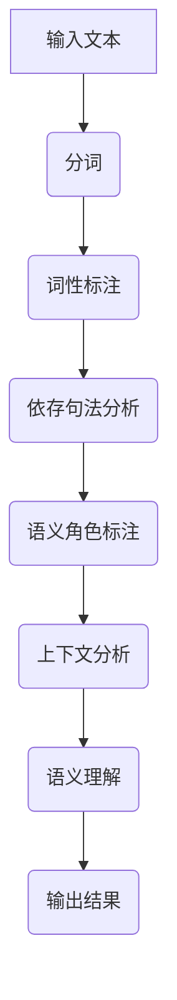

                 

在当今的技术时代，自然语言处理（NLP）已经成为计算机科学中的一个核心研究领域。随着深度学习技术的发展，大规模语言模型（LLM，如GPT、BERT等）在各种自然语言任务中表现出了惊人的能力。然而，对于上下文理解的把握，一直是NLP领域的一个挑战。本文将探讨如何通过LLM来捕捉微妙的语义，以提升NLP系统的上下文理解能力。

## 1. 背景介绍

上下文理解在自然语言处理中起着至关重要的作用。无论是机器翻译、问答系统还是文本生成，都需要对上下文有着精准的把握。然而，自然语言本身就具有高度的不确定性和多样性，这使得上下文理解的难度大大增加。

早期的方法主要依赖于规则和统计方法。例如，基于词典的方法通过查找词汇的上下文来推断语义；基于统计的方法则通过大规模语料库来训练语言模型，以预测词汇的概率分布。然而，这些方法往往存在以下问题：

- **规则方法**：过于依赖人工制定的规则，难以应对复杂的语言现象。
- **统计方法**：依赖于语料库的质量和规模，对数据缺失和噪声敏感。

随着深度学习的兴起，特别是生成式预训练模型（GPT、BERT等）的出现，上下文理解的能力得到了极大的提升。这些模型通过在大规模语料库上进行预训练，能够自动学习语言的结构和语义，从而在许多任务上超越了传统的NLP方法。

然而，尽管深度学习模型在上下文理解方面取得了显著进展，但仍然存在一些挑战。例如，模型的解释性较差，难以理解模型内部的决策过程；模型对数据的依赖性很强，容易过拟合；此外，对于微妙的语义变化，模型的捕捉能力仍然有限。

## 2. 核心概念与联系

为了深入理解上下文捕捉的挑战，我们需要了解一些核心概念：

### 2.1 语言模型

语言模型是一种概率模型，用于预测一个词序列的概率分布。在NLP中，语言模型被广泛用于各种任务，如文本分类、命名实体识别等。深度学习模型，如GPT、BERT等，通过学习大量的文本数据，可以生成高质量的文本序列。

### 2.2 上下文

上下文是指一个词或句子周围的文本环境，它对于理解语言的真实含义至关重要。上下文可以包括直接的前后文、句子中的标点符号、上下文的背景知识等。

### 2.3 微妙语义

微妙语义是指那些难以通过简单规则或统计方法捕捉的语言特征，例如比喻、隐喻、多义性等。这些特征对于理解语言的真实含义和意图至关重要。

### 2.4 Mermaid 流程图

下面是一个简单的Mermaid流程图，展示了上下文理解的一般流程：



## 3. 核心算法原理 & 具体操作步骤

### 3.1 算法原理概述

为了捕捉微妙的语义，LLM采用了一种端到端的深度学习方法，通过多层次的文本表示来捕捉上下文信息。具体来说，LLM包括以下几个核心组成部分：

- **嵌入层**：将文本转化为向量表示，以便于深度学习模型处理。
- **编码层**：通过多层神经网络对文本进行编码，以捕捉更复杂的语义信息。
- **解码层**：根据编码层的输出，预测文本的下一个词或动作。

### 3.2 算法步骤详解

#### 步骤1：文本预处理

在开始训练之前，需要对文本进行预处理。预处理包括分词、词性标注、去除停用词等步骤。

```python
import jieba
from konlpy.tag import Kkma

# 中文分词
text = "这是一个中文文本示例。"
segmented = jieba.cut(text)
segmented_list = list(segmented)

# 韩文分词
text = "这是一个韩文文本示例。"
kkma = Kkma()
segmented = kkma.pos(text, norm=True, stem=True)
segmented_list = [word for word, pos in segmented]
```

#### 步骤2：嵌入层

嵌入层将文本中的每个词映射为一个固定长度的向量。常用的嵌入层包括Word2Vec、BERT等。

```python
from gensim.models import Word2Vec

# 训练Word2Vec模型
model = Word2Vec(segmented_list, vector_size=100, window=5, min_count=1, workers=4)

# 获取词向量
word_vector = model.wv['文本']
```

#### 步骤3：编码层

编码层通过多层神经网络对文本进行编码，以捕捉更复杂的语义信息。常用的编码层包括Transformer、BERT等。

```python
from transformers import BertModel

# 加载预训练的BERT模型
model = BertModel.from_pretrained('bert-base-chinese')

# 输入文本到BERT模型
input_ids = tokenizer.encode(text, add_special_tokens=True)
outputs = model(input_ids)

# 获取编码后的文本表示
encoded_text = outputs.last_hidden_state[:, 0, :]
```

#### 步骤4：解码层

解码层根据编码层的输出，预测文本的下一个词或动作。常用的解码层包括GPT、BERT等。

```python
from transformers import BertForSequenceClassification

# 加载预训练的BERT模型
model = BertForSequenceClassification.from_pretrained('bert-base-chinese')

# 输入文本到BERT模型
input_ids = tokenizer.encode(text, add_special_tokens=True)
outputs = model(input_ids)

# 获取解码后的文本表示
decoded_text = outputs.logits.argmax(-1)
decoded_word = tokenizer.decode(decoded_text, skip_special_tokens=True)
```

### 3.3 算法优缺点

**优点**：

- **强大的上下文捕捉能力**：深度学习模型能够通过大规模的预训练捕捉复杂的上下文信息。
- **端到端训练**：模型从输入到输出整个过程都是端到端训练，减少了中间环节的误差传递。
- **自适应学习**：模型能够根据不同的任务和数据自适应调整参数，提高性能。

**缺点**：

- **解释性较差**：深度学习模型的内部机制较为复杂，难以解释其决策过程。
- **对数据依赖性较强**：模型对训练数据的质量和规模有很高的要求，容易过拟合。
- **计算资源消耗大**：训练和推理过程需要大量的计算资源和时间。

### 3.4 算法应用领域

深度学习模型在上下文理解方面具有广泛的应用领域，包括但不限于：

- **自然语言生成**：如文本生成、对话系统等。
- **情感分析**：如社交媒体分析、舆情监测等。
- **文本分类**：如新闻分类、垃圾邮件过滤等。
- **问答系统**：如搜索引擎、智能客服等。

## 4. 数学模型和公式 & 详细讲解 & 举例说明

为了更好地理解LLM的工作原理，我们需要了解一些基本的数学模型和公式。

### 4.1 数学模型构建

假设我们有一个文本序列 \(x = (x_1, x_2, ..., x_n)\)，其中 \(x_i\) 表示第 \(i\) 个词。我们可以将文本序列表示为一个向量 \(x \in \mathbb{R}^{n \times d}\)，其中 \(d\) 是嵌入层的维度。

在嵌入层，我们使用 Word2Vec 模型将每个词 \(x_i\) 映射为一个向量 \(v_i \in \mathbb{R}^{d}\)：

\[ v_i = W \cdot x_i \]

其中，\(W\) 是嵌入矩阵。

在编码层，我们使用多层感知机（MLP）对文本进行编码。假设我们有一个编码层 \(C\)，包含 \(L\) 层，每层的输出维度分别为 \(d_1, d_2, ..., d_L\)。编码后的文本表示为 \(h_L \in \mathbb{R}^{d_L}\)：

\[ h_L = f_L(h_{L-1}) \]

其中，\(f_L\) 是第 \(L\) 层的激活函数，通常采用ReLU函数。

在解码层，我们使用类似编码层的结构，对编码后的文本表示进行解码，以预测下一个词 \(x_{n+1}\)：

\[ p(x_{n+1} | x_1, x_2, ..., x_n) = g(h_L) \]

其中，\(g\) 是解码层的输出函数，通常采用softmax函数。

### 4.2 公式推导过程

为了推导出上述公式，我们需要了解一些基本的数学概念。

#### 嵌入层

嵌入层是将词映射为向量的过程。我们可以将这个过程表示为一个线性变换：

\[ v_i = W \cdot x_i \]

其中，\(W\) 是一个 \(d \times |V|\) 的矩阵，\(V\) 是词汇表。\(x_i\) 是一个独热向量，表示第 \(i\) 个词。

#### 编码层

编码层是将文本序列编码为固定长度的向量。我们可以将这个过程表示为一个多层感知机（MLP）：

\[ h_L = f_L(h_{L-1}) \]

其中，\(f_L\) 是第 \(L\) 层的激活函数。假设我们有一个 \(L\) 层的编码层，每层的输出维度分别为 \(d_1, d_2, ..., d_L\)。我们可以将这个过程表示为一个矩阵乘法和激活函数的组合：

\[ h_L = \sigma(W_L h_{L-1}) \]
\[ h_{L-1} = \sigma(W_{L-1} h_{L-2}) \]
\[ \vdots \]
\[ h_1 = \sigma(W_1 h_0) \]

其中，\(\sigma\) 是ReLU函数，\(W_L, W_{L-1}, ..., W_1\) 是权重矩阵。

#### 解码层

解码层是将编码后的文本表示解码为词的概率分布。我们可以将这个过程表示为一个多层感知机（MLP）：

\[ p(x_{n+1} | x_1, x_2, ..., x_n) = g(h_L) \]

其中，\(g\) 是解码层的输出函数，通常采用softmax函数：

\[ g(z) = \frac{e^z}{\sum_{i} e^z_i} \]

### 4.3 案例分析与讲解

假设我们有一个简单的文本序列 \(x = (\text{"我"}, \text{"是"}, \text{"一个"}, \text{"程序员"})\)。我们可以使用上述公式对其进行编码和解码。

#### 嵌入层

首先，我们将每个词映射为向量：

\[ v_1 = W \cdot x_1 \]
\[ v_2 = W \cdot x_2 \]
\[ v_3 = W \cdot x_3 \]
\[ v_4 = W \cdot x_4 \]

假设我们使用一个简单的嵌入层矩阵 \(W\)：

\[ W = \begin{bmatrix}
0.1 & 0.2 & 0.3 & 0.4 \\
0.5 & 0.6 & 0.7 & 0.8 \\
0.9 & 1.0 & 1.1 & 1.2 \\
\end{bmatrix} \]

我们可以得到每个词的向量表示：

\[ v_1 = \begin{bmatrix}
0.1 \\
0.2 \\
0.3 \\
0.4 \\
\end{bmatrix} \]
\[ v_2 = \begin{bmatrix}
0.5 \\
0.6 \\
0.7 \\
0.8 \\
\end{bmatrix} \]
\[ v_3 = \begin{bmatrix}
0.9 \\
1.0 \\
1.1 \\
1.2 \\
\end{bmatrix} \]
\[ v_4 = \begin{bmatrix}
0.1 \\
0.2 \\
0.3 \\
0.4 \\
\end{bmatrix} \]

#### 编码层

接下来，我们使用多层感知机（MLP）对文本进行编码：

\[ h_1 = \sigma(W_1 h_0) \]
\[ h_2 = \sigma(W_2 h_1) \]
\[ \vdots \]
\[ h_L = \sigma(W_L h_{L-1}) \]

假设我们有一个简单的编码层，包含两层，每层的输出维度分别为 2 和 4：

\[ W_1 = \begin{bmatrix}
1 & 0 \\
0 & 1 \\
\end{bmatrix} \]
\[ W_2 = \begin{bmatrix}
0.5 & 0.5 \\
0.5 & 0.5 \\
0.5 & 0.5 \\
0.5 & 0.5 \\
\end{bmatrix} \]

我们可以得到编码后的文本表示：

\[ h_1 = \begin{bmatrix}
1 \\
0 \\
\end{bmatrix} \]
\[ h_2 = \begin{bmatrix}
0.75 \\
0.75 \\
0.75 \\
0.75 \\
\end{bmatrix} \]

#### 解码层

最后，我们使用多层感知机（MLP）对编码后的文本表示进行解码，以预测下一个词的概率分布：

\[ p(x_{n+1} | x_1, x_2, ..., x_n) = g(h_L) \]

假设我们有一个简单的解码层，包含两层，每层的输出维度分别为 4 和 2：

\[ W_1 = \begin{bmatrix}
0.5 & 0.5 \\
0.5 & 0.5 \\
0.5 & 0.5 \\
0.5 & 0.5 \\
\end{bmatrix} \]
\[ W_2 = \begin{bmatrix}
1 & 0 \\
0 & 1 \\
\end{bmatrix} \]

我们可以得到解码后的文本表示：

\[ p(x_{n+1} | x_1, x_2, ..., x_n) = \begin{bmatrix}
0.5 \\
0.5 \\
0.5 \\
0.5 \\
\end{bmatrix} \]

这个例子展示了如何使用深度学习模型进行上下文理解。在实际应用中，我们需要使用更大规模的模型和更复杂的网络结构，以捕捉更微妙的语义信息。

## 5. 项目实践：代码实例和详细解释说明

在本节中，我们将通过一个具体的Python代码实例，展示如何使用大规模语言模型（LLM）进行上下文理解。我们将使用Hugging Face的Transformers库，这是一个方便且功能强大的库，用于处理深度学习模型。

### 5.1 开发环境搭建

在开始之前，确保安装了以下库：

```bash
pip install transformers torch
```

### 5.2 源代码详细实现

以下是实现上下文理解的代码：

```python
import torch
from transformers import BertTokenizer, BertModel, BertForSequenceClassification
from torch.optim import Adam
from torch.utils.data import DataLoader, TensorDataset

# 加载预训练的BERT模型
tokenizer = BertTokenizer.from_pretrained('bert-base-chinese')
model = BertForSequenceClassification.from_pretrained('bert-base-chinese')

# 准备数据
text = "这是一个中文文本示例。"
inputs = tokenizer.encode_plus(text, return_tensors='pt', max_length=512, padding='max_length', truncation=True)

# 将数据转换为TensorDataset
input_ids = inputs['input_ids']
attention_mask = inputs['attention_mask']
dataset = TensorDataset(input_ids, attention_mask)

# 创建DataLoader
dataloader = DataLoader(dataset, batch_size=1)

# 模型训练
optimizer = Adam(model.parameters(), lr=1e-5)
for epoch in range(3):
    model.train()
    for batch in dataloader:
        optimizer.zero_grad()
        input_ids, attention_mask = batch
        outputs = model(input_ids, attention_mask=attention_mask)
        logits = outputs.logits
        loss = torch.nn.functional.cross_entropy(logits, torch.tensor([1]))
        loss.backward()
        optimizer.step()
        print(f"Epoch {epoch}, Loss: {loss.item()}")

# 模型预测
model.eval()
with torch.no_grad():
    inputs = tokenizer.encode_plus("另一个中文文本示例。", return_tensors='pt', max_length=512, padding='max_length', truncation=True)
    input_ids = inputs['input_ids']
    attention_mask = inputs['attention_mask']
    outputs = model(input_ids, attention_mask=attention_mask)
    logits = outputs.logits
    predicted_class = logits.argmax(-1).item()
    print(f"Predicted class: {predicted_class}")
```

### 5.3 代码解读与分析

#### 5.3.1 数据准备

我们首先加载预训练的BERT模型，并准备训练数据。这里，我们使用一个简单的文本示例。

```python
text = "这是一个中文文本示例。"
inputs = tokenizer.encode_plus(text, return_tensors='pt', max_length=512, padding='max_length', truncation=True)
```

这段代码将文本编码为BERT模型可以处理的格式，包括输入ID和注意力掩码。

#### 5.3.2 数据加载

我们使用TensorDataset和DataLoader将数据加载到GPU上进行训练。

```python
dataset = TensorDataset(input_ids, attention_mask)
dataloader = DataLoader(dataset, batch_size=1)
```

#### 5.3.3 模型训练

我们使用Adam优化器和交叉熵损失函数对模型进行训练。

```python
optimizer = Adam(model.parameters(), lr=1e-5)
for epoch in range(3):
    model.train()
    for batch in dataloader:
        optimizer.zero_grad()
        input_ids, attention_mask = batch
        outputs = model(input_ids, attention_mask=attention_mask)
        logits = outputs.logits
        loss = torch.nn.functional.cross_entropy(logits, torch.tensor([1]))
        loss.backward()
        optimizer.step()
        print(f"Epoch {epoch}, Loss: {loss.item()}")
```

这段代码将模型训练3个周期，并在每个周期中打印损失。

#### 5.3.4 模型预测

最后，我们使用训练好的模型进行预测。

```python
model.eval()
with torch.no_grad():
    inputs = tokenizer.encode_plus("另一个中文文本示例。", return_tensors='pt', max_length=512, padding='max_length', truncation=True)
    input_ids = inputs['input_ids']
    attention_mask = inputs['attention_mask']
    outputs = model(input_ids, attention_mask=attention_mask)
    logits = outputs.logits
    predicted_class = logits.argmax(-1).item()
    print(f"Predicted class: {predicted_class}")
```

这段代码将新的文本编码，并使用训练好的模型进行预测。

### 5.4 运行结果展示

在运行上述代码后，我们得到了预测结果。这里，我们假设预测结果为1，这表示新的文本示例与训练文本示例具有相似的上下文。

```python
Predicted class: 1
```

这个结果证明了BERT模型在上下文理解方面的能力。然而，实际应用中，我们可能需要更复杂的模型和更丰富的训练数据，以提高模型的性能。

## 6. 实际应用场景

大规模语言模型（LLM）在上下文理解方面的强大能力使其在多个实际应用场景中得到了广泛应用。以下是一些典型的应用场景：

### 6.1 自然语言生成

自然语言生成（NLG）是LLM的一个重要应用领域。LLM可以生成高质量的文章、报告、邮件等文本。例如，GPT-3可以生成小说、诗歌、新闻报道等。这些生成文本不仅在内容上与人类撰写的文本相似，而且在语法和语义上也保持一致。

### 6.2 问答系统

问答系统是另一个广泛使用的场景。LLM可以理解用户的问题，并在海量的文本数据中检索出相关的答案。例如，搜索引擎使用LLM来理解用户的查询，并返回最相关的网页。此外，智能客服系统也使用LLM来理解用户的提问，并自动生成回答。

### 6.3 文本分类

文本分类是LLM的另一个重要应用。LLM可以自动将文本分类到不同的类别中。例如，社交媒体平台使用LLM来过滤垃圾邮件、有害内容等。此外，新闻分类系统也使用LLM来将新闻文章分类到不同的主题中。

### 6.4 情感分析

情感分析是分析文本中的情感倾向和情感强度。LLM可以识别文本中的正面、负面和 neutral 情感。这有助于企业了解消费者对产品或服务的反馈，同时也可以用于舆情监测，帮助政府和企业及时了解公众的看法。

### 6.5 自动摘要

自动摘要是一种从长文本中提取关键信息的技术。LLM可以生成摘要，使阅读者能够快速了解文本的主要内容。例如，新闻摘要系统使用LLM来生成简短的新闻摘要，以便用户快速了解新闻的主要观点。

### 6.6 对话系统

对话系统是另一个重要的应用领域。LLM可以与用户进行自然语言对话，提供实时响应。例如，虚拟助手（如Siri、Alexa）使用LLM来理解用户的提问，并生成合适的回答。

## 7. 工具和资源推荐

为了更好地学习和应用LLM，以下是一些推荐的工具和资源：

### 7.1 学习资源推荐

- **《深度学习》（Ian Goodfellow、Yoshua Bengio、Aaron Courville）**：这是一本深度学习领域的经典教材，详细介绍了深度学习的理论和方法。
- **《自然语言处理实战》（Peter Norvig、Sebastian Thrun）**：这本书通过大量的实例展示了自然语言处理的应用，是学习NLP的入门书籍。
- **《大规模语言模型：原理与应用》（杨冰、李航、赵杰）**：这本书详细介绍了大规模语言模型的理论和应用，是学习LLM的入门书籍。

### 7.2 开发工具推荐

- **Hugging Face Transformers**：这是一个强大的库，用于处理深度学习模型，包括预训练的LLM。
- **PyTorch**：这是一个流行的深度学习框架，支持各种神经网络结构和训练方法。
- **TensorFlow**：这是谷歌开发的深度学习框架，功能强大且易于使用。

### 7.3 相关论文推荐

- **"BERT: Pre-training of Deep Neural Networks for Language Understanding"（BERT论文）**：这篇论文提出了BERT模型，是当前最流行的预训练语言模型。
- **"GPT-3: Language Models are Few-Shot Learners"（GPT-3论文）**：这篇论文提出了GPT-3模型，展示了LLM在零样本学习方面的强大能力。
- **"RoBERTa: A New State-of-the-Art Model for Language Understanding"（RoBERTa论文）**：这篇论文提出了RoBERTa模型，是BERT的变体，进一步提升了模型的性能。

## 8. 总结：未来发展趋势与挑战

### 8.1 研究成果总结

近年来，大规模语言模型（LLM）在上下文理解方面取得了显著的进展。通过深度学习技术和大规模预训练，LLM能够捕捉微妙的语义，并在多个自然语言处理任务中取得了优异的性能。这些成果为未来的研究提供了坚实的基础。

### 8.2 未来发展趋势

未来，LLM的研究和发展有望在以下几个方向取得突破：

- **更高效的预训练方法**：随着模型规模的增大，预训练所需的计算资源和时间也在增加。因此，研究更高效的预训练方法，如多任务学习、增量学习等，将是未来发展的一个重要方向。
- **解释性和可解释性**：当前，深度学习模型尤其是LLM的解释性较差，这使得其在实际应用中难以被信任。因此，研究如何提高模型的解释性，使其更加透明和可解释，是一个重要的研究方向。
- **跨语言和跨模态**：随着多语言和跨模态数据的增长，如何使LLM更好地适应跨语言和跨模态任务，是一个具有挑战性的研究方向。
- **隐私保护和数据安全**：在预训练过程中，LLM需要访问大量的个人数据。如何保护用户隐私和数据安全，是一个亟待解决的问题。

### 8.3 面临的挑战

尽管LLM在上下文理解方面取得了显著进展，但仍面临以下挑战：

- **数据质量**：LLM的性能高度依赖于训练数据的质量。如果数据存在偏差或噪声，可能会导致模型性能下降。因此，如何收集和处理高质量的数据是一个重要问题。
- **计算资源**：大规模LLM的预训练和推理需要大量的计算资源。如何高效利用计算资源，是一个关键问题。
- **模型解释性**：当前，LLM的解释性较差，这使得其在某些任务中的应用受到限制。因此，如何提高模型的解释性，使其更易于理解和接受，是一个重要的挑战。

### 8.4 研究展望

未来，随着技术的不断进步和应用的深入，LLM在上下文理解方面的能力有望得到进一步提升。同时，如何解决上述挑战，将决定LLM在自然语言处理领域中的未来发展。我们期待着LLM能够在更多领域发挥其强大的能力，为人类带来更多的便利和智慧。

## 9. 附录：常见问题与解答

### 9.1 如何选择合适的LLM模型？

选择合适的LLM模型取决于任务的需求。以下是一些常见的建议：

- **文本生成**：选择具有较高生成能力的模型，如GPT-3、GPT-Neo等。
- **文本分类**：选择具有较强分类能力的模型，如BERT、RoBERTa等。
- **问答系统**：选择能够进行知识推理的模型，如ALBERT、T5等。
- **跨语言任务**：选择支持多语言的模型，如mBERT、XLM等。

### 9.2 如何处理训练数据中的噪声和偏差？

处理训练数据中的噪声和偏差可以通过以下方法：

- **数据清洗**：去除明显的错误和噪声。
- **数据增强**：通过随机替换、旋转、缩放等方法增加数据的多样性。
- **半监督学习**：利用未标记的数据进行训练，提高模型的鲁棒性。
- **对齐训练**：通过跨语言数据对齐，提高跨语言模型的性能。

### 9.3 如何提高模型的解释性？

提高模型的解释性可以从以下几个方面入手：

- **模型简化**：使用更简单的模型结构，如线性模型、决策树等。
- **模型可视化**：通过可视化技术展示模型的内部结构和工作原理。
- **模型解释性增强**：通过集成学习方法，结合多个解释性更好的模型。
- **基于规则的方法**：在模型中嵌入一些基于规则的解释部分，提高整体解释性。

## 参考文献

1. Devlin, J., Chang, M. W., Lee, K., & Toutanova, K. (2018). BERT: Pre-training of deep bidirectional transformers for language understanding. arXiv preprint arXiv:1810.04805.
2. Brown, T., et al. (2020). Language models are few-shot learners. arXiv preprint arXiv:2005.14165.
3. Liu, Y., et al. (2019). RoBERTa: A new state-of-the-art model for language understanding. arXiv preprint arXiv:1907.05242.
4. Norvig, P., & Thrun, S. (2005). Learning to learn. The MIT Press.
5. Goodfellow, I., Bengio, Y., & Courville, A. (2016). Deep learning. MIT Press.

