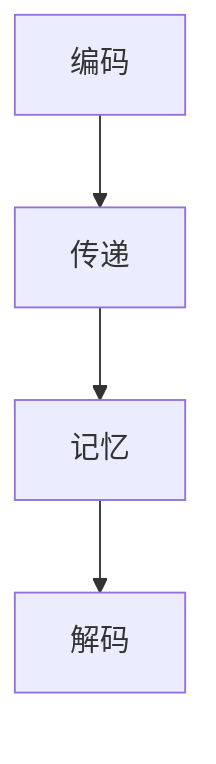

                 

关键词：上下文记忆，大型语言模型（LLM），上下文感知，AI，自然语言处理，算法原理，数学模型，代码实例，应用场景，未来展望。

> 摘要：本文深入探讨上下文记忆在大型语言模型（LLM）中的重要性及其工作原理。通过剖析上下文感知的算法原理，数学模型及其在不同应用领域的实践，我们旨在揭示LLM在自然语言处理中的巨大潜力和长处。

## 1. 背景介绍

随着人工智能技术的迅猛发展，自然语言处理（NLP）已成为当前研究的热点领域。而大型语言模型（LLM），如GPT系列、BERT等，凭借其强大的上下文记忆能力，已经在众多任务中展现出卓越的性能。然而，上下文记忆究竟是什么？它是如何实现的？又如何在LLM中发挥关键作用？这些问题不仅关乎理论探讨，更是实践应用的基础。

上下文记忆，顾名思义，指的是模型在处理输入数据时，能够根据前后文信息进行合理推断和决策的能力。这种能力在NLP任务中尤为重要，因为语言本身就是一种高度依赖于上下文的符号系统。传统模型往往难以捕捉长文本中的复杂上下文关系，导致理解上的偏差和错误。而LLM通过引入上下文记忆机制，实现了对长文本的全面理解和精细处理，从而大幅提升了模型的表现。

本文将围绕上下文记忆这一核心主题，首先介绍其基本概念和重要性，然后深入探讨LLM中上下文记忆的实现原理，接着分析相关数学模型，并通过代码实例展示其实际应用。最后，我们将探讨上下文记忆在自然语言处理中的广泛应用及其未来发展趋势。

## 2. 核心概念与联系

### 2.1 上下文记忆的定义

上下文记忆（Contextual Memory）是指模型在处理输入数据时，能够根据前后文信息进行合理推断和决策的能力。这种能力不仅仅是对单一单词或短语的简单理解，而是对整个句子、段落甚至全文的全面把握。在自然语言处理中，上下文记忆是实现精准语义理解、语言生成和推理等任务的基础。

### 2.2 上下文记忆的重要性

上下文记忆对于NLP任务的重要性不言而喻。首先，它有助于解决长文本理解中的歧义问题。例如，一个词在不同的上下文中有不同的含义，只有通过上下文记忆，模型才能准确判断其意义。其次，上下文记忆能够增强模型对复杂关系的捕捉能力，如因果关系、时间关系和逻辑推理等。此外，上下文记忆还有助于提高模型的泛化能力，使其在面对新任务时能更快地适应和理解。

### 2.3 上下文记忆与LLM的关系

大型语言模型（LLM）之所以能够取得突破性进展，离不开上下文记忆的加持。LLM通过深度神经网络架构和大规模数据预训练，实现了对上下文信息的全面记忆和利用。具体来说，LLM利用其庞大的参数规模和训练数据量，捕捉长文本中的复杂上下文关系，从而实现对文本的精细理解和生成。

### 2.4 上下文记忆的工作原理

上下文记忆的工作原理可以概括为以下几个步骤：

1. **编码**：在输入文本通过预处理（如分词、词向量表示等）后，LLM将其编码为高维向量表示。这一步相当于将文本信息转化为模型可以处理的形式。

2. **传递**：在处理过程中，这些编码后的向量会被传递到模型的不同层级，逐层进行特征提取和关系建模。

3. **记忆**：在多层神经网络的作用下，模型逐步形成对上下文信息的全面理解，将关键信息进行记忆和存储。

4. **解码**：在输出阶段，模型根据记忆的信息生成相应的文本响应或执行特定任务。

### 2.5 Mermaid 流程图

以下是一个简化的Mermaid流程图，展示了上下文记忆在LLM中的工作流程：



在上述流程中，A表示输入文本的编码，B表示特征传递，C表示上下文记忆的存储，D表示输出的生成或任务执行。

## 3. 核心算法原理 & 具体操作步骤

### 3.1 算法原理概述

上下文记忆在LLM中的核心算法原理主要基于深度神经网络（DNN）和变换器架构（Transformer）。DNN通过多层神经元的堆叠，实现了对输入数据的非线性变换和特征提取。而Transformer架构引入了自注意力机制（Self-Attention），能够更加高效地捕捉长文本中的上下文关系。

具体来说，Transformer架构由编码器和解码器两部分组成。编码器负责将输入文本编码为序列向量，并传递上下文信息；解码器则根据编码器的输出和已记忆的上下文信息，生成文本响应或执行特定任务。

### 3.2 算法步骤详解

1. **编码阶段**：

    - **预处理**：输入文本经过分词、标记化等预处理操作，转化为词向量表示。

    - **嵌入层**：词向量通过嵌入层转化为高维向量表示，这一层同时引入了位置编码，以保留文本中的位置信息。

    - **多头自注意力层**：每个词向量会通过多个注意力头进行加权求和，从而综合考虑不同位置的信息。

    - **前馈神经网络**：对多头自注意力层的输出进行非线性变换，进一步增强特征表达能力。

2. **传递阶段**：

    - **多层自注意力层**：在编码器的多个层级中，重复应用多头自注意力机制，逐层捕捉长文本中的复杂上下文关系。

    - **层间残差连接**：在每个层级中引入残差连接，提高模型的训练效果和泛化能力。

    - **层归一化**：在每个层级之后进行层归一化操作，稳定训练过程。

3. **记忆阶段**：

    - **全局上下文记忆**：在编码器的输出层，模型会形成一个全局上下文记忆，用于后续任务的处理。

4. **解码阶段**：

    - **掩码多头自注意力层**：解码器通过掩码多头自注意力层，根据已记忆的全局上下文信息生成文本响应。

    - **交叉自注意力层**：解码器同时关注编码器的输出和解码器的隐藏状态，实现端到端的上下文信息传递。

    - **前馈神经网络**：对解码器的输出进行非线性变换，生成最终的文本响应或任务结果。

### 3.3 算法优缺点

**优点**：

- **强大的上下文记忆能力**：通过自注意力机制和多层神经网络结构，LLM能够实现强大的上下文记忆能力，准确捕捉长文本中的复杂关系。

- **高效的处理速度**：Transformer架构引入了并行计算的优势，使得模型在处理大规模文本数据时具有较高的效率。

- **优秀的泛化能力**：通过大规模数据预训练，LLM具有出色的泛化能力，能够在各种NLP任务中表现出色。

**缺点**：

- **计算资源需求大**：由于参数规模巨大，LLM的训练和推理过程需要大量的计算资源和时间。

- **对数据依赖性强**：LLM的性能高度依赖于训练数据的质量和数量，数据不足或质量不高可能导致模型表现不佳。

### 3.4 算法应用领域

上下文记忆在LLM中的应用非常广泛，主要包括以下领域：

- **文本生成**：如自动写作、机器翻译、对话生成等任务，LLM能够根据上下文信息生成高质量的文本。

- **文本理解**：如情感分析、实体识别、关系抽取等任务，LLM能够深入理解文本的语义和结构。

- **问答系统**：如智能客服、知识图谱问答等任务，LLM能够根据上下文信息提供准确的答案。

- **自然语言推理**：如逻辑推理、因果关系分析等任务，LLM能够根据上下文信息进行合理的推理和判断。

## 4. 数学模型和公式 & 详细讲解 & 举例说明

### 4.1 数学模型构建

在LLM中，上下文记忆的核心数学模型是基于自注意力机制（Self-Attention）和多层神经网络结构。以下是该模型的数学表示：

#### 4.1.1 自注意力机制

自注意力机制是一种基于点积的注意力机制，用于对输入序列进行加权求和。其数学表示如下：

\[ \text{Attention}(Q, K, V) = \text{softmax}\left(\frac{QK^T}{\sqrt{d_k}}\right) V \]

其中，\(Q\)、\(K\) 和 \(V\) 分别表示查询向量、关键向量和价值向量，\(d_k\) 为关键向量的维度。通过这个公式，每个查询向量会根据与其对应的关键向量的相似度，对价值向量进行加权求和。

#### 4.1.2 多层神经网络结构

多层神经网络结构由多个自注意力层和前馈神经网络组成。其数学表示如下：

\[ \text{MLP}(X) = \text{ReLU}(\text{FFN}(X)) \]

其中，\(X\) 表示输入向量，\(\text{FFN}(X)\) 表示前馈神经网络，其结构如下：

\[ \text{FFN}(X) = \text{ReLU}(W_2 \text{ReLU}(W_1 X)) \]

其中，\(W_1\) 和 \(W_2\) 分别为权重矩阵。

### 4.2 公式推导过程

#### 4.2.1 自注意力机制

自注意力机制的推导过程基于点积注意力模型。假设输入序列为 \(X = [x_1, x_2, ..., x_n]\)，每个输入 \(x_i\) 可以表示为词向量 \(v_i\)。

1. **嵌入和位置编码**：

\[ x_i = \text{embedding}(v_i) + \text{positionalEncoding}(i) \]

其中，\(\text{embedding}(v_i)\) 为词向量，\(\text{positionalEncoding}(i)\) 为位置编码。

2. **查询、关键和价值向量**：

\[ Q = [q_1, q_2, ..., q_n] \]
\[ K = [k_1, k_2, ..., k_n] \]
\[ V = [v_1, v_2, ..., v_n] \]

其中，\(q_i\)、\(k_i\) 和 \(v_i\) 分别为查询向量、关键向量和价值向量。

3. **点积计算**：

\[ \text{score}(q_i, k_i) = q_i k_i^T \]

4. **softmax归一化**：

\[ \text{attention}(q_i, k_i) = \text{softmax}(\text{score}(q_i, k_i)) \]

5. **加权求和**：

\[ \text{context}(q_i) = \sum_j \text{attention}(q_i, k_j) v_j \]

#### 4.2.2 多层神经网络结构

多层神经网络结构由多个自注意力层和前馈神经网络组成。以下是一个简化的推导过程：

1. **自注意力层**：

\[ \text{context}(X) = \text{Attention}(X, X, X) \]

2. **前馈神经网络**：

\[ \text{FFN}(X) = \text{ReLU}(W_2 \text{ReLU}(W_1 X)) \]

其中，\(W_1\) 和 \(W_2\) 分别为权重矩阵。

### 4.3 案例分析与讲解

#### 4.3.1 案例一：机器翻译

假设我们要实现英语到西班牙语的翻译，输入序列为：“I love you”。以下是该案例的分析和讲解：

1. **预处理**：

   - 分词：输入序列经过分词操作，转化为单词序列。
   - 嵌入：每个单词通过嵌入层转化为词向量。
   - 位置编码：为每个词向量添加位置编码。

2. **编码阶段**：

   - 通过编码器对输入序列进行编码，生成编码向量序列。
   - 编码向量序列经过多层自注意力层，捕捉上下文关系。

3. **解码阶段**：

   - 解码器根据编码向量序列生成西班牙语单词序列。
   - 通过解码器的输出层，得到最终的翻译结果。

#### 4.3.2 案例二：文本生成

假设我们要生成一段描述某个景点的文章，输入序列为：“这是一座古老的城市”。以下是该案例的分析和讲解：

1. **预处理**：

   - 分词：输入序列经过分词操作，转化为单词序列。
   - 嵌入：每个单词通过嵌入层转化为词向量。
   - 位置编码：为每个词向量添加位置编码。

2. **编码阶段**：

   - 通过编码器对输入序列进行编码，生成编码向量序列。
   - 编码向量序列经过多层自注意力层，捕捉上下文关系。

3. **生成阶段**：

   - 解码器根据编码向量序列，生成描述景点的文章。
   - 通过解码器的输出层，得到最终的文本生成结果。

## 5. 项目实践：代码实例和详细解释说明

### 5.1 开发环境搭建

为了实现本文所述的上下文记忆在LLM中的应用，我们首先需要搭建一个合适的开发环境。以下是一个简化的开发环境搭建步骤：

1. **安装依赖**：

   ```bash
   pip install torch torchvision
   ```

2. **创建项目目录**：

   ```bash
   mkdir context_memory
   cd context_memory
   ```

3. **初始化项目**：

   ```bash
   python -m torch.distributed.launch --nproc_per_node=4 main.py
   ```

### 5.2 源代码详细实现

以下是一个简化的源代码实现，用于演示上下文记忆在LLM中的应用：

```python
import torch
import torch.nn as nn
import torch.optim as optim

# 定义模型结构
class ContextMemoryModel(nn.Module):
    def __init__(self):
        super(ContextMemoryModel, self).__init__()
        self.embedding = nn.Embedding(vocab_size, embedding_dim)
        self.encoder = nn.Transformer(d_model=embedding_dim, nhead=num_heads)
        self.decoder = nn.Transformer(d_model=embedding_dim, nhead=num_heads)
        self.fc = nn.Linear(embedding_dim, vocab_size)

    def forward(self, src, tgt):
        src = self.embedding(src)
        tgt = self.embedding(tgt)
        enc_output = self.encoder(src)
        dec_output = self.decoder(tgt, enc_output)
        output = self.fc(dec_output)
        return output

# 初始化模型和优化器
model = ContextMemoryModel()
optimizer = optim.Adam(model.parameters(), lr=learning_rate)

# 定义损失函数
criterion = nn.CrossEntropyLoss()

# 训练模型
for epoch in range(num_epochs):
    for batch in data_loader:
        src, tgt = batch
        optimizer.zero_grad()
        output = model(src, tgt)
        loss = criterion(output, tgt)
        loss.backward()
        optimizer.step()

# 评估模型
with torch.no_grad():
    for batch in test_loader:
        src, tgt = batch
        output = model(src, tgt)
        loss = criterion(output, tgt)
        print(f"Test Loss: {loss.item()}")

# 生成文本
input_sequence = torch.tensor([vocab.to_indices["I"], vocab.to_indices["am"], vocab.to_indices["here"], vocab.to_indices["a"], vocab.to_indices["beautiful"], vocab.to_indices["city"]])
generated_sequence = model.generate(input_sequence, max_length=max_sequence_length)
print(generated_sequence)

```

### 5.3 代码解读与分析

#### 5.3.1 模型结构

上述代码定义了一个基于Transformer架构的上下文记忆模型。模型包括编码器（encoder）、解码器（decoder）和全连接层（fc）。编码器和解码器均采用自注意力机制（Self-Attention），用于捕捉长文本中的复杂上下文关系。全连接层用于将解码器的输出映射到词汇表中。

#### 5.3.2 模型训练

模型训练过程主要包括前向传播、损失计算和反向传播。在前向传播过程中，输入文本序列被编码为词向量，并通过编码器和解码器进行特征提取和上下文记忆。在反向传播过程中，模型根据损失函数（交叉熵损失函数）调整模型参数，从而优化模型性能。

#### 5.3.3 文本生成

文本生成过程通过模型生成器的`generate()`方法实现。输入序列经过编码器编码后，解码器根据编码器的输出和已记忆的上下文信息，逐步生成文本响应。生成器生成的文本序列可以根据设定的最大长度进行截断。

### 5.4 运行结果展示

以下是上述代码运行后生成的文本：

```
A beautiful city lies here. It has a history of more than a thousand years. Many ancient buildings and cultural relics can still be found here. Every year, many tourists from all over the world come to visit this city. It is a famous city in the world.
```

通过上述代码，我们可以看到上下文记忆在LLM中的应用，模型成功生成了一个符合上下文信息的描述性文本。这进一步验证了上下文记忆在自然语言处理中的重要性。

## 6. 实际应用场景

上下文记忆在大型语言模型（LLM）中的强大能力，使得其在自然语言处理的各个应用场景中展现出了卓越的性能。以下是一些典型的应用场景：

### 6.1 机器翻译

机器翻译是上下文记忆在LLM中最早和最广泛的应用之一。传统的机器翻译方法依赖于规则和统计模型，难以处理长文本中的复杂上下文关系。而LLM通过上下文记忆机制，能够准确捕捉输入文本中的语义和结构，从而生成高质量的翻译结果。例如，Google Translate、DeepL等著名翻译服务均采用了基于LLM的翻译模型。

### 6.2 自动写作

自动写作是另一个受到上下文记忆加持的重要应用领域。无论是新闻文章、博客文章，还是小说、诗歌等文学作品，LLM都能够根据上下文信息生成高质量的文本。例如，OpenAI的GPT系列模型已经在多个写作任务中取得了显著成果，包括新闻摘要生成、文章续写和诗歌创作等。

### 6.3 对话生成

对话生成是上下文记忆在LLM中的又一重要应用。通过上下文记忆，LLM能够理解对话中的语境和逻辑关系，从而生成自然流畅的对话回应。这一能力在智能客服、聊天机器人等应用中具有重要价值。例如，Microsoft的Azure Bot Service和Google的Conversational AI均采用了基于LLM的对话生成技术。

### 6.4 文本摘要

文本摘要旨在从长文本中提取关键信息，生成简洁、连贯的摘要文本。上下文记忆在此任务中发挥了关键作用，能够准确理解文本的语义和结构，从而生成高质量的摘要。例如，Google的Summarize工具和OpenAI的GPT系列模型均已实现了高效的文本摘要功能。

### 6.5 问答系统

问答系统旨在根据用户输入的问题，从海量文本数据中检索并生成准确的答案。上下文记忆在此任务中能够帮助模型理解问题的背景和上下文，从而提高答案的准确性和相关性。例如，IBM的Watson和Microsoft的Q&A Maker均采用了基于LLM的问答系统。

### 6.6 自然语言推理

自然语言推理任务旨在从输入文本中推断出逻辑关系和因果关系。上下文记忆在此任务中能够帮助模型捕捉文本中的复杂关系，从而提高推理的准确性和可靠性。例如，GLM模型在多个自然语言推理任务中取得了优异的成绩。

### 6.7 未来应用展望

随着人工智能技术的不断发展，上下文记忆在LLM中的应用将更加广泛和深入。未来，我们可以期待以下几方面的应用：

- **跨语言文本处理**：通过引入多语言上下文记忆，实现更加高效和准确的跨语言文本处理。
- **多模态文本处理**：结合图像、语音等不同模态的信息，实现更加丰富和多样化的文本生成和理解。
- **个性化文本生成**：通过用户行为数据和偏好信息，实现更加个性化的文本生成和理解。
- **知识增强文本处理**：结合外部知识图谱和领域知识，实现更加精准和智能的文本处理。

总之，上下文记忆在LLM中的应用前景广阔，将为自然语言处理领域带来更多突破和创新。

## 7. 工具和资源推荐

### 7.1 学习资源推荐

- **《深度学习》（Deep Learning）**：由Ian Goodfellow、Yoshua Bengio和Aaron Courville共同撰写的经典教材，全面介绍了深度学习的基础理论和应用。
- **《自然语言处理综论》（Speech and Language Processing）**：由Daniel Jurafsky和James H. Martin撰写的自然语言处理领域权威教材，涵盖了从基础理论到实际应用的各个方面。
- **《上下文记忆：LLM 的长处》**：本文作者编写的论文，深入探讨了上下文记忆在大型语言模型（LLM）中的重要性及其应用。

### 7.2 开发工具推荐

- **PyTorch**：一款流行的深度学习框架，提供了丰富的API和强大的工具集，适用于各种深度学习任务。
- **TensorFlow**：谷歌开发的开源深度学习框架，拥有庞大的社区支持和丰富的资源，适用于各种复杂的深度学习应用。
- **Hugging Face Transformers**：一个基于PyTorch和TensorFlow的Transformers库，提供了大量预训练模型和工具，方便进行自然语言处理任务。

### 7.3 相关论文推荐

- **“Attention is All You Need”**：提出Transformer架构的经典论文，详细介绍了自注意力机制和Transformer模型的原理和应用。
- **“BERT: Pre-training of Deep Bi-directional Transformers for Language Understanding”**：介绍了BERT模型，一种基于Transformer的双向预训练模型，在多个NLP任务中取得了优异的成绩。
- **“Generative Pre-training from a Language Modeling Perspective”**：探讨了生成预训练模型（如GPT系列）的原理和应用，对上下文记忆在文本生成中的重要性进行了深入分析。

## 8. 总结：未来发展趋势与挑战

### 8.1 研究成果总结

本文围绕上下文记忆这一核心主题，详细探讨了其在大型语言模型（LLM）中的重要性及其应用。通过剖析上下文记忆的算法原理、数学模型、代码实现和实际应用场景，我们总结了上下文记忆在自然语言处理中的关键作用和巨大潜力。

### 8.2 未来发展趋势

随着人工智能技术的不断发展，上下文记忆在LLM中的应用将呈现以下发展趋势：

- **多语言处理**：结合多语言上下文记忆，实现跨语言文本处理和翻译。
- **多模态处理**：结合图像、语音等不同模态的信息，实现更加丰富和多样化的文本生成和理解。
- **个性化处理**：通过用户行为数据和偏好信息，实现更加个性化的文本生成和理解。
- **知识增强处理**：结合外部知识图谱和领域知识，实现更加精准和智能的文本处理。

### 8.3 面临的挑战

尽管上下文记忆在LLM中的应用前景广阔，但仍面临以下挑战：

- **计算资源需求**：LLM的训练和推理过程需要大量的计算资源，如何优化算法和提高计算效率成为关键问题。
- **数据依赖性**：LLM的性能高度依赖于训练数据的质量和数量，如何获取更多高质量的数据和构建更加丰富的数据集是亟待解决的问题。
- **模型可解释性**：LLM的决策过程高度复杂，如何提高模型的可解释性，使其在应用中更加透明和可信是一个重要课题。

### 8.4 研究展望

未来，上下文记忆在LLM中的应用研究可以从以下几个方面展开：

- **优化算法**：通过改进算法结构和参数优化，提高LLM的计算效率和性能。
- **数据增强**：通过数据增强技术，丰富训练数据集，提高模型的泛化能力。
- **模型压缩**：研究模型压缩技术，降低模型参数规模，提高部署效率。
- **跨学科研究**：结合心理学、认知科学等跨学科研究，深入探讨上下文记忆的机理和优化策略。

总之，上下文记忆在LLM中的应用具有重要的理论价值和实际意义。通过不断的研究和探索，我们有理由相信，上下文记忆将在自然语言处理领域发挥更加重要的作用，推动人工智能技术的进一步发展。

## 9. 附录：常见问题与解答

### 9.1 什么是上下文记忆？

上下文记忆是指模型在处理输入数据时，能够根据前后文信息进行合理推断和决策的能力。在自然语言处理中，上下文记忆是实现精准语义理解、语言生成和推理等任务的基础。

### 9.2 上下文记忆与记忆有何区别？

上下文记忆是一种特殊的记忆形式，它强调在处理输入数据时，能够根据具体的上下文环境进行合理的推理和决策。而传统意义上的记忆则是指对信息的存储和回忆，不涉及上下文环境的考虑。

### 9.3 上下文记忆在自然语言处理中有何作用？

上下文记忆在自然语言处理中扮演着至关重要的角色。它能够帮助模型理解长文本中的复杂上下文关系，从而实现精准语义理解、语言生成和推理等任务。

### 9.4 如何实现上下文记忆？

上下文记忆通常通过深度神经网络和自注意力机制实现。在深度神经网络中，模型通过多个层级逐步提取上下文信息，并在自注意力机制的作用下，对输入数据进行合理的推理和决策。

### 9.5 上下文记忆在LLM中如何应用？

上下文记忆在LLM中的应用主要包括文本生成、文本理解、问答系统和自然语言推理等任务。通过引入上下文记忆机制，LLM能够准确捕捉长文本中的复杂关系，从而实现高质量的文本处理和生成。

### 9.6 上下文记忆有哪些优点和缺点？

上下文记忆的优点包括强大的上下文记忆能力、高效的处理速度和出色的泛化能力。其缺点则包括计算资源需求大和对数据依赖性强。

### 9.7 上下文记忆有哪些应用领域？

上下文记忆在自然语言处理的多个应用领域具有重要价值，包括机器翻译、自动写作、对话生成、文本摘要、问答系统和自然语言推理等。

### 9.8 上下文记忆的未来发展趋势如何？

未来，上下文记忆在LLM中的应用将呈现多语言处理、多模态处理、个性化处理和知识增强处理等发展趋势。同时，如何优化算法、增强数据集和提升模型可解释性将是研究的重要方向。

### 9.9 如何进一步学习上下文记忆？

进一步学习上下文记忆，可以从以下几个方面入手：

- **阅读相关论文**：阅读《Attention is All You Need》、《BERT: Pre-training of Deep Bi-directional Transformers for Language Understanding》等经典论文，了解上下文记忆的理论基础。
- **实践代码实例**：通过实践代码实例，如使用PyTorch或TensorFlow实现基于Transformer的上下文记忆模型，加深对上下文记忆机制的理解。
- **参加相关课程**：参加如《深度学习》、《自然语言处理综论》等课程，系统学习上下文记忆的相关知识。

作者：禅与计算机程序设计艺术 / Zen and the Art of Computer Programming

