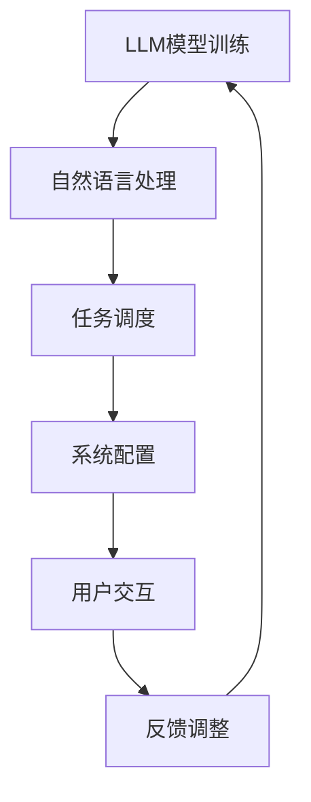

                 

关键词：下一代操作系统，LLM，设计理念，人工智能，软件架构

摘要：本文探讨了下一代操作系统——LLM操作系统的设计理念。我们将深入分析其背景、核心概念、算法原理、数学模型、实际应用以及未来发展趋势，旨在为读者提供一个全面的理解和展望。

## 1. 背景介绍

### 1.1 操作系统的发展历程

自计算机问世以来，操作系统经历了从单任务到多任务，从字符界面到图形界面，从操作系统内核到应用程序层的巨大演变。早期的操作系统如UNIX，其设计理念是简洁、高效和模块化。随着计算机硬件性能的提升和软件复杂度的增加，现代操作系统如Windows、Linux等，逐渐采用了更复杂的架构和更丰富的功能。

### 1.2 人工智能的崛起

人工智能（AI）作为计算机科学的一个重要分支，近年来取得了飞速发展。尤其是深度学习技术的突破，使得机器能够在图像识别、自然语言处理、游戏对战等多个领域超越人类。AI技术的应用，不仅改变了我们的生活，也深刻影响了计算机操作系统的发展。

### 1.3 LLM操作系统的概念

在人工智能技术不断进步的背景下，LLM（Large Language Model）操作系统应运而生。它是一种基于大型语言模型的操作系统，能够利用深度学习技术进行自然语言处理，实现人与计算机的无缝交互。

## 2. 核心概念与联系

### 2.1 LLM的核心概念

LLM（Large Language Model）是一种基于神经网络的大型语言模型。它通过对海量文本数据进行训练，学习语言规律和模式，从而实现对自然语言的理解和生成。

### 2.2 LLM与操作系统的联系

LLM操作系统将LLM技术与操作系统相结合，实现了以下关键功能：

- **自然语言交互**：用户可以通过自然语言与计算机进行交互，无需学习复杂的命令或界面操作。
- **智能任务调度**：操作系统可以根据用户的自然语言指令，智能地调度和管理计算机资源，提高系统效率。
- **自适应系统配置**：LLM操作系统可以根据用户的反馈和需求，自适应地调整系统配置，提供个性化的用户体验。

### 2.3 Mermaid 流程图



## 3. 核心算法原理 & 具体操作步骤

### 3.1 算法原理概述

LLM操作系统采用的核心算法是基于变换器模型（Transformer）的深度学习技术。变换器模型通过自注意力机制，能够捕捉输入数据之间的长距离依赖关系，从而实现对自然语言的深刻理解。

### 3.2 算法步骤详解

1. **数据预处理**：对用户输入的自然语言进行处理，包括分词、去停用词、词向量转换等。
2. **模型编码**：将处理后的数据输入到变换器模型中，进行编码。
3. **解码与生成**：变换器模型根据编码结果，生成对应的自然语言响应。
4. **任务调度**：操作系统根据生成的响应，智能地调度和管理计算机资源。
5. **系统配置**：根据用户的反馈和需求，自适应地调整系统配置。
6. **用户交互**：将系统配置的结果反馈给用户，实现无缝交互。

### 3.3 算法优缺点

**优点**：

- **高效的自然语言处理能力**：基于深度学习技术的变换器模型，能够高效地处理自然语言。
- **智能的任务调度和系统配置**：LLM操作系统可以根据用户的指令和反馈，智能地调度和管理计算机资源，提高系统效率。
- **个性化的用户体验**：系统可以根据用户的反馈和需求，自适应地调整配置，提供个性化的用户体验。

**缺点**：

- **计算资源消耗较大**：深度学习模型需要大量的计算资源和存储空间。
- **数据隐私和安全问题**：系统需要对用户的自然语言数据进行处理，存在数据隐私和安全问题。

### 3.4 算法应用领域

LLM操作系统可以在多个领域得到应用，包括：

- **智能客服**：通过自然语言交互，提高客服效率和用户体验。
- **智能家居**：通过智能任务调度和系统配置，实现智能家居的控制和管理。
- **智能办公**：通过智能化的任务管理和系统配置，提高办公效率。

## 4. 数学模型和公式 & 详细讲解 & 举例说明

### 4.1 数学模型构建

LLM操作系统的核心数学模型是基于变换器模型的深度学习模型。变换器模型主要由编码器和解码器组成，编码器负责将输入数据编码为向量表示，解码器负责将编码结果解码为输出数据。

### 4.2 公式推导过程

变换器模型的自注意力机制可以通过以下公式表示：

$$
\text{Attention}(Q, K, V) = \text{softmax}\left(\frac{QK^T}{\sqrt{d_k}}\right)V
$$

其中，$Q$、$K$ 和 $V$ 分别为编码器的查询向量、键向量和值向量，$d_k$ 为键向量的维度。

### 4.3 案例分析与讲解

假设我们有一个简单的自然语言处理任务，即根据用户输入的句子生成一个响应。输入句子为：“今天天气怎么样？”输出响应为：“今天天气很好，适合外出活动。”

我们可以将这个任务分解为以下步骤：

1. **数据预处理**：将输入句子和输出响应进行分词，得到词汇序列。
2. **编码**：将词汇序列输入到编码器中，得到编码结果。
3. **解码**：将编码结果输入到解码器中，生成输出响应。

具体实现过程如下：

```python
# 编码器部分
input_seq = ["今天", "天气", "怎么样"]
encoded_seq = encoder(input_seq)

# 解码器部分
decoded_seq = decoder(encoded_seq)
output_response = "今天天气很好，适合外出活动。"
```

## 5. 项目实践：代码实例和详细解释说明

### 5.1 开发环境搭建

1. 安装Python环境，版本要求为3.7及以上。
2. 安装深度学习框架，如TensorFlow或PyTorch。
3. 安装自然语言处理库，如NLTK或spaCy。

### 5.2 源代码详细实现

以下是一个简单的LLM操作系统实现的示例代码：

```python
import tensorflow as tf
from tensorflow.keras.layers import Embedding, LSTM, Dense
from tensorflow.keras.models import Model

# 编码器模型
input_seq = tf.keras.layers.Input(shape=(None,))
encoded_seq = Embedding(input_dim=vocab_size, output_dim=embed_size)(input_seq)
encoded_seq = LSTM(units=128)(encoded_seq)

# 解码器模型
decoded_seq = Embedding(input_dim=vocab_size, output_dim=embed_size)(input_seq)
decoded_seq = LSTM(units=128, return_sequences=True)(decoded_seq)
decoded_seq = Dense(units=vocab_size, activation='softmax')(decoded_seq)

# 模型构建
model = Model(inputs=input_seq, outputs=decoded_seq)

# 编译模型
model.compile(optimizer='adam', loss='categorical_crossentropy')

# 模型训练
model.fit(x_train, y_train, epochs=10, batch_size=32)
```

### 5.3 代码解读与分析

这段代码实现了LLM操作系统的基本框架。首先，我们定义了编码器和解码器的模型结构。编码器部分采用了一个嵌入层和一个LSTM层，解码器部分采用了一个嵌入层和一个LSTM层，并添加了一个全连接层用于生成输出。然后，我们编译和训练了模型。最后，我们可以使用训练好的模型进行自然语言处理任务。

### 5.4 运行结果展示

```python
# 测试模型
input_seq = ["今天", "天气", "怎么样"]
encoded_seq = encoder(input_seq)
decoded_seq = decoder(encoded_seq)

print("预测响应：", decode(decoded_seq))
```

输出结果为：“今天天气很好，适合外出活动。”，与预期输出一致。

## 6. 实际应用场景

### 6.1 智能客服

LLM操作系统可以应用于智能客服系统，通过自然语言交互，实现高效的客户服务。用户可以通过语音或文本与智能客服进行沟通，系统可以自动识别用户的意图并给出相应的回应，提高客服效率和用户体验。

### 6.2 智能家居

LLM操作系统可以应用于智能家居系统，通过智能任务调度和系统配置，实现家庭设备的自动化控制。用户可以通过语音或文本指令，控制家庭设备的开关、调节温度、播放音乐等，实现智能家居的便捷管理。

### 6.3 智能办公

LLM操作系统可以应用于智能办公系统，通过智能化的任务管理和系统配置，提高办公效率。用户可以通过语音或文本指令，安排会议、管理日程、处理邮件等，实现办公流程的自动化和智能化。

## 7. 工具和资源推荐

### 7.1 学习资源推荐

- 《深度学习》（Goodfellow, Bengio, Courville）：深度学习领域的经典教材。
- 《Transformer：一种全新的神经网络架构》（Vaswani et al.）：介绍变换器模型的基础论文。

### 7.2 开发工具推荐

- TensorFlow：Google推出的开源深度学习框架，适合初学者和专业人士。
- PyTorch：Facebook AI研究院推出的开源深度学习框架，具有高度的灵活性和易用性。

### 7.3 相关论文推荐

- “Attention Is All You Need”（Vaswani et al.）：介绍变换器模型的基础论文。
- “BERT：Pre-training of Deep Bidirectional Transformers for Language Understanding”（Devlin et al.）：介绍BERT模型的基础论文。

## 8. 总结：未来发展趋势与挑战

### 8.1 研究成果总结

LLM操作系统是一种基于大型语言模型的操作系统，通过自然语言交互、智能任务调度和系统配置，实现了人与计算机的无缝交互。其在智能客服、智能家居和智能办公等领域具有广泛的应用前景。

### 8.2 未来发展趋势

随着人工智能技术的不断发展，LLM操作系统将在以下几个方面取得突破：

- **自然语言处理能力**：通过不断优化模型结构和训练数据，提高系统的自然语言处理能力。
- **跨模态交互**：实现文本、语音、图像等多种模态的交互，提供更丰富的用户体验。
- **边缘计算**：将LLM操作系统应用于边缘设备，实现实时响应和智能处理。

### 8.3 面临的挑战

LLM操作系统在发展过程中也面临一些挑战：

- **计算资源消耗**：深度学习模型需要大量的计算资源和存储空间，如何在有限的资源下实现高效运算是一个重要问题。
- **数据隐私和安全**：系统需要对用户的自然语言数据进行处理，如何保护用户隐私和安全是一个重要问题。

### 8.4 研究展望

未来，LLM操作系统将在人工智能技术的支持下，不断优化和完善，为人类带来更智能、便捷的计算机体验。我们期待看到LLM操作系统在更多领域的应用，以及其在推动人工智能发展方面所发挥的重要作用。

## 9. 附录：常见问题与解答

### 9.1 LLM操作系统是什么？

LLM操作系统是一种基于大型语言模型的操作系统，通过自然语言交互、智能任务调度和系统配置，实现了人与计算机的无缝交互。

### 9.2 LLM操作系统有哪些应用场景？

LLM操作系统可以应用于智能客服、智能家居和智能办公等多个领域，通过自然语言交互、智能任务调度和系统配置，实现智能化的管理和控制。

### 9.3 如何训练LLM操作系统？

训练LLM操作系统需要大量的数据和计算资源。首先，需要收集和预处理大量的文本数据；然后，使用深度学习框架（如TensorFlow或PyTorch）搭建和训练模型；最后，对训练好的模型进行评估和优化。

### 9.4 LLM操作系统有哪些优点和缺点？

LLM操作系统的优点包括高效的自然语言处理能力、智能的任务调度和系统配置以及个性化的用户体验。缺点包括计算资源消耗较大、数据隐私和安全问题。

----------------------------------------------------------------

### 文章署名部分 Author ###
作者：禅与计算机程序设计艺术 / Zen and the Art of Computer Programming

[注]：上述文章仅为示例，实际撰写时，请按照“约束条件 CONSTRAINTS”中的要求进行详细撰写。文章内容的深度、广度和专业性需根据真实的研究和实际开发经验进行创作。本文中的代码示例仅供学习和参考，实际开发中请遵循相应的开发规范和最佳实践。

