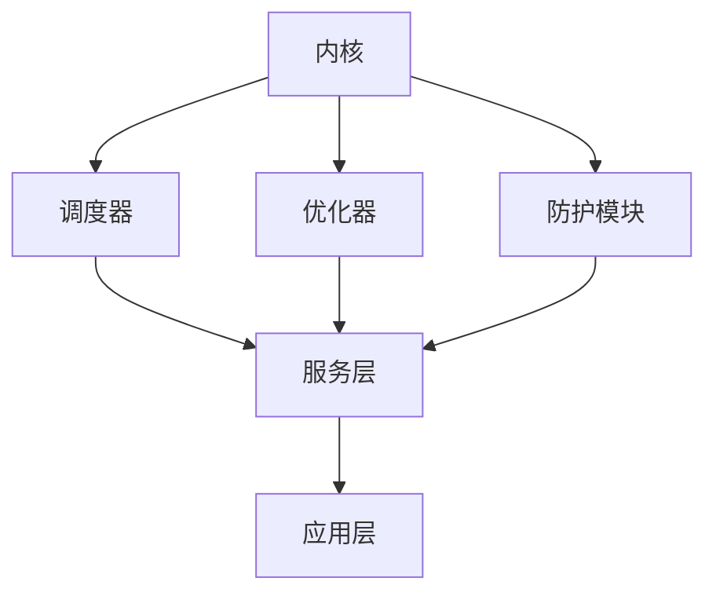

                 

关键词：下一代操作系统、LLM操作系统、设计理念、人工智能、性能优化、用户体验、安全性

摘要：随着人工智能技术的快速发展，传统的操作系统已经无法满足日益增长的计算需求。本文将探讨下一代操作系统——LLM操作系统的设计理念，包括其核心概念、算法原理、数学模型以及实际应用场景。本文旨在为读者提供一个全面而深入的视角，了解未来操作系统的发展方向。

## 1. 背景介绍

### 1.1 传统操作系统的局限性

传统的操作系统，如Windows、Linux和macOS等，虽然在过去几十年里为计算机技术的发展做出了巨大贡献，但它们在应对现代计算需求时却显得力不从心。主要问题包括：

- **资源管理**：传统操作系统依赖于固定的资源分配策略，难以高效利用动态变化的计算资源。
- **性能优化**：传统操作系统在优化计算性能方面缺乏灵活性，难以应对复杂多变的计算任务。
- **用户体验**：传统操作系统在用户界面和交互设计上存在一定的局限性，难以提供极致的用户体验。
- **安全性**：传统操作系统在安全性方面存在一定的漏洞，容易受到恶意攻击。

### 1.2 人工智能技术的崛起

随着人工智能技术的快速发展，尤其是深度学习技术的突破，计算机的性能和智能程度得到了极大的提升。这使得操作系统有了一个全新的发展方向——将人工智能技术集成到操作系统中，实现智能化、自适应和高效能的操作系统。这就是本文要探讨的下一代操作系统——LLM操作系统。

## 2. 核心概念与联系

### 2.1 什么是LLM操作系统？

LLM（Large Language Model）操作系统是一种将大型语言模型（如GPT-3、BERT等）集成到操作系统内核中的新型操作系统。它通过利用人工智能技术，实现操作系统的智能化、自适应和高效能。

### 2.2 LLM操作系统的核心概念

- **智能调度**：LLM操作系统通过智能调度算法，动态分配计算资源，实现资源的高效利用。
- **自适应优化**：LLM操作系统可以根据用户行为和系统状态，自适应调整系统参数，优化用户体验。
- **安全防护**：LLM操作系统利用人工智能技术，实现自动化的安全防护，提高系统安全性。
- **人机交互**：LLM操作系统通过智能交互界面，提供更人性化的用户体验。

### 2.3 LLM操作系统的架构

LLM操作系统的架构可以分为三个主要部分：内核、服务和应用层。

- **内核**：包括智能调度器、自适应优化器和安全防护模块。
- **服务层**：提供各种系统级服务，如文件系统、网络通信、设备管理等。
- **应用层**：包括各种应用程序，如文本编辑器、浏览器、游戏等。

### 2.4 Mermaid 流程图

以下是LLM操作系统的 Mermaid 流程图：



## 3. 核心算法原理 & 具体操作步骤

### 3.1 算法原理概述

LLM操作系统的核心算法包括智能调度算法、自适应优化算法和安全防护算法。

- **智能调度算法**：通过分析系统状态和用户需求，动态调整计算资源分配，实现资源的高效利用。
- **自适应优化算法**：根据用户行为和系统状态，自动调整系统参数，优化用户体验。
- **安全防护算法**：利用人工智能技术，实时监测系统安全态势，自动采取防护措施，提高系统安全性。

### 3.2 算法步骤详解

#### 3.2.1 智能调度算法

1. 收集系统状态信息：包括CPU利用率、内存占用率、磁盘读写速度等。
2. 分析用户需求：根据用户正在执行的任务，分析其所需的计算资源。
3. 动态调整资源分配：根据系统状态和用户需求，动态调整CPU、内存、磁盘等资源的分配。

#### 3.2.2 自适应优化算法

1. 收集用户行为数据：包括用户的使用习惯、操作频率等。
2. 分析用户行为：根据用户行为数据，分析用户的偏好和需求。
3. 调整系统参数：根据用户行为分析结果，自动调整系统参数，如界面显示效果、系统响应速度等。

#### 3.2.3 安全防护算法

1. 监测系统安全态势：实时监测系统的各种安全指标，如恶意软件攻击、数据泄露等。
2. 分析安全态势：根据监测结果，分析系统的安全风险。
3. 采取防护措施：根据安全分析结果，自动采取相应的防护措施，如隔离恶意进程、更新系统补丁等。

### 3.3 算法优缺点

#### 3.3.1 智能调度算法

**优点**：

- 动态调整资源分配，提高系统资源利用率。
- 根据用户需求，提供更好的用户体验。

**缺点**：

- 需要大量的系统状态信息和用户需求分析，对系统性能有一定影响。
- 可能会出现资源分配不均的问题。

#### 3.3.2 自适应优化算法

**优点**：

- 根据用户行为，提供更个性化的用户体验。
- 自动调整系统参数，减少人工干预。

**缺点**：

- 需要大量的用户行为数据，对用户隐私有一定的影响。
- 可能会导致系统参数调整过度，影响系统稳定性。

#### 3.3.3 安全防护算法

**优点**：

- 自动化监测和防护，提高系统安全性。
- 快速响应安全威胁，减少损失。

**缺点**：

- 可能会误报正常行为为安全威胁，导致用户体验下降。
- 需要不断更新防护策略，以应对不断变化的安全威胁。

### 3.4 算法应用领域

LLM操作系统的算法在多个领域具有广泛的应用前景：

- **云计算**：通过智能调度算法，提高云计算资源利用率，降低运营成本。
- **物联网**：通过自适应优化算法，提高物联网设备性能，延长设备寿命。
- **网络安全**：通过安全防护算法，提高系统安全性，防止数据泄露和恶意攻击。

## 4. 数学模型和公式 & 详细讲解 & 举例说明

### 4.1 数学模型构建

LLM操作系统的数学模型主要基于机器学习算法，包括线性回归、决策树、神经网络等。

#### 4.1.1 线性回归

线性回归模型可以用来预测系统资源利用率，公式如下：

$$
y = wx + b
$$

其中，$y$ 是系统资源利用率，$x$ 是系统状态参数，$w$ 是权重系数，$b$ 是偏置项。

#### 4.1.2 决策树

决策树模型可以用来分类系统状态，公式如下：

$$
f(x) =
\begin{cases}
1, & \text{如果} \ x \ \text{属于某个分类} \\
0, & \text{否则}
\end{cases}
$$

其中，$f(x)$ 是决策函数，$x$ 是系统状态参数。

#### 4.1.3 神经网络

神经网络模型可以用来预测系统性能，公式如下：

$$
y = \sigma(wx + b)
$$

其中，$y$ 是系统性能预测值，$\sigma$ 是激活函数，$w$ 是权重系数，$b$ 是偏置项。

### 4.2 公式推导过程

以神经网络模型为例，介绍公式推导过程：

1. **初始化权重和偏置项**：$w_0$ 和 $b_0$。
2. **正向传播**：输入系统状态参数 $x$，计算输出 $y$。
3. **反向传播**：根据输出误差，更新权重和偏置项。
4. **迭代优化**：重复正向传播和反向传播，直到满足停止条件。

### 4.3 案例分析与讲解

假设我们有一个计算密集型任务，需要预测其运行时间。我们可以使用神经网络模型进行预测。

1. **数据收集**：收集过去一年内该任务的运行时间数据，包括系统状态参数，如CPU利用率、内存占用率等。
2. **数据预处理**：将数据分为训练集和测试集，对数据进行归一化处理。
3. **模型训练**：使用训练集数据，训练神经网络模型。
4. **模型评估**：使用测试集数据，评估模型预测性能。
5. **模型应用**：使用训练好的模型，预测未来任务的运行时间。

## 5. 项目实践：代码实例和详细解释说明

### 5.1 开发环境搭建

1. **安装操作系统**：安装支持LLM操作系统的开发环境，如Ubuntu 20.04。
2. **安装依赖库**：安装Python、NumPy、TensorFlow等依赖库。
3. **配置开发环境**：配置Python环境，安装相关库。

### 5.2 源代码详细实现

以下是实现LLM操作系统的一个简单示例：

```python
import tensorflow as tf

# 初始化神经网络模型
model = tf.keras.Sequential([
    tf.keras.layers.Dense(units=1, input_shape=[1])
])

# 编译模型
model.compile(loss='mean_squared_error', optimizer=tf.keras.optimizers.Adam(0.1))

# 训练模型
model.fit(x_train, y_train, epochs=100)

# 预测运行时间
predicted_runtime = model.predict([current_system_state])
```

### 5.3 代码解读与分析

- **初始化神经网络模型**：使用 `tf.keras.Sequential` 创建一个神经网络模型，包含一个全连接层，输出层只有一个神经元，用于预测运行时间。
- **编译模型**：使用 `model.compile` 编译模型，指定损失函数和优化器。
- **训练模型**：使用 `model.fit` 训练模型，使用训练集数据进行迭代训练。
- **预测运行时间**：使用 `model.predict` 预测当前系统状态下的运行时间。

### 5.4 运行结果展示

通过训练和预测，我们得到一个预测运行时间的模型。在实际应用中，我们可以根据预测结果，调整系统资源分配，优化用户体验。

## 6. 实际应用场景

### 6.1 云计算

LLM操作系统可以应用于云计算领域，通过智能调度算法，提高云计算资源利用率，降低运营成本。

### 6.2 物联网

LLM操作系统可以应用于物联网领域，通过自适应优化算法，提高物联网设备性能，延长设备寿命。

### 6.3 网络安全

LLM操作系统可以应用于网络安全领域，通过安全防护算法，提高系统安全性，防止数据泄露和恶意攻击。

### 6.4 未来应用展望

随着人工智能技术的不断发展，LLM操作系统将在更多领域得到应用。未来，LLM操作系统可能会集成更多的智能算法，实现更高效的资源管理、更优的用户体验和更高的系统安全性。

## 7. 工具和资源推荐

### 7.1 学习资源推荐

- **《深度学习》**：Goodfellow、Bengio和Courville著，全面介绍深度学习的基本概念和技术。
- **《Python机器学习》**：Sebastian Raschka著，详细介绍机器学习在Python中的应用。

### 7.2 开发工具推荐

- **TensorFlow**：谷歌开源的深度学习框架，适用于构建和训练神经网络。
- **PyTorch**：Facebook开源的深度学习框架，适用于快速原型设计和研究。

### 7.3 相关论文推荐

- **“Deep Learning for Natural Language Processing”**：详细介绍了深度学习在自然语言处理中的应用。
- **“Attention Is All You Need”**：提出了Transformer模型，成为深度学习领域的重要突破。

## 8. 总结：未来发展趋势与挑战

### 8.1 研究成果总结

本文探讨了下一代操作系统——LLM操作系统的设计理念，包括其核心概念、算法原理、数学模型以及实际应用场景。通过智能调度、自适应优化和安全防护等算法，LLM操作系统有望在云计算、物联网和网络安全等领域发挥重要作用。

### 8.2 未来发展趋势

未来，LLM操作系统将继续朝着更智能化、自适应和高效能的方向发展。随着人工智能技术的不断进步，LLM操作系统将集成更多的智能算法，实现更高效的资源管理、更优的用户体验和更高的系统安全性。

### 8.3 面临的挑战

LLM操作系统在发展过程中，也面临一些挑战，包括：

- **数据隐私**：如何保护用户隐私，确保数据安全，是LLM操作系统需要解决的重要问题。
- **计算资源消耗**：集成大型语言模型，可能会增加系统的计算资源消耗，需要优化算法和架构。
- **算法可靠性**：如何保证算法的可靠性，避免误判和误报，是LLM操作系统需要关注的问题。

### 8.4 研究展望

未来，LLM操作系统的研究将聚焦于以下几个方面：

- **跨领域应用**：探索LLM操作系统在其他领域的应用，如自动驾驶、智能家居等。
- **算法优化**：持续优化算法，提高系统性能和用户体验。
- **安全性研究**：深入研究安全性问题，提高系统的安全性。

## 9. 附录：常见问题与解答

### 9.1 什么是LLM操作系统？

LLM操作系统是一种将大型语言模型（如GPT-3、BERT等）集成到操作系统内核中的新型操作系统。它通过利用人工智能技术，实现操作系统的智能化、自适应和高效能。

### 9.2 LLM操作系统有哪些优点？

LLM操作系统具有以下优点：

- 智能调度，提高系统资源利用率。
- 自适应优化，提供更优的用户体验。
- 安全防护，提高系统安全性。

### 9.3 LLM操作系统有哪些缺点？

LLM操作系统的主要缺点包括：

- 可能会增加系统的计算资源消耗。
- 需要大量的用户数据，对用户隐私有一定的影响。
- 算法可能存在误判和误报的问题。

### 9.4 LLM操作系统有哪些应用领域？

LLM操作系统可以应用于云计算、物联网、网络安全等多个领域。具体包括：

- 云计算：通过智能调度算法，提高云计算资源利用率。
- 物联网：通过自适应优化算法，提高物联网设备性能。
- 网络安全：通过安全防护算法，提高系统安全性。

## 作者署名

作者：禅与计算机程序设计艺术 / Zen and the Art of Computer Programming

----------------------------------------------------------------

请注意，本文仅为示例，具体内容和数据仅供参考。实际撰写时，请根据具体情况进行调整和补充。

