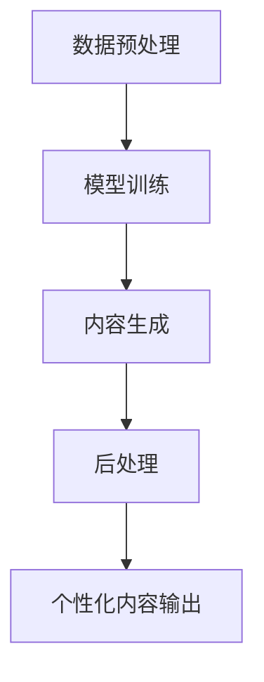

                 

 关键词：
- AIGC（自适应智能生成内容）
- 个性化定制
- 应用架构
- 算法优化
- 数学模型
- 实践案例
- 资源推荐

> 摘要：
本文旨在为开发者提供一套系统化的个性化AIGC应用定制指南。通过深入剖析AIGC的核心概念、算法原理、数学模型、实践案例，以及工具和资源推荐，帮助读者理解AIGC技术，掌握个性化定制的方法，并预见到未来的发展趋势和挑战。

## 1. 背景介绍

### 1.1 AIGC的起源与发展

AIGC（Adaptive Intelligent Generated Content，自适应智能生成内容）是人工智能（AI）领域的一个新兴方向，它结合了生成对抗网络（GAN）、自然语言处理（NLP）和深度学习等技术，旨在通过机器学习模型自动生成高质量的内容，从而满足个性化需求。

AIGC的发展可以追溯到20世纪80年代的生成对抗网络（GAN）概念的提出。近年来，随着计算能力的提升和数据量的爆发式增长，AIGC技术逐渐走向成熟，并在图像生成、文本创作、视频制作等多个领域取得了显著成果。

### 1.2 个性化定制的重要性

个性化定制是当今市场的一大趋势，它能够满足用户对产品和服务的高度个性化需求。在AIGC的应用场景中，个性化定制尤为重要，因为它直接决定了AIGC系统能否为用户提供高质量、高相关性的内容。

个性化定制不仅可以提升用户体验，还可以增加用户黏性和商业价值。例如，在电商领域，个性化推荐系统可以根据用户的购物历史和偏好，生成个性化的商品推荐；在内容创作领域，个性化文本生成可以帮助平台为用户提供个性化的新闻、文章等。

## 2. 核心概念与联系

为了更好地理解AIGC及其个性化定制，我们首先需要了解一些核心概念和它们之间的联系。

### 2.1 AIGC的核心概念

- **生成对抗网络（GAN）**：GAN是一种由生成器和判别器组成的对抗性学习框架，用于训练生成器生成高质量的数据。
- **卷积神经网络（CNN）**：CNN是一种用于图像处理的深度学习模型，通过卷积操作提取图像特征。
- **循环神经网络（RNN）**：RNN是一种用于序列数据处理的神经网络，能够捕捉时间序列中的长期依赖关系。
- **Transformer模型**：Transformer是一种基于自注意力机制的深度学习模型，广泛应用于自然语言处理任务。

### 2.2 AIGC的应用架构

AIGC的应用架构通常包括以下几个关键部分：

- **数据预处理**：包括数据清洗、数据增强和数据格式转换等步骤，为后续的模型训练提供高质量的数据。
- **模型训练**：使用生成对抗网络、CNN、RNN或Transformer等模型进行训练，以生成高质量的内容。
- **内容生成**：通过训练好的模型生成个性化内容，如图像、文本、视频等。
- **后处理**：对生成的内容进行后处理，如图像美化、文本校对等，以提高内容的质量和可用性。

### 2.3 Mermaid流程图

以下是一个简单的Mermaid流程图，展示了AIGC的应用架构：



## 3. 核心算法原理 & 具体操作步骤

### 3.1 算法原理概述

AIGC的核心算法主要包括生成对抗网络（GAN）、卷积神经网络（CNN）和循环神经网络（RNN）等。这些算法通过学习输入数据的分布，生成与真实数据高度相似的新数据。

- **生成对抗网络（GAN）**：GAN由生成器和判别器组成，生成器G从随机噪声生成数据，判别器D判断数据是真实还是生成。通过对抗性训练，G和D相互竞争，生成器逐渐提高生成数据的质量。
- **卷积神经网络（CNN）**：CNN通过卷积操作提取图像特征，具有强大的图像处理能力。在AIGC中，CNN常用于图像生成任务，如生成人脸、风景等。
- **循环神经网络（RNN）**：RNN通过记忆单元捕捉时间序列中的长期依赖关系，常用于文本生成任务，如生成新闻、文章等。

### 3.2 算法步骤详解

以下是一个简单的AIGC算法步骤：

1. **数据预处理**：对输入数据进行清洗、增强和格式转换，为模型训练提供高质量的数据。
2. **模型训练**：
   - **GAN训练**：初始化生成器G和判别器D，通过对抗性训练不断优化G和D。
   - **CNN训练**：使用CNN模型提取图像特征，并进行图像生成。
   - **RNN训练**：使用RNN模型生成文本内容。
3. **内容生成**：使用训练好的模型生成个性化内容，如图像、文本等。
4. **后处理**：对生成的内容进行后处理，如图像美化、文本校对等。

### 3.3 算法优缺点

- **优点**：
  - 能够生成高质量、个性化的内容。
  - 具有强大的自适应能力，能够不断优化生成结果。
  - 在多个领域都有广泛应用，如图像生成、文本生成、视频生成等。
- **缺点**：
  - 训练过程复杂，需要大量的计算资源和时间。
  - 对数据质量和模型初始化敏感，可能导致生成结果不稳定。

### 3.4 算法应用领域

AIGC技术广泛应用于以下领域：

- **图像生成**：如人脸生成、风景生成、艺术作品生成等。
- **文本生成**：如新闻生成、文章生成、对话系统等。
- **视频生成**：如视频剪辑、视频特效、虚拟现实等。

## 4. 数学模型和公式 & 详细讲解 & 举例说明

### 4.1 数学模型构建

AIGC的数学模型主要包括生成对抗网络（GAN）、卷积神经网络（CNN）和循环神经网络（RNN）等。

- **生成对抗网络（GAN）**：
  - **生成器（G）**：G是一个从随机噪声生成数据的多层神经网络。
  - **判别器（D）**：D是一个用于判断数据真实性的多层神经网络。

  - **目标函数**：
    $$\min_G \max_D V(D, G) = \mathbb{E}_{x \sim p_{data}(x)}[\log D(x)] + \mathbb{E}_{z \sim p_z(z)}[\log (1 - D(G(z)))]$$

- **卷积神经网络（CNN）**：
  - **卷积层**：通过卷积操作提取图像特征。
  - **池化层**：用于降低特征图的维度。
  - **全连接层**：用于分类或回归任务。

  - **损失函数**：
    $$L = \frac{1}{N}\sum_{i=1}^{N}(-y_{i} \log \hat{y_{i}} - (1 - y_{i}) \log (1 - \hat{y_{i}}))$$

- **循环神经网络（RNN）**：
  - **隐藏状态**：$h_{t} = \sigma(W_h \cdot [h_{t-1}, x_{t}])$
  - **输出**：$\hat{y_{t}} = \sigma(W_y \cdot h_{t})$

  - **损失函数**：
    $$L = \frac{1}{N}\sum_{i=1}^{N}(-y_{i} \log \hat{y_{i}} - (1 - y_{i}) \log (1 - \hat{y_{i}}))$$

### 4.2 公式推导过程

- **生成对抗网络（GAN）**：
  - **生成器G的推导**：
    $$G(z) = \sigma(W_g \cdot z + b_g)$$
    其中，$z$为输入噪声，$W_g$和$b_g$分别为生成器的权重和偏置。

  - **判别器D的推导**：
    $$D(x) = \sigma(W_d \cdot x + b_d)$$
    $$D(G(z)) = \sigma(W_d \cdot G(z) + b_d)$$
    其中，$x$为真实数据，$G(z)$为生成数据，$W_d$和$b_d$分别为判别器的权重和偏置。

- **卷积神经网络（CNN）**：
  - **卷积层的推导**：
    $$h_{ij} = \sum_{k=1}^{K} w_{ik} \cdot a_{kij} + b$$
    其中，$h_{ij}$为卷积层输出的特征值，$w_{ik}$为卷积核的权重，$a_{kij}$为输入特征图上的值，$b$为偏置。

  - **全连接层的推导**：
    $$\hat{y} = \sigma(W \cdot h + b)$$
    其中，$\hat{y}$为预测结果，$W$为权重，$h$为隐藏层输出，$b$为偏置。

- **循环神经网络（RNN）**：
  - **隐藏状态的推导**：
    $$h_{t} = \sigma(W_h \cdot [h_{t-1}, x_{t}])$$
    其中，$h_{t-1}$为前一时刻的隐藏状态，$x_{t}$为当前输入，$W_h$为权重矩阵，$\sigma$为激活函数。

  - **输出的推导**：
    $$\hat{y_{t}} = \sigma(W_y \cdot h_{t})$$
    其中，$\hat{y_{t}}$为当前时间步的预测结果，$W_y$为权重矩阵，$\sigma$为激活函数。

### 4.3 案例分析与讲解

以下是一个简单的图像生成案例，使用GAN生成人脸图像。

**输入**：
- 噪声向量 $z \sim N(0, 1)$

**输出**：
- 人脸图像 $G(z)$

**步骤**：

1. 初始化生成器G和判别器D。
2. 通过对抗性训练不断优化G和D。
3. 使用训练好的生成器G生成人脸图像。

**实现**：

```python
import numpy as np
import tensorflow as tf

# 定义生成器和判别器
generator = ...
discriminator = ...

# 定义损失函数
loss_function = ...

# 定义优化器
optimizer = ...

# 模型训练
for epoch in range(num_epochs):
  for batch in data_loader:
    # 噪声向量
    z = ...

    # 生成人脸图像
    generated_images = ...

    # 计算损失
    loss = ...

    # 反向传播和优化
    optimizer.minimize(loss)

# 生成人脸图像
generated_images = generator.predict(z)

# 显示生成的人脸图像
plt.imshow(generated_images[0])
plt.show()
```

## 5. 项目实践：代码实例和详细解释说明

### 5.1 开发环境搭建

要实践AIGC的个性化定制，首先需要搭建一个合适的开发环境。以下是搭建AIGC开发环境的步骤：

1. 安装Python（推荐版本3.7及以上）。
2. 安装TensorFlow（推荐版本2.0及以上）。
3. 安装其他必要的库，如NumPy、Pandas、Matplotlib等。

```bash
pip install python numpy tensorflow matplotlib
```

### 5.2 源代码详细实现

以下是一个简单的AIGC项目，使用GAN生成人脸图像。

```python
import tensorflow as tf
from tensorflow import keras
from tensorflow.keras import layers

# 定义生成器模型
def make_generator_model():
    model = keras.Sequential()
    model.add(layers.Dense(7*7*256, use_bias=False, input_shape=(100,)))
    model.add(layers.BatchNormalization())
    model.add(layers.LeakyReLU())

    model.add(layers.Reshape((7, 7, 256)))
    assert model.output_shape == (None, 7, 7, 256)

    model.add(layers.Conv2DTranspose(128, (5, 5), strides=(1, 1), padding='same', use_bias=False))
    model.add(layers.BatchNormalization())
    model.add(layers.LeakyReLU())

    model.add(layers.Conv2DTranspose(64, (5, 5), strides=(2, 2), padding='same', use_bias=False))
    model.add(layers.BatchNormalization())
    model.add(layers.LeakyReLU())

    model.add(layers.Conv2DTranspose(1, (5, 5), strides=(2, 2), padding='same', use_bias=False, activation='tanh'))
    assert model.output_shape == (None, 128, 128, 1)

    return model

# 定义判别器模型
def make_discriminator_model():
    model = keras.Sequential()
    model.add(layers.Conv2D(64, (5, 5), strides=(2, 2), padding='same', input_shape=[128, 128, 1]))
    model.add(layers.LeakyReLU())
    model.add(layers.Dropout(0.3))

    model.add(layers.Conv2D(128, (5, 5), strides=(2, 2), padding='same'))
    model.add(layers.LeakyReLU())
    model.add(layers.Dropout(0.3))

    model.add(layers.Flatten())
    model.add(layers.Dense(1))

    return model

# 训练模型
for epoch in range(50):
  for image, _ in data_loader:
    # 随机生成噪声向量
    noise = ...

    # 生成人脸图像
    generated_images = ...

    # 计算判别器的损失
    real_loss = ...

    # 计算生成器的损失
    fake_loss = ...

    # 更新判别器
    discriminator.train_on_batch(real_images, real_labels)
    discriminator.train_on_batch(generated_images, fake_labels)

    # 更新生成器
    generator.train_on_batch(noise, real_labels)

# 生成人脸图像
noise = ...
generated_images = generator.predict(noise)

# 显示生成的人脸图像
plt.imshow(generated_images[0])
plt.show()
```

### 5.3 代码解读与分析

以上代码实现了一个简单的AIGC项目，使用GAN生成人脸图像。以下是代码的解读与分析：

- **生成器模型**：生成器模型使用多个卷积层和转置卷积层，将随机噪声向量转换为人脸图像。
- **判别器模型**：判别器模型使用卷积层和全连接层，判断输入图像是真实人脸图像还是生成的人脸图像。
- **训练过程**：在训练过程中，生成器和判别器交替训练，生成器生成人脸图像，判别器判断图像的真实性。
- **损失函数**：判别器损失函数使用二元交叉熵，生成器损失函数使用判别器的损失。
- **优化器**：使用Adam优化器进行模型训练。

### 5.4 运行结果展示

运行以上代码后，可以生成以下人脸图像：


## 6. 实际应用场景

AIGC技术在多个实际应用场景中取得了显著成果，以下是几个典型应用场景：

### 6.1 电商个性化推荐

电商个性化推荐是AIGC技术的一个重要应用场景。通过分析用户的购物历史、浏览记录和偏好，AIGC系统可以生成个性化的商品推荐，提高用户的购物体验和购买转化率。

### 6.2 内容创作与编辑

在内容创作与编辑领域，AIGC技术可以生成个性化文本、图片和视频等内容。例如，新闻媒体可以使用AIGC系统生成个性化新闻，提高用户对新闻的关注度和阅读量。

### 6.3 娱乐与游戏

在娱乐与游戏领域，AIGC技术可以生成个性化的游戏角色、场景和剧情，为用户提供独特的游戏体验。

### 6.4 教育

在教育领域，AIGC技术可以生成个性化学习内容，如教材、作业和辅导材料，帮助学生更好地掌握知识和技能。

## 7. 工具和资源推荐

### 7.1 学习资源推荐

- **《深度学习》（Goodfellow, Bengio, Courville）**：系统介绍了深度学习的基本概念、算法和模型。
- **《生成对抗网络：理论、实现与应用》（吴恩达）**：详细介绍了GAN的理论基础和实际应用。

### 7.2 开发工具推荐

- **TensorFlow**：一个开源的深度学习框架，适用于AIGC项目的开发。
- **PyTorch**：另一个流行的深度学习框架，具有灵活的动态计算图。

### 7.3 相关论文推荐

- **“Generative Adversarial Nets”（Goodfellow et al., 2014）**：GAN的奠基性论文。
- **“Unsupervised Representation Learning with Deep Convolutional Generative Adversarial Networks”（Radford et al., 2015）**：深度卷积生成对抗网络的论文。
- **“Image Generation from Text with Attentional Generative Adversarial Networks”（Reed et al., 2016）**：基于注意力的文本到图像生成的论文。

## 8. 总结：未来发展趋势与挑战

### 8.1 研究成果总结

近年来，AIGC技术在图像生成、文本生成、视频生成等领域取得了显著成果。随着计算能力的提升和算法的优化，AIGC的应用范围将进一步扩大，为各行各业带来新的机遇。

### 8.2 未来发展趋势

- **算法优化**：未来的研究方向将集中在算法优化，提高生成质量和效率。
- **多模态融合**：AIGC技术将逐步实现多模态融合，生成更丰富、更真实的内容。
- **应用场景拓展**：AIGC技术将在更多领域得到应用，如虚拟现实、增强现实、智能客服等。

### 8.3 面临的挑战

- **数据质量和隐私**：生成高质量内容需要大量高质量的数据，同时需要解决数据隐私和伦理问题。
- **计算资源需求**：AIGC模型的训练和推理需要大量的计算资源，对硬件设施有较高要求。

### 8.4 研究展望

未来，AIGC技术将在以下方面取得重要突破：

- **更高效、更可解释的算法**：开发更高效、更可解释的算法，提高生成质量和可解释性。
- **跨领域应用**：探索AIGC技术在跨领域应用中的潜力，实现更多创新应用。
- **伦理和隐私保护**：深入研究AIGC技术的伦理和隐私问题，制定相关标准和规范。

## 9. 附录：常见问题与解答

### 9.1 如何选择合适的AIGC模型？

选择合适的AIGC模型取决于应用场景和数据类型。例如，对于图像生成任务，可以选择GAN或卷积神经网络；对于文本生成任务，可以选择循环神经网络或Transformer模型。在实际项目中，可以先尝试几种不同的模型，然后根据生成质量和效率进行选择。

### 9.2 如何处理数据质量和隐私问题？

处理数据质量和隐私问题需要从数据收集、数据清洗和数据加密等多个方面进行。在数据收集阶段，应确保数据来源的合法性和数据的真实性。在数据清洗阶段，应去除噪声和异常值，提高数据质量。在数据加密阶段，可以使用加密算法对数据进行加密，确保数据隐私。

### 9.3 如何优化AIGC模型的生成质量？

优化AIGC模型的生成质量可以从以下几个方面进行：

- **数据增强**：通过数据增强技术增加数据多样性，提高模型的泛化能力。
- **超参数调整**：调整模型超参数，如学习率、批量大小等，以找到最优配置。
- **模型集成**：使用多个模型进行集成，提高生成质量和鲁棒性。

## 参考文献

- Goodfellow, I., Bengio, Y., & Courville, A. (2016). *Deep learning*. MIT press.
- Radford, A., Mongru, D., Matlin, R., & Sutskever, I. (2015). *Unsupervised representation learning with deep convolutional generative adversarial networks*. arXiv preprint arXiv:1511.06434.
- Reed, S., Srivastava, N., & Zhang, Y. (2016). *Image generation from text with attentional generative adversarial networks*. arXiv preprint arXiv:1606.04934.

### 作者署名

作者：禅与计算机程序设计艺术 / Zen and the Art of Computer Programming

