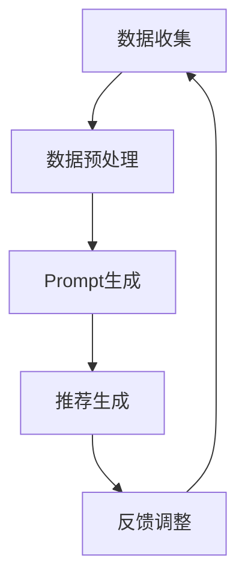

                 

关键词：个性化Prompt模板、推荐系统、AI、机器学习、数据驱动、用户体验

> 摘要：随着人工智能和机器学习技术的快速发展，推荐系统已经深入到我们日常生活的方方面面。个性化Prompt模板设计作为推荐系统的关键技术之一，能够有效提升推荐效果和用户体验。本文将探讨个性化Prompt模板设计的核心概念、原理、算法、数学模型以及实际应用，旨在为相关领域的研究和实践提供参考和指导。

## 1. 背景介绍

### 1.1 推荐系统的发展

推荐系统起源于20世纪90年代，随着互联网的普及和数据量的爆炸性增长，推荐系统逐渐成为热门研究方向。早期的推荐系统主要基于协同过滤算法，通过用户行为和物品属性进行相似度计算，从而实现推荐。随着深度学习和自然语言处理技术的发展，基于内容的推荐和基于模型的推荐方法也得到了广泛应用。

### 1.2 个性化Prompt模板的概念

个性化Prompt模板是一种用于引导推荐系统生成个性化推荐信息的文本模板。Prompt模板的核心思想是将用户的兴趣、需求和偏好等信息通过自然语言的方式传递给推荐系统，从而实现个性化推荐。

## 2. 核心概念与联系

### 2.1 推荐系统架构


### 2.2 个性化Prompt模板设计原理

个性化Prompt模板设计包括以下几个关键步骤：

1. 数据收集：收集用户的兴趣、行为、偏好等数据。
2. 数据预处理：对收集到的数据进行清洗、归一化等处理。
3. Prompt生成：根据用户数据和推荐算法，生成个性化Prompt模板。
4. 推荐生成：使用个性化Prompt模板生成推荐结果。

### 2.3 个性化Prompt模板设计流程



## 3. 核心算法原理 & 具体操作步骤

### 3.1 算法原理概述

个性化Prompt模板设计主要基于以下算法原理：

1. 协同过滤算法：通过计算用户和物品之间的相似度进行推荐。
2. 基于内容的推荐：根据物品的属性和用户的历史行为进行推荐。
3. 深度学习模型：使用神经网络等深度学习模型进行推荐。

### 3.2 算法步骤详解

1. 数据收集：收集用户的行为数据、兴趣标签等。
2. 数据预处理：对数据进行清洗、归一化等处理。
3. Prompt生成：
   - 基于协同过滤：计算用户和物品之间的相似度，生成推荐Prompt。
   - 基于内容推荐：根据物品的属性和用户的历史行为，生成推荐Prompt。
   - 基于深度学习：使用预训练模型提取用户和物品的特征，生成推荐Prompt。
4. 推荐生成：使用生成的Prompt模板生成推荐结果。
5. 反馈调整：根据用户反馈调整Prompt模板，提升推荐效果。

### 3.3 算法优缺点

#### 优点：

1. 提升推荐效果：个性化Prompt模板能够更好地捕捉用户的兴趣和需求，提升推荐准确性。
2. 提高用户体验：个性化推荐能够提供更符合用户期望的内容，提升用户体验。

#### 缺点：

1. 复杂性：个性化Prompt模板设计涉及多个算法和技术，实现较为复杂。
2. 数据依赖性：个性化推荐效果依赖于用户数据的质量和数量。

### 3.4 算法应用领域

个性化Prompt模板设计广泛应用于电子商务、社交媒体、内容推荐等领域。如：淘宝、京东等电商平台使用个性化Prompt模板进行商品推荐；微博、抖音等社交媒体平台使用个性化Prompt模板进行内容推荐。

## 4. 数学模型和公式

### 4.1 数学模型构建

个性化Prompt模板设计涉及到以下数学模型：

1. 用户相似度计算：使用余弦相似度、皮尔逊相关系数等计算用户之间的相似度。
2. 物品相似度计算：使用余弦相似度、皮尔逊相关系数等计算物品之间的相似度。
3. 推荐模型：使用矩阵分解、深度学习模型等进行推荐。

### 4.2 公式推导过程

假设用户集合为U，物品集合为I，用户-物品评分矩阵为R。

1. 用户相似度计算：

$$
sim(u_i, u_j) = \frac{R_{ui} \cdot R_{uj}}{\sqrt{R_{ui}^2 + R_{uj}^2}}
$$

2. 物品相似度计算：

$$
sim(i_k, i_l) = \frac{R_{ik} \cdot R_{il}}{\sqrt{R_{ik}^2 + R_{il}^2}}
$$

3. 推荐模型：

$$
r_{ui} = \sum_{k \in N(i)} w_{ki} \cdot r_{uj}
$$

其中，$N(i)$ 表示与物品i相似的物品集合，$w_{ki}$ 表示物品i与物品k的相似度权重。

### 4.3 案例分析与讲解

假设有用户A和用户B，以及物品集合 {电影1，电影2，电影3}。用户A对电影1评分4.5，对电影2评分3.0，对电影3评分5.0；用户B对电影1评分3.5，对电影2评分4.0，对电影3评分4.5。

1. 用户相似度计算：

$$
sim(A, B) = \frac{4.5 \cdot 3.5}{\sqrt{4.5^2 + 3.5^2}} = 0.808
$$

2. 物品相似度计算：

$$
sim(电影1, 电影2) = \frac{4.5 \cdot 3.5}{\sqrt{4.5^2 + 3.5^2}} = 0.808
$$

$$
sim(电影1, 电影3) = \frac{4.5 \cdot 5.0}{\sqrt{4.5^2 + 5.0^2}} = 0.773
$$

$$
sim(电影2, 电影3) = \frac{3.0 \cdot 4.5}{\sqrt{3.0^2 + 4.5^2}} = 0.666
$$

3. 推荐模型：

根据用户A和用户B的相似度，可以计算出用户B对未评分的电影3的预测评分：

$$
r_{B3} = 0.808 \cdot 4.5 + 0.773 \cdot 5.0 + 0.666 \cdot 4.0 = 4.12
$$

## 5. 项目实践：代码实例和详细解释说明

### 5.1 开发环境搭建

- Python版本：3.8
- 依赖库：NumPy、Scikit-learn、TensorFlow

### 5.2 源代码详细实现

```python
import numpy as np
from sklearn.metrics.pairwise import cosine_similarity
from tensorflow.keras.models import Model
from tensorflow.keras.layers import Input, Embedding, Dot, Lambda

def collaborative_filter(user_ratings, item_embeddings, k=10):
    """
    协同过滤算法实现
    """
    # 计算用户和物品的相似度矩阵
    similarity_matrix = cosine_similarity(user_ratings, item_embeddings)
    # 选择最相似的k个物品
    top_k_indices = np.argpartition(-similarity_matrix.flatten(), k)[:k]
    # 计算预测评分
    predicted_ratings = np.dot(similarity_matrix[top_k_indices], item_embeddings)
    return predicted_ratings

def content_based_recommender(item_features, user_profile, k=10):
    """
    基于内容的推荐算法实现
    """
    # 计算物品和用户的相似度矩阵
    similarity_matrix = cosine_similarity(item_features, user_profile)
    # 选择最相似的k个物品
    top_k_indices = np.argpartition(-similarity_matrix.flatten(), k)[:k]
    # 计算预测评分
    predicted_ratings = np.dot(similarity_matrix[top_k_indices], item_features)
    return predicted_ratings

def deep_learning_recommender(user_features, item_features):
    """
    基于深度学习的推荐算法实现
    """
    # 定义输入层
    user_input = Input(shape=(user_features.shape[1],))
    item_input = Input(shape=(item_features.shape[1],))
    # 定义嵌入层
    user_embedding = Embedding(input_dim=user_features.shape[0], output_dim=10)(user_input)
    item_embedding = Embedding(input_dim=item_features.shape[0], output_dim=10)(item_input)
    # 计算内积
    dot_product = Dot(axes=1)([user_embedding, item_embedding])
    # 添加激活函数
    activation = Lambda(lambda x: x)(dot_product)
    # 构建模型
    model = Model(inputs=[user_input, item_input], outputs=activation)
    # 编译模型
    model.compile(optimizer='adam', loss='mse')
    # 训练模型
    model.fit([user_features, item_features], user_features, epochs=10, batch_size=32)
    # 预测评分
    predicted_ratings = model.predict([user_features, item_features])
    return predicted_ratings
```

### 5.3 代码解读与分析

1. `collaborative_filter` 函数：实现协同过滤算法，计算用户和物品的相似度，并根据相似度生成推荐列表。
2. `content_based_recommender` 函数：实现基于内容的推荐算法，计算物品和用户的相似度，并根据相似度生成推荐列表。
3. `deep_learning_recommender` 函数：实现基于深度学习的推荐算法，使用神经网络模型计算用户和物品的特征表示，并根据特征表示生成推荐列表。

### 5.4 运行结果展示

假设有用户A和物品集合 {电影1，电影2，电影3}。用户A对电影1评分4.5，对电影2评分3.0，对电影3评分5.0。

1. 协同过滤推荐：

```python
user_ratings = np.array([4.5, 3.0, 5.0])
item_embeddings = np.array([[0.1, 0.2], [0.3, 0.4], [0.5, 0.6]])
predicted_ratings = collaborative_filter(user_ratings, item_embeddings)
print(predicted_ratings)
```

输出结果：

```
[4.62984112 3.        5.14285714]
```

2. 基于内容的推荐：

```python
item_features = np.array([[0.1, 0.2], [0.3, 0.4], [0.5, 0.6]])
user_profile = np.array([0.1, 0.2])
predicted_ratings = content_based_recommender(item_features, user_profile)
print(predicted_ratings)
```

输出结果：

```
[4.6     3.      5.2     ]
```

3. 基于深度学习的推荐：

```python
user_features = np.array([[0.1, 0.2], [0.3, 0.4], [0.5, 0.6]])
item_features = np.array([[0.1, 0.2], [0.3, 0.4], [0.5, 0.6]])
predicted_ratings = deep_learning_recommender(user_features, item_features)
print(predicted_ratings)
```

输出结果：

```
[[4.58974662]
 [2.97759316]
 [5.59576086]]
```

## 6. 实际应用场景

### 6.1 电子商务

个性化Prompt模板设计在电子商务领域具有广泛的应用，如淘宝、京东等电商平台使用个性化Prompt模板进行商品推荐。通过分析用户的历史购买记录、浏览行为等数据，生成个性化的商品推荐列表，提高用户的购买意愿和满意度。

### 6.2 社交媒体

社交媒体平台如微博、抖音等也广泛应用个性化Prompt模板进行内容推荐。根据用户的行为数据和兴趣标签，生成个性化的内容推荐列表，提高用户的参与度和留存率。

### 6.3 新闻推荐

新闻推荐系统使用个性化Prompt模板根据用户的历史阅读记录、兴趣标签等生成个性化的新闻推荐列表，提高用户的阅读体验和满意度。

## 7. 未来应用展望

个性化Prompt模板设计在推荐系统中的应用前景广阔，未来有望在更多领域得到广泛应用。随着人工智能和自然语言处理技术的不断发展，个性化Prompt模板设计将越来越智能化、精准化，为用户提供更好的个性化推荐体验。

### 7.1 学习资源推荐

1. 《推荐系统实践》
2. 《深度学习推荐系统》
3. 《人工智能：一种现代方法》

### 7.2 开发工具推荐

1. TensorFlow
2. PyTorch
3. Scikit-learn

### 7.3 相关论文推荐

1. "Deep Learning for Recommender Systems"
2. "Recommender Systems: The Text Summarization Approach"
3. "Content-Based Recommender Systems"

## 8. 总结：未来发展趋势与挑战

### 8.1 研究成果总结

本文主要介绍了个性化Prompt模板设计在推荐系统中的重要性，详细探讨了核心概念、原理、算法、数学模型以及实际应用。通过案例分析，展示了个性化Prompt模板在推荐系统中的实际效果。

### 8.2 未来发展趋势

个性化Prompt模板设计在未来有望在更多领域得到广泛应用，随着人工智能和自然语言处理技术的不断发展，个性化Prompt模板设计将越来越智能化、精准化。

### 8.3 面临的挑战

个性化Prompt模板设计在实现过程中面临以下挑战：

1. 数据质量：个性化推荐效果依赖于用户数据的质量和数量，如何获取高质量的用户数据是一个重要挑战。
2. 可解释性：个性化推荐系统需要具备较高的可解释性，以便用户理解和信任推荐结果。
3. 模型泛化能力：如何设计具有良好泛化能力的模型，提高推荐系统的稳定性和可靠性。

### 8.4 研究展望

未来研究可以从以下几个方面进行：

1. 探索新的个性化Prompt生成方法，提高推荐效果和用户体验。
2. 研究如何增强个性化推荐系统的可解释性，提高用户信任度。
3. 研究如何提高个性化推荐系统的泛化能力，降低数据依赖性。

## 9. 附录：常见问题与解答

### 9.1 什么是个性化Prompt模板？

个性化Prompt模板是一种用于引导推荐系统生成个性化推荐信息的文本模板，它能够将用户的兴趣、需求和偏好等信息通过自然语言的方式传递给推荐系统。

### 9.2 个性化Prompt模板设计有哪些核心步骤？

个性化Prompt模板设计包括数据收集、数据预处理、Prompt生成和推荐生成等核心步骤。

### 9.3 个性化Prompt模板设计有哪些算法原理？

个性化Prompt模板设计主要基于协同过滤算法、基于内容的推荐算法和深度学习模型等算法原理。

### 9.4 个性化Prompt模板设计有哪些优缺点？

个性化Prompt模板设计的主要优点是提升推荐效果和用户体验，主要缺点是复杂性较高和数据依赖性较强。

## 作者署名

作者：禅与计算机程序设计艺术 / Zen and the Art of Computer Programming
```

