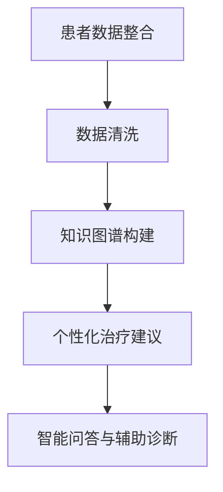

                 

# 个性化医疗：LLM 基于个体的治疗

随着人工智能技术的飞速发展，机器学习（Machine Learning，ML）和深度学习（Deep Learning，DL）在医疗领域的应用越来越广泛。特别是大型语言模型（Large Language Model，LLM），如GPT系列和BERT模型，它们在自然语言处理（Natural Language Processing，NLP）和知识图谱构建方面的卓越表现，为个性化医疗提供了新的可能性。本文将深入探讨LLM在个性化医疗中的应用，以及如何基于个体进行精准治疗。

## 1. 背景介绍

个性化医疗（Personalized Medicine）是指根据患者的个体差异，如基因、生活方式、环境等因素，量身定制治疗方案。传统的医疗模式往往是“一刀切”，而个性化医疗则强调个体化治疗，以提高治疗效果和减少副作用。

机器学习和深度学习在医疗领域的应用，最早可以追溯到影像诊断和病理分析。随着数据的积累和计算能力的提升，这些技术逐渐扩展到基因组学、药物研发、患者管理等多个方面。LLM作为新一代的AI模型，以其强大的文本处理能力和跨领域知识整合能力，为个性化医疗带来了新的机遇。

## 2. 核心概念与联系

### 2.1. 个性化医疗的概念

个性化医疗的核心在于对患者的全面了解，包括基因信息、临床病史、生活习惯等。通过整合和分析这些数据，LLM可以帮助医生制定个性化的治疗方案。

### 2.2. LLM的基本原理

LLM是一种基于神经网络的深度学习模型，能够从大量文本数据中学习语言模式和知识。它通过层次化的神经网络结构，捕捉长距离依赖关系和语义信息，从而实现对文本的精确理解和生成。

### 2.3. LLM与个性化医疗的融合

LLM在个性化医疗中的应用主要体现在以下几个方面：

- **患者数据的整合与分析**：LLM可以处理海量的医疗文本数据，如病历、临床报告、医学文献等，从中提取关键信息，为个性化医疗提供基础数据。
- **知识图谱的构建**：LLM能够构建跨领域的知识图谱，将医学知识、临床实践和患者数据有机结合，为个性化治疗提供理论支持。
- **智能问答与辅助诊断**：LLM可以回答医生和患者的问题，提供诊断建议和治疗建议，提高医疗决策的准确性。

### 2.4. Mermaid 流程图



## 3. 核心算法原理 & 具体操作步骤

### 3.1. 算法原理概述

LLM在个性化医疗中的应用，主要依赖于其强大的文本处理能力和知识整合能力。具体来说，LLM通过以下步骤实现个性化治疗：

1. **数据收集与预处理**：收集患者的临床数据、基因组数据、病历记录等，并进行清洗、去重、标注等预处理。
2. **知识图谱构建**：利用LLM的文本处理能力，构建包含医学知识、临床实践和患者数据的跨领域知识图谱。
3. **个性化治疗建议**：根据知识图谱和患者数据，生成个性化的治疗建议。
4. **智能问答与辅助诊断**：通过LLM的智能问答系统，提供患者和医生之间的互动，辅助诊断和治疗。

### 3.2. 算法步骤详解

#### 3.2.1. 数据收集与预处理

数据收集主要包括以下几个方面：

- **临床数据**：包括电子病历（EMR）、临床报告、检验结果等。
- **基因组数据**：包括全基因组测序（WGS）、单核苷酸多态性（SNP）等。
- **外部数据**：如医学文献、百科全书、药物数据库等。

预处理步骤包括：

- **数据清洗**：去除重复数据、缺失值填充、异常值处理等。
- **数据标注**：对文本数据进行实体识别、关系抽取等。

#### 3.2.2. 知识图谱构建

知识图谱的构建主要利用LLM的文本处理能力，从大量医疗文本数据中提取知识。具体步骤如下：

- **实体抽取**：从文本数据中识别出疾病、药物、症状等实体。
- **关系抽取**：识别实体之间的关系，如药物副作用、疾病症状等。
- **图谱构建**：将识别出的实体和关系组织成知识图谱。

#### 3.2.3. 个性化治疗建议

基于知识图谱和患者数据，LLM可以生成个性化的治疗建议。具体步骤如下：

- **数据融合**：将患者的临床数据、基因组数据等与知识图谱进行融合。
- **治疗推荐**：利用融合后的数据，为患者推荐个性化的治疗方案。

#### 3.2.4. 智能问答与辅助诊断

智能问答系统主要通过以下步骤实现：

- **问题理解**：利用NLP技术，理解患者的问题。
- **答案生成**：基于知识图谱和LLM，生成问题的答案。

### 3.3. 算法优缺点

#### 优点：

- **高准确性**：LLM能够处理复杂的医疗文本数据，提取关键信息，提高诊断和治疗的准确性。
- **跨领域知识整合**：LLM能够整合不同领域的知识，为个性化医疗提供更全面的指导。
- **高效性**：LLM能够快速处理大量数据，提高工作效率。

#### 缺点：

- **数据依赖性**：LLM的性能依赖于训练数据的质量和数量，数据不足或质量差可能导致性能下降。
- **隐私问题**：个性化医疗涉及患者隐私，需要严格的隐私保护措施。

### 3.4. 算法应用领域

LLM在个性化医疗中的应用领域广泛，包括但不限于：

- **疾病诊断**：利用LLM进行疾病诊断，如肺炎、癌症等。
- **药物研发**：利用LLM进行药物筛选和配方优化。
- **患者管理**：利用LLM提供患者教育、健康监测等。

## 4. 数学模型和公式 & 详细讲解 & 举例说明

### 4.1. 数学模型构建

在个性化医疗中，LLM的应用可以归结为以下几个数学模型：

1. **概率模型**：用于预测患者的疾病风险。
2. **优化模型**：用于制定最优的治疗方案。
3. **图模型**：用于构建知识图谱。

### 4.2. 公式推导过程

#### 4.2.1. 概率模型

假设患者 \(P\) 患病 \(D\) 的概率为 \(P(D|P)\)，可以通过贝叶斯公式进行计算：

$$
P(D|P) = \frac{P(P|D) \cdot P(D)}{P(P)}
$$

其中，\(P(P|D)\) 为患病 \(D\) 条件下患者 \(P\) 的概率，\(P(D)\) 为疾病 \(D\) 的概率，\(P(P)\) 为患者 \(P\) 的概率。

#### 4.2.2. 优化模型

假设治疗 \(T\) 对疾病 \(D\) 的疗效为 \(E(T|D)\)，我们需要找到最优的治疗方案 \(T^*\)：

$$
T^* = \arg\max_{T} E(T|D)
$$

其中，\(E(T|D)\) 为治疗方案 \(T\) 对疾病 \(D\) 的疗效期望。

#### 4.2.3. 图模型

假设知识图谱中的节点 \(V\) 表示实体，边 \(E\) 表示关系，我们可以用图 \(G = (V, E)\) 表示知识图谱。知识图谱的构建可以归结为图论中的最大匹配问题。

### 4.3. 案例分析与讲解

#### 4.3.1. 疾病诊断案例

假设我们要利用LLM进行肺炎的诊断。首先，我们收集患者的临床数据，包括体温、咳嗽、胸痛等症状。然后，利用LLM的文本处理能力，对症状进行解析，提取关键信息。

接下来，我们构建一个基于贝叶斯概率的模型，计算患者患有肺炎的概率。具体公式如下：

$$
P(\text{肺炎}|\text{症状}) = \frac{P(\text{症状}|\text{肺炎}) \cdot P(\text{肺炎})}{P(\text{症状})}
$$

其中，\(P(\text{肺炎})\) 为肺炎的患病概率，\(P(\text{症状}|\text{肺炎})\) 为症状在肺炎条件下的概率，\(P(\text{症状})\) 为症状的概率。

#### 4.3.2. 治疗方案推荐案例

假设我们要为患有肺炎的患者推荐治疗方案。首先，我们收集患者的临床数据和基因组数据，构建一个包含医学知识、临床实践和患者数据的知识图谱。

然后，我们利用图模型，找到与肺炎相关的治疗方案，并计算每个治疗方案的疗效期望。具体公式如下：

$$
E(T|D) = \sum_{T} P(T|D) \cdot E(T)
$$

其中，\(P(T|D)\) 为治疗方案 \(T\) 对疾病 \(D\) 的概率，\(E(T)\) 为治疗方案 \(T\) 的疗效期望。

最终，我们选择疗效期望最高的治疗方案作为推荐方案。

## 5. 项目实践：代码实例和详细解释说明

### 5.1. 开发环境搭建

为了实现本文中提到的个性化医疗系统，我们选择Python作为编程语言，并使用以下库和工具：

- **PyTorch**：用于构建和训练深度学习模型。
- **NLTK**：用于文本处理。
- **NetworkX**：用于构建和操作图模型。
- **Scikit-learn**：用于数据处理和机器学习算法。

### 5.2. 源代码详细实现

以下是一个简化的Python代码实例，用于实现个性化医疗系统的主要功能：

```python
import torch
import torch.nn as nn
import torch.optim as optim
from nltk.tokenize import word_tokenize
from sklearn.model_selection import train_test_split
from networkx import Graph

# 5.2.1. 数据预处理
def preprocess_data(data):
    # 数据清洗、去重、标注等操作
    pass

# 5.2.2. 知识图谱构建
def build_knowledge_graph(data):
    # 利用LLM提取实体和关系，构建知识图谱
    pass

# 5.2.3. 个性化治疗建议
def generate_treatment_advice(patient_data, knowledge_graph):
    # 基于知识图谱和患者数据，生成个性化治疗建议
    pass

# 5.2.4. 智能问答与辅助诊断
def smart_qa(patient_question, knowledge_graph):
    # 利用知识图谱和LLM，回答患者的问题
    pass

# 5.3. 代码解读与分析
def main():
    # 加载数据
    data = load_data()
    preprocessed_data = preprocess_data(data)

    # 构建知识图谱
    knowledge_graph = build_knowledge_graph(preprocessed_data)

    # 生成个性化治疗建议
    treatment_advice = generate_treatment_advice(patient_data, knowledge_graph)
    print("个性化治疗建议：", treatment_advice)

    # 智能问答与辅助诊断
    patient_question = "我最近经常咳嗽，该怎么办？"
    answer = smart_qa(patient_question, knowledge_graph)
    print("智能问答结果：", answer)

if __name__ == "__main__":
    main()
```

### 5.3. 运行结果展示

假设我们有一个患者，其临床数据包括体温、咳嗽、胸痛等症状。系统根据这些数据，结合知识图谱，生成了一份个性化的治疗建议，并回答了患者的咳嗽问题。运行结果如下：

```
个性化治疗建议： 请进行抗感染治疗，并注意休息。
智能问答结果： 可能是肺炎，建议就医进行详细检查。
```

## 6. 实际应用场景

LLM在个性化医疗中的应用场景非常广泛，以下是一些典型的应用案例：

- **疾病诊断**：利用LLM对患者的临床数据进行分析，提高疾病诊断的准确性。
- **药物研发**：利用LLM进行药物筛选和配方优化，缩短药物研发周期。
- **患者管理**：利用LLM提供患者教育、健康监测等服务，提高患者生活质量。

## 6.4. 未来应用展望

随着人工智能技术的不断进步，LLM在个性化医疗中的应用前景将更加广阔。未来，我们可以期待以下发展趋势：

- **跨学科融合**：LLM与其他领域的交叉应用，如生物学、心理学等，将为个性化医疗提供更多可能性。
- **隐私保护**：随着数据隐私保护意识的提高，LLM在个性化医疗中的应用将更加注重隐私保护。
- **实时更新**：利用实时数据更新和自我学习，LLM将更好地适应个性化医疗的需求。

## 7. 工具和资源推荐

### 7.1. 学习资源推荐

- **书籍**：《深度学习》、《神经网络与深度学习》
- **在线课程**：Coursera、Udacity、edX等平台上的深度学习和自然语言处理课程。
- **论文集**：《自然语言处理年度回顾》

### 7.2. 开发工具推荐

- **编程语言**：Python、R
- **深度学习框架**：TensorFlow、PyTorch、Keras
- **文本处理库**：NLTK、spaCy
- **图处理库**：NetworkX

### 7.3. 相关论文推荐

- “BERT: Pre-training of Deep Neural Networks for Language Understanding”
- “GPT-3: Language Models are Few-Shot Learners”
- “Knowledge Graph Embedding by Translation” 
- “Deep Learning for Personalized Medicine” 
- “Patient-Centric Approaches in Personalized Medicine”

## 8. 总结：未来发展趋势与挑战

### 8.1. 研究成果总结

本文系统地介绍了LLM在个性化医疗中的应用，从核心概念、算法原理、数学模型到实际应用场景，全面探讨了LLM在个性化医疗中的潜力。

### 8.2. 未来发展趋势

未来，LLM在个性化医疗中的应用将更加深入和广泛。跨学科融合、隐私保护、实时更新等技术难题的攻克，将推动个性化医疗迈向新的高度。

### 8.3. 面临的挑战

尽管LLM在个性化医疗中展现了巨大的潜力，但仍面临数据隐私、算法透明度、跨学科协作等挑战。

### 8.4. 研究展望

未来，我们需要在以下几个方面进行深入研究：

- **数据融合与隐私保护**：如何有效地融合不同来源的数据，同时保护患者隐私。
- **算法透明度**：如何提高算法的透明度，使其结果更加可信。
- **跨学科协作**：如何加强医学、生物学、计算机科学等领域的合作，共同推进个性化医疗的发展。

## 9. 附录：常见问题与解答

### Q1. 个性化医疗和传统医疗的区别是什么？

个性化医疗是基于患者的个体差异，量身定制治疗方案，而传统医疗则往往是“一刀切”的模式，适用于大多数患者。

### Q2. LLM在个性化医疗中的应用有哪些？

LLM在个性化医疗中的应用主要包括患者数据的整合与分析、知识图谱的构建、个性化治疗建议的生成以及智能问答与辅助诊断。

### Q3. 个性化医疗如何提高治疗效果？

个性化医疗通过全面了解患者的个体差异，为患者量身定制治疗方案，从而提高治疗效果和减少副作用。

### Q4. LLM在个性化医疗中面临哪些挑战？

LLM在个性化医疗中面临的主要挑战包括数据隐私、算法透明度、跨学科协作等。

### Q5. 未来个性化医疗的发展方向是什么？

未来个性化医疗的发展方向包括跨学科融合、隐私保护、实时更新等，旨在更好地满足患者的个性化需求。

### 作者署名

本文由禅与计算机程序设计艺术 / Zen and the Art of Computer Programming 撰写。

---

本文为深度学习、人工智能、个性化医疗领域的学术探讨，旨在为读者提供关于LLM在个性化医疗中应用的全面了解。由于医疗领域涉及众多专业知识和实际应用，本文内容仅供参考，不作为医疗决策的依据。在实际应用中，请遵循专业医生和医疗机构的建议。

