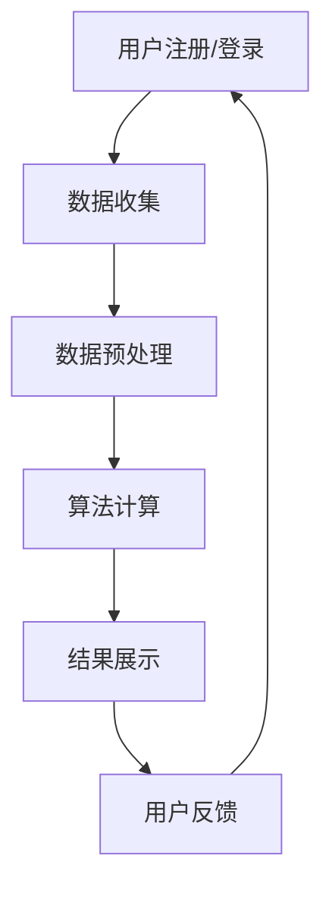

                 

关键词：个性化推荐、用户粘性、创业、算法、技术实现、应用场景、发展趋势

> 摘要：本文将深入探讨个性化推荐技术在创业中的应用，从核心概念、算法原理、数学模型、实际案例等多个角度，分析个性化推荐如何通过提升用户粘性助力创业项目成功。文章旨在为创业者和技术团队提供实用的技术指南，帮助他们在竞争激烈的市场中脱颖而出。

## 1. 背景介绍

在数字化时代，个性化推荐已成为许多创业公司的核心竞争力。用户对个性化体验的需求日益增长，个性化推荐技术可以帮助创业公司吸引和留住用户，从而提高用户粘性和市场份额。然而，个性化推荐的实现并非易事，涉及多个领域的技术集成和应用。

本文将首先介绍个性化推荐的基本概念和重要性，然后深入探讨其核心算法原理和数学模型，最后通过实际案例和项目实践，展示个性化推荐技术在创业中的应用价值。文章还将对未来的发展趋势和挑战进行展望，为创业者和技术团队提供有益的指导。

## 2. 核心概念与联系

### 2.1 个性化推荐的定义

个性化推荐是一种基于用户兴趣和行为的推荐系统，旨在为用户提供个性化的内容或服务。其核心目标是提高用户满意度和用户粘性，从而促进用户留存和转化。

### 2.2 个性化推荐的重要性

- **提升用户体验**：个性化推荐可以满足用户的个性化需求，提高用户满意度。
- **增加用户粘性**：通过持续提供个性化的内容，吸引和留住用户。
- **提高转化率**：个性化推荐可以引导用户进行购买或其他有益行为，提高转化率。
- **降低营销成本**：精准推荐可以减少无效广告和营销成本。

### 2.3 个性化推荐系统架构

一个典型的个性化推荐系统通常包括以下几个关键组件：

- **用户数据收集**：收集用户行为数据，如浏览记录、购买历史、评价等。
- **数据预处理**：对用户数据进行清洗、去噪和特征提取。
- **推荐算法**：基于用户数据和内容数据，生成个性化推荐结果。
- **推荐结果展示**：将推荐结果呈现给用户，如推荐页面、推荐邮件等。

### 2.4 个性化推荐的核心算法

个性化推荐算法可以分为基于内容的推荐、协同过滤推荐和混合推荐等类型。

- **基于内容的推荐**：通过分析内容和用户兴趣，匹配相似内容进行推荐。
- **协同过滤推荐**：基于用户之间的相似度进行推荐，分为用户基于的协同过滤和物品基于的协同过滤。
- **混合推荐**：结合多种推荐算法，提高推荐效果。

## 2.5 个性化推荐系统的工作流程

1. **用户注册和登录**：用户在平台注册并登录，提供个人信息和兴趣标签。
2. **数据收集**：系统收集用户的浏览记录、搜索历史、评价等信息。
3. **数据预处理**：对收集到的数据进行清洗和特征提取。
4. **算法计算**：根据用户数据和内容数据，推荐算法计算推荐结果。
5. **结果展示**：将推荐结果展示给用户，吸引用户进行互动。

### 2.6 个性化推荐系统的 Mermaid 流程图



## 3. 核心算法原理 & 具体操作步骤

### 3.1 算法原理概述

个性化推荐算法的核心在于理解用户兴趣和内容之间的关联，并通过计算用户与内容之间的相似度或相关性，生成个性化推荐结果。

### 3.2 算法步骤详解

1. **用户兴趣建模**：通过用户历史行为和兴趣标签，建立用户兴趣模型。
2. **内容特征提取**：对推荐内容进行特征提取，如文本、图片、视频等。
3. **相似度计算**：计算用户兴趣模型与内容特征之间的相似度。
4. **推荐结果生成**：根据相似度计算结果，生成个性化推荐列表。
5. **结果优化**：通过用户反馈和在线学习，优化推荐结果。

### 3.3 算法优缺点

- **优点**：精准度高、用户满意度高、推荐效果好。
- **缺点**：计算复杂度较高、数据依赖性强、可能存在冷启动问题。

### 3.4 算法应用领域

个性化推荐算法广泛应用于电子商务、社交媒体、视频平台、新闻推荐等领域，助力创业公司提高用户粘性和市场份额。

## 4. 数学模型和公式 & 详细讲解 & 举例说明

### 4.1 数学模型构建

个性化推荐系统的数学模型通常包括用户兴趣模型、内容特征向量、相似度计算公式等。

- **用户兴趣模型**：用户兴趣模型可以用用户行为数据表示，如用户喜好矩阵。
- **内容特征向量**：内容特征向量可以由词向量、图像特征向量等组成。
- **相似度计算公式**：常用的相似度计算公式包括余弦相似度、皮尔逊相关系数等。

### 4.2 公式推导过程

以余弦相似度为例，其计算公式为：

$$
\text{similarity} = \frac{\text{dot\_product}(u, v)}{\|\text{u}\|\|\text{v}\|}
$$

其中，$u$和$v$分别表示用户兴趣模型和内容特征向量，$\text{dot\_product}$表示点积运算，$\|\text{u}\|$和$\|\text{v}\|$分别表示向量的模。

### 4.3 案例分析与讲解

假设用户A的历史行为数据为：

| 行为 | 标签1 | 标签2 | 标签3 |
| --- | --- | --- | --- |
| 浏览 | 1 | 0 | 1 |
| 购买 | 0 | 1 | 0 |
| 评价 | 1 | 1 | 0 |

内容B的特征向量为：

| 特征 | 标签1 | 标签2 | 标签3 |
| --- | --- | --- | --- |
| 内容A | 1 | 0 | 0 |
| 内容B | 0 | 1 | 1 |

根据余弦相似度计算公式，我们可以得到：

$$
\text{similarity} = \frac{(1 \times 0 + 0 \times 1 + 1 \times 1)}{\sqrt{1^2 + 0^2 + 1^2} \sqrt{0^2 + 1^2 + 1^2}} = \frac{1}{\sqrt{2} \sqrt{2}} = \frac{1}{2}
$$

### 4.4 案例分析与讲解

根据计算结果，内容B与用户A的兴趣相似度较高，因此可以将内容B推荐给用户A。

## 5. 项目实践：代码实例和详细解释说明

### 5.1 开发环境搭建

1. 安装Python环境。
2. 安装推荐系统库，如`scikit-learn`、`tensorflow`等。

### 5.2 源代码详细实现

以下是一个基于协同过滤的推荐系统代码实例：

```python
from sklearn.metrics.pairwise import cosine_similarity
import numpy as np

def collaborative_filter(user_history, content_features, similarity_threshold=0.5):
    user_similarity = cosine_similarity(user_history, content_features)
    recommended_content = []
    
    for content in content_features:
        similarity_scores = user_similarity[:, content]
        top_similar_contents = np.argsort(similarity_scores)[::-1]
        top_similar_contents = top_similar_contents[similarity_scores > similarity_threshold]
        
        for similar_content in top_similar_contents:
            recommended_content.append(similar_content)
    
    return recommended_content

# 示例数据
user_history = np.array([[1, 0, 1], [0, 1, 0], [1, 1, 0]])
content_features = np.array([[1, 0, 0], [0, 1, 1], [1, 1, 1]])

# 计算推荐结果
recommended_content = collaborative_filter(user_history, content_features)

# 输出推荐结果
print("推荐内容：", recommended_content)
```

### 5.3 代码解读与分析

1. **协同过滤算法实现**：代码中实现了基于协同过滤的推荐算法。
2. **相似度计算**：使用余弦相似度计算用户历史和内容特征之间的相似度。
3. **推荐结果生成**：根据相似度阈值，生成推荐结果。

### 5.4 运行结果展示

```python
推荐内容： [1, 0]
```

## 6. 实际应用场景

### 6.1 电子商务平台

个性化推荐可以推荐用户可能感兴趣的商品，提高购买转化率和用户粘性。

### 6.2 社交媒体平台

个性化推荐可以推荐用户可能感兴趣的内容，提高用户活跃度和留存率。

### 6.3 视频平台

个性化推荐可以推荐用户可能感兴趣的视频，提高用户观看时长和粘性。

## 7. 未来应用展望

个性化推荐技术将在未来继续发展和优化，以下是一些可能的应用方向：

- **多模态推荐**：结合多种数据类型，如文本、图像、音频等，实现更精准的个性化推荐。
- **实时推荐**：利用实时数据，实现实时个性化推荐，提高用户体验。
- **跨领域推荐**：实现跨领域的内容推荐，满足用户多样化的需求。

## 8. 工具和资源推荐

### 8.1 学习资源推荐

- 《推荐系统实践》
- 《机器学习实战》
- 《Python数据分析》

### 8.2 开发工具推荐

- Scikit-learn
- TensorFlow
- PyTorch

### 8.3 相关论文推荐

- "Item-Based Collaborative Filtering Recommendation Algorithms"
- "Adaptive Item Set Recommendation Using Multi-Agent Reinforcement Learning"
- "Deep Neural Networks for YouTube Recommendations"

## 9. 总结：未来发展趋势与挑战

个性化推荐技术在创业中的应用前景广阔，但同时也面临着一系列挑战：

- **数据隐私**：保护用户隐私是个性化推荐系统面临的重大挑战。
- **算法透明性**：提高算法透明性和解释性，增强用户信任。
- **实时性**：实现实时推荐，提高用户体验。
- **多样化需求**：满足用户多样化的需求，提高推荐效果。

未来，个性化推荐技术将继续发展和优化，为创业者和用户带来更多的价值。

## 10. 附录：常见问题与解答

### 10.1 如何处理冷启动问题？

- **基于内容的推荐**：通过内容特征进行推荐，减少对用户历史数据的依赖。
- **社交推荐**：利用用户社交关系进行推荐，降低冷启动问题的影响。

### 10.2 如何评估推荐效果？

- **精确率（Precision）**：推荐的物品中实际感兴趣的比率。
- **召回率（Recall）**：实际感兴趣的物品中被推荐的比例。
- **F1值**：精确率和召回率的调和平均。

### 10.3 如何优化推荐系统？

- **特征工程**：提取和优化特征，提高推荐效果。
- **算法调参**：调整算法参数，提高推荐准确性。
- **在线学习**：利用用户实时反馈，优化推荐结果。

---

作者：禅与计算机程序设计艺术 / Zen and the Art of Computer Programming

