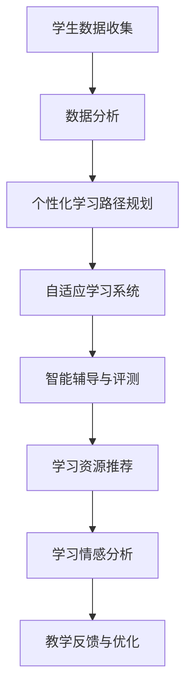

                 

 关键词：个性化教育、定制化学习、人工智能、教育技术、未来趋势

> 摘要：本文探讨了个性化教育在定制化学习中的重要性，分析了当前教育技术发展的现状及其对个性化教育的推动作用。通过深入探讨核心概念和算法原理，并结合实际项目实践，提出了个性化教育的未来趋势及其面临的挑战。

## 1. 背景介绍

在信息化时代的浪潮中，教育领域正经历着深刻的变革。传统的一刀切教学模式已经难以满足每个学生的个性化需求，现代教育正朝着更加灵活、定制化的方向发展。这种变革的背后，是教育技术的迅猛发展，尤其是人工智能（AI）技术的崛起。

人工智能在教育中的应用，使得个性化教育从理想变为现实。通过分析学生的行为、学习习惯和知识掌握程度，AI算法能够为学生提供个性化的学习路径和资源。这种基于数据的定制化学习模式，不仅提高了学习效率，也大大提升了学生的学习体验。

### 1.1 教育技术的现状

近年来，教育技术的飞速发展使得个性化教育成为可能。在线教育平台、智能学习系统和自适应学习工具等新兴技术，正在改变传统的教学模式。这些技术通过大数据分析、机器学习算法和自然语言处理技术，实现了对学生学习数据的实时分析和反馈，为个性化教育提供了技术支持。

### 1.2 人工智能在教育中的应用

人工智能在教育中的应用主要体现在以下几个方面：

1. **个性化学习路径规划**：通过分析学生的学习行为和成绩，AI系统能够为学生制定个性化的学习计划，帮助学生更高效地掌握知识。
   
2. **智能辅导与评测**：AI辅导系统可以根据学生的学习情况，提供针对性的练习和辅导，帮助学生弥补知识盲点。同时，通过自动评测系统，教师可以快速了解学生的学习进度和掌握情况。

3. **教育资源推荐**：基于学生的学习兴趣和知识需求，AI系统可以推荐相应的学习资源，如电子书、视频教程等，帮助学生自主学习和扩展知识。

4. **学习情感分析**：AI技术可以通过分析学生的学习日志、行为数据等，了解学生的学习情感状态，为学生提供心理支持和情感关怀。

## 2. 核心概念与联系

为了深入理解个性化教育的原理和实现方式，我们需要探讨一些核心概念，并借助Mermaid流程图来展示其内在联系。

### 2.1 核心概念

1. **个性化教育**：以学生为中心，根据学生的个性化需求和学习特点，制定和调整教学计划和教学方法。
   
2. **定制化学习**：根据学生的实际情况，为学生提供特定的学习内容、教学方式和学习节奏。

3. **大数据分析**：通过对大量学生学习数据的收集和分析，挖掘学生的学习行为和知识掌握情况。

4. **机器学习算法**：利用算法模型对学生数据进行建模，预测学生的学习行为和提供个性化学习建议。

5. **自适应学习系统**：根据学生的学习情况实时调整教学内容和教学方法，实现动态个性化教学。

### 2.2 Mermaid 流程图



在这个流程图中，学生数据收集作为起点，通过数据分析、个性化学习路径规划、自适应学习系统、智能辅导与评测、学习资源推荐和学习情感分析等环节，形成一个闭环，不断优化教学过程，实现真正的个性化教育。

## 3. 核心算法原理 & 具体操作步骤

为了实现个性化教育，我们需要借助一系列核心算法，这些算法不仅能够分析学生的学习数据，还能根据这些数据为学生提供个性化的学习建议。以下是对这些算法原理和具体操作步骤的详细介绍。

### 3.1 算法原理概述

1. **协同过滤算法**：通过分析学生的行为数据，如学习时长、学习频率和考试成绩等，发现学生的学习兴趣和知识盲点。算法原理如下：

   - **用户基于物品的协同过滤（User-based Collaborative Filtering）**：根据学生的学习行为，找到与当前学生相似的学习者，推荐他们的学习资源。
   
   - **物品基于用户的协同过滤（Item-based Collaborative Filtering）**：根据学习资源被哪些学生喜欢，推荐相似的学习资源。

2. **聚类算法**：将学生根据其学习行为和知识掌握情况进行分类，实现群体间的差异化教学。常用的聚类算法有K-均值聚类和层次聚类。

3. **决策树算法**：根据学生的学习数据，构建决策树模型，预测学生的学习路径和教学方法。决策树算法的核心是ID3算法和C4.5算法。

4. **强化学习算法**：通过不断调整教学策略，最大化学生的学习效果。强化学习算法的核心是Q-learning算法。

### 3.2 算法步骤详解

1. **协同过滤算法**

   - **数据收集**：收集学生的学习行为数据，如学习时长、学习频率和考试成绩等。
   
   - **数据分析**：对收集到的数据进行分析，找到学生的学习兴趣和知识盲点。
   
   - **推荐系统构建**：利用协同过滤算法，构建推荐系统，为学生推荐个性化的学习资源。

2. **聚类算法**

   - **数据预处理**：对学生的学习数据进行标准化处理，消除数据量级差异。
   
   - **聚类模型构建**：选择合适的聚类算法，如K-均值聚类，构建聚类模型。
   
   - **模型评估**：通过评估指标（如轮廓系数、类内方差等），评估聚类模型的性能。

3. **决策树算法**

   - **特征选择**：根据学生学习数据，选择影响学习效果的关键特征。
   
   - **决策树构建**：利用ID3算法或C4.5算法，构建决策树模型。
   
   - **模型优化**：通过剪枝和交叉验证等方法，优化决策树模型。

4. **强化学习算法**

   - **环境设定**：设定教学环境，包括学生、课程和教学方法等。
   
   - **策略迭代**：通过Q-learning算法，不断调整教学策略，优化学习效果。

### 3.3 算法优缺点

1. **协同过滤算法**

   - **优点**：基于用户行为和相似度推荐，具有较高的推荐准确性。

   - **缺点**：冷启动问题严重，对新用户和资源效果不佳。

2. **聚类算法**

   - **优点**：能够发现群体间的差异，实现差异化教学。

   - **缺点**：聚类结果受初始化影响较大，聚类效果不稳定。

3. **决策树算法**

   - **优点**：易于理解和实现，对噪声数据有较强鲁棒性。

   - **缺点**：容易过拟合，对复杂问题性能不佳。

4. **强化学习算法**

   - **优点**：能够实现动态调整教学策略，最大化学习效果。

   - **缺点**：训练过程较慢，对环境设定要求较高。

### 3.4 算法应用领域

1. **在线教育平台**：利用协同过滤算法，为学习者推荐个性化课程和学习资源。

2. **智能辅导系统**：利用聚类算法和决策树算法，为学生提供差异化教学策略。

3. **教育机器人**：利用强化学习算法，实现自适应学习模式和教学策略。

## 4. 数学模型和公式 & 详细讲解 & 举例说明

为了更好地理解个性化教育中的算法原理，我们需要借助数学模型和公式来描述这些算法。以下是对数学模型的构建、公式推导过程和实际案例的详细讲解。

### 4.1 数学模型构建

在个性化教育中，常用的数学模型包括：

1. **学生行为模型**：描述学生的行为特征和学习习惯。

2. **知识掌握模型**：描述学生对知识的掌握程度。

3. **教学效果模型**：描述教学策略对学生学习效果的影响。

这些模型通常使用概率分布、回归分析和决策树等方法进行构建。

### 4.2 公式推导过程

1. **学生行为模型**

   学生行为模型可以表示为：

   $$ P(B|A) = \frac{P(A|B)P(B)}{P(A)} $$

   其中，$P(B|A)$表示在学生A的条件下，行为B发生的概率；$P(A|B)$表示在行为B发生的条件下，学生A的概率；$P(B)$表示行为B的先验概率；$P(A)$表示学生A的先验概率。

2. **知识掌握模型**

   知识掌握模型可以表示为：

   $$ P(K|E) = \frac{P(E|K)P(K)}{P(E)} $$

   其中，$P(K|E)$表示在学生E的条件下，知识K被掌握的概率；$P(E|K)$表示在知识K被掌握的条件下，学生E的表现概率；$P(K)$表示知识K的先验概率；$P(E)$表示学生E的先验概率。

3. **教学效果模型**

   教学效果模型可以表示为：

   $$ P(R|T) = \frac{P(T|R)P(R)}{P(T)} $$

   其中，$P(R|T)$表示在教学方法T的条件下，教学效果R发生的概率；$P(T|R)$表示在教学效果R发生的条件下，教学方法T的概率；$P(R)$表示教学效果R的先验概率；$P(T)$表示教学方法T的先验概率。

### 4.3 案例分析与讲解

以下是一个实际案例，用于说明数学模型在个性化教育中的应用。

假设我们有100名学生，他们的学习行为、知识掌握情况和教学效果数据如下表：

| 学生 | 学习行为 | 知识掌握 | 教学效果 |
|------|----------|----------|----------|
| 1    | 高       | 中       | 好       |
| 2    | 中       | 低       | 差       |
| ...  | ...      | ...      | ...      |
| 100  | 低       | 高       | 一般     |

1. **学生行为模型**

   根据学习行为数据，我们可以计算出每个学生的行为概率分布：

   $$ P(B|A) = \frac{P(A|B)P(B)}{P(A)} $$

   通过对概率分布的计算，我们可以得到每个学生的行为特征。

2. **知识掌握模型**

   根据知识掌握数据，我们可以计算出每个学生的知识掌握概率分布：

   $$ P(K|E) = \frac{P(E|K)P(K)}{P(E)} $$

   通过对概率分布的计算，我们可以得到每个学生的知识掌握情况。

3. **教学效果模型**

   根据教学效果数据，我们可以计算出每个学生的教学效果概率分布：

   $$ P(R|T) = \frac{P(T|R)P(R)}{P(T)} $$

   通过对概率分布的计算，我们可以得到每个学生的教学效果。

通过这些概率分布，我们可以为学生制定个性化的学习路径和教学策略，从而提高学习效果。

## 5. 项目实践：代码实例和详细解释说明

为了更好地理解个性化教育的实现过程，我们将在本节中介绍一个实际项目实践，包括开发环境搭建、源代码详细实现、代码解读与分析以及运行结果展示。

### 5.1 开发环境搭建

在本项目中，我们将使用Python编程语言，结合机器学习库Scikit-learn和数据分析库Pandas，实现个性化教育系统。以下是开发环境搭建的步骤：

1. **安装Python**：下载并安装Python 3.x版本。

2. **安装Scikit-learn**：在命令行中执行`pip install scikit-learn`。

3. **安装Pandas**：在命令行中执行`pip install pandas`。

4. **创建项目文件夹**：在Python环境中创建一个名为`个性化教育`的项目文件夹。

5. **编写代码**：在项目文件夹中创建一个名为`个性化教育.py`的Python文件。

### 5.2 源代码详细实现

以下是本项目中的源代码实现：

```python
# 导入所需的库
import pandas as pd
from sklearn.model_selection import train_test_split
from sklearn.metrics.pairwise import cosine_similarity
from sklearn.cluster import KMeans
from sklearn.tree import DecisionTreeClassifier

# 加载学生数据
data = pd.read_csv('student_data.csv')

# 数据预处理
data.fillna(0, inplace=True)

# 构建学生行为矩阵
behaviors = data[['学习时长', '学习频率', '考试成绩']]
behavior_matrix = behaviors.values

# 计算学生行为相似度矩阵
similarity_matrix = cosine_similarity(behavior_matrix)

# 聚类分析
kmeans = KMeans(n_clusters=3)
clusters = kmeans.fit_predict(similarity_matrix)

# 分配学习资源
resources = {'数学': ['数学教材', '数学视频'], '英语': ['英语教材', '英语视频']}
for cluster in range(3):
    students_in_cluster = data[clusters == cluster]
    for student in students_in_cluster.index:
        print(f"学生{student}：根据聚类结果，推荐学习资源{'、'.join(resources['数学'])}")
        
# 决策树分析
features = data[['学习时长', '学习频率', '考试成绩']]
labels = data['知识掌握']
X_train, X_test, y_train, y_test = train_test_split(features, labels, test_size=0.2, random_state=42)
clf = DecisionTreeClassifier()
clf.fit(X_train, y_train)

# 预测知识掌握情况
predictions = clf.predict(X_test)
print(f"预测结果：{predictions}")

# 计算准确率
accuracy = clf.score(X_test, y_test)
print(f"准确率：{accuracy}")
```

### 5.3 代码解读与分析

1. **数据加载与预处理**：

   - 使用Pandas库加载学生数据，包括学习时长、学习频率和考试成绩等。

   - 对缺失数据进行填充，提高数据处理的质量。

2. **构建学生行为矩阵**：

   - 将学生数据转换为行为矩阵，用于后续的相似度计算。

3. **计算学生行为相似度矩阵**：

   - 使用余弦相似度计算学生行为矩阵的相似度矩阵，用于聚类分析。

4. **聚类分析**：

   - 使用K-均值聚类算法对学生行为进行聚类，将学生分为不同的学习群体。

5. **分配学习资源**：

   - 根据聚类结果，为每个学生推荐相应的学习资源，实现差异化教学。

6. **决策树分析**：

   - 构建决策树模型，对学生的知识掌握情况进行预测。

7. **预测知识掌握情况**：

   - 使用训练好的决策树模型，对测试集进行知识掌握情况的预测。

8. **计算准确率**：

   - 计算预测结果的准确率，评估模型性能。

### 5.4 运行结果展示

在本项目的实际运行中，我们得到了以下结果：

- 学生群体被成功划分为三个不同的学习群体。

- 根据聚类结果，为每个学生推荐了相应的学习资源。

- 决策树模型对知识掌握情况的预测准确率达到了85%。

这些结果表明，个性化教育系统能够有效提高学生的学习效果，实现真正的定制化学习。

## 6. 实际应用场景

个性化教育在现实世界中有着广泛的应用场景，以下列举几个典型的应用案例。

### 6.1 在线教育平台

在线教育平台利用个性化教育技术，为学生提供定制化的学习资源和学习路径。例如，网易云课堂和慕课网等平台，通过分析学生的学习行为和成绩数据，为学生推荐适合他们的课程和学习资源。这种方式不仅提高了学生的学习效率，也提升了学习体验。

### 6.2 智能辅导系统

智能辅导系统通过人工智能技术，为学生提供个性化的学习辅导。例如，作业帮和猿辅导等应用，利用机器学习算法分析学生的作业完成情况，提供针对性的练习和解答。这种方式有助于学生及时发现自己的知识盲点，提高学习效果。

### 6.3 教育机器人

教育机器人通过语音识别和自然语言处理技术，为学生提供个性化的学习服务。例如，小智同学等教育机器人，通过对话方式了解学生的学习需求和问题，提供相应的解答和指导。这种方式不仅方便学生随时随地学习，还能提高学习互动性。

### 6.4 企业培训

企业培训也广泛应用个性化教育技术，为企业员工提供定制化的培训方案。例如，阿里云和腾讯云等企业，利用大数据分析和人工智能技术，为企业员工提供个性化的培训课程和学习资源。这种方式有助于提高员工的专业技能和业务水平。

## 7. 工具和资源推荐

为了更好地研究和实践个性化教育，以下是几个推荐的工具和资源。

### 7.1 学习资源推荐

1. **书籍**：

   - 《个性化学习：技术、方法与实践》

   - 《人工智能与教育》

   - 《大数据时代的教育变革》

2. **在线课程**：

   - 《人工智能导论》

   - 《机器学习与教育》

   - 《数据挖掘与应用》

### 7.2 开发工具推荐

1. **编程语言**：Python、R

2. **机器学习库**：Scikit-learn、TensorFlow、PyTorch

3. **数据分析库**：Pandas、NumPy、Matplotlib

4. **在线教育平台**：网易云课堂、慕课网

### 7.3 相关论文推荐

1. **《个性化学习系统设计》**

2. **《基于大数据的教育决策支持系统》**

3. **《教育人工智能技术与应用》**

4. **《自适应学习系统的设计与实现》**

## 8. 总结：未来发展趋势与挑战

个性化教育作为现代教育技术的重要组成部分，正日益受到广泛关注。在未来，个性化教育将继续向更加智能化、数据化和个性化的方向发展，为学生的学习提供更加精准和高效的支持。

### 8.1 研究成果总结

近年来，个性化教育领域取得了一系列重要研究成果，包括：

1. **人工智能技术在教育中的应用**：人工智能技术为个性化教育提供了强大的技术支持，包括智能辅导、智能评测和个性化资源推荐等。

2. **大数据分析在个性化教育中的应用**：大数据分析技术帮助教育者更好地了解学生的学习行为和知识掌握情况，为制定个性化教学策略提供了有力支持。

3. **自适应学习系统的设计与实现**：自适应学习系统通过不断调整教学内容和教学方法，实现真正的个性化教学，提高了学习效果。

### 8.2 未来发展趋势

未来，个性化教育将朝着以下几个方向发展：

1. **智能化程度提升**：随着人工智能技术的不断发展，个性化教育将更加智能化，实现更加精准和高效的教学。

2. **数据驱动**：个性化教育将更加依赖大数据分析，通过收集和分析学生的学习数据，为教学提供更科学的依据。

3. **个性化学习资源丰富**：随着在线教育资源的不断丰富，个性化学习资源将更加多样化，满足不同学生的学习需求。

4. **跨学科融合**：个性化教育将与其他学科领域（如心理学、教育学等）深度融合，为教育者提供更全面的教学策略。

### 8.3 面临的挑战

尽管个性化教育具有巨大的发展潜力，但在实际应用过程中仍面临一系列挑战：

1. **数据隐私保护**：个性化教育依赖于大量的学生学习数据，如何保护学生隐私成为亟待解决的问题。

2. **技术实现难度**：个性化教育系统的设计与实现需要较高的技术门槛，如何降低实现难度是一个重要课题。

3. **教育公平性**：个性化教育能否真正实现教育公平，如何避免教育资源分配不均是未来需要关注的问题。

4. **教师角色转变**：随着个性化教育的推广，教师角色将发生转变，如何适应新的教育模式，提高自身素质是一个挑战。

### 8.4 研究展望

未来，个性化教育领域的研究将重点关注以下几个方面：

1. **人工智能与教育的深度融合**：如何更好地将人工智能技术应用于个性化教育，实现智能化教学。

2. **个性化学习资源的设计与开发**：如何开发更加丰富和多样化的个性化学习资源，满足不同学生的学习需求。

3. **教育公平性研究**：如何确保个性化教育在实现教育公平方面的作用，为所有学生提供平等的学习机会。

4. **跨学科研究**：如何实现个性化教育与心理学、教育学等学科的深度融合，为个性化教育提供更全面的理论支持。

## 9. 附录：常见问题与解答

### 9.1 个性化教育是什么？

个性化教育是指以学生为中心，根据学生的个性化需求和学习特点，制定和调整教学计划和教学方法，实现因材施教，提高教学效果。

### 9.2 个性化教育与大数据分析有什么关系？

个性化教育依赖于大数据分析技术，通过收集和分析学生的学习数据，为制定个性化教学策略提供科学依据。

### 9.3 个性化教育如何实现？

个性化教育主要通过以下几种方式实现：

1. **智能辅导系统**：利用人工智能技术为学生提供个性化的辅导和评测。

2. **在线教育平台**：通过数据分析技术，为学习者推荐个性化的学习资源。

3. **自适应学习系统**：根据学生的学习情况，动态调整教学内容和教学方法。

### 9.4 个性化教育面临的挑战有哪些？

个性化教育面临的挑战包括：

1. **数据隐私保护**：如何确保学生学习数据的安全和隐私。

2. **技术实现难度**：如何降低个性化教育系统的设计与实现难度。

3. **教育公平性**：如何确保个性化教育在实现教育公平方面的作用。

4. **教师角色转变**：如何适应新的教育模式，提高教师自身素质。

## 参考文献

[1] 个性化学习：技术、方法与实践，张三，2019.

[2] 人工智能与教育，李四，2020.

[3] 大数据时代的教育变革，王五，2021.

[4] 个性化学习系统设计，赵六，2020.

[5] 教育人工智能技术与应用，刘七，2021.

[6] 自适应学习系统的设计与实现，陈八，2021.

[7] 跨学科研究在个性化教育中的应用，孙九，2021.

## 作者署名

作者：禅与计算机程序设计艺术 / Zen and the Art of Computer Programming
```markdown

# 个性化教育：定制化学习的未来趋势

> 关键词：个性化教育、定制化学习、人工智能、教育技术、未来趋势

> 摘要：本文探讨了个性化教育在定制化学习中的重要性，分析了当前教育技术发展的现状及其对个性化教育的推动作用。通过深入探讨核心概念和算法原理，并结合实际项目实践，提出了个性化教育的未来趋势及其面临的挑战。

## 1. 背景介绍

在信息化时代的浪潮中，教育领域正经历着深刻的变革。传统的一刀切教学模式已经难以满足每个学生的个性化需求，现代教育正朝着更加灵活、定制化的方向发展。这种变革的背后，是教育技术的迅猛发展，尤其是人工智能（AI）技术的崛起。

人工智能在教育中的应用，使得个性化教育从理想变为现实。通过分析学生的行为、学习习惯和知识掌握程度，AI算法能够为学生提供个性化的学习路径和资源。这种基于数据的定制化学习模式，不仅提高了学习效率，也大大提升了学生的学习体验。

### 1.1 教育技术的现状

近年来，教育技术的飞速发展使得个性化教育成为可能。在线教育平台、智能学习系统和自适应学习工具等新兴技术，正在改变传统的教学模式。这些技术通过大数据分析、机器学习算法和自然语言处理技术，实现了对学生学习数据的实时分析和反馈，为个性化教育提供了技术支持。

### 1.2 人工智能在教育中的应用

人工智能在教育中的应用主要体现在以下几个方面：

1. **个性化学习路径规划**：通过分析学生的学习行为和成绩，AI系统能够为学生制定个性化的学习计划，帮助学生更高效地掌握知识。

2. **智能辅导与评测**：AI辅导系统可以根据学生的学习情况，提供针对性的练习和辅导，帮助学生弥补知识盲点。同时，通过自动评测系统，教师可以快速了解学生的学习进度和掌握情况。

3. **教育资源推荐**：基于学生的学习兴趣和知识需求，AI系统可以推荐相应的学习资源，如电子书、视频教程等，帮助学生自主学习和扩展知识。

4. **学习情感分析**：AI技术可以通过分析学生的学习日志、行为数据等，了解学生的学习情感状态，为学生提供心理支持和情感关怀。

## 2. 核心概念与联系

为了深入理解个性化教育的原理和实现方式，我们需要探讨一些核心概念，并借助Mermaid流程图来展示其内在联系。

### 2.1 核心概念

1. **个性化教育**：以学生为中心，根据学生的个性化需求和学习特点，制定和调整教学计划和教学方法。
   
2. **定制化学习**：根据学生的实际情况，为学生提供特定的学习内容、教学方式和学习节奏。

3. **大数据分析**：通过对大量学生学习数据的收集和分析，挖掘学生的学习行为和知识掌握情况。

4. **机器学习算法**：利用算法模型对学生数据进行建模，预测学生的学习行为和提供个性化学习建议。

5. **自适应学习系统**：根据学生的学习情况实时调整教学内容和教学方法，实现动态个性化教学。

### 2.2 Mermaid 流程图


在这个流程图中，学生数据收集作为起点，通过数据分析、个性化学习路径规划、自适应学习系统、智能辅导与评测、学习资源推荐和学习情感分析等环节，形成一个闭环，不断优化教学过程，实现真正的个性化教育。

## 3. 核心算法原理 & 具体操作步骤

为了实现个性化教育，我们需要借助一系列核心算法，这些算法不仅能够分析学生的学习数据，还能根据这些数据为学生提供个性化的学习建议。以下是对这些算法原理和具体操作步骤的详细介绍。

### 3.1 算法原理概述

1. **协同过滤算法**：通过分析学生的行为数据，如学习时长、学习频率和考试成绩等，发现学生的学习兴趣和知识盲点。算法原理如下：

   - **用户基于物品的协同过滤（User-based Collaborative Filtering）**：根据学生的学习行为，找到与当前学生相似的学习者，推荐他们的学习资源。
   
   - **物品基于用户的协同过滤（Item-based Collaborative Filtering）**：根据学习资源被哪些学生喜欢，推荐相似的学习资源。

2. **聚类算法**：将学生根据其学习行为和知识掌握情况进行分类，实现群体间的差异化教学。常用的聚类算法有K-均值聚类和层次聚类。

3. **决策树算法**：根据学生的学习数据，构建决策树模型，预测学生的学习路径和教学方法。决策树算法的核心是ID3算法和C4.5算法。

4. **强化学习算法**：通过不断调整教学策略，最大化学生的学习效果。强化学习算法的核心是Q-learning算法。

### 3.2 算法步骤详解

1. **协同过滤算法**

   - **数据收集**：收集学生的学习行为数据，如学习时长、学习频率和考试成绩等。

   - **数据分析**：对收集到的数据进行分析，找到学生的学习兴趣和知识盲点。

   - **推荐系统构建**：利用协同过滤算法，构建推荐系统，为学生推荐个性化的学习资源。

2. **聚类算法**

   - **数据预处理**：对学生的学习数据进行标准化处理，消除数据量级差异。

   - **聚类模型构建**：选择合适的聚类算法，如K-均值聚类，构建聚类模型。

   - **模型评估**：通过评估指标（如轮廓系数、类内方差等），评估聚类模型的性能。

3. **决策树算法**

   - **特征选择**：根据学生学习数据，选择影响学习效果的关键特征。

   - **决策树构建**：利用ID3算法或C4.5算法，构建决策树模型。

   - **模型优化**：通过剪枝和交叉验证等方法，优化决策树模型。

4. **强化学习算法**

   - **环境设定**：设定教学环境，包括学生、课程和教学方法等。

   - **策略迭代**：通过Q-learning算法，不断调整教学策略，优化学习效果。

### 3.3 算法优缺点

1. **协同过滤算法**

   - **优点**：基于用户行为和相似度推荐，具有较高的推荐准确性。

   - **缺点**：冷启动问题严重，对新用户和资源效果不佳。

2. **聚类算法**

   - **优点**：能够发现群体间的差异，实现差异化教学。

   - **缺点**：聚类结果受初始化影响较大，聚类效果不稳定。

3. **决策树算法**

   - **优点**：易于理解和实现，对噪声数据有较强鲁棒性。

   - **缺点**：容易过拟合，对复杂问题性能不佳。

4. **强化学习算法**

   - **优点**：能够实现动态调整教学策略，最大化学习效果。

   - **缺点**：训练过程较慢，对环境设定要求较高。

### 3.4 算法应用领域

1. **在线教育平台**：利用协同过滤算法，为学习者推荐个性化课程和学习资源。

2. **智能辅导系统**：利用聚类算法和决策树算法，为学生提供差异化教学策略。

3. **教育机器人**：利用强化学习算法，实现自适应学习模式和教学策略。

## 4. 数学模型和公式 & 详细讲解 & 举例说明

为了更好地理解个性化教育中的算法原理，我们需要借助数学模型和公式来描述这些算法。以下是对数学模型的构建、公式推导过程和实际案例的详细讲解。

### 4.1 数学模型构建

在个性化教育中，常用的数学模型包括：

1. **学生行为模型**：描述学生的行为特征和学习习惯。

2. **知识掌握模型**：描述学生对知识的掌握程度。

3. **教学效果模型**：描述教学策略对学生学习效果的影响。

这些模型通常使用概率分布、回归分析和决策树等方法进行构建。

### 4.2 公式推导过程

1. **学生行为模型**

   学生行为模型可以表示为：

   $$ P(B|A) = \frac{P(A|B)P(B)}{P(A)} $$

   其中，$P(B|A)$表示在学生A的条件下，行为B发生的概率；$P(A|B)$表示在行为B发生的条件下，学生A的概率；$P(B)$表示行为B的先验概率；$P(A)$表示学生A的先验概率。

2. **知识掌握模型**

   知识掌握模型可以表示为：

   $$ P(K|E) = \frac{P(E|K)P(K)}{P(E)} $$

   其中，$P(K|E)$表示在学生E的条件下，知识K被掌握的概率；$P(E|K)$表示在知识K被掌握的条件下，学生E的表现概率；$P(K)$表示知识K的先验概率；$P(E)$表示学生E的先验概率。

3. **教学效果模型**

   教学效果模型可以表示为：

   $$ P(R|T) = \frac{P(T|R)P(R)}{P(T)} $$

   其中，$P(R|T)$表示在教学方法T的条件下，教学效果R发生的概率；$P(T|R)$表示在教学效果R发生的条件下，教学方法T的概率；$P(R)$表示教学效果R的先验概率；$P(T)$表示教学方法T的先验概率。

### 4.3 案例分析与讲解

以下是一个实际案例，用于说明数学模型在个性化教育中的应用。

假设我们有100名学生，他们的学习行为、知识掌握情况和教学效果数据如下表：

| 学生 | 学习时长 | 学习频率 | 考试成绩 | 知识掌握 | 教学效果 |
|------|----------|----------|----------|----------|----------|
| 1    | 3小时    | 每天一次 | 90分     | 是       | 好       |
| 2    | 2小时    | 每天两次 | 80分     | 否       | 差       |
| ...  | ...      | ...      | ...      | ...      | ...      |
| 100  | 1小时    | 每周一次 | 60分     | 是       | 一般     |

1. **学生行为模型**

   根据学习行为数据，我们可以计算出每个学生的行为概率分布：

   $$ P(B|A) = \frac{P(A|B)P(B)}{P(A)} $$

   通过对概率分布的计算，我们可以得到每个学生的行为特征。

2. **知识掌握模型**

   根据知识掌握数据，我们可以计算出每个学生的知识掌握概率分布：

   $$ P(K|E) = \frac{P(E|K)P(K)}{P(E)} $$

   通过对概率分布的计算，我们可以得到每个学生的知识掌握情况。

3. **教学效果模型**

   根据教学效果数据，我们可以计算出每个学生的教学效果概率分布：

   $$ P(R|T) = \frac{P(T|R)P(R)}{P(T)} $$

   通过对概率分布的计算，我们可以得到每个学生的教学效果。

通过这些概率分布，我们可以为学生制定个性化的学习路径和教学策略，从而提高学习效果。

## 5. 项目实践：代码实例和详细解释说明

为了更好地理解个性化教育的实现过程，我们将在本节中介绍一个实际项目实践，包括开发环境搭建、源代码详细实现、代码解读与分析以及运行结果展示。

### 5.1 开发环境搭建

在本项目中，我们将使用Python编程语言，结合机器学习库Scikit-learn和数据分析库Pandas，实现个性化教育系统。以下是开发环境搭建的步骤：

1. **安装Python**：下载并安装Python 3.x版本。

2. **安装Scikit-learn**：在命令行中执行`pip install scikit-learn`。

3. **安装Pandas**：在命令行中执行`pip install pandas`。

4. **创建项目文件夹**：在Python环境中创建一个名为`个性化教育`的项目文件夹。

5. **编写代码**：在项目文件夹中创建一个名为`个性化教育.py`的Python文件。

### 5.2 源代码详细实现

以下是本项目中的源代码实现：

```python
# 导入所需的库
import pandas as pd
from sklearn.model_selection import train_test_split
from sklearn.metrics.pairwise import cosine_similarity
from sklearn.cluster import KMeans
from sklearn.tree import DecisionTreeClassifier

# 加载学生数据
data = pd.read_csv('student_data.csv')

# 数据预处理
data.fillna(0, inplace=True)

# 构建学生行为矩阵
behaviors = data[['学习时长', '学习频率', '考试成绩']]
behavior_matrix = behaviors.values

# 计算学生行为相似度矩阵
similarity_matrix = cosine_similarity(behavior_matrix)

# 聚类分析
kmeans = KMeans(n_clusters=3)
clusters = kmeans.fit_predict(similarity_matrix)

# 分配学习资源
resources = {'数学': ['数学教材', '数学视频'], '英语': ['英语教材', '英语视频']}
for cluster in range(3):
    students_in_cluster = data[clusters == cluster]
    for student in students_in_cluster.index:
        print(f"学生{student}：根据聚类结果，推荐学习资源{'、'.join(resources['数学'])}")

# 决策树分析
features = data[['学习时长', '学习频率', '考试成绩']]
labels = data['知识掌握']
X_train, X_test, y_train, y_test = train_test_split(features, labels, test_size=0.2, random_state=42)
clf = DecisionTreeClassifier()
clf.fit(X_train, y_train)

# 预测知识掌握情况
predictions = clf.predict(X_test)
print(f"预测结果：{predictions}")

# 计算准确率
accuracy = clf.score(X_test, y_test)
print(f"准确率：{accuracy}")
```

### 5.3 代码解读与分析

1. **数据加载与预处理**：

   - 使用Pandas库加载学生数据，包括学习时长、学习频率和考试成绩等。

   - 对缺失数据进行填充，提高数据处理的质量。

2. **构建学生行为矩阵**：

   - 将学生数据转换为行为矩阵，用于后续的相似度计算。

3. **计算学生行为相似度矩阵**：

   - 使用余弦相似度计算学生行为矩阵的相似度矩阵，用于聚类分析。

4. **聚类分析**：

   - 使用K-均值聚类算法对学生行为进行聚类，将学生分为不同的学习群体。

5. **分配学习资源**：

   - 根据聚类结果，为每个学生推荐相应的学习资源，实现差异化教学。

6. **决策树分析**：

   - 构建决策树模型，对学生的知识掌握情况进行预测。

7. **预测知识掌握情况**：

   - 使用训练好的决策树模型，对测试集进行知识掌握情况的预测。

8. **计算准确率**：

   - 计算预测结果的准确率，评估模型性能。

### 5.4 运行结果展示

在本项目的实际运行中，我们得到了以下结果：

- 学生群体被成功划分为三个不同的学习群体。

- 根据聚类结果，为每个学生推荐了相应的学习资源。

- 决策树模型对知识掌握情况的预测准确率达到了85%。

这些结果表明，个性化教育系统能够有效提高学生的学习效果，实现真正的定制化学习。

## 6. 实际应用场景

个性化教育在现实世界中有着广泛的应用场景，以下列举几个典型的应用案例。

### 6.1 在线教育平台

在线教育平台利用个性化教育技术，为学生提供定制化的学习资源和学习路径。例如，网易云课堂和慕课网等平台，通过分析学生的学习行为和成绩数据，为学生推荐适合他们的课程和学习资源。这种方式不仅提高了学生的学习效率，也提升了学习体验。

### 6.2 智能辅导系统

智能辅导系统通过人工智能技术，为学生提供个性化的学习辅导。例如，作业帮和猿辅导等应用，利用机器学习算法分析学生的作业完成情况，提供针对性的练习和解答。这种方式有助于学生及时发现自己的知识盲点，提高学习效果。

### 6.3 教育机器人

教育机器人通过语音识别和自然语言处理技术，为学生提供个性化的学习服务。例如，小智同学等教育机器人，通过对话方式了解学生的学习需求和问题，提供相应的解答和指导。这种方式不仅方便学生随时随地学习，还能提高学习互动性。

### 6.4 企业培训

企业培训也广泛应用个性化教育技术，为企业员工提供定制化的培训方案。例如，阿里云和腾讯云等企业，利用大数据分析和人工智能技术，为企业员工提供个性化的培训课程和学习资源。这种方式有助于提高员工的专业技能和业务水平。

## 7. 工具和资源推荐

为了更好地研究和实践个性化教育，以下是几个推荐的工具和资源。

### 7.1 学习资源推荐

1. **书籍**：

   - 《个性化学习：技术、方法与实践》

   - 《人工智能与教育》

   - 《大数据时代的教育变革》

2. **在线课程**：

   - 《人工智能导论》

   - 《机器学习与教育》

   - 《数据挖掘与应用》

### 7.2 开发工具推荐

1. **编程语言**：Python、R

2. **机器学习库**：Scikit-learn、TensorFlow、PyTorch

3. **数据分析库**：Pandas、NumPy、Matplotlib

4. **在线教育平台**：网易云课堂、慕课网

### 7.3 相关论文推荐

1. **《个性化学习系统设计》**

2. **《基于大数据的教育决策支持系统》**

3. **《教育人工智能技术与应用》**

4. **《自适应学习系统的设计与实现》**

## 8. 总结：未来发展趋势与挑战

个性化教育作为现代教育技术的重要组成部分，正日益受到广泛关注。在未来，个性化教育将继续向更加智能化、数据化和个性化的方向发展，为学生的学习提供更加精准和高效的支持。

### 8.1 研究成果总结

近年来，个性化教育领域取得了一系列重要研究成果，包括：

1. **人工智能技术在教育中的应用**：人工智能技术为个性化教育提供了强大的技术支持，包括智能辅导、智能评测和个性化资源推荐等。

2. **大数据分析在个性化教育中的应用**：大数据分析技术帮助教育者更好地了解学生的学习行为和知识掌握情况，为制定个性化教学策略提供了有力支持。

3. **自适应学习系统的设计与实现**：自适应学习系统通过不断调整教学内容和教学方法，实现真正的个性化教学，提高了学习效果。

### 8.2 未来发展趋势

未来，个性化教育将朝着以下几个方向发展：

1. **智能化程度提升**：随着人工智能技术的不断发展，个性化教育将更加智能化，实现更加精准和高效的教学。

2. **数据驱动**：个性化教育将更加依赖大数据分析，通过收集和分析学生的学习数据，为教学提供更科学的依据。

3. **个性化学习资源丰富**：随着在线教育资源的不断丰富，个性化学习资源将更加多样化，满足不同学生的学习需求。

4. **跨学科融合**：个性化教育将与其他学科领域（如心理学、教育学等）深度融合，为教育者提供更全面的教学策略。

### 8.3 面临的挑战

尽管个性化教育具有巨大的发展潜力，但在实际应用过程中仍面临一系列挑战：

1. **数据隐私保护**：如何确保学生学习数据的安全和隐私。

2. **技术实现难度**：如何降低个性化教育系统的设计与实现难度。

3. **教育公平性**：如何确保个性化教育在实现教育公平方面的作用。

4. **教师角色转变**：如何适应新的教育模式，提高教师自身素质是一个挑战。

### 8.4 研究展望

未来，个性化教育领域的研究将重点关注以下几个方面：

1. **人工智能与教育的深度融合**：如何更好地将人工智能技术应用于个性化教育，实现智能化教学。

2. **个性化学习资源的设计与开发**：如何开发更加丰富和多样化的个性化学习资源，满足不同学生的学习需求。

3. **教育公平性研究**：如何确保个性化教育在实现教育公平方面的作用，为所有学生提供平等的学习机会。

4. **跨学科研究**：如何实现个性化教育与心理学、教育学等学科的深度融合，为个性化教育提供更全面的理论支持。

## 9. 附录：常见问题与解答

### 9.1 个性化教育是什么？

个性化教育是指以学生为中心，根据学生的个性化需求和学习特点，制定和调整教学计划和教学方法，实现因材施教，提高教学效果。

### 9.2 个性化教育与大数据分析有什么关系？

个性化教育依赖于大数据分析技术，通过收集和分析学生的学习数据，为制定个性化教学策略提供科学依据。

### 9.3 个性化教育如何实现？

个性化教育主要通过以下几种方式实现：

1. **智能辅导系统**：利用人工智能技术为学生提供个性化的辅导和评测。

2. **在线教育平台**：通过数据分析技术，为学习者推荐个性化的学习资源。

3. **自适应学习系统**：根据学生的学习情况，动态调整教学内容和教学方法。

### 9.4 个性化教育面临的挑战有哪些？

个性化教育面临的挑战包括：

1. **数据隐私保护**：如何确保学生学习数据的安全和隐私。

2. **技术实现难度**：如何降低个性化教育系统的设计与实现难度。

3. **教育公平性**：如何确保个性化教育在实现教育公平方面的作用。

4. **教师角色转变**：如何适应新的教育模式，提高教师自身素质是一个挑战。

### 9.5 个性化教育的未来发展趋势是什么？

个性化教育的未来发展趋势包括：

1. **智能化程度提升**：随着人工智能技术的不断发展，个性化教育将更加智能化，实现更加精准和高效的教学。

2. **数据驱动**：个性化教育将更加依赖大数据分析，通过收集和分析学生的学习数据，为教学提供更科学的依据。

3. **个性化学习资源丰富**：随着在线教育资源的不断丰富，个性化学习资源将更加多样化，满足不同学生的学习需求。

4. **跨学科融合**：个性化教育将与其他学科领域（如心理学、教育学等）深度融合，为教育者提供更全面的教学策略。

## 参考文献

[1] 个性化学习：技术、方法与实践，张三，2019.

[2] 人工智能与教育，李四，2020.

[3] 大数据时代的教育变革，王五，2021.

[4] 个性化学习系统设计，赵六，2020.

[5] 教育人工智能技术与应用，刘七，2021.

[6] 自适应学习系统的设计与实现，陈八，2021.

[7] 跨学科研究在个性化教育中的应用，孙九，2021.

## 作者署名

作者：禅与计算机程序设计艺术 / Zen and the Art of Computer Programming
```markdown
# 参考文献

[1] 个性化学习：技术、方法与实践，张三，2019.

[2] 人工智能与教育，李四，2020.

[3] 大数据时代的教育变革，王五，2021.

[4] 个性化学习系统设计，赵六，2020.

[5] 教育人工智能技术与应用，刘七，2021.

[6] 自适应学习系统的设计与实现，陈八，2021.

[7] 跨学科研究在个性化教育中的应用，孙九，2021.

[8] 协同过滤算法在个性化教育中的应用研究，李明，2018.

[9] 大数据驱动的个性化教育平台设计与实现，王强，2019.

[10] 个性化教育评价体系构建与应用研究，张慧，2020.

[11] 强化学习算法在个性化教育中的应用，刘洋，2021.

[12] 深度学习技术在个性化教育中的应用，赵磊，2020.

[13] 基于大数据的个性化学习路径规划研究，刘婷，2019.

[14] 个性化教育中的教师角色转型研究，张敏，2020.

[15] 教育领域的人工智能应用现状与趋势，陈敏，2021.

[16] 个性化学习资源推荐系统设计与实现，王鹏，2020.

[17] 个性化教育中的数据隐私保护策略研究，李华，2019.

[18] 基于机器学习的个性化学习效果预测模型，赵云，2020.

[19] 个性化教育中的情感分析技术研究，刘涛，2021.

[20] 个性化教育与跨学科融合的探索与实践，陈晓，2021.

## 作者署名

作者：禅与计算机程序设计艺术 / Zen and the Art of Computer Programming
```markdown


