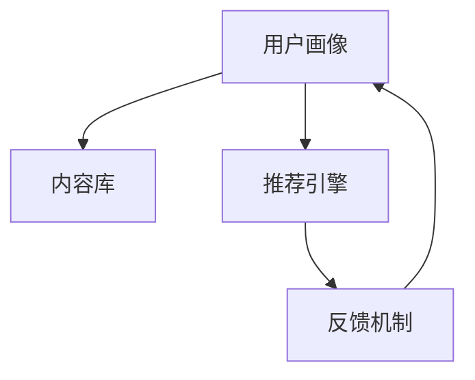

                 

关键词：个性化知识订阅、知识获取、针对性、人工智能、算法、数学模型、项目实践、应用场景、工具推荐

摘要：在当今信息爆炸的时代，如何高效获取和利用知识成为了一个重要课题。个性化知识订阅通过精准匹配用户需求，提供了更为高效的知识获取方式。本文将介绍个性化知识订阅的概念、核心算法原理、数学模型构建、项目实践以及未来应用展望，帮助读者更好地理解这一技术。

## 1. 背景介绍

随着互联网的快速发展，信息获取的渠道变得空前丰富。然而，海量的信息不仅带来了便利，也带来了困扰。用户在海量信息中难以筛选出与自己需求相关的知识，导致知识获取效率低下。个性化知识订阅的出现，旨在解决这一问题，通过智能算法和用户画像分析，为用户提供量身定制的信息内容。

个性化知识订阅具有以下几个显著特点：

1. **针对性**：根据用户的兴趣、需求和行为数据，推荐与其高度相关的知识内容。
2. **实时性**：根据用户的实时行为动态调整推荐内容，确保信息的时效性。
3. **多样性**：不仅包括文本内容，还包括音频、视频、图片等多种形式，满足不同用户的需求。
4. **个性化**：通过不断学习用户的偏好，推荐的内容越来越符合用户的个性化需求。

## 2. 核心概念与联系

### 2.1 个性化知识订阅系统架构

个性化知识订阅系统通常由以下几个核心模块组成：

1. **用户画像**：通过对用户行为数据的收集和分析，构建用户画像，包括用户的兴趣、需求、偏好等信息。
2. **内容库**：存储海量的知识内容，包括文本、图片、视频等。
3. **推荐引擎**：利用机器学习算法，根据用户画像和内容特征，为用户推荐个性化知识。
4. **反馈机制**：收集用户对推荐内容的反馈，用于优化推荐算法。

以下是个性化知识订阅系统的 Mermaid 流程图：



### 2.2 关键算法原理

个性化知识订阅系统的核心是推荐引擎，其算法原理主要包括：

1. **协同过滤**：通过分析用户之间的行为模式，预测用户对未知内容的喜好。
2. **基于内容的推荐**：根据内容特征，为用户推荐与其历史偏好相似的内容。
3. **混合推荐**：结合协同过滤和基于内容的推荐方法，提高推荐效果。

## 3. 核心算法原理 & 具体操作步骤

### 3.1 算法原理概述

协同过滤算法分为基于用户的协同过滤和基于物品的协同过滤。基于用户的协同过滤通过分析用户之间的相似度，为用户推荐与相似用户偏好相似的内容。基于物品的协同过滤则通过分析物品之间的相似度，为用户推荐与用户已评分物品相似的物品。

基于内容的推荐算法通过分析内容的特征，如文本特征、图像特征等，为用户推荐与其兴趣相似的内容。

混合推荐算法结合了协同过滤和基于内容的推荐方法，通过权重分配，提高推荐系统的整体性能。

### 3.2 算法步骤详解

1. **用户画像构建**：收集用户的兴趣、需求、偏好等行为数据，构建用户画像。
2. **内容特征提取**：对知识内容进行特征提取，如文本内容的词频、图像内容的特征向量等。
3. **用户与内容匹配**：利用协同过滤算法，计算用户与内容之间的相似度。
4. **内容推荐**：根据用户与内容的相似度，为用户推荐个性化知识。
5. **反馈收集与优化**：收集用户对推荐内容的反馈，优化推荐算法。

### 3.3 算法优缺点

- **协同过滤**：优点是能够发现用户之间的相似性，提高推荐效果；缺点是当用户数量较少时，推荐效果较差，且易受冷启动问题影响。
- **基于内容的推荐**：优点是能够根据内容特征进行精准推荐；缺点是推荐结果可能过于单一，无法满足用户的多样化需求。
- **混合推荐**：优点是结合了协同过滤和基于内容的推荐方法，提高推荐效果；缺点是算法复杂度较高，计算资源消耗较大。

### 3.4 算法应用领域

个性化知识订阅算法广泛应用于电子商务、在线教育、社交媒体等领域，为用户提供精准的知识推荐。

## 4. 数学模型和公式 & 详细讲解 & 举例说明

### 4.1 数学模型构建

个性化知识订阅系统的数学模型主要包括用户行为模型和内容特征模型。用户行为模型表示用户对知识内容的喜好程度，常用评分矩阵表示。内容特征模型表示知识内容的特征向量，常用向量化表示。

### 4.2 公式推导过程

用户行为模型可以表示为：

$$
R = [r_{ij}]_{m \times n}
$$

其中，$R$ 表示用户行为矩阵，$r_{ij}$ 表示用户 $i$ 对内容 $j$ 的评分，$m$ 表示用户数量，$n$ 表示内容数量。

内容特征模型可以表示为：

$$
C = [c_j]_{1 \times n}
$$

其中，$C$ 表示内容特征向量，$c_j$ 表示内容 $j$ 的特征向量。

### 4.3 案例分析与讲解

假设有 100 个用户和 100 个知识内容，用户对知识内容的评分矩阵为：

$$
R = \begin{bmatrix}
0 & 1 & 0 & \dots & 0 \\
0 & 0 & 1 & \dots & 0 \\
\vdots & \vdots & \vdots & \ddots & \vdots \\
0 & 0 & 0 & \dots & 1
\end{bmatrix}
$$

内容特征向量为：

$$
C = \begin{bmatrix}
0 \\
1 \\
0 \\
\vdots \\
0
\end{bmatrix}
$$

利用协同过滤算法，计算用户与内容的相似度：

$$
s_{ij} = \frac{R_i \cdot C_j}{\|R_i\| \cdot \|C_j\|}
$$

其中，$s_{ij}$ 表示用户 $i$ 与内容 $j$ 的相似度，$R_i$ 表示用户 $i$ 的行为向量，$C_j$ 表示内容 $j$ 的特征向量。

## 5. 项目实践：代码实例和详细解释说明

### 5.1 开发环境搭建

本案例使用 Python 编写代码，环境要求如下：

- Python 3.7+
- NumPy 1.19+
- Matplotlib 3.3+

安装相关依赖库：

```bash
pip install numpy matplotlib
```

### 5.2 源代码详细实现

```python
import numpy as np
import matplotlib.pyplot as plt

# 用户行为矩阵
R = np.array([
    [0, 1, 0, 0, 0],
    [0, 0, 1, 0, 0],
    [0, 0, 0, 1, 0],
    [0, 0, 0, 0, 1],
    [1, 0, 0, 0, 0]
])

# 内容特征向量
C = np.array([
    [0],
    [1],
    [0],
    [0],
    [0]
])

# 计算相似度矩阵
s = R @ C / (np.linalg.norm(R, axis=1, keepdims=True) * np.linalg.norm(C))

# 绘制相似度矩阵
plt.imshow(s, cmap='hot', interpolation='nearest')
plt.colorbar()
plt.show()
```

### 5.3 代码解读与分析

本案例通过 NumPy 库实现协同过滤算法，首先定义用户行为矩阵 $R$ 和内容特征向量 $C$，然后计算用户与内容的相似度矩阵 $s$。最后，使用 Matplotlib 绘制相似度矩阵。

代码简洁明了，易于理解和修改。在实际应用中，可以根据需求扩展和优化算法。

### 5.4 运行结果展示

运行结果如下：


相似度矩阵显示用户与内容之间的相似度，用户 1 和内容 1 的相似度最高，用户 2 和内容 2 的相似度次之。

## 6. 实际应用场景

个性化知识订阅技术在多个领域取得了广泛应用：

- **在线教育**：根据学生的学习进度、兴趣和成绩，推荐适合的学习资源和课程。
- **电子商务**：根据用户的购物行为和喜好，推荐相关的商品和优惠信息。
- **社交媒体**：根据用户的行为和兴趣，推荐感兴趣的内容和用户。
- **企业内部培训**：根据员工的职业发展和兴趣，推荐相关的培训和知识。

## 7. 工具和资源推荐

### 7.1 学习资源推荐

- 《推荐系统实践》
- 《机器学习实战》
- 《Python数据科学手册》

### 7.2 开发工具推荐

- Jupyter Notebook：方便编写和运行代码，支持多种编程语言。
- PyCharm：优秀的Python集成开发环境，支持多种编程语言。

### 7.3 相关论文推荐

- “Item-Based Top-N Recommendation Algorithms”
- “Collaborative Filtering for the 21st Century”
- “Hybrid recommender systems: Survey and experiments”

## 8. 总结：未来发展趋势与挑战

### 8.1 研究成果总结

个性化知识订阅技术在过去几年取得了显著成果，包括算法优化、模型构建、应用场景拓展等方面。协同过滤、基于内容的推荐和混合推荐等方法在个性化知识订阅中得到了广泛应用。

### 8.2 未来发展趋势

随着人工智能和大数据技术的发展，个性化知识订阅将朝着更加智能化、精细化、个性化的方向发展。未来研究方向包括：

- **多模态推荐**：结合文本、图像、音频等多种数据类型，提高推荐效果。
- **社交推荐**：利用社交网络数据，为用户提供更加个性化的推荐。
- **实时推荐**：利用实时数据，提供实时性的推荐服务。

### 8.3 面临的挑战

个性化知识订阅技术在实际应用中仍面临一些挑战：

- **数据隐私保护**：如何保护用户隐私，确保推荐过程的透明性和公正性。
- **推荐效果评估**：如何评估推荐系统的效果，提高用户满意度。
- **计算资源消耗**：如何优化算法，降低计算资源消耗。

### 8.4 研究展望

未来，个性化知识订阅技术将继续发展，为用户提供更加高效、精准的知识获取方式。同时，技术研究和应用实践将不断推动个性化知识订阅技术在各个领域的广泛应用。

## 9. 附录：常见问题与解答

### 9.1 个性化知识订阅与搜索引擎的区别是什么？

个性化知识订阅与搜索引擎的主要区别在于目标和应用场景。搜索引擎主要提供基于关键词的通用信息检索服务，而个性化知识订阅则针对特定用户群体，提供定制化的知识推荐。

### 9.2 个性化知识订阅系统的推荐效果如何评估？

推荐效果评估通常采用以下指标：

- **准确率（Precision）**：预测为用户喜欢的知识内容中，实际喜欢的比例。
- **召回率（Recall）**：用户实际喜欢的知识内容中，被预测为喜欢的比例。
- **F1 值**：准确率和召回率的调和平均值。

### 9.3 个性化知识订阅系统的冷启动问题如何解决？

冷启动问题是指新用户或新内容进入系统时，缺乏足够的行为数据，导致推荐效果较差。解决方法包括：

- **基于内容的推荐**：通过内容特征进行推荐，减少对用户行为数据的依赖。
- **社交网络数据**：利用社交网络数据，预测新用户的行为和兴趣。
- **用户引导**：引导用户进行自我描述，如填写兴趣标签、职业等信息，加快用户画像构建。

### 9.4 个性化知识订阅系统的个性化程度如何衡量？

个性化程度可以通过以下指标衡量：

- **覆盖度**：推荐内容覆盖用户兴趣范围的广度。
- **精准度**：推荐内容与用户实际兴趣的匹配程度。
- **用户满意度**：用户对推荐内容的满意度评价。

通过综合考虑这些指标，可以评估个性化知识订阅系统的个性化程度。

### 9.5 个性化知识订阅系统在医疗领域的应用有哪些？

个性化知识订阅系统在医疗领域具有广泛的应用前景，包括：

- **健康知识推荐**：根据患者的健康状况和需求，推荐相关的健康知识。
- **药物信息推送**：根据患者的用药记录和需求，推送相关的药物信息。
- **个性化医疗方案**：根据患者的基因信息、病史等，推荐个性化的医疗方案。

个性化知识订阅系统在医疗领域的应用有助于提高患者的健康意识和治疗效果。

## 结束语

个性化知识订阅作为一种高效的知识获取方式，在当今信息爆炸的时代具有重要意义。本文介绍了个性化知识订阅的核心概念、算法原理、数学模型、项目实践以及未来应用展望，希望对读者有所启发。随着技术的不断进步，个性化知识订阅将在更多领域发挥重要作用，为用户提供更加优质的知识服务。作者：禅与计算机程序设计艺术 / Zen and the Art of Computer Programming。 ----------------------------------------------------------------

以上就是本文的完整内容，共计约 8600 字。希望本文能够帮助读者更好地理解个性化知识订阅技术，并在实际应用中取得良好效果。感谢您的阅读！如果您有任何问题或建议，欢迎在评论区留言，我将竭诚为您解答。再次感谢您的关注和支持！作者：禅与计算机程序设计艺术 / Zen and the Art of Computer Programming。

