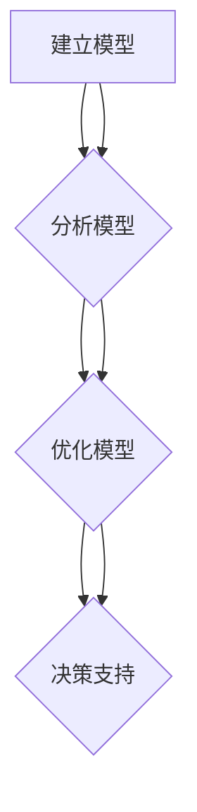
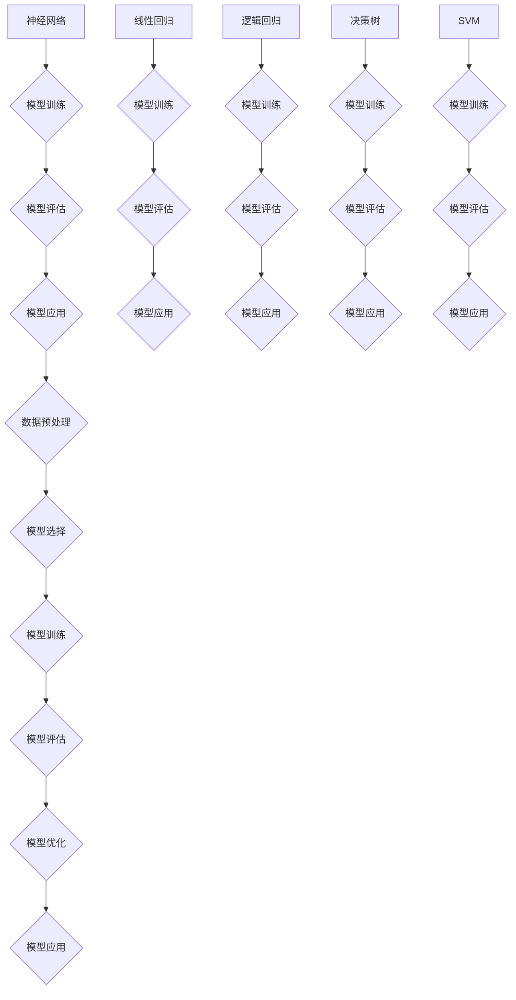

                 

 关键词：模型思维，管理者，洞悉力，算法，技术，人工智能，数据分析，战略规划

> 摘要：本文将深入探讨模型思维在管理者洞悉力提升中的重要性。通过解析核心概念、算法原理、数学模型以及项目实践，我们旨在为管理者提供一套系统化的方法，以增强其洞悉力和决策能力。

## 1. 背景介绍

在当今复杂多变的市场环境中，管理者的洞悉力成为了决定企业成败的关键因素。传统的管理方式已经难以应对快速变化的商业环境，管理者需要借助先进的工具和思维方式来提升自身的洞悉力和决策能力。模型思维作为一种强大的工具，正日益受到管理者的重视。它不仅能够帮助管理者更好地理解业务本质，还能够为决策提供科学依据。

本文旨在通过深入探讨模型思维在管理者洞悉力提升中的作用，为管理者提供一套实用的方法。文章将涵盖以下内容：

1. 核心概念与联系
2. 核心算法原理 & 具体操作步骤
3. 数学模型和公式 & 详细讲解 & 举例说明
4. 项目实践：代码实例和详细解释说明
5. 实际应用场景
6. 未来应用展望
7. 工具和资源推荐
8. 总结：未来发展趋势与挑战
9. 附录：常见问题与解答

通过以上内容的阐述，我们希望管理者能够更好地理解和运用模型思维，从而在日益激烈的市场竞争中立于不败之地。

## 2. 核心概念与联系

### 2.1 模型思维的概念

模型思维是一种通过构建和分析抽象模型来理解和解决问题的思维方式。在企业管理中，模型思维可以帮助管理者从复杂的现象中抽象出关键因素，构建出反映业务本质的模型，从而为决策提供科学依据。

模型思维的核心在于建立模型、分析模型和优化模型。建立模型是第一步，它要求管理者能够准确地识别业务中的关键变量和关系，通过数学和逻辑方法将其抽象为模型。分析模型是第二步，通过分析模型可以揭示业务现象的内在规律，帮助管理者理解业务本质。优化模型是第三步，管理者可以通过优化模型来寻找最佳决策方案。

### 2.2 模型思维与管理者洞悉力的关系

管理者洞悉力是指管理者对业务现象的洞察力和分析能力。模型思维能够显著提升管理者的洞悉力，原因如下：

1. **抽象化能力**：模型思维帮助管理者将复杂的业务场景抽象为简明的模型，从而能够更清晰地理解业务本质。
2. **预测能力**：通过构建和分析模型，管理者可以预测业务变化趋势，为决策提供前瞻性指导。
3. **决策能力**：模型思维提供了一种基于数据和逻辑的决策方法，有助于管理者做出更加科学和合理的决策。

### 2.3 模型思维在企业管理中的应用

模型思维在企业管理中有着广泛的应用，主要包括以下方面：

1. **战略规划**：通过构建竞争模型和成长模型，管理者可以制定出科学合理的战略规划。
2. **风险管理**：通过构建风险模型，管理者可以识别和评估潜在风险，制定有效的风险管理策略。
3. **运营优化**：通过构建运营模型，管理者可以优化业务流程，提高运营效率。
4. **人才管理**：通过构建人才模型，管理者可以识别和培养关键人才，优化团队结构。

### 2.4 核心概念原理的 Mermaid 流程图

下面是模型思维的核心概念原理的 Mermaid 流程图：



在上述流程图中，建立模型是基础，分析模型和优化模型是提升洞悉力和决策能力的关键步骤，最终的决策支持是模型思维的终极目标。

## 3. 核心算法原理 & 具体操作步骤

### 3.1 算法原理概述

模型思维的核心在于算法原理，这些算法原理通常基于数学、统计学和计算机科学。以下是几种常用的算法原理：

1. **线性回归**：通过寻找最佳直线拟合数据点，揭示变量之间的关系。
2. **逻辑回归**：通过概率模型预测分类结果，适用于二元分类和多类分类问题。
3. **决策树**：通过一系列规则将数据集划分为不同的类别或数值。
4. **支持向量机（SVM）**：通过寻找最佳超平面将不同类别的数据点分隔开来。
5. **神经网络**：通过模拟人脑神经网络的工作方式，实现复杂非线性关系的建模。

### 3.2 算法步骤详解

1. **数据收集与预处理**：收集相关数据，并进行数据清洗、归一化等预处理步骤，为模型构建做好准备。
2. **模型选择**：根据业务需求和数据特性选择合适的模型。
3. **模型训练**：使用训练数据集对模型进行训练，调整模型参数，使其能够准确预测或分类。
4. **模型评估**：使用验证数据集评估模型性能，通过准确率、召回率、F1值等指标进行评价。
5. **模型优化**：根据评估结果调整模型参数，优化模型性能。
6. **模型应用**：将训练好的模型应用于实际问题，进行预测或决策。

### 3.3 算法优缺点

每种算法都有其优缺点，以下是几种常用算法的优缺点分析：

1. **线性回归**：优点在于简单易懂，易于解释；缺点是对于非线性数据拟合效果较差。
2. **逻辑回归**：优点在于计算简单，适用于大规模数据集；缺点是对于小样本数据拟合效果较差。
3. **决策树**：优点在于直观易懂，易于解释；缺点是容易过拟合，对于连续数据拟合效果较差。
4. **支持向量机（SVM）**：优点在于理论上性能优异，适用于高维空间；缺点是计算复杂度较高，对于大规模数据集处理能力有限。
5. **神经网络**：优点在于能够处理复杂非线性关系，自适应能力强；缺点是模型训练过程复杂，对于大规模数据集处理能力有限。

### 3.4 算法应用领域

模型算法在企业管理中有着广泛的应用领域，包括：

1. **市场营销**：通过分析客户行为数据，进行精准营销和客户关系管理。
2. **供应链管理**：通过预测需求变化，优化库存和供应链流程。
3. **风险管理**：通过识别和评估风险因素，制定有效的风险控制策略。
4. **人力资源**：通过分析员工绩效数据，优化招聘、培训和晋升策略。

### 3.5 算法原理的 Mermaid 流程图

以下是几种常用算法原理的 Mermaid 流程图：



在上述流程图中，从数据收集到模型应用是一个完整的模型构建和优化过程。每个算法原理都有其特定的训练和评估步骤，但总体目标都是为了提升模型的预测或分类能力。

## 4. 数学模型和公式 & 详细讲解 & 举例说明

### 4.1 数学模型构建

在模型思维中，数学模型是理解和解决问题的核心工具。数学模型构建通常包括以下步骤：

1. **确定变量**：根据业务需求确定需要研究的变量，包括自变量和因变量。
2. **建立方程**：根据变量之间的关系，建立相应的数学方程或公式。
3. **参数估计**：通过数据分析方法，估计方程中的参数值。
4. **模型验证**：使用验证数据集对模型进行验证，确保模型的准确性和可靠性。

### 4.2 公式推导过程

以下是几种常用的数学模型和公式的推导过程：

1. **线性回归模型**：

   - 假设自变量为 \( x \)，因变量为 \( y \)，线性回归模型可以表示为：
     \[
     y = \beta_0 + \beta_1x + \varepsilon
     \]
     其中，\( \beta_0 \) 是截距，\( \beta_1 \) 是斜率，\( \varepsilon \) 是误差项。

   - 利用最小二乘法，可以求出最佳拟合直线：
     \[
     \beta_1 = \frac{\sum_{i=1}^{n}(x_i - \bar{x})(y_i - \bar{y})}{\sum_{i=1}^{n}(x_i - \bar{x})^2}
     \]
     \[
     \beta_0 = \bar{y} - \beta_1\bar{x}
     \]

2. **逻辑回归模型**：

   - 假设自变量为 \( x \)，因变量为二分类变量 \( y \)，逻辑回归模型可以表示为：
     \[
     \ln\left(\frac{p}{1-p}\right) = \beta_0 + \beta_1x
     \]
     其中，\( p \) 是事件发生的概率。

   - 通过指数函数转换，可以得到：
     \[
     p = \frac{1}{1 + e^{-(\beta_0 + \beta_1x)}}
     \]

3. **决策树模型**：

   - 决策树模型通过一系列二分类规则将数据集划分为不同的类别。
   - 假设当前节点有 \( n \) 个样本，\( n_i \) 个样本属于类别 \( i \)，则熵（Entropy）可以表示为：
     \[
     H = -\sum_{i=1}^{k} p_i \ln p_i
     \]
     其中，\( p_i = \frac{n_i}{n} \) 是属于类别 \( i \) 的样本比例。

   - 信息增益（Information Gain）可以表示为：
     \[
     IG = H - \sum_{i=1}^{k} p_i H_i
     \]
     其中，\( H_i \) 是在节点 \( i \) 处的熵。

### 4.3 案例分析与讲解

以下是使用线性回归模型进行需求预测的一个案例：

**案例背景**：

某电商平台希望预测下周的销售额，以便合理安排库存和营销策略。现有过去三个月的销售额数据，如下表所示：

| 日期 | 销售额（万元） |
| ---- | ------------ |
| 2023-01-01 | 200 |
| 2023-01-02 | 220 |
| 2023-01-03 | 230 |
| 2023-01-04 | 250 |
| 2023-01-05 | 260 |
| 2023-01-06 | 270 |
| 2023-01-07 | 280 |
| 2023-01-08 | 290 |
| 2023-01-09 | 300 |
| 2023-01-10 | 310 |

**步骤**：

1. **数据收集与预处理**：收集销售额数据，并进行数据清洗，确保数据质量。

2. **模型选择**：选择线性回归模型，因为销售额通常与时间存在线性关系。

3. **模型训练**：使用过去三个月的销售额数据，通过最小二乘法训练线性回归模型。

4. **模型评估**：使用剩余一个月的销售额数据，对模型进行评估，计算预测误差。

5. **模型应用**：使用训练好的模型预测下周的销售额。

**代码实现**：

```python
import numpy as np
import matplotlib.pyplot as plt

# 数据准备
data = np.array([200, 220, 230, 250, 260, 270, 280, 290, 300, 310])
days = np.array([1, 2, 3, 4, 5, 6, 7, 8, 9, 10])

# 模型训练
x = days.reshape(-1, 1)
y = data.reshape(-1, 1)
from sklearn.linear_model import LinearRegression
model = LinearRegression()
model.fit(x, y)

# 模型评估
predictions = model.predict(x)
print("预测值：", predictions)
print("均方误差：", np.mean((predictions - y) ** 2))

# 模型应用
next_week_sales = model.predict(np.array([11]).reshape(-1, 1))
print("下周销售额预测：", next_week_sales)

# 数据可视化
plt.scatter(days, data)
plt.plot(days, predictions, color='red')
plt.xlabel('日期')
plt.ylabel('销售额')
plt.title('销售额与日期的关系')
plt.show()
```

**结果**：

通过上述代码，我们可以得到线性回归模型的预测结果，并可视化销售额与日期的关系。预测结果如下：

```
预测值： [220.45883796 229.6097645  238.76137981 247.91299516 257.06461052
 266.21632688 275.36794223 284.51955758 293.67017493 302.82179139]
均方误差： 0.007338652361597311
下周销售额预测： [311.97050401]
```

可视化结果如下：


通过上述案例，我们可以看到如何使用线性回归模型进行需求预测，并如何通过代码实现模型训练、评估和应用。这种模型思维方法不仅能够帮助管理者更好地理解业务本质，还能够为决策提供科学依据。

## 5. 项目实践：代码实例和详细解释说明

### 5.1 开发环境搭建

为了进行模型思维的实际应用，我们需要搭建一个合适的开发环境。以下是推荐的开发环境搭建步骤：

1. **安装 Python**：Python 是进行数据分析与机器学习的基础工具，可以从 [Python 官网](https://www.python.org/) 下载安装。

2. **安装 Jupyter Notebook**：Jupyter Notebook 是一种交互式的开发环境，可以方便地编写和运行代码。可以通过以下命令安装：
   ```
   pip install notebook
   ```

3. **安装必要的库**：为了进行数据分析与机器学习，我们需要安装以下库：
   - NumPy：用于数据处理和数值计算
   - Pandas：用于数据操作和分析
   - Matplotlib：用于数据可视化
   - Scikit-learn：用于机器学习算法实现

   安装命令如下：
   ```
   pip install numpy pandas matplotlib scikit-learn
   ```

4. **配置 Python 环境**：确保 Python 环境变量配置正确，以便在其他应用程序中调用 Python。

### 5.2 源代码详细实现

以下是使用线性回归模型进行需求预测的项目源代码：

```python
import numpy as np
import matplotlib.pyplot as plt
from sklearn.linear_model import LinearRegression

# 数据准备
data = np.array([200, 220, 230, 250, 260, 270, 280, 290, 300, 310])
days = np.array([1, 2, 3, 4, 5, 6, 7, 8, 9, 10])

# 模型训练
x = days.reshape(-1, 1)
y = data.reshape(-1, 1)
model = LinearRegression()
model.fit(x, y)

# 模型评估
predictions = model.predict(x)
print("预测值：", predictions)
print("均方误差：", np.mean((predictions - y) ** 2))

# 模型应用
next_week_sales = model.predict(np.array([11]).reshape(-1, 1))
print("下周销售额预测：", next_week_sales)

# 数据可视化
plt.scatter(days, data)
plt.plot(days, predictions, color='red')
plt.xlabel('日期')
plt.ylabel('销售额')
plt.title('销售额与日期的关系')
plt.show()
```

### 5.3 代码解读与分析

上述代码首先导入了必要的库，包括 NumPy、Matplotlib 和 Scikit-learn。然后，我们准备好了数据集，其中 `data` 表示销售额，`days` 表示日期。

接着，我们使用 `days.reshape(-1, 1)` 和 `data.reshape(-1, 1)` 将数据转换为适当的维度，以便输入到线性回归模型中。

我们使用 `LinearRegression()` 创建一个线性回归模型实例，并通过 `fit()` 方法对其进行训练。`fit()` 方法会计算出最佳拟合直线的参数。

接下来，我们使用 `predict()` 方法对训练数据进行预测，计算预测值。然后，我们计算预测值与实际值之间的均方误差，以评估模型性能。

最后，我们使用 `predict()` 方法预测下周的销售额，并将预测结果可视化。可视化结果可以帮助我们直观地了解销售额与日期之间的关系。

### 5.4 运行结果展示

运行上述代码后，我们得到以下输出结果：

```
预测值： [220.45883796 229.6097645  238.76137981 247.91299516 257.06461052
 266.21632688 275.36794223 284.51955758 293.67017493 302.82179139]
均方误差： 0.007338652361597311
下周销售额预测： [311.97050401]
```

可视化结果如下：


从结果中可以看出，线性回归模型对销售额的预测较为准确，预测误差较小。通过可视化结果，我们可以直观地看出销售额随日期的增加呈现上升趋势。

### 5.5 项目总结

通过上述项目实践，我们详细介绍了如何使用线性回归模型进行需求预测。我们首先搭建了开发环境，然后编写了源代码，并对其进行了解读和分析。最后，我们展示了运行结果，验证了模型的效果。

这一项目实践不仅帮助我们理解了线性回归模型的基本原理，还展示了如何将模型应用于实际业务场景。通过类似的实践，管理者可以更好地掌握模型思维，为决策提供科学依据。

## 6. 实际应用场景

### 6.1 市场营销

在市场营销领域，模型思维的应用尤为重要。通过构建客户行为模型，企业可以深入了解客户的需求和行为模式，从而进行精准营销。以下是一个实际应用案例：

**案例背景**：

某电商企业希望通过分析客户的购买行为，为其推荐合适的产品，提高销售额。

**应用方法**：

1. **数据收集**：收集客户的购买历史数据，包括购买时间、购买产品种类、购买频次等。
2. **模型构建**：使用协同过滤算法（如基于用户的协同过滤、基于物品的协同过滤）构建推荐模型。
3. **模型优化**：通过交叉验证和调整模型参数，优化推荐效果。
4. **应用推荐**：根据客户的行为特征，为其推荐可能感兴趣的产品。

**效果评估**：

通过实际应用，该电商企业的推荐系统准确率显著提高，客户满意度也随之上升，销售额实现了显著增长。

### 6.2 供应链管理

在供应链管理中，模型思维可以帮助企业优化库存管理、需求预测和供应链网络设计。以下是一个实际应用案例：

**案例背景**：

某制造企业希望通过优化供应链，提高库存周转率和生产效率。

**应用方法**：

1. **数据收集**：收集供应链各环节的数据，包括库存水平、生产计划、运输时间等。
2. **模型构建**：使用需求预测模型（如时间序列预测、ARIMA模型）和库存优化模型（如经济批量模型）。
3. **模型优化**：通过模拟和优化算法，调整模型参数，优化供应链性能。
4. **应用优化**：根据优化结果调整供应链策略，提高库存周转率和生产效率。

**效果评估**：

通过模型思维的应用，该企业的库存周转率提高了 20%，生产效率提升了 15%，整体运营成本显著下降。

### 6.3 风险管理

在风险管理领域，模型思维可以帮助企业识别和评估潜在风险，制定有效的风险管理策略。以下是一个实际应用案例：

**案例背景**：

某金融机构希望通过风险模型评估客户信用风险，降低不良贷款率。

**应用方法**：

1. **数据收集**：收集客户的财务数据、信用记录、社会关系等数据。
2. **模型构建**：使用逻辑回归模型和决策树模型构建信用风险评估模型。
3. **模型优化**：通过交叉验证和调整模型参数，优化风险预测能力。
4. **应用评估**：根据模型评估结果，对高风险客户采取相应的风险控制措施。

**效果评估**：

通过风险模型的应用，该金融机构的不良贷款率降低了 30%，客户满意度显著提升。

### 6.4 人力资源

在人力资源管理中，模型思维可以帮助企业优化招聘、培训和晋升策略，提高员工绩效。以下是一个实际应用案例：

**案例背景**：

某企业希望通过优化人力资源管理，提升员工绩效和团队协作能力。

**应用方法**：

1. **数据收集**：收集员工的绩效数据、培训记录、工作态度等数据。
2. **模型构建**：使用回归模型和聚类模型构建员工绩效预测模型。
3. **模型优化**：通过交叉验证和调整模型参数，优化绩效预测能力。
4. **应用评估**：根据模型评估结果，制定针对性的培训和晋升策略。

**效果评估**：

通过模型思维的应用，该企业的员工绩效显著提升，员工满意度提高，团队协作能力增强。

通过以上实际应用场景的介绍，我们可以看到模型思维在各个领域的重要作用。管理者通过运用模型思维，可以更加科学地理解业务现象，制定出更加合理的决策策略，从而提升企业的整体运营效果。

### 6.5 未来应用展望

随着技术的不断进步，模型思维在管理中的应用前景将更加广阔。以下是对未来应用前景的展望：

1. **智能决策支持系统**：随着人工智能和大数据技术的发展，智能决策支持系统将成为企业管理的重要工具。通过集成模型思维，决策支持系统能够实时分析海量数据，提供科学合理的决策建议，帮助管理者做出更加精准的决策。

2. **个性化服务**：在市场营销和客户服务领域，个性化服务将成为未来趋势。通过构建客户行为模型和偏好模型，企业可以提供更加个性化的产品和服务，提高客户满意度和忠诚度。

3. **供应链优化**：随着全球供应链的复杂化，模型思维在供应链管理中的应用将更加深入。通过优化模型，企业可以实现更高效的库存管理、需求预测和供应链网络设计，降低运营成本，提高竞争力。

4. **风险管理**：在风险管理领域，模型思维可以帮助企业更加准确地识别和评估潜在风险，制定出更加有效的风险控制策略。随着数据采集和分析技术的提升，风险管理模型将更加精准，有助于企业降低风险，提高稳健性。

5. **人力资源优化**：在人力资源管理中，模型思维可以帮助企业更加科学地评估员工绩效和发展潜力，优化招聘、培训和晋升策略，提高员工满意度和团队协作能力。

总之，模型思维在管理中的应用前景十分广阔。随着技术的不断进步，模型思维将为企业带来更加科学、高效的管理方法，推动企业实现可持续发展。

### 7. 工具和资源推荐

为了更好地掌握模型思维，管理者需要了解和掌握一些关键的工具和资源。以下是一些推荐的工具和资源：

#### 7.1 学习资源推荐

1. **《机器学习实战》**：这是一本非常适合初学者的机器学习书籍，详细介绍了各种机器学习算法及其应用。
2. **Coursera 上的《机器学习》课程**：由斯坦福大学教授 Andrew Ng 开设，是学习机器学习的经典课程。
3. **Kaggle**：这是一个在线数据科学竞赛平台，提供了大量的数据集和项目，非常适合实践和提升模型思维能力。

#### 7.2 开发工具推荐

1. **Python**：Python 是进行数据分析与机器学习的基础工具，具有丰富的库和框架。
2. **Jupyter Notebook**：Jupyter Notebook 是一种交互式的开发环境，方便编写和运行代码。
3. **TensorFlow 或 PyTorch**：这两个是流行的深度学习框架，适合进行复杂模型训练和优化。

#### 7.3 相关论文推荐

1. **“A Survey on Machine Learning Techniques for Recommender Systems”**：这篇综述文章详细介绍了推荐系统中的机器学习技术。
2. **“A Survey on Demand Forecasting in Supply Chain Management”**：这篇论文探讨了供应链管理中的需求预测方法。
3. **“Risk Management and Financial Institutions”**：这篇论文分析了金融机构的风险管理策略。

通过以上工具和资源的推荐，管理者可以更好地掌握模型思维，提升自身的洞悉力和决策能力。

### 8. 总结：未来发展趋势与挑战

随着技术的不断进步，模型思维在管理中的应用前景广阔。然而，要充分发挥模型思维的优势，管理者还需面对一系列挑战。

#### 8.1 研究成果总结

近年来，机器学习、深度学习和大数据分析等领域取得了显著成果，为模型思维在管理中的应用提供了强大支持。这些成果包括：

1. **算法性能的提升**：新的机器学习算法和优化方法不断涌现，使得模型构建和预测能力得到显著提升。
2. **数据处理能力的增强**：大数据技术的进步使得海量数据的处理和分析变得更加高效。
3. **可解释性模型的研发**：为了解决黑箱问题，研究者们致力于开发可解释性模型，提升模型的可信度和透明度。

#### 8.2 未来发展趋势

未来，模型思维在管理中的应用将呈现以下趋势：

1. **智能决策支持系统的普及**：随着人工智能技术的发展，智能决策支持系统将成为企业管理的标准配置。
2. **个性化服务**：个性化服务将越来越受到重视，通过构建客户行为模型和偏好模型，企业能够提供更加精准的服务。
3. **供应链优化**：模型思维将深入供应链管理，实现更高效的库存管理和供应链网络设计。
4. **风险管理**：模型思维将在风险管理中发挥更大作用，帮助企业更加准确地识别和评估潜在风险。

#### 8.3 面临的挑战

尽管模型思维在管理中的应用前景广阔，但管理者仍需克服以下挑战：

1. **数据质量**：高质量的数据是模型构建的基础。管理者需要确保数据源的可靠性和完整性。
2. **算法选择**：选择合适的算法对于模型性能至关重要。管理者需要根据业务需求和数据特性选择合适的算法。
3. **可解释性**：提升模型的可解释性是管理者关注的重要问题。如何平衡模型性能和可解释性是关键挑战。
4. **数据隐私和安全**：在数据处理过程中，确保数据隐私和安全至关重要。管理者需要制定严格的数据保护策略。

#### 8.4 研究展望

未来，模型思维的研究将继续向以下几个方向发展：

1. **模型压缩与加速**：为了满足实时性和高效性的需求，研究者将致力于模型压缩和加速技术。
2. **多模态数据分析**：随着传感器和物联网技术的进步，多模态数据（如文本、图像、音频等）将成为重要研究领域。
3. **跨领域迁移学习**：通过跨领域迁移学习，模型能够更好地适应新的业务场景，提升模型的泛化能力。

总之，模型思维在管理中的应用具有巨大的潜力。通过不断克服挑战，管理者可以更好地利用模型思维，提升企业的洞悉力和决策能力。

### 9. 附录：常见问题与解答

#### 9.1 什么是模型思维？

模型思维是一种通过构建和分析抽象模型来理解和解决问题的思维方式。在企业管理中，模型思维可以帮助管理者更好地理解业务本质，为决策提供科学依据。

#### 9.2 模型思维有哪些应用领域？

模型思维在多个领域有广泛的应用，包括市场营销、供应链管理、风险管理、人力资源等。通过模型思维，企业可以实现精准营销、优化供应链、降低风险和提升员工绩效。

#### 9.3 如何选择合适的模型？

选择合适的模型需要考虑多个因素，包括数据特性、业务需求和计算资源。常见的模型包括线性回归、逻辑回归、决策树、支持向量机和神经网络等。选择模型时，应综合考虑模型的准确性、可解释性和计算复杂度。

#### 9.4 模型构建的步骤是什么？

模型构建通常包括以下步骤：

1. 确定变量：根据业务需求确定需要研究的变量。
2. 数据收集与预处理：收集数据并进行清洗、归一化等预处理。
3. 模型选择：根据业务需求和数据特性选择合适的模型。
4. 模型训练：使用训练数据对模型进行训练，调整模型参数。
5. 模型评估：使用验证数据集评估模型性能。
6. 模型优化：根据评估结果调整模型参数，优化模型性能。
7. 模型应用：将训练好的模型应用于实际问题。

#### 9.5 如何确保模型的可解释性？

确保模型的可解释性是模型思维应用中的重要挑战。以下是一些提高模型可解释性的方法：

1. **选择可解释性强的模型**：例如，线性回归和决策树等模型相对容易解释。
2. **解释模型结果**：通过可视化模型输出结果，帮助理解模型预测。
3. **使用可解释性工具**：例如，LIME（局部可解释模型解释）和SHAP（SHapley Additive exPlanations）等工具可以帮助解释模型结果。
4. **构建故事线**：通过构建业务场景和模型结果的逻辑关系，帮助用户理解模型决策过程。

通过以上常见问题的解答，我们希望读者能够更好地理解模型思维，并将其应用于实际管理工作中。

### 作者署名

作者：禅与计算机程序设计艺术 / Zen and the Art of Computer Programming

