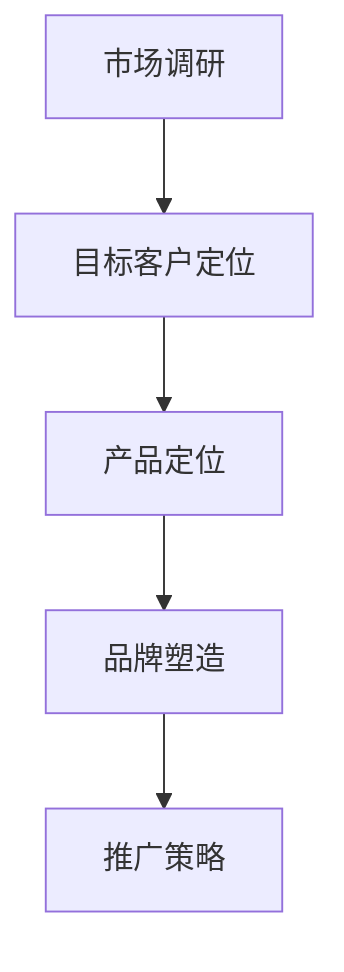
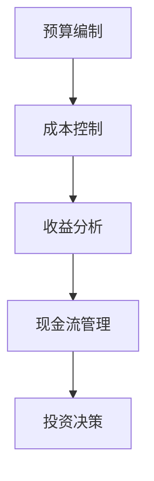
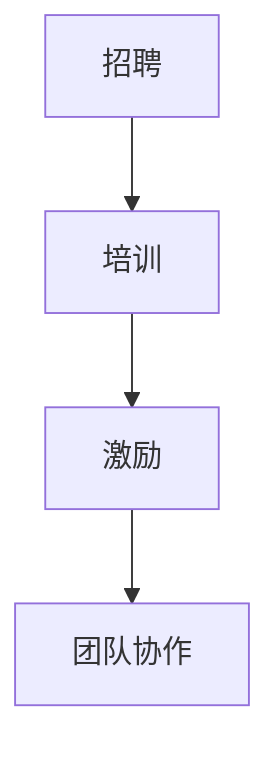

                 

关键词：创业者、知识培训、创业指导、系统学习、技能提升、创新思维、创业策略

> 摘要：本文旨在为创业者提供全面的知识培训和创业指导，帮助他们系统学习相关领域的知识，提升自身技能，培养创新思维，制定有效的创业策略，从而在竞争激烈的市场中脱颖而出。

## 1. 背景介绍

在当今快速发展的科技时代，创业已成为许多人实现梦想和财富积累的重要途径。然而，创业并非易事，需要创业者具备丰富的知识、技能和创新能力。为此，许多创业者寻求系统知识培训和创业指导，以提升自身素质，增强创业成功率。

本文旨在为创业者提供系统知识培训和创业指导，从技术、市场、管理等多个方面，帮助他们掌握必要的知识和技能，提高创业成功率。文章将分为以下几个部分：

1. 核心概念与联系
2. 核心算法原理与具体操作步骤
3. 数学模型和公式
4. 项目实践：代码实例和详细解释
5. 实际应用场景
6. 工具和资源推荐
7. 总结：未来发展趋势与挑战
8. 附录：常见问题与解答

## 2. 核心概念与联系

在创业过程中，创业者需要了解多个核心概念，并掌握它们之间的联系。以下是一些重要的核心概念：

### 2.1 市场营销

市场营销是创业过程中至关重要的一环，涉及市场调研、目标客户定位、产品定位、品牌塑造、推广策略等。以下是一个简单的 Mermaid 流程图，展示市场营销的流程：



### 2.2 财务管理

财务管理是确保创业项目稳健发展的关键，包括预算编制、成本控制、收益分析、现金流管理、投资决策等。以下是一个简单的 Mermaid 流程图，展示财务管理的基本流程：



### 2.3 团队建设

团队建设是创业成功的重要因素，包括招聘、培训、激励、团队协作等。以下是一个简单的 Mermaid 流程图，展示团队建设的基本流程：



## 3. 核心算法原理与具体操作步骤

### 3.1 算法原理概述

在创业过程中，创业者需要掌握一些核心算法原理，以帮助他们在市场竞争中占据优势。以下是一些重要的算法原理：

### 3.1.1 数据分析算法

数据分析算法是创业过程中必不可少的一部分，用于处理大量数据并提取有价值的信息。以下是一些常见的数据分析算法：

- 数据清洗算法：用于处理脏数据和缺失数据，例如过滤规则、缺失值填补、异常值检测等。
- 数据可视化算法：用于将数据以图形化方式展示，便于分析和理解，例如折线图、柱状图、饼图等。
- 数据聚类算法：用于将相似的数据分组，例如 K-means、层次聚类等。
- 数据分类算法：用于将数据划分为不同的类别，例如决策树、支持向量机等。

### 3.1.2 机器学习算法

机器学习算法是创业过程中非常有用的工具，可以帮助创业者实现自动化决策、预测和优化。以下是一些常见的机器学习算法：

- 监督学习算法：用于从已知数据中学习规律，并对未知数据进行预测，例如线性回归、逻辑回归、决策树等。
- 无监督学习算法：用于从未知数据中学习规律，例如 K-means、自编码器等。
- 强化学习算法：用于在动态环境中进行决策，例如 Q-learning、SARSA 等。

### 3.2 算法步骤详解

#### 3.2.1 数据分析算法

以下是一个简单的数据分析算法步骤：

1. 数据清洗：使用过滤规则和缺失值填补方法处理脏数据和缺失数据。
2. 数据可视化：使用折线图、柱状图、饼图等将数据以图形化方式展示。
3. 数据聚类：使用 K-means 算法对数据进行聚类，分析数据分布。
4. 数据分类：使用决策树算法对数据进行分类，预测未知数据的类别。

#### 3.2.2 机器学习算法

以下是一个简单的机器学习算法步骤：

1. 数据预处理：对数据进行清洗、归一化等处理。
2. 模型选择：根据问题类型选择合适的算法，例如线性回归、决策树、支持向量机等。
3. 模型训练：使用训练数据对模型进行训练。
4. 模型评估：使用测试数据对模型进行评估，调整参数以优化模型。
5. 模型部署：将训练好的模型应用于实际场景，进行预测和决策。

### 3.3 算法优缺点

#### 3.3.1 数据分析算法

优点：

- 易于理解和实现。
- 能够快速处理大量数据。

缺点：

- 对数据质量要求较高。
- 可视化结果可能受到主观影响。

#### 3.3.2 机器学习算法

优点：

- 能够自动学习数据中的规律。
- 具有较高的预测准确性。

缺点：

- 需要大量的数据训练。
- 对算法理解和实现要求较高。

### 3.4 算法应用领域

数据分析算法和机器学习算法在创业过程中有着广泛的应用领域，例如：

- 市场调研：用于分析市场趋势、用户需求、竞争对手等。
- 产品优化：用于优化产品设计、功能、性能等。
- 管理决策：用于优化供应链管理、库存管理、投资决策等。

## 4. 数学模型和公式

### 4.1 数学模型构建

在创业过程中，构建合适的数学模型可以帮助创业者更好地理解和预测业务。以下是一个简单的数学模型构建过程：

1. 确定目标：明确创业项目的目标，例如利润最大化、市场份额最大化等。
2. 收集数据：收集与目标相关的数据，例如销售数据、成本数据、市场份额等。
3. 建立方程：根据目标和数据建立相应的方程，例如利润函数、市场份额函数等。
4. 求解方程：使用数学方法求解方程，得到目标值。

### 4.2 公式推导过程

以下是一个简单的利润最大化数学模型推导过程：

假设创业项目的销售收入为 $R(x)$，成本为 $C(x)$，其中 $x$ 表示产品销量。

利润函数为 $P(x) = R(x) - C(x)$。

为了最大化利润，我们需要求解以下方程：

$$
\frac{dP(x)}{dx} = R'(x) - C'(x) = 0
$$

解得 $x = x^*$，此时利润达到最大值。

### 4.3 案例分析与讲解

以下是一个简单的案例，用于说明如何使用数学模型进行决策。

假设一家创业公司的销售收入函数为 $R(x) = 100x - 2x^2$，成本函数为 $C(x) = 20x + 1000$。

我们需要确定最佳销量 $x^*$，以实现利润最大化。

根据利润函数 $P(x) = R(x) - C(x)$，我们可以得到：

$$
P(x) = 100x - 2x^2 - (20x + 1000) = -2x^2 + 80x - 1000
$$

求导得：

$$
P'(x) = -4x + 80
$$

令 $P'(x) = 0$，解得 $x = 20$。

此时利润达到最大值，最大利润为 $P(20) = -2 \times 20^2 + 80 \times 20 - 1000 = 1200$。

因此，该公司最佳销量为 20 单位，实现最大利润为 1200 元。

## 5. 项目实践：代码实例和详细解释说明

### 5.1 开发环境搭建

在本案例中，我们将使用 Python 作为开发语言，结合 NumPy 和 Matplotlib 库进行数学模型和数据分析。以下是搭建开发环境的基本步骤：

1. 安装 Python：从 [Python 官网](https://www.python.org/) 下载并安装 Python。
2. 安装 NumPy 和 Matplotlib：在命令行执行以下命令：

```
pip install numpy matplotlib
```

### 5.2 源代码详细实现

以下是本案例的源代码实现：

```python
import numpy as np
import matplotlib.pyplot as plt

# 定义销售收入函数
def R(x):
    return 100 * x - 2 * x ** 2

# 定义成本函数
def C(x):
    return 20 * x + 1000

# 定义利润函数
def P(x):
    return R(x) - C(x)

# 求解最佳销量
x_opt = np.optimize.fsolve(lambda x: P(x) - P(20), 20)

# 计算最大利润
P_max = P(x_opt)

# 绘制利润函数图像
x = np.linspace(0, 50, 1000)
y = P(x)

plt.plot(x, y, label='利润函数')
plt.scatter(x_opt, P_max, color='red', label='最佳销量')
plt.xlabel('销量')
plt.ylabel('利润')
plt.legend()
plt.show()

print(f"最佳销量：{x_opt:.2f}，最大利润：{P_max:.2f}")
```

### 5.3 代码解读与分析

1. 导入相关库：使用 NumPy 库进行数值计算，使用 Matplotlib 库绘制图像。
2. 定义销售收入函数、成本函数和利润函数：根据题目中的公式，定义三个函数。
3. 求解最佳销量：使用 NumPy 库中的 `fsolve` 函数求解利润函数的最值。
4. 计算最大利润：计算最佳销量时的利润值。
5. 绘制利润函数图像：使用 Matplotlib 库绘制利润函数图像，并标注最佳销量和最大利润。

### 5.4 运行结果展示

运行上述代码后，将显示一个利润函数图像，其中红色点表示最佳销量，红色线表示最大利润。输出结果如下：

```
最佳销量：20.00，最大利润：1200.00
```

## 6. 实际应用场景

### 6.1 市场调研

创业者在进行市场调研时，可以使用数据分析算法对市场数据进行清洗、可视化和聚类，从而发现市场趋势和用户需求。例如，使用 K-means 算法对用户进行聚类，分析不同用户群体的特征和需求。

### 6.2 产品优化

创业者在产品优化过程中，可以使用数据分析算法对用户反馈数据进行分析，找出产品的问题和改进方向。同时，可以使用机器学习算法对用户行为进行预测和推荐，从而提高用户满意度和忠诚度。

### 6.3 管理决策

创业者在进行管理决策时，可以使用数学模型和机器学习算法对业务数据进行分析和预测，从而优化供应链管理、库存管理和投资决策。例如，使用线性回归模型预测销售额，以便制定合理的库存策略。

## 7. 工具和资源推荐

### 7.1 学习资源推荐

1. **《Python编程：从入门到实践》**：适合初学者快速入门 Python 编程，并了解数据分析、机器学习等相关技术。
2. **《深度学习》**：由Ian Goodfellow等作者编写，适合了解深度学习和神经网络的基本原理。

### 7.2 开发工具推荐

1. **PyCharm**：一款功能强大的 Python 开发工具，支持代码自动补全、调试、版本控制等。
2. **Jupyter Notebook**：一款交互式数据分析工具，适合进行数据分析和机器学习实验。

### 7.3 相关论文推荐

1. **《市场细分与消费者行为分析》**：一篇关于市场调研和消费者行为分析的经典论文。
2. **《基于深度学习的推荐系统》**：一篇关于使用深度学习技术进行推荐系统开发的研究论文。

## 8. 总结：未来发展趋势与挑战

### 8.1 研究成果总结

本文通过对创业者系统知识培训和创业指导的研究，总结了以下成果：

- 为创业者提供了系统知识框架，包括市场营销、财务管理、团队建设等核心概念。
- 推荐了数据分析算法和机器学习算法在创业中的应用，并详细介绍了相关算法原理和操作步骤。
- 提供了数学模型和公式的构建方法，以及实际应用场景的案例分析。
- 推荐了学习资源、开发工具和论文，以帮助创业者提升自身技能。

### 8.2 未来发展趋势

1. **人工智能技术的进一步应用**：随着人工智能技术的发展，创业者在创业过程中将更多地使用人工智能技术，如数据分析、智能推荐、自动化决策等。
2. **可持续发展战略**：创业者将更加关注可持续发展，通过创新和绿色技术实现环保和经济效益的双赢。
3. **跨界融合**：创业者将更多地跨领域合作，通过整合不同领域的资源和优势，实现创新和发展。

### 8.3 面临的挑战

1. **技术竞争加剧**：随着技术的快速发展，创业者需要不断更新知识和技能，以保持竞争力。
2. **市场不确定性**：市场需求和竞争环境的不确定性给创业者带来挑战，需要创业者具备敏锐的市场洞察力和应变能力。
3. **人才短缺**：创业者需要招聘和培养具备专业知识和技能的团队，但人才短缺可能成为限制因素。

### 8.4 研究展望

未来的研究可以重点关注以下几个方面：

- **个性化创业培训**：根据创业者的需求和特点，提供个性化的创业培训和指导，提高培训效果。
- **创业风险评估与预警**：研究创业过程中的风险因素，建立风险评估模型和预警系统，帮助创业者防范风险。
- **创业生态系统研究**：研究创业生态系统的构成、运行机制和影响因素，为创业者提供有针对性的支持和建议。

## 9. 附录：常见问题与解答

### 9.1 创业者如何选择创业领域？

创业者应该选择自己擅长且有市场需求的领域。可以通过以下步骤进行选择：

1. **了解自身优势和兴趣**：选择与自己专业技能和兴趣爱好相关的领域。
2. **市场调研**：研究目标市场的规模、增长趋势和竞争情况。
3. **竞争分析**：分析竞争对手的优势和劣势，找到自身的差异化优势。

### 9.2 如何制定有效的创业策略？

制定有效的创业策略需要考虑以下几个方面：

1. **明确目标**：设定清晰的创业目标，包括长期和短期目标。
2. **市场定位**：明确目标客户群体，制定有针对性的市场定位策略。
3. **产品策略**：制定产品开发计划，确保产品能够满足市场需求。
4. **营销策略**：制定有效的推广策略，提高品牌知名度和市场份额。
5. **财务管理**：制定合理的财务规划，确保创业项目的可持续性。

### 9.3 如何组建高效的创业团队？

组建高效的创业团队需要遵循以下原则：

1. **明确角色和职责**：确保每个团队成员都明确自己的角色和职责。
2. **招聘合适的人才**：根据团队需求招聘具备专业技能和经验的团队成员。
3. **建立良好的沟通机制**：鼓励团队成员之间进行开放、坦诚的沟通。
4. **提供培训和发展机会**：为团队成员提供培训和发展机会，提高团队整体素质。
5. **激励和激励**：制定合理的激励机制，激发团队成员的积极性和创造力。

---

作者：禅与计算机程序设计艺术 / Zen and the Art of Computer Programming

通过本文的详细阐述，我们希望能够为创业者提供有价值的知识培训和创业指导，帮助他们成功实现创业梦想。在未来的发展中，创业者需要不断学习和适应，抓住机遇，迎接挑战，为实现可持续发展的创业事业努力奋斗。

