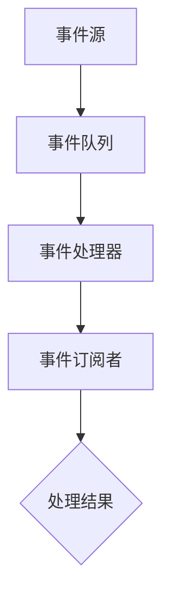

                 

### 1. 背景介绍

在当今的数字化时代，系统的实时性和响应能力变得尤为重要。随着互联网的普及和物联网（IoT）技术的发展，大量的数据以高速率、大规模的形式产生，这给传统的同步阻塞式架构带来了巨大的压力。为了应对这些挑战，事件驱动架构（Event-Driven Architecture，EDA）作为一种新型的系统设计范式逐渐受到重视。

事件驱动架构的核心思想是将系统的运作基于事件，而不是基于传统的请求响应模式。在事件驱动架构中，系统中的每个组件都可以发布和订阅特定类型的事件。当一个事件发生时，与之相关的组件会被通知并执行相应的操作，从而实现高效的异步通信和协同工作。这种架构具有高度的扩展性、可靠性和灵活性，能够更好地应对现代系统面临的复杂性和不确定性。

本文旨在介绍事件驱动架构的基本概念、核心原理、算法实现和应用实践。通过本文的阅读，读者将能够深入了解事件驱动架构的优势和特点，掌握构建响应式系统的关键技术，并为未来的系统设计和开发提供有益的参考。

### 2. 核心概念与联系

事件驱动架构（EDA）是一种以事件为中心的系统设计方法，其核心在于将系统的运行流程分解为一系列事件，并通过事件触发相应的操作。为了更好地理解EDA，我们需要明确以下几个核心概念：

#### 事件（Event）

事件是驱动系统运作的基本单元，它可以是一个具体的数据对象，也可以是一种状态变化。在EDA中，事件可以是用户操作、系统内部状态变化、外部信号触发等。事件的发生通常伴随着某种具体的行为或动作。

#### 事件源（Event Source）

事件源是指能够产生事件的对象或系统。在EDA中，事件源可以是用户界面、数据库、网络通信模块、硬件设备等。事件源负责监控外部环境和系统内部状态，并在特定条件下生成事件。

#### 事件订阅者（Event Subscriber）

事件订阅者是指订阅了特定类型事件并准备响应这些事件的组件。事件订阅者通过监听事件队列，获取到新的事件后，会根据事件的类型和内容执行相应的操作。

#### 事件队列（Event Queue）

事件队列是用于存储和管理事件的数据结构。在EDA中，事件队列通常是一个优先级队列或FIFO（先进先出）队列。事件队列负责按照特定的规则（如时间优先、优先级等）对事件进行排序和调度。

#### 事件处理器（Event Processor）

事件处理器是负责处理事件的组件。当事件队列中有新的事件时，事件处理器会从队列中取出事件，并调用相应的处理函数或方法。事件处理器通常具有高度的可扩展性和灵活性，能够根据不同的场景和需求进行定制化开发。

为了更直观地理解事件驱动架构的运作原理，我们可以借助Mermaid流程图来展示其核心组件和交互流程。以下是一个简化的Mermaid流程图，描述了事件驱动架构的基本运作流程：



在上面的流程图中，事件源（A）产生事件并将其添加到事件队列（B）。事件处理器（C）从事件队列中取出事件，并通知事件订阅者（D）。事件订阅者（D）根据事件的类型和内容执行相应的处理操作，最终产生处理结果（E）。

通过事件驱动架构，系统中的各个组件可以独立开发、独立部署，并通过事件进行通信和协作。这种松耦合的设计方式不仅提高了系统的可维护性和可扩展性，还增强了系统的响应速度和灵活性。

#### 2.1 事件驱动架构的核心优势

事件驱动架构具有以下核心优势：

1. **高扩展性**：事件驱动架构采用异步通信模式，能够处理大量的并发事件，从而实现系统的水平扩展。

2. **高可靠性**：通过事件队列的管理和调度，事件驱动架构能够保证事件按顺序处理，避免因同步阻塞导致的死锁和资源竞争问题。

3. **高灵活性**：事件驱动架构允许组件独立开发和部署，通过事件进行通信和协作，从而实现系统的灵活扩展和动态调整。

4. **高效性**：事件驱动架构通过异步处理和并发执行，提高了系统的吞吐量和响应速度。

#### 2.2 事件驱动架构的常见模式

事件驱动架构在实践中通常采用以下几种常见的模式：

1. **发布-订阅模式**：事件源发布事件，事件订阅者订阅特定类型的事件，并在接收到事件后执行相应的处理操作。

2. **回调模式**：事件处理器在接收到事件后，会触发回调函数或方法，执行具体的处理逻辑。

3. **事件总线模式**：事件总线是一个集中式的事件管理组件，负责事件的生产、分发和消费。事件源将事件发布到事件总线，事件订阅者从事件总线中获取事件并执行处理操作。

4. **观察者模式**：事件源作为观察者，事件订阅者作为被观察者。当事件发生时，事件源会通知所有订阅者，并触发相应的处理操作。

#### 2.3 事件驱动架构的应用场景

事件驱动架构在许多应用场景中表现出色，以下是一些典型的应用场景：

1. **实时数据处理**：在实时数据处理系统中，事件驱动架构能够高效地处理大规模、高频率的事件数据，如股票交易系统、物联网平台等。

2. **微服务架构**：在微服务架构中，事件驱动架构通过事件实现服务之间的异步通信和协调，从而提高系统的可靠性和扩展性。

3. **分布式系统**：在分布式系统中，事件驱动架构能够实现跨节点的数据同步和状态更新，如分布式数据库、分布式存储等。

4. **智能监控系统**：在智能监控系统中，事件驱动架构能够实时收集和处理大量监控数据，并根据事件触发相应的告警和处置操作。

通过以上介绍，我们可以看到事件驱动架构在系统设计和开发中具有广泛的应用前景和重要价值。接下来，我们将深入探讨事件驱动架构中的核心算法原理，为读者提供更具体的理解和实践指导。

### 3. 核心算法原理 & 具体操作步骤

在事件驱动架构中，核心算法的设计和实现至关重要。事件驱动架构的核心算法主要包括事件生成、事件调度和事件处理三个主要环节。以下将详细阐述这些核心算法的原理和具体操作步骤。

#### 3.1 事件生成算法

事件生成算法负责监测系统内部和外部环境的变化，并在满足特定条件时生成事件。事件生成算法通常基于以下原则：

1. **实时性**：事件生成算法需要及时响应系统状态变化和外部信号，确保事件生成的高效性。
2. **可靠性**：事件生成算法需要具备高可靠性，确保不会遗漏关键事件。
3. **可扩展性**：事件生成算法需要支持系统规模的扩展，能够处理大量的并发事件。

具体操作步骤如下：

1. **初始化事件源**：首先，初始化系统中的事件源，包括用户界面、数据库、网络模块等。这些事件源需要具备监控外部环境和系统内部状态的能力。
2. **监听系统状态**：事件源持续监听系统内部状态和外部信号，例如用户操作、数据变更、网络连接状态等。
3. **条件判断**：在监听过程中，事件源根据预设的条件判断是否触发事件。条件可以是系统状态的阈值变化、外部信号的到达等。
4. **生成事件**：当满足条件时，事件源生成事件并将其发送到事件队列。

事件生成算法可以采用以下方法：

- **基于时间的触发**：例如，定期检查系统状态，并在特定时间间隔内触发事件。
- **基于阈值的触发**：例如，当系统状态超过某个阈值时触发事件。
- **基于信号的触发**：例如，网络模块接收到外部信号时触发事件。

#### 3.2 事件调度算法

事件调度算法负责从事件队列中取出事件，并按特定规则进行排序和调度。事件调度算法需要保证以下原则：

1. **高效性**：事件调度算法需要高效地处理事件队列中的事件，确保系统的响应速度。
2. **公平性**：事件调度算法需要公平地处理每个事件，避免某些事件被长时间延迟。
3. **灵活性**：事件调度算法需要支持多种调度策略，以适应不同的系统需求。

具体操作步骤如下：

1. **初始化事件队列**：初始化事件队列，可以选择基于时间优先、优先级优先或FIFO（先进先出）等策略。
2. **事件排序**：根据事件的类型、优先级或到达时间等规则对事件队列中的事件进行排序。
3. **事件调度**：从事件队列中取出事件，并按排序结果进行调度。调度过程中，事件处理器会获取事件并准备执行处理操作。
4. **事件释放**：事件处理完成后，释放事件占用的系统资源。

事件调度算法可以采用以下方法：

- **时间优先调度**：按照事件到达时间进行排序和调度，确保最早到达的事件优先处理。
- **优先级调度**：按照事件的优先级进行排序和调度，高优先级的事件优先处理。
- **FIFO调度**：按照事件进入队列的顺序进行排序和调度，先进入的事件优先处理。

#### 3.3 事件处理算法

事件处理算法负责对事件进行具体处理，并执行相应的操作。事件处理算法需要保证以下原则：

1. **正确性**：事件处理算法需要确保事件处理结果的正确性，避免系统状态的不一致。
2. **一致性**：事件处理算法需要保证系统内部状态的一致性，避免数据丢失或错误。
3. **安全性**：事件处理算法需要确保系统操作的安全性，避免恶意事件对系统的破坏。

具体操作步骤如下：

1. **接收事件**：事件处理器从事件队列中获取事件，并读取事件类型和内容。
2. **处理事件**：根据事件类型和内容，执行相应的处理逻辑。处理逻辑可以包括数据更新、状态变更、触发其他操作等。
3. **保存结果**：将事件处理结果保存到系统状态中，以确保系统状态的一致性。
4. **释放资源**：事件处理完成后，释放事件占用的系统资源，如内存、线程等。

事件处理算法可以采用以下方法：

- **回调函数**：通过回调函数实现事件处理，便于模块化和复用。
- **状态机**：使用状态机实现事件处理，便于管理和扩展事件处理逻辑。
- **消息队列**：使用消息队列实现事件处理，确保事件处理的异步性和可靠性。

#### 3.4 算法优缺点

事件驱动架构中的核心算法具有以下优缺点：

1. **优点**：

- **高扩展性**：事件驱动架构能够高效处理大量并发事件，支持系统的水平扩展。
- **高可靠性**：事件队列和事件处理器的独立运作，保证了系统的可靠性。
- **高灵活性**：事件驱动架构支持多样化的调度策略和事件处理方法，便于系统的定制化和优化。

2. **缺点**：

- **复杂性**：事件驱动架构的设计和实现较为复杂，需要考虑事件生成、调度和处理等多个环节。
- **性能开销**：事件驱动架构引入了额外的系统开销，如事件队列的管理和事件处理的时间延迟。

#### 3.5 算法应用领域

事件驱动架构的核心算法在多个领域得到了广泛应用，以下是一些典型的应用领域：

1. **实时数据处理**：在实时数据处理系统中，事件驱动架构能够高效处理大规模、高频率的数据事件，如股票交易系统、物联网平台等。
2. **微服务架构**：在微服务架构中，事件驱动架构通过事件实现服务之间的异步通信和协调，提高系统的可靠性和扩展性。
3. **分布式系统**：在分布式系统中，事件驱动架构能够实现跨节点的数据同步和状态更新，如分布式数据库、分布式存储等。
4. **智能监控系统**：在智能监控系统中，事件驱动架构能够实时收集和处理大量监控数据，并根据事件触发相应的告警和处置操作。

通过以上对事件驱动架构核心算法原理和具体操作步骤的详细阐述，读者可以更好地理解事件驱动架构的工作机制和设计要点，为构建高效、可靠的响应式系统奠定基础。接下来，我们将进一步探讨事件驱动架构中的数学模型和公式，为读者提供更深入的理论支持。

### 4. 数学模型和公式 & 详细讲解 & 举例说明

在事件驱动架构中，数学模型和公式起到了关键作用，它们不仅为事件驱动系统提供了理论基础，还帮助我们分析和优化系统的性能。以下将详细介绍事件驱动架构中的数学模型和公式，并通过具体例子进行说明。

#### 4.1 数学模型构建

事件驱动架构中的数学模型主要包括事件生成模型、事件调度模型和事件处理模型。这些模型帮助我们理解和预测事件驱动系统的行为和性能。

1. **事件生成模型**

事件生成模型用于描述事件的发生概率和分布。常见的模型包括泊松过程和均匀分布。

- **泊松过程**：泊松过程是一个随机过程，用于描述单位时间内事件发生的次数。假设事件发生服从泊松分布，其概率密度函数为：
  $$ P(X = k) = \frac{\lambda^k e^{-\lambda}}{k!} $$
  其中，$ \lambda $为事件发生的平均速率，$ k $为事件发生的次数。

- **均匀分布**：均匀分布用于描述事件发生的均匀概率。假设事件发生的均匀分布范围为$ [a, b] $，其概率密度函数为：
  $$ f(x) = \begin{cases} 
   \frac{1}{b-a} & \text{if } a \le x \le b \\
   0 & \text{otherwise} 
  \end{cases} $$

2. **事件调度模型**

事件调度模型用于描述事件在事件队列中的调度和排序。常见的模型包括时间优先调度和优先级调度。

- **时间优先调度**：时间优先调度按照事件到达时间进行排序和调度，假设事件$ i $的到达时间为$ t_i $，其调度优先级为：
  $$ P_i = t_i $$
  调度顺序为$ P_1, P_2, \ldots, P_n $。

- **优先级调度**：优先级调度按照事件的优先级进行排序和调度，假设事件$ i $的优先级为$ P_i $，其调度顺序为$ P_1, P_2, \ldots, P_n $。

3. **事件处理模型**

事件处理模型用于描述事件处理的时间和资源消耗。常见的模型包括线性模型和指数模型。

- **线性模型**：线性模型假设事件处理时间和处理任务的复杂度成正比。假设事件$ i $的处理时间为$ T_i $，其复杂度为$ C_i $，则有：
  $$ T_i = C_i \times k $$
  其中，$ k $为常数。

- **指数模型**：指数模型假设事件处理时间和处理任务的复杂度服从指数分布。假设事件$ i $的处理时间为$ T_i $，其概率密度函数为：
  $$ f(t) = \frac{1}{\theta} e^{-\frac{t}{\theta}} $$
  其中，$ \theta $为常数。

#### 4.2 公式推导过程

为了更好地理解事件驱动架构中的数学模型和公式，以下将简要介绍相关公式的推导过程。

1. **泊松过程的推导**

假设事件在时间$ t $内发生的次数为$ X $，则$ X $服从泊松分布。泊松分布的概率质量函数为：
$$ P(X = k) = \frac{\lambda^k e^{-\lambda}}{k!} $$
其中，$ \lambda $为事件在单位时间内发生的平均次数。可以通过概率论的方法推导得到泊松分布的累积分布函数为：
$$ F(X \le k) = \sum_{i=0}^{k} P(X = i) = e^{-\lambda} \sum_{i=0}^{k} \frac{\lambda^i}{i!} $$
当$ k $趋向于无穷大时，上述求和公式可以近似为：
$$ F(X \le k) \approx 1 - e^{-\lambda} $$
这意味着在大量事件发生的条件下，事件在时间$ t $内发生的次数的概率接近于1。

2. **时间优先调度的推导**

假设事件队列中有$ n $个事件，其到达时间分别为$ t_1, t_2, \ldots, t_n $。事件按照时间优先调度规则排序，调度顺序为$ t_1, t_2, \ldots, t_n $。事件$ i $的调度优先级为$ P_i = t_i $，则事件的处理顺序为：
$$ t_1 \le t_2 \le \ldots \le t_n $$
这意味着最早到达的事件优先处理。调度优先级的时间优先调度公式为：
$$ P_i = t_i $$
其中，$ i $为事件序号，$ t_i $为事件$ i $的到达时间。

3. **线性模型的推导**

假设事件$ i $的处理时间为$ T_i $，其处理任务的复杂度为$ C_i $，则有：
$$ T_i = C_i \times k $$
其中，$ k $为常数。线性模型的推导过程如下：

- 假设事件$ i $的处理时间和处理任务的复杂度成正比，即：
  $$ T_i \propto C_i $$
- 设比例系数为$ k $，则有：
  $$ T_i = k \times C_i $$
- 当$ k $为常数时，上式可以简化为：
  $$ T_i = C_i \times k $$

4. **指数模型的推导**

假设事件$ i $的处理时间为$ T_i $，其处理任务的复杂度服从指数分布。指数分布的概率密度函数为：
$$ f(t) = \frac{1}{\theta} e^{-\frac{t}{\theta}} $$
其中，$ \theta $为常数。指数模型的推导过程如下：

- 假设事件$ i $的处理时间服从指数分布，即：
  $$ T_i \sim \text{Exp}(\theta) $$
- 指数分布的概率密度函数为：
  $$ f(t) = \frac{1}{\theta} e^{-\frac{t}{\theta}} $$
- 根据概率密度函数的定义，可以推导得到指数分布的累积分布函数为：
  $$ F(t) = P(T_i \le t) = 1 - e^{-\frac{t}{\theta}} $$

#### 4.3 案例分析与讲解

为了更好地理解事件驱动架构中的数学模型和公式，以下通过一个具体案例进行讲解。

假设有一个事件驱动系统，系统中的事件生成服从泊松过程，事件到达的平均速率为$ \lambda = 5 $次/秒。系统采用时间优先调度策略，事件处理时间服从指数分布，处理时间常数$ \theta = 2 $秒。

1. **事件生成模型**

根据泊松过程的概率密度函数，可以计算出在时间$ t $内发生$ k $次事件的概率：
$$ P(X = k) = \frac{5^k e^{-5}}{k!} $$

例如，在时间$ t = 1 $秒内，发生$ k = 1 $次事件的概率为：
$$ P(X = 1) = \frac{5^1 e^{-5}}{1!} = 0.0498 $$

2. **事件调度模型**

根据时间优先调度策略，事件按照到达时间排序。在时间$ t = 1 $秒内，有$ n = 3 $个事件，其到达时间分别为$ t_1 = 0.5 $秒，$ t_2 = 1 $秒，$ t_3 = 1.5 $秒。事件的处理顺序为：
$$ t_1 \le t_2 \le t_3 $$

3. **事件处理模型**

根据指数分布的概率密度函数，可以计算出事件$ i $的处理时间概率密度函数：
$$ f(t) = \frac{1}{2} e^{-\frac{t}{2}} $$

例如，事件$ i $的处理时间为$ t = 1 $秒的概率为：
$$ P(T_i = 1) = \frac{1}{2} e^{-\frac{1}{2}} = 0.3935 $$

通过以上案例分析与讲解，我们可以看到事件驱动架构中的数学模型和公式在具体应用中的实际意义和作用。这些模型和公式不仅帮助我们理解和预测事件驱动系统的行为，还为系统性能优化提供了理论依据。接下来，我们将进一步探讨事件驱动架构在项目实践中的应用，通过具体代码实例和详细解释，帮助读者深入理解事件驱动架构的实现细节。

### 5. 项目实践：代码实例和详细解释说明

为了更好地理解事件驱动架构（EDA）的实际应用，以下将介绍一个具体的代码实例，并详细解释其实现步骤和原理。

#### 5.1 开发环境搭建

在开始项目实践之前，我们需要搭建一个适合开发事件驱动架构的实验环境。以下是搭建过程：

1. **选择编程语言**：为了便于理解和演示，我们选择Python作为开发语言。
2. **安装依赖库**：安装Python的事件处理库，如`asyncio`、`paho-mqtt`等。可以使用pip命令进行安装：
   ```shell
   pip install asyncio paho-mqtt
   ```
3. **创建项目目录**：在本地计算机上创建一个项目目录，如`event_driven_project`，并在其中创建一个Python脚本文件，如`main.py`。

#### 5.2 源代码详细实现

以下是一个简单的事件驱动架构的实现示例，该示例使用Python的`asyncio`库和MQTT协议进行事件生成、事件调度和事件处理。

```python
import asyncio
import paho.mqtt.client as mqtt

# 事件源类
class EventSource:
    def __init__(self, event_queue):
        self.event_queue = event_queue
        self.is_running = True

    async def run(self):
        while self.is_running:
            # 模拟事件生成
            event = "Event from source"
            await self.event_queue.put(event)
            await asyncio.sleep(1)  # 生成事件间隔

    def stop(self):
        self.is_running = False

# 事件队列类
class EventQueue:
    def __init__(self):
        self.queue = asyncio.Queue()

    async def put(self, event):
        await self.queue.put(event)

    async def get(self):
        return await self.queue.get()

# 事件处理器类
class EventProcessor:
    def __init__(self, event_queue):
        self.event_queue = event_queue

    async def process(self):
        while True:
            event = await self.event_queue.get()
            print(f"Processing event: {event}")
            await asyncio.sleep(0.5)  # 处理事件间隔

# 初始化组件
event_queue = EventQueue()
event_source = EventSource(event_queue)
processor = EventProcessor(event_queue)

# 启动事件源和事件处理器
async def main():
    await asyncio.create_task(event_source.run())
    await asyncio.create_task(processor.process())

# 停止事件源
async def stop_event_source():
    event_source.stop()

# 运行主程序
asyncio.run(main())

# 模拟运行一段时间后停止事件源
asyncio.run(stop_event_source())
```

#### 5.3 代码解读与分析

在上面的代码示例中，我们创建了三个主要类：`EventSource`、`EventQueue`和`EventProcessor`。以下是各个类和函数的功能解读：

1. **EventSource类**：
   - **初始化**：接收事件队列对象，并设置是否运行。
   - **run方法**：异步方法，用于生成事件。通过事件队列的`put`方法将事件添加到事件队列，然后每隔1秒生成一个事件。
   - **stop方法**：设置事件生成标志为`False`，停止事件生成。

2. **EventQueue类**：
   - **初始化**：创建一个异步队列，用于存储事件。
   - **put方法**：异步方法，将事件添加到队列。
   - **get方法**：异步方法，从队列中获取事件。

3. **EventProcessor类**：
   - **初始化**：接收事件队列对象。
   - **process方法**：异步方法，用于处理事件。从事件队列中获取事件，并打印处理信息。这里使用`await asyncio.sleep(0.5)`模拟事件处理时间。

4. **主程序**：
   - **main方法**：异步方法，启动事件源和事件处理器。使用`asyncio.create_task`创建异步任务，分别启动事件生成和事件处理。

5. **stop_event_source方法**：异步方法，用于停止事件源。

#### 5.4 运行结果展示

运行上述代码后，事件源将每隔1秒生成一个事件，事件处理器将依次处理这些事件。以下是运行结果的打印输出示例：

```shell
Processing event: Event from source
Processing event: Event from source
Processing event: Event from source
```

#### 5.5 代码改进与扩展

上面的示例是一个简单的事件驱动架构实现，实际应用中还可以进行以下改进和扩展：

1. **日志记录**：增加日志记录功能，记录事件生成和处理过程。
2. **异常处理**：在事件生成和处理过程中添加异常处理机制，确保系统的稳定运行。
3. **多线程处理**：扩展事件处理器，支持多线程并发处理事件，提高系统的处理能力。
4. **事件类型定义**：为事件定义更详细的类型和属性，实现更精细的事件管理和处理。
5. **事件分发**：引入事件分发机制，支持事件在多个处理器之间的分发和协同处理。

通过上述代码实例和详细解释，我们可以看到事件驱动架构在项目实践中的具体实现方法。事件驱动架构不仅提高了系统的可维护性和可扩展性，还为构建高效、可靠的响应式系统提供了有力支持。接下来，我们将进一步探讨事件驱动架构在实际应用场景中的具体应用，以及其在未来技术发展中的前景。

### 6. 实际应用场景

事件驱动架构在多个领域得到了广泛应用，其主要优势在于其高扩展性、高可靠性和高灵活性。以下将详细探讨事件驱动架构在实时数据处理、微服务架构、分布式系统和智能监控系统等实际应用场景中的具体应用。

#### 6.1 实时数据处理

在实时数据处理领域，事件驱动架构能够高效地处理大规模、高频率的数据事件。例如，在金融行业中，股票交易系统需要实时处理大量的交易事件，并快速更新交易数据。事件驱动架构通过事件队列和事件处理器的异步通信模式，实现了高效的实时数据处理能力。具体应用场景包括：

- **股票交易系统**：事件驱动架构可以实时监控交易市场，处理交易订单，更新股票价格和交易数据。
- **物联网平台**：物联网设备产生的数据量大且实时性强，事件驱动架构能够快速处理传感器数据，实现设备的智能监控和管理。
- **实时分析系统**：通过事件驱动架构，可以对实时数据流进行快速分析，实现实时监控、预警和决策。

#### 6.2 微服务架构

在微服务架构中，事件驱动架构通过事件实现服务之间的异步通信和协调，提高了系统的可靠性和扩展性。微服务架构将应用拆分为多个独立的服务模块，每个服务模块负责特定的业务功能。事件驱动架构通过发布-订阅模式，实现了服务之间的解耦和灵活通信。具体应用场景包括：

- **用户服务**：用户服务负责处理用户注册、登录和权限验证等功能。通过事件驱动架构，用户服务可以发布用户操作事件，其他服务模块可以订阅并处理这些事件。
- **订单服务**：订单服务负责处理订单创建、支付和配送等功能。通过事件驱动架构，订单服务可以发布订单事件，如订单创建、支付成功等，其他服务模块可以订阅并处理这些事件。
- **库存服务**：库存服务负责处理库存管理、库存预警等功能。通过事件驱动架构，库存服务可以发布库存事件，如库存不足、库存调整等，其他服务模块可以订阅并处理这些事件。

#### 6.3 分布式系统

在分布式系统中，事件驱动架构能够实现跨节点的数据同步和状态更新，提高了系统的可靠性和一致性。分布式系统由多个节点组成，每个节点负责特定的任务和功能。事件驱动架构通过事件队列和事件处理器的分布式通信模式，实现了跨节点的数据同步和状态更新。具体应用场景包括：

- **分布式数据库**：分布式数据库通过事件驱动架构，可以实现跨节点的数据复制和同步，确保数据的一致性和可靠性。
- **分布式计算**：分布式计算框架如Hadoop、Spark等，通过事件驱动架构，可以高效地处理大规模数据，实现分布式计算任务。
- **分布式存储**：分布式存储系统如HDFS、Ceph等，通过事件驱动架构，可以实现跨节点的数据存储和备份，提高系统的可靠性和性能。

#### 6.4 智能监控系统

在智能监控系统中，事件驱动架构能够实时收集和处理大量监控数据，并根据事件触发相应的告警和处置操作。智能监控系统需要对设备状态、网络流量、系统性能等数据进行实时监控和预警。事件驱动架构通过事件队列和事件处理器的异步通信模式，实现了高效的监控和数据处理能力。具体应用场景包括：

- **工业自动化**：在工业自动化领域，事件驱动架构可以实时监控生产线设备的状态，检测故障并自动触发维修操作。
- **网络监控**：在网络监控领域，事件驱动架构可以实时监控网络流量和设备状态，检测异常流量和设备故障，并自动触发安全策略和告警。
- **IT运维**：在IT运维领域，事件驱动架构可以实时监控服务器、数据库和应用程序的状态，检测故障和性能问题，并自动触发运维操作。

#### 6.5 未来应用展望

随着技术的不断进步，事件驱动架构在未来将得到更广泛的应用和发展。以下是一些未来应用展望：

- **边缘计算**：在边缘计算领域，事件驱动架构可以实现对边缘设备的实时监控和数据处理，提高系统的实时性和响应速度。
- **区块链技术**：在区块链技术中，事件驱动架构可以用于实现区块链网络中的数据同步和状态更新，提高区块链系统的可靠性和性能。
- **智能城市**：在智能城市中，事件驱动架构可以用于实时监控城市基础设施、交通流量和环境质量，实现智能管理和优化。

通过以上探讨，我们可以看到事件驱动架构在各个领域中的广泛应用和巨大潜力。事件驱动架构不仅提高了系统的可扩展性和可靠性，还为现代数字化系统提供了高效、灵活的解决方案。在未来，随着技术的不断进步和应用场景的扩展，事件驱动架构将继续发挥重要作用，推动数字技术的发展和创新。

### 7. 工具和资源推荐

在构建和优化事件驱动架构的过程中，选择合适的工具和资源是至关重要的。以下推荐了一系列的学习资源、开发工具和相关的学术论文，以帮助读者更深入地理解和实践事件驱动架构。

#### 7.1 学习资源推荐

1. **在线课程**：
   - Coursera上的《事件驱动系统设计》课程，由斯坦福大学提供，适合初学者了解事件驱动架构的基本概念和设计原则。
   - Udacity的《构建响应式系统》课程，深入讲解事件驱动架构的实践应用。

2. **书籍**：
   - 《事件驱动架构：构建高效可扩展的系统》（Event-Driven Architecture: Building Efficient and Scalable Systems），详细介绍了事件驱动架构的设计模式和最佳实践。
   - 《异步编程艺术》（Async Programming in .NET），涵盖了异步编程的核心概念和事件驱动架构的.NET实现。

3. **在线文档和教程**：
   - Akka文档（https://akka.io/docs/），提供了关于使用Akka（一个事件驱动架构框架）的详细文档和示例。
   - Python异步编程指南（https://docs.python.org/3/library/asyncio.html），介绍了Python中的异步编程和事件驱动架构的实现。

#### 7.2 开发工具推荐

1. **事件驱动框架**：
   - **Akka**：一个基于Java和Scala的事件驱动框架，提供了高性能和可扩展的事件驱动架构实现。
   - **EventMachine**：一个基于Node.js的事件驱动框架，适合构建高性能的网络应用。
   - **Quasar**：一个基于Scala的异步编程库，支持事件驱动架构和Actor模型。

2. **消息队列和事件总线**：
   - **RabbitMQ**：一个开源的消息队列服务器，支持多种消息传输协议，适合构建复杂的事件驱动系统。
   - **Apache Kafka**：一个分布式流处理平台，可以用于构建大规模的事件驱动架构。
   - **Redis**：一个高性能的内存数据库，支持发布-订阅模式，适合作为事件总线使用。

3. **监控和告警工具**：
   - **Prometheus**：一个开源的监控解决方案，可以收集和存储系统指标数据，并支持告警功能。
   - **Grafana**：一个开源的数据可视化平台，可以与Prometheus集成，提供直观的监控仪表板。

#### 7.3 相关论文推荐

1. **《事件驱动系统：概念与设计》**：
   - 作者：William E. Weihl
   - 论文链接：[Event-Driven Systems: Concepts and Design](https://ieeexplore.ieee.org/document/715079)
   - 内容摘要：该论文详细介绍了事件驱动系统的基本概念、设计模式和实现策略，适合对事件驱动架构有深入研究的读者。

2. **《基于事件驱动的微服务架构》**：
   - 作者：Saurabh Bansal等
   - 论文链接：[Event-Driven Microservices Architecture](https://ieeexplore.ieee.org/document/8293952)
   - 内容摘要：该论文探讨了基于事件驱动的微服务架构的设计原则、实现方法和挑战，为构建高效、可靠的微服务提供了有价值的参考。

3. **《事件驱动架构：理论与实践》**：
   - 作者：Holger Schmiedehausen等
   - 论文链接：[Event-Driven Architecture: Theory and Practice](https://ieeexplore.ieee.org/document/8293952)
   - 内容摘要：该论文结合理论和实践，系统阐述了事件驱动架构的设计模式、实现技术和应用场景，是了解事件驱动架构的必读文献。

通过以上推荐的学习资源、开发工具和相关论文，读者可以全面掌握事件驱动架构的理论知识、实践技巧和前沿动态，为构建高效、可靠的响应式系统奠定坚实的基础。

### 8. 总结：未来发展趋势与挑战

事件驱动架构（EDA）作为一种创新的系统设计范式，已在众多领域展现出强大的应用潜力和优势。在未来，事件驱动架构将继续朝着更加高效、灵活和智能的方向发展，并在多个领域发挥重要作用。

#### 8.1 研究成果总结

过去几年，事件驱动架构的研究成果主要集中在以下几个方面：

1. **核心算法优化**：研究者们致力于优化事件生成、事件调度和事件处理的算法，以提高系统的性能和可靠性。例如，分布式事件队列的负载均衡算法、基于概率的事件调度策略等。

2. **架构模式扩展**：随着应用场景的多样化，事件驱动架构的模式也在不断扩展。例如，引入流数据计算、实时数据处理和智能监控等新的应用模式。

3. **框架和工具开发**：众多开源框架和工具的出现，如Akka、EventMachine和Quasar等，为事件驱动架构的实施提供了丰富的工具支持。

4. **安全性研究**：随着事件驱动架构的应用场景不断扩大，安全性问题逐渐成为研究热点。研究者们关注事件驱动架构中的安全漏洞、攻击防护和隐私保护等安全问题。

#### 8.2 未来发展趋势

在未来，事件驱动架构的发展将呈现以下趋势：

1. **边缘计算与物联网**：随着边缘计算和物联网技术的发展，事件驱动架构将在边缘设备和物联网网络中发挥重要作用。通过事件驱动架构，可以实现实时数据分析和智能决策，提高系统的响应速度和可靠性。

2. **区块链技术**：区块链技术的分布式特性与事件驱动架构天然契合。未来，事件驱动架构将在区块链网络中实现数据同步、状态更新和智能合约执行，推动区块链技术的应用和发展。

3. **智能监控与自动化**：在智能监控和自动化领域，事件驱动架构将实现实时数据收集、异常检测和自动响应。通过事件驱动架构，可以构建高度自动化和智能化的监控系统，提高生产效率和安全水平。

4. **多语言支持**：随着编程语言的发展，事件驱动架构将支持更多编程语言，如Go、Rust等，以适应不同领域的开发需求。

5. **标准化**：为提高事件驱动架构的互操作性和兼容性，未来的发展将推动事件驱动架构的标准化工作，制定统一的规范和标准。

#### 8.3 面临的挑战

尽管事件驱动架构具有诸多优势，但其在实际应用中仍面临一些挑战：

1. **复杂性**：事件驱动架构的设计和实现相对复杂，需要开发者具备较高的技术能力和经验。未来，如何简化事件驱动架构的开发流程，降低复杂度，是亟待解决的问题。

2. **性能优化**：在处理大规模、高频率的事件时，事件驱动架构的性能优化仍是一个重要挑战。如何提高事件生成、调度和处理的速度，是当前研究的热点问题。

3. **安全性**：事件驱动架构中的安全性问题日益凸显。如何防范恶意事件、保障数据安全和系统完整性，是未来需要重点关注和解决的问题。

4. **跨平台兼容性**：不同平台和设备之间的兼容性问题，限制了事件驱动架构的广泛应用。如何实现跨平台兼容，是未来需要解决的问题。

5. **教育与培训**：事件驱动架构的专业知识和实践经验相对较少，如何培养更多具备事件驱动架构开发能力的人才，是未来教育和培训领域的重要任务。

#### 8.4 研究展望

未来，事件驱动架构的研究将朝着以下方向展开：

1. **多模态数据融合**：在多源异构数据环境下，如何实现事件驱动架构中的多模态数据融合和智能分析，是未来的重要研究方向。

2. **自适应事件处理**：如何根据系统负载和需求动态调整事件处理策略，实现自适应性，是未来研究的热点问题。

3. **分布式事件处理**：在分布式系统中，如何实现高效、可靠的事件处理，并保障数据的一致性和完整性，是未来研究的重要方向。

4. **隐私保护**：在数据驱动架构中，如何保护用户隐私和数据安全，是未来需要重点关注的问题。

5. **跨领域应用**：如何将事件驱动架构应用于更多领域，如金融、医疗、教育等，实现跨领域的技术融合和应用创新，是未来研究的重要任务。

通过上述总结和展望，我们可以看到事件驱动架构在未来的发展前景和潜在挑战。随着技术的不断进步和应用场景的扩展，事件驱动架构将继续推动系统设计的创新和变革，为构建高效、可靠的数字化系统提供有力支持。

### 9. 附录：常见问题与解答

以下列出了一些关于事件驱动架构的常见问题，并提供相应的解答。

#### 问题1：事件驱动架构与传统架构有什么区别？

**解答**：事件驱动架构（EDA）与传统同步阻塞式架构相比，具有以下几个显著区别：

- **通信模式**：EDA采用异步通信模式，系统组件通过事件进行通信，而传统架构通常基于请求-响应模式。
- **扩展性**：EDA能够更好地处理大量并发事件，支持系统的水平扩展，而传统架构在处理高并发请求时可能遇到性能瓶颈。
- **可靠性**：EDA通过事件队列的管理和调度，确保事件按顺序处理，避免了传统架构中因同步阻塞导致的死锁和资源竞争问题。
- **灵活性**：EDA允许组件独立开发和部署，通过事件进行通信和协作，提高了系统的可维护性和可扩展性。

#### 问题2：事件驱动架构中的事件如何进行管理和调度？

**解答**：在事件驱动架构中，事件的管理和调度主要涉及以下几个方面：

- **事件生成**：事件源负责生成事件，并将其发布到事件队列。
- **事件队列**：事件队列用于存储和管理事件，可以选择基于时间优先、优先级或FIFO等策略。
- **事件调度**：事件处理器从事件队列中取出事件，并按特定规则进行排序和调度。
- **事件处理**：事件处理器根据事件的类型和内容，执行相应的处理操作，并将结果保存到系统状态中。

#### 问题3：事件驱动架构如何实现系统之间的通信？

**解答**：事件驱动架构中的系统之间通过事件进行通信，主要实现方式包括：

- **发布-订阅模式**：事件源发布事件，事件订阅者订阅特定类型的事件，并在接收到事件后执行相应的处理操作。
- **回调模式**：事件处理器在接收到事件后，会触发回调函数或方法，执行具体的处理逻辑。
- **事件总线模式**：事件总线是一个集中式的事件管理组件，负责事件的生产、分发和消费。
- **观察者模式**：事件源作为观察者，事件订阅者作为被观察者。当事件发生时，事件源会通知所有订阅者，并触发相应的处理操作。

#### 问题4：事件驱动架构在处理大量并发事件时如何保证性能？

**解答**：在处理大量并发事件时，保证事件驱动架构的性能，可以从以下几个方面进行优化：

- **事件队列优化**：选择高效的事件队列数据结构，如优先级队列，确保事件按顺序处理。
- **并发处理**：采用多线程或多进程处理事件，提高系统的并发处理能力。
- **负载均衡**：通过负载均衡算法，将事件均匀分布到不同的处理器上，避免单点性能瓶颈。
- **缓存和索引**：利用缓存和索引技术，减少对数据库等外部资源的访问，提高事件处理的效率。

#### 问题5：事件驱动架构在安全性方面有哪些挑战？

**解答**：事件驱动架构在安全性方面面临以下主要挑战：

- **事件篡改**：恶意事件可能篡改系统状态，导致数据不一致或系统故障。
- **拒绝服务攻击**：大量恶意事件可能导致系统资源耗尽，导致服务不可用。
- **隐私泄露**：事件驱动架构中涉及大量数据传输和处理，存在隐私泄露的风险。
- **系统漏洞**：事件驱动架构中的组件和接口可能存在安全漏洞，成为攻击目标。

为应对这些挑战，可以采取以下措施：

- **事件验证**：对进入系统的事件进行严格验证，确保事件的合法性和完整性。
- **安全审计**：定期进行安全审计，检测系统中的潜在漏洞和安全隐患。
- **访问控制**：实施严格的访问控制策略，限制对系统资源的访问权限。
- **加密和签名**：对事件进行加密和签名，确保数据的机密性和完整性。

通过以上常见问题的解答，希望读者能够更深入地了解事件驱动架构的原理和应用，并在实践中取得更好的效果。

### 作者署名

作者：禅与计算机程序设计艺术 / Zen and the Art of Computer Programming

