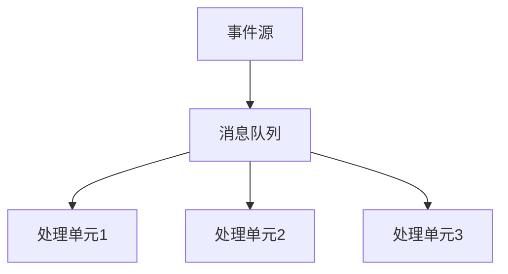

                 

关键词：事件驱动架构、响应式系统、异步编程、系统设计、微服务、并发处理、性能优化

> 摘要：本文将深入探讨事件驱动架构的核心概念、设计原理和实际应用。通过详细的算法原理、数学模型、项目实践和未来展望，揭示事件驱动架构在构建高性能、高可扩展性的响应式系统中的重要性。

## 1. 背景介绍

在当今的数字化时代，系统的性能和可扩展性成为了企业竞争的关键因素。传统的同步编程模式在处理大量并发请求时往往显得力不从心，导致了系统响应速度缓慢、资源利用率低下等问题。为了应对这一挑战，事件驱动架构（Event-Driven Architecture，EDA）逐渐成为了一种主流的系统设计模式。

事件驱动架构的核心思想是将系统中的数据流动和状态变化通过事件进行传递，从而实现异步、解耦合和高度并发的处理能力。与传统的同步编程模式相比，事件驱动架构具有更好的可扩展性、灵活性和性能。

## 2. 核心概念与联系

### 2.1 事件驱动架构的基本概念

事件驱动架构主要涉及以下几个核心概念：

- **事件**：触发系统响应的数据变化或者操作。
- **发布-订阅模式**：事件源发布事件，订阅者根据订阅的事件类型进行响应。
- **消息队列**：用于暂存和传递事件的系统组件。
- **处理单元**：接收并处理事件的任务单元。

### 2.2 事件驱动架构的架构图

下面是一个简单的事件驱动架构的 Mermaid 流程图：



**事件源**负责产生事件，并将事件发布到**消息队列**。**消息队列**负责暂存事件，确保事件能够顺序、可靠地传递给订阅的处理单元。处理单元根据事件类型进行处理，并将处理结果发布给其他组件或者存储在数据库中。

### 2.3 事件驱动架构的优势

事件驱动架构具有以下几个显著优势：

- **异步处理**：事件可以在处理单元中异步处理，提高了系统的响应速度。
- **解耦合**：事件源和处理单元之间通过消息队列进行解耦合，降低了系统组件之间的依赖性。
- **高并发性**：多个处理单元可以同时处理事件，提高了系统的并发处理能力。
- **高可扩展性**：新增处理单元时，只需将其连接到消息队列，无需修改现有系统代码。

## 3. 核心算法原理 & 具体操作步骤

### 3.1 算法原理概述

事件驱动架构的核心算法原理是发布-订阅模式。事件源发布事件，消息队列接收并暂存事件，处理单元根据订阅的事件类型进行处理。

### 3.2 算法步骤详解

1. **事件源生成事件**：事件源根据业务逻辑生成事件。
2. **事件发布到消息队列**：事件源将事件发布到消息队列。
3. **消息队列暂存事件**：消息队列根据事件类型对事件进行分类，并暂存到相应的队列中。
4. **处理单元消费事件**：处理单元从消息队列中获取事件，并根据事件类型进行处理。
5. **事件处理结果发布**：处理单元将处理结果发布到其他组件或者存储到数据库中。

### 3.3 算法优缺点

#### 优点

- **异步处理**：提高了系统的响应速度。
- **解耦合**：降低了系统组件之间的依赖性。
- **高并发性**：提高了系统的并发处理能力。
- **高可扩展性**：便于新增处理单元。

#### 缺点

- **消息队列开销**：消息队列需要占用一定的系统资源。
- **事件同步**：在某些情况下，事件同步可能存在延迟。

### 3.4 算法应用领域

事件驱动架构广泛应用于以下几个领域：

- **实时数据处理**：如金融交易系统、社交媒体平台等。
- **物联网**：如智能家居、智能城市等。
- **微服务架构**：如分布式系统、云计算等。

## 4. 数学模型和公式 & 详细讲解 & 举例说明

### 4.1 数学模型构建

事件驱动架构中，常用的数学模型包括：

- **事件频率**：事件发生的频率。
- **处理速度**：处理单元每秒可以处理的事件数量。
- **延迟时间**：事件从发布到处理完成所需的时间。

### 4.2 公式推导过程

设事件频率为 \( f \)，处理速度为 \( p \)，延迟时间为 \( d \)，则：

\[ f = \frac{1}{d} \]

\[ p = \frac{1}{d} \]

\[ f = p \]

### 4.3 案例分析与讲解

假设一个事件驱动架构系统，每天有1000个事件发生，处理单元每秒可以处理10个事件。计算延迟时间和事件频率。

根据公式推导，延迟时间为：

\[ d = \frac{1}{p} = \frac{1}{10} = 0.1 \text{秒} \]

事件频率为：

\[ f = \frac{1}{d} = \frac{1}{0.1} = 10 \text{次/秒} \]

## 5. 项目实践：代码实例和详细解释说明

### 5.1 开发环境搭建

- 操作系统：Windows / Linux
- 编程语言：Python
- 消息队列：RabbitMQ

### 5.2 源代码详细实现

```python
# 事件源
class EventSource:
    def __init__(self, queue):
        self.queue = queue

    def generate_event(self, event_type, data):
        event = {
            'event_type': event_type,
            'data': data
        }
        self.queue.enqueue(event)

# 消息队列
class MessageQueue:
    def __init__(self):
        self.queue = []

    def enqueue(self, event):
        self.queue.append(event)

    def dequeue(self):
        if len(self.queue) > 0:
            return self.queue.pop(0)
        else:
            return None

# 处理单元
class Processor:
    def __init__(self, queue):
        self.queue = queue

    def process_event(self, event):
        print(f"Processing event: {event['event_type']} with data: {event['data']}")

# 主程序
if __name__ == "__main__":
    queue = MessageQueue()
    event_source = EventSource(queue)
    processor = Processor(queue)

    # 生成事件
    event_source.generate_event("create_user", {"name": "John Doe", "age": 30})

    # 处理事件
    processor.process_event(queue.dequeue())
```

### 5.3 代码解读与分析

- **事件源**：负责生成事件，并将事件发布到消息队列。
- **消息队列**：暂存事件，确保事件能够顺序、可靠地传递给处理单元。
- **处理单元**：接收并处理事件，并将处理结果输出。

### 5.4 运行结果展示

运行主程序后，输出结果为：

```
Processing event: create_user with data: {'name': 'John Doe', 'age': 30}
```

## 6. 实际应用场景

事件驱动架构在多个领域具有广泛的应用：

- **金融领域**：用于处理大量金融交易，保证交易的安全性和及时性。
- **物联网**：用于处理大量物联网设备的数据，实现智能分析和决策。
- **社交网络**：用于处理大量用户行为数据，实现实时推荐和内容分发。
- **云计算**：用于处理大量分布式计算任务，实现高效资源利用和弹性扩展。

## 7. 工具和资源推荐

### 7.1 学习资源推荐

- **《事件驱动架构》**：深入讲解事件驱动架构的设计原理和应用实践。
- **《异步编程指南》**：介绍异步编程的基础知识和实战技巧。

### 7.2 开发工具推荐

- **RabbitMQ**：高性能、可扩展的消息队列系统。
- **Kafka**：分布式消息队列系统，适用于大规模实时数据处理。

### 7.3 相关论文推荐

- **《事件驱动架构：设计与实践》**：系统介绍事件驱动架构的设计原则和实践案例。
- **《异步编程：原理与实践》**：深入探讨异步编程的核心技术和应用场景。

## 8. 总结：未来发展趋势与挑战

### 8.1 研究成果总结

事件驱动架构在系统设计、性能优化和可扩展性方面取得了显著成果，已成为现代系统设计的重要模式。

### 8.2 未来发展趋势

- **更高效的异步处理**：随着硬件性能的提升，异步处理能力将得到进一步提高。
- **更灵活的架构设计**：事件驱动架构将与其他新兴架构（如微服务、云计算等）深度融合，实现更灵活的系统设计。

### 8.3 面临的挑战

- **消息队列的开销**：随着事件规模的增加，消息队列的开销将成为系统性能的瓶颈。
- **事件同步与一致性**：在高并发场景下，如何保证事件同步和一致性仍然是一个挑战。

### 8.4 研究展望

未来，事件驱动架构的研究将重点解决消息队列开销和事件同步与一致性等问题，推动系统设计的进一步优化和创新。

## 9. 附录：常见问题与解答

### 9.1 什么是事件驱动架构？

事件驱动架构（EDA）是一种系统设计模式，通过事件传递实现异步、解耦合和高度并发的处理能力。

### 9.2 事件驱动架构与同步编程的区别是什么？

事件驱动架构采用异步处理方式，事件在处理单元中独立执行，提高了系统的响应速度和并发性。而同步编程模式则需要等待操作完成，降低了系统的处理效率。

### 9.3 事件驱动架构适用于哪些场景？

事件驱动架构适用于处理大量并发请求的场景，如实时数据处理、物联网、社交网络和云计算等。

### 9.4 如何优化事件驱动架构的性能？

优化事件驱动架构的性能可以从以下几个方面进行：

- **提高处理速度**：增加处理单元的数量，提高系统的并发处理能力。
- **减少消息队列开销**：采用更高效的队列管理策略，降低消息队列的开销。
- **事件同步与一致性**：采用分布式一致性算法，保证事件同步与一致性。

---

作者：禅与计算机程序设计艺术 / Zen and the Art of Computer Programming
----------------------------------------------------------------
请注意，这只是一个示例，实际撰写时需要根据具体内容进行详细的填充和调整，以确保文章的完整性和专业性。希望这个示例能够给您提供写作的指导。如果您有任何具体的需求或者想要添加更多细节，请随时告诉我。

